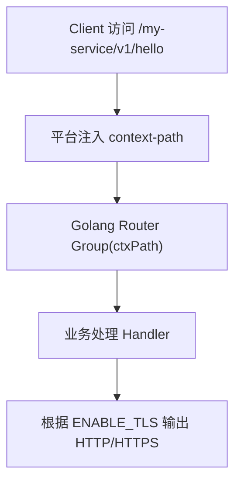

平台强制注入 Context-Path（Golang 版本）详解与最佳实践

```yaml
apiVersion: v1
kind: ConfigMap
metadata:
  namespace: ${namespace}
  name: mycoat-common-sprint-conf
data:
  server-conf.properties: |
    # 强制统一端口
    server.port=8443
    # 强制开启 SSL
    server.ssl.enabled=true
    server.ssl.key-store=/opt/keystore/mycoat-sbrt.p12
    server.ssl.key-store-type=PKCS12
    server.ssl.key-store-password=${KEY_STORE_PWD}
    # 统一 Context Path (Servlet 栈)
    server.servlet.context-path=/${apiName}/v${minorVersion}
    # 统一 Base Path (WebFlux 栈)
    sprint.webflux.base-path=/${apiName}/v${minorVersion}
```

1. 问题分析

平台在部署服务时经常需要为所有 API 统一注入一个 context-path（如 /service-a/v1），以便：
	•	对不同团队/应用的 API 进行逻辑隔离
	•	简化网关路由编排
	•	统一安全策略（ACL、WAF、Quota）
	•	兼容多语言应用（Java / Go / Node）

Java SpringBoot 内建 server.servlet.context-path，但 Golang 没有默认 context-path 机制，因此平台必须在部署时统一定义，并要求应用遵从某种路径结构或由平台自动注入。

本文件将说明 Golang 应用如何适配 context-path，并同时适配 HTTP/HTTPS。

⸻

2. 解决方案

Golang 中最推荐的方案：利用路由前缀统一挂载 (Router Group / ServeMux 组合)。

✔ 平台做的事情

平台在部署应用时固定下列环境变量：
```yaml
APP_CONTEXT_PATH="/my-service/v1"
APP_PORT=8443
ENABLE_TLS=true
TLS_CERT_PATH="/etc/tls/tls.crt"
TLS_KEY_PATH="/etc/tls/tls.key"
```
✔ 应用做的事情（Golang）
	•	应用程序 从环境变量读取 context-path
	•	使用路由器框架（Gin / Chi / net/http）统一挂载
	•	对外所有 API 自动带上 context-path
	•	支持 HTTP/HTTPS 动态切换

⸻

3. 代码示例（Golang）

以下例子使用 Gin（最常用）：
```go
package main

import (
    "log"
    "net/http"
    "os"

    "github.com/gin-gonic/gin"
)

func main() {
    ctxPath := os.Getenv("APP_CONTEXT_PATH")
    if ctxPath == "" {
        ctxPath = "/" // fallback
    }

    enableTLS := os.Getenv("ENABLE_TLS") == "true"
    port := os.Getenv("APP_PORT")
    if port == "" {
        port = "8443"
    }

    r := gin.Default()

    // 使用 Group 实现 context-path 注入
    api := r.Group(ctxPath)
    {
        api.GET("/health", func(c *gin.Context) {
            c.JSON(http.StatusOK, gin.H{"status": "ok"})
        })

        api.GET("/hello", func(c *gin.Context) {
            c.JSON(200, gin.H{"message": "hello from golang"})
        })
    }

    // 选择 HTTP 或 HTTPS
    addr := ":" + port

    if enableTLS {
        cert := os.Getenv("TLS_CERT_PATH")
        key := os.Getenv("TLS_KEY_PATH")
        log.Printf("Starting HTTPS server on %s with context-path %s", addr, ctxPath)
        log.Fatal(r.RunTLS(addr, cert, key))
    }

    log.Printf("Starting HTTP server on %s with context-path %s", addr, ctxPath)
    log.Fatal(r.Run(addr))
}
```

⸻

4. 请求流程图


⸻

5. 平台部署最佳实践

6. 平台统一注入环境变量

环境变量	示例值	说明
APP_CONTEXT_PATH	/user-api/v1	应用入口前缀
APP_PORT	8443	服务监听端口
ENABLE_TLS	true	是否启用 HTTPS
TLS_CERT_PATH	/etc/tls/tls.crt	证书路径
TLS_KEY_PATH	/etc/tls/tls.key	私钥路径

2. 应用必须遵循的规范
	•	所有路由必须挂载在 ctxPath 下
	•	不允许硬编码 /api、/v1 等
	•	支持 HTTP 和 HTTPS 自动切换
	•	readiness/liveness 应用同样挂载在前缀下（平台可支持特例）

3. 平台支持清单
	•	Kong / Nginx / GKE Ingress 可依据 context-path 配置路由
	•	未来可支持自动化 API 文档聚合（基于前缀）
	•	可统一做 Quota、ACL、Authz 控制

⸻

6. 注意事项
	1.	Golang 没有像 Java 的内建 context-path，所以必须使用路由前缀
	2.	context-path 必须统一由平台管理，避免多团队自行定义造成冲突
	3.	必须确保应用 Pod 就绪后 context-path 路由正常工作
	4.	若使用 HTTPS，证书与 key 必须挂载到容器（如 Secret volume）
	5.	readinessProbe 也要注意路径：
```yaml
readinessProbe:
  httpGet:
    path: /my-service/v1/health
    port: 8443
```

⸻

若需要，我可以继续为你：
	•	生成基于 Chi 或 net/http 的版本
	•	生成 K8S Deployment + Ingress + Secret 的完整示例
	•	输出架构图与流量图（Mermaid）