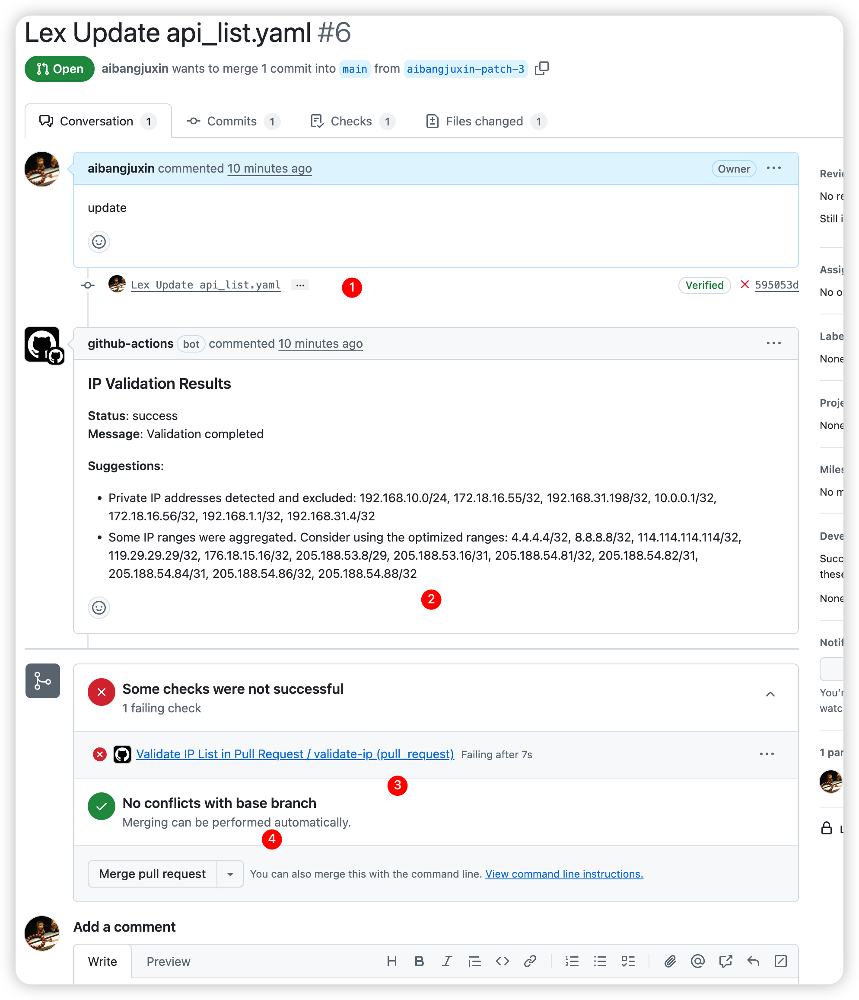
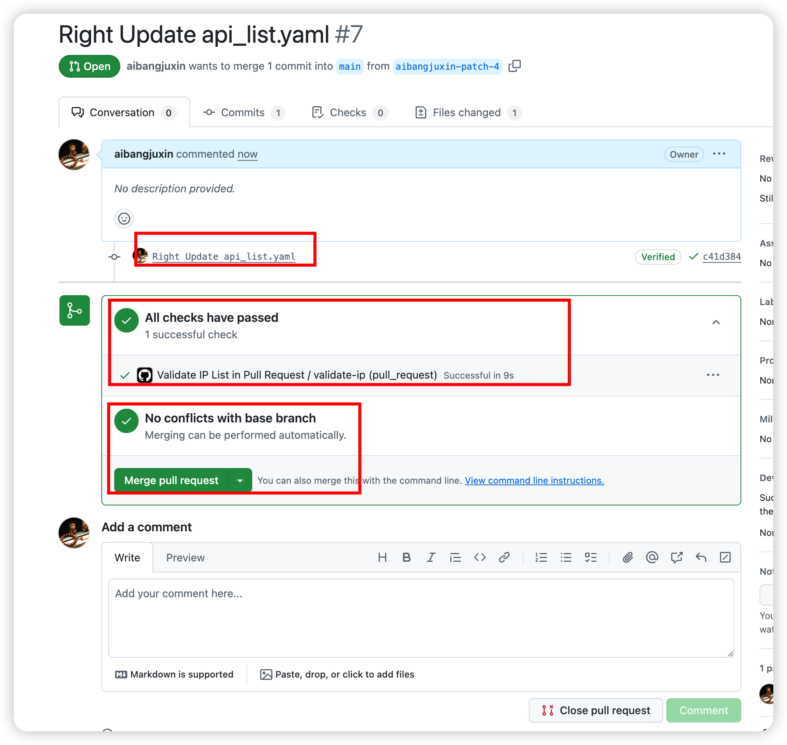
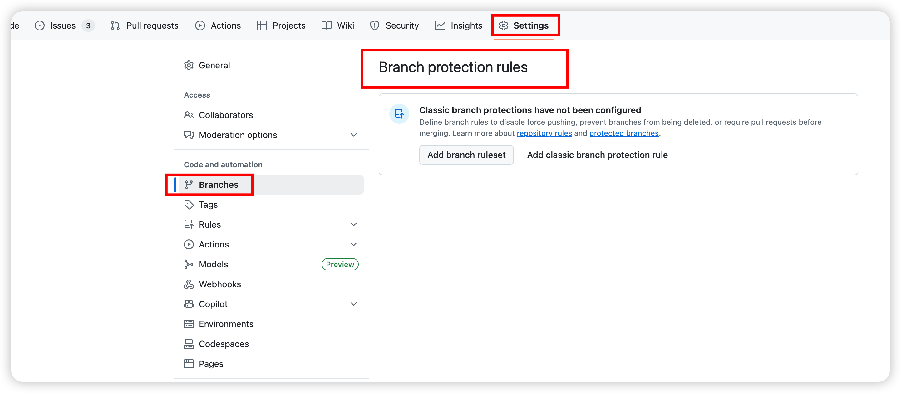
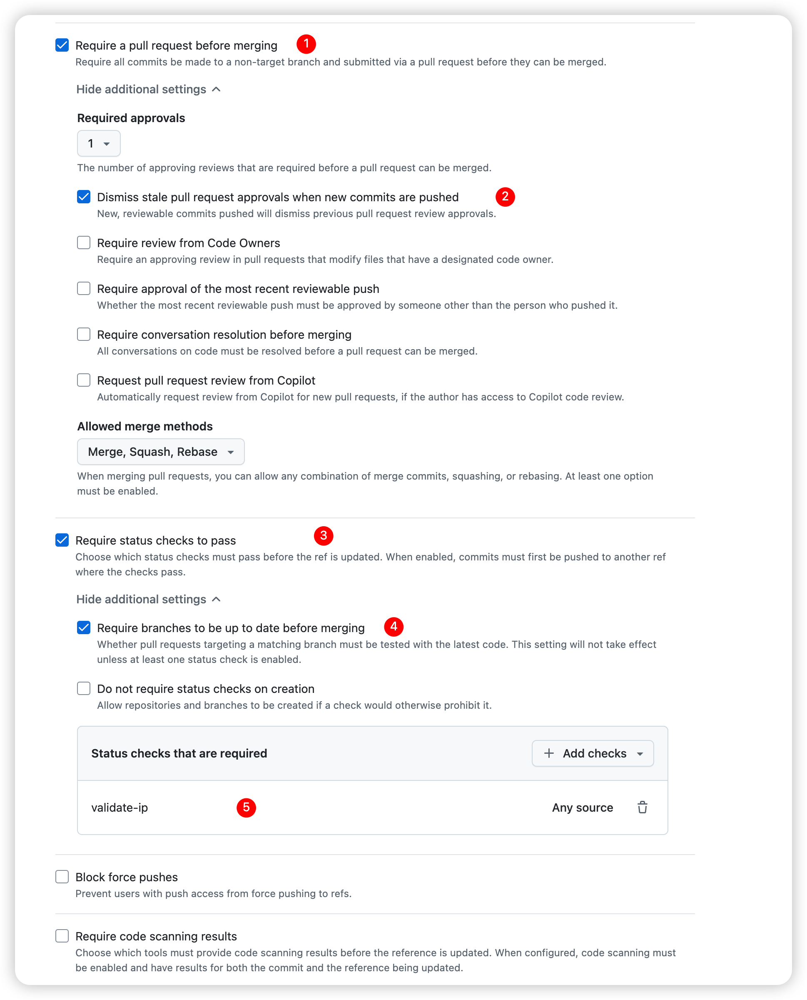
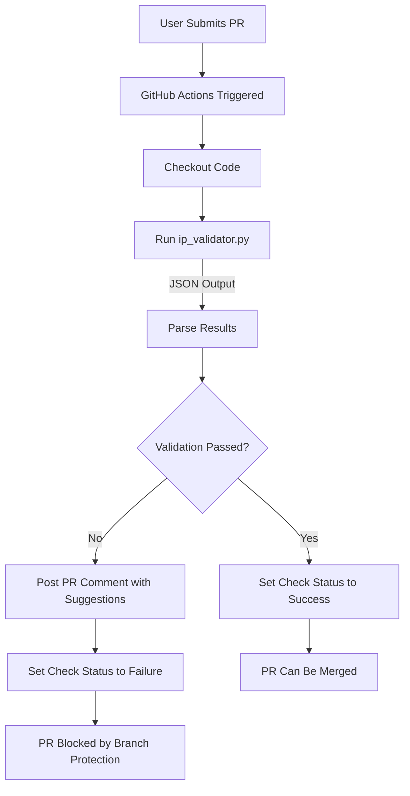
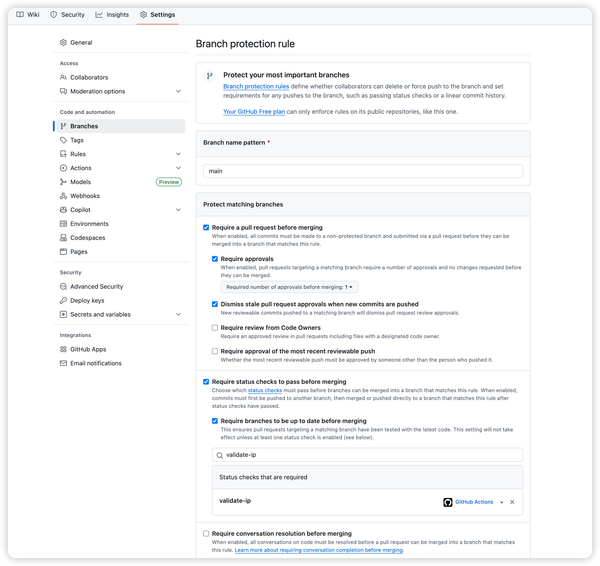

# Q

.我现在有这样一个问题,比如这个文件 api_list.yaml 是用户提交到 Git 的一个文件.如果用户修改了这个 Git 里面问题.其提交了一个 Pull Request,我们会经过审核然后 Merged 到 Master 分支,然后触发我们后面的逻辑.我现在想要实现在用户提交之后,是否能调用我的这个脚本,或者有这样一个逻辑校验.来验证用户的提交 IP 是否是合理的,然后给出建议. 关于这种需求一般如何来解决?

`python3 ip_validator.py api_list.yaml`

# Grok

你的需求是希望在用户提交 Pull Request (PR) 时，自动运行你的 Python 脚本 (`ip_validator.py`) 来验证 `api_list.yaml` 文件中 IP 地址的合理性，并在 Git 平台的 PR 界面中提供验证结果和建议。这种场景非常适合通过 **GitHub Actions** 或其他 CI/CD 工具实现自动化代码审查流程。以下是一个详细的解决方案，结合你的 Python 脚本和 GitHub 的 PR 审查流程，说明如何实现这一需求。

---

## 解决方案概述

1. **目标**：

    - 当用户提交 PR 并修改 `api_list.yaml` 文件时，自动运行你的 `ip_validator.py` 脚本。
    - 验证 `api_list.yaml` 中的 IP 地址是否合理（例如，排除私有 IP、合并重叠网段等）。
    - 在 PR 中以评论或状态检查的形式提供验证结果和建议（例如，哪些 IP 无效、是否可以合并等）。
    - 确保只有通过验证的 PR 才能合并到主分支。

2. **实现方式**：

    - 使用 **GitHub Actions** 作为自动化工具，在 PR 提交时触发脚本运行。
    - 修改你的 Python 脚本，使其输出结构化的验证结果，便于在 PR 中展示。
    - 配置 GitHub Actions 工作流，检查 PR 中修改的文件，运行脚本，并将结果反馈到 PR。
    - 可选地，使用分支保护规则确保只有通过验证的 PR 才能合并。

3. **工具与技术**：
    - **GitHub Actions**：GitHub 提供的 CI/CD 平台，用于运行脚本并与 PR 交互。
    - **GitHub API**：用于在 PR 中添加评论或设置状态检查。
    - **Python 脚本**：你的 `ip_validator.py`，稍作调整以适应 CI 环境。
    - **Branch Protection Rules**：确保 PR 必须通过验证才能合并。

---

## 实现步骤

### 1. 修改 Python 脚本以支持结构化输出

为了在 GitHub Actions 中更好地展示验证结果，需要调整你的 `ip_validator.py` 脚本，使其：

- 输出结构化的结果（例如 JSON 格式），便于 CI 解析。
- 返回明确的退出状态码（例如，0 表示成功，非 0 表示失败）。
- 提供详细的错误信息或建议，供 PR 评论使用。

以下是修改后的脚本示例，增加了 JSON 输出和退出状态码：

```python
import argparse
import ipaddress
import re
import sys
import json
import logging

def setup_logging():
    logging.basicConfig(
        level=logging.INFO,
        format='%(asctime)s - %(levelname)s - %(message)s'
    )

def extract_ips_from_file(file_path: str) -> set[str]:
    logging.info(f"Extracting IP addresses from '{file_path}'")
    ip_pattern = re.compile(r'\b(?:(?:25[0-5]|2[0-4][0-9]|[01]?[0-9][0-9]?)\.){3}(?:25[0-5]|2[0-4][0-9]|[01]?[0-9][0-9]?)(?:/[0-2]?[0-9]|/3[0-2])?\b')
    unique_ips = set()
    try:
        with open(file_path, 'r') as f:
            for line in f:
                found_ips = ip_pattern.findall(line)
                unique_ips.update(found_ips)
        logging.info(f"Found {len(unique_ips)} unique IP/CIDR strings.")
        return unique_ips
    except FileNotFoundError:
        logging.error(f"Input file '{file_path}' not found.")
        sys.exit(1)
    except Exception as e:
        logging.error(f"Error reading or parsing the file: {e}")
        sys.exit(1)

def process_ip_list(ip_strings: set[str]) -> tuple[list, list, list]:
    logging.info("Filtering, removing subsumed networks, and aggregating")
    public_networks = []
    invalid_ips = []
    private_ips = []
    for cidr_str in ip_strings:
        try:
            net = ipaddress.ip_network(cidr_str, strict=False)
            if net.is_private:
                logging.info(f"  [Excluding] {str(net):<18} (Private address)")
                private_ips.append(cidr_str)
                continue
            public_networks.append(net)
        except ValueError:
            logging.warning(f"  [Ignoring]  '{cidr_str}' is not a valid IP address or CIDR.")
            invalid_ips.append(cidr_str)

    if not public_networks:
        return [], invalid_ips, private_ips

    logging.info("Performing network aggregation...")
    optimized_networks = list(ipaddress.collapse_addresses(public_networks))
    logging.info(f"Processing complete. Resulted in {len(optimized_networks)} optimized network ranges.")
    return optimized_networks, invalid_ips, private_ips

def main():
    setup_logging()
    parser = argparse.ArgumentParser(description="Extract and optimize IP/CIDR ranges from a file.")
    parser.add_argument("input_file", help="Path to the input file containing IP/CIDR strings.")
    parser.add_argument("--output", "-o", help="Path to save the optimized IP ranges.", default=None)
    parser.add_argument("--json-output", action="store_true", help="Output results in JSON format.")
    args = parser.parse_args()

    unique_ip_strings = extract_ips_from_file(args.input_file)
    if not unique_ip_strings:
        logging.info("No IP/CIDR addresses found in the file.")
        if args.json_output:
            print(json.dumps({"status": "error", "message": "No IP/CIDR addresses found", "results": [], "invalid_ips": [], "private_ips": []}))
        sys.exit(1)

    final_list, invalid_ips, private_ips = process_ip_list(unique_ip_strings)

    results = {
        "status": "success" if final_list else "warning",
        "message": "Validation completed",
        "results": [str(net) for net in sorted(final_list)],
        "invalid_ips": invalid_ips,
        "private_ips": private_ips
    }

    suggestions = []
    if invalid_ips:
        suggestions.append("Invalid IP addresses detected. Please correct the following: " + ", ".join(invalid_ips))
    if private_ips:
        suggestions.append("Private IP addresses detected and excluded: " + ", ".join(private_ips))
    if len(final_list) < len(unique_ip_strings) - len(invalid_ips) - len(private_ips):
        suggestions.append("Some IP ranges were aggregated. Consider using the optimized ranges: " + ", ".join(str(net) for net in sorted(final_list)))

    results["suggestions"] = suggestions

    if args.json_output:
        print(json.dumps(results, indent=2))
    else:
        logging.info("\nFinal Optimized IP Address Ranges")
        if invalid_ips:
            logging.info("Invalid IP/CIDR strings encountered:")
            for ip in invalid_ips:
                logging.info(f"  {ip}")
        if private_ips:
            logging.info("Private IP addresses excluded:")
            for ip in private_ips:
                logging.info(f"  {ip}")
        if not final_list:
            logging.info("No valid public IP address ranges to output.")
        else:
            output_lines = [str(network) for network in sorted(final_list)]
            for line in output_lines:
                print(line)
            if args.output:
                try:
                    with open(args.output, 'w') as f:
                        f.write('\n'.join(output_lines))
                    logging.info(f"Results saved to '{args.output}'")
                except Exception as e:
                    logging.error(f"Error writing to output file: {e}")
        if suggestions:
            logging.info("\nSuggestions for improvement:")
            for suggestion in suggestions:
                logging.info(f"  - {suggestion}")
        logging.info("-------------------------------------")

    # Exit with non-zero status if there are invalid IPs or private IPs
    if invalid_ips or private_ips:
        sys.exit(1)
    sys.exit(0)

if __name__ == "__main__":
    main()
```

**主要修改**：

- 添加了 `--json-output` 参数，输出 JSON 格式的结果，便于 GitHub Actions 解析。
- `process_ip_list` 返回私有 IP 列表，增强错误报告。
- 添加了 `suggestions` 字段，提供改进建议（例如，修正无效 IP 或使用优化后的网段）。
- 根据验证结果设置退出状态码（0 表示成功，1 表示有无效或私有 IP），便于 CI 检测失败。
- 使用 `logging` 替代 `print`，提高日志可控性。

**测试运行**：

```bash
python3 ip_validator.py api_list.yaml --json-output
```

输出示例：

```json
2025-06-21 08:30:05,989 - INFO - Extracting IP addresses from 'api_list.yaml'
2025-06-21 08:30:05,989 - INFO - Found 26 unique IP/CIDR strings.
2025-06-21 08:30:05,989 - INFO - Filtering, removing subsumed networks, and aggregating
2025-06-21 08:30:05,989 - INFO -   [Excluding] 192.168.10.0/24    (Private address)
2025-06-21 08:30:05,989 - INFO -   [Excluding] 192.168.31.198/32  (Private address)
2025-06-21 08:30:05,990 - INFO -   [Excluding] 10.0.0.1/32        (Private address)
2025-06-21 08:30:05,990 - INFO -   [Excluding] 192.168.1.1/32     (Private address)
2025-06-21 08:30:05,990 - INFO - Performing network aggregation...
2025-06-21 08:30:05,990 - INFO - Processing complete. Resulted in 12 optimized network ranges.
{
  "status": "success",
  "message": "Validation completed",
  "results": [
    "4.4.4.4/32",
    "8.8.8.8/32",
    "114.114.114.114/32",
    "119.29.29.29/32",
    "176.18.15.16/32",
    "205.188.53.8/29",
    "205.188.53.16/31",
    "205.188.54.81/32",
    "205.188.54.82/31",
    "205.188.54.84/31",
    "205.188.54.86/32",
    "205.188.54.88/32"
  ],
  "invalid_ips": [],
  "private_ips": [
    "192.168.10.0/24",
    "192.168.31.198/32",
    "10.0.0.1/32",
    "192.168.1.1/32"
  ],
  "suggestions": [
    "Private IP addresses detected and excluded: 192.168.10.0/24, 192.168.31.198/32, 10.0.0.1/32, 192.168.1.1/32",
    "Some IP ranges were aggregated. Consider using the optimized ranges: 4.4.4.4/32, 8.8.8.8/32, 114.114.114.114/32, 119.29.29.29/32, 176.18.15.16/32, 205.188.53.8/29, 205.188.53.16/31, 205.188.54.81/32, 205.188.54.82/31, 205.188.54.84/31, 205.188.54.86/32, 205.188.54.88/32"
  ]
}
```

---

### 2. 创建 GitHub Actions 工作流

GitHub Actions 是一个强大的自动化工具，可以在 PR 提交时运行你的脚本，并将结果反馈到 PR。以下是一个工作流配置，用于检查 `api_list.yaml` 的修改并运行验证脚本。

#### 工作流文件

在你的 Git 仓库中，创建文件 `.github/workflows/validate-ip-list.yml`：

```yaml
name: Validate IP List in Pull Request

on:
  pull_request:
    paths:
      - 'api_list.yaml' #注意这个也是更新文件需要在根目录trigger

permissions:
  issues: write        # 允许在问题（包括 PR 评论）上写操作
  pull-requests: write # 允许在 PR 上写操作
  contents: read       # 允许读取仓库内容（用于 checkout）


jobs:
  validate-ip:
    runs-on: ubuntu-latest
    steps:
      - name: Checkout repository
        uses: actions/checkout@v4

      - name: Set up Python
        uses: actions/setup-python@v5
        with:
          python-version: '3.x'

      - name: Install dependencies
        run: |
          python -m pip install --upgrade pip
          pip install ipaddress

      - name: Run IP validator
        id: validate
        run: |
          python ip_validator.py api_list.yaml --json-output > results.json
          cat results.json # 注意这个ip_validator.py目前在根目录
        continue-on-error: true

      - name: Parse validation results
        id: parse
        run: |
          status=$(jq -r '.status' results.json)
          message=$(jq -r '.message' results.json)
          suggestions=$(jq -r '.suggestions | join("\n")' results.json)
          echo "status=$status" >> $GITHUB_OUTPUT
          echo "message=$message" >> $GITHUB_OUTPUT
          echo "suggestions<<EOF" >> $GITHUB_OUTPUT
          echo "$suggestions" >> $GITHUB_OUTPUT
          echo "EOF" >> $GITHUB_OUTPUT

      - name: Comment on PR
        if: steps.validate.outcome != 'success'
        uses: actions/github-script@v7
        with:
          script: |
            const fs = require('fs');
            const results = JSON.parse(fs.readFileSync('results.json'));
            const suggestions = results.suggestions.join('\n- ');
            const comment = `### IP Validation Results\n\n**Status**: ${results.status}\n**Message**: ${results.message}\n\n**Suggestions**:\n- ${suggestions}`;
            github.rest.issues.createComment({
              owner: context.repo.owner,
              repo: context.repo.repo,
              issue_number: context.issue.number,
              body: comment
            });

      - name: Set check status
        if: steps.validate.outcome != 'success'
        run: |
          echo "Validation failed: ${{ steps.parse.outputs.message }}"
          echo "${{ steps.parse.outputs.suggestions }}"
          exit 1
```

**工作流说明**：

- **触发条件**：在 PR 修改 `api_list.yaml` 文件时触发。
- **步骤**：
    1. 检出代码库。
    2. 设置 Python 环境。
    3. 安装依赖（`ipaddress` 模块）。
    4. 运行 `ip_validator.py`，输出 JSON 结果到 `results.json`。
    5. 使用 `jq` 解析 JSON 输出，提取状态、消息和建议。
    6. 如果验证失败（退出状态码非 0），在 PR 中添加评论，包含验证结果和建议。
    7. RequestError [HttpError]: Resource not accessible by integration
    8. 设置检查状态，如果验证失败，工作流失败，阻止 PR 合并（需配合分支保护规则）。
    9. 我目前是检测失败还能允许合并 1.
    10. 完成的没有错误的
        1. 
    11. 可以调整检测失败禁止合并

**依赖工具**：

- `jq`：用于解析 JSON 输出，GitHub Actions 的 `ubuntu-latest` 环境默认包含。
- `actions/checkout@v4`：检出代码。
- `actions/setup-python@v5`：设置 Python 环境。
- `actions/github-script@v7`：通过 GitHub API 添加 PR 评论。

---

### 3. 配置分支保护规则

为了确保只有通过验证的 PR 才能合并到 `master` 分支，配置 GitHub 的分支保护规则：

1. 前往 GitHub 仓库的 **Settings > Branches**。
2. 在 **Branch protection rules** 下，点击 **Add rule** 或编辑 `master` 分支的规则。
    1. 
3. 启用以下选项：
    - \*\*Require status checks to pass
        - Require branches to be up to date before merging ：选择 `validate-ip` 工作流。
        - 
    - **Require pull request reviews before merging**：
        - Required approvals 确保至少一名审核者批准。
        - **Dismiss stale pull request approvals when new commits are pushed**：当 PR 更新时，重新验证。
4. 保存设置。
5. Actions 里面可以看到创建的 workflows ==> Validate IP List in Pull Request

这样，只有当 `validate-ip` 工作流通过（即脚本返回退出码 0）时，PR 才能合并。

---

### 4. PR 反馈示例

假设用户提交了一个 PR，修改了 `api_list.yaml`，包含以下内容：

```yaml
ips:
  - 192.168.1.0/24
  - 203.0.113.0/24
  - 203.0.113.128/25
  - 999.999.999.999
```

**GitHub Actions 运行后**，会在 PR 中添加以下评论：

```
### IP Validation Results

**Status**: warning
**Message**: Validation completed

**Suggestions**:
- Invalid IP addresses detected. Please correct the following: 999.999.999.999
- Private IP addresses detected and excluded: 192.168.1.0/24
- Some IP ranges were aggregated. Consider using the optimized ranges: 203.0.113.0/23
```

同时，`validate-ip` 检查会失败，阻止 PR 合并，直到用户修正无效或私有 IP。

---

### 5. 高级优化建议

以下是一些进一步优化的建议，结合 GitHub 的 PR 审查流程和搜索结果中的最佳实践：

1. **自动化审查分配**：

    - 使用工具如 **PullApprove** 或 **CODEOWNERS** 文件，自动为 `api_list.yaml` 的修改分配特定审查者（例如网络管理员）。[](https://www.pullapprove.com/)
    - 示例 `CODEOWNERS` 文件：
        ```
        api_list.yaml @network-team
        ```
        将 `api_list.yaml` 的审查分配给 `@network-team`。

2. **集成第三方审查工具**：

    - 使用 **Danger** 或 **Code Inspector** 扩展自动化审查，检查代码风格、文档完整性等。[](https://www.freecodecamp.org/news/how-to-automate-code-reviews-on-github-41be46250712/)[](https://devopscube.com/automating-code-reviews-github/)
    - 在 `Dangerfile` 中调用你的 `ip_validator.py` 脚本，并将结果整合到 PR 评论中。

3. **增强建议内容**：

    - 如果 IP 无效，提供更具体的修正建议（例如，推荐有效的公共 IP 范围）。
    - 使用 GitHub API 的 `pulls/reviews` 端点，在特定行添加评论，指出无效 IP 的位置。[](https://docs.github.com/en/rest/pulls/reviews)

4. **支持 IPv6**：

    - 如前所述，扩展脚本支持 IPv6 地址（添加 IPv6 regex 和 `ipaddress` 处理），以适应未来的网络需求。

5. **性能优化**：

    - 如果 `api_list.yaml` 很大，考虑在 GitHub Actions 中只处理 PR 的差异部分（使用 `git diff` 或 GitHub API 的 `pulls/files` 端点）。[](https://www.freecodecamp.org/news/how-to-automate-code-reviews-on-github-41be46250712/)

6. **通知集成**：
    - 将验证结果发送到 Slack 或其他平台，通知团队。GitLoop 等工具支持此类集成。[](https://www.gitloop.com/feature/pulls-and-commits-review)

---

## 实现架构图

以下是实现流程的 Mermaid 图：



---

## 其他实现方式

如果不使用 GitHub Actions，还可以考虑以下替代方案：

1. **GitLab CI/CD**：
    - 如果使用 GitLab，创建类似的 `.gitlab-ci.yml` 文件，运行脚本并通过 GitLab API 添加 MR 评论。[](https://medium.com/%40kedargmnv/automating-code-review-with-openai-in-your-gitlab-workflow-c18b894bf632)
2. **Jenkins**：
    - 配置 Jenkins 流水线，在 PR 触发时运行脚本，并使用 GitHub API 更新 PR 状态。
3. **Custom GitHub App**：
    - 开发一个 GitHub App，使用 GitHub API 的 `pulls/reviews` 端点，运行脚本并提供更精细的审查反馈。[](https://platform.github.community/t/api-endpoint-for-pr-reviews/409)

---

## 结论

通过 GitHub Actions 结合修改后的 `ip_validator.py`，你可以实现：

- 自动验证 PR 中 `api_list.yaml` 的 IP 地址。
- 在 PR 中提供详细的验证结果和建议。
- 通过分支保护规则确保只有有效 IP 的 PR 才能合并。

这种方法低侵入性，易于维护，且可扩展到更复杂的验证需求。如果需要进一步定制（例如，IPv6 支持、特定行评论、或与其他工具集成），请告诉我，我可以提供更详细的实现！

## 阻止 PR 合并或者允许 PR 合并

现在看起来是可以了 到了下一步
Set check Status
Error: Process completed with exit code 1. 所以应该是我的内容有不合规的
但是后面报了 No conflicts with base branch 没有冲突可以合并到 Master
其实我期待的是在这里既然有错误那就要不允许合并到 Master 如何修改?

从你的描述来看，GitHub Actions 工作流现在已经运行到 `Set check status` 步骤，但由于 `ip_validator.py` 脚本返回了退出码 1（表示验证失败，例如检测到无效或私有 IP），工作流以错误状态结束（`Error: Process completed with exit code 1`）。然而，PR 仍然显示“No conflicts with base branch”，并且可以合并到 `main` 分支。这是因为你的分支保护规则可能没有正确配置，导致 `validate-ip` 状态检查的失败没有阻止 PR 合并。

你的期望是：当 `ip_validator.py` 检测到不合规内容（例如私有 IP 或无效 IP）时，PR 不应允许合并到 `main` 分支。以下是分析和解决方法，帮助你确保分支保护规则阻止不合规的 PR 合并。

---

## 问题分析

1. **工作流失败但 PR 可合并**：

    - `Set check status` 步骤在 `steps.validate.outcome != 'success'` 时返回退出码 1，这表示 `ip_validator.py` 检测到问题（例如私有 IP 或无效 IP）。
    - 退出码 1 使 `validate-ip` job 失败，GitHub Actions 会在 PR 的 **Checks** 标签页标记 `validate-ip` 为失败（红色叉号）。
    - 但是，PR 仍然可以合并，说明分支保护规则没有要求 `validate-ip` 状态检查必须通过。

2. **分支保护规则问题**：

    - 你可能没有在 `main` 分支的保护规则中启用 **Require status checks to pass before merging**，或者没有将 `validate-ip` 添加到必需的状态检查列表。
    - 因此，即使 `validate-ip` 失败，GitHub 仍允许合并，因为没有强制要求所有检查通过。

3. **工作流逻辑**：
    - 当前工作流在 `Set check status` 步骤中明确返回 `exit 1`（失败），这已经正确反映了不合规内容。
    - 问题出在 GitHub 的分支保护配置，而不是工作流本身。

---

## 解决方法

为了确保当 `ip_validator.py` 检测到不合规内容时 PR 无法合并到 `main` 分支，你需要配置分支保护规则，要求 `validate-ip` 状态检查必须通过。以下是具体步骤：

### 步骤 1：检查工作流状态检查

确保 `validate-ip` 状态检查正确注册并在 PR 中显示为失败状态：

1. **打开 PR**：

    - 前往你的 PR（例如 `aibangjuxin/go` 的 PR #5）。
    - 在 **Checks** 标签页，确认 `validate-ip` 出现且标记为失败（红色叉号）。
    - 如果未看到 `validate-ip`，确保工作流已运行（见步骤 2）。

2. **触发工作流**：

    - 如果 `validate-ip` 未出现在 **Checks** 标签页，确认 `api_list.yaml` 是否在 PR 中被修改（因为 `paths: ['api_list.yaml']` 限制了触发条件）。
    - 提交一个修改 `api_list.yaml` 的 PR，例如：
        ```bash
        git checkout -b test-ip-validation
        echo "ips:\n  - 192.168.1.0/24" > api_list.yaml
        git add api_list.yaml
        git commit -m "Test IP validation"
        git push origin test-ip-validation
        ```
    - 打开 PR，检查 **Actions** 标签页，确认 `Validate IP List in Pull Request` 工作流运行并失败（由于私有 IP）。

3. **验证工作流逻辑**：
    - 你的 `ip_validator.py` 脚本在检测到无效或私有 IP 时返回退出码 1，这会使 `validate-ip` job 失败（正确行为）。
    - 确认 `Set check status` 步骤的条件 `if: steps.validate.outcome != 'success'` 触发，并输出类似：
        ```
        Validation failed: Validation completed
        - Private IP addresses detected and excluded: 192.168.1.1/32, ...
        - Some IP ranges were aggregated. Consider using the optimized ranges: ...
        ```

### 步骤 2：配置分支保护规则

配置 `main` 分支的保护规则，要求 `validate-ip` 状态检查必须通过才能合并 PR。

1. **打开分支保护设置**：

    - 前往 GitHub 仓库 `aibangjuxin/go` 的 **Settings > Branches**。
    - 在 **Branch protection rules** 下，点击 **Add rule**（或编辑现有的 `main` 分支规则）。

2. **设置分支保护规则**：

    - **Branch name pattern**：输入 `main`。
    - 启用以下选项：
        - **Require a pull request before merging**：确保需要 PR 才能合并。
        - **Require status checks to pass before merging**：
            - 勾选此选项。
            - 在 **Status checks** 搜索框中输入 `validate-ip`，选择它（前提是工作流已运行过至少一次）。
            - 如果 `validate-ip` 未出现，等待几分钟或重新触发 PR（见步骤 1）。
        - 可选：启用 **Require branches to be up to date before merging**，确保 PR 与 `main` 同步。
    - 保存规则。

3. **验证保护规则**：
    - 返回 PR，尝试合并。
    - 如果 `validate-ip` 状态检查失败（红色叉号），GitHub 将阻止合并，并显示类似：
        ```
        Required status check "validate-ip" failed
        ```
    - 只有当 `ip_validator.py` 返回退出码 0（即没有无效或私有 IP）时，`validate-ip` 才会通过，允许合并。

### 步骤 3：检查工作流文件

你的 `validate-ip-list.yml` 已经正确配置了 `Set check status` 步骤，确保失败时返回 `exit 1`。以下是关键部分的确认：

```yaml
      - name: Set check status
        if: steps.validate.outcome != 'success'
        run: |
          echo "Validation failed: ${{ steps.parse.outputs.message }}"
          echo "${{ steps.parse.outputs.suggestions }}"
          exit 1
```

- `if: steps.validate.outcome != 'success'` 确保在 `Run IP validator` 步骤失败（`ip_validator.py` 返回非 0 退出码）时运行。
- `exit 1` 使整个 `validate-ip` job 失败，导致状态检查失败。

**确认无误**：

- 你的 `ip_validator.py` 脚本在检测到无效或私有 IP 时返回 `sys.exit(1)`，这会触发 `Set check status` 步骤的失败。
- PR 评论中显示了不合规内容（例如私有 IP 列表），说明脚本逻辑正确。

**改进建议**（可选）：
为了更清晰地指示 PR 失败原因，可以在 `Set check status` 步骤添加更详细的错误信息：

```yaml
      - name: Set check status
        if: steps.validate.outcome != 'success'
        run: |
          echo "Validation failed: ${{ steps.parse.outputs.message }}"
          echo "${{ steps.parse.outputs.suggestions }}"
          echo "ERROR: PR cannot be merged due to invalid or private IP addresses. Please review suggestions and update api_list.yaml."
          exit 1
```

---

## 为什么 PR 显示“No conflicts with base branch”？

“No conflicts with base branch” 表示 PR 的代码与 `main` 分支没有合并冲突（即 Git 可以干净地合并更改）。这与状态检查（如 `validate-ip`）无关。合并冲突和状态检查是两个独立的检查：

- **合并冲突**：检查代码是否可以合并（由 Git 自动检测）。
- **状态检查**：检查工作流（如 `validate-ip`）是否通过。

即使没有合并冲突，如果 `validate-ip` 失败，分支保护规则应阻止合并，前提是规则正确配置了 `Require status checks to pass before merging`。

---

## 如果分支保护规则已配置但仍可合并

如果已配置了分支保护规则，但 PR 仍可合并，检查以下问题：

1. **状态检查未正确选择**：

    - 确认 **Settings > Branches > main > Require status checks to pass before merging** 中选择了 `validate-ip`。
    - 如果未出现 `validate-ip`，说明工作流未运行或 job ID 不正确。重新触发 PR（例如，推送空提交：`git commit --allow-empty -m "Trigger CI"`）。

2. **工作流未触发**：

    - 确认 PR 修改了 `api_list.yaml`，因为 `paths: ['api_list.yaml']` 限制了触发条件。
    - 检查 **Actions** 标签页，确认 `Validate IP List in Pull Request` 工作流已运行。

3. **组织权限限制**：

    - 如果仓库属于组织，检查 **Settings > Actions > General** 中的 **Workflow permissions**，确保 `GITHUB_TOKEN` 有 `contents: read` 和 `statuses: write` 权限。
    - 如果受限，联系组织管理员调整权限。

4. **旧 PR 未更新**：
    - 如果 PR 创建时分支保护规则尚未配置，现有 PR 可能不受新规则约束。
    - 解决方法：在 PR 分支推送一个新提交，触发工作流重新运行：
        ```bash
        git commit --allow-empty -m "Re-trigger CI"
        git push
        ```

---

## 验证修复效果

1. **测试 PR**：

    - 创建一个包含不合规 IP 的 `api_list.yaml`，例如：
        ```yaml
        ips:
          - 192.168.1.0/24  # 私有 IP，触发失败
          - 203.0.113.0/24
        ```
    - 提交 PR，触发工作流。
    - 检查 **Checks** 标签页，确认 `validate-ip` 失败并显示错误：
        ```
        Validation failed: Validation completed
        - Private IP addresses detected and excluded: 192.168.1.0/24
        ```

2. **检查 PR 合并状态**：

    - 尝试合并 PR，应看到提示：
        ```
        This branch has failed status checks that must pass before it can be merged.
        ```
    - 修复 `api_list.yaml`（移除私有 IP），重新提交，确认 `validate-ip` 通过后 PR 可合并。

3. **确认评论**：

    - PR 的 **Conversation** 标签页应显示类似：

        ```
        ### IP Validation Results

        **Status**: warning
        **Message**: Validation completed

        **Suggestions**:
        - Private IP addresses detected and excluded: 192.168.1.0/24
        ```

---

## 高级优化建议

1. **更详细的 PR 反馈**：

    - 修改 `ip_validator.py`，在 JSON 输出中添加更具体的修复建议（例如，推荐替换的公共 IP 范围）。
    - 示例：
        ```python
        suggestions.append("请将私有 IP 替换为公共 IP，例如 203.0.113.0/24")
        ```

2. **动态文件处理**：

    - 如果仓库有多个 `api_list.yaml` 文件（例如在不同目录），使用 `dorny/paths-filter@v3` 动态检测修改文件：
        ```yaml
        - uses: dorny/paths-filter@v3
          id: filter
          with:
            filters: |
              api_list: '**/*.yaml'
        - name: Run IP validator
          if: steps.filter.outputs.api_list == 'true'
          run: |
            for file in $(git diff --name-only origin/main...HEAD | grep 'api_list.yaml'); do
              python ip_validator.py "$file" --json-output > "results-$(basename $file).json"
            done
        ```

3. **通知团队**：
    - 在工作流中添加 Slack 或邮件通知，报告 PR 验证失败：
        ```yaml
        - name: Notify Slack
          if: failure()
          uses: slackapi/slack-github-action@v1.27.0
          with:
            slack-bot-token: ${{ secrets.SLACK_BOT_TOKEN }}
            channel-id: 'your-channel'
            text: 'PR #${{ github.event.pull_request.number }} failed IP validation: ${{ steps.parse.outputs.suggestions }}'
        ```

---

## 总结

要阻止不合规 PR 合并到 `main` 分支，需确保以下配置：

1. **工作流正确失败**：`ip_validator.py` 检测到私有/无效 IP 时返回 `exit 1`，使 `validate-ip` job 失败（已实现）。
2. **分支保护规则**：
    - 在 **Settings > Branches > main** 启用 **Require status checks to pass before merging**。
    - 选择 `validate-ip` 作为必需检查。
3. **测试验证**：提交包含不合规 IP 的 PR，确认 `validate-ip` 失败且 PR 无法合并。

如果仍可合并，请检查：

- 分支保护规则是否正确选择了 `validate-ip`。
- PR 是否在规则配置前创建（需要重新触发）。
- 组织是否限制了状态检查权限。

如需进一步调试，请提供：

- 分支保护规则的截图（**Settings > Branches**）。
- PR 的 **Checks** 标签页截图。
- 完整的 Actions 日志（特别是 `Set check status` 步骤）。

我可以帮你进一步确认问题并优化工作流！

# 完整的 validate-ip-list.yml

根据你的需求，你希望修改 GitHub Actions 工作流 `validate-ip-list.yml`，以支持验证仓库中 **任意目录** 下的多个 `api_list.yaml` 文件（例如 `api_list.yaml`、`config/api_list.yaml`、`src/api_list.yaml` 等）。原来的工作流逻辑只验证根目录下的 `api_list.yaml`，现在需要动态检测 PR 中修改的所有 `api_list.yaml` 文件，并对每个文件运行 `ip_validator.py` 脚本进行验证。

以下是一个完整的 `validate-ip-list.yml` 文件，实现了以下功能：

- 使用通配符 `**/*.yaml` 触发工作流，捕获所有目录下的 `api_list.yaml` 文件。
- 动态查找 PR 中修改的 `api_list.yaml` 文件。
- 对每个修改的 `api_list.yaml` 文件运行 `ip_validator.py`，生成单独的 JSON 输出。
- 在 PR 中汇总所有文件的验证结果，添加评论。
- 如果任何文件验证失败，设置状态检查为失败，阻止 PR 合并（配合分支保护规则）。

---

## 完整的工作流文件

```yaml
name: Validate IP List in Pull Request

on:
  pull_request:
    branches: [ main ]
    paths:
      - '**/*.yaml'  # 匹配所有目录下的 *.yaml 文件

permissions:
  issues: write        # 允许在 PR 上添加评论
  pull-requests: write # 允许操作 PR
  contents: read       # 允许读取仓库内容

jobs:
  validate-ip:
    runs-on: ubuntu-latest
    steps:
      - name: Checkout repository
        uses: actions/checkout@v4
        with:
          fetch-depth: 0  # 获取完整历史以比较差异

      - name: Find modified api_list.yaml files
        id: find-files
        run: |
          # 查找 PR 中修改的 api_list.yaml 文件
          modified_files=$(git diff --name-only origin/main...HEAD | grep 'api_list.yaml' || true)
          if [ -z "$modified_files" ]; then
            echo "No api_list.yaml files modified in this PR."
            echo "files=" >> $GITHUB_OUTPUT
          else
            echo "Found modified api_list.yaml files: $modified_files"
            echo "files=$modified_files" >> $GITHUB_OUTPUT
          fi

      - name: Set up Python
        uses: actions/setup-python@v5
        with:
          python-version: '3.x'

      - name: Install dependencies
        run: |
          python -m pip install --upgrade pip
          pip install ipaddress

      - name: Run IP validator
        id: validate
        if: steps.find-files.outputs.files != ''
        run: |
          # 初始化结果文件
          echo "[]" > all_results.json
          exit_code=0
          # 对每个修改的 api_list.yaml 文件运行验证
          for file in ${{ steps.find-files.outputs.files }}; do
            echo "Validating $file"
            if python ip_validator.py "$file" --json-output > "results-$(basename $file).json"; then
              echo "Validation succeeded for $file"
            else
              echo "Validation failed for $file"
              exit_code=1
            fi
            # 合并结果到 all_results.json
            jq -s '.[0] + [.[1]]' all_results.json "results-$(basename $file).json" > temp.json
            mv temp.json all_results.json
            cat "results-$(basename $file).json"
          done
          # 保存最终退出码
          echo "exit_code=$exit_code" >> $GITHUB_OUTPUT
        continue-on-error: true

      - name: Parse validation results
        id: parse
        if: steps.find-files.outputs.files != ''
        run: |
          # 解析所有验证结果
          comment_body="### IP Validation Results\n\n"
          all_suggestions=""
          all_status="success"
          # 遍历 all_results.json 中的每个文件结果
          length=$(jq 'length' all_results.json)
          for i in $(seq 0 $((length-1))); do
            file=$(jq -r ".[$i].file" all_results.json)
            status=$(jq -r ".[$i].status" all_results.json)
            message=$(jq -r ".[$i].message" all_results.json)
            suggestions=$(jq -r ".[$i].suggestions | join(\"\n- \")" all_results.json)
            comment_body+="**File**: $file\n**Status**: $status\n**Message**: $message\n"
            if [ -n "$suggestions" ]; then
              comment_body+="**Suggestions**:\n- $suggestions\n\n"
              all_suggestions+="- $file: $suggestions\n"
            else
              comment_body+="**Suggestions**: None\n\n"
            fi
            if [ "$status" != "success" ]; then
              all_status="warning"
            fi
          done
          echo "comment_body<<EOF" >> $GITHUB_OUTPUT
          echo "$comment_body" >> $GITHUB_OUTPUT
          echo "EOF" >> $GITHUB_OUTPUT
          echo "all_status=$all_status" >> $GITHUB_OUTPUT
          echo "all_suggestions<<EOF" >> $GITHUB_OUTPUT
          echo "$all_suggestions" >> $GITHUB_OUTPUT
          echo "EOF" >> $GITHUB_OUTPUT

      - name: Comment on PR
        if: steps.find-files.outputs.files != '' && steps.validate.outputs.exit_code != '0'
        uses: actions/github-script@v7
        with:
          script: |
            const comment = `${{ steps.parse.outputs.comment_body }}`;
            github.rest.issues.createComment({
              owner: context.repo.owner,
              repo: context.repo.repo,
              issue_number: context.issue.number,
              body: comment
            });

      - name: Set check status
        if: steps.find-files.outputs.files != '' && steps.validate.outputs.exit_code != '0'
        run: |
          echo "Validation failed for one or more api_list.yaml files:"
          echo "${{ steps.parse.outputs.all_suggestions }}"
          exit 1

      - name: No action needed
        if: steps.find-files.outputs.files == ''
        run: |
          echo "No api_list.yaml files were modified. Skipping validation."
```

---

## 工作流说明

### 1. **触发条件**

- `on: pull_request: paths: ['**/*.yaml']`：
    - 匹配 PR 中修改的任意目录下的 `*.yaml` 文件。
    - 使用 `**/*.yaml` 而不是 `**/api_list.yaml`，以确保捕获所有可能的 YAML 文件（稍后通过 `grep` 过滤 `api_list.yaml`）。
- `branches: [ main ]`：限制触发于目标为 `main` 分支的 PR。

### 2. **权限**

- `permissions`：
    - `issues: write`：允许在 PR 上添加评论。
    - `pull-requests: write`：允许操作 PR。
    - `contents: read`：允许检出代码。

### 3. **步骤详解**

- **Checkout repository**：
    - 使用 `actions/checkout@v4` 检出代码，设置 `fetch-depth: 0` 以获取完整历史，便于比较 PR 差异。
- **Find modified api_list.yaml files**：
    - 使用 `git diff --name-only origin/main...HEAD` 查找 PR 中修改的文件。
    - 通过 `grep 'api_list.yaml'` 过滤只包含 `api_list.yaml` 的文件。
    - 将修改文件列表存储到 `GITHUB_OUTPUT` 的 `files` 变量。
- **Set up Python** 和 **Install dependencies**：
    - 配置 Python 环境并安装 `ipaddress` 模块。
- **Run IP validator**：
    - 如果有修改的 `api_list.yaml` 文件，遍历每个文件运行 `ip_validator.py`。
    - 为每个文件生成 JSON 输出（`results-<filename>.json`）。
    - 使用 `jq` 合并所有结果到 `all_results.json`。
    - 记录整体退出码（`exit_code`），如果任一文件验证失败，设置为 1。
- **Parse validation results**：
    - 解析 `all_results.json`，为每个文件生成评论内容。
    - 汇总所有文件的 `status` 和 `suggestions`，生成 PR 评论的 `comment_body`。
    - 如果任一文件状态不是 `success`，设置整体状态为 `warning`。
- **Comment on PR**：
    - 如果验证失败（`exit_code != 0`），在 PR 上添加评论，显示每个文件的验证结果和建议。
- **Set check status**：
    - 如果验证失败，输出错误信息并返回 `exit 1`，使 `validate-ip` 状态检查失败。
- **No action needed**：
    - 如果没有修改 `api_list.yaml` 文件，输出信息并跳过验证。

### 4. **假设的 `ip_validator.py` 修改**

为了支持多文件验证，`ip_validator.py` 需要在 JSON 输出中添加文件名信息。以下是建议的修改：

```python
# 在 main() 函数的 results 字典中添加 file 字段
results = {
    "file": args.input_file,  # 添加文件名
    "status": "success" if final_list else "warning",
    "message": "Validation completed",
    "results": [str(net) for net in sorted(final_list)],
    "invalid_ips": invalid_ips,
    "private_ips": private_ips,
    "suggestions": suggestions
}
```

确保你的 `ip_validator.py` 已包含此字段，否则 `jq -r ".[$i].file"` 会失败。

---

## 示例输出

假设 PR 修改了以下文件：

- `api_list.yaml`（根目录）：
    ```yaml
    ips:
      - 192.168.1.0/24
      - 203.0.113.0/24
    ```
- `config/api_list.yaml`：
    ```yaml
    ips:
      - 999.999.999.999
      - 8.8.8.8/32
    ```

### PR 评论示例

工作流运行后，PR 的 **Conversation** 标签页将显示：

```
### IP Validation Results

**File**: api_list.yaml
**Status**: warning
**Message**: Validation completed
**Suggestions**:
- Private IP addresses detected and excluded: 192.168.1.0/24

**File**: config/api_list.yaml
**Status**: warning
**Message**: Validation completed
**Suggestions**:
- Invalid IP addresses detected. Please correct the following: 999.999.999.999
```

### 状态检查

- 如果任一文件验证失败（例如包含私有或无效 IP），`validate-ip` 状态检查将标记为失败（红色叉号）。
- 配合分支保护规则，PR 将无法合并，直到所有 `api_list.yaml` 文件通过验证。

---

## 配置分支保护规则

为了阻止不合规 PR 合并，配置 `main` 分支的保护规则：

1. 前往 **Settings > Branches > Add rule**（或编辑 `main` 分支规则）。
2. 设置 **Branch name pattern** 为 `main`。
3. 启用：
    - **Require a pull request before merging**。
    - **Require status checks to pass before merging**：
        - 搜索并选择 `validate-ip`（需工作流运行过一次）。
4. 保存规则。

这确保只有当所有 `api_list.yaml` 文件通过验证（`validate-ip` 状态为成功）时，PR 才能合并。

---

## 测试工作流

1. **创建测试 PR**：

    - 修改多个 `api_list.yaml` 文件，例如：
        ```bash
        echo "ips:\n  - 192.168.1.0/24\n  - 203.0.113.0/24" > api_list.yaml
        mkdir config
        echo "ips:\n  - 999.999.999.999\n  - 8.8.8.8/32" > config/api_list.yaml
        git add api_list.yaml config/api_list.yaml
        git commit -m "Test multiple api_list.yaml files"
        git push origin test-ip-validation
        ```
    - 打开 PR，目标分支为 `main`。

2. **检查 Actions 日志**：

    - 在 **Actions** 标签页，确认 `Validate IP List in Pull Request` 工作流运行。
    - 验证 `Run IP validator` 步骤为每个 `api_list.yaml` 文件生成了 JSON 输出。

3. **检查 PR**：
    - 在 **Checks** 标签页，确认 `validate-ip` 失败（由于私有/无效 IP）。
    - 在 **Conversation** 标签页，确认评论列出了每个文件的验证结果。
    - 尝试合并 PR，应被阻止。

---

## 注意事项

1. **性能考虑**：

    - 如果仓库有大量 `api_list.yaml` 文件，验证所有文件可能耗时较长。考虑限制验证文件数量或使用并行处理。
    - 示例：限制只验证前 10 个文件：
        ```bash
        modified_files=$(git diff --name-only origin/main...HEAD | grep 'api_list.yaml' | head -n 10)
        ```

2. **文件过滤**：

    - 当前使用 `**/*.yaml` 捕获所有 YAML 文件，后续通过 `grep 'api_list.yaml'` 过滤。如果仓库有大量无关 YAML 文件，可能影响触发效率。
    - 可优化为 `paths: ['**/api_list.yaml']`，但需确保文件名精确匹配。

3. **错误处理**：

    - 如果某个 `api_list.yaml` 文件不存在或不可读，`ip_validator.py` 会抛出 `FileNotFoundError`，由 `continue-on-error: true` 处理。
    - 确保 `ip_validator.py` 的错误信息清晰，便于用户调试。

4. **`ip_validator.py` 兼容性**：
    - 确保你的 `ip_validator.py` 支持多文件验证，并在 JSON 输出中包含 `file` 字段。
    - 如果需要，我可以提供完整的 `ip_validator.py` 修改建议。

---

## 如果遇到问题

如果工作流未按预期运行，请检查：

- **日志**：在 **Actions** 标签页查看 `Find modified api_list.yaml files` 和 `Run IP validator` 步骤的输出。
- **触发条件**：确认 PR 修改了 `api_list.yaml` 文件，且路径正确。
- **分支保护**：确保 `validate-ip` 已添加到 **Settings > Branches > main > Require status checks**。
- **`ip_validator.py`**：确认脚本支持多文件验证并返回正确 JSON。

如需进一步调试，请提供：

- 仓库的目录结构（例如 `tree` 输出）。
- PR 的 **Checks** 标签页截图。
- Actions 日志的错误信息。

我可以帮你调整工作流或脚本，确保满足多文件验证需求！

# Block merged

按照我最新的这个 validate-ip-list.yml 尽管有报错,其还是能 merged 到 master.我如果要求验证不通过就不能 merged 到 master 应该调整哪里?
Set check status\*\*：

- 如果验证失败，输出错误信息并返回 `exit 1`，使 `validate-ip` 状态检查失败。
    这个逻辑已经是 OK 的.但是也没还是绿色的可以强制合并的
    我如果验证失败就禁止合并呢?

**Set check status**：

- 如果验证失败，输出错误信息并返回 `exit 1`，使 `validate-ip` 状态检查失败。

### 步骤 2：配置分支保护规则

配置 main 分支的保护规则，要求 validate-ip 状态检查必须通过才能合并 PR。

1. **打开分支保护设置**：
    - 前往 GitHub 仓库  aibangjuxin/go  的  **Settings > Branches**。
    - 在  **Branch protection rules**  下，检查是否已有  main  分支的规则：
        - 如果没有，点击  **Add rule**。
        - 如果已有，点击  **Edit**。
2. **设置分支保护规则**：
    - **Branch name pattern**：输入  main（或你的主分支名称）。
    - 启用以下选项：
        - **Require a pull request before merging**：
            - 勾选此项，确保所有更改通过 PR 提交。
            - 可选：启用  **Require approvals**（至少 1 名审核者）。
        - **Require status checks to pass before merging**：
            - 勾选此项。
            - 在  **Status checks**  搜索框中输入  validate-ip，选择它。
            - 如果  validate-ip  未出现，说明工作流未运行过至少一次（见步骤 1 的触发工作流）。
        - 可选：启用  **Require branches to be up to date before merging**，确保 PR 与  main  同步。
    - 其他推荐设置：
        - **Do not allow bypassing the above settings**：防止管理员强制合并。
        - **Dismiss stale pull request approvals when new commits are pushed**：新提交后重新验证。
    - 点击  **Save changes**。


