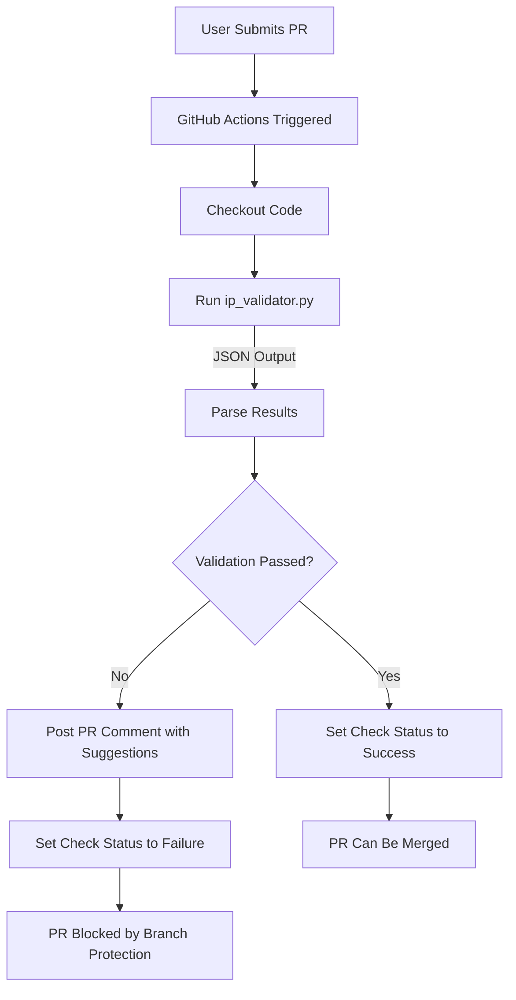

# Q

.我现在有这样一个问题,比如这个文件 api_list.yaml 是用户提交到 Git 的一个文件.如果用户修改了这个 Git 里面问题.其提交了一个 Pull Request,我们会经过审核然后 Merged 到 Master 分支,然后触发我们后面的逻辑.我现在想要实现在用户提交之后,是否能调用我的这个脚本,或者有这样一个逻辑校验.来验证用户的提交 IP 是否是合理的,然后给出建议. 关于这种需求一般如何来解决?

`python3 ip_validator.py api_list.yaml`

# Grok

你的需求是希望在用户提交 Pull Request (PR) 时，自动运行你的 Python 脚本 (`ip_validator.py`) 来验证 `api_list.yaml` 文件中 IP 地址的合理性，并在 Git 平台的 PR 界面中提供验证结果和建议。这种场景非常适合通过 **GitHub Actions** 或其他 CI/CD 工具实现自动化代码审查流程。以下是一个详细的解决方案，结合你的 Python 脚本和 GitHub 的 PR 审查流程，说明如何实现这一需求。

---

## 解决方案概述

1. **目标**：

    - 当用户提交 PR 并修改 `api_list.yaml` 文件时，自动运行你的 `ip_validator.py` 脚本。
    - 验证 `api_list.yaml` 中的 IP 地址是否合理（例如，排除私有 IP、合并重叠网段等）。
    - 在 PR 中以评论或状态检查的形式提供验证结果和建议（例如，哪些 IP 无效、是否可以合并等）。
    - 确保只有通过验证的 PR 才能合并到主分支。

2. **实现方式**：

    - 使用 **GitHub Actions** 作为自动化工具，在 PR 提交时触发脚本运行。
    - 修改你的 Python 脚本，使其输出结构化的验证结果，便于在 PR 中展示。
    - 配置 GitHub Actions 工作流，检查 PR 中修改的文件，运行脚本，并将结果反馈到 PR。
    - 可选地，使用分支保护规则确保只有通过验证的 PR 才能合并。

3. **工具与技术**：
    - **GitHub Actions**：GitHub 提供的 CI/CD 平台，用于运行脚本并与 PR 交互。
    - **GitHub API**：用于在 PR 中添加评论或设置状态检查。
    - **Python 脚本**：你的 `ip_validator.py`，稍作调整以适应 CI 环境。
    - **Branch Protection Rules**：确保 PR 必须通过验证才能合并。

---

## 实现步骤

### 1. 修改 Python 脚本以支持结构化输出

为了在 GitHub Actions 中更好地展示验证结果，需要调整你的 `ip_validator.py` 脚本，使其：

- 输出结构化的结果（例如 JSON 格式），便于 CI 解析。
- 返回明确的退出状态码（例如，0 表示成功，非 0 表示失败）。
- 提供详细的错误信息或建议，供 PR 评论使用。

以下是修改后的脚本示例，增加了 JSON 输出和退出状态码：

```python
import argparse
import ipaddress
import re
import sys
import json
import logging

def setup_logging():
    logging.basicConfig(
        level=logging.INFO,
        format='%(asctime)s - %(levelname)s - %(message)s'
    )

def extract_ips_from_file(file_path: str) -> set[str]:
    logging.info(f"Extracting IP addresses from '{file_path}'")
    ip_pattern = re.compile(r'\b(?:(?:25[0-5]|2[0-4][0-9]|[01]?[0-9][0-9]?)\.){3}(?:25[0-5]|2[0-4][0-9]|[01]?[0-9][0-9]?)(?:/[0-2]?[0-9]|/3[0-2])?\b')
    unique_ips = set()
    try:
        with open(file_path, 'r') as f:
            for line in f:
                found_ips = ip_pattern.findall(line)
                unique_ips.update(found_ips)
        logging.info(f"Found {len(unique_ips)} unique IP/CIDR strings.")
        return unique_ips
    except FileNotFoundError:
        logging.error(f"Input file '{file_path}' not found.")
        sys.exit(1)
    except Exception as e:
        logging.error(f"Error reading or parsing the file: {e}")
        sys.exit(1)

def process_ip_list(ip_strings: set[str]) -> tuple[list, list, list]:
    logging.info("Filtering, removing subsumed networks, and aggregating")
    public_networks = []
    invalid_ips = []
    private_ips = []
    for cidr_str in ip_strings:
        try:
            net = ipaddress.ip_network(cidr_str, strict=False)
            if net.is_private:
                logging.info(f"  [Excluding] {str(net):<18} (Private address)")
                private_ips.append(cidr_str)
                continue
            public_networks.append(net)
        except ValueError:
            logging.warning(f"  [Ignoring]  '{cidr_str}' is not a valid IP address or CIDR.")
            invalid_ips.append(cidr_str)

    if not public_networks:
        return [], invalid_ips, private_ips

    logging.info("Performing network aggregation...")
    optimized_networks = list(ipaddress.collapse_addresses(public_networks))
    logging.info(f"Processing complete. Resulted in {len(optimized_networks)} optimized network ranges.")
    return optimized_networks, invalid_ips, private_ips

def main():
    setup_logging()
    parser = argparse.ArgumentParser(description="Extract and optimize IP/CIDR ranges from a file.")
    parser.add_argument("input_file", help="Path to the input file containing IP/CIDR strings.")
    parser.add_argument("--output", "-o", help="Path to save the optimized IP ranges.", default=None)
    parser.add_argument("--json-output", action="store_true", help="Output results in JSON format.")
    args = parser.parse_args()

    unique_ip_strings = extract_ips_from_file(args.input_file)
    if not unique_ip_strings:
        logging.info("No IP/CIDR addresses found in the file.")
        if args.json_output:
            print(json.dumps({"status": "error", "message": "No IP/CIDR addresses found", "results": [], "invalid_ips": [], "private_ips": []}))
        sys.exit(1)

    final_list, invalid_ips, private_ips = process_ip_list(unique_ip_strings)

    results = {
        "status": "success" if final_list else "warning",
        "message": "Validation completed",
        "results": [str(net) for net in sorted(final_list)],
        "invalid_ips": invalid_ips,
        "private_ips": private_ips
    }

    suggestions = []
    if invalid_ips:
        suggestions.append("Invalid IP addresses detected. Please correct the following: " + ", ".join(invalid_ips))
    if private_ips:
        suggestions.append("Private IP addresses detected and excluded: " + ", ".join(private_ips))
    if len(final_list) < len(unique_ip_strings) - len(invalid_ips) - len(private_ips):
        suggestions.append("Some IP ranges were aggregated. Consider using the optimized ranges: " + ", ".join(str(net) for net in sorted(final_list)))

    results["suggestions"] = suggestions

    if args.json_output:
        print(json.dumps(results, indent=2))
    else:
        logging.info("\nFinal Optimized IP Address Ranges")
        if invalid_ips:
            logging.info("Invalid IP/CIDR strings encountered:")
            for ip in invalid_ips:
                logging.info(f"  {ip}")
        if private_ips:
            logging.info("Private IP addresses excluded:")
            for ip in private_ips:
                logging.info(f"  {ip}")
        if not final_list:
            logging.info("No valid public IP address ranges to output.")
        else:
            output_lines = [str(network) for network in sorted(final_list)]
            for line in output_lines:
                print(line)
            if args.output:
                try:
                    with open(args.output, 'w') as f:
                        f.write('\n'.join(output_lines))
                    logging.info(f"Results saved to '{args.output}'")
                except Exception as e:
                    logging.error(f"Error writing to output file: {e}")
        if suggestions:
            logging.info("\nSuggestions for improvement:")
            for suggestion in suggestions:
                logging.info(f"  - {suggestion}")
        logging.info("-------------------------------------")

    # Exit with non-zero status if there are invalid IPs or private IPs
    if invalid_ips or private_ips:
        sys.exit(1)
    sys.exit(0)

if __name__ == "__main__":
    main()
```

**主要修改**：

- 添加了 `--json-output` 参数，输出 JSON 格式的结果，便于 GitHub Actions 解析。
- `process_ip_list` 返回私有 IP 列表，增强错误报告。
- 添加了 `suggestions` 字段，提供改进建议（例如，修正无效 IP 或使用优化后的网段）。
- 根据验证结果设置退出状态码（0 表示成功，1 表示有无效或私有 IP），便于 CI 检测失败。
- 使用 `logging` 替代 `print`，提高日志可控性。

**测试运行**：

```bash
python3 ip_validator.py api_list.yaml --json-output
```

输出示例：

```json
2025-06-21 08:30:05,989 - INFO - Extracting IP addresses from 'api_list.yaml'
2025-06-21 08:30:05,989 - INFO - Found 26 unique IP/CIDR strings.
2025-06-21 08:30:05,989 - INFO - Filtering, removing subsumed networks, and aggregating
2025-06-21 08:30:05,989 - INFO -   [Excluding] 192.168.10.0/24    (Private address)
2025-06-21 08:30:05,989 - INFO -   [Excluding] 192.168.31.198/32  (Private address)
2025-06-21 08:30:05,990 - INFO -   [Excluding] 10.0.0.1/32        (Private address)
2025-06-21 08:30:05,990 - INFO -   [Excluding] 192.168.1.1/32     (Private address)
2025-06-21 08:30:05,990 - INFO - Performing network aggregation...
2025-06-21 08:30:05,990 - INFO - Processing complete. Resulted in 12 optimized network ranges.
{
  "status": "success",
  "message": "Validation completed",
  "results": [
    "4.4.4.4/32",
    "8.8.8.8/32",
    "114.114.114.114/32",
    "119.29.29.29/32",
    "176.18.15.16/32",
    "205.188.53.8/29",
    "205.188.53.16/31",
    "205.188.54.81/32",
    "205.188.54.82/31",
    "205.188.54.84/31",
    "205.188.54.86/32",
    "205.188.54.88/32"
  ],
  "invalid_ips": [],
  "private_ips": [
    "192.168.10.0/24",
    "192.168.31.198/32",
    "10.0.0.1/32",
    "192.168.1.1/32"
  ],
  "suggestions": [
    "Private IP addresses detected and excluded: 192.168.10.0/24, 192.168.31.198/32, 10.0.0.1/32, 192.168.1.1/32",
    "Some IP ranges were aggregated. Consider using the optimized ranges: 4.4.4.4/32, 8.8.8.8/32, 114.114.114.114/32, 119.29.29.29/32, 176.18.15.16/32, 205.188.53.8/29, 205.188.53.16/31, 205.188.54.81/32, 205.188.54.82/31, 205.188.54.84/31, 205.188.54.86/32, 205.188.54.88/32"
  ]
}
```

---

### 2. 创建 GitHub Actions 工作流

GitHub Actions 是一个强大的自动化工具，可以在 PR 提交时运行你的脚本，并将结果反馈到 PR。以下是一个工作流配置，用于检查 `api_list.yaml` 的修改并运行验证脚本。

#### 工作流文件

在你的 Git 仓库中，创建文件 `.github/workflows/validate-ip-list.yml`：

```yaml
name: Validate IP List in Pull Request

on:
  pull_request:
    paths:
      - 'api_list.yaml' #注意这个也是更新文件需要在根目录trigger

permissions:
  issues: write        # 允许在问题（包括 PR 评论）上写操作
  pull-requests: write # 允许在 PR 上写操作
  contents: read       # 允许读取仓库内容（用于 checkout）


jobs:
  validate-ip:
    runs-on: ubuntu-latest
    steps:
      - name: Checkout repository
        uses: actions/checkout@v4

      - name: Set up Python
        uses: actions/setup-python@v5
        with:
          python-version: '3.x'

      - name: Install dependencies
        run: |
          python -m pip install --upgrade pip
          pip install ipaddress

      - name: Run IP validator
        id: validate
        run: |
          python ip_validator.py api_list.yaml --json-output > results.json
          cat results.json # 注意这个ip_validator.py目前在根目录
        continue-on-error: true

      - name: Parse validation results
        id: parse
        run: |
          status=$(jq -r '.status' results.json)
          message=$(jq -r '.message' results.json)
          suggestions=$(jq -r '.suggestions | join("\n")' results.json)
          echo "status=$status" >> $GITHUB_OUTPUT
          echo "message=$message" >> $GITHUB_OUTPUT
          echo "suggestions<<EOF" >> $GITHUB_OUTPUT
          echo "$suggestions" >> $GITHUB_OUTPUT
          echo "EOF" >> $GITHUB_OUTPUT

      - name: Comment on PR
        if: steps.validate.outcome != 'success'
        uses: actions/github-script@v7
        with:
          script: |
            const fs = require('fs');
            const results = JSON.parse(fs.readFileSync('results.json'));
            const suggestions = results.suggestions.join('\n- ');
            const comment = `### IP Validation Results\n\n**Status**: ${results.status}\n**Message**: ${results.message}\n\n**Suggestions**:\n- ${suggestions}`;
            github.rest.issues.createComment({
              owner: context.repo.owner,
              repo: context.repo.repo,
              issue_number: context.issue.number,
              body: comment
            });

      - name: Set check status
        if: steps.validate.outcome != 'success'
        run: |
          echo "Validation failed: ${{ steps.parse.outputs.message }}"
          echo "${{ steps.parse.outputs.suggestions }}"
          exit 1
```

**工作流说明**：

- **触发条件**：在 PR 修改 `api_list.yaml` 文件时触发。
- **步骤**：
    1. 检出代码库。
    2. 设置 Python 环境。
    3. 安装依赖（`ipaddress` 模块）。
    4. 运行 `ip_validator.py`，输出 JSON 结果到 `results.json`。
    5. 使用 `jq` 解析 JSON 输出，提取状态、消息和建议。
    6. 如果验证失败（退出状态码非 0），在 PR 中添加评论，包含验证结果和建议。
    7. RequestError [HttpError]: Resource not accessible by integration
    8. 设置检查状态，如果验证失败，工作流失败，阻止 PR 合并（需配合分支保护规则）。
	    1. 我目前是检测失败还能允许合并 1.
		2. 完成的没有错误的
			1. 
    9. 可以调整检测失败禁止合并

**依赖工具**：

- `jq`：用于解析 JSON 输出，GitHub Actions 的 `ubuntu-latest` 环境默认包含。
- `actions/checkout@v4`：检出代码。
- `actions/setup-python@v5`：设置 Python 环境。
- `actions/github-script@v7`：通过 GitHub API 添加 PR 评论。

---

### 3. 配置分支保护规则

为了确保只有通过验证的 PR 才能合并到 `master` 分支，配置 GitHub 的分支保护规则：

1. 前往 GitHub 仓库的 **Settings > Branches**。
2. 在 **Branch protection rules** 下，点击 **Add rule** 或编辑 `master` 分支的规则。
    1. 
3. 启用以下选项：
    - \*\*Require status checks to pass
        - Require branches to be up to date before merging ：选择 `validate-ip` 工作流。
        - 
    - **Require pull request reviews before merging**：
        - Required approvals 确保至少一名审核者批准。
        - **Dismiss stale pull request approvals when new commits are pushed**：当 PR 更新时，重新验证。
4. 保存设置。
5. Actions 里面可以看到创建的 workflows ==> Validate IP List in Pull Request

这样，只有当 `validate-ip` 工作流通过（即脚本返回退出码 0）时，PR 才能合并。

---

### 4. PR 反馈示例

假设用户提交了一个 PR，修改了 `api_list.yaml`，包含以下内容：

```yaml
ips:
  - 192.168.1.0/24
  - 203.0.113.0/24
  - 203.0.113.128/25
  - 999.999.999.999
```

**GitHub Actions 运行后**，会在 PR 中添加以下评论：

```
### IP Validation Results

**Status**: warning
**Message**: Validation completed

**Suggestions**:
- Invalid IP addresses detected. Please correct the following: 999.999.999.999
- Private IP addresses detected and excluded: 192.168.1.0/24
- Some IP ranges were aggregated. Consider using the optimized ranges: 203.0.113.0/23
```

同时，`validate-ip` 检查会失败，阻止 PR 合并，直到用户修正无效或私有 IP。

---

### 5. 高级优化建议

以下是一些进一步优化的建议，结合 GitHub 的 PR 审查流程和搜索结果中的最佳实践：

1. **自动化审查分配**：

    - 使用工具如 **PullApprove** 或 **CODEOWNERS** 文件，自动为 `api_list.yaml` 的修改分配特定审查者（例如网络管理员）。[](https://www.pullapprove.com/)
    - 示例 `CODEOWNERS` 文件：
        ```
        api_list.yaml @network-team
        ```
        将 `api_list.yaml` 的审查分配给 `@network-team`。

2. **集成第三方审查工具**：

    - 使用 **Danger** 或 **Code Inspector** 扩展自动化审查，检查代码风格、文档完整性等。[](https://www.freecodecamp.org/news/how-to-automate-code-reviews-on-github-41be46250712/)[](https://devopscube.com/automating-code-reviews-github/)
    - 在 `Dangerfile` 中调用你的 `ip_validator.py` 脚本，并将结果整合到 PR 评论中。

3. **增强建议内容**：

    - 如果 IP 无效，提供更具体的修正建议（例如，推荐有效的公共 IP 范围）。
    - 使用 GitHub API 的 `pulls/reviews` 端点，在特定行添加评论，指出无效 IP 的位置。[](https://docs.github.com/en/rest/pulls/reviews)

4. **支持 IPv6**：

    - 如前所述，扩展脚本支持 IPv6 地址（添加 IPv6 regex 和 `ipaddress` 处理），以适应未来的网络需求。

5. **性能优化**：

    - 如果 `api_list.yaml` 很大，考虑在 GitHub Actions 中只处理 PR 的差异部分（使用 `git diff` 或 GitHub API 的 `pulls/files` 端点）。[](https://www.freecodecamp.org/news/how-to-automate-code-reviews-on-github-41be46250712/)

6. **通知集成**：
    - 将验证结果发送到 Slack 或其他平台，通知团队。GitLoop 等工具支持此类集成。[](https://www.gitloop.com/feature/pulls-and-commits-review)

---

## 实现架构图

以下是实现流程的 Mermaid 图：



---

## 其他实现方式

如果不使用 GitHub Actions，还可以考虑以下替代方案：

1. **GitLab CI/CD**：
    - 如果使用 GitLab，创建类似的 `.gitlab-ci.yml` 文件，运行脚本并通过 GitLab API 添加 MR 评论。[](https://medium.com/%40kedargmnv/automating-code-review-with-openai-in-your-gitlab-workflow-c18b894bf632)
2. **Jenkins**：
    - 配置 Jenkins 流水线，在 PR 触发时运行脚本，并使用 GitHub API 更新 PR 状态。
3. **Custom GitHub App**：
    - 开发一个 GitHub App，使用 GitHub API 的 `pulls/reviews` 端点，运行脚本并提供更精细的审查反馈。[](https://platform.github.community/t/api-endpoint-for-pr-reviews/409)

---

## 结论

通过 GitHub Actions 结合修改后的 `ip_validator.py`，你可以实现：

- 自动验证 PR 中 `api_list.yaml` 的 IP 地址。
- 在 PR 中提供详细的验证结果和建议。
- 通过分支保护规则确保只有有效 IP 的 PR 才能合并。

这种方法低侵入性，易于维护，且可扩展到更复杂的验证需求。如果需要进一步定制（例如，IPv6 支持、特定行评论、或与其他工具集成），请告诉我，我可以提供更详细的实现！
