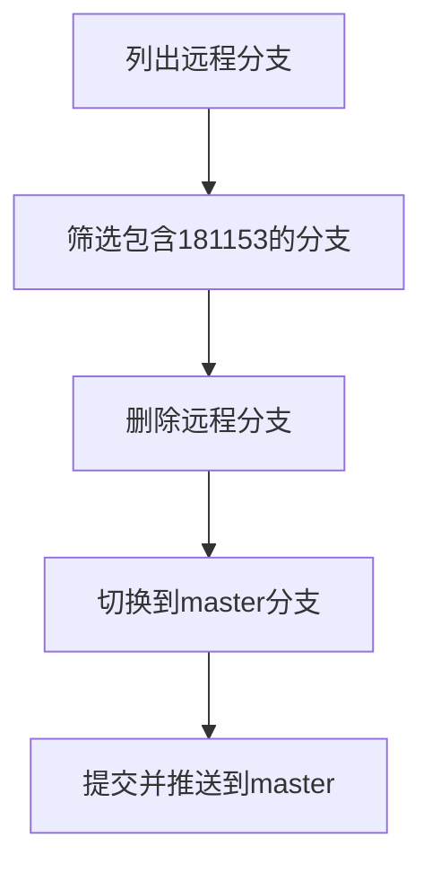
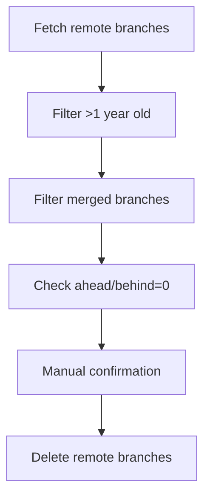

我来帮你处理这个Git分支清理的任务。我会给你一系列命令来完成这个操作。​​​​​​​​​​​​​​​​

使用方法：

1. 首先保存上面的脚本到一个文件，比如 `cleanup-branches.sh`
2. 给脚本添加执行权限：
```bash
chmod +x cleanup-branches.sh
```

3. 在你的仓库目录下运行这个脚本：
```bash
./cleanup-branches.sh
```

这个脚本会：
1. 切换到master分支并更新
2. 找出所有包含"181153"的分支
3. 显示要删除的分支列表
4. 询问确认
5. 对每个分支：
   - 尝试合并到master
   - 删除本地分支
   - 删除远程分支
6. 最后推送所有更改到master

如果你只想查看包含关键字的分支而不删除，可以使用：
```bash
git branch | grep "181153"
```

如果你想同时查看远程分支：
```bash
git branch -a | grep "181153"
```

需要注意的是，这个脚本会尝试合并所有分支到master。如果你确定某些分支的更改已经合并，你也可以直接使用：
```bash
git branch | grep "181153" | xargs git branch -D
```


- bash
```bash
#!/bin/bash

# 切换到主分支
git checkout master
git pull origin master

# 列出包含关键字的本地分支
echo "Finding branches containing '181153'..."
branches_to_delete=$(git branch | grep "181153")

# 显示要删除的分支
echo "Branches to be deleted:"
echo "$branches_to_delete"

# 确认是否继续
read -p "Continue with deletion? (y/n) " confirm

if [ "$confirm" = "y" ]; then
    # 遍历每个分支
    echo "$branches_to_delete" | while read branch; do
        # 去除分支名前的空格和*号
        branch_name=$(echo "$branch" | sed 's/^[ *]*//')
        
        if [ ! -z "$branch_name" ]; then
            # 确保更改已合并到master
            echo "Checking if $branch_name can be merged to master..."
            git checkout "$branch_name"
            
            # 尝试合并到master
            git checkout master
            git merge "$branch_name"
            
            # 删除本地分支
            git branch -d "$branch_name"
            
            # 删除远程分支
            git push origin --delete "$branch_name"
            
            echo "Deleted branch: $branch_name"
        fi
    done
    
    # 最后推送所有更改到master
    git push origin master
    
    echo "Cleanup completed!"
else
    echo "Operation cancelled."
fi
```


从描述来看，你想删除远程分支（remotes/origin 下的分支），但直接使用 git branch -D 命令会报错，这是因为 git branch 默认操作的是本地分支，而 git branch -D 不能直接删除远程分支。

下面是解决步骤，包括列出目标分支、删除它们，以及提交到 master 分支：

1. 列出包含关键字的远程分支

使用以下命令查看所有包含 181153 的远程分支：
```bash
git fetch --all  # 确保同步远程分支信息
git branch -r | grep 181153
```
这会列出所有远程分支，例如：
```bash
origin/181153-path-99
origin/181153-path-101
origin/181153-path-test
```
2. 批量删除远程分支

运行以下命令批量删除包含 181153 的远程分支：

# 列出包含 181153 的分支并删除
```
for branch in $(git branch -r | grep 181153 | sed 's|origin/||'); do
    echo "Deleting remote branch: $branch"
    git push origin --delete $branch
done
```
解释：
	•	git branch -r: 列出所有远程分支。
	•	grep 181153: 筛选包含关键字 181153 的分支。
	•	sed 's|origin/||': 去掉 origin/ 前缀以获取真实分支名。
	•	git push origin --delete <branch>: 删除远程分支。

3. 切换到 master 分支并提交

在完成远程分支的删除后，切换到 master 分支，合并更改并提交：

# 确保在 master 分支上
`git checkout master`

# 拉取最新的 master 更新
`git pull origin master`

# 如果需要合并某些内容到 master，运行以下命令（根据实际需要调整）
`git merge <your-feature-branch>`

# 推送最新的 master 更新到远程
git push origin master

4. 附加：快速清理本地分支

在删除远程分支后，可以清理本地无用分支（如果有）：

# 列出所有本地包含 181153 的分支
git branch | grep 181153

# 删除本地分支（批量操作）
```bash
for branch in $(git branch | grep 181153); do
    echo "Deleting local branch: $branch"
    git branch -D $branch
done
```
最终流程图

通过以上步骤，你可以高效地完成远程分支清理和提交操作。


          
Here's the formatted markdown version of the selected content from `/Users/lex/git/knowledge/howgit/housekeep-branch.md` (lines 172-320):


## Branch Cleanup Requirements

Requirements summary:
- Clean stale (inactive) GitHub branches
- Filter criteria:
  - Last updated over 1 year ago
  - Compared to master/main: Ahead = 0 and Behind = 0 (fully synced)
  - Already merged to master/main
  - Prefer CLI tools for processing

## Best Practices

Before cleaning old branches, consider:
- **Confirm merged status**: Avoid deleting unmerged development branches
- **Backup important branches**: Tag or archive if concerned about accidental deletion  
- **Delete locally first**: Then clean remote to prevent direct remote data loss
- **Review before batch operations**: List eligible branches first, then bulk delete after manual confirmation

## Recommended Tools
- Local: Standard git commands
- Remote: GitHub CLI (`gh`) for more efficient operations

## Implementation Steps

### 1. Fetch all remote branches
```bash
git fetch --prune
git branch -r
```

### 2. Find branches older than 1 year
```bash
git for-each-ref --sort=committerdate refs/remotes/origin/ \
  --format="%(committerdate:short) %(refname:short)" \
  | awk '$1 <= strftime("%Y-%m-%d", systime() - 365*24*60*60)'
```

### 3. Check merged status
For master:
```bash 
git branch -r --merged origin/master
```

For main:
```bash
git branch -r --merged origin/main
```

### 4. Filter fully synced branches (Ahead/Behind = 0)
```bash
git fetch origin
for branch in $(git branch -r | grep -v HEAD); do
  ahead=$(git rev-list --left-right --count origin/master...$branch | awk '{print $1}')
  behind=$(git rev-list --left-right --count origin/master...$branch | awk '{print $2}')
  if [[ "$ahead" == "0" && "$behind" == "0" ]]; then
    echo "$branch"
  fi
done
```

### 5. GitHub CLI Operations (Optional)
List stale branches:
```bash
gh pr list --state closed --search "updated:<2024-04-28"
```

Delete branch:
```bash
gh api -X DELETE repos/{owner}/{repo}/git/refs/heads/{branch}
```

## Complete Safety Script
Lists eligible branches without deleting:
```bash
git fetch --prune

echo "Branches older than 1 year + merged + fully synced:"
for branch in $(git branch -r | grep origin/ | grep -v HEAD | sed 's#origin/##'); do
  last_commit_date=$(git log -1 --format="%ci" origin/$branch | cut -d' ' -f1)
  if [[ "$(date -d "$last_commit_date" +%s)" -lt "$(date -d '1 year ago' +%s)" ]]; then
    if git branch -r --merged origin/master | grep -q "origin/$branch"; then
      ahead_behind=$(git rev-list --left-right --count origin/master...origin/$branch)
      ahead=$(echo $ahead_behind | awk '{print $1}')
      behind=$(echo $ahead_behind | awk '{print $2}')
      if [[ "$ahead" == "0" && "$behind" == "0" ]]; then
        echo "$branch"
      fi
    fi
  fi
done
```

## Deletion Command
For individual branches:
```bash
git push origin --delete <branch-name>
```

## Workflow Diagram


## Script Options
Would you like an interactive bulk deletion script? Available in:
- Bash
- Python 
- GitHub CLI version


# Grok 

在 GitHub 仓库中清理陈旧（stale）分支是一个很好的实践，可以帮助保持仓库的整洁和可维护性。你提到想要清理“更新时间在一年以前、落后于主分支（behind）且没有超前提交（ahead 为 0）”的分支，并可能将一些分支合并到 master 分支。下面我将为你提供详细的步骤和命令行操作，帮助你完成清理工作，同时结合最佳实践建议。

---

### 目标
1. **识别陈旧分支**：找到更新时间在一年以前、落后于 master 且 ahead 为 0 的分支。
2. **合并到 master**：将需要保留的分支合并到 master。
3. **删除无用分支**：清理不再需要的分支。
4. **最佳实践**：确保清理过程安全、高效。

---

### 步骤 1：识别陈旧分支

首先，我们需要列出所有分支并筛选出符合条件的分支（更新时间在一年以前、behind > 0、ahead = 0）。

#### 命令行操作
运行以下脚本，识别目标分支：

```bash
#!/bin/bash

# 设置主分支名称（根据你的仓库调整，可能为 main 或 master）
MAIN_BRANCH="master"

# 获取一年前的时间戳
ONE_YEAR_AGO=$(date -d "1 year ago" +%s)

# 遍历所有本地分支
for branch in $(git for-each-ref --sort=-committerdate refs/heads/ --format='%(refname:short)'); do
    # 获取分支最后提交时间
    commit_date=$(git log -1 --format=%cd --date=iso8601 $branch)
    commit_timestamp=$(date -d "$commit_date" +%s)
    
    # 检查是否在一年前
    if [[ $commit_timestamp < $ONE_YEAR_AGO ]]; then
        # 获取相对于 master 的 behind 和 ahead 提交数
        behind_ahead=$(git rev-list --left-right --count $MAIN_BRANCH...$branch)
        behind=$(echo $behind_ahead | cut -d' ' -f1)
        ahead=$(echo $behind_ahead | cut -d' ' -f2)
        
        # 检查 behind > 0 且 ahead = 0
        if [[ $behind -gt 0 && $ahead -eq 0 ]]; then
            echo "Branch $branch is stale: last updated on $commit_date, behind by $behind commits, ahead by 0 commits"
        fi
    fi
done
```

#### 说明
- 这个脚本会遍历所有本地分支，检查它们的最后提交时间是否在一年前。
- 对于符合条件的分支，它会进一步检查相对于 master 的 behind 和 ahead 状态。
- 输出结果会列出所有“一年以前更新、behind > 0、ahead = 0”的分支。

#### 前置条件
- 确保你已经克隆了仓库（`git clone <repository-url>`）。
- 确保本地 master 分支是最新的（`git checkout master && git pull origin master`）。

---

### 步骤 2：合并到 master 分支

如果你发现某些陈旧分支的内容仍然有价值，可以选择将它们合并到 master 分支。

#### 命令行操作
对于需要合并的分支（假设分支名为 `branch_name`），按以下步骤操作：

1. **切换到 master 分支**：
   ```bash
   git checkout master
   ```
2. **确保 master 是最新的**：
   ```bash
   git pull origin master
   ```
3. **合并目标分支**：
   ```bash
   git merge branch_name
   ```
4. **解决冲突（如果有）**：
   - 如果合并过程中出现冲突，Git 会提示你手动解决。
   - 编辑冲突文件，解决后运行：
     ```bash
     git add <file>
     git commit
     ```
5. **推送到远程仓库**：
   ```bash
   git push origin master
   ```

#### 注意
- 如果分支已经完全落后于 master（ahead = 0），合并通常不会有冲突，因为它的内容已经被 master 包含。
- 如果你不确定是否需要合并，可以先检查分支的提交历史：
  ```bash
  git log master..branch_name
  ```

---

### 步骤 3：删除陈旧分支

对于不再需要的分支，可以安全删除。

#### 命令行操作
1. **删除本地分支**：
   ```bash
   git branch -d branch_name
   ```
   - 如果分支未完全合并，Git 会提示错误。此时可以用 `-D` 强制删除：
     ```bash
     git branch -D branch_name
     ```
2. **删除远程分支**：
   ```bash
   git push origin --delete branch_name
   ```

#### 注意
- 在删除远程分支前，确保团队其他成员不再需要它。

---

### 最佳实践建议

为了让清理过程更加高效和安全，可以参考以下建议：

1. **定期清理**：
   - 每季度或每半年检查一次陈旧分支，防止仓库变得杂乱。

2. **自动化识别**：
   - 使用上述脚本定期运行，生成陈旧分支列表，避免手动检查。

3. **团队沟通**：
   - 在删除任何分支（尤其是远程分支）之前，与团队确认，确保不会误删正在使用的分支。

4. **备份**：
   - 在大规模删除前，可以创建一个临时的备份分支或标签：
     ```bash
     git tag backup-branch_name branch_name
     ```

5. **逐步操作**：
   - 先列出所有符合条件的陈旧分支，逐一审查后再决定合并或删除，而不是直接自动化删除。

---

### 示例工作流程

假设你的仓库有以下分支：
- `feature/old-task`：最后更新于 2022-01-01，behind 10 commits，ahead 0 commits。
- `fix/bug-123`：最后更新于 2023-06-01，不符合一年条件。

#### 操作
1. 运行脚本，输出：
   ```
   Branch feature/old-task is stale: last updated on 2022-01-01, behind by 10 commits, ahead by 0 commits
   ```
2. 检查是否需要合并：
   ```bash
   git checkout master
   git merge feature/old-task
   git push origin master
   ```
3. 删除分支：
   ```bash
   git branch -d feature/old-task
   git push origin --delete feature/old-task
   ```

---

### 总结

通过上述步骤，你可以：
- 使用脚本识别“更新时间在一年以前、behind > 0、ahead = 0”的分支。
- 根据需要将分支合并到 master。
- 安全删除不再需要的分支。

建议你先在本地测试脚本和命令，确保结果符合预期后再操作远程分支。如果有多个分支需要清理，可以将脚本输出保存到文件中，逐一处理。希望这些步骤能帮到你！如果有其他问题，欢迎随时提问。