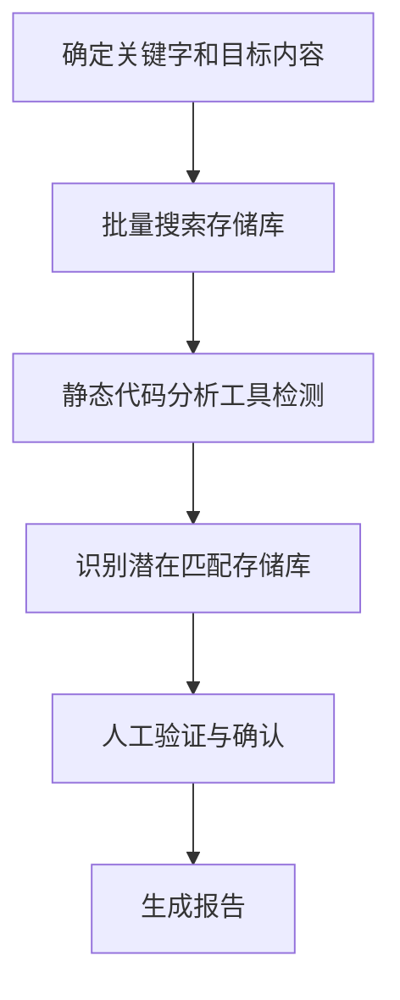

好的，针对你在 GitHub 企业环境中识别包含埃及或沙特阿拉伯应用程序代码的存储库的需求，这是一个涉及到代码审计、信息检索和组织策略的有趣且具有挑战性的问题。以下是对这个问题的深度分析以及排查方法：

**深度分析问题：识别“包含埃及或沙特阿拉伯应用程序代码”**

首先，我们需要明确“包含埃及或沙特阿拉伯应用程序代码”的具体含义。这可能包括以下几个方面：

1. **显式提及：**
   * **代码注释和文档：** 代码注释、README 文件、文档等明确提及了埃及或沙特阿拉伯相关的术语、名称、地点等。
   * **变量名、函数名、类名：** 代码中使用了与埃及或沙特阿拉伯相关的命名，例如 `EgyptPaymentGateway`，`SARCurrencyConverter` 等。
   * **配置文件：** 配置文件中包含与埃及或沙特阿拉伯相关的配置信息，例如 API 端点、数据库连接字符串、地域特定的设置等。

2. **隐式关联：**
   * **语言和文化相关的文本内容：** 应用程序处理用户生成的内容或者需要本地化，可能包含阿拉伯语文本资源文件 (e.g., `.properties`, `.json`, `.xml`)。
   * **时区和日期格式：** 代码中使用的时区设置可能指向埃及或沙特阿拉伯的时区（EET, AST）。日期和时间格式的偏好也可能有所不同。
   * **货币和支付网关：**  代码中是否集成了埃及或沙特阿拉伯常用的支付网关或处理货币（EGP, SAR）的逻辑。
   * **地理位置和地图服务：**  应用程序是否使用了与埃及或沙特阿拉伯相关的地理编码、地图服务或位置信息。
   * **法规和合规性：** 某些应用程序可能需要处理与埃及或沙特阿拉伯相关的法律法规，例如税务、数据隐私等，这可能会体现在代码逻辑中。
   * **特定的库或框架：**  是否存在一些在埃及或沙特阿拉伯本地比较流行的库或框架被使用。

**排查方案：多步骤、多维度的方法**

由于“包含”的定义较为宽泛，我们需要一个多步骤、多维度的排查方案，结合自动化工具和人工分析：

**第一步：基础信息收集和初步筛选**

1. **利用 GitHub 内置搜索功能：**
   * **仓库名称和描述搜索：** 使用关键词 "Egypt"、"Saudi Arabia" 以及它们的阿拉伯语形式 "مصر‎"、"المملكة العربية السعودية"  在仓库名称和描述中进行搜索。
   * **文件内容搜索：**  在所有仓库中搜索包含上述关键词的文件内容。可以利用 GitHub 的高级搜索选项，例如指定文件类型等。
   * **主题标签 (Topics) 搜索：** 如果仓库使用了 Topics，可以搜索与埃及或沙特阿拉伯相关的标签。

2. **组织成员信息：**
   * 查看组织成员的个人资料，是否有人明确居住在埃及或沙特阿拉伯，或者在其个人项目中提及相关信息。这可以提供一些线索，他们参与的仓库可能更相关。

**第二步：深入代码分析（需要一定的技术能力和工具）**

1. **克隆仓库进行本地分析：**  将初步筛选出的仓库克隆到本地进行更深入的分析。
2. **文本搜索工具：** 使用 `grep` (Linux/macOS) 或 `findstr` (Windows) 等命令行工具，在仓库代码库中搜索更广泛的关键词，包括：
   * 城市名（Cairo, Riyadh, Jeddah 等）
   * 区域名称或缩写
   * 常见的本地服务或公司名称
   * 货币代码 (EGP, SAR)
   * 时区标识 (EET, AST)
   * 阿拉伯语常用词汇（需要结合具体应用场景）
3. **代码静态分析工具：**  可以使用一些代码静态分析工具（例如 SonarQube）来扫描代码，查找潜在的地域相关模式。虽然这些工具主要用于代码质量，但可以通过自定义规则来检测特定的字符串或模式。
4. **依赖分析：** 分析 `package.json` (Node.js), `requirements.txt` (Python), `pom.xml` (Java) 等依赖文件，看是否引入了与埃及或沙特阿拉伯相关的第三方库或 SDK。例如，支付网关的 SDK。
5. **语言检测：**  可以尝试使用一些语言检测工具来判断代码注释或文档中是否包含阿拉伯语。

**第三步：情境理解和人工判断**

1. **查看提交历史：**  浏览仓库的提交历史，看是否有提交信息中提到埃及或沙特阿拉伯。
2. **查看 Issue 和 Pull Request：**  查看仓库的 Issue 和 Pull Request，讨论内容中是否涉及到相关地域。
3. **代码上下文分析：**  对于找到的可疑代码片段，需要结合上下文进行理解。例如，一个包含 "Cairo" 字符串的文件可能是一个地址数据，也可能是一个地名常量。
4. **与开发团队沟通：**  如果初步筛选出一些疑似仓库，可以与相关的开发团队成员沟通，了解项目的背景和目标，确认是否与埃及或沙特阿拉伯有关。这是最直接且有效的方式。

**第四步：结果整理和反馈**

1. **整理识别到的仓库列表：**  将所有被识别为可能包含埃及或沙特阿拉伯应用程序代码的仓库整理成一个列表。
2. **添加置信度评估：**  对于每个仓库，可以根据分析的深入程度和证据的强弱，给出一个置信度评估（例如高、中、低）。
3. **向组织所有者汇报：**  将整理好的列表和分析结果反馈给 GitHub 企业组织的所有者。

**应该从哪些方面着手排查？**

1. **明确目标和定义：**  与 GitHub Organization Owners 沟通，明确他们对“包含埃及或沙特阿拉伯应用程序代码”的具体理解和期望，例如是商业逻辑相关、用户群体相关还是其他。
2. **优先利用 GitHub 平台能力：**  先从 GitHub 提供的搜索功能入手，这是最直接且无需额外工具的方式。
3. **逐步深入：**  从简单的关键词搜索开始，逐步深入到代码内容分析和依赖分析。
4. **结合人工和自动化：**  自动化工具可以帮助快速筛选大量仓库，但最终的判断往往需要人工结合上下文进行。
5. **保持沟通：**  与开发团队的沟通是验证结果和减少误报的关键步骤。
6. **文档记录：**  记录排查过程和结果，方便后续回顾和审计。

**排查的注意事项：**

* **误报和漏报：**  任何自动化的方法都可能存在误报（将无关仓库识别为相关）和漏报（未能识别出相关的仓库）。需要不断调整策略和关键词。
* **语言障碍：**  如果代码注释或文档使用阿拉伯语，可能需要具备阿拉伯语能力的人员参与分析。
* **隐私和权限：**  在进行代码分析时，需要遵守组织的安全策略和权限管理规定。
* **持续更新：**  企业内部的代码库是不断变化的，需要定期进行类似的排查。

**总结：**

识别包含特定地域应用程序代码的存储库是一个复杂的问题，需要结合多种技术手段和人工判断。从 GitHub 平台提供的搜索功能入手，逐步深入到代码内容分析和依赖分析，并与开发团队保持沟通是关键。作为 GitHub 企业用户，组织所有者拥有查看所有仓库的权限，这为排查提供了便利。最终的排查结果需要结合业务目标和对“包含”的定义来理解。


识别包含埃及或沙特阿拉伯应用程序代码的 GitHub 存储库是一个复杂的问题，需要从多个维度进行分析和排查。以下是深度分析该问题的方法，以及如何系统性地排查和解决。

---

## **1. 问题的深度分析**

### **1.1 什么是“埃及或沙特阿拉伯应用程序代码”？**
- 代码内容或注释中直接提及埃及或沙特阿拉伯相关信息。
- 配置文件或依赖中存在国家相关的数据（例如国家代码、货币、语言）。
- 特定业务逻辑与埃及或沙特阿拉伯相关，例如处理当地的法律法规、税收规则或支付系统。

---

### **1.2 挑战**
1. **代码规模庞大**：
   企业 GitHub 中的存储库可能包含成千上万的文件，手动分析不现实。

2. **隐性内容关联**：
   某些代码可能间接反映埃及或沙特阿拉伯相关业务，而不是通过显式关键字（例如 `EG`, `SA`, `Cairo`）直接表现。

3. **多种编程语言**：
   代码内容可能涉及多种编程语言，需要广泛支持搜索和解析。

4. **敏感数据的处理**：
   需避免误判，以及处理涉及个人或敏感数据时的合规性。

---

## **2. 排查的解决方案**

为了系统性地排查，我们可以从以下几个方面入手：

---

### **2.1 关键字搜索**
通过搜索关键字快速识别潜在相关存储库。
#### **步骤**
1. **识别关键字**：
   - 地理位置：`Egypt`, `Saudi Arabia`, `Cairo`, `Riyadh`, `EG`, `SA`.
   - ISO 国家代码：`EGY`, `SAU`.
   - 特定语言或货币：`Arabic`, `SAR`, `EGP`.

2. **搜索方式**：
   使用 GitHub 的高级搜索功能：
   ```plaintext
   org:<organization-name> <keyword>
   ```
   示例：
   ```plaintext
   org:my-org Egypt
   org:my-org Saudi
   ```

3. **自动化脚本**：
   通过 GitHub API 执行批量搜索：
   ```bash
   gh api -H "Accept: application/vnd.github+json" \
       /search/code \
       -q 'q=org:<organization-name>+Egypt' | jq
   ```

---

### **2.2 配置文件和数据文件分析**
#### **重点文件**：
- 配置文件：`.env`, `config.yaml`, `application.properties`, `settings.json`.
- 数据文件：`.sql`, `.json`, `.csv`.

#### **目标内容**：
- 数据库表或字段：`country`, `region`, `locale`.
- 配置项：`base_currency`, `locale=EG`, `locale=SA`.

#### **实现方式**：
1. 下载特定存储库。
2. 使用脚本扫描目标文件类型：
   ```bash
   grep -i -E "Egypt|Saudi|EG|SA" **/*.env **/*.yaml **/*.json
   ```

---

### **2.3 使用静态代码分析**
静态代码分析工具可帮助分析复杂的代码依赖和逻辑。
#### **工具**：
- **Semgrep**：强大的代码模式搜索工具。
- **SonarQube**：提供代码质量分析和规则自定义。

#### **示例**：
使用 Semgrep 编写规则查找相关代码：
```yaml
rules:
  - id: country-specific-logic
    patterns:
      - pattern: |
          if (country == "EG" || country == "SA") {
              ...
          }
    message: Detects country-specific logic for Egypt or Saudi Arabia.
    severity: WARNING
```

执行分析：
```bash
semgrep --config rules.yaml --exclude-dir tests .
```

---

### **2.4 版本历史追踪**
在代码提交记录中查找相关更改历史：
#### **Git Log 搜索**：
```bash
git log --all -S "Egypt" --pretty=format:"%h %s"
```

#### **GitHub API 获取提交历史**：
使用 GitHub API 搜索历史提交内容：
```bash
gh api -H "Accept: application/vnd.github+json" \
    /repos/<owner>/<repo>/commits \
    -q 'q=Egypt'
```

---

### **2.5 定位特定业务相关模块**
- **支付模块**：是否有与埃及或沙特支付网关（如 PayTabs, Mada）的集成。
- **税务模块**：是否处理增值税 (VAT) 相关逻辑。

使用模块路径或函数名匹配：
```bash
grep -i -E "tax|vat|payment" **/*.py
```

---

### **2.6 人工验证**
自动化识别后，生成报告供业务团队验证：
- 每个存储库附加以下信息：
  - 可能匹配的文件路径。
  - 涉及的关键字。
  - 相关的代码片段。

---

## **3. 工作流程设计**

以下是完整的排查流程：



---

## **4. 长期解决方案**

1. **关键字监控**：
   配置 GitHub Actions，自动检测新提交中是否包含关键字。
   ```yaml
   name: Monitor Keywords
   on: push
   jobs:
     scan:
       runs-on: ubuntu-latest
       steps:
         - uses: actions/checkout@v2
         - name: Search for Keywords
           run: grep -ri -E "Egypt|Saudi" .
   ```

2. **代码规范和审查**：
   - 建立明确的代码审查流程。
   - 制定国家特定代码的标记标准。

3. **日志与审计**：
   定期生成分析报告，确保覆盖率和准确性。

---

通过以上方法，可以高效地识别包含埃及或沙特阿拉伯相关应用程序代码的存储库，并生成可靠的报告。
