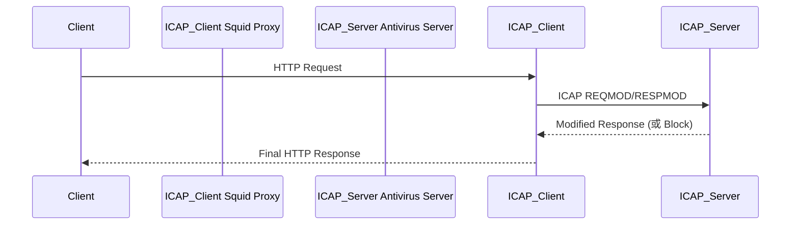

ICAP（Internet Content Adaptation Protocol）是一个轻量级的、基于 HTTP 的协议，设计用于将内容适配（content adaptation）任务从原始服务器分离出来，并交给专门的 ICAP 服务器来处理。这种设计允许你把一些耗时或需要专门处理的操作（比如杀毒、内容过滤、压缩、替换、DLP 等）下放到其他服务中执行。

📌 场景类比

想象一下你有个 Web 代理（比如 Squid），每次用户访问一个网站时，它都能在返回响应前拦截内容，然后让一个“外包处理服务”（ICAP server）来检查这个内容是否包含病毒，或者是否包含敏感词。

ICAP 架构图解释



✳️ ICAP 服务的核心概念

|             |                                                                   |
| ----------- | ----------------------------------------------------------------- |
| 项目        | 说明                                                              |
| ICAP Server | 专门负责“内容适配”的服务，例如病毒扫描、DLP、URL 重写等           |
| ICAP Client | 一般是一个缓存代理（如 Squid）、反向代理（如 NGINX+模块）、WAF 等 |
| REQMOD      | Request Modification，表示对请求内容进行修改                      |
| RESPMOD     | Response Modification，表示对响应内容进行修改                     |

📘 举个例子：Web 内容杀毒网关

1. 浏览器访问某文件 → 请求经过 Squid
2. Squid 配置了 ICAP 客户端模块，会将 HTTP 响应通过 ICAP 协议转发给专用的杀毒引擎（ICAP Server）
3. 如果发现病毒，ICAP Server 会返回替换内容或拒绝
4. Squid 将 ICAP 返回的响应返回给浏览器

🧩 ICAP 协议本身的特点

- 基于 TCP，默认端口是 1344
- 结构参考 HTTP，但是自己的协议（非 HTTP 请求）
- 支持管道式的请求：不需要传整个 HTTP 消息体，而是用 Encapsulation 机制传递部分或全部内容
- 标准方法：

- OPTIONS：获取 ICAP Server 支持的服务
- REQMOD：对 HTTP 请求进行修改
- RESPMOD：对 HTTP 响应进行修改

-

示例：REQMOD 请求内容（简化）

REQMOD icap://icap-server.example.net/reqmod ICAP/1.0

Host: icap-server.example.net

Allow: 204

Encapsulated: req-hdr=0, req-body=137

GET /index.html HTTP/1.1

Host: www.example.com

User-Agent: Mozilla/5.0

[HTTP 请求的 Body，这里用于内容检查]

🧪 常见的 ICAP Server 实现

|                        |                                                 |
| ---------------------- | ----------------------------------------------- |
| ICAP Server 实现       | 功能特点                                        |
| C-ICAP                 | 开源，C 语言实现，支持模块插件扩展（如 ClamAV） |
| Symantec ICAP          | 商用杀毒产品集成                                |
| McAfee Web Gateway     | 企业级内容审查                                  |
| Blue Coat ProxySG      | 支持 ICAP，做 DLP 和安全过滤                    |
| TrendMicro ICAP Server | 恶意软件检测、内容防泄漏等                      |

⚙️ ICAP 客户端实现

|                |                                                                                                |
| -------------- | ---------------------------------------------------------------------------------------------- |
| 客户端         | 支持方式                                                                                       |
| Squid Proxy    | 原生支持 ICAP 协议，可配置 icap_enable 等参数                                                  |
| NGINX + 模块   | 可以通过 nginx-icap-module 使用（第三方模块）                                                  |
| F5 / FortiGate | 商用设备支持配置 ICAP 接口，转发到后端检查                                                     |
| 自定义程序     | 可用开源库如 [libicapclient](https://github.com/ejcx/libicapclient) 或 Python HTTP client 模拟 |

🚀 应用场景

- 杀毒扫描（Anti-virus）
- 敏感内容过滤（DLP、关键词拦截）
- 广告替换 / 内容替换
- HTTP 请求/响应日志审计
- 压缩 / 解压 / 内容优化

🧠 总结理解

ICAP = “让代理或网关调用外部模块” 的标准协议

➡️ 把内容修改或过滤任务从 Web 网关代理中抽出来，专门交给 ICAP Server 来做。

你只需要在你的网关（如 Squid）中配置好连接到一个 ICAP Server，当流量进来时，它会自动转发过去进行处理。

如你接下来想手动构建一个简单 ICAP 客户端或服务端测试环境，我也可以帮你写一个 PoC 示例（Python/C/Go）或 Docker Compose 方案。是否需要？

下面我将详细提供两部分内容：

🧪 一、如何简单探测服务是否是 ICAP 协议服务？

✅ 探测思路

ICAP 是基于 TCP 的协议，端口默认为 1344。虽然它看起来类似 HTTP，但它是自己定义的一套协议格式，因此我们可以用 telnet 或 Python 的 socket 模拟发一个最简单的 OPTIONS 请求，观察它是否返回标准 ICAP 响应。

✅ 方法 1：telnet 手动测试

telnet icap-server.example.net 1344

然后手动输入：

OPTIONS icap://icap-server.example.net/ ICAP/1.0

Host: icap-server.example.net

（按两次 Enter，发一个空行）

如果你看到类似如下响应，说明这个服务是一个 ICAP server：

ICAP/1.0 200 OK

Methods: RESPMOD, REQMOD

Service: MyICAPServer

✅ 方法 2：Python 探测 ICAP 服务是否存在

```Python
import socket

def detect_icap_server(host, port=1344):
    request = (
        f"OPTIONS icap://{host}/ ICAP/1.0\r\n"
        f"Host: {host}\r\n"
        f"\r\n"
    )

    try:
        with socket.create_connection((host, port), timeout=5) as s:
            s.sendall(request.encode())
            response = s.recv(4096).decode()
            if response.startswith("ICAP/1.0"):
                print("[+] ICAP 服务响应成功！")
                print("返回内容如下：\n")
                print(response)
                return True
            else:
                print("[-] 非 ICAP 响应：\n")
                print(response)
                return False
    except Exception as e:
        print(f"[-] 连接失败: {e}")
        return False

# 替换为你的 ICAP 服务器地址
detect_icap_server("icap-server.example.net")
```

# 替换为你的 ICAP 服务器地址

detect_icap_server("icap-server.example.net")

🧪 二、Python 示例：ICAP 客户端发送

REQMOD

请求

这个例子展示如何用 Python 模拟一个简单的 ICAP REQMOD 请求流程，将一个 HTTP 请求发给 ICAP 服务器检查。

```Python
import socket

def send_reqmod(icap_host, icap_port=1344, icap_service='reqmod'):
    # 要传给 ICAP server 的 HTTP 请求内容
    http_req = (
        "GET /test HTTP/1.1\r\n"
        "Host: example.com\r\n"
        "User-Agent: ICAP-Test/1.0\r\n"
        "\r\n"
    )

    # ICAP 请求构造
    icap_req = (
        f"REQMOD icap://{icap_host}/{icap_service} ICAP/1.0\r\n"
        f"Host: {icap_host}\r\n"
        f"Encapsulated: req-hdr=0, null-body={len(http_req)}\r\n"
        f"\r\n"
        f"{http_req}"
    )

    with socket.create_connection((icap_host, icap_port)) as sock:
        sock.sendall(icap_req.encode())
        resp = sock.recv(8192)
        print("[+] ICAP 返回结果如下：\n")
        print(resp.decode(errors='replace'))

# 示例调用
send_reqmod("icap-server.example.net", icap_port=1344)
```

# 示例调用

send_reqmod("icap-server.example.net", icap_port=1344)

🧩 返回结果可能是什么样子？

如果你的 ICAP server 配置正确，你可能会看到：

ICAP/1.0 200 OK

Encapsulated: res-hdr=0, res-body=123

...

HTTP/1.1 200 OK

Content-Type: text/html

或者

ICAP/1.0 204 No Content

🔧 Tips

|             |                                                               |
| ----------- | ------------------------------------------------------------- |
| 项目        | 说明                                                          |
| ICAP 端口   | 默认是 1344，但也可以自定义                                   |
| 服务名称    | 通常路径是 /reqmod 或 /respmod，你可以通过 OPTIONS 请求来获取 |
| 返回 204    | 表示内容不需修改，直接转发                                    |
| 返回 200    | 表示有内容替换或修改                                          |
| 返回 403 等 | 可能内容被拒绝（如敏感词/病毒）                               |

如果你需要用 Python 实现一个 ICAP Server 也可以，我们可以构建一个小的 asyncio 服务监听 ICAP 请求。是否也需要这一部分？
