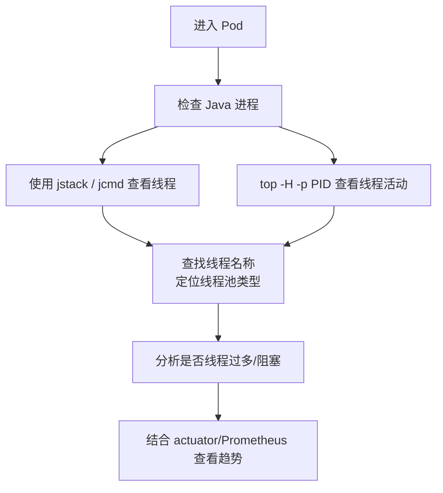
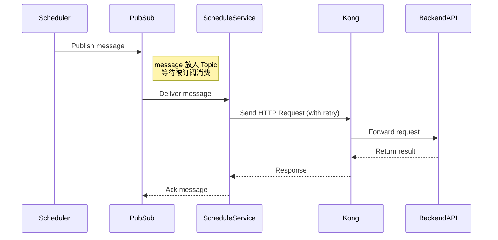
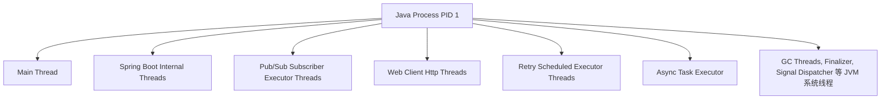
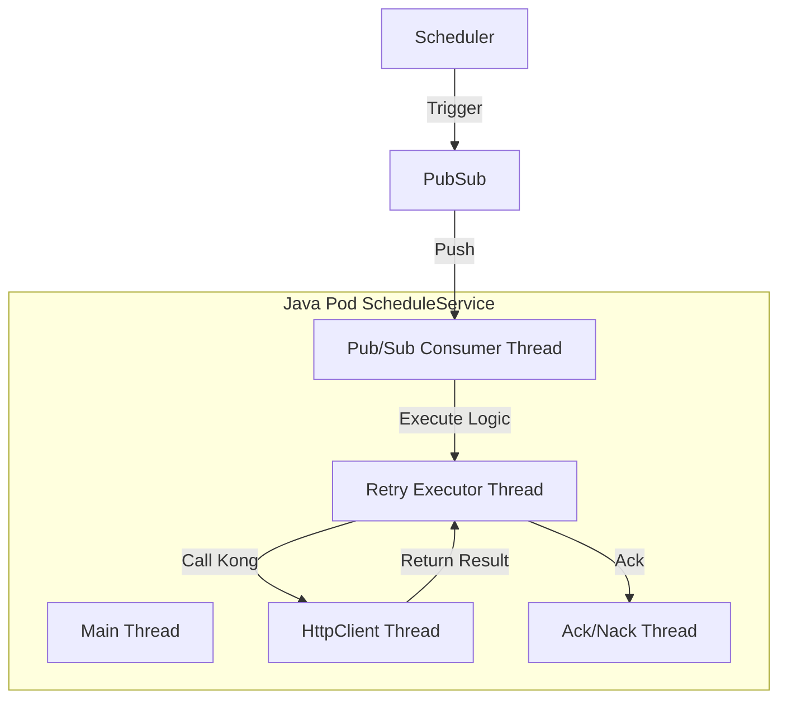

要查看运行在 GKE 中的 Java 应用的**进程和线程信息**，尤其是 Spring Boot 服务中各种线程池（如主线程、定时任务、Web 请求处理线程等），可以使用以下方法：

---

## **✅ 一、查看 Java 进程信息（进程数）**

  

在 GKE 的 Pod 中，通常只有一个 Java 主进程（除非你显式运行多个）。你可以进入容器中查看：

```
kubectl exec -it POD_NAME -n NAMESPACE -- bash
ps -ef | grep java
```

输出示例：

```
root        1  0.5  ... java -jar my-app.jar
```

> 如果你使用了多线程，那么进程不会变多，而是 Java 进程内部的线程数会增加。

---

## **✅ 二、查看 Java 的线程数**

  

### **1. 使用** 

### **jcmd**

###  **或** 

### **jstack**

###  **查看线程**

  

前提：容器镜像中包含 openjdk 工具包（包含 jcmd, jstack）

```
jcmd 1 Thread.print
# 或者
jstack 1
```

说明：

- 1 是 Java 进程的 PID
    
- Thread.print 会显示所有线程的运行状态，包括线程名称、状态、栈帧信息等
    

  

### **2. 使用** 

### **top -H -p <PID>**

###  **查看线程活动（系统级）**

```
top -H -p 1
```

说明：

- -H 显示线程
    
- 可以看到 Java 进程的各线程 CPU 占用情况（按线程级别）
    

---

## **✅ 三、Spring Boot 应用中的线程池识别方式**

  

Spring Boot 常见线程包括：

|**线程池类型**|**默认线程名前缀**|**说明**|
|---|---|---|
|Web 请求线程|http-nio-8080-exec-*（Tomcat）|处理 HTTP 请求|
|定时任务线程池|scheduling-1, scheduling-2|@Scheduled 任务线程|
|异步任务线程池|task-1, task-2|@Async 方法执行线程|
|主线程|main|SpringBoot 启动主线程|
|GC线程|GC Thread#*|JVM 垃圾回收线程|

> 在 jstack 或 jcmd Thread.print 的输出中你能看到这些线程名称和堆栈，便于定位是谁创建的线程。

---

## **✅ 四、可视化监控（推荐）**

  

### **1. 使用** 

### **Prometheus + Micrometer + Grafana**

###  **监控线程数**

  

在 application.yml 添加：

```
management:
  endpoints:
    web:
      exposure:
        include: "*"
  metrics:
    enable:
      jvm.threads.live: true
      jvm.threads.daemon: true
      jvm.threads.peak: true
```

查看指标：

```
/actuator/prometheus
```

这些 JVM Thread Metrics 会展示线程总数、守护线程数、峰值等信息。

---

## **✅ 五、实际排查流程（Mermaid）**



---

## **✅ 示例命令组合**

```
kubectl exec -it my-pod -n my-namespace -- bash

# 查看Java PID
ps -ef | grep java

# 查看线程详情
jstack 1 | less

# 或者系统线程监控
top -H -p 1
```

---

如果你不能在容器中安装这些工具，建议在 Dockerfile 构建时加入：

```
RUN apt-get update && apt-get install -y openjdk-17-jdk
```

---

如果你有具体某类线程（比如 @Async 或 @Scheduled）执行不一致的行为，也可以把相关线程栈粘贴出来，我可以帮你分析。是否还需要我帮你写一个基于 actuator + Prometheus 的 JVM 线程监控 Grafana dashboard？


把问题帮我扩展,我关心所有根线程和进程有关的,比如还有pub/sub的消费线程?

我的典型的场景是这样的



我关心的是这个过程中的我的这个Schedule Service的 线程和进程 等等 更或者pub/sub的消费线程?


非常好，你的场景涉及一个典型的 **事件驱动 + HTTP 回调集成的服务**。在这个流程中，你部署在 GKE 中的 **Java ScheduleService** 是关键组件，扮演了连接 Pub/Sub 与后端 API 的桥梁角色。

---

## **✅ 问题扩展：你需要关心的所有「线程 / 进程」点**

  

### **🔍 整体线程结构图（Java ScheduleService）**



---

## **✅ 各类线程解释与查看方式**

|**类型**|**示例线程名**|**查看方式**|**说明**|
|---|---|---|---|
|主线程|main|jstack, jcmd, top -H|启动 Spring Boot 的主线程|
|Pub/Sub 消费线程|ForkJoinPool.commonPool-worker-* 或 自定义命名|jstack|由 com.google.cloud.pubsub.v1.Subscriber 启动，用于处理消息回调|
|WebClient 请求线程|reactor-http-* 或 Netty IO|jstack|异步 HTTP 请求处理线程|
|Retry / 定时任务线程池|scheduler-*|jstack|如使用 ScheduledExecutorService 或 Spring 的 @Scheduled|
|异步任务线程池|task-*|jstack|@Async 配置的线程池|
|GC/System 线程|GC Thread#0, Signal Dispatcher 等|jstack, top -H|JVM 自带线程|

---

## **✅ 如何具体查看线程**

  

### **1. 使用** 

### **jstack**

```
kubectl exec -it POD_NAME -n NAMESPACE -- jstack 1 | less
```

你可以搜索以下关键词：

- main
    
- ForkJoinPool
    
- ScheduledExecutor
    
- reactor-http
    
- task-
    

  

### **2. 使用** 

### **/actuator/metrics**

  

确保开启以下配置：

```
management:
  endpoints:
    web:
      exposure:
        include: "*"
  metrics:
    enable:
      jvm.threads.live: true
      jvm.threads.daemon: true
      jvm.threads.peak: true
```

访问：

```
/actuator/metrics/jvm.threads.live
```

---

## **✅ Pub/Sub 消费线程深入分析**

  

### **背后机制**

  

你使用的是 com.google.cloud.pubsub.v1.Subscriber，典型代码：

```
Subscriber subscriber =
    Subscriber.newBuilder(subscriptionName, messageReceiver).build();
subscriber.startAsync().awaitRunning();
```

- 内部会自动启动线程池消费消息，默认使用 ForkJoinPool.commonPool() 或 Executors.newCachedThreadPool()。
    
- 每条消息交由一个线程 messageReceiver.receiveMessage() 来处理。
    

  

### **如何控制线程数？**

  

你可以在创建 Subscriber 时配置 executor：

```
ExecutorProvider executorProvider =
    InstantiatingExecutorProvider.newBuilder().setExecutorThreadCount(10).build();

Subscriber subscriber =
    Subscriber.newBuilder(subscriptionName, messageReceiver)
              .setExecutorProvider(executorProvider)
              .build();
```

---

## **✅ 推荐线程监控/定位方式总结**

|**工具/方法**|**说明**|
|---|---|
|jstack|最直观查看线程名称、栈信息、状态（如 WAITING, RUNNABLE）|
|jcmd 1 Thread.print|同 jstack，但格式更结构化|
|top -H -p 1|查看线程实时 CPU 使用（系统级）|
|/actuator/metrics|获取线程数趋势，做 Grafana 可视化|
|Prometheus/Micrometer|整合 JVM Metrics 指标监控|

---

## **✅ 与流程图结合理解（Mermaid）**



---

## **✅ 总结建议**

|**项目**|**建议操作**|
|---|---|
|线程数量监控|使用 Actuator + Prometheus|
|堆栈定位阻塞线程|使用 jstack，重点关注 WAITING 状态线程|
|Pub/Sub 消费控制|显式设置 ExecutorProvider 和 flow control 参数|
|线程名称规范化|配置自定义线程池线程名前缀便于识别|

---

如你还需要我提供 Prometheus + Grafana JVM 线程监控 Dashboard JSON、或者 Spring Boot 中如何收集并标识线程池来源代码样例，也可以告诉我。