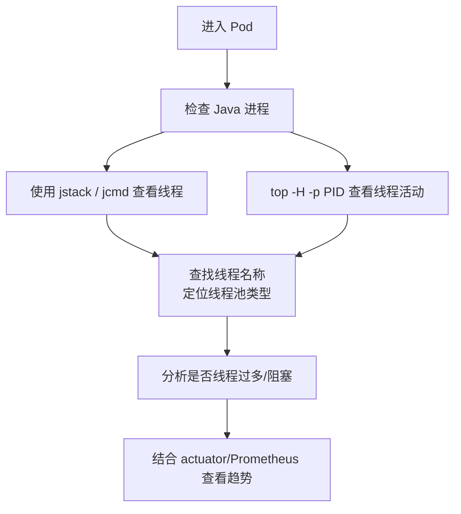
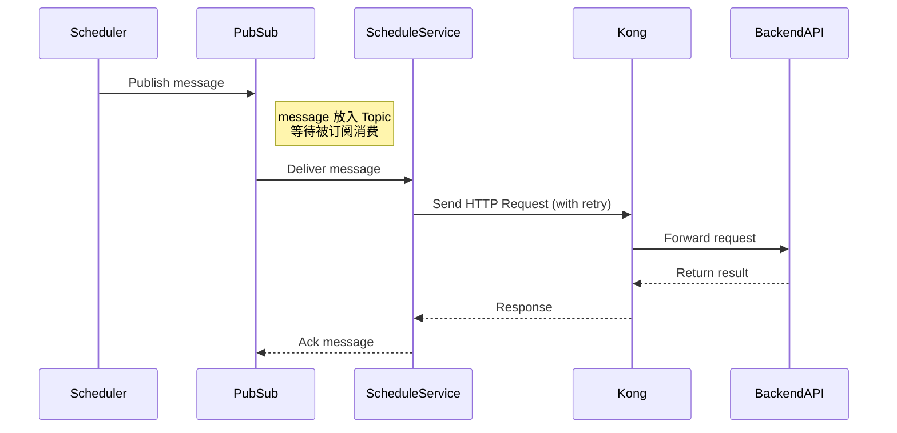
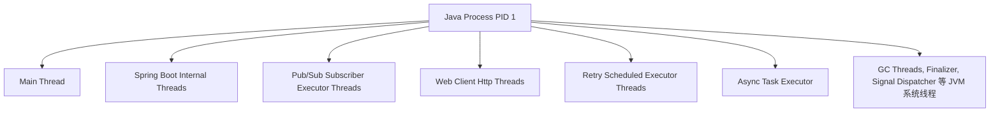
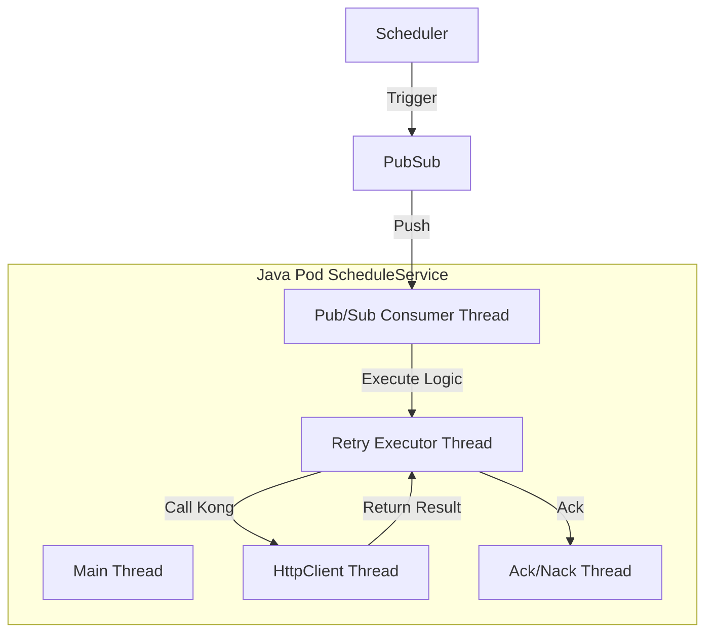

要查看运行在 GKE 中的 Java 应用的**进程和线程信息**，尤其是 Spring Boot 服务中各种线程池（如主线程、定时任务、Web 请求处理线程等），可以使用以下方法：

ps -eLf


很高兴能帮助你解答这个问题。以下是关于如何使用 `ps -eLf` 查看 Java 线程数以及如何进一步查看每个线程占用内存的详细分析和方法。我会以 Markdown 格式输出，方便你查阅。

---

## 使用 `ps -eLf` 查看 Java 线程数

`ps -eLf` 是一个强大的命令，用于列出系统中所有进程的线程信息。以下是如何使用它统计 Java 进程线程数的步骤：

1. **找到 Java 进程的 PID**:
   首先，你需要找到运行 Java 应用的进程 ID（PID）。可以使用以下命令：
   ```bash
   ps aux | grep java
   ```
   输出中会显示与 Java 相关的进程，找到你的应用对应的 PID（通常会看到类似 `java -jar` 或其他 Java 命令的参数）。

2. **使用 `ps -eLf` 查看线程信息**:
   使用以下命令列出特定进程的所有线程：
   ```bash
   ps -eLf | grep <PID>
   ```
   或者直接查看特定 PID 的线程：
   ```bash
   ps -T -p <PID>
   ```
   - `-T` 参数会显示进程下的所有线程。
   - 输出中的每一行代表一个线程，`LWP` 列表示线程 ID（Lightweight Process ID）。

3. **统计线程数量**:
   使用 `wc -l` 统计线程数：
   ```bash
   ps -T -p <PID> | wc -l
   ```
   注意：结果会包括标题行，所以实际线程数需要减 1。

**示例**：
假设 Java 进程的 PID 是 12345，执行以下命令：
```bash
ps -T -p 12345 | wc -l
```
输出为 `101`，则实际线程数为 `100`。

---

## 查看每个线程占用多少内存

遗憾的是，`ps -eLf` 或 `ps -T` 本身并不能直接提供每个线程的内存占用情况，因为 Linux 系统中的线程是轻量级进程（LWP），它们共享进程的内存空间。也就是说，线程本身不独立分配内存，而是共享所属进程的内存（包括堆、栈等）。因此，标准工具如 `ps` 通常只提供进程级别的内存使用信息（如 `RSS` 和 `VSZ`），而无法直接细化到线程级别。

不过，以下是一些方法和工具，可以帮助你间接分析或近似了解线程的内存占用情况，特别是在 Java 应用中：

### 方法 1：查看进程总内存占用
由于线程共享进程内存，可以先查看整个 Java 进程的内存占用情况，作为参考：
```bash
ps -p <PID> -o pid,ppid,rss,vsz
```
- `RSS`（Resident Set Size）：实际使用的物理内存（单位：KB）。
- `VSZ`（Virtual Size）：虚拟内存大小（单位：KB）。

**注意**：这只是进程总内存，无法区分每个线程的具体占用。

### 方法 2：使用 `/proc/<PID>/task/<TID>/status` 查看线程信息
Linux 系统在 `/proc` 目录下提供了线程级别的状态信息，可以查看每个线程的内存相关数据，但通常仍然是共享的进程内存：
1. 找到 Java 进程的 PID 和线程 ID（TID，使用 `ps -T -p <PID>` 获取）。
2. 查看特定线程的状态文件：
   ```bash
   cat /proc/<PID>/task/<TID>/status
   ```
   输出中会包含 `VmRSS` 和 `VmSize` 等字段，但这些值通常反映的是整个进程的内存，而不是线程独占的内存。

**说明**：线程的栈内存是独立的，可以通过 `VmStk` 字段查看每个线程的栈大小，但这只是线程内存占用的一部分（通常很小，几十到几百 KB），大部分内存（如 Java 堆）是共享的。

### 方法 3：使用 Java 工具分析线程内存占用
由于 Java 线程的内存主要集中在 JVM 堆和栈中，建议使用 Java 自带的工具来分析线程级别的内存使用情况：

#### 1. 使用 `jstack` 查看线程堆栈信息
`jstack` 可以生成 Java 进程的线程堆栈快照，虽然它不直接提供内存占用数据，但可以帮助你了解线程状态和可能的内存泄漏问题。
```bash
jstack <PID> > thread_dump.txt
```
查看 `thread_dump.txt`，分析线程数量和状态（如是否阻塞）。

#### 2. 使用 `jmap` 和 `jhat` 分析内存分配
- 使用 `jmap` 导出堆内存快照：
  ```bash
  jmap -dump:live,format=b,file=heap_dump.hprof <PID>
  ```
- 使用 `jhat` 或其他工具（如 VisualVM）分析堆转储文件，查看对象分配情况。虽然这不是线程级别的直接数据，但可以结合线程活动推断内存占用。

#### 3. 使用 VisualVM 或 JConsole 监控
VisualVM 和 JConsole 是 Java 自带的图形化监控工具，可以实时查看线程数量、状态和内存使用情况。
- 启动 VisualVM：
  ```bash
  visualvm
  ```
- 连接到你的 Java 进程，切换到“线程”选项卡查看线程状态，或者到“内存”选项卡查看堆和非堆内存使用情况。
- 虽然不能精确到每个线程的内存，但可以结合线程活动和堆对象分配进行推断。

### 方法 4：使用第三方工具分析线程内存
一些第三方工具可以更细致地分析线程内存占用：
- **pidstat**（来自 `sysstat` 包）：可以监控线程的 CPU 使用情况，但内存仍然是进程级别的。
- **perf**：Linux 自带的性能分析工具，可以采样线程的资源使用，但需要一定的配置和分析技能。
- **GDB**：可以附加到进程并检查线程栈内存，但操作复杂且不直观。

---

## 为什么难以精确到每个线程的内存占用？

1. **线程内存共享**：
   在 Linux 中，线程是进程的轻量级执行单元，共享进程的地址空间。Java 应用中，大部分内存（如堆内存）由所有线程共享，难以归因到某个线程。

2. **栈内存独立但占比较小**：
   每个线程有独立的栈内存（Java 中默认 1MB，可通过 `-Xss` 调整），但栈内存通常只占线程内存使用的一小部分，堆内存才是主要部分。

3. **工具限制**：
   标准 Linux 工具（如 `ps` 和 `/proc`）主要提供进程级别的资源统计，线程级别的内存分配需要依赖 JVM 内部工具或专门的性能分析工具。

---

## 建议与总结

1. **线程数量统计**：
   使用 `ps -T -p <PID> | wc -l` 可以准确统计 Java 进程的线程数。

2. **线程内存占用**：
   - 无法通过 `ps` 直接获取每个线程的内存占用，因为线程共享进程内存。
   - 建议使用 Java 自带工具（如 VisualVM、JConsole、`jmap`）分析 JVM 内存分配和线程活动，间接推断内存使用情况。
   - 如果只需要栈内存信息，可以通过 `/proc/<PID>/task/<TID>/status` 查看 `VmStk` 字段。

3. **优化与监控**：
   - 如果线程数量过多，建议调整 Java 线程池大小（如 `executor-threads`），避免不必要的线程开销。
   - 定期使用 VisualVM 或 Cloud Monitoring 监控 JVM 内存和线程状态，确保系统资源利用合理。

**示例**：
假设你的 Java 进程 PID 为 12345，统计线程数并查看内存总占用：
```bash
# 统计线程数
ps -T -p 12345 | wc -l

# 查看进程内存占用
ps -p 12345 -o pid,ppid,rss,vsz

# 查看某个线程的栈内存（假设 TID 为 12346）
cat /proc/12345/task/12346/status | grep VmStk
```
很高兴继续为你解答关于线程内存占用的疑问。我会详细解释栈内存的概念以及为什么它只是线程内存的一部分，同时探讨如何更全面地了解一个线程的内存占用情况。以下内容以 Markdown 格式输出，方便你查阅。

---

## 什么是线程的栈内存？

### 栈内存的基本概念
在 Linux 和 Java 中，每个线程都有一个独立的栈内存（Stack Memory），用于存储线程执行过程中的局部变量、方法调用信息（如函数调用栈）和临时数据。栈内存的特点是：
- **独立性**：每个线程的栈内存是独立的，不会被其他线程访问。
- **大小限制**：栈内存通常有固定的默认大小，在 Java 中可以通过 JVM 参数 `-Xss` 设置（默认值通常为 1MB，但取决于操作系统和 JVM 配置）。
- **生命周期**：栈内存随着线程的创建而分配，随着线程的结束而释放。

### 如何查看栈内存大小
在 Linux 系统中，可以通过 `/proc/<PID>/task/<TID>/status` 文件查看某个线程的栈内存大小：
```bash
cat /proc/<PID>/task/<TID>/status | grep VmStk
```
输出示例：
```
VmStk:       136 kB
```
这里的 `VmStk` 表示该线程的栈内存使用量（单位：kB）。需要注意的是：
- 这只是当前使用的栈内存量，而不是分配的总栈内存大小。
- 实际分配的栈大小通常比使用的要大（例如，默认 1MB，但可能只用了 136kB）。

---

## 栈内存只是线程内存的一部分

栈内存虽然是线程独占的，但它只是线程内存占用的一部分，且通常占比很小。线程的内存占用主要包括以下几个方面：

1. **栈内存（Stack Memory）**：
   - 如上所述，存储局部变量和调用栈信息，通常只有几十到几百 kB，甚至不到 1MB。
   - 可以通过 `-Xss` 参数调整栈大小，例如 `-Xss512k` 将栈大小设置为 512kB。

2. **堆内存（Heap Memory）**：
   - 堆内存是 JVM 中存储对象和数组的地方，所有线程共享。
   - 线程通过在堆上创建对象来分配内存，但这些内存无法直接归因到某个线程，因为对象可能被多个线程引用。
   - 堆内存通常是 Java 应用内存占用的主要部分，可能达到几 GB，远超栈内存。

3. **非堆内存（Non-Heap Memory）**：
   - 包括方法区（存储类信息、常量池等）、本地内存（用于 JNI 调用）等。
   - 这些内存也是线程共享的，无法直接归因到某个线程。

4. **线程元数据和开销**：
   - 线程本身的数据结构（如线程控制块 TCB）也会占用少量内存，但这部分通常由操作系统管理，难以量化。

**总结**：栈内存只是线程独占内存的一部分，且占比很小（通常不到 1MB），而线程的大部分内存占用来自共享的堆内存。由于堆内存是共享的，很难精确计算某个线程的“总内存占用”。

---

## 如何更全面地了解线程的内存占用？

由于线程内存占用的复杂性（栈内存独占，堆内存共享），Linux 标准工具（如 `ps` 或 `/proc`）无法直接提供某个线程的完整内存占用情况。以下是几种方法，帮助你从不同角度分析线程的内存占用：

### 方法 1：查看栈内存（独占部分）
如前所述，使用 `/proc` 文件系统查看线程的栈内存：
```bash
cat /proc/<PID>/task/<TID>/status | grep VmStk
```
这只能反映栈内存部分，无法涵盖线程在堆上的内存分配。

**适用场景**：如果你关心的是栈内存是否过大（例如，递归调用导致栈溢出），可以通过此方法检查。

### 方法 2：分析堆内存分配（共享部分）
由于堆内存是线程内存占用的主要部分，可以通过 Java 工具分析堆内存分配，并结合线程活动推断内存占用：

#### 1. 使用 `jmap` 和 `jhat` 导出并分析堆转储
- 导出堆内存快照：
  ```bash
  jmap -dump:live,format=b,file=heap_dump.hprof <PID>
  ```
- 使用 `jhat` 或其他工具（如 Eclipse MAT）分析堆转储文件，查看对象分配情况。
- 结合 `jstack` 生成的线程堆栈快照，分析哪些线程创建或引用了大量对象，间接推断内存占用。
  ```bash
  jstack <PID> > thread_dump.txt
  ```

**适用场景**：适合排查内存泄漏或某个线程创建大量对象的情况。

#### 2. 使用 VisualVM 或 JConsole 监控
- 启动 VisualVM：
  ```bash
  visualvm
  ```
- 连接到目标 Java 进程，在“线程”选项卡查看线程状态，在“内存”选项卡查看堆内存使用情况。
- 通过观察线程活动和堆内存分配，推断某些线程是否可能占用较多内存（例如，某个线程持续创建对象）。

**适用场景**：适合实时监控和初步分析。

### 方法 3：使用 JVM 参数和工具监控线程创建的对象
某些高级工具或 JVM 参数可以帮助追踪线程创建的对象：
- **Java Flight Recorder (JFR)**：这是一个内置于 JDK 的低开销性能分析工具，可以记录线程活动和对象分配事件。
  启动 JFR：
  ```bash
  java -XX:+UnlockCommercialFeatures -XX:+FlightRecorder -XX:StartFlightRecording=duration=60s,filename=recording.jfr -jar your-app.jar
  ```
  分析记录文件时，可以查看对象分配与线程的关联。
- **第三方工具**：如 YourKit 或 JProfiler，可以更细致地追踪线程与内存分配的关系。

**适用场景**：适合深入性能分析和调试。

### 方法 4：估算线程内存开销
如果只需要一个粗略的估算，可以按照以下方式近似计算：
- 栈内存：假设每个线程栈大小为 1MB（默认值，或通过 `-Xss` 调整）。
- 堆内存：根据应用特性估算每个线程可能创建的对象大小（例如，每个线程处理一个任务可能创建 10MB 对象）。
- 总开销：每个线程的内存占用 ≈ 栈内存 + 平均堆内存分配。

**注意**：这种方法只是粗略估计，实际堆内存分配可能因对象生命周期和共享引用而复杂得多。

---

## 为什么难以精确计算线程的内存占用？

1. **堆内存共享**：
   堆内存是所有线程共享的，某个对象可能由一个线程创建，但被多个线程引用，难以归因到某个线程。

2. **工具限制**：
   Linux 工具（如 `ps` 和 `/proc`）只提供进程级别的内存统计，或线程的栈内存信息。
   Java 工具可以提供堆内存分配信息，但需要结合线程活动手动分析。

3. **动态性**：
   内存分配是动态的，对象可能被垃圾回收，线程的内存占用随时间变化，难以实时精确计算。

---

## 建议与总结

1. **栈内存查看**：
   如果你只关心线程的栈内存，可以通过 `/proc/<PID>/task/<TID>/status | grep VmStk` 获取。这部分是线程独占的，但通常很小。

2. **全面内存分析**：
   如果你想了解线程的整体内存占用（包括堆内存），建议使用 Java 自带工具（如 VisualVM、JConsole、`jmap`）或第三方工具（如 YourKit）分析堆内存分配，并结合线程活动推断：
   - 使用 `jstack` 查看线程状态。
   - 使用 `jmap` 导出堆转储，分析对象分配。
   - 使用 VisualVM 实时监控线程和内存。

3. **优化建议**：
   - 如果线程数量过多，检查是否可以通过调整线程池大小（如 `executor-threads`）减少线程开销。
   - 如果栈内存使用量过高（例如，频繁递归调用），可以通过 `-Xss` 参数减小栈大小，但要避免 `StackOverflowError`。
   - 定期监控 JVM 内存使用情况，防止内存泄漏或过度分配。

**示例**：
假设你的 Java 进程 PID 为 12345，某个线程 TID 为 12346：
```bash
# 查看线程栈内存
cat /proc/12345/task/12346/status | grep VmStk

# 导出线程堆栈快照
jstack 12345 > thread_dump.txt

# 导出堆内存快照
jmap -dump:live,format=b,file=heap_dump.hprof 12345
```

如果你有更具体的需求（例如，某个线程疑似内存泄漏）或需要工具的具体使用步骤，欢迎继续讨论！😊

---
在 Java 中，**栈内存（Stack Memory）确实是线程私有的内存区域**，每个线程都有自己的栈，用于存储方法调用栈帧、局部变量等。但要精确查看“每个线程的栈内存使用情况”并不容易，因为 Java 本身并不直接暴露每个线程实际栈使用的 API。不过你可以使用一些间接的方法和工具来观察或估算线程的内存使用情况。

---

## **🔍 一、理论基础**

  

每个线程的栈内存大小由 JVM 参数控制：

```
-Xss512k
```

这个参数定义了 **每个线程栈的最大大小**（默认通常是 1MB 或 1024k，取决于 JVM 实现和平台）。

---

## **🔧 二、查看线程占用的内存方法**

  

### **✅ 1.** 

### **jcmd / jmap + native memory tracking（NMT）**

```
jcmd <pid> VM.native_memory summary
```

输出中会看到：

```
Thread (reserved=xxxKB, committed=xxxKB)
```

其中 Thread 一项代表了线程分配的 native memory，包括线程栈。

  

可以使用如下命令启用 NMT：

```
-XX:NativeMemoryTracking=summary
```

---

### **✅ 2.** 

### **使用 top + gdb 查看每个线程的内存分配**

  

此方法适合在 Linux 上精确查看线程使用的栈内存地址和范围：

1. 找出 Java 进程 PID：
    

```
ps -ef | grep java
```

2. 附加到进程上：
    

```
gdb -p <java_pid>
```

3. 查看线程信息：
    

```
info threads
```

4. 切换到某个线程：
    

```
thread <N>
```

5. 查看栈范围（以x86为例）：
    

```
info proc mappings
```

你会看到一段标记为 [stack] 的地址范围。

---

### **✅ 3.** 

### **通过 jstack + 估算方法栈帧大小**

  

虽然不能直接看到内存，但可以通过 jstack 查看线程调用深度：

```
jstack <pid>
```

然后结合 -Xss 参数估算每个线程的最大栈内存用量：

```
栈使用估算 = 当前线程调用深度 × 每帧平均占用大小（约几百字节）
```

---

### **✅ 4.** 

### **使用 Java Agent + JVMTI 编程方式**

  

借助 JVMTI（Java Virtual Machine Tool Interface），可以编写 Java Agent 获取每个线程的栈使用情况（需要 native 编程，不推荐初学者使用）。

---

### **✅ 5.** 

### **使用专业工具**

|**工具**|**功能**|
|---|---|
|**VisualVM**|可查看线程、堆、CPU 使用，但不直接显示线程栈内存|
|**Async Profiler**|对线程调用栈做 profiling，可间接分析调用深度|
|**perf + FlameGraph**|可以分析 native 层线程栈空间，但需要经验配置|

---

## **✅ 总结建议（实用场景）**

|**目标**|**建议使用工具**|
|---|---|
|查看每线程最大分配的栈空间|-Xss 配置参数|
|查看当前线程的总栈内存使用量|jcmd <pid> VM.native_memory summary|
|查看线程实际内存地址|gdb 查看 [stack] 区域|
|查看线程调用深度|jstack + 人工估算|

---

如果你需要对 Java 服务的线程数、栈使用风险进行分析，推荐流程如下：

```
flowchart TD
    A[获取 JVM PID] --> B[jcmd 或 jstack 获取线程信息]
    B --> C[结合 -Xss 估算最大栈使用]
    B --> D[使用 NMT 查看线程总栈占用]
    C --> E[发现异常调用深度 → 优化递归或大对象局部变量]
    D --> F[线程过多占用 → 调整 -Xss 或优化线程模型]
```

---

需要我帮你分析具体某个 Java 程序中的线程使用情况，可以提供：

- ps 或 jps 输出
    
- jstack 输出
    
- 你设置的 -Xss 值
    

  

我可以进一步帮你做估算

---

---

## **✅ 一、查看 Java 进程信息（进程数）**

  

在 GKE 的 Pod 中，通常只有一个 Java 主进程（除非你显式运行多个）。你可以进入容器中查看：

```
kubectl exec -it POD_NAME -n NAMESPACE -- bash
ps -ef | grep java
```

输出示例：

```
root        1  0.5  ... java -jar my-app.jar
```

> 如果你使用了多线程，那么进程不会变多，而是 Java 进程内部的线程数会增加。

---

## **✅ 二、查看 Java 的线程数**

  

### **1. 使用** 

### **jcmd**

###  **或** 

### **jstack**

###  **查看线程**

  

前提：容器镜像中包含 openjdk 工具包（包含 jcmd, jstack）

```
jcmd 1 Thread.print
# 或者
jstack 1
```

说明：

- 1 是 Java 进程的 PID
    
- Thread.print 会显示所有线程的运行状态，包括线程名称、状态、栈帧信息等
    

  

### **2. 使用** 

### **top -H -p <PID>**

###  **查看线程活动（系统级）**

```
top -H -p 1
```

说明：

- -H 显示线程
    
- 可以看到 Java 进程的各线程 CPU 占用情况（按线程级别）
    

---

## **✅ 三、Spring Boot 应用中的线程池识别方式**

  

Spring Boot 常见线程包括：

|**线程池类型**|**默认线程名前缀**|**说明**|
|---|---|---|
|Web 请求线程|http-nio-8080-exec-*（Tomcat）|处理 HTTP 请求|
|定时任务线程池|scheduling-1, scheduling-2|@Scheduled 任务线程|
|异步任务线程池|task-1, task-2|@Async 方法执行线程|
|主线程|main|SpringBoot 启动主线程|
|GC线程|GC Thread#*|JVM 垃圾回收线程|

> 在 jstack 或 jcmd Thread.print 的输出中你能看到这些线程名称和堆栈，便于定位是谁创建的线程。

---

## **✅ 四、可视化监控（推荐）**

  

### **1. 使用** 

### **Prometheus + Micrometer + Grafana**

###  **监控线程数**

  

在 application.yml 添加：

```
management:
  endpoints:
    web:
      exposure:
        include: "*"
  metrics:
    enable:
      jvm.threads.live: true
      jvm.threads.daemon: true
      jvm.threads.peak: true
```

查看指标：

```
/actuator/prometheus
```

这些 JVM Thread Metrics 会展示线程总数、守护线程数、峰值等信息。

---

## **✅ 五、实际排查流程（Mermaid）**



---

## **✅ 示例命令组合**

```
kubectl exec -it my-pod -n my-namespace -- bash

# 查看Java PID
ps -ef | grep java

# 查看线程详情
jstack 1 | less

# 或者系统线程监控
top -H -p 1
```

---

如果你不能在容器中安装这些工具，建议在 Dockerfile 构建时加入：

```
RUN apt-get update && apt-get install -y openjdk-17-jdk
```

---

如果你有具体某类线程（比如 @Async 或 @Scheduled）执行不一致的行为，也可以把相关线程栈粘贴出来，我可以帮你分析。是否还需要我帮你写一个基于 actuator + Prometheus 的 JVM 线程监控 Grafana dashboard？


把问题帮我扩展,我关心所有根线程和进程有关的,比如还有pub/sub的消费线程?

我的典型的场景是这样的



我关心的是这个过程中的我的这个Schedule Service的 线程和进程 等等 更或者pub/sub的消费线程?


非常好，你的场景涉及一个典型的 **事件驱动 + HTTP 回调集成的服务**。在这个流程中，你部署在 GKE 中的 **Java ScheduleService** 是关键组件，扮演了连接 Pub/Sub 与后端 API 的桥梁角色。

---

## **✅ 问题扩展：你需要关心的所有「线程 / 进程」点**

  

### **🔍 整体线程结构图（Java ScheduleService）**



---

## **✅ 各类线程解释与查看方式**

|**类型**|**示例线程名**|**查看方式**|**说明**|
|---|---|---|---|
|主线程|main|jstack, jcmd, top -H|启动 Spring Boot 的主线程|
|Pub/Sub 消费线程|ForkJoinPool.commonPool-worker-* 或 自定义命名|jstack|由 com.google.cloud.pubsub.v1.Subscriber 启动，用于处理消息回调|
|WebClient 请求线程|reactor-http-* 或 Netty IO|jstack|异步 HTTP 请求处理线程|
|Retry / 定时任务线程池|scheduler-*|jstack|如使用 ScheduledExecutorService 或 Spring 的 @Scheduled|
|异步任务线程池|task-*|jstack|@Async 配置的线程池|
|GC/System 线程|GC Thread#0, Signal Dispatcher 等|jstack, top -H|JVM 自带线程|

---

## **✅ 如何具体查看线程**

  

### **1. 使用** 

### **jstack**

```
kubectl exec -it POD_NAME -n NAMESPACE -- jstack 1 | less
```

你可以搜索以下关键词：

- main
    
- ForkJoinPool
    
- ScheduledExecutor
    
- reactor-http
    
- task-
    

  

### **2. 使用** 

### **/actuator/metrics**

  

确保开启以下配置：

```
management:
  endpoints:
    web:
      exposure:
        include: "*"
  metrics:
    enable:
      jvm.threads.live: true
      jvm.threads.daemon: true
      jvm.threads.peak: true
```

访问：

```
/actuator/metrics/jvm.threads.live
```

---

## **✅ Pub/Sub 消费线程深入分析**

  

### **背后机制**

  

你使用的是 com.google.cloud.pubsub.v1.Subscriber，典型代码：

```
Subscriber subscriber =
    Subscriber.newBuilder(subscriptionName, messageReceiver).build();
subscriber.startAsync().awaitRunning();
```

- 内部会自动启动线程池消费消息，默认使用 ForkJoinPool.commonPool() 或 Executors.newCachedThreadPool()。
    
- 每条消息交由一个线程 messageReceiver.receiveMessage() 来处理。
    

  

### **如何控制线程数？**

  

你可以在创建 Subscriber 时配置 executor：

```
ExecutorProvider executorProvider =
    InstantiatingExecutorProvider.newBuilder().setExecutorThreadCount(10).build();

Subscriber subscriber =
    Subscriber.newBuilder(subscriptionName, messageReceiver)
              .setExecutorProvider(executorProvider)
              .build();
```

---

## **✅ 推荐线程监控/定位方式总结**

|**工具/方法**|**说明**|
|---|---|
|jstack|最直观查看线程名称、栈信息、状态（如 WAITING, RUNNABLE）|
|jcmd 1 Thread.print|同 jstack，但格式更结构化|
|top -H -p 1|查看线程实时 CPU 使用（系统级）|
|/actuator/metrics|获取线程数趋势，做 Grafana 可视化|
|Prometheus/Micrometer|整合 JVM Metrics 指标监控|

---

## **✅ 与流程图结合理解（Mermaid）**



---

## **✅ 总结建议**

|**项目**|**建议操作**|
|---|---|
|线程数量监控|使用 Actuator + Prometheus|
|堆栈定位阻塞线程|使用 jstack，重点关注 WAITING 状态线程|
|Pub/Sub 消费控制|显式设置 ExecutorProvider 和 flow control 参数|
|线程名称规范化|配置自定义线程池线程名前缀便于识别|

---

如你还需要我提供 Prometheus + Grafana JVM 线程监控 Dashboard JSON、或者 Spring Boot 中如何收集并标识线程池来源代码样例，也可以告诉我。