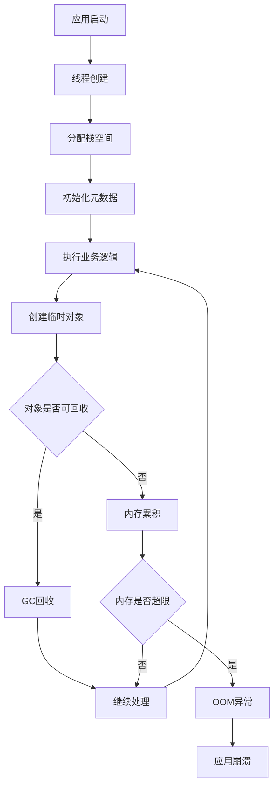

## **📌 线程内存消耗组成：**

| **资源**               | **说明**                               | **估算值**                               |
| ---------------------- | -------------------------------------- | ---------------------------------------- |
| 线程栈（Thread Stack） | 每个线程的栈空间（默认栈深度）         | 默认 ≈ **1MB**（可调）                   |
| 本地线程元数据         | JVM 内部线程结构等                     | 几十 KB                                  |
| 消息处理中产生的对象   | 如 JSON 请求体、响应体、日志等临时对象 | 估计 **50~500KB**/线程（取决于对象结构） |

帮我评估这个 Java 线程的消耗?

# Google Studio

好的，我们来对这个 Java 线程的内存消耗进行一个全面且深入的评估。你提供的表格是一个非常好的起点，它准确地指出了核心组成部分。下面我将对每一项进行展开分析，并给出一个综合的评估结论。

---

### **评估结论总览**

你提供的估算非常合理。一个典型的 Java 线程在 **空闲状态** 下的固定内存开销主要由 **线程栈** 决定，通常在 **1MB 左右**。当线程 **执行任务** 时，它会临时性地在 **堆（Heap）** 上创建和使用业务对象，这部分内存是动态的、可回收的，但会显著影响系统的总内存占用。

下面我们来逐项拆解分析。

### **一、 各项资源消耗深度分析**

#### 1. 线程栈 (Thread Stack) - **固定开销的核心**

线程栈是线程私有的内存区域，用于存储方法调用的“帧”（Stack Frame）。

- **估算值分析**：
    - 你给出的 **≈ 1MB** 是非常标准的估算值，尤其是在 64 位操作系统和 64 位 JVM 上，这是 HotSpot JVM 的默认值（通过 `-Xss` 参数设置）。
    - 在 32 位系统上，默认值通常更小（如 320KB 或 512KB）。
- **存储内容**：
    - **局部变量**：方法内的基本数据类型（`int`, `double` 等）和 **对象引用**（Reference）。
    - **操作数栈**：执行字节码指令时用于计算的临时区域。
    - **方法出口信息**：调用方法返回时需要恢复的上下文。
- **关键点**：
    - **对象本身不在栈上**：栈上只存储对象的**引用地址**（通常是 4 或 8 字节），而对象实例本身存储在**堆内存**中。这是最关键的区别！
    - **不可共享**：每个线程的栈都是独立的，互不影响。
    - **大小固定**：一旦线程创建，其栈空间大小就基本确定了。如果方法调用链太深或局部变量过多，会导致 `StackOverflowError`。

#### 2. 本地线程元数据 (JVM & OS Overhead) - **固定的附加开销**

这部分是 JVM 和操作系统为了管理一个线程所必须的额外数据结构。

- **估算值分析**：
    - 你估算的 **几十 KB** 是一个合理的范围。
- **包含内容**：
    - **`java.lang.Thread` 对象实例**：这个对象本身存在于**堆**上，包含了线程的名称、状态、优先级等信息。
    - **JVM 内部数据**：JVM 内部需要一个数据结构（如 HotSpot 中的 `Thread` C++ 对象）来与 `java.lang.Thread` 对象关联，并管理线程的执行状态。
    - **OS 原生线程结构**：每个 Java 线程都映射到一个操作系统（如 Linux）的内核线程（`Kernel Thread`），操作系统需要为其维护一个任务控制块（Task Control Block, TCB）等数据结构。
    - **JNI Handles**、**Thread-Local Storage (TLS)** 等。

#### 3. 消息处理中产生的对象 - **动态的、可回收的开销**

这是线程内存分析中最具动态性、也最容易引起误解的部分。

- **估算值分析**：
    - 你估算的 **50KB ~ 500KB / 线程** 是一个非常实际的业务场景估算。这部分内存消耗完全取决于业务逻辑的复杂性。
- **内存位置**：
    - **关键：这部分内存位于堆（Heap）上，而不是线程栈上！**
    - 堆是所有线程共享的内存区域。一个线程在执行任务时，会向堆申请内存来创建这些对象。
- **生命周期**：
    - 这些对象通常是**临时（Transient）**的。当请求处理完毕，方法执行结束，栈上对这些对象的引用被销毁后，它们就变成了“垃圾”。
    - 垃圾回收器（Garbage Collector, GC）会定期扫描堆，回收这些不再被任何线程引用的对象，释放内存。
- **影响因素**：
    - **请求/响应体大小**：处理巨大的 JSON 或 XML 会瞬时产生大量内存占用。
    - **业务逻辑**：复杂的计算、数据转换、集合操作等都会创建中间对象。
    - **数据库查询**：从数据库查询出的大量数据映射成的 POJO 对象。
    - **日志**：日志字符串的拼接和输出也会产生临时对象。

---

### **二、 综合评估与计算**

我们可以将线程的内存消耗分为两类：

1.  **线程固定开销 (Per-Thread Fixed Cost)**：只要线程存在，就会占用的内存。

    - `固定开销 = 线程栈 + JVM/OS 元数据`
    - `≈ 1MB + (几十 KB，我们取 64KB)`
    - `≈ 1024 KB + 64 KB = 1088 KB ≈ **1.06 MB**`

2.  **线程动态开销 (Per-Request Dynamic Cost)**：线程在处理请求时，在堆上临时占用的内存。这部分不焊死在线程上，而是与并发请求数相关。

#### **场景化计算示例**

假设我们有一个 Web 应用，配置了一个拥有 **200 个线程** 的线程池。在业务高峰期，有 **150 个线程** 正在同时处理请求。

- **固定内存占用**（所有线程池中的线程，无论是否在工作）：

    - `200 个线程 * 1.06 MB/线程 = 212 MB`
    - 这部分内存是相对稳定的，只要应用启动，这 **212 MB** 就会被占用，用于维持线程池。

- **动态内存占用**（正在处理请求的线程在堆上产生的对象）：

    - 假设平均每个请求产生的临时对象大小为 **300 KB**。
    - `150 个活跃请求 * 300 KB/请求 = 45,000 KB = 45 MB`
    - 这 **45 MB** 是瞬时的高峰堆内存占用。当请求处理完后，这部分内存会被 GC 回收。它直接影响 **Young Generation** 的大小和 **GC 频率**。

- **总影响**：
    - 在这种场景下，线程相关的内存占用峰值大约是 `212 MB (固定) + 45 MB (动态) = 257 MB`。
    - 这个计算帮助我们理解为什么在设置最大线程数时，必须考虑服务器的总物理内存。`最大线程数 * 线程栈大小` 是一个硬性限制，很容易耗尽内存导致无法创建新线程 (`OutOfMemoryError: unable to create new native thread`)。

### **三、 结论与优化建议**

**结论**：

你提供的表格和估算值是 **准确且有实践指导意义的**。核心结论是：**每个 Java 线程的固定内存成本约为 1MB，而其在运行期间对堆内存的动态冲击则取决于业务负载。**

**优化建议**：

1.  **合理配置线程池**：不要设置过大的线程池。线程数过多不仅会消耗大量固定内存，还会因 CPU 上下文切换导致性能下降。应根据系统的 CPU 核心数、I/O 模型和压测结果来确定最佳线程数。
2.  **调整线程栈大小 (`-Xss`)**：如果你的应用方法调用链普遍不深（例如，不是深度递归），可以适当调低 `-Xss` 的值（如 `-Xss256k` 或 `-Xss512k`），这样在相同的内存下可以创建更多的线程。但调整需谨慎，过小会导致 `StackOverflowError`。
3.  **优化堆内对象**：
    - **减少临时对象**：在代码中注意避免创建不必要的临时对象，尤其是在循环体内。
    - **使用对象池**：对于创建成本高、可复用的对象（如数据库连接、大的字节数组），使用对象池技术。
    - **选择高效的数据结构**：根据场景选择合适的集合类。
4.  **异步化和响应式编程**：对于 I/O 密集型应用，可以考虑使用 Netty、WebFlux 等异步框架。它们可以用极少数的线程（如 CPU 核心数）处理海量并发连接，极大地降低了线程固定开销。

# Grok

很高兴为你评估 Java 线程的内存消耗。基于你提供的表格和信息，我将详细分析线程内存消耗的组成，并对每个部分进行合理的估算和解释。最后，我会总结一个 Java 线程的大致内存占用范围。以下内容以 Markdown 格式输出，方便你查阅。

---

## **📌 Java 线程内存消耗评估**

你提供的表格列出了 Java 线程内存消耗的几个主要组成部分：线程栈（Thread Stack）、本地线程元数据、以及消息处理中产生的对象。我将逐一分析这些部分，并结合实际情况提供评估。

| **资源**               | **说明**                               | **估算值**                               | **评估与解释**                                                                                                                                                       |
| ---------------------- | -------------------------------------- | ---------------------------------------- | -------------------------------------------------------------------------------------------------------------------------------------------------------------------- |
| 线程栈（Thread Stack） | 每个线程的栈空间（默认栈深度）         | 默认 ≈ **1MB**（可调）                   | Java 中栈大小默认通常为 1MB（取决于 JVM 和 OS），可通过 `-Xss` 参数调整（如 `-Xss512k`）。实际使用量通常远低于分配值（几十到几百 KB），但分配的空间仍按默认值计算。  |
| 本地线程元数据         | JVM 内部线程结构等                     | 几十 KB                                  | 包括线程控制块（TCB）和 JVM 内部数据结构，这部分由 JVM 和操作系统管理，通常在 10-50KB 左右，具体值难以精确测量，但对总内存消耗影响较小。                             |
| 消息处理中产生的对象   | 如 JSON 请求体、响应体、日志等临时对象 | 估计 **50~500KB**/线程（取决于对象结构） | 这是堆内存中的对象分配，取决于线程处理的任务复杂度。简单的请求可能只有几十 KB，复杂的（如大 JSON 或日志）可能达到几 MB。此部分是共享堆内存，无法完全归因到单个线程。 |

---

## **详细评估与分析**

### 1. 线程栈（Thread Stack）

- **估算值**：默认 ≈ 1MB（可调）
- **分析**：
    每个线程在创建时都会分配一个独立的栈空间，用于存储局部变量、方法调用信息等。在 Java 中，默认栈大小通常为 1MB（具体值取决于 JVM 版本和操作系统，例如 32 位系统可能是 512KB，64 位系统可能是 1MB）。可以通过 JVM 参数 `-Xss` 调整，例如 `-Xss512k` 将栈大小减半。
    **实际使用量**通常远低于分配值，可能只有几十到几百 KB（例如，`cat /proc/<PID>/task/<TID>/status | grep VmStk` 显示的栈使用量），但分配的空间仍然会预留整个默认大小（例如 1MB），因此在内存消耗评估中按分配值计算。
- **影响因素**：
    - 栈深度：如果线程涉及深层递归调用，栈使用量会增加，甚至可能导致 `StackOverflowError`。
    - 参数调整：通过 `-Xss` 减小栈大小可以降低内存占用，但过小可能导致异常。
- **结论**：以默认 1MB 计算，每个线程栈内存消耗约为 **1MB**。

### 2. 本地线程元数据

- **估算值**：几十 KB（10-50KB）
- **分析**：
    这部分包括 JVM 内部维护的线程数据结构（如线程状态、优先级等）以及操作系统管理的线程控制块（TCB）。此部分内存占用较小，通常在 10-50KB 之间，具体值难以精确测量（Linux 工具如 `ps` 或 `/proc` 无法直接显示这部分）。
    由于这部分内存占用极小，对总内存消耗的影响可以忽略不计。
- **影响因素**：
    - JVM 实现：不同版本的 JVM（例如 OpenJDK vs. Oracle JDK）可能有轻微差异。
    - 操作系统：Linux 内核版本和配置可能影响线程元数据的内存分配。
- **结论**：按平均值估算，每个线程本地元数据消耗约为 **30KB**。

### 3. 消息处理中产生的对象

- **估算值**：50~500KB/线程（取决于对象结构）
- **分析**：
    这部分是指线程在处理任务时在堆内存中创建的对象，例如处理 HTTP 请求时的 JSON 请求体、响应体、日志字符串等。这些对象存储在 JVM 的堆内存中，是所有线程共享的。虽然对象由某个线程创建，但可能被其他线程引用，因此无法完全归因到单个线程。
    估算值 50~500KB 是一个合理的范围：
    - **下限（50KB）**：适用于简单任务，例如处理小型 JSON 或少量字符串对象。
    - **上限（500KB）**：适用于较复杂的任务，例如处理大型 JSON、生成详细日志或缓存中间结果。
    - **超出范围**：在某些极端情况下（例如处理大文件流、图片数据或复杂计算），单个线程可能创建几 MB 甚至几十 MB 的对象。
        由于堆内存是动态分配的，且对象可能被垃圾回收，实际占用会随时间变化。
- **影响因素**：
    - 任务复杂度：处理的数据量越大，创建的对象越多。
    - 对象生命周期：短生命周期对象可能很快被 GC 回收，降低内存占用。
    - 堆内存设置：JVM 堆大小（`-Xmx` 和 `-Xms`）和垃圾回收策略会影响对象分配效率。
- **结论**：按中值估算，每个线程在堆内存中创建的对象消耗约为 **250KB**。

---

## **总内存消耗估算**

基于以上分析，我们可以对单个 Java 线程的内存消耗做一个粗略的估算：

| **资源**               | **估算值**    |
| ---------------------- | ------------- |
| 线程栈（Thread Stack） | 1MB (1024KB)  |
| 本地线程元数据         | 30KB          |
| 消息处理中产生的对象   | 250KB         |
| **总计**               | **约 1304KB** |

**总结**：一个典型的 Java 线程内存消耗大约在 **1.3MB** 左右，其中栈内存占主导地位（约 1MB），而堆内存中的对象分配（约 250KB）会因任务复杂度有较大波动。

---

## **注意事项与优化建议**

1. **估算的局限性**：

    - 以上估算是基于典型情况，实际内存占用可能因应用场景、JVM 配置和操作系统差异而变化。
    - 堆内存中的对象分配是共享的，且动态变化（受垃圾回收影响），难以精确归因到单个线程。
    - 如果线程数量较多，堆内存的累积占用会显著增加，可能导致内存压力。

2. **验证与监控**：

    - 使用 `ps -T -p <PID>` 统计线程数量，结合 `ps -p <PID> -o rss,vsz` 查看进程总内存占用。
    - 使用 Java 工具（如 VisualVM 或 `jmap`）分析堆内存分配，验证对象占用是否符合估算。
        ```bash
        jmap -dump:live,format=b,file=heap_dump.hprof <PID>
        ```
    - 检查栈内存使用情况：
        ```bash
        cat /proc/<PID>/task/<TID>/status | grep VmStk
        ```

3. **优化建议**：
    - **减少栈内存占用**：如果线程数量多且栈使用率低，可以通过 `-Xss` 参数减小栈大小，例如 `-Xss512k`，但要测试避免 `StackOverflowError`。
    - **控制线程数量**：使用线程池（如 `ExecutorService`）限制线程数量，避免过多线程导致内存和 CPU 资源竞争。
    - **优化对象分配**：减少不必要的对象创建（如复用字符串或缓存中间结果），降低堆内存压力。
    - **调整堆内存**：根据应用需求设置合理的堆大小（`-Xmx` 和 `-Xms`），并选择合适的垃圾回收器（例如 G1 或 CMS）。

---

## **结论**

根据你的表格和估算，一个典型的 Java 线程内存消耗大约为 **1.3MB**，其中：

- 栈内存（1MB）是固定分配的主要部分。
- 本地线程元数据（30KB）占比较小。
- 堆内存中的对象分配（250KB）因任务复杂度而变化较大。

如果你有更具体的应用场景（例如线程池大小、任务类型）或需要进一步分析（例如堆转储分析），可以提供更多信息，我会帮助你做更精确的评估！😊

---

# Claude

根据您提供的 Java 线程内存消耗组成，我来详细分析一下：

## Java 线程内存消耗分析

### 单线程内存消耗估算

| 组成部分   | 描述               | 估算值         | 备注                |
| ---------- | ------------------ | -------------- | ------------------- |
| 线程栈     | Thread Stack 空间  | ~1MB           | 可通过-Xss 参数调整 |
| 线程元数据 | JVM 内部线程结构   | ~64KB          | JVM 管理开销        |
| 临时对象   | 消息处理产生的对象 | 50~500KB       | 依赖业务复杂度      |
| **总计**   | **单线程总消耗**   | **~1.1~1.6MB** | **不含共享资源**    |

### 详细分析

#### 1. 线程栈消耗

```bash
# 查看默认栈大小
java -XX:+PrintFlagsFinal -version | grep ThreadStackSize

# 调整栈大小示例
java -Xss512k MyApp  # 设置栈大小为512KB
java -Xss2m MyApp    # 设置栈大小为2MB
```

#### 2. 不同线程数场景下的内存消耗

| 线程数 | 栈内存消耗 | 元数据消耗 | 临时对象(平均) | 总内存消耗 |
| ------ | ---------- | ---------- | -------------- | ---------- |
| 10     | 10MB       | 640KB      | 2.75MB         | ~13.4MB    |
| 50     | 50MB       | 3.2MB      | 13.75MB        | ~67MB      |
| 100    | 100MB      | 6.4MB      | 27.5MB         | ~134MB     |
| 200    | 200MB      | 12.8MB     | 55MB           | ~268MB     |
| 500    | 500MB      | 32MB       | 137.5MB        | ~670MB     |

#### 3. 优化建议

```java
// 1. 栈大小优化
// 监控栈使用情况
jstack <pid> | grep -A 5 -B 5 "java.lang.StackOverflowError"

// 2. 对象池化减少临时对象
public class ObjectPool<T> {
    private final Queue<T> pool = new ConcurrentLinkedQueue<>();
    private final Supplier<T> factory;

    public T acquire() {
        T object = pool.poll();
        return object != null ? object : factory.get();
    }

    public void release(T object) {
        // 重置对象状态
        pool.offer(object);
    }
}

// 3. 线程池配置
ThreadPoolExecutor executor = new ThreadPoolExecutor(
    corePoolSize,           // 核心线程数
    maximumPoolSize,        // 最大线程数
    keepAliveTime,          // 空闲线程存活时间
    TimeUnit.SECONDS,
    new LinkedBlockingQueue<>(queueCapacity)
);
```

### 内存监控流程



### 关键性能指标

```bash
# 监控线程内存使用
jstat -gc <pid> 1s
jmap -dump:format=b,file=heap.hprof <pid>

# 监控线程数
jstack <pid> | grep "java.lang.Thread.State" | wc -l

# 监控栈使用
jcmd <pid> Thread.print | grep -c "java.lang.Thread.State"
```

### 建议的线程数计算公式

```
最优线程数 = CPU核心数 × (1 + 平均等待时间/平均工作时间)

内存限制下的最大线程数 = 可用堆内存 / 单线程平均内存消耗
```

**结论：**

- 单线程内存消耗约 **1.1~1.6MB**
- 主要消耗在线程栈(占 70%+)
- 临时对象消耗波动较大，需要重点优化
- 建议通过对象池化、合理的线程池配置来控制内存消耗
