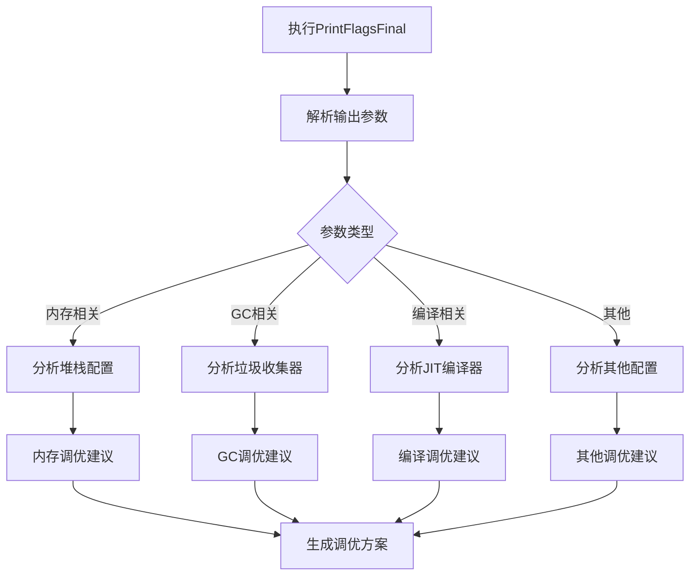

## **📌 线程内存消耗组成：**

| **资源**               | **说明**                               | **估算值**                               |
| ---------------------- | -------------------------------------- | ---------------------------------------- |
| 线程栈（Thread Stack） | 每个线程的栈空间（默认栈深度）         | 默认 ≈ **1MB**（可调）                   |
| 本地线程元数据         | JVM 内部线程结构等                     | 几十 KB                                  |
| 消息处理中产生的对象   | 如 JSON 请求体、响应体、日志等临时对象 | 估计 **50~500KB**/线程（取决于对象结构） |

帮我评估这个 Java 线程的消耗?

# Google Studio

好的，我们来对这个 Java 线程的内存消耗进行一个全面且深入的评估。你提供的表格是一个非常好的起点，它准确地指出了核心组成部分。下面我将对每一项进行展开分析，并给出一个综合的评估结论。

---

### **评估结论总览**

你提供的估算非常合理。一个典型的 Java 线程在 **空闲状态** 下的固定内存开销主要由 **线程栈** 决定，通常在 **1MB 左右**。当线程 **执行任务** 时，它会临时性地在 **堆（Heap）** 上创建和使用业务对象，这部分内存是动态的、可回收的，但会显著影响系统的总内存占用。

下面我们来逐项拆解分析。

### **一、 各项资源消耗深度分析**

#### 1. 线程栈 (Thread Stack) - **固定开销的核心**

线程栈是线程私有的内存区域，用于存储方法调用的“帧”（Stack Frame）。

- **估算值分析**：
    - 你给出的 **≈ 1MB** 是非常标准的估算值，尤其是在 64 位操作系统和 64 位 JVM 上，这是 HotSpot JVM 的默认值（通过 `-Xss` 参数设置）。
    - 在 32 位系统上，默认值通常更小（如 320KB 或 512KB）。
- **存储内容**：
    - **局部变量**：方法内的基本数据类型（`int`, `double` 等）和 **对象引用**（Reference）。
    - **操作数栈**：执行字节码指令时用于计算的临时区域。
    - **方法出口信息**：调用方法返回时需要恢复的上下文。
- **关键点**：
    - **对象本身不在栈上**：栈上只存储对象的**引用地址**（通常是 4 或 8 字节），而对象实例本身存储在**堆内存**中。这是最关键的区别！
    - **不可共享**：每个线程的栈都是独立的，互不影响。
    - **大小固定**：一旦线程创建，其栈空间大小就基本确定了。如果方法调用链太深或局部变量过多，会导致 `StackOverflowError`。

#### 2. 本地线程元数据 (JVM & OS Overhead) - **固定的附加开销**

这部分是 JVM 和操作系统为了管理一个线程所必须的额外数据结构。

- **估算值分析**：
    - 你估算的 **几十 KB** 是一个合理的范围。
- **包含内容**：
    - **`java.lang.Thread` 对象实例**：这个对象本身存在于**堆**上，包含了线程的名称、状态、优先级等信息。
    - **JVM 内部数据**：JVM 内部需要一个数据结构（如 HotSpot 中的 `Thread` C++ 对象）来与 `java.lang.Thread` 对象关联，并管理线程的执行状态。
    - **OS 原生线程结构**：每个 Java 线程都映射到一个操作系统（如 Linux）的内核线程（`Kernel Thread`），操作系统需要为其维护一个任务控制块（Task Control Block, TCB）等数据结构。
    - **JNI Handles**、**Thread-Local Storage (TLS)** 等。

#### 3. 消息处理中产生的对象 - **动态的、可回收的开销**

这是线程内存分析中最具动态性、也最容易引起误解的部分。

- **估算值分析**：
    - 你估算的 **50KB ~ 500KB / 线程** 是一个非常实际的业务场景估算。这部分内存消耗完全取决于业务逻辑的复杂性。
- **内存位置**：
    - **关键：这部分内存位于堆（Heap）上，而不是线程栈上！**
    - 堆是所有线程共享的内存区域。一个线程在执行任务时，会向堆申请内存来创建这些对象。
- **生命周期**：
    - 这些对象通常是**临时（Transient）**的。当请求处理完毕，方法执行结束，栈上对这些对象的引用被销毁后，它们就变成了“垃圾”。
    - 垃圾回收器（Garbage Collector, GC）会定期扫描堆，回收这些不再被任何线程引用的对象，释放内存。
- **影响因素**：
    - **请求/响应体大小**：处理巨大的 JSON 或 XML 会瞬时产生大量内存占用。
    - **业务逻辑**：复杂的计算、数据转换、集合操作等都会创建中间对象。
    - **数据库查询**：从数据库查询出的大量数据映射成的 POJO 对象。
    - **日志**：日志字符串的拼接和输出也会产生临时对象。

---

### **二、 综合评估与计算**

我们可以将线程的内存消耗分为两类：

1.  **线程固定开销 (Per-Thread Fixed Cost)**：只要线程存在，就会占用的内存。

    - `固定开销 = 线程栈 + JVM/OS 元数据`
    - `≈ 1MB + (几十 KB，我们取 64KB)`
    - `≈ 1024 KB + 64 KB = 1088 KB ≈ **1.06 MB**`

2.  **线程动态开销 (Per-Request Dynamic Cost)**：线程在处理请求时，在堆上临时占用的内存。这部分不焊死在线程上，而是与并发请求数相关。

#### **场景化计算示例**

假设我们有一个 Web 应用，配置了一个拥有 **200 个线程** 的线程池。在业务高峰期，有 **150 个线程** 正在同时处理请求。

- **固定内存占用**（所有线程池中的线程，无论是否在工作）：

    - `200 个线程 * 1.06 MB/线程 = 212 MB`
    - 这部分内存是相对稳定的，只要应用启动，这 **212 MB** 就会被占用，用于维持线程池。

- **动态内存占用**（正在处理请求的线程在堆上产生的对象）：

    - 假设平均每个请求产生的临时对象大小为 **300 KB**。
    - `150 个活跃请求 * 300 KB/请求 = 45,000 KB = 45 MB`
    - 这 **45 MB** 是瞬时的高峰堆内存占用。当请求处理完后，这部分内存会被 GC 回收。它直接影响 **Young Generation** 的大小和 **GC 频率**。

- **总影响**：
    - 在这种场景下，线程相关的内存占用峰值大约是 `212 MB (固定) + 45 MB (动态) = 257 MB`。
    - 这个计算帮助我们理解为什么在设置最大线程数时，必须考虑服务器的总物理内存。`最大线程数 * 线程栈大小` 是一个硬性限制，很容易耗尽内存导致无法创建新线程 (`OutOfMemoryError: unable to create new native thread`)。

### **三、 结论与优化建议**

**结论**：

你提供的表格和估算值是 **准确且有实践指导意义的**。核心结论是：**每个 Java 线程的固定内存成本约为 1MB，而其在运行期间对堆内存的动态冲击则取决于业务负载。**

**优化建议**：

1.  **合理配置线程池**：不要设置过大的线程池。线程数过多不仅会消耗大量固定内存，还会因 CPU 上下文切换导致性能下降。应根据系统的 CPU 核心数、I/O 模型和压测结果来确定最佳线程数。
2.  **调整线程栈大小 (`-Xss`)**：如果你的应用方法调用链普遍不深（例如，不是深度递归），可以适当调低 `-Xss` 的值（如 `-Xss256k` 或 `-Xss512k`），这样在相同的内存下可以创建更多的线程。但调整需谨慎，过小会导致 `StackOverflowError`。
3.  **优化堆内对象**：
    - **减少临时对象**：在代码中注意避免创建不必要的临时对象，尤其是在循环体内。
    - **使用对象池**：对于创建成本高、可复用的对象（如数据库连接、大的字节数组），使用对象池技术。
    - **选择高效的数据结构**：根据场景选择合适的集合类。
4.  **异步化和响应式编程**：对于 I/O 密集型应用，可以考虑使用 Netty、WebFlux 等异步框架。它们可以用极少数的线程（如 CPU 核心数）处理海量并发连接，极大地降低了线程固定开销。

# Grok

很高兴为你评估 Java 线程的内存消耗。基于你提供的表格和信息，我将详细分析线程内存消耗的组成，并对每个部分进行合理的估算和解释。最后，我会总结一个 Java 线程的大致内存占用范围。以下内容以 Markdown 格式输出，方便你查阅。

---

## **📌 Java 线程内存消耗评估**

你提供的表格列出了 Java 线程内存消耗的几个主要组成部分：线程栈（Thread Stack）、本地线程元数据、以及消息处理中产生的对象。我将逐一分析这些部分，并结合实际情况提供评估。

| **资源**               | **说明**                               | **估算值**                               | **评估与解释**                                                                                                                                                       |
| ---------------------- | -------------------------------------- | ---------------------------------------- | -------------------------------------------------------------------------------------------------------------------------------------------------------------------- |
| 线程栈（Thread Stack） | 每个线程的栈空间（默认栈深度）         | 默认 ≈ **1MB**（可调）                   | Java 中栈大小默认通常为 1MB（取决于 JVM 和 OS），可通过 `-Xss` 参数调整（如 `-Xss512k`）。实际使用量通常远低于分配值（几十到几百 KB），但分配的空间仍按默认值计算。  |
| 本地线程元数据         | JVM 内部线程结构等                     | 几十 KB                                  | 包括线程控制块（TCB）和 JVM 内部数据结构，这部分由 JVM 和操作系统管理，通常在 10-50KB 左右，具体值难以精确测量，但对总内存消耗影响较小。                             |
| 消息处理中产生的对象   | 如 JSON 请求体、响应体、日志等临时对象 | 估计 **50~500KB**/线程（取决于对象结构） | 这是堆内存中的对象分配，取决于线程处理的任务复杂度。简单的请求可能只有几十 KB，复杂的（如大 JSON 或日志）可能达到几 MB。此部分是共享堆内存，无法完全归因到单个线程。 |

---

## **详细评估与分析**

### 1. 线程栈（Thread Stack）

- **估算值**：默认 ≈ 1MB（可调）
- **分析**：
    每个线程在创建时都会分配一个独立的栈空间，用于存储局部变量、方法调用信息等。在 Java 中，默认栈大小通常为 1MB（具体值取决于 JVM 版本和操作系统，例如 32 位系统可能是 512KB，64 位系统可能是 1MB）。可以通过 JVM 参数 `-Xss` 调整，例如 `-Xss512k` 将栈大小减半。
    **实际使用量**通常远低于分配值，可能只有几十到几百 KB（例如，`cat /proc/<PID>/task/<TID>/status | grep VmStk` 显示的栈使用量），但分配的空间仍然会预留整个默认大小（例如 1MB），因此在内存消耗评估中按分配值计算。
- **影响因素**：
    - 栈深度：如果线程涉及深层递归调用，栈使用量会增加，甚至可能导致 `StackOverflowError`。
    - 参数调整：通过 `-Xss` 减小栈大小可以降低内存占用，但过小可能导致异常。
- **结论**：以默认 1MB 计算，每个线程栈内存消耗约为 **1MB**。

### 2. 本地线程元数据

- **估算值**：几十 KB（10-50KB）
- **分析**：
    这部分包括 JVM 内部维护的线程数据结构（如线程状态、优先级等）以及操作系统管理的线程控制块（TCB）。此部分内存占用较小，通常在 10-50KB 之间，具体值难以精确测量（Linux 工具如 `ps` 或 `/proc` 无法直接显示这部分）。
    由于这部分内存占用极小，对总内存消耗的影响可以忽略不计。
- **影响因素**：
    - JVM 实现：不同版本的 JVM（例如 OpenJDK vs. Oracle JDK）可能有轻微差异。
    - 操作系统：Linux 内核版本和配置可能影响线程元数据的内存分配。
- **结论**：按平均值估算，每个线程本地元数据消耗约为 **30KB**。

### 3. 消息处理中产生的对象

- **估算值**：50~500KB/线程（取决于对象结构）
- **分析**：
    这部分是指线程在处理任务时在堆内存中创建的对象，例如处理 HTTP 请求时的 JSON 请求体、响应体、日志字符串等。这些对象存储在 JVM 的堆内存中，是所有线程共享的。虽然对象由某个线程创建，但可能被其他线程引用，因此无法完全归因到单个线程。
    估算值 50~500KB 是一个合理的范围：
    - **下限（50KB）**：适用于简单任务，例如处理小型 JSON 或少量字符串对象。
    - **上限（500KB）**：适用于较复杂的任务，例如处理大型 JSON、生成详细日志或缓存中间结果。
    - **超出范围**：在某些极端情况下（例如处理大文件流、图片数据或复杂计算），单个线程可能创建几 MB 甚至几十 MB 的对象。
        由于堆内存是动态分配的，且对象可能被垃圾回收，实际占用会随时间变化。
- **影响因素**：
    - 任务复杂度：处理的数据量越大，创建的对象越多。
    - 对象生命周期：短生命周期对象可能很快被 GC 回收，降低内存占用。
    - 堆内存设置：JVM 堆大小（`-Xmx` 和 `-Xms`）和垃圾回收策略会影响对象分配效率。
- **结论**：按中值估算，每个线程在堆内存中创建的对象消耗约为 **250KB**。

---

## **总内存消耗估算**

基于以上分析，我们可以对单个 Java 线程的内存消耗做一个粗略的估算：

| **资源**               | **估算值**    |
| ---------------------- | ------------- |
| 线程栈（Thread Stack） | 1MB (1024KB)  |
| 本地线程元数据         | 30KB          |
| 消息处理中产生的对象   | 250KB         |
| **总计**               | **约 1304KB** |

**总结**：一个典型的 Java 线程内存消耗大约在 **1.3MB** 左右，其中栈内存占主导地位（约 1MB），而堆内存中的对象分配（约 250KB）会因任务复杂度有较大波动。

---

## **注意事项与优化建议**

1. **估算的局限性**：

    - 以上估算是基于典型情况，实际内存占用可能因应用场景、JVM 配置和操作系统差异而变化。
    - 堆内存中的对象分配是共享的，且动态变化（受垃圾回收影响），难以精确归因到单个线程。
    - 如果线程数量较多，堆内存的累积占用会显著增加，可能导致内存压力。

2. **验证与监控**：

    - 使用 `ps -T -p <PID>` 统计线程数量，结合 `ps -p <PID> -o rss,vsz` 查看进程总内存占用。
    - 使用 Java 工具（如 VisualVM 或 `jmap`）分析堆内存分配，验证对象占用是否符合估算。
        ```bash
        jmap -dump:live,format=b,file=heap_dump.hprof <PID>
        ```
    - 检查栈内存使用情况：
        ```bash
        cat /proc/<PID>/task/<TID>/status | grep VmStk
        ```

3. **优化建议**：
    - **减少栈内存占用**：如果线程数量多且栈使用率低，可以通过 `-Xss` 参数减小栈大小，例如 `-Xss512k`，但要测试避免 `StackOverflowError`。
    - **控制线程数量**：使用线程池（如 `ExecutorService`）限制线程数量，避免过多线程导致内存和 CPU 资源竞争。
    - **优化对象分配**：减少不必要的对象创建（如复用字符串或缓存中间结果），降低堆内存压力。
    - **调整堆内存**：根据应用需求设置合理的堆大小（`-Xmx` 和 `-Xms`），并选择合适的垃圾回收器（例如 G1 或 CMS）。

---

## **结论**

根据你的表格和估算，一个典型的 Java 线程内存消耗大约为 **1.3MB**，其中：

- 栈内存（1MB）是固定分配的主要部分。
- 本地线程元数据（30KB）占比较小。
- 堆内存中的对象分配（250KB）因任务复杂度而变化较大。

如果你有更具体的应用场景（例如线程池大小、任务类型）或需要进一步分析（例如堆转储分析），可以提供更多信息，我会帮助你做更精确的评估！😊

---

# Claude

根据您提供的 Java 线程内存消耗组成，我来详细分析一下：

## Java 线程内存消耗分析

### 单线程内存消耗估算

| 组成部分   | 描述               | 估算值         | 备注                |
| ---------- | ------------------ | -------------- | ------------------- |
| 线程栈     | Thread Stack 空间  | ~1MB           | 可通过-Xss 参数调整 |
| 线程元数据 | JVM 内部线程结构   | ~64KB          | JVM 管理开销        |
| 临时对象   | 消息处理产生的对象 | 50~500KB       | 依赖业务复杂度      |
| **总计**   | **单线程总消耗**   | **~1.1~1.6MB** | **不含共享资源**    |

### 详细分析

#### 1. 线程栈消耗

```bash
# 查看默认栈大小
java -XX:+PrintFlagsFinal -version | grep ThreadStackSize

# 调整栈大小示例
java -Xss512k MyApp  # 设置栈大小为512KB
java -Xss2m MyApp    # 设置栈大小为2MB
```

#### 2. 不同线程数场景下的内存消耗

| 线程数 | 栈内存消耗 | 元数据消耗 | 临时对象(平均) | 总内存消耗 |
| ------ | ---------- | ---------- | -------------- | ---------- |
| 10     | 10MB       | 640KB      | 2.75MB         | ~13.4MB    |
| 50     | 50MB       | 3.2MB      | 13.75MB        | ~67MB      |
| 100    | 100MB      | 6.4MB      | 27.5MB         | ~134MB     |
| 200    | 200MB      | 12.8MB     | 55MB           | ~268MB     |
| 500    | 500MB      | 32MB       | 137.5MB        | ~670MB     |

#### 3. 优化建议

```java
// 1. 栈大小优化
// 监控栈使用情况
jstack <pid> | grep -A 5 -B 5 "java.lang.StackOverflowError"

// 2. 对象池化减少临时对象
public class ObjectPool<T> {
    private final Queue<T> pool = new ConcurrentLinkedQueue<>();
    private final Supplier<T> factory;

    public T acquire() {
        T object = pool.poll();
        return object != null ? object : factory.get();
    }

    public void release(T object) {
        // 重置对象状态
        pool.offer(object);
    }
}

// 3. 线程池配置
ThreadPoolExecutor executor = new ThreadPoolExecutor(
    corePoolSize,           // 核心线程数
    maximumPoolSize,        // 最大线程数
    keepAliveTime,          // 空闲线程存活时间
    TimeUnit.SECONDS,
    new LinkedBlockingQueue<>(queueCapacity)
);
```

### 内存监控流程


### 关键性能指标

```bash
# 监控线程内存使用
jstat -gc <pid> 1s
jmap -dump:format=b,file=heap.hprof <pid>

# 监控线程数
jstack <pid> | grep "java.lang.Thread.State" | wc -l

# 监控栈使用
jcmd <pid> Thread.print | grep -c "java.lang.Thread.State"
```

### 建议的线程数计算公式

```
最优线程数 = CPU核心数 × (1 + 平均等待时间/平均工作时间)

内存限制下的最大线程数 = 可用堆内存 / 单线程平均内存消耗
```

**结论：**

- 单线程内存消耗约 **1.1~1.6MB**
- 主要消耗在线程栈(占 70%+)
- 临时对象消耗波动较大，需要重点优化
- 建议通过对象池化、合理的线程池配置来控制内存消耗

## Linux 系统下 java -XX:+PrintFlagsFinal -version 典型输出

### 完整输出示例

```bash
$ java -XX:+PrintFlagsFinal -version

[Global flags]
     intx ActiveProcessorCount                      = -1                                  {product}
     bool UseCompressedOops                         = true                                {lp64_product}
     bool UseG1GC                                   = false                               {product}
     bool UseParallelGC                             = true                                {product}
     bool UseSerialGC                               = false                               {product}
     bool UseConcMarkSweepGC                        = false                               {product}
     bool UseZGC                                    = false                               {product}
     bool UseShenandoahGC                           = false                               {product}
    uintx InitialHeapSize                           = 134217728                           {product}
    uintx MaxHeapSize                               = 2147483648                          {product}
    uintx NewSize                                   = 44739242                            {product}
    uintx OldSize                                   = 89478485                            {product}
     intx ThreadStackSize                           = 1024                                {pd product}
    uintx CompressedClassSpaceSize                  = 1073741824                          {product}
    uintx MetaspaceSize                             = 21807104                            {product}
    uintx MaxMetaspaceSize                          = 18446744073709547520                {product}
     bool PrintGC                                   = false                               {product}
     bool PrintGCDetails                            = false                               {product}
     bool PrintGCTimeStamps                         = false                               {product}
     bool HeapDumpOnOutOfMemoryError               = false                               {manageable}
    ccstr HeapDumpPath                              =                                     {manageable}
     bool UseCompressedClassPointers               = true                                {lp64_product}
     intx ConcGCThreads                             = 0                                   {product}
     intx ParallelGCThreads                         = 8                                   {product}
     bool UseBiasedLocking                          = true                                {product}
     intx JavaPriority1_To_OSPriority               = -1                                  {product}
     intx JavaPriority10_To_OSPriority              = -1                                  {product}
    uintx CMSInitiatingOccupancyFraction            = 92                                  {product}
     bool CMSClassUnloadingEnabled                  = true                                {product}
     intx Tier1CompileThreshold                     = 2000                                {product}
     intx Tier2CompileThreshold                     = 1500                                {product}
     intx Tier3CompileThreshold                     = 2000                                {product}
     intx Tier4CompileThreshold                     = 15000                               {product}
     bool TieredCompilation                         = true                                {product}
     intx MaxInlineSize                             = 35                                  {product}
     intx FreqInlineSize                            = 325                                 {product}
    uintx StringTableSize                           = 60013                               {product}
     intx AutoBoxCacheMax                           = 128                                 {C2 product}
     bool AggressiveOpts                            = false                               {product}
     bool UseStringDeduplication                    = false                               {product}
     bool CompactStrings                            = true                                {product}
     bool UseG1GC                                   = false                               {product}
    uintx G1HeapRegionSize                          = 0                                   {product}
     intx G1MixedGCCountTarget                      = 8                                   {product}
     intx G1RefProcDrainInterval                    = 1000                                {product}
    uintx MaxGCPauseMillis                          = 200                                 {product}
     bool PrintStringDeduplicationStatistics       = false                               {product}
     bool UseCountedLoopSafepoints                  = false                               {C2 product}
     bool UseLoopPredicate                          = true                                {C2 product}
     bool UseTypeProfile                            = true                                {product}
     bool UseAES                                    = false                               {product}
     bool UseSHA                                    = false                               {product}
     bool UseCRC32Intrinsics                        = false                               {product}
     bool UseVectorizedMismatchIntrinsic            = false                               {C2 product}

openjdk version "11.0.19" 2023-04-18
OpenJDK Runtime Environment (build 11.0.19+7-post-Ubuntu-0ubuntu1~20.04.1)
OpenJDK 64-Bit Server VM (build 11.0.19+7-post-Ubuntu-0ubuntu1~20.04.1, mixed mode, sharing)
```

## 关键参数详解

### 内存相关参数

| 参数名           | 示例值               | 单位  | 说明                      |
| ---------------- | -------------------- | ----- | ------------------------- |
| InitialHeapSize  | 134217728            | bytes | 初始堆大小 (~128MB)       |
| MaxHeapSize      | 2147483648           | bytes | 最大堆大小 (~2GB)         |
| NewSize          | 44739242             | bytes | 新生代初始大小 (~42MB)    |
| OldSize          | 89478485             | bytes | 老年代初始大小 (~85MB)    |
| ThreadStackSize  | 1024                 | KB    | 线程栈大小 (1MB)          |
| MetaspaceSize    | 21807104             | bytes | 元空间初始大小 (~20MB)    |
| MaxMetaspaceSize | 18446744073709547520 | bytes | 元空间最大大小 (几乎无限) |

### GC 相关参数

| 参数名             | 示例值 | 说明                   |
| ------------------ | ------ | ---------------------- |
| UseG1GC            | false  | 是否使用 G1 垃圾收集器 |
| UseParallelGC      | true   | 是否使用并行 GC (默认) |
| UseSerialGC        | false  | 是否使用串行 GC        |
| UseConcMarkSweepGC | false  | 是否使用 CMS 收集器    |
| UseZGC             | false  | 是否使用 ZGC           |
| ParallelGCThreads  | 8      | 并行 GC 线程数         |
| MaxGCPauseMillis   | 200    | G1GC 最大停顿时间目标  |

### 编译优化参数

| 参数名                | 示例值 | 说明                 |
| --------------------- | ------ | -------------------- |
| TieredCompilation     | true   | 启用分层编译         |
| Tier1CompileThreshold | 2000   | C1 编译阈值          |
| Tier4CompileThreshold | 15000  | C2 编译阈值          |
| MaxInlineSize         | 35     | 最大内联字节码大小   |
| FreqInlineSize        | 325    | 频繁调用方法内联大小 |

### 标志类型说明

```bash
# 标志类型含义
{product}           # 产品标志,所有构建都可用
{pd product}        # 平台依赖的产品标志
{manageable}        # 可在运行时通过JMX管理
{C2 product}        # 仅C2编译器相关
{lp64_product}      # 64位平台特定
{develop}           # 开发版本标志
{diagnostic}        # 诊断标志
{experimental}      # 实验性标志
```

### 常用查询命令

```bash
# 查看内存相关参数
java -XX:+PrintFlagsFinal -version | grep -i heap

# 查看GC相关参数
java -XX:+PrintFlagsFinal -version | grep -i gc

# 查看编译相关参数
java -XX:+PrintFlagsFinal -version | grep -i compile

# 查看线程相关参数
java -XX:+PrintFlagsFinal -version | grep -i thread

# 查看特定参数
java -XX:+PrintFlagsFinal -version | grep ThreadStackSize
java -XX:+PrintFlagsFinal -version | grep MaxHeapSize
```

### 参数值换算

```bash
# 内存大小换算
InitialHeapSize = 134217728 bytes = 128MB
MaxHeapSize = 2147483648 bytes = 2048MB = 2GB
ThreadStackSize = 1024 KB = 1MB
MetaspaceSize = 21807104 bytes ≈ 20.8MB
```

### 系统相关参数分析流程



**关键点总结：**

- 该输出显示了 JVM 所有可配置参数的当前值
- `{product}` 标志表示生产环境可用参数
- 大多数内存相关参数以字节为单位
- `ThreadStackSize` 以 KB 为单位
- 可通过 `-XX:参数名=值` 来修改这些参数


# Gemini

好的，这是一个非常经典且有深度的问题，涉及到 Java 内存模型、JVM 调优、Spring 应用特性以及 Kubernetes 资源管理的交叉领域。你的表格总结得很好，这是一个很好的起点。下面我将为你提供一个更全面、更具可操作性的分析和评估方案。

### **核心理念：精确测量 vs. 合理估算**

首先要明确一点：**精确测量单个线程在任意时刻消耗的所有内存是极其困难且不切实际的**。原因如下：

1. **共享内存 vs. 独占内存**: 线程栈（Thread Stack）是线程独占的，但这通常只占一小部分。大部分内存消耗来自于堆上的对象（Heap），而堆是所有线程共享的。一个对象可以被多个线程引用，很难说清这个对象的内存“属于”哪个线程。
    
2. **动态变化**: 线程处理业务逻辑时会创建大量临时对象，这些对象的生命周期很短，很快会被垃圾回收（GC）。因此，线程的内存占用是动态、瞬时变化的。
    

因此，我们的目标不应该是“拿到具体每个线程占用了多少内存”，而应该是**“通过科学的方法估算出在典型业务场景下，增加一个并发线程所带来的平均内存增长成本，并结合压力测试来验证和调整，最终确定 GKE Pod 的最佳线程数”**。

---

### **第一步：理解和细化内存组成**

你的表格非常好，我们可以在此基础上进一步细化和深化。Java 应用的总内存消耗主要由以下几部分构成：

|内存区域|所有者|说明|如何监控/估算|
|---|---|---|---|
|**堆内存 (Heap)**|**所有线程共享**|存放对象实例、数组等。这是内存消耗的大头，也是 GC 的主要工作区域。Spring 的 Bean、业务处理中创建的各种对象都在这里。|`jstat`, `jmap`, VisualVM, JProfiler, Arthas, Prometheus JMX Exporter|
|**元空间 (Metaspace)**|**所有线程共享**|存储类的元数据信息，如类名、字段、方法信息等。Spring 应用由于大量使用 AOP 和动态代理，元空间占用相对较高。|`jstat -gc`, VisualVM, JProfiler, Arthas|
|**线程栈 (Thread Stack)**|**线程独占**|每个线程都有一个独立的栈，用于存储方法调用的局部变量、操作数栈、动态链接信息等。默认大小通常是 1MB。|通过 `-Xss` 参数设定。总消耗 = **线程数 * `-Xss` 大小**。|
|**直接内存 (Direct Memory)**|**进程共享**|通过 NIO 的 `ByteBuffer.allocateDirect()` 分配，不由 JVM 堆管理。常用于网络 IO、文件 IO，可以减少一次内核态到用户态的数据拷贝。|`java.nio.Bits.reservedMemory` (通过反射获取), JMX (NIO相关的MXBean), `pmap` 命令|
|**代码缓存 (Code Cache)**|**所有线程共享**|存放 JIT (Just-In-Time) 编译器编译后的本地代码。|VisualVM, JProfiler|
|**JVM 自身和其他**|**进程**|包括 GC 使用的数据结构、JVM 内部数据等。|这部分通常较小且难以精确分离，一般包含在整体 RSS (Resident Set Size) 中。|

**对于你的 IO 密集型业务，需要特别关注：**

- **堆内存**: 因为 IO 操作通常伴随着数据的读写和处理，例如从网络读取数据并反序列化为 Java 对象（如 JSON -> DTO），或者将业务对象序列化后发送出去。这个过程会产生大量对象。
    
- **直接内存**: 如果你的应用直接或间接（例如，通过 Netty、Tomcat NIO Connector 等）使用了 NIO，那么直接内存会是一块重要的消耗。
    
- **线程栈**: 这是最直接与线程数相关的成本。
    

---

### **第二步：测量与分析工具**

要在 GKE 环境中有效评估，你需要结合使用多种工具。

#### **1. 实时分析与诊断 (Arthas - 强力推荐)**

Arthas 是一个 Java 在线诊断工具，可以 attach 到正在运行的 Java 进程上，进行无侵入的监控和诊断。它在容器化环境中尤其有用。

- **安装与使用**: 你可以通过 `kubectl exec` 进入 Pod，然后下载并启动 Arthas。
    
- **关键命令**:
    
    - `dashboard`: 查看当前应用的实时数据面板，包括线程、内存、GC 等信息。
        
    - `thread`: 查看所有线程的状态、CPU 使用率、栈信息。`thread -n 5` 可以找出最忙的 5 个线程。
        
    - `jvm`: 查看 JVM 的详细信息，包括内存各区域的使用情况。
        
    - `memory`: 查看内存各区域的详细信息（等同于 `jstat -gc`）。
        
    - `profiler`: 生成火焰图，用于分析方法执行的热点，虽然主要用于 CPU 分析，但也能间接反映对象创建的频繁程度。
        

如何用 Arthas 估算？

虽然不能直接看“每个线程的内存”，但你可以：

1. 在低负载时，用 `jvm` 命令记录下堆、元空间等的基线内存。
    
2. 施加一定并发请求（例如增加 50 个并发用户）。
    
3. 再次用 `jvm` 命令观察内存的增长量。
    
4. **平均每线程增加的内存 ≈ (增长的堆内存 + 增长的直接内存) / 50**。这是一个相对合理的估算模型。
    

#### **2. 堆内存深度分析 (jmap + MAT)**

如果发现堆内存增长异常，你需要进行离线分析。

1. **生成堆转储 (Heap Dump)**:
    
    - 在 Pod 中通过 `kubectl exec` 进入。
        
    - 使用 jmap -dump:format=b,file=/tmp/heapdump.hprof <PID> 命令生成快照。
        
        .
        
2. **下载和分析**:
    
    - 使用 `kubectl cp` 将 `heapdump.hprof` 文件从 Pod 拷贝到本地。
        
    - 使用 Eclipse Memory Analyzer Tool (MAT) 打开快照文件。
        
3. **MAT 分析**:
    
    - **支配树 (Dominator Tree)**: 查看哪些对象占用了最多的内存。
        
    - **按线程分组**: MAT 可以将对象按照被哪些线程引用来进行分组，这能帮你找到哪些线程持有了大量的对象。虽然不是“占用”，但“持有”关系是定位问题的关键。
        

#### **3. 长期趋势监控 (Prometheus + Grafana)**

在 GKE 环境中，这是标准且最佳的监控实践。

1. **暴露 JMX 指标**: 在你的 Spring Boot 应用中加入 `micrometer-registry-prometheus` 和 `spring-boot-starter-actuator` 依赖。这会自动将 JVM 的各种指标（包括内存、GC、线程数等）以 Prometheus 格式暴露出来。
    
2. **Prometheus 采集**: 配置 GKE 的 Prometheus 服务来抓取你 Pod 暴露的 `/actuator/prometheus` 端点。
    
3. **Grafana 可视化**: 在 Grafana 中创建仪表盘，展示以下关键指标随时间变化的图表：
    
    - `jvm_memory_used_bytes{area="heap"}`: 堆内存使用量。
        
    - `jvm_memory_used_bytes{area="nonheap"}`: 非堆内存使用量（包括元空间等）。
        
    - `jvm_threads_live_threads`: 实时线程数。
        
    - `jvm_gc_pause_seconds_sum` / `jvm_gc_pause_seconds_count`: 平均 GC 暂停时间。
        
    - Pod 的实际内存使用量 (来自 Kubernetes 的 `container_memory_usage_bytes`)。
        

**这种方法可以让你清晰地看到，当并发请求（线程数）增加时，堆内存、GC 活动以及 Pod 总内存是如何响应的。**

---

### **第三步：GKE Pod 线程数评估策略**

现在，我们结合上述工具和知识，来制定一个评估方案。

#### **1. 设定资源请求和限制 (Resource Requests & Limits)**

首先，为你的 Pod 设置合理的 `resources.requests.memory` 和 `resources.limits.memory`。

- `requests`: 保证 Pod 能获得的最小内存，Kubernetes 会根据这个值来调度 Pod。
    
- `limits`: Pod 能使用的最大内存。超过这个值，Pod 会被 OOMKilled。
    

#### **2. 配置 JVM 启动参数**

在你的 Dockerfile 或者 Kubernetes Deployment YAML 中，通过环境变量 `JAVA_OPTS` 来配置 JVM 参数。

YAML

```
env:
- name: JAVA_OPTS
  value: "-Xms1g -Xmx1g -Xss256k -XX:MaxMetaspaceSize=256m"
```

- `-Xms` 和 `-Xmx`: 设置堆的初始和最大值。通常设为相等，以避免运行时伸缩带来的性能开销。这个值应该小于你的 Pod `limits.memory`，为其他内存区域（线程栈、直接内存、元空间等）留出空间。**一个经验法则是 `-Xmx` 设为 Pod Limit 的 70%-80%**。
    
- `-Xss`: **这是控制线程成本的关键参数**。对于 IO 密集型业务，方法调用栈通常不深。默认的 1MB 可能过于浪费。你可以尝试减小它，例如 `-Xss256k` 或 `-Xss512k`。减小它意味着同样的内存可以支持更多线程。但如果设置得太小，可能会导致 `StackOverflowError`。
    
- `-XX:MaxMetaspaceSize`: 为元空间设置一个上限，防止因类加载过多导致内存溢出。
    

#### **3. 压力测试与分析**

这是最关键的一步。

1. **选择压测工具**: JMeter, Gatling, k6 等。
    
2. **设计测试场景**: 模拟你最典型的 IO 密集型业务场景。
    
3. **逐步增加并发**:
    
    - **阶段一：确定基线**。在低并发（例如 10 个线程）下运行一段时间，通过 Prometheus/Grafana 和 Arthas 记录下稳定的内存使用情况。
        
    - **阶段二：逐步加压**。逐步增加并发用户数（例如每次增加 50 个），每次增加后，都让系统稳定运行一段时间。
        
    - **阶段三：观察指标**。在加压过程中，重点观察以下指标：
        
        - **Pod 内存使用率**: 是否逼近 `limits`？
            
        - **堆内存使用率**: 是否频繁达到 `-Xmx` 上限？
            
        - **GC 活动**: GC 次数和暂停时间是否急剧增加？长时间的 GC Pause 会严重影响 IO 业务的响应时间。
            
        - **CPU 使用率**: 虽然是 IO 密集型，但线程数过多会导致频繁的线程上下文切换，CPU 使用率也会异常升高。
            
        - **业务响应时间 (RT) 和吞吐量 (TPS)**。
            
4. **寻找拐点**:
    
    - 你会发现，随着并发数的增加，TPS 会上升。但到达某个点后，TPS 不再显著增加，甚至开始下降，而 RT 则会急剧上升。这个点就是系统的“拐点”。
        
    - 同时，观察内存和 GC 指标，拐点通常也伴随着 GC 压力剧增和内存持续高位。
        

#### **4. 计算和决策**

通过压力测试，你可以得到一个相对优化的线程数范围。

**估算公式（用于初步规划）**:

假设 Pod Limit 为 `L` (MB)，JVM 参数如下:

- 最大堆内存: `-Xmx=H` (MB)
    
- 最大元空间: `-XX:MaxMetaspaceSize=M` (MB)
    
- 线程栈大小: `-Xss=S` (KB)
    
- 预留内存 (给直接内存、JVM自身、OS等): `R` (MB)，通常可以预留 15%-25% 的 Pod Limit。
    

可支持的最大线程数 N 的一个粗略估算：

L=H+M+(N×1024S​)+R

因此:

N≈S(L−H−M−R)×1024​

**示例**:

- Pod Limit: `2GB` (2048 MB)
    
- `-Xmx1g` (1024 MB)
    
- `-XX:MaxMetaspaceSize=256m` (256 MB)
    
- `-Xss256k` (S=256 KB)
    
- 预留内存 `R` = 2048 * 20% ≈ 410 MB
    

N≈256(2048−1024−256−410)×1024​=256358×1024​=358×4=1432

这个数字 **1432** 是一个**理论上限**。它假设你的堆内存和元空间都用满了，并且没有考虑直接内存的动态增长。在实际情况中，你 Web 服务器（如 Tomcat）的工作线程数配置（`server.tomcat.threads.max`）应该远小于这个理论值。

**最终决策**:

结合压测找到的“拐点”和你监控到的实际内存表现，来确定一个安全、高效的**最大工作线程数**。例如，压测发现并发到 400 时性能最好，那么就可以将 Tomcat 的最大线程数设置为 400 左右，并以此为依据来规划你的 Pod 副本数，以应对整体业务流量。

希望这个详细的步骤能帮助你科学地评估和优化你的 Spring 应用在 GKE 上的性能！


# Gemini Deepsearch


# 针对GKE上Spring应用的Java内存消耗与线程容量规划的深度解析报告

## 第一部分：容器化Java应用的完整内存足迹剖析

在容器化环境（如Google Kubernetes Engine, GKE）中对Java应用进行资源规划时，一个普遍存在的误区是认为应用的内存消耗主要由Java虚拟机（JVM）的最大堆内存设置（`-Xmx`）决定。然而，这种观点具有极大的误导性，并且是导致GKE中Pod频繁出现`OOMKilled`（Out of Memory Killed）状态的根本原因。要进行精确的容量规划，必须理解一个Java进程的完整内存足迹，它远不止堆内存那么简单。

### 1.1 导论：为何`-Xmx`并非Pod的内存上限

Kubernetes的调度器和`kubelet`并不关心JVM内部的内存划分；它们只关注进程的**常驻集大小（Resident Set Size, RSS）**，即进程在物理内存中实际占用的空间 1。当一个容器的RSS超出了其在Pod定义中声明的内存限制（

`limits.memory`）时，Kubernetes的OOM Killer机制便会介入，强制终止该容器以保护节点的稳定性 3。

因此，一个精确的内存模型必须遵循以下基本原则：

Pod Memory Limit>Process RSS

而Java进程的RSS则由多个部分构成，可以概括为以下公式：

RSS=JVM Heap+JVM Non−Heap+Other Native Memory

这个公式揭示了问题的核心：堆内存（Heap）只是冰山一角。要避免`OOMKilled`并准确评估Pod能支持的线程数量，我们必须对JVM的非堆内存（Non-Heap）和其他所有原生内存（Native Memory）消耗进行全面的分析和量化。

### 1.2 JVM管理内存的解构

JVM在运行时会定义多个数据区域，这些区域根据其生命周期和共享范围可以分为两大类：JVM进程共享的内存池和每个线程独有的内存区域 4。

#### 1.2.1 JVM进程级共享内存池

这些内存在JVM启动时创建，由所有线程共享，直到JVM退出时销毁。

- **Java堆（Java Heap）**: 这是JVM内存管理的核心区域，用于存放几乎所有的对象实例和数组 4。为了优化垃圾回收（GC）效率，堆内存被设计为分代结构，主要包括：
    
    - **新生代（Young Generation）**: 大多数新创建的对象首先被分配在这里。新生代又分为一个伊甸园区（Eden Space）和两个幸存区（Survivor Spaces, S0和S1）6。当伊甸园区满时，会触发一次轻微GC（Minor GC）。
        
    - **老年代（Old/Tenured Generation）**: 经过多次Minor GC后仍然存活的对象会被晋升到老年代 4。老年代的GC（Major GC或Full GC）通常更耗时。
        
    - **关键配置参数**:
        
        - `-Xms` / `-Xmx`: 设置堆的初始大小和最大大小 6。
            
        - `-Xmn`: 设置新生代的大小。
            
        - `-XX:NewRatio`: 设置老年代与新生代的比例 6。
            
        - `-XX:SurvivorRatio`: 设置伊甸园区与单个幸存区的比例 6。
            
- **元空间（Metaspace）**: 自Java 8起，元空间取代了永久代（PermGen），用于存储类的元数据，如类的结构信息、方法字节码、运行时常量池等 7。与永久代不同，元空间使用的是
    
    **原生内存（Native Memory）**，而非堆内存。这意味着它的容量不受`-Xmx`限制，如果不对其大小进行约束，它可能会耗尽所有可用的原生内存。
    
    - **关键配置参数**:
        
        - `-XX:MetaspaceSize`: 设置元空间的初始大小。
            
        - `-XX:MaxMetaspaceSize`: 设置元空间的最大大小，这是防止元空间内存泄漏导致系统崩溃的关键参数。
            
- **代码缓存（Code Cache）**: 即时编译器（Just-In-Time, JIT）将热点方法的字节码编译为高度优化的本地机器码后，会将其存储在代码缓存区，以提高后续执行的性能 7。这个区域同样位于原生内存中。
    
    - **关键配置参数**:
        
        - `-XX:InitialCodeCacheSize`: 代码缓存的初始大小。
            
        - `-XX:ReservedCodeCacheSize`: 代码缓存的保留（最大）大小。如果此空间耗尽，JIT编译器将停止编译，可能导致应用性能下降。
            
- **其他原生区域**: 还包括一些用于特定目的的原生内存区域，如符号表（用于存储字符串常量和类型引用的String Table/String Pool）等 7。
    

#### 1.2.2 线程级独占内存池

每当一个新线程被创建时，JVM都会为其分配一块独有的内存区域。这部分内存的消耗与线程数量成正比，是评估I/O密集型应用容量的关键。

- **线程栈（Thread Stack）**: 这是对您问题最重要的内存部分。每个Java线程都有自己的栈，用于存储方法调用的**栈帧（Stack Frame）** 4。每个栈帧包含：
    
    - 局部变量表（Local Variables）：存储方法内的基本数据类型变量和对象引用（即指向堆内存中对象的指针）。
        
    - 操作数栈（Operand Stack）、动态链接、方法返回地址等。
        
    - 线程栈的大小在线程创建时就已确定，并且在整个生命周期中通常是固定的。其大小由`-Xss`或`-XX:ThreadStackSize`参数控制 8。一个典型的64位操作系统上，默认的线程栈大小可能在1MB左右 7。
        
- **原生方法栈（Native Method Stack）**: 用于支持原生方法（通过JNI调用的C/C++代码）的执行 4。其工作方式与Java线程栈类似，但服务于原生代码。
    

这种内存结构带来了一个至关重要的影响：**线程的乘数效应**。对于一个采用传统“一个请求一个线程”模型的I/O密集型应用（如标准的Spring MVC），为了维持高并发，需要创建大量的线程，因为绝大多数线程都会在等待I/O操作（如数据库查询、外部API调用）时被阻塞。如果每个线程的栈大小为1MB（`-Xss1m`），那么创建500个线程就会直接消耗500MB的原生内存，这部分开销完全独立于堆内存，并且必须被计入Pod的总内存预算中。这解释了为什么在高并发的I/O场景下，线程栈的总消耗往往会成为非堆内存中最大的一块，甚至可能超过元空间和代码缓存的总和。

### 1.3 “隐形”的内存消耗者：超越JVM直接控制的区域

除了JVM明确管理的内存区域外，还有一些“隐形”的内存消耗者，它们同样占用原生内存，并且容易被忽视。

- **垃圾回收器（GC）**: 现代的GC算法（如G1GC, ZGC）自身需要复杂的内部数据结构来辅助其工作，例如记忆集（Remembered Sets）或卡片表（Card Tables），这些都分配在原生内存中 7。
    
- **直接字节缓冲区（Direct Byte Buffers）**: 当代码通过`java.nio.ByteBuffer.allocateDirect()`方法分配内存时，这部分内存直接在堆外（原生内存）分配，不受GC直接管理，但其生命周期与Java对象关联。高性能I/O框架（如Netty）和一些数据库驱动会大量使用直接内存以减少内存拷贝，提高性能 7。
    
- **JNI（Java Native Interface）**: 如果应用或其依赖的库使用了JNI，那么原生代码部分可以通过`malloc`等标准库函数直接向操作系统申请内存。这部分内存完全脱离了JVM的追踪，是原生内存泄漏的常见来源 10。
    
- **第三方库**: 某些第三方库可能包含自己的原生组件，这些组件会独立进行原生内存分配。
    

对这些内存区域的忽视，是导致**在没有全面规划的情况下不可避免地遭遇OOMKilled**的直接原因。Kubernetes的内存限制是针对整个进程的RSS。一个看似合理的配置，比如为一个2GB内存限制的Pod设置`-Xmx1.6g`（占80%），如果该应用在高负载下创建了500个线程，且每个线程栈为1MB（`-Xss1m`），那么仅线程栈就会消耗500MB内存。此时，总的RSS很可能已经超过了 `1.6GB (Heap) + 0.5GB (Stacks) + Metaspace/CodeCache/etc.`，从而突破2GB的限制，即使此时堆内存中还有大量空闲空间，Pod也依然会被终止。这充分说明了采用整体视角进行内存规划的必要性。

为了清晰地总结这些概念，下表列出了关键的JVM内存区域及其特性。

|表1：关键JVM内存区域与配置参数|||||
|---|---|---|---|---|
|**内存区域**|**描述**|**内存类型**|**关键配置参数**|**典型大小贡献**|
|Java堆|存放对象实例和数组，是GC的主要工作区域。|堆内存|`-Xms`, `-Xmx`, `-Xmn`, `-XX:MaxRAMPercentage`|最大，通常占总内存的50%-80%。|
|元空间|存储类的元数据，如类结构、方法等。|原生内存|`-XX:MetaspaceSize`, `-XX:MaxMetaspaceSize`|中等，取决于加载的类的数量，通常几十到几百MB。|
|代码缓存|存储JIT编译后的本地机器码。|原生内存|`-XX:ReservedCodeCacheSize`|中等，通常几十到几百MB。|
|线程栈|每个线程独有，存储方法调用和局部变量。|原生内存|`-Xss` 或 `-XX:ThreadStackSize`|极高（I/O密集型），总大小 = 线程数 * `-Xss`。|
|直接缓冲区|通过NIO分配的堆外内存，用于高性能I/O。|原生内存|`-XX:MaxDirectMemorySize`|变化，取决于应用I/O模式。|

---

## 第二部分：精确测量单线程内存消耗的权威指南

从理论转向实践，本部分将提供精确的工具和方法，以回答您最核心的问题：“如何具体拿到每个线程占用了多少内存？”

### 2.1 澄清误区：聚焦于正确的度量指标

首先需要明确一个关键点：**“单线程占用的堆内存”是一个伪命题**。Java堆是所有线程共享的资源，一个线程创建的对象可能被多个其他线程引用和访问，因此无法将堆内存的某一部分“归属”于某个特定的线程 5。

正确的提问方式应该分解为两个独立的问题：

1. **一个线程的固定、直接内存足迹是多少？** 这主要指其栈空间和相关的原生元数据。这是决定Pod容量的**静态成本**。
    
2. **一个线程在其执行期间，在堆上产生了多大的分配压力（churn rate）？** 这决定了GC的频率和CPU的消耗。这是影响应用性能的**动态成本**。
    

对这两个问题的清晰区分，是选择正确分析工具和解读结果的前提。

### 2.2 黄金标准：原生内存跟踪（NMT）

对于第一个问题——测量线程的静态内存足迹，**原生内存跟踪（Native Memory Tracking, NMT）是JVM提供的最权威、最精确的工具**。它能够深入JVM内部，报告由JVM自身进行的所有原生内存分配。

#### 2.2.1 启用与使用NMT的步骤

1. **启用NMT**: 在启动您的Java应用时，必须添加JVM参数 `-XX:NativeMemoryTracking=detail`。
    
    - **重要提示**: 必须使用`detail`级别，`summary`级别不足以看到线程栈的详细分解。启用NMT会带来大约5-10%的性能开销，因此强烈建议在与生产环境配置一致的预发或性能测试环境中进行 1。
        
    
    Bash
    
    ```
    java -XX:NativeMemoryTracking=detail -jar my-spring-app.jar
    ```
    
2. **获取进程ID (PID)**: 应用启动后，使用`jps`命令找到Java进程的PID。
    
    Bash
    
    ```
    jps -l
    # 输出可能如下：
    # 12345 com.example.MySpringApp
    ```
    
3. **执行`jcmd`获取报告**: 使用`jcmd`工具向正在运行的JVM请求NMT报告。
    
    Bash
    
    ```
    jcmd 12345 VM.native_memory detail
    ```
    

#### 2.2.2 解读NMT输出报告

`jcmd`的输出非常详细，其中与您问题最相关的部分是`Thread`类别。以下是一个典型的输出示例及其解读 17：

```
- Thread (reserved=263278KB, committed=263278KB)
    (thread #256)
    (stack: reserved=262140KB, committed=262140KB)
    (malloc=839KB #1280)
    (arena=299KB #510)
```

- **`reserved` vs. `committed`**: `reserved`是JVM向操作系统预留的虚拟地址空间，是潜在可用的最大内存。`committed`是已经分配并映射到物理内存的、当前实际使用的内存 14。对于容量规划，
    
    `committed`是更需要关注的指标。
    
- **`Thread`类别分解**:
    
    - `(thread #256)`: 表示当前JVM中总共有256个线程。
        
    - `(stack:...)`: **这是您最需要关注的数据**。它显示了所有线程栈占用的内存总量。在这个例子中，`committed`为262,140KB。通过计算 262140KB/256≈1024KB，可以得出平均每个线程的栈大小为1MB，这应该与您的`-Xss1m`设置完全吻合。
        
    - `(malloc:...)`: JVM为线程相关的内部数据结构（非栈本身）通过`malloc`分配的内存 11。
        
    - `(arena:...)`: 指的是内存“竞技场”，这是JVM内部的一种内存管理机制，用于分配和复用一些小块的、生命周期较短的内存，以提高效率 16。
        

#### 2.2.3 精准测量增量成本的方法

为了精确测量增加一个线程的边际成本，可以使用NMT的基线（baseline）和差异（diff）功能：

1. **建立基线**: 在应用达到稳定状态后，执行以下命令建立一个内存快照基线。
    
    Bash
    
    ```
    jcmd <pid> VM.native_memory baseline
    ```
    
    10
    
2. **施加负载**: 通过负载测试工具（如JMeter）模拟一波I/O请求，这将迫使Spring Boot的应用服务器（如Tomcat）创建新的工作线程来处理这些请求。
    
3. **生成差异报告**: 在新线程创建后，执行以下命令，获取与基线相比的内存变化报告。
    
    Bash
    
    ```
    jcmd <pid> VM.native_memory detail.diff
    ```
    
    10
    
4. **分析差异**: 在`diff`报告中，`Thread`类别的`committed`值的增量，除以新创建的线程数，就能得到每个线程非常精确的内存成本。
    

|表2：解读`jcmd VM.native_memory`的Thread输出||||
|---|---|---|---|
|**类别**|**子类别**|**描述**|**它告诉您什么**|
|`Thread`||整个线程系统的总内存消耗。|线程是您应用中一个主要的非堆内存消耗者。|
||`(thread #)`|当前存活的线程总数。|监控线程数的变化，判断是否存在线程泄漏。|
||`stack`|所有线程栈占用的内存总和。|**核心指标**。用此值除以线程总数，可验证`-Xss`设置，并计算总的线程栈内存足迹。|
||`malloc`|为线程本地数据结构分配的内存。|线程的额外原生内存开销，通常较小。|
||`arena`|用于线程相关分配的可复用内存块。|JVM内部的内存管理开销，通常较小。|

### 2.3 使用性能分析器进行辅助分析

虽然NMT是测量线程静态内存足迹的权威工具，但性能分析器（Profiler）如VisualVM和JProfiler，在分析线程的动态行为——即堆内存分配率方面，提供了不可或缺的补充视角。

- **VisualVM**: JDK自带的免费工具。其“Sampler”标签页下的“Memory”采样功能，可以实时显示**每个线程的“Allocated Bytes”（已分配字节数）** 12。这个指标并不能告诉您线程“拥有”多少内存，但它能精确地指出哪些线程是“内存消耗大户”，即正在疯狂创建对象，给GC带来巨大压力。识别出这些线程后，可以进一步分析其代码，优化对象创建逻辑。
    
- **JProfiler/YourKit (商业工具)**: 这类商业工具提供了更强大的功能。例如，JProfiler的“Mark Heap”功能，允许您在执行某个特定操作（如发送一个REST请求）前后分别标记堆的状态，然后分析两次标记之间新创建的对象 22。这对于理解单个业务事务对堆内存的影响非常有帮助。
    

通过结合使用NMT和性能分析器，可以形成一个完整的画像。NMT告诉您线程的**内存足迹**（影响Pod内存限制），而性能分析器告诉您线程的**内存分配行为**（影响Pod的CPU限制，因为GC是消耗CPU的）。一个应用可能线程栈足迹很小，但由于糟糕的代码导致内存流失（churn）率极高，频繁触发GC，从而耗尽CPU资源。反之，一个应用也可能内存分配行为良好，但由于创建了大量空闲线程，导致巨大的线程栈足迹，最终被`OOMKilled`。一个研究表明，即使是休眠的线程，也会在创建之初就占用其完整的栈内存空间 24。因此，必须同时关注这两个维度，才能做出全面的性能评估和容量规划。

---

## 第三部分：GKE上I/O密集型应用的战略性容量规划

将前两部分的理论和测量结果相结合，本部分将提供一套具体、可操作的策略，用于配置您的GKE环境，以实现稳定性和资源效率的最大化。

### 3.1 GKE Pod的统一内存公式

告别凭感觉猜测，采用一个数据驱动的公式来计算Pod所需的内存限制。这个公式必须涵盖所有主要的内存消耗者：

Pod Memory Limit=Max Heap Size(−Xmx)+Max Metaspace Size+Reserved Code Cache Size+(Max Threads×Stack Size[−Xss])+Max Direct Buffer Size+Headroom

- **Headroom（余量）**: 在上述所有组件之和的基础上，必须增加一个安全余量（例如10-20%）。这部分空间用于缓冲一些难以精确量化的原生内存分配，如GC自身开销、JNI分配、以及其他系统进程的波动 25。
    

这个公式为您提供了一个系统化的方法来设置`limits.memory`，确保为Java进程的所有部分都预留了足够的空间。

### 3.2 对齐Kubernetes与JVM：配置最佳实践

理论计算必须通过实际配置来落地。以下是在GKE Deployment YAML和JVM启动参数中实现对齐的最佳实践。

- **Kubernetes `resources`配置**:
    
    YAML
    
    ```
    # GKE Deployment Snippet
    spec:
      containers:
      - name: my-spring-app
        image: my-registry/my-spring-app:latest
        resources:
          requests:
            memory: "1.5Gi"
            cpu: "1"
          limits:
            memory: "2Gi" # 根据统一内存公式计算得出
            cpu: "2"
        env:
        - name: JAVA_TOOL_OPTIONS
          value: "-XX:MaxRAMPercentage=75.0 -Xss512k -XX:MaxMetaspaceSize=256m -XX:ReservedCodeCacheSize=256m -XX:+UseG1GC -XX:NativeMemoryTracking=summary"
    ```
    
    - `requests.memory`: 应设置为应用在正常负载下的典型内存使用量。这确保了Pod在调度时能获得所需的基本资源，从而获得Kubernetes的`Guaranteed`或`Burstable`服务质量（QoS）等级 25。
        
    - `limits.memory`: **必须**根据上一节的统一内存公式来设定。将`requests`和`limits`设为相同的值可以获得`Guaranteed` QoS，这可以为关键应用提供最高的稳定性保障 26。
        
- **JVM启动参数配置**:
    
    - **容器感知 (Container Awareness)**: 务必使用现代化的JDK版本（JDK 10及以上）。这些版本默认启用了容器支持（`-XX:+UseContainerSupport`），使JVM能够正确识别并遵守由Kubernetes设置的cgroup内存限制，而不是错误地读取整个宿主机的内存大小 27。
        
    - **`-XX:MaxRAMPercentage`**: 强烈推荐使用此参数代替固定的`-Xmx`。它让JVM根据Pod的内存限制自动计算最大堆大小。例如，`-XX:MaxRAMPercentage=75.0`会告诉JVM使用Pod内存限制的75%作为最大堆。这是一个关键的最佳实践，因为它在JVM和容器编排器之间建立了一种协作关系，使得配置管理更简单、更具弹性 3。
        
    - **`-Xss`**: 这是需要根据应用特性进行精细调优的关键参数。对于大多数Web应用，默认的1MB栈通常是过度的浪费。可以从一个较小的值开始，如`256k`或`512k`，然后通过压力测试来验证是否会出现`StackOverflowError` 8。减小
        
        `-Xss`是降低线程总内存足迹最直接有效的方法。
        
    
    **示例演算**: 假设我们为一个Pod设置了2Gi的内存限制。
    
    1. 我们使用`-XX:MaxRAMPercentage=75.0`，JVM将分配大约`2Gi * 75% = 1.5Gi`给最大堆。
        
    2. 剩余`0.5Gi`（512Mi）用于所有非堆内存。
        
    3. 如果我们预计最大线程数为400，并将`-Xss`调优为`512k`，那么线程栈总共将消耗`400 * 512KB = 200MB`。
        
    4. 这样，还剩下`512MB - 200MB = 312MB`的空间给元空间、代码缓存和其他原生开销，这通常是足够的。
        

### 3.3 架构抉择：从根源解决I/O瓶颈

到目前为止，我们讨论的都是如何“适应”一个高线程数的模型。然而，对于I/O密集型工作负载，一个更深刻、更有效的解决方案是改变并发模型本身。**架构选择的影响力远远超过参数调优**。

- **模型1：传统Spring MVC（每个请求一个平台线程）**
    
    - **工作原理**: 内嵌的Tomcat服务器为每个进入的HTTP请求从线程池中分配一个平台线程（OS线程）。如果业务逻辑中包含阻塞式I/O操作（如JDBC查询），该线程将被挂起，直到I/O完成。这期间，线程占用的所有资源（包括1MB的栈）都无法被释放 30。
        
    - **内存影响**: 这是您当前面临问题的根源。为了处理1000个并发I/O请求，就需要大约1000个线程，仅线程栈就会消耗近1GB的原生内存。这种模型在资源利用率上存在天然的缺陷。
        
- **模型2：响应式Spring WebFlux（事件循环模型）**
    
    - **工作原理**: WebFlux基于非阻塞I/O模型（如Netty）。它使用一小组固定的工作线程（事件循环线程，数量通常等于CPU核心数）来处理成千上万的并发连接。当一个请求处理流程遇到I/O操作时，它不会阻塞线程，而是向操作系统注册一个回调。工作线程立即被释放，去处理其他请求。当I/O操作完成时，操作系统会通知事件循环，后者再调度相应的回调任务继续执行 30。
        
    - **内存影响**: 这种模型从根本上打破了线程数与并发连接数的线性关系。处理1000个并发I/O请求可能只需要4或8个线程。线程栈的内存消耗几乎可以忽略不计，从而允许单个Pod以极低的内存成本支持极高的并发度 32。
        
- **模型3：Project Loom的虚拟线程（现代JDK的新特性）**
    
    - **工作原理**: 这是Java平台为解决上述问题提供的革命性方案。开发者可以继续编写简单、直观的同步/阻塞式代码。当代码执行一个阻塞I/O操作时，JVM会自动“停放”（park）这个虚拟线程，并将其底层的平台线程（称为“载体线程”）释放出来去执行其他虚拟线程。I/O完成后，JVM会再为该虚拟线程分配一个载体线程来继续执行 13。
        
    - **内存影响**: 虚拟线程是极其轻量级的，由JVM而非操作系统管理。它们的栈空间非常小，并且可以动态增长和收缩。可以在单个JVM中创建数百万个虚拟线程。其内存足迹与响应式模型相当，但编程模型却大大简化，保留了传统阻塞式代码的可读性和易调试性 13。
        

|表3：I/O密集型工作负载的并发模型对比|||||
|---|---|---|---|---|
|**并发模型**|**编程风格**|**线程模型**|**1000个并发请求的内存消耗（示意）**|**最适用场景**|
|Spring MVC (平台线程)|命令式、阻塞|每个请求一个OS线程|栈内存: ~1GB (1000 * 1MB)|CPU密集型任务，或低并发应用。|
|Spring WebFlux (事件循环)|声明式、响应式 (Mono/Flux)|少数OS线程处理多路复用I/O|栈内存: < 10MB (例如 8 * 1MB)|极高并发的I/O密集型任务，如流处理、API网关。|
|Spring with Virtual Threads|命令式、阻塞 (代码如MVC)|海量轻量级虚拟线程|栈内存: < 50MB (由JVM管理)|希望以简单方式实现高并发I/O密集型任务的现代应用。|

这张对比表清晰地揭示了，通过架构升级（转向WebFlux或虚拟线程），您可以将处理高并发I/O所需的内存资源降低一个数量级。这不仅能让您在单个Pod中支持更多线程，还能显著降低GKE集群的总体成本。

---

## 第四部分：设计并执行性能与容量测试

理论分析和配置计算提供了坚实的起点，但最终的验证必须来自模拟真实场景的性能测试。**测试是不可或缺的环节** 27。

### 4.1 定义测试目标与关键绩效指标（KPI）

- **主要目标**: 在给定的Pod内存和CPU配置下，确定应用能够稳定处理的最大并发请求数，同时保证服务质量（如延迟）。
    
- **关键绩效指标 (KPIs)**:
    
    - **吞吐量 (Throughput)**: 每秒处理的请求数（RPS）。
        
    - **响应延迟 (Latency)**: 重点关注p95和p99百分位延迟，它们更能反映用户体验的“最差情况”。
        
    - **错误率 (Error Rate)**: HTTP 5xx等服务器错误请求的百分比。
        
    - **Pod内存使用 (RSS)**: 通过GKE Monitoring或Prometheus监控。**必须确保其峰值持续低于Pod的`limits.memory`**。
        
    - **Pod CPU利用率**: 确保应用没有因为GC或其他计算而达到CPU瓶颈。
        
    - **JVM堆内存使用率**: 监控堆内存是否接近耗尽。
        
    - **GC暂停时间 (Pause Times)**: 衡量GC对应用响应的直接影响。
        

### 4.2 搭建负载测试环境

- **负载生成工具**: 选择业界标准的负载测试工具，如Apache JMeter、Gatling或k6。Google Cloud也提供了在GKE上部署分布式负载测试框架的方案，这对于产生大规模负载非常有效 34。
    
- **测试场景设计**: 测试脚本必须模拟您应用的真实I/O密集型工作负载。这意味着请求的API端点应该是那些会执行数据库查询、调用下游微服务等实际业务操作的端点，而非简单的“hello world”。
    
- **测试负载模式**: 推荐采用“阶梯式加压”模式，即逐步增加并发用户数，以找到系统的性能拐点和瓶颈点。在找到一个可疑的阈值后，应进行**持续负载测试**（例如，以80%的峰值负载持续运行30-60分钟）。短时间的脉冲测试可能无法暴露缓慢的内存泄漏或在高堆利用率下GC行为的恶化 35。一个缓慢的内存泄漏在1分钟的测试中可能不明显，但在60分钟的测试中，其在监控图表上的线性增长趋势将暴露无遗 37。
    

### 4.3 执行与分析

1. **执行测试**: 将配置好内存参数的应用部署到GKE测试环境，然后从负载生成器发起测试。
    
2. **同步监控**: 在测试期间，使用GKE Monitoring、Prometheus/Grafana等工具实时监控所有定义的KPI。
    
3. **关联分析**: 将外部负载（并发用户数）与内部指标（RSS、CPU、延迟）进行关联分析。例如，记录下“当并发用户达到500时，Pod RSS稳定在1.8Gi，p99延迟为150ms，CPU利用率为60%”。
    
4. **动态NMT分析**: 在负载测试期间，可以再次使用`jcmd... diff`方法，观察在高负载下各内存区域（尤其是`Thread`和`Heap`）的实际变化。
    
5. **迭代优化**: 如果性能不达标或Pod不稳定（例如，RSS持续增长触及限制），则返回第三部分，调整配置（如增加Pod内存、进一步调优`-Xss`），然后重新测试。如果多次调优后，传统模型的资源消耗依然过高，这就是一个强烈的信号，表明应该优先考虑进行架构升级。
    

---

## 第五部分：综合分析与最终建议

本报告对Java应用在GKE上的内存消耗进行了深入剖析，从底层原理到测量工具，再到配置策略和架构选择。以下是核心发现的总结和为您量身定制的行动路线图。

### 5.1 核心发现总结

- **整体内存视角至关重要**: Java应用的内存足迹（RSS）是堆内存、元空间、代码缓存、以及至关重要的**线程栈**等所有原生内存区域的总和。GKE的`OOMKilled`是基于RSS，而非仅仅是堆内存。
    
- **NMT是测量线程成本的利器**: 每个线程的直接、固定内存成本是其栈空间（由`-Xss`控制）和少量原生数据。使用JVM的原生内存跟踪（NMT）功能和`jcmd`工具，可以精确地量化这一成本。
    
- **架构是应对I/O密集型负载的根本解**: 对于I/O密集型工作负载，“一个请求一个线程”的传统模型在内存效率上存在天然瓶颈。采用Spring WebFlux（响应式）或Project Loom（虚拟线程）等现代并发模型，可以将内存效率提升一个数量级，是从根本上解决容量问题的最佳途径。
    
- **配置必须协同**: GKE Pod的内存限制与JVM的内存参数必须协同配置。使用现代JDK的容器感知能力和`-XX:MaxRAMPercentage`参数，是实现这种协同的关键最佳实践。
    

### 5.2 为您制定的行动路线图

我们建议您按照以下步骤，系统性地解决您的容量规划问题：

1. **基线测量 (Measure)**: 在一个与生产环境一致的GKE预发环境中，部署您的应用，并确保以`-XX:NativeMemoryTracking=detail`参数启动。
    
2. **量化成本 (Quantify)**: 使用`jcmd`工具，采用`baseline`和`diff`方法，在模拟小规模I/O负载的情况下，精确测量出您应用中**增加一个线程的边际内存成本**（主要来自`Thread`类别的`committed`值变化）。
    
3. **计算与配置 (Calculate & Configure)**:
    
    - 使用本报告中提供的**统一内存公式**，结合您测得的单线程成本和预期的最大线程数，计算出一个数据驱动的、初始的Pod `limits.memory`值。
        
    - 更新您的GKE Deployment YAML，设置合理的`requests`和`limits`。
        
    - 对齐JVM参数，优先使用`-XX:MaxRAMPercentage`来控制堆大小，并根据应用需求审慎地调优`-Xss`（例如，从`512k`开始尝试）。
        
4. **压力验证 (Test & Validate)**:
    
    - 设计并执行一个模拟真实业务场景的、持续的负载测试。
        
    - 监控所有关键KPI，验证您的配置在目标负载下是否稳定、高效。根据测试结果进行迭代调优。
        
5. **战略评估 (Strategize)**:
    
    - **强烈建议**您对应用中的核心I/O密集型端点进行战略评估。将这些部分迁移到**Spring WebFlux**，或者如果您的技术栈允许使用最新的JDK，则采用**虚拟线程**。这将是解决您可伸缩性和成本效益问题的最根本、最长远的投资。
        

### 5.3 结语：GKE上Java并发的未来

虽然精细化的JVM参数调优是一项宝贵的技能，但更重要的是认识到，云计算和容器化环境的演进正在推动Java本身向着更高效的并发模型发展。Project Loom的虚拟线程和响应式编程范式，正是为云原生时代下典型的I/O密集型微服务量身打造的。拥抱这些现代化的并发模型，不仅能解决您当前面临的容量规划挑战，更将使您的应用在未来的云环境中具备更强的韧性、更高的可伸缩性和更优的成本效益。