在您描述的情境中，有两个不同的构建过程：Maven Build 和 Docker Image Build，它们之间有明确的目的和实现区别。以下是对两者的详细说明：

#  Maven Build

Maven 是一个专注于 Java 项目管理和构建的工具，用于编译、打包和管理 Java 依赖。

Maven Build 的主要任务

	•	依赖管理：Maven 使用 pom.xml 文件来管理项目所需的依赖项，并会从中央仓库（如 Maven 中央仓库或私有仓库）下载它们。
	•	编译源码：将 Java 源代码编译成字节码（.class 文件）。
	•	打包：将编译好的 .class 文件、资源文件和依赖项打包成 .jar 或 .war 文件，供运行或部署使用。
	•	执行测试：通过 mvn test 命令运行单元测试，确保代码的正确性。
	•	安装和发布：可以将生成的 .jar 文件发布到私有仓库或远程仓库中。

Maven 只关注 Java 项目的构建、依赖管理和测试，而不涉及将项目部署到容器化环境中运行。

以下是一个包含 maven build.sh 的 Dockerfile 示例，并支持 SonarQube 代码质量检查。该 Dockerfile 会执行以下任务：
	1.	安装 Maven 并构建项目：使用 maven build.sh 执行 mvn clean install 。
	2.	集成 SonarQube：执行 mvn sonar:sonar 进行代码质量检查。
	3.	打包最终的应用：使用 mvn package 构建 JAR 文件，并将其复制到最终的运行容器中。

⸻

目录结构示例：
```bash
my-service/
│── src/                   # 你的 Java 源代码
│── pom.xml                # Maven 配置文件
│── Dockerfile             # Docker 构建文件
│── build.sh               # Maven 构建脚本
```
⸻

build.sh（Maven 构建脚本）
```bash
#!/bin/bash
set -e

echo "Running Maven build..."
mvn clean install -DskipTests

echo "Running SonarQube analysis..."
mvn sonar:sonar \
    -Dsonar.projectKey=my-service \
    -Dsonar.host.url=http://sonarqube:9000 \
    -Dsonar.login=my-sonar-token
```
说明：
	•	mvn clean install -DskipTests：跳过测试，编译和安装依赖。
	•	mvn sonar:sonar：执行 SonarQube 代码扫描。
	•	-Dsonar.host.url=http://sonarqube:9000：SonarQube 服务器地址。
	•	-Dsonar.login=my-sonar-token：SonarQube 认证 Token。

⸻

```Dockerfile

# 使用官方 Maven 作为构建环境
FROM maven:3.8.6-openjdk-17 AS builder

# 设置工作目录
WORKDIR /app

# 复制 Maven 配置文件（加速构建）
COPY pom.xml ./
RUN mvn dependency:go-offline

# 复制源代码
COPY src ./src
COPY build.sh ./

# 给予 build.sh 执行权限
RUN chmod +x build.sh

# 运行 Maven 构建和 SonarQube 检查
RUN ./build.sh

# 使用 OpenJDK 作为运行时环境
FROM openjdk:17-jdk-slim

# 设置工作目录
WORKDIR /app

# 从构建阶段复制 JAR 包
COPY --from=builder /app/target/*.jar app.jar

# 暴露端口
EXPOSE 8080

# 运行 Spring Boot 应用
CMD ["java", "-jar", "app.jar"]
```

Starting from version 2.0, we provide custom Dockerfile support. You can use custom Dockerfiles in your project to implement customized build processes.


以下是一个示例的自定义 Dockerfile，它结合了 Maven 构建、SonarQube 代码扫描 和 Docker 容器化，确保在 CI/CD 过程中代码质量和可复用性。
⸻

使用方法：
	1.	构建 Docker 镜像

docker build -t my-service .


	2.	运行容器

docker run -p 8080:8080 my-service


	3.	使用 SonarQube
如果你的 SonarQube 运行在 http://localhost:9000，确保你已经配置了 my-sonar-token 并且服务可用。

⸻

这个 Dockerfile 结合了 Maven 构建、SonarQube 代码扫描 和 Docker 容器化，确保在 CI/CD 过程中代码质量和可复用性。如果你有更复杂的需求，比如 多阶段构建、缓存优化，也可以进一步调整。🚀


我既然可以自定义Dockfile其实我是完全可以把mav build的任务融入进去的


是的，你完全可以在 Dockerfile 里直接执行 Maven 构建任务，而不需要额外的 build.sh 脚本。这种方式适用于 CI/CD 场景，可以减少额外的文件管理，让 Docker 构建过程更加清晰。

⸻

直接在 Dockerfile 里执行 Maven 构建

你可以使用 多阶段构建（Multi-Stage Build），在 Docker 构建过程中编译代码，并将最终的可执行文件（如 JAR 包）复制到一个轻量级的运行时环境中。

Dockerfile 示例
```dockerfile
# 使用 Maven 构建环境
FROM maven:3.8.6-openjdk-17 AS builder

# 设置工作目录
WORKDIR /app

# 复制 Maven 配置文件（加速依赖下载）
COPY pom.xml ./

# 预下载依赖，避免后续构建时重复下载
RUN mvn dependency:go-offline

# 复制源代码
COPY src ./src

# 运行 Maven 构建
RUN mvn clean package -DskipTests

# 使用轻量级 JDK 运行时环境
FROM openjdk:17-jdk-slim

# 设置工作目录
WORKDIR /app

# 从构建阶段复制 JAR 文件
COPY --from=builder /app/target/*.jar app.jar

# 暴露端口
EXPOSE 8080

# 运行 Spring Boot 应用
CMD ["java", "-jar", "app.jar"]
```


⸻

为什么这样做？

| 构建方式 | 优势 | 缺点 |
|---------|------|------|
| Dockerfile 直接执行 Maven | • 减少额外的 build.sh 依赖<br>• 直接在 CI/CD 中使用<br>• 多阶段构建优化镜像体积 | • Dockerfile 复杂度稍微增加 |
| 使用 build.sh | • 脚本可复用<br>• 适合本地开发调试 | • 额外的脚本管理<br>• Dockerfile 可能需要额外 COPY |


⸻

如果你还需要集成 SonarQube

如果要在 Dockerfile 里直接执行 mvn sonar:sonar，可以修改：

RUN mvn clean package sonar:sonar -DskipTests \
    -Dsonar.host.url=http://sonarqube:9000 \
    -Dsonar.login=my-sonar-token

但通常 mvn sonar:sonar 适合在 CI/CD 流水线里单独执行，而不是直接放进 Dockerfile 里。

⸻

结论
	•	你 完全可以 在 Dockerfile 里直接运行 mvn build，并不需要 build.sh。
	•	推荐使用多阶段构建，避免把 Maven 和 JDK 一起放在最终镜像里，减少镜像体积。
	•	如果 CI/CD 需要 SonarQube 分析，建议单独在流水线里执行，而不是在 Dockerfile 里运行 mvn sonar:sonar。

这样，你的 Dockerfile 就变得更清晰、可维护，同时构建的 Docker 镜像体积更小 🚀。


是的，Dockerfile 需要选择一个包含 mvn（Maven）命令的基础镜像，否则无法执行 mvn clean package 等构建任务。你的 Dockerfile 里 FROM 指定的镜像决定了是否能运行 mvn。

⸻

选择合适的基础镜像

通常有两种方法：

方法 1：使用 maven 官方镜像

Maven 官方提供了带 Java 环境的镜像，适合构建 Java 项目：

`FROM maven:3.8.6-openjdk-17 AS builder`

✅ 优点：
	•	已包含 Maven 和 OpenJDK，无需额外安装。
	•	适用于 构建阶段，比如 mvn package、mvn install 等任务。

🚫 缺点：
	•	体积较大（包含 Maven 和 Java 开发工具），不适合作为最终运行环境。

⸻

方法 2：使用 openjdk + 手动安装 Maven

如果你的基础镜像是 openjdk，但你仍然想用 Maven 构建项目，可以手动安装：
```Dockerfile
# 使用官方 Maven 作为构建环境

FROM openjdk:17-jdk-slim AS builder

# 手动安装 Maven
RUN apt update && apt install -y maven

WORKDIR /app
COPY pom.xml ./
RUN mvn dependency:go-offline
COPY src ./src
RUN mvn clean package -DskipTests
```
✅ 优点：
	•	适用于定制化需求，比如特定 Maven 版本或镜像优化。
	•	openjdk:17-jdk-slim 体积比 maven 官方镜像小。

🚫 缺点：
	•	需要手动安装 Maven，增加 apt install 依赖。

⸻

构建后的最终运行环境

无论是用 maven 还是 openjdk 进行构建，最终运行环境应尽量 精简：
```Dockerfile
FROM openjdk:17-jdk-slim
WORKDIR /app
COPY --from=builder /app/target/*.jar app.jar
EXPOSE 8080
CMD ["java", "-jar", "app.jar"]
```
这样最终的 Docker 镜像体积更小，不会包含 Maven 和额外的开发工具。

⸻

总结

| 方法 | FROM 镜像 | 适用场景 | 优势 | 缺点 |
|------|------------|----------|------|------|
| 官方 Maven 镜像 | maven:3.8.6-openjdk-17 | 直接使用 Maven 进行构建 | 省去手动安装步骤 | 镜像体积较大 |
| 手动安装 Maven | openjdk:17-jdk-slim + apt install maven | 自定义 Maven 版本或精简构建 | 镜像更小，适合定制化 | 需要 apt install |
| 运行时环境 | openjdk:17-jdk-slim | 运行 Spring Boot 或 Java 应用 | 镜像最小，适合生产 | 不能用于构建 |

你可以根据自己的需求选择合适的方式，一般推荐用 Maven 官方镜像构建，最终用 OpenJDK 运行，这样既能优化构建，又能减小最终镜像大小 🚀。


#  Docker Image Build
1. Docker Image Build

Docker Image Build 是通过 Dockerfile 构建一个包含所有依赖、应用和环境的 操作系统级镜像。这是一个独立的打包过程，可以在任何支持 Docker 的环境中运行。

Docker Image Build 的主要任务

	•	定义运行环境：通过 Dockerfile 指定基础镜像（如 openjdk），提供运行 Java 应用所需的基础环境。
	•	复制文件：可以将编译好的 .jar 文件或整个项目文件复制到镜像中。
	•	安装依赖：除了应用程序之外，还可以安装系统级的依赖（例如系统工具、库等），这在应用运行时可能需要。
	•	执行命令：可以通过 Dockerfile 指定容器启动时执行的命令（如 java -jar app.jar），保证应用启动运行。
	•	生成镜像：最终将所有内容打包成一个 Docker 镜像，可以在任何容器环境中运行并保证一致性。

Docker Build 是以容器为基础，将整个应用及其运行时环境封装在一个镜像中，适合于跨平台、跨环境的部署。

两者的区别总结

比较项	Maven Build	Docker Image Build
目标	编译、打包 Java 项目，生成 .jar 或 .war 文件	创建应用和环境的完整镜像，便于跨环境运行
依赖管理	使用 pom.xml 管理 Java 依赖	使用基础镜像提供环境，支持系统级依赖的安装
构建输出	.jar 或 .war 文件	可运行的 Docker 镜像
是否独立运行	不能独立运行，需要 Java 环境支持	完全独立的可运行单元，在容器中运行
部署方式	需要依赖应用服务器或 Java 环境进行部署	可直接部署至任何支持 Docker 的环境，如 Kubernetes 或本地机器

应用示例

	1.	Maven Build：您可以通过以下命令构建项目

mvn clean package

生成的 .jar 文件可以发布到 Maven 仓库，也可以手动添加到 Docker 镜像中。

	2.	Docker Image Build：在 Dockerfile 中指定了构建环境，构建镜像时可以使用

docker build -t my-java-app .
docker push my-java-app nexus:5000/my-java-app

这将生成一个镜像并推送至 Nexus 仓库，以供在其他环境中部署使用。

构建过程的关系图

以下 Mermaid 图示展示了两种构建方式的区别和关联：

```mermaid
graph TD
    A[Maven Build]
    A --> B[编译源代码]
    A --> C[打包成 JAR 文件]
    B --> C
    C --> D[推送至 Maven 仓库]

    E[Docker Image Build]
    E --> F[基于 Dockerfile 构建镜像]
    F --> G[添加 JAR 文件及依赖]
    G --> H[生成 Docker 镜像]
    H --> I[推送至 Nexus 仓库]
```

希望这可以清晰展示两者的作用区别。

是的，将 Docker 镜像 和 Maven 依赖 分别存储在不同的 Nexus 仓库中是完全可行的。这种分离不仅符合实际应用中的分工需求，还能增强系统管理和访问控制。具体如下：

优势

	1.	分离管理：Docker 镜像和 Maven 依赖各自有不同的管理需求，分开存储能更清晰地管理这些资源。
	2.	访问控制：您可以针对不同仓库设置独立的访问权限，例如限制构建工具（如 Jenkins）只访问 Docker 镜像的 Nexus，而开发人员主要访问 Maven 依赖仓库。
	3.	性能优化：根据使用场景优化每个 Nexus 仓库的缓存、备份和更新策略。例如，Docker 镜像可能需要较大的存储空间，而 Maven 仓库则可以更专注于依赖版本的缓存。
	4.	灾备分离：不同仓库可以采取独立的备份和灾难恢复策略，避免单点故障的影响。

实施要点

	•	Docker 仓库配置：在 Nexus 中创建 Docker（Hosted）仓库，用于存储和管理构建的 Docker 镜像，并配置合适的端口号（例如 5000），便于推送和拉取镜像。
	•	Maven 仓库配置：在 Nexus 中创建 Maven（Hosted/Proxy）仓库用于存储项目的依赖项和构建产物（如 .jar 和 .war），并指定为 Maven 项目使用的仓库地址。
	•	构建配置示例：
	•	Maven 构建：指定 Maven 仓库地址，构建和下载依赖。例如，在 settings.xml 中配置：

<repository>
    <id>maven-repo</id>
    <url>http://your-nexus-server:8081/repository/maven-releases/</url>
</repository>


	•	Docker 构建和推送：使用 Dockerfile 构建镜像并推送至 Docker Nexus 仓库。例如：

docker build -t my-java-app .
docker tag my-java-app your-nexus-server:5000/my-java-app
docker push your-nexus-server:5000/my-java-app


关系图示

以下 Mermaid 图展示了两种 Nexus 仓库的分工和数据流动：

```mermaid
graph TD
    A[开发者]
    B[Jenkins 构建服务器]
    C[Nexus - Maven 仓库]
    D[Nexus - Docker 仓库]
    E[生产环境]

    A -->|Maven 构建 & 下载依赖| C
    B -->|拉取 Maven 依赖| C
    B -->|Docker Build & Push 镜像| D
    E -->|拉取 Docker 镜像| D
```

总结

这种分离不仅提升管理灵活性，而且有助于控制不同资源的使用权限、优化性能。
