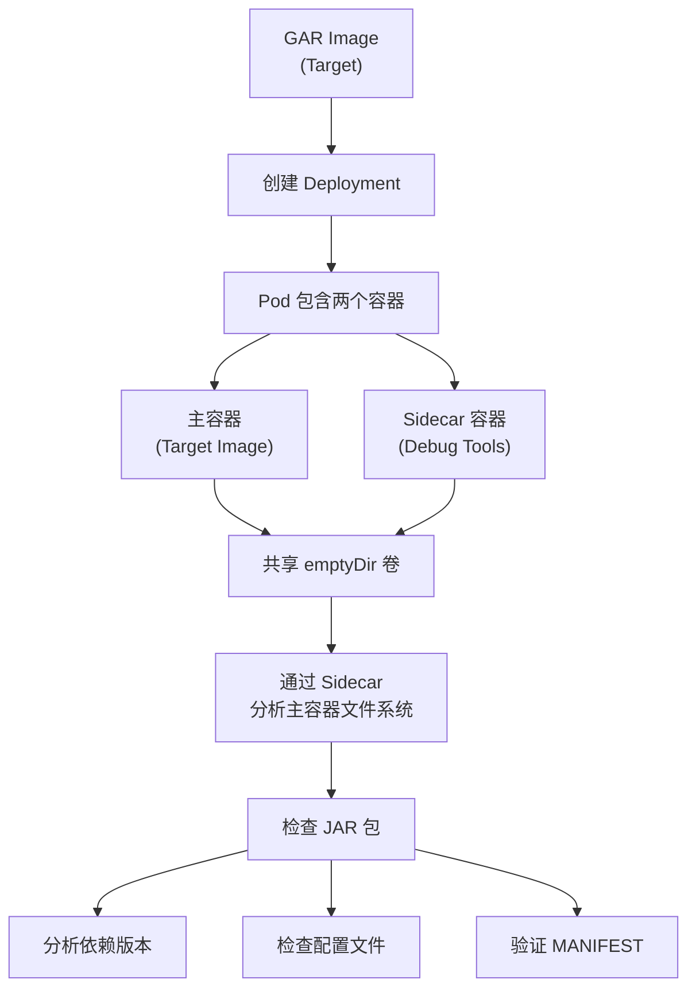

# Java Pod Sidecar Debug 流程文档

## 概述

本文档描述了使用 Sidecar 容器调试 GKE 中无法正常启动的 Java 应用镜像的标准化流程。

## 场景说明

- **已有资源**:GAR 中的 Java 应用镜像
- **问题现象**:Deployment 部署后 Pod 启动失败 (`CrashLoopBackOff` / `Error`)
- **调试目标**:分析 JAR 包内容、依赖版本、配置文件等
- **核心策略**:使用 Sidecar 工具容器 + 共享卷实现无侵入式调试

## 核心原理



## 调试流程

### 阶段 1:创建调试 Deployment

#### 1.1 Deployment 结构设计

调试 Deployment 包含以下关键要素:

- **主容器 (Target)**:待调试的 Java 应用镜像
  - 覆盖启动命令为 `sleep`,防止启动失败
  - 挂载共享卷到应用目录
- **Sidecar 容器 (Debug)**:工具容器 (如 `praqma/network-multitool`)

  - 包含网络工具、Shell、文本处理工具
  - 挂载相同的共享卷
  - 保持运行状态供 exec 进入

- **共享卷 (emptyDir)**:
  - 主容器和 Sidecar 共享文件系统
  - 用于访问 JAR 包和应用文件

#### 1.2 Deployment YAML 模板

```yaml
apiVersion: apps/v1
kind: Deployment
metadata:
  name: java-debug-deployment
  namespace: default
  labels:
    app: java-debug
    purpose: troubleshooting
spec:
  replicas: 1
  selector:
    matchLabels:
      app: java-debug
  template:
    metadata:
      labels:
        app: java-debug
    spec:
      # 共享卷定义
      volumes:
        - name: app-volume
          emptyDir: {}

      containers:
        # 主容器:待调试的 Java 应用
        - name: target-app
          image: TARGET_IMAGE_PLACEHOLDER
          # 覆盖启动命令,防止应用启动失败
          command: ["/bin/sh", "-c"]
          args: ["echo 'Target container in debug mode'; sleep 36000"]
          volumeMounts:
            - name: app-volume
              mountPath: /opt/apps
          resources:
            requests:
              memory: "256Mi"
              cpu: "100m"
            limits:
              memory: "512Mi"
              cpu: "500m"

        # Sidecar 容器:调试工具
        - name: debug-sidecar
          image: SIDECAR_IMAGE_PLACEHOLDER
          command: ["/bin/sh", "-c"]
          args: ["echo 'Debug sidecar ready'; sleep 36000"]
          volumeMounts:
            - name: app-volume
              mountPath: /opt/apps
          resources:
            requests:
              memory: "128Mi"
              cpu: "50m"
            limits:
              memory: "256Mi"
              cpu: "200m"
```

### 阶段 2:部署并进入 Sidecar

#### 2.1 应用 Deployment

```bash
# 使用脚本自动生成并部署
./debug-java-pod.sh \
  -s asia-docker.pkg.dev/PROJECT/REPO/network-multitool:latest \
  -t asia-docker.pkg.dev/PROJECT/REPO/java-application:latest

# 或手动部署
kubectl apply -f java-debug-deployment.yaml
```

#### 2.2 验证 Pod 状态

```bash
# 检查 Pod 是否 Running
kubectl get pods -l app=java-debug

# 查看 Pod 详情
kubectl describe pod <POD_NAME>

# 检查两个容器是否都在运行
kubectl get pod <POD_NAME> -o jsonpath='{.status.containerStatuses[*].name}'
```

#### 2.3 进入 Sidecar 容器

```bash
# 进入调试 Sidecar
kubectl exec -it <POD_NAME> -c debug-sidecar -- /bin/sh

# 或使用 bash (如果可用)
kubectl exec -it <POD_NAME> -c debug-sidecar -- /bin/bash
```

### 阶段 3:分析 JAR 包

#### 3.1 定位 JAR 文件

```bash
# 在 Sidecar 容器内执行
cd /opt/apps

# 列出所有文件
ls -lh

# 查找 JAR 文件
find /opt/apps -name "*.jar" -type f
```

#### 3.2 校验 JAR 包完整性

```bash
# 计算 MD5 哈希值
md5sum *.jar

# 计算 SHA256 哈希值
sha256sum *.jar

# 对比 CI/CD 构建日志中的哈希值
```

#### 3.3 检查 JAR 包内容

##### 查看 MANIFEST.MF

```bash
# 提取并查看 MANIFEST 文件
unzip -p /opt/apps/*.jar META-INF/MANIFEST.MF

# 关键字段:
# - Spring-Boot-Version
# - Implementation-Version
# - Build-Time
```

##### 列出所有依赖

```bash
# 列出 JAR 包内所有文件
unzip -l /opt/apps/*.jar

# 查看 Spring Boot 依赖
unzip -l /opt/apps/*.jar | grep "spring-boot"

# 查看特定库版本 (如 snakeyaml)
unzip -l /opt/apps/*.jar | grep "snakeyaml"

# 查看所有 lib 目录下的 JAR
unzip -l /opt/apps/*.jar | grep "BOOT-INF/lib"
```

##### 检查依赖冲突

```bash
# 查找是否存在同一库的多个版本
unzip -l /opt/apps/*.jar | grep "BOOT-INF/lib" | grep "spring-boot" | sort

# 示例输出 (发现冲突):
# BOOT-INF/lib/spring-boot-2.6.6.jar
# BOOT-INF/lib/spring-boot-2.7.10.jar  <-- 版本冲突!
```

#### 3.4 提取并分析配置文件

```bash
# 查看 application.yml/properties
unzip -p /opt/apps/*.jar BOOT-INF/classes/application.yml
unzip -p /opt/apps/*.jar BOOT-INF/classes/application.properties

# 提取到临时目录进行详细分析
mkdir -p /tmp/jar-analysis
unzip /opt/apps/*.jar -d /tmp/jar-analysis

# 查看所有配置文件
find /tmp/jar-analysis -name "*.yml" -o -name "*.properties" -o -name "*.xml"
```

### 阶段 4:高级调试技巧

#### 4.1 网络连通性测试

```bash
# 在 Sidecar 中测试网络连接
ping <DATABASE_HOST>
curl -v <API_ENDPOINT>
nslookup <SERVICE_NAME>

# 测试端口连通性
nc -zv <HOST> <PORT>
```

#### 4.2 模拟应用启动

```bash
# 如果 Sidecar 镜像包含 JDK
java -version

# 尝试手动启动 JAR (查看详细错误)
java -jar /opt/apps/*.jar

# 使用 Debug 模式启动
java -agentlib:jdwp=transport=dt_socket,server=y,suspend=n,address=5005 \
     -jar /opt/apps/*.jar
```

#### 4.3 日志分析

```bash
# 查看主容器日志
kubectl logs <POD_NAME> -c target-app

# 实时跟踪日志
kubectl logs -f <POD_NAME> -c target-app

# 查看之前失败的容器日志
kubectl logs <POD_NAME> -c target-app --previous
```

### 阶段 5:清理资源

```bash
# 删除调试 Deployment
kubectl delete deployment java-debug-deployment

# 或使用脚本清理
kubectl delete -f java-debug-deployment.yaml
```

## 常见问题排查清单

### JAR 包问题

| 检查项           | 命令                                              | 预期结果             |
| ---------------- | ------------------------------------------------- | -------------------- |
| JAR 文件存在     | `ls -lh /opt/apps/*.jar`                          | 文件存在且大小合理   |
| 文件完整性       | `md5sum *.jar`                                    | 哈希值与 CI 构建一致 |
| Spring Boot 版本 | `unzip -p *.jar META-INF/MANIFEST.MF`             | 版本符合预期         |
| 依赖冲突         | `unzip -l *.jar \| grep BOOT-INF/lib \| sort`     | 无重复版本           |
| 配置文件         | `unzip -p *.jar BOOT-INF/classes/application.yml` | 配置正确             |

### 启动失败常见原因

1. **依赖版本冲突**

   - 检查 `BOOT-INF/lib` 中是否有同一库的多个版本
   - 对比 `mvn dependency:tree` 输出

2. **配置错误**

   - 数据库连接字符串
   - 环境变量缺失
   - Secret/ConfigMap 未挂载

3. **资源不足**

   - 内存限制过低
   - CPU 限制导致启动超时

4. **权限问题**
   - SecurityContext 限制
   - 文件系统只读

## 最佳实践

### 1. 标准化调试流程

- 使用统一的脚本创建调试 Deployment
- 保持 Sidecar 镜像版本一致
- 记录每次调试的发现

### 2. CI/CD 集成

```bash
# 在构建阶段生成依赖快照
mvn dependency:tree > dependency-tree.txt

# 计算 JAR 包哈希值
sha256sum target/*.jar > jar-checksum.txt

# 将这些文件作为构建产物保存
```

### 3. 安全考虑

- 调试完成后立即删除 Debug Deployment
- 不要在生产环境长期保留调试 Pod
- 使用 RBAC 限制调试权限

### 4. 文档记录

每次调试应记录:

- 镜像版本和哈希值
- 发现的问题
- 解决方案
- 相关的 CI/CD 构建日志

## 工具推荐

### Sidecar 镜像选择

| 镜像                       | 特点         | 适用场景     |
| -------------------------- | ------------ | ------------ |
| `praqma/network-multitool` | 网络工具丰富 | 网络问题调试 |
| `nicolaka/netshoot`        | 超全工具集   | 综合调试     |
| `busybox`                  | 轻量级       | 简单文件检查 |
| 自定义镜像 (含 JDK)        | 可运行 Java  | 需要执行 JAR |

### 必备工具清单

Sidecar 容器应包含:

- `unzip` / `jar`:解压 JAR 包
- `curl` / `wget`:HTTP 请求测试
- `nc` / `telnet`:端口连通性测试
- `dig` / `nslookup`:DNS 解析
- `vi` / `nano`:文本编辑
- `jq`:JSON 处理

## 自动化脚本

参考配套脚本 `debug-java-pod.sh`,支持:

```bash
# 基本用法
./debug-java-pod.sh \
  -s <SIDECAR_IMAGE> \
  -t <TARGET_IMAGE>

# 高级选项
./debug-java-pod.sh \
  -s <SIDECAR_IMAGE> \
  -t <TARGET_IMAGE> \
  -n <NAMESPACE> \
  -d <DEPLOYMENT_NAME> \
  -m <MOUNT_PATH>
```

## 总结

使用 Sidecar 模式调试 Java Pod 的优势:

✅ **无侵入**:不修改原始镜像
✅ **可重复**:标准化流程,可自动化
✅ **安全**:隔离调试环境
✅ **灵活**:可选择不同的工具镜像
✅ **高效**:快速定位问题

核心思路:**让失败的容器"活"下来,用工具容器"解剖"它**。


```bash
➜  java git:(main) ✗ ./debug-java-pod.sh -s nginx:latest -t busybox:latest -n lex
[INFO] ==========================================
[INFO] Java Pod Debug Script v1.0.0
[INFO] ==========================================

[INFO] 检查依赖工具...
[SUCCESS] 依赖检查通过
[INFO] 验证 Kubernetes 集群连接...
[SUCCESS] 集群连接正常
[INFO] 检查命名空间: lex
[INFO] 生成 Deployment YAML: /tmp/java-debug-1767415846.yaml
[INFO] 部署 Deployment: java-debug-1767415846
deployment.apps/java-debug-1767415846 created
[SUCCESS] Deployment 已创建
[INFO] 等待 Pod 就绪...
.[SUCCESS] Pod 已就绪

[INFO] ==========================================
[SUCCESS] 调试环境已就绪!
[INFO] ==========================================

  Namespace:   lex
  Deployment:  java-debug-1767415846
  Pod:         java-debug-1767415846-5957ff98fc-8dm5x
  Target:      busybox:latest
  Sidecar:     nginx:latest
  Mount Path:  /opt/apps

[INFO] ==========================================

[INFO] 容器状态:
  - debug-sidecar	{"running":{"startedAt":"2026-01-03T04:51:01Z"}}
  - target-app	{"running":{"startedAt":"2026-01-03T04:51:01Z"}}

[INFO] 常用命令:

  # 进入 Sidecar 容器
  kubectl exec -it java-debug-1767415846-5957ff98fc-8dm5x -n lex -c debug-sidecar -- /bin/sh

  # 查看目标容器日志
  kubectl logs java-debug-1767415846-5957ff98fc-8dm5x -n lex -c target-app

  # 查看 Sidecar 日志
  kubectl logs java-debug-1767415846-5957ff98fc-8dm5x -n lex -c debug-sidecar

  # 检查 JAR 包
  kubectl exec -it java-debug-1767415846-5957ff98fc-8dm5x -n lex -c debug-sidecar -- ls -lh /opt/apps

  # 删除调试 Deployment
  kubectl delete deployment java-debug-1767415846 -n lex

[SUCCESS] 脚本执行完成

kubectl exec -it java-debug-1767415846-5957ff98fc-8dm5x -n lex -c debug-sidecar -- /bin/sh

# which nginx
/usr/sbin/nginx
```
