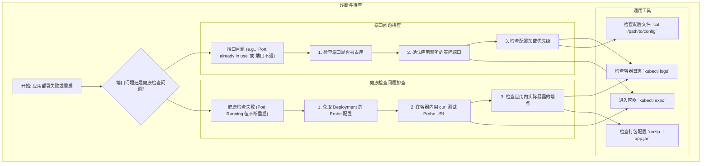

# Debugging Java Application Port and Health Check Issues in GKE

在 GKE (Google Kubernetes Engine) 环境中部署 Java 应用时，最常见的问题之一是服务端口未按预期工作或健康检查 (Liveness/Readiness Probes) 失败。本文档提供一个系统性的排查指南，帮助你快速定位并解决这些问题。

## 核心排查流程

当遇到端口或健康检查问题时，可以遵循以下流程图进行排查：



---

## 场景一：应用端口监听不正确或冲突

当你发现应用日志显示监听的端口不是你配置的端口（例如，配置了 `8443` 但启动日志显示 `8080`），或者报 `Port already in use` 错误时，按以下步骤排查。

### 1. 检查 Spring Boot 配置加载顺序

Spring Boot 的配置加载有严格的优先级，高优先级的配置会覆盖低优先级的。

| 优先级 | 配置源                               | 示例                                           |
| :--- | :----------------------------------- | :--------------------------------------------- |
| **高** | 1. 命令行参数                        | `java -jar app.jar --server.port=8080`         |
| | 2. 环境变量                          | `export SERVER_PORT=8080`                      |
| | 3. `application-{profile}.properties` | `application-prod.properties`                  |
| **低** | 4. `application.properties`          | `src/main/resources/application.properties`    |

**排查步骤:**

1.  **检查容器启动命令和环境变量**:
    这是最高优先级的配置源，需要首先确认。

    ```bash
    # 查看 Pod 的详细描述，重点关注 spec.containers.args 和 spec.containers.env
    kubectl describe pod <pod-name>

    # 直接进入容器检查环境变量
    kubectl exec -it <pod-name> -- env | grep -i "port\|server"
    ```
    如果发现 `SERVER_PORT` 或 `--server.port` 参数被设置为非预期的值，请检查你的 `deployment.yaml`。

2.  **验证 ConfigMap 挂载和内容**:
    确认你通过 ConfigMap 挂载的配置文件是否正确加载。

    ```bash
    # 进入容器
    kubectl exec -it <pod-name> -- sh

    # 检查挂载路径和文件内容
    ls -l /app/config/
    cat /app/config/server-conf.properties | grep "server.port"
    ```
    如果文件内容不正确或文件不存在，请检查 `deployment.yaml` 中的 `volumeMounts` 和 `volumes` 配置。

3.  **在应用内添加调试日志**:
    如果以上方法都无法定位问题，可以直接在代码中打印出最终生效的配置值。

    ```java
    import org.springframework.beans.factory.annotation.Value;
    import org.springframework.boot.context.event.ApplicationReadyEvent;
    import org.springframework.context.ApplicationListener;
    import org.springframework.stereotype.Component;
    import lombok.extern.slf4j.Slf4j;

    @Slf4j
    @Component
    public class ConfigDebugger implements ApplicationListener<ApplicationReadyEvent> {

        @Value("${server.port:default}")
        private String serverPort;

        @Override
        public void onApplicationEvent(ApplicationReadyEvent event) {
            log.info("================ Configuration Debug ================");
            log.info("Final effective server.port is: {}", serverPort);
            log.info("=====================================================");
        }
    }
    ```

### 2. 快速检查端口监听状态

你可以直接在容器内使用网络工具来确认哪个进程正在监听哪个端口。

```bash
# 进入容器
kubectl exec -it <pod-name> -- sh

# 使用 netstat (如果可用)
# -t: TCP, -l: listening, -n: numeric, -p: program
netstat -tlnp

# 使用 ss (更现代的工具)
ss -tlnp
```
这会明确显示出 Java 进程实际监听的端口，帮你快速验证问题。

---

## 场景二：健康检查 (Probe) 失败

如果应用端口正常启动，但 Pod 不断被 Kubernetes 重启，通常是 Liveness 或 Readiness Probe 失败导致的。原因是 Probe 配置的路径与应用实际提供的健康检查路径不匹配。

### 1. 确认 Probe 配置

首先，从你的 `deployment.yaml` 中获取当前的 Probe 配置。

```bash
# 获取 Deployment 的 YAML 配置，并过滤出 Probe 相关部分
kubectl get deployment <deployment-name> -o yaml | grep -A 10 "readinessProbe"
```
你会看到类似下面的配置：
```yaml
readinessProbe:
  httpGet:
    path: /api/v1/.well-known/health # <-- 关键路径
    port: 8443
    scheme: HTTPS
```

### 2. 在容器内验证 Probe 路径

使用 `curl` 在容器内部直接测试 Probe 配置的 URL 是否能访问成功。

```bash
# 进入容器
kubectl exec -it <pod-name> -- sh

# 测试 Probe URL (根据你的配置调整)
# -k: 忽略 HTTPS 证书验证
# -v: 显示详细的请求和响应信息
curl -kv https://localhost:8443/api/v1/.well-known/health
```
*   如果返回 `200 OK`，说明路径正确。
*   如果返回 `404 Not Found`，说明应用没有在这个路径上提供服务。
*   如果返回其他错误（如连接被拒绝），则可能是端口或协议（HTTP/HTTPS）配置错误。

### 3. 查找应用实际的健康检查路径

如果上一步测试失败，你需要找出应用实际暴露的健康检查路径。

1.  **检查 Actuator 端点**:
    Spring Boot Actuator 是最常见的健康检查实现。默认路径是 `/actuator/health`。

    ```bash
    # 测试默认的 Actuator 路径
    curl -kv http://localhost:8080/actuator/health
    curl -kv https://localhost:8443/actuator/health

    # 查看所有可用的 Actuator 端点
    curl -s http://localhost:8080/actuator | jq
    ```

2.  **检查应用日志**:
    应用启动时，Spring MVC 或 WebFlux 会打印出所有注册的 URL 映射。

    ```bash
    kubectl logs <pod-name> | grep -i "Mapped \"{[\/\|\""
    ```

3.  **修改 Probe 或代码**:
    *   **推荐方案**: 修改 `deployment.yaml` 中的 `path` 以匹配应用实际的路径（如 `/actuator/health`）。
    *   **备选方案**: 在代码中添加一个符合 Probe 要求的 Controller。

    ```java
    @RestController
    public class CustomHealthController {
        @GetMapping("/api/v1/.well-known/health")
        public ResponseEntity<String> customHealth() {
            return ResponseEntity.ok("{\"status\":\"UP\"}");
        }
    }
    ```

---

## 场景三：从运行的 JAR 文件中查找配置

有时，配置（如 OpenAPI/Swagger 的 YAML 文件）被打包在 `app.jar` 内部。如果你需要确认这些内部文件的内容，可以按以下步骤操作。

1.  **从容器复制 JAR 文件到本地**:

    ```bash
    # 1. 在 Pod 中找到 JAR 文件的路径
    JAR_PATH=$(kubectl exec -it <pod-name> -- find / -name "*.jar" 2>/dev/null | head -n 1)
    echo "Found JAR at: $JAR_PATH"

    # 2. 将 JAR 文件复制到本地
    kubectl cp <namespace>/<pod-name>:$JAR_PATH ./app.jar
    ```

2.  **解压并查看 JAR 内容**:
    JAR 文件本质上是 ZIP 压缩文件，可以直接用 `unzip` 或 `jar` 命令操作。

    ```bash
    # 列出 JAR 包中的所有文件，并过滤你关心的配置文件
    unzip -l app.jar | grep -E "\\.yaml|\\.properties"

    # 提取特定的文件到当前目录
    unzip app.jar "BOOT-INF/classes/api/spec.yaml"

    # 查看文件内容
    cat BOOT-INF/classes/api/spec.yaml
    ```

3.  **直接在容器内操作 (推荐)**:
    如果不想复制大文件，可以直接在容器内完成解压和查看。

    ```bash
    kubectl exec -it <pod-name> -- sh -c '
      JAR_PATH=$(find / -name "*.jar" 2>/dev/null | head -n 1) && \
      cd /tmp && \
      unzip -l $JAR_PATH | grep "spec.yaml" && \
      unzip $JAR_PATH "BOOT-INF/classes/api/spec.yaml" && \
      cat BOOT-INF/classes/api/spec.yaml
    '
    ```