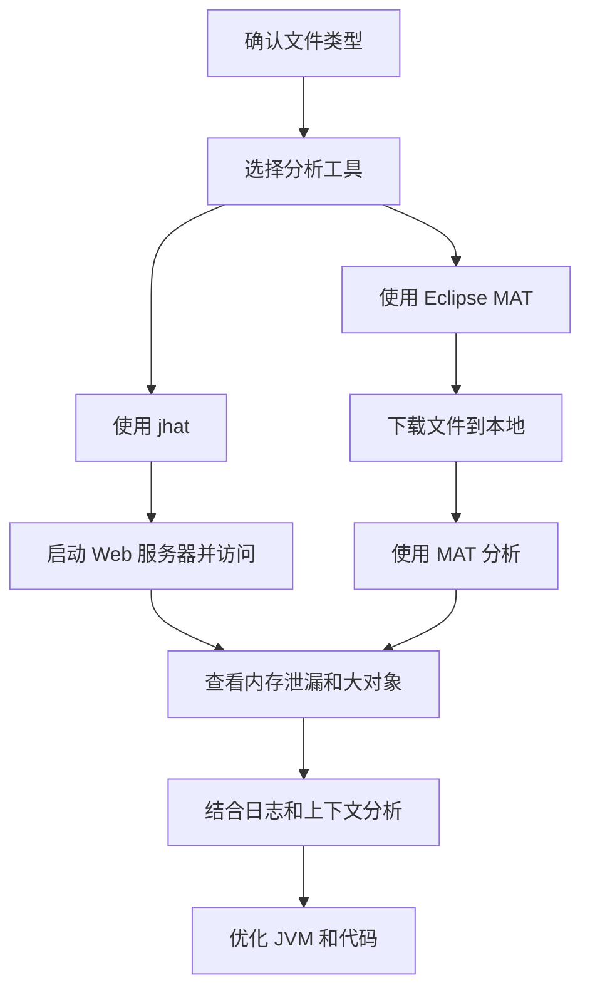

# 分析 `headpdump.hprof` 文件的方案

`headpdump.hprof` 文件通常是 Java 应用程序的堆转储文件，用于分析内存使用情况和排查内存泄漏等问题。以下是一个详细的分析方案，适用于在 Linux 环境下使用相关工具来处理此类文件。我将以 Markdown 格式提供步骤说明，并附上必要的示例和流程图。

## 分析方案步骤

### 1. 确认文件类型和工具准备

首先，确认 `headpdump.hprof` 确实是 Java 堆转储文件。可以使用 `file` 命令来检查文件类型：

```bash
file headpdump.hprof
```

预期输出类似：
```
headpdump.hprof: Java profile data, version 1.0.2
```

如果确认是 Java 堆转储文件，接下来需要准备分析工具。常用的工具有：
- **Eclipse Memory Analyzer Tool (MAT)**：一个强大的图形化工具，适合直观分析。
- **jhat**：Java 自带的堆转储分析工具，命令行操作。
- **VisualVM**：Java VisualVM 也支持堆转储分析。

如果您在 Linux 服务器上操作，建议使用 `jhat` 或将文件下载到本地使用 MAT 分析。

### 2. 使用 `jhat` 进行初步分析（Linux 服务器）

如果您希望直接在 Linux 服务器上分析，可以使用 `jhat`：

```bash
jhat headpdump.hprof
```

运行后，`jhat` 会启动一个 Web 服务器，默认端口为 7000。您可以通过浏览器访问 `http://<server-ip>:7000` 查看分析结果。

**注意**：`jhat` 适合小型堆转储文件。如果文件较大（几 GB 或以上），可能会导致性能问题，建议使用 MAT。

### 3. 使用 Eclipse MAT 进行深入分析（推荐）

对于大型堆转储文件，建议将文件下载到本地并使用 Eclipse MAT 进行分析：
1. 从 [Eclipse MAT 下载页面](https://www.eclipse.org/mat/downloads.php) 下载并安装 MAT。
2. 使用 `scp` 命令将文件从服务器下载到本地：

```bash
scp user@server:/path/to/headpdump.hprof ~/Downloads/
```

3. 打开 MAT，导入 `headpdump.hprof` 文件。
4. 使用 MAT 的功能（如 Leak Suspects 报告）分析内存泄漏或大对象占用。

### 4. 关键点分析指引

在分析堆转储文件时，关注以下关键点：
- **内存泄漏嫌疑**：查找未被垃圾回收的对象，可能是由于引用未释放。
- **大对象占用**：检查哪些对象占用了最多的内存。
- **类加载器问题**：确认是否有过多的类加载导致内存压力。

### 5. 结合系统日志和上下文

堆转储文件只是分析的一部分，建议结合以下信息：
- 检查 Java 应用程序的日志，是否有 `OutOfMemoryError` 或相关异常。
- 使用 `top` 或 `htop` 查看系统资源使用情况。
- 使用 `jmap` 或 `jstack` 获取更多运行时信息（如果应用程序仍在运行）。

例如，获取线程堆栈信息：

```bash
jstack <pid> > thread_dump.txt
```

### 6. 性能优化和后续步骤

根据分析结果，采取以下措施：
- 调整 JVM 参数（如 `-Xmx` 和 `-Xms`）以优化内存分配。
- 检查代码中是否存在未释放资源（如未关闭的连接）。
- 使用垃圾回收日志（启用 `-XX:+PrintGCDetails`）进一步监控。

## 流程图

以下是分析 `headpdump.hprof` 文件的 Mermaid 流程图：



## 注意事项

- **权限确认**：确保您有足够的权限读取 `headpdump.hprof` 文件和执行相关命令。
- **文件大小**：如果文件较大，建议直接使用 MAT 避免服务器资源压力。
- **安全传输**：使用 `scp` 下载文件时，确保使用安全的连接方式。

如果您有具体的环境信息（如文件大小、服务器配置）或具体的分析需求（如关注某类对象），请提供更多细节，我可以进一步定制方案。