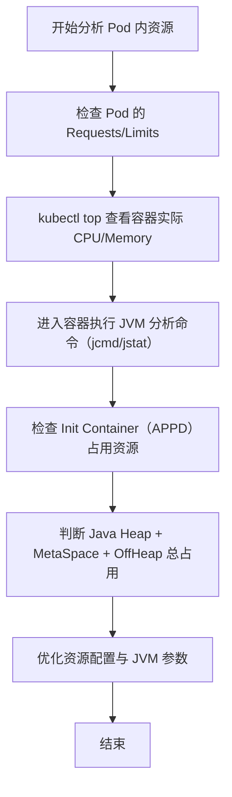
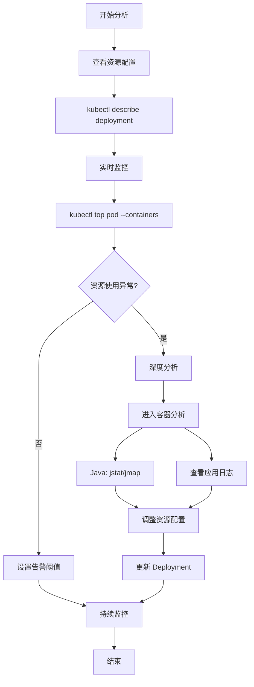
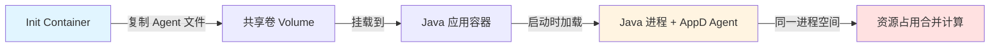
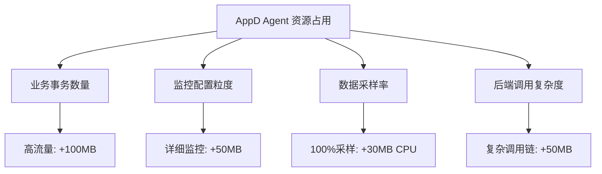
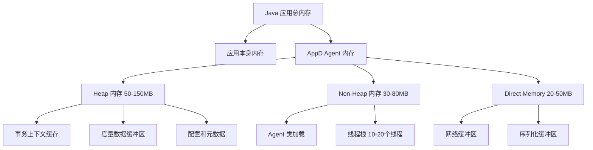
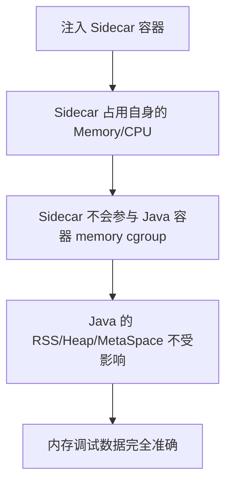

# GKE Deployment 中 Java 应用与 AppDynamics 资源分析

## Q: 在 GKE Deployment 中，一个 Pod 内包含多个容器（Init Container + Java 主容器），每个容器究竟占用多少 CPU / Memory？如何系统化分析资源使用情况？

## A:

### 1. 问题分析

你现在面临的核心问题是：**在 GKE Deployment 中，一个 Pod 内包含多个容器（Init Container + Java 主容器），每个容器究竟占用多少 CPU / Memory？如何系统化分析资源使用情况？**

特别是在 Java 服务中，JVM 内存（Heap + MetaSpace + DirectBuffer）往往会把分配的限制吃满，而 APPD（AppDynamics）这样的 side/init container 也会占用独立的资源。

---\n

### 2. 解决方案（整体方法论）

为了完整分析，你可以从 **三个层级** 入手：

#### 2.1 Pod 层：资源 Requests/Limits 分析

Pod 中每个容器都有独立的 Request / Limit。
Init Container 的资源模型是：

> **Init Container 按序运行，Pod 的 Resource Request = 所有 initContainers（取最大值）与 containers（累加）共同决定。**

因此 APPD Init Container 的资源配置会直接影响 Pod 的调度。

#### 2.2 容器层：实际运行时监控

GKE 提供三类方式分析真实资源占用：

##### (1) `kubectl top`

```bash
kubectl top pod <pod-name> --containers
```

得到每个 container 实际 CPU / Memory 使用。

##### (2) Google Cloud Monitoring (Metrics Explorer)

Metrics：
*   `kubernetes.io/container/memory/used_bytes`
*   `kubernetes.io/container/cpu/core_usage_time`

按 container 名称过滤，可以看到长期趋势。

##### (3) Container 内部 JVM 分析

Java 容器内部可查询：

```bash
jcmd <PID> VM.flags
jstat -gc <PID> 1000 10
ps aux | grep java
```

可以看到：
*   Heap Max
*   MetaSpace Max
*   DirectBuffer 使用量
*   进程 RSS（真实内存）

#### 2.3 离线分析（Java + APPD）

关键是要知道每个组件在 Pod 内的真实开销。

**APPD（AppDynamics）Init Container：**

它通常包含：
*   Agent 解压阶段使用 CPU
*   Agent 文件 200~800MB
*   运行后 Agent 会在 Java 容器内部继续占用内存（非 Init 执行时）

APPD 对内存的影响主要在 Java 主容器中体现为：
*   `-javaagent:/...` 加载 Agent 占用 额外 100–300MB Heap + MetaSpace
*   Trace 场景可能更高

**Java Application 内存结构：**

JVM 的 Pod 内内存占用一般由以下三部分组成：

| 内存类型 | 内容         | 占用情况             |
| :------- | :----------- | :------------------- |
| Heap     | 对象、业务代码 | 500MB–16GB（看你设置） |
| MetaSpace | 类加载、反射 | 50–500MB             |
| Off-Heap (DirectBuffer、Thread Stack) | NIO、线程栈 | 100–500MB            |
| JVM 自身 | VM runtime   | 100MB 左右           |

因此，即使你把 Java Heap 设置为 2GB，Pod 最终可能吃 2.7~3.2GB。

---\n

### 3. 代码示例（常用分析命令）

**查看 Pod 中每个容器的实时占用**

```bash
kubectl top pod <pod-name> --containers
```

**查看 JVM 真实 RSS**

```bash
kubectl exec -it <pod> -c <java-container> -- ps -o pid,rss,comm -p 1
```

**查看 JVM Heap/MetaSpace 配置**

```bash
kubectl exec -it <pod> -c <java-container> -- jcmd 1 VM.flags
```

**查看 JVM GC & 内存使用**

```bash
kubectl exec -it <pod> -c <java-container> -- jstat -gc 1 1000 3
```

---\n

### 4. 流程图（Pod 内资源占用分析流程）



---\n

### 5. 注意事项（最佳实践）

##### (1) Init Container 的资源不能忽视

APPD Init 容器的 requests/limits 会影响 Pod 调度，请检查你的 YAML：

```yaml
resources:
  requests:
    cpu: "500m"
    memory: "512Mi"
  limits:
    cpu: "1"
    memory: "1Gi"
```

##### (2) JVM Heap 不等于 Pod Memory

若 Heap=2GB，Pod 最好 Limit 设为 3GB–3.5GB。

##### (3) 使用 GKE 建议启用 Workload Metrics

Metrics Explorer 可长时间分析趋势，而非只看一次瞬时值。

##### (4) APPD 对 Java 内存有显著额外成本

尤其在大量 Trace 情况下会导致：
*   GC 压力上升
*   MetaSpace 占用上升
*   OOMKilled 可能性增加

##### (5) 建议做一次 Profiling

可以通过：
*   Async Profiler
*   APPD 本身
*   jmap / jcmd

来分析哪些部分占用内存。

---\n

如果你需要，我可以帮你进一步生成：
*   你们当前 Deployment 的资源分析模板
*   适合 Java + APPD 的资源规划表（包含 CPU/Memory 建议）
*   一个自动化脚本，直接抓取所有 Pod 内 JVM RSS & 容器占用并汇总成表

你希望继续吗？

---\n

# GKE 中 Deployment 资源占用分析指南

## 问题分析

您需要分析 GKE 中 Deployment 的资源占用情况，特别是：

*   Init Container (AppDynamics) 的资源消耗
*   Java 应用主容器的资源消耗
*   如何持续监控和优化资源配置

## 解决方案

### 1. 查看 Pod 资源配置

首先检查当前配置的资源限制：

```bash
# 查看 Deployment 的资源配置
kubectl describe deployment <deployment-name> -n <namespace>

# 查看具体 Pod 的资源配置
kubectl get pod <pod-name> -n <namespace> -o yaml | grep -A 10 resources
```

### 2. 实时监控资源使用情况

#### 2.1 查看 Pod 级别资源使用

```bash
# 查看所有 Pod 的实时资源使用
kubectl top pod -n <namespace>

# 查看特定 Pod 的资源使用
kubectl top pod <pod-name> -n <namespace> --containers
```

#### 2.2 查看容器级别详细信息

```bash
# 获取 Pod 中所有容器的资源使用情况
kubectl top pod <pod-name> -n <namespace> --containers

# 输出示例：
# POD              NAME              CPU(cores)   MEMORY(bytes)
# my-app-xxx       appd-init         0m           50Mi
# my-app-xxx       java-app          250m         1024Mi
```

### 3. 分析历史资源使用数据

#### 3.1 使用 GCP Monitoring (推荐)

```bash
# 在 GCP Console 中查看
# Kubernetes Engine > Workloads > 选择 Deployment > Metrics

# 或使用 gcloud 命令查询
gcloud monitoring time-series list \
  --filter='metric.type="kubernetes.io/container/memory/used_bytes"' \
  --filter='resource.labels.container_name="java-app"' \
  --format=json
```

#### 3.2 使用 Prometheus + Grafana (如已部署)

```bash
# 示例 PromQL 查询
# 容器内存使用
container_memory_usage_bytes{pod="<pod-name>", container="java-app"}

# 容器 CPU 使用
rate(container_cpu_usage_seconds_total{pod="<pod-name>", container="java-app"}[5m])
```

### 4. 深度分析 Java 应用内存

#### 4.1 进入容器查看 Java 进程

```bash
# 进入 Java 应用容器
kubectl exec -it <pod-name> -n <namespace> -c java-app -- /bin/bash

# 查看 Java 进程内存详情
jps -v

# 使用 jstat 查看 GC 和内存统计
jstat -gcutil <pid> 1000 10

# 查看堆内存使用情况
jmap -heap <pid>
```

#### 4.2 分析 JVM 参数配置

```bash
# 查看当前 JVM 参数
kubectl exec <pod-name> -n <namespace> -c java-app -- \
  java -XX:+PrintFlagsFinal -version | grep -i heap
```

### 5. AppDynamics Init Container 资源分析

#### 5.1 查看 Init Container 日志

```bash
# 查看 Init Container 日志
kubectl logs <pod-name> -n <namespace> -c appd-init

# 查看 Init Container 完成时间
kubectl describe pod <pod-name> -n <namespace> | grep -A 5 "Init Containers"
```

#### 5.2 Init Container 特点说明

```yaml
# Init Container 资源使用特点：
# 1. 仅在 Pod 启动阶段运行
# 2. 完成后释放所有资源
# 3. 不计入 Pod 运行时资源配额
# 4. 通常只需配置较小的资源限制
```

## 资源分析流程图



## 完整监控脚本示例

```bash
#!/bin/bash
# resource-monitor.sh - 资源监控脚本

NAMESPACE="your-namespace"
DEPLOYMENT="your-deployment"

echo "=== Deployment 资源配置 ==="
kubectl get deployment $DEPLOYMENT -n $NAMESPACE -o jsonpath='{.spec.template.spec.containers[*].resources}' | jq '.'

echo -e "\n=== 当前 Pod 列表 ==="
PODS=$(kubectl get pods -n $NAMESPACE -l app=$DEPLOYMENT -o jsonpath='{.items[*].metadata.name}')

for POD in $PODS; do
    echo -e "\n--- Pod: $POD ---"    
    echo "容器资源使用："
    kubectl top pod $POD -n $NAMESPACE --containers
    
    echo -e "\nInit Container 状态："
    kubectl get pod $POD -n $NAMESPACE -o jsonpath='{.status.initContainerStatuses[*].name}' 
    echo ""
    
    echo "主容器内存详情："
    kubectl exec $POD -n $NAMESPACE -c java-app -- sh -c 'ps aux | grep java'
done
```

## 推荐的资源配置策略

### Init Container (AppDynamics)

```yaml
initContainers:
- name: appd-init
  image: appdynamics/java-agent:latest
  resources:
    requests:
      cpu: 100m
      memory: 128Mi
    limits:
      cpu: 200m
      memory: 256Mi
```

### Java 应用容器

```yaml
containers:
- name: java-app
  image: your-java-app:latest
  resources:
    requests:
      cpu: 500m          # 根据实际负载调整
      memory: 1Gi        # 建议为 JVM heap 的 1.5-2 倍
    limits:
      cpu: 2000m         # 允许突发使用
      memory: 2Gi        # 防止 OOMKilled
  env:
  - name: JAVA_OPTS
    value: "-Xms1g -Xmx1g -XX:MaxMetaspaceSize=256m"
```

## 资源配置最佳实践

| 资源类型          | 建议策略           | 说明       |
| :---------------- | :----------------- | :--------- |
| **CPU Requests**  | 设置为平均使用量   | 保证基本调度 |
| **CPU Limits**    | 2-3倍 Requests     | 允许突发   |
| **Memory Requests** | 设置为稳定运行值   | 避免 OOM   |
| **Memory Limits** | 1.2-1.5倍 Requests | 留有缓冲   |
| **JVM Heap**      | 容器内存的 50-70%  | 避免容器 OOM |

## 注意事项

1.  **Init Container 资源**

    *   Init Container 完成后立即释放资源
    *   不影响 Pod 运行时资源配额
    *   建议配置适中的资源限制

2.  **Java 应用内存**

    *   JVM heap 大小应小于容器 memory limit
    *   考虑 MetaSpace、Direct Memory、Thread Stack
    *   建议：容器内存 = heap + 非heap + 系统开销

3.  **监控告警**

    *   设置内存使用率 > 80% 告警
    *   设置 CPU 限流 (throttling) 告警
    *   监控 OOMKilled 事件

4.  **资源调优**

    *   根据实际使用数据调整配置
    *   定期审查资源使用趋势
    *   压测验证资源配置合理性

## 进一步优化建议

```bash
# 1. 启用 Vertical Pod Autoscaler (VPA) 自动建议资源配置
kubectl apply -f https://github.com/kubernetes/autoscaler/releases/download/vpa-0.14.0/vpa-v0.14.0-recommender.yaml

# 2. 查看 VPA 推荐值
kubectl describe vpa <vpa-name> -n <namespace>

# 3. 启用 GKE 的资源使用计量
gcloud container clusters update <cluster-name> \
  --enable-cloud-monitoring \
  --monitoring=SYSTEM,WORKLOAD
```

---\n

通过以上方法，您可以全面了解 AppDynamics Init Container 和 Java 应用的资源占用情况，并据此优化资源配置。

---\n

# AppDynamics Java Agent 资源占用分析

## 问题分析

您的理解需要澄清几个关键概念：

1.  **Init Container 的作用**：仅用于复制 AppDynamics Agent 文件到共享卷
2.  **Java Agent 运行机制**：通过 `-javaagent` 参数注入到 Java 应用进程中
3.  **资源占用归属**：AppD Agent 的资源占用计入 Java 应用容器

## AppDynamics 工作原理

### 架构流程图



### 详细说明

```yaml
# 典型的 AppDynamics 配置示例
apiversion: apps/v1
kind: Deployment
spec:
  template:
    spec:
      # 1. Init Container: 仅负责文件复制
      initContainers:
      - name: appd-init
        image: appdynamics/java-agent:latest
        command:
        - cp
        - -r
        - /opt/appdynamics/.
        - /opt/appdynamics-java
        volumeMounts:
        - name: appd-agent
          mountPath: /opt/appdynamics-java
        resources:
          requests:
            memory: 128Mi
            cpu: 100m
          limits:
            memory: 256Mi
            cpu: 200m
      
      # 2. 主容器: Java 应用 + AppD Agent 运行在同一进程
      containers:
      - name: java-app
        image: your-java-app:latest
        env:
        # 关键: JAVA_TOOL_OPTIONS 将 Agent 注入到 JVM
        - name: JAVA_TOOL_OPTIONS
          value: >-
            -javaagent:/opt/appdynamics-java/javaagent.jar
            -Xms1g -Xmx1g
            -XX:MaxMetaspaceSize=256m
        # AppD 配置参数
        - name: APPDYNAMICS_AGENT_APPLICATION_NAME
          value: "my-app"
        - name: APPDYNAMICS_AGENT_TIER_NAME
          value: "backend"
        - name: APPDYNAMICS_AGENT_NODE_NAME
          valueFrom:
            fieldRef:
              fieldPath: metadata.name
        volumeMounts:
        - name: appd-agent
          mountPath: /opt/appdynamics-java
        resources:
          requests:
            # 注意: 这里的资源包含了 Java 应用 + AppD Agent
            memory: 2Gi
            cpu: 1000m
          limits:
            memory: 3Gi
            cpu: 2000m
      
      volumes:
      - name: appd-agent
        emptyDir: {}
```

## AppDynamics Agent 资源占用评估

### 1. 典型资源开销

| 资源类型          | 典型开销   | 说明             |
| :---------------- | :--------- | :--------------- |
| **内存 (Heap)**   | 50-150 MB  | Agent 自身堆内存 |
| **内存 (Non-Heap)** | 30-80 MB   | 类加载、线程栈等   |
| **内存 (总计)**     | 100-250 MB | 取决于监控粒度   |
| **CPU**           | 2-8%       | 数据采集和传输开销 |
| **网络**          | 1-5 Mbps   | 向 Controller 发送数据 |

### 2. 影响因素



## 如何分析 AppD Agent 的实际占用

### 方法 1: 对比测试法 (推荐)

```bash
#!/bin/bash
# appd-resource-comparison.sh

NAMESPACE="your-namespace"
DEPLOYMENT="your-deployment"

echo "=== 测试方案 ==="
echo "1. 部署不带 AppD 的版本"
echo "2. 部署带 AppD 的版本"
echo "3. 对比资源使用差异"

# 步骤 1: 禁用 AppD 监控
echo -e "\n--- 禁用 AppD (注释掉 JAVA_TOOL_OPTIONS) ---"
# kubectl set env deployment/$DEPLOYMENT JAVA_TOOL_OPTIONS- -n $NAMESPACE

# 等待稳定运行
sleep 300

# 收集基线数据
echo "收集基线数据 (无 AppD)..."
kubectl top pod -n $NAMESPACE -l app=$DEPLOYMENT --containers > baseline.txt

# 步骤 2: 启用 AppD 监控
echo -e "\n--- 启用 AppD ---"
# kubectl set env deployment/$DEPLOYMENT JAVA_TOOL_OPTIONS="-javaagent:..." -n $NAMESPACE

# 等待稳定运行
sleep 300

# 收集对比数据
echo "收集对比数据 (有 AppD)..."
kubectl top pod -n $NAMESPACE -l app=$DEPLOYMENT --containers > with-appd.txt

# 对比分析
echo -e "\n=== 资源占用对比 ==="
echo "基线 (无 AppD):"
cat baseline.txt
echo -e "\n带 AppD:"
cat with-appd.txt
```

### 方法 2: JVM 内存分析

```bash
# 进入容器
kubectl exec -it <pod-name> -n <namespace> -c java-app -- /bin/bash

# 1. 查看所有 Java 进程
jps -v

# 2. 查看完整内存布局
jcmd <pid> VM.native_memory summary

# 3. 使用 jmap 导出堆转储
jmap -dump:live,format=b,file=/tmp/heap.hprof <pid>

# 4. 分析堆内存中 AppD 相关对象
jmap -histo <pid> | grep -i appdynamics
jmap -histo <pid> | grep -i "com.singularity"

# 示例输出:
#  num     #instances         #bytes  class name
# ----------------------------------------------
#  123:         1543         247856  com.singularity.ee.agent.commonservices.metricgeneration.metrics.MetricData
#  456:          892         142720  com.singularity.ee.agent.appagent.context.InterceptionContext
```

### 方法 3: 使用 Java Flight Recorder

```bash
# 启动 JFR 记录
kubectl exec <pod-name> -n <namespace> -c java-app -- \
  jcmd <pid> JFR.start name=appd-analysis duration=60s filename=/tmp/recording.jfr

# 等待记录完成
sleep 65

# 下载 JFR 文件
kubectl cp <namespace>/<pod-name>:/tmp/recording.jfr ./recording.jfr -c java-app

# 使用 JDK Mission Control 或命令行分析
jfr print --events jdk.ObjectAllocationSample recording.jfr | grep -i appdynamics
```

### 方法 4: 动态监控 AppD Agent 线程

```bash
# 进入容器
kubectl exec -it <pod-name> -n <namespace> -c java-app -- /bin/bash

# 查看 AppD 相关线程
ps -eLf | grep java
top -H -p <java-pid>

# 使用 jstack 分析线程
jstack <pid> | grep -A 10 "appdynamics\|singularity"

# 典型 AppD 线程:
# - Agent Main Thread
# - Metric Sender Thread
# - BT Session Manager
# - HTTP Client Thread Pool
```

## AppD Agent 资源占用详细分析

### 内存组成分解



### 实际测量方法

```bash
#!/bin/bash
# appd-memory-breakdown.sh

POD_NAME="your-pod"
NAMESPACE="your-namespace"

echo "=== AppDynamics Agent 内存占用分析 ==="

# 1. 获取容器总内存使用
CONTAINER_MEM=$(kubectl top pod $POD_NAME -n $NAMESPACE --containers | grep java-app | awk '{print $3}')
echo "容器总内存使用: $CONTAINER_MEM"

# 2. 获取 JVM 堆内存
kubectl exec $POD_NAME -n $NAMESPACE -c java-app -- sh -c '
  PID=$(jps | grep -v Jps | awk "{print \$1}")
  echo "=== JVM 内存统计 ==="
  jstat -gc $PID | tail -1 | awk "{
    used_heap = (\$3 + \$4 + \$6 + \$8) / 1024
    printf \"JVM Heap 使用: %.2f MB\n\", used_heap
  }"
  
  echo ""
  echo "=== 按类统计对象内存 (Top 20) ==="
  jmap -histo $PID | head -20
  
  echo ""
  echo "=== AppDynamics 相关对象 ==="
  jmap -histo $PID | grep -i \"appdynamics\|singularity\" | head -10
'

# 3. 计算 Native Memory
kubectl exec $POD_NAME -n $NAMESPACE -c java-app -- sh -c '
  PID=$(jps | grep -v Jps | awk "{print \$1}")
  echo ""
  echo "=== Native Memory Tracking ==="
  jcmd $PID VM.native_memory summary scale=MB
'
```

## 优化 AppD Agent 资源占用

### 配置优化策略

```yaml
# 在 Deployment 中添加 AppD 性能调优参数
env:
- name: JAVA_TOOL_OPTIONS
  value: >-
    -javaagent:/opt/appdynamics-java/javaagent.jar
    -Xms1g -Xmx1g
    
# AppD Agent 性能优化参数
- name: APPDYNAMICS_AGENT_METRIC_LIMIT
  value: "5000"                    # 限制度量数量
  
- name: APPDYNAMICS_AGENT_MAX_BUSINESS_TRANSACTIONS
  value: "100"                     # 限制 BT 数量
  
- name: APPDYNAMICS_AGENT_ASYNC_THREAD_POOL_SIZE
  value: "10"                      # 控制线程池大小
  
# 数据采样率配置
- name: APPDYNAMICS_AGENT_SAMPLING_PERCENTAGE
  value: "20"                      # 20% 采样率

# 禁用不需要的功能
- name: APPDYNAMICS_AGENT_ENABLE_METRICS
  value: "false"                   # 仅需要 APM 时禁用 metrics
```

### 监控配置调优

```properties
# 在 controller-info.xml 或 ConfigMap 中配置

# 1. 降低快照采集频率
<snapshot-collection-policy>
  <per-minute-limit>5</per-minute-limit>
  <min-duration-in-seconds>30</min-duration-in-seconds>
</snapshot-collection-policy>

# 2. 调整调用图深度
<call-graph>
  <max-depth>10</max-depth>
  <sampling-percentage>20</sampling-percentage>
</call-graph>

# 3. 限制 SQL 语句捕获
<sql>
  <max-length>1000</max-length>
  <enabled>true</enabled>
</sql>
```

## 资源配置建议

### 完整配置示例

```yaml
containers:
- name: java-app
  image: your-java-app:latest
  env:
  - name: JAVA_TOOL_OPTIONS
    value: >-
      -javaagent:/opt/appdynamics-java/javaagent.jar
      -Xms1536m 
      -Xmx1536m
      -XX:MaxMetaspaceSize=256m
      -XX:MaxDirectMemorySize=128m
  resources:
    requests:
      # 应用基础内存 1GB + AppD 150MB + MetaSpace 256MB + Direct 128MB + 缓冲 500MB
      memory: 2Gi
      # 应用基础 CPU 800m + AppD 100m + 缓冲 100m
      cpu: 1000m
    limits:
      memory: 3Gi      # 允许突发使用
      cpu: 2000m
```

### 资源计算公式

```
总内存需求 = 应用堆内存 + AppD内存 + MetaSpace + DirectMemory + 系统开销

其中:
- 应用堆内存: 根据业务需求 (如 1GB)
- AppD 内存: 100-250MB (取决于配置)
- MetaSpace: 128-512MB
- DirectMemory: 64-256MB
- 系统开销: 20-30% 额外缓冲
```

## 注意事项

1.  **Init Container vs Agent Runtime**

    *   Init Container 仅启动时占用资源,完成后释放
    *   AppD Agent 随 Java 应用运行,持续占用资源
    *   Agent 资源计入 Java 应用容器配额

2.  **资源预留建议**

    *   为 AppD Agent 额外预留 200-300MB 内存
    *   额外预留 5-10% CPU
    *   根据实际监控数据微调

3.  **性能影响**

    *   AppD 通常增加 2-5% 的性能开销
    *   高流量场景建议降低采样率
    *   定期审查 Agent 配置和版本

4.  **故障排查**

    *   如果 OOMKilled 频繁,优先检查 AppD 配置
    *   使用 Native Memory Tracking 定位内存泄漏
    *   考虑使用 lighter 的 APM 方案

---\n

通过以上方法,您可以准确评估和优化 AppDynamics Agent 的资源占用。

---\n

# JVM 诊断工具在容器中的使用

## 1. 问题分析

你现在关心的是：**jstat / jcmd 等 JVM 原生诊断工具在容器中是如何被“构建进去”的？**
这些工具默认不在 Linux 容器里，需要特定 Base Image 才会有。

核心点：
*   `jcmd`、`jstat` 属于 **JDK** 工具，不属于 JRE。
*   如果镜像只用 `eclipse-temurin:17-jre` 这种 JRE 镜像，就没有这些工具。
*   如果使用 `eclipse-temurin:17-jdk` 或者基于 distroless JDK 版本，会内置完整诊断工具。

---\n

## 2. 解决方案：三种常见方式

### 方案一：使用 JDK Base Image（最常见）

只要镜像是基于 JDK（不是 JRE）构建，这些工具自然存在。

**示例 Dockerfile：**

```dockerfile
FROM eclipse-temurin:17-jdk

COPY app.jar /app.jar

ENTRYPOINT ["java", "-jar", "/app.jar"]
```

然后进入 Pod：

```bash
kubectl exec -it <pod> -- which jcmd
kubectl exec -it <pod> -- which jstat
```

**优点：**
*   无需额外安装
*   企业最常用
*   Java 开发诊断完整

**缺点：**
*   镜像比 JRE 稍大（约 200MB+）

### 方案二：使用 JRE 镜像 + 手动安装 jdk-tools 包

某些 Linux 发行版（如 Alpine、Debian）允许安装工具包。

**示例（Debian JRE 镜像）：**

```dockerfile
FROM eclipse-temurin:17-jre

RUN apt-get update && apt-get install -y openjdk-17-dbg

COPY app.jar /app.jar
ENTRYPOINT ["java", "-jar", "/app.jar"]
```

安装后 `jcmd`/`jstat` 会出现在：

`/usr/lib/jvm/java-17-openjdk-amd64/bin/`

**缺点：**
*   并非所有发行版提供 dbg 包
*   仍然增加镜像体积

### 方案三：Sidecar “JVM Debug Tool” 容器（更专业的企业方案）

把诊断工具放在一个 Sidecar 容器里，而不是主容器。

**示例 Pod 结构：**

```yaml
containers:
  - name: java-app
    image: your-app:latest
  - name: jdk-tools
    image: eclipse-temurin:17-jdk
    command: ["sleep", "infinity"]
```

然后你进入 Sidecar，看 Java 主容器的 PID（共享 PID Namespace）：

```bash
kubectl exec -it <pod> -c jdk-tools -- jcmd <target-pid> VM.flags
```

**优点：**
*   主镜像保持小（可用 jre 或 distroless）
*   Sidecar 可临时开启/临时注入
*   最适合生产环境的 Debug

**缺点：**
*   需要 Pod 配置 `shareProcessNamespace: true`

**YAML 示例：**

```yaml
spec:
  shareProcessNamespace: true
```

---\n

### 3. `jcmd` / `jstat` 在镜像中的目录位置

如果你用 JDK 镜像，工具在：

`/usr/lib/jvm/<jdk-version>/bin/jcmd`
`/usr/lib/jvm/<jdk-version>/bin/jstat`

**验证命令：**

```bash
kubectl exec -it <pod> -- ls /usr/lib/jvm/*/bin | grep jcmd
```

---\n

### 4. 流程图（如何让 JVM 工具进入容器）

```mermaid
graph TD
    A["选择容器镜像"] --> B["使用 JDK 镜像？"]
    B -->|是| C["工具自然存在 (jcmd/jstat)"]
    B -->|否 (JRE 镜像)| D["是否可安装 dbg 包？"]
    D -->|可以| E["安装 openjdk-dbg 工具包"]
    D -->|不可以| F["设计 Sidecar 注入 JDK Tools"]
    C --> G["开始 JVM 内存分析"]
    E --> G
    F --> G
```

---\n

### 5. 注意事项（最佳实践）

##### (1) 建议生产环境使用 Sidecar 工具容器

**理由：**
*   主容器保持轻量
*   工具仅在需要时使用
*   避免在主镜像中意外挂载调试工具带来的安全风险

##### (2) 如果你的镜像基于 Distroless（如 `gcr.io/distroless/java17`），你一定需要 Sidecar

因为 Distroless 没 shell，也没 debug tools。

##### (3) 建议开启 JVM export metrics（更常用）

可以用：
*   Micrometer
*   Prometheus JMX Exporter
*   OpenTelemetry

这样你无需 exec 才能看内存。

---\n

你需要我为你生成以下内容吗？

✔ 一个 Java + APPD 最佳实践 Dockerfile
✔ 一个包含 JDK 工具的 Sidecar YAML 模板
✔ 一个自动收集 jstat / jcmd 数据的脚本
✔ JVM 资源规划表（Heap、Pod Memory、OOM 策略）

告诉我你想要哪个？

---\n

# Sidecar 注入 JDK 工具对 Pod 内存占用的影响分析

## 1. 问题分析

你现在关注的问题是：
**如果使用 Sidecar 来注入 JDK 工具进入原有 Pod，会不会影响 Pod 的内存占用？尤其是在你要分析 Java 容器的真实内存使用时，会不会扭曲结果？**

**结论：**
> **Sidecar 会占用独立的容器内存，但不会影响 Java 主容器的内存统计，也不会影响你要观察的 JVM RSS / Heap 使用。**

唯一要考虑的是：
*   Pod 的 *总* 内存 Limit 增加了 Sidecar 部分
*   但 Java 容器本身的指标不会被污染

---\n

## 2. 解决方案解释（详细）

### 2.1 Sidecar 会占用独立的资源（Memory + CPU）

Pod 内每个 container 的内存资源是 **独立计算** 的。

例如：

| Container         | Memory Limit | 实际占用 |
| :---------------- | :----------- | :------- |
| java-container    | 3Gi          | 2.7Gi    |
| jdk-tools-sidecar | 300Mi        | 50Mi     |

GKE 调度时按 **容器占用总和** 看 Pod 的 Request/Limit。

**但重要的是：`jstat`/`jcmd` 不会在 Sidecar 容器内部占用 Java 主容器的内存。**

因为：
*   `jstat`/`jcmd` 是 **外部诊断程序**
*   通过 **attach API** 与 JVM 通信
*   它不会修改 JVM Heap，也不会让 JVM 多吃内存

### 2.2 共享 PID Namespace 不会让 Sidecar 吃主容器的内存

你通常会配置：

```yaml
shareProcessNamespace: true
```

然后 Sidecar 能看到 Java 的 PID：

```bash
jcmd 1 GC.heap_info
```

共享 PID Namespace 是 **只共享进程视图，不共享内存分配。**

也就是说：
*   Sidecar 的工具进程会在 Sidecar 自己的 memory cgroup 中计量
*   Java 的内存仍然在 Java container 的 cgroup 中计量

两者完全分开。

### 2.3 对你测量 JVM 内存不会产生误差

无论你测量的是：
*   RSS（进程真实占用）
*   JVM Heap 使用情况（jstat、jmap）
*   MetaSpace 占用
*   OffHeap 统计

都不会受 Sidecar 影响。

正常会看到这样的情况（示例）：

```bash
kubectl top pod app-pod --containers
```

输出：

```
Container	CPU	Memory
java-app	900m	2700Mi
tools		10m	40Mi
```

→ 统计是准确和分离的。

---\n

### 3. 流程图（是否会影响 JVM 内存测量）



---\n

### 4. 注意事项（关键最佳实践）

##### (1) 给 Sidecar 单独设定小内存 Limit

**建议：**

```yaml
resources:
  requests:
    memory: 64Mi
  limits:
    memory: 128Mi
```

**原因：** JDK 工具本身很轻量。

##### (2) 不建议使用大型 JDK 镜像

如 `openjdk:17-jdk` 体积 ~500MB
可以使用以下更轻量镜像作为工具容器：
*   `eclipse-temurin:17-jdk`
*   `bellsoft/liberica-openjdk:17`
*   or distroless JDK （有调试版本）

##### (3) 共享 PID Namespace 时要注意 Pod Security Policy

某些环境可能禁用，需要开启。

##### (4) 如果你想完全避免 Sidecar 占用内存

可以使用 Ephemeral Container（推荐）：

```bash
kubectl debug <pod> -it --image=eclipse-temurin:17-jdk
```

**优势：**
*   不占用原 Deployment 的资源
*   临时注入
*   用完即删
*   Pod 不需要重新部署

这种方式占用的内存甚至更少。

---\n

### 5. 最终回答总结（最关键的 3 句话）

1.  Sidecar 会占用自己的独立内存，但不会影响 Java 容器的内存统计。
2.  `jcmd`/`jstat` 通过 attach API 访问 JVM，不会导致 JVM 内存偏差。
3.  如果想零影响，可使用 `kubectl debug` 注入 ephemeral container。

---\n

如果你需要，我可以给你生成：
✔ 一个最轻量的 Sidecar 工具 YAML
✔ 一个使用 `kubectl debug` 注入工具的完整操作手册
✔ 如何用 `jstat`/``jcmd` 采集 JVM 内存并输出到 BigQuery 的脚本

你想继续哪一个？

---\n

# 临时禁用 Java Tools Options 进行内存对比分析

## 1. 问题分析

你现在想做的是：
**临时禁用 Java Tools Options（例如：-javaagent、APPD Agent、其他 Instrumentation），让应用只运行最纯净的 Java 程序本体，然后对比两种状态的内存占用差异。**

**答案是：**
> **可以，而且这是最精准、最科学的 JVM 内存对比方法。**
> 禁用 APPD / Java Tooling 后，JVM 会减少 MetaSpace、Heap、OffHeap 的多个占用点，你能精确看到“纯应用 VS 有 Agent 后”的真实差异。

---\n

## 2. 解决方案

你可以直接修改 Deployment YAML，把 APPD 或其他 Agent 所依赖的环境变量去掉，例如：

### 原本（使用 APPD）

```yaml
env:
  - name: JAVA_TOOL_OPTIONS
    value: "-javaagent:/opt/appd/agent.jar"
```

### 调试模式（禁用 APPD）

```yaml
env:
  - name: JAVA_TOOL_OPTIONS
    value: ""
```

或者直接把该 `env` 从 Deployment 中删掉。

**效果：**
*   JVM 不会加载 Agent
*   不会产生额外类加载
*   不会产生额外的 Trace buffer
*   MetaSpace 使用量会降低
*   Heap 使用量会降低
*   GC 频次可能会下降
*   启动速度会更快

这样你就可以分析在“纯应用”状态下 Java 的真实内存占用。

---\n

### 3. 对比方法（步骤）

#### 步骤 1：禁用 Agent（你的想法）

```bash
kubectl edit deploy <your-app>
```

把 `JAVA_TOOL_OPTIONS` 删除或设为空。

重建 Pod 后，使用：

```bash
kubectl top pod <your-pod> --containers
```

查看纯应用状态的 CPU / Memory。

#### 步骤 2：查看 JVM 内部指标

```bash
jcmd 1 VM.flags
jstat -gc 1 1000 3
ps -o pid,rss,comm -p 1
```

记录纯 Java 的：
*   RSS
*   Heap Occupied
*   MetaSpace Used
*   GC Behavior

#### 步骤 3：恢复带 APPD 的 Java Tool Options

恢复 YAML：

```yaml
env:
  - name: JAVA_TOOL_OPTIONS
    value: "-javaagent:/opt/appd/agent.jar"
```

重复上面的测量流程。

#### 步骤 4：对比资源占用

你会看到两个 Pod 的明显差异：

| 指标      | 纯 Java | Java + APPD | 差异      |
| :-------- | :------ | :---------- | :-------- |
| RSS       | 1.9Gi   | 2.4Gi       | ↑ +500Mi  |
| MetaSpace | 80Mi    | 180Mi       | ↑ +100Mi  |
| OffHeap   | 200Mi   | 350Mi       | ↑ +150Mi  |
| CPU       | 400m    | 600m        | ↑ +200m   |

（以上是假设数据，但实际中 APPD 增加 300–800Mi 是常见）

---\n

# Gemini

这是一个非常经典且具有挑战性的问题。你面临的核心困惑是：AppDynamics (AppD) 的 Agent 是通过 `-javaagent` 方式注入到你的 Java 进程中的，它们在同一个进程（PID）内运行，因此在传统的系统监控（如 `top` 或 Kubernetes 里的 `container_memory_usage`）看来，它们是“浑然一体”的。

要把“业务代码”和“监控探针(Agent)”的资源消耗区分开，我们需要分层次来拆解。

以下我为你整理的分析思路和具体操作步骤：

### 1. 理清架构：Init Container vs Main Container

首先，我们需要消除关于 Init Container 的顾虑。

*   **Init Container (AppD)**: 它的作用通常仅仅是把 AppD 的 jar 包（比如 `javaagent.jar`）从镜像里 `cp`（拷贝）到一个共享的 Volume 里。
    *   **资源占用**： 仅在 Pod 启动的最初几秒运行。一旦 Main Container 启动，Init Container 就退出了。
    *   **结论**： 不需要担心 Init Container 的长期资源占用，它不消耗运行时的 CPU/内存。
*   **Main Container (你的 Java 应用)**: 你的 Deployment 里通常会有 `JAVA_TOOL_OPTIONS` 或者启动命令里包含 `-javaagent:/opt/appd/javaagent.jar`。
    *   **运行机制**： 这意味着 JVM 在启动你的应用时，同时也加载了 AppD 的字节码增强程序。它们共享同一个 JVM Heap（堆）和 Native Memory（堆外内存）。

### 2. 核心难点：如何评估“融合”后的资源开销？

因为 AppD 和你的应用在同一个 JVM 里，你确实无法简单地通过 `kubectl top pod` 区分谁用了多少。

AppD Agent 对资源的消耗主要体现在以下两方面：

*   **Heap Memory (堆内存)**: 用于存储采集到的 Metrics、Transaction 快照等数据缓冲。
*   **Non-Heap / Metaspace (元空间/堆外)**: 加载 AppD 自身的类（Classes）和线程栈。
*   **CPU**: 拦截方法调用、序列化数据、发送数据给 Controller。

#### 方案 A：A/B 测试法（最准确的评估方式）

你说“去掉了 AppD 就没法监控内存了”，这个观点其实不完全对。GKE 平台本身（Google Cloud Monitoring / Stackdriver）提供了容器级别的监控，不需要依赖 AppD 也能看到基础水位。

**操作步骤：**

*   **创建对照组**：
    *   保持现有的 Deployment (带 AppD) 运行，标记为 Group A。
    *   复制一份 Deployment yaml，修改名字，彻底注释掉 `JAVA_TOOL_OPTIONS` 和 AppD 相关的 Volume Mount，标记为 Group B。
*   **施加负载**：
    *   使用压测工具（如 JMeter 或简单的脚本）对 Group A 和 Group B 发送完全相同的请求量。
*   **观察 GKE/Cloud Monitoring 指标**：
    *   不要看 AppD 的控制台。
    *   去 GCP Console -> Kubernetes Engine -> Workloads -> 点击对应的 Pod -> Observability。
    *   **对比内存**： 查看 Memory Usage (RSS)。Group A 减去 Group B 的差值，就是 AppD 的大概内存开销。
    *   **对比 CPU**： 查看 CPU Usage。同理，差值即为 CPU 开销。

> **预期结果**： 通常 AppD Java Agent 会额外占用 150MB - 300MB 的内存，以及 2% - 5% 的 CPU（具体取决于采样率配置）。

#### 方案 B：JVM 内部透视法（Native Memory Tracking）

如果你不能停止 AppD，或者想在现有环境深挖，可以使用 JDK 自带的工具。

AppD 的 Agent 主要消耗的是 Native Memory (堆外内存) 和 Metaspace，因为它会加载很多自己的类，并且需要 Buffer 来发送网络数据。

**操作步骤：**

*   **开启 NMT (Native Memory Tracking)**:
    *   在你的 `JAVA_TOOL_OPTIONS` 里追加参数：`-XX:NativeMemoryTracking=summary` (或者 `detail`)。
    *   重启 Pod。
*   **进入容器执行命令**：
    *   `kubectl exec -it <pod-name> -- /bin/bash`
    *   执行 `jcmd 1 VM.native_memory summary`
*   **分析输出**：
    *   关注 `Class` 部分：AppD 会引入大量的类加载，这里的 `Committed` 内存会比纯净应用大。
    *   关注 `Internal` 部分：Agent 的一些底层 buffer 可能会算在这里。

#### 方案 C：堆转储分析 (Heap Dump)

如果怀疑是 Heap 占用过多：

*   **导出 Heap Dump** (`jmap -dump:format=b,file=heap.bin 1`)。
*   **使用 MAT (Memory Analyzer Tool) 打开**。
*   **关键点**： 在 Histogram 里搜索 `com.singularity` 或 `com.appdynamics` 开头的包。
    *   这些 Object 占用的 `Retained Heap` 就是 AppD 在堆内存里的直接开销。

### 3. 如何回答“是否不好评估”的问题？

你的担忧：“如果去掉 AppD，我就无法跟踪内存情况了，因为不知道有没有泄漏。”

**我的建议：**

你需要把“基础设施监控”和“应用性能监控(APM)”区分开。

*   **没有 AppD 时**： 你依然拥有 GKE 容器级监控（基于 cAdvisor/Prometheus）。你完全可以看到内存曲线是平稳的还是斜率向上的。如果 Group B (无 AppD) 的内存曲线也是缓慢上涨，说明是你代码的问题；如果 Group B 是平的，而 Group A (有 AppD) 是涨的，说明是 AppD 的配置导致了内存堆积（这种情况很少见，但发生过)。

### 4. 总结与建议操作流程

为了给你一个清晰的行动指南，我建议你按照以下顺序操作：

*   **确认基准 (Baseline)**：
    *   不要完全依赖 AppD 来监控“AppD 造成的开销”，这会有观察者效应。
    *   利用 GCP Cloud Monitoring (Metrics Explorer) 来观察容器级别的 `container/memory/used_bytes`。
*   **执行一次灰度对比**：
    *   部署一个 不带 AppD 的 Pod（哪怕只有 1 个副本，不接生产流量，只跑模拟流量）。
    *   对比两者在 GKE 监控面板上的 RSS Memory 差距。
    *   **经验值参考**： 如果差距在 500MB 以内，通常属于正常范围。
*   **限制 AppD 的资源使用（配置优化）**：
    如果发现 AppD 占用过高，可以通过环境变量限制它：
    *   限制节点采集数量：`-Dappdynamics.agent.maxMetrics=2000`
    *   限制采样率（防止高并发下 CPU 飙升）。

### Next Step

你需要我提供一个 Kubernetes Patch YAML 的示例 吗？我可以写一个示例，教你如何快速在该 Deployment 中临时启动一个“去除 AppD 启动参数”的影子 Pod 进行对比测试。