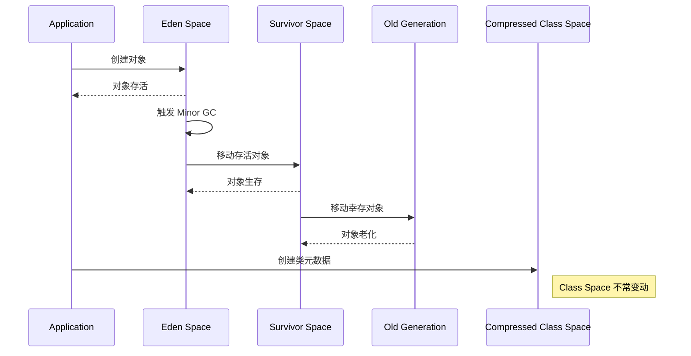

下面是关于 JVM 相关内存池的一些统计信息的解释，包括您提到的参数及其含义。我们将这些内存池的用途和统计指标进行说明。

### 参数解释

1. **Tenured Gen**:
   - **Used MB**: 252 MB，表示在老年代（Tenured Generation）中现在已使用的内存。
   - **Committed MB**: 1024 MB，指的是已分配给老年代的内存空间的总大小。老年代存储长期存活的对象。

2. **Eden Space**:
   - **Used MB**: 207 MB，表示在 Eden 空间中使用的内存。
   - **Committed MB**: 409 MB，表示已分配给 Eden 空间的总内存。Eden 空间是新生代（Young Generation）的一部分，主要用于存储新创建的对象。

3. **Metaspace**:
   - **Used MB**: 173 MB，表示已使用的 Metaspace 内存。
   - 用于存储类的元数据。JDK 8 之前使用的是 PermGen，JDK 8 以后被 Metaspace 取代，Metaspace 不再定量限制。

4. **Code Cache**:
   - **Used MB**: 107 MB，表示已使用的代码缓存内存（用于存储由 JIT 编译器生成的本地代码）。
   - **Max Available**: 240 MB，说明分配给代码缓存的最大内存。
   - 代码缓存对于性能优化非常重要，过期会影响应用的性能。

5. **Compressed Class Space**:
   - **Used MB**: 19 MB，指已使用的压缩类空间。
   - **Max Available**: 1024 MB，压缩类空间用来存储所有类的指针，只有在为类元数据启用压缩时会分配。

6. **Survivor Space**:
   - **Used MB**: 6 MB，表示在 Survivor 空间和已使用的内存。
   - Survivor 空间是新生代的一部分，通常分为两个区域（S0 和 S1），用于存储转移的存活对象。

### 数据拓展

以下是一些 JVM 常见内存池及其详细说明：

- **Eden Space**: 用于存储新创建的对象，JVM 在这里分配新的内存。当 Eden 空间满时，会触发一次 Minor Garbage Collection，分配存活的对象到 Survivor Space。

- **Survivor Space**: 用于存放经过 GC 的存活对象。新生代一般有两个 Survivor Space，通过 S0 和 S1 轮转，记录存活的对象，避免过多的 allocation 从 Eden 空间进行。

- **Tenured Gen**: 用于存放经过多次 GC 仍然存活的大对象。因为老年代的 GC 相对开销较大，所以应用会尽量避免频繁 GC。

- **Metaspace**: 存储类结构的元数据，包括方法区的内容。随着应用加载的类数量的增加，Metaspace 的占用会增加。

### 比较与 kubectl top pod

在使用 `kubectl top pod` 命令时返回的状态信息可能会与 AppDynamics (APPD) 统计信息不同，这主要是因为：

- **不同水准的视图**: `kubectl top` 给出了容器级别的资源消耗，而 APPD 提供更细粒度的 JVM 内存池的统计信息。
  
- **时间延迟**: APPD 的数据可能会根据采样频率显示延迟，可能会出现变更未及时反映的情况。

- **内存计算方式**: Kubernetes 的 `kubectl top` 可能集中报告整体的容器内存使用情况，而不仅仅是 JVM 的内存。

为了深入分析，可以使用 JMX（Java Management Extensions）监控 JVM，从而实时监控并获取更详细的内存池与使用情况。通过这些工具结合，您可以更全面地了解 Java 应用的实际状态与性能瓶颈。


当 Eden Space 的使用率达到 97%（如您所述的 Used MB 为 399MB，Committed 为 409MB），这可能会对 Java 应用程序的性能和稳定性带来几个重要影响：

### 1. **触发 Minor Garbage Collection**
- **影响**: Eden Space 是用于分配新对象的区域，当它被填满时，JVM 会触发一次 **Minor Garbage Collection**。这是为了识别和清理不再使用的对象，将存活的对象移动到 Survivor Space。如果 Eden 空间持续紧张，可能导致频繁的 GC，增加 CPU 使用率和延迟。
- **结果**: GC 会暂停应用程序的执行（Stop-the-World 事件），可能会导致响应时间延迟和用户体验下降。

### 2. **增加的内存管理开销**
- **影响**: 高度利用的 Eden Space 意味着 GC 时需要处理的对象数量较多，可能导致内存管理开销增加。CMS（Concurrent Mark-Sweep）或 G1（Garbage-First）等 GC 算法尽管优化了垃圾回收过程，但仍然会在高内存占用情况下引发较高的延迟。
- **结果**: 应用程序的吞吐量可能减少，并可能在高负载期间引发性能瓶颈。

### 3. **可能引发 OutOfMemoryError**
- **影响**: 如果应用程序继续在 Eden Space 中创建对象，而暂时没有足够的空间用于 GC 来释放内存，就可能会发生 **OutOfMemoryError**。虽然在新生代（如 Eden Space）上发生此错误的可能性较小，但在极端负载情况下是有可能的。
- **结果**: 应用程序可能崩溃或失去响应，导致服务不可用。

### 4. **长时间GC和停顿问题**
- **影响**: 如果频繁的 GC 因为内存压力而导致收集时间大幅增加，长时间的停顿会影响用户体验。
- **结果**: 用户在进行请求时可能会经历长时间的延迟或超时。

### 5. **增加内存分配失败的几率**
- **影响**: 当 Eden Space 快速填满并频繁进行 GC，可能会导致短期内无法分配新对象，特别在高并发场景中。
- **结果**: 如果分配内存失败，可能导致错误或异常的产生（例如，`java.lang.OutOfMemoryError`）。

### 解决策略

若应用程序的 Eden Space 使用率持续居高不下，可以考虑以下解决策略：

1. **调优 JVM 参数**:
   - 增加新生代（Young Generation）的大小，例如通过 `-Xmn` 参数设置新生代的大小。

2. **调整 GC 策略**:
   - 根据应用程序的特性选择更合适的垃圾回收算法，例如 G1 GC 等。

3. **分析内存泄漏**:
   - 使用工具（如 Java VisualVM、YourKit、或 JProfiler）分析内存使用情况，检查可能的内存泄漏。

4. **优化代码和对象使用模式**:
   - 减少短期对象的创建数量，例如使用对象池等方法，优化代码中对象的生命周期和作用域。

5. **监控和报警**:
   - 设定监控告警，当 Eden Space 使用率达到一定阈值时进行警报，以便及时采取措施。

通过保持 Eden Space 的健康状态，可以提高应用程序的整体性能和稳定性。
# HEAP
在 Java 虚拟机 (JVM) 中，`HEAP` 是一个重要的内存区域，用于存放 Java 对象和其关联的数据。理解 `HEAP` 的一些关键指标如 `Current Usage`, `Current Committed`, `Max Available`, 和 `Free` 有助于更好地监控和优化 Java 应用的内存使用。以下是这些概念的详细解释：

### 1. **Current Usage (当前使用)**

- **定义**: 当前使用指的是当前在堆内存中实际占用的内存大小，通常以 MB 或字节为单位表示。这是 JVM 在堆中分配了多少内存的一个实时指标。
- **含义**: 反映了应用程序对象实例的数量和占用的内存大小。当这个指标不断上升时，表明应用程序正在创建更多的对象。

### 2. **Current Committed (当前提交)**

- **定义**: 当前提交是指对 JVM 堆内存的实际分配量（Committed Memory），即 JVM 分配了一定量的内存，但并不代表这些内存都被当前使用。
- **含义**: 这个指标表明 JVM 分配给堆的总内存量。它不会小于 `Current Usage`，但可能大于或等于，因为 JVM 通常预留额外的内存以应对突发的内存需求。

### 3. **Max Available (最大可用)**

- **定义**: 最大可用是指 JVM 在启动时可用于堆内存的最大值，通常是根据 JVM 启动参数如 `-Xmx` 来设置的。
- **含义**: 这个值是 JVM 实例在其生命周期内可以使用的堆内存的上限。一旦堆内存的使用达到此上限，JVM 将无法再分配更多的内存，如果继续请求内存，则可能导致 `OutOfMemoryError`。

### 4. **Free (空闲)**

- **定义**: 空闲内存是指在堆内存中剩余未使用的内存量，通常计算方式为 `Current Committed` 减去 `Current Usage`。
- **含义**: 表示当前可用的堆内存空间，用于后续的对象分配。即使有空闲空间，如果内存管理不断导致 GC 开销高，也会影响应用程序的响应时间。

### 理解这些指标的相互关系

这些指标之间是互相关联的，并且反映了 Java 应用程序内存的动态管理情况：

- **举例**: 如果 `Current Usage` 一直上涨但 `Current Committed` 保持不变，表示 JVM 没有进行扩展，可能会很快达到 `Max Available`，从而面临 `OutOfMemoryError`。如果 `Free` 量较小，且应用需要更多内存用于创建对象，频繁的 GC 将会触发。

- **监控策略**: 理想情况下，应该监视这些指标以确保应用程序的内存使用保持在合理的范围内。例如，当 `Current Usage` 接近 `Max Available` 时，可能需要考虑增加堆大小或者优化对象使用。

### 综述

通过理解这些概念，您可以更好地监控和优化 Java 应用程序的内存使用。监控堆的使用情况可以帮助识别潜在问题，如内存泄漏、配置不当的堆大小或不适合的 GC 策略，从而改善应用的性能和稳定性。


# percent 
在 Kubernetes 中，Pod 的内存管理涉及两个关键参数：`initialRamPercentage` 和 `maxRamPercentage`。这些参数通常与自适应内存管理和节约资源策略相关，尤其在像 KEDA 这样的自动扩缩组件中。这些设置帮助 Pod 在启动时和运行过程中管理内存资源。让我们详细分析这两个参数在您的例子中的含义：

### 假设条件

- 您的 Deployment 设置的内存为 **2G**（2048 MB）。
- `initialRamPercentage = 75%`
- `maxRamPercentage = 75%`

### 参数解释

1. **initialRamPercentage**:
   - **定义**: 这是 Pod 启动时，基于容器所指定的资源限制（这里是 2G），计算出的初始内存资源分配比例。
   - **计算**: 
     - `Initial RAM = Deployment memory limit * initialRamPercentage`
     - 在本例中:
       - `Initial RAM = 2048 MB * 0.75 = 1536 MB`
   - **含义**: 当 Pod 启动时，它会请求 **1536 MB** 的内存自动分配。

2. **maxRamPercentage**:
   - **定义**: 这是 Pod 可以在运行时使用的内存最大限制的百分比。
   - **计算**: 
     - `Max RAM = Deployment memory limit * maxRamPercentage`
     - 在本例中:
       - `Max RAM = 2048 MB * 0.75 = 1536 MB`
   - **含义**: 在运行过程中，Pod 使用的内存上限为 **1536 MB**。这意味着即使 Pod 被允许使用 2G 的内存，但实际运行时使用的最大内存限制仍然是 **1536 MB**。

### 总结

- 当您的 Pod 启动时，它将根据 `initialRamPercentage` 自动分配 **1536 MB** 的初始内存。
- 在运行过程中，通过 `maxRamPercentage`，Pod 内存使用的上限也设置为 **1536 MB**，这可以有效防止 Pod 使用超出您设定的 2G 内存限制的 75% 的资源，从而保护节点资源和其他 Pod 的运行性能。
  
这种配置可以用于对资源的精细控制，降低因内存占用过高而导致的资源竞争和性能瓶颈。通过监控内存的实际使用情况，您可以基于 Pod 运行时的实际需求来优化初始和最大内存的设置。

# Eden
在 Java 的内存管理中，`Eden Space` 和 `Compressed Class Space` 是两种不同的内存区域，分别用于管理不同类型的对象。`Eden Space` 是 Young Generation 而 `Compressed Class Space` 则主要用于存储类的压缩，有助于节省内存。

### 优化和排查思路

如果遇到 `Eden Space` 的占用率较高，首先需要分析原因，并根据实际情况进行调整。以下是一些排查和优化的建议。

#### 排查步骤

1. **监控和分析内存使用情况**:
   - 使用工具如 VisualVM、Java Flight Recorder (JFR) 或其他 APM 工具来详细分析内存使用情况，检查对象创建和生命周期。
   - 查看 `Garbage Collection` (GC) 频率和时长，频繁的 GC 可能说明 `Eden Space` 占用高。

2. **分析堆转储**:
   - 生成堆转储文件，分析内存中存在的对象。可以使用工具如 Eclipse MAT (Memory Analyzer Tool) 来查看哪些对象占用了大量内存，并确认是否存在内存泄漏。
   - 重点关注高占用的类和对象，查看其创建频率。

3. **检查应用程序代码**:
   - 查找应用中的可优化对象创建逻辑，尤其是临时对象的生成，如字符串拼接、集合等。
   - 确保避免创建不必要的中间对象，尤其是在循环中。

#### 优化建议

1. **增大 Eden Space 的大小**:
   - 您可以通过 JVM 参数调整 `Eden Space` 的大小。例如，在启动应用时增加 `-Xms` 和 `-Xmx`，同时设置 `-XX:NewSize` 和 `-XX:MaxNewSize`。这将允许更大的年轻代空间，可能降低 GC 的频率。
   ```bash
   -Xms2g -Xmx2g -XX:NewSize=512m -XX:MaxNewSize=1g
   ```

2. **选择合适的垃圾收集器**:
   - 如果当前使用的 GC 策略不符合应用需求，考虑切换到合适的垃圾收集器。例如，使用 G1 GC 或 ZGC 等现代 GC，可以有效处理大量短时间存在的对象。

3. **优化对象的生命周期管理**:
   - 尝试使用对象池复用对象，尤其是那些消耗较高的对象类型，这样可以降低内存占用和 GC 的开销。
   - 适当使用 `WeakReference` 或 `SoftReference` 等Java参考类型，避免强引用导致的内存占用。

4. **定期进行垃圾回收**:
   - 设置合适的 `-XX:InitiatingHeapOccupancyPercent` 来触发 Full GC，在满阈值时触发。适当调整这一参数可以平衡性能和内存占用。

#### 小结

`Eden Space` 占用率高主要是由于对象的创建和存活周期，需要通过分析、优化代码和资源配置来解决。通过结合监控数据、分析工具和适当的 JVM 参数设置，可以有效提升 Java 应用的内存管理和性能表现。

为了更好地展示 Java 堆内存的各个区域之间的关系及内存对象的转移，包括 `Eden Space`、`Survivor Space`、`Old Generation` 和 `Compressed Class Space`，我为您创建了一个 Markdown 格式的序列图（Sequence Diagram）。这个图将有助于理解对象在内存中的迁移过程。

以下是生成的 Mermaid 序列图代码：



### 解释序列图中的各种操作：

1. **创建对象**: 应用程序在 `Eden Space` 中创建新对象。
2. **存活对象**: 当对象在 `Eden Space` 中存活后，依据 GC 的机制进行处理。
3. **Minor GC**: 在 `Eden Space` 溢出时，触发 Minor GC，将存活的对象移动到 `Survivor Space`。
4. **对象迁移**: `Survivor Space` 存活的对象可能会最后迁移到 `Old Generation`，标记为“老化”对象。
5. **创建类元数据**: Java 应用在运行时创建的类元数据存储在 `Compressed Class Space`。

### 小结

使用这种格式的序列图可以清晰地表达 Java 内存管理中对象的流动和不同内存区域之间的关系。如果您希望更系统地展示这些关系，也可以使用不同的图形格式如流程图。在展示复杂的内存结构时，序列图是一个合适且直观的选择。


根据您提供的内存使用情况，以下是对各个内存池的分析和建议优化的地方。

### 内存状态分析

1. **Compressed Class Space**
   - **使用率：** 19 MB / 1024 MB (约 1.1%)
   - **分析：** 使用率较低，目前没有问题。这是正常的，除非您的应用程序中类加载了大量类，但目前无须优化。

2. **Tenured Generation**
   - **使用率：** 252 MB / 1024 MB (约 24%)
   - **分析：** 使用率相对较低，但可以观察 Tenured 生存对象的具体情况。若频繁 GC 或内存增加，可能需考虑对象的老化机制。

3. **Eden Space**
   - **使用率：** 399 MB / 409 MB (约 97%)
   - **分析：** 使用率非常高，接近满载，说明年轻代的对象创建和存活周期较短，导致频繁的 GC。高使用率会增加内存回收的开销，并可能引发 Full GC。

4. **Code Cache**
   - **使用率：** 107 MB / 256 MB (约 41%)
   - **分析：** 代码缓存的使用率处于正常范围，暂时无需优化。

5. **Survivor Space**
   - **使用率：** 5 MB / 51 MB (约 9%)
   - **分析：** 存活空间使用率正常，但需要关注对象的转移情况。

### 优化建议

1. **增加 Eden Space 大小**:
   - 当前 `Eden Space` 使用率高达 97%，可以通过调整 JVM 参数（例如 `-XX:NewSize` 和 `-XX:MaxNewSize`）来增加 `Eden Space` 大小，以减少 GC 频率。
   - 示例：
     ```bash
     -XX:NewSize=512m -XX:MaxNewSize=1g
     ```

2. **减少应用中的对象创建**:
   - 通过代码审查和优化，识别和减少临时对象的创建，特别是在循环和频繁调用的方法中。
   - 对于字符串拼接，使用 `StringBuilder` 或 `StringBuffer` 进行优化。

3. **调整 GC 策略**:
   - 如果您还未使用最新的垃圾收集器（如 G1 GC 或 ZGC），建议切换到这些现代的 GC 策略，它们对年轻代的处理更为高效，可以减少长时间的 GC 停顿。
   - 示例：
     ```bash
     -XX:+UseG1GC
     ```

4. **监控对象的生存周期**:
   - 使用合适的监控工具来分析为什么 `Eden Space` 的使用率高，可以检查哪些对象频繁被创建和回收，识别潜在的内存泄漏或对象过度创建的情况。

5. **评估老年代对象的迁移**:
   - 观察 `Tenured Generation` 中的对象具体占用情况，高频繁 GC 可能暗示需要更好地管理对象的生命周期，比如增加对象池或防止不必要的创建。

### 小结

综合来看，`Eden Space` 的高使用率是当前内存池中最需要关注和优化的地方。通过增加内存大小、减少对象创建、调整 GC 策略以及监控对象的生存周期，可以显著提高 Java 应用的性能表现，同时减少 GC 的频次和开销。


