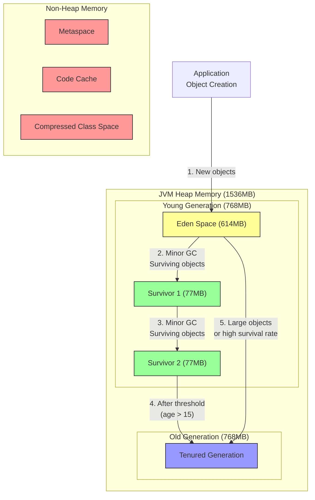
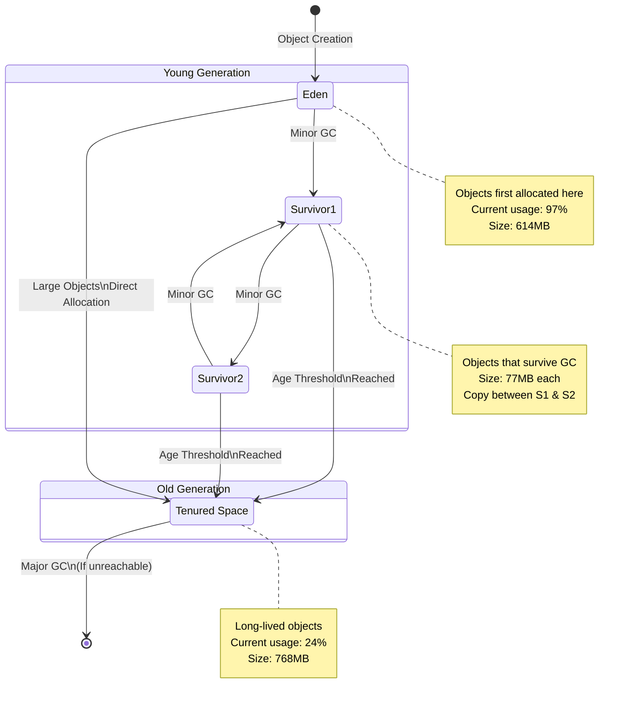
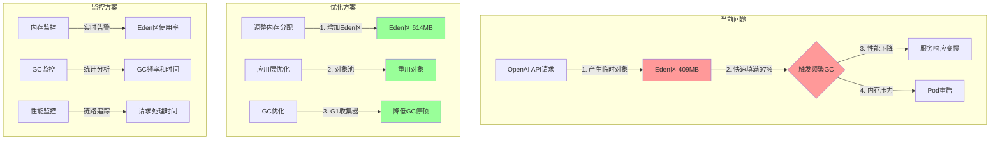

好的，根据您提供的图片和背景信息，我对您GKE Pod中Java应用的内存使用情况进行了详细分析，并提出了相应的优化建议。

**分析报告：GKE Pod Java应用内存使用情况分析与优化建议**

**背景信息回顾：**

* **应用环境:** GKE (Google Kubernetes Engine) Pod
* **应用类型:** OpenAI 应用 (网页端提问解答，Pott请求)
* **Pod内存分配:** 2GB
* **JVM 启动参数:** 占用率 75% (推测指最大堆内存占用率)
* **问题现象:** 服务流量增加或请求增多时，Pod会被重建或重启。

**内存池参数详解与数值分析:**

我们首先来详细解读图片中展示的各个内存池参数及其数值，并分析其潜在含义。

| 名称                 | Used MB | Committed MB | Max Available (MB) | Current Utilization % | 状态解读                                                                                                                                                                                             |
| -------------------- | ------- | ------------ | ------------------ | ----------------------- | ----------------------------------------------------------------------------------------------------------------------------------------------------------------------------------------------------- |
| Compressed Class Space | 19      | 21           | 1024               | 1%                      | **状态良好，占用极低:**  用于存储压缩后的类元数据，占用空间非常小，说明类加载和元数据存储方面压力不大。                                                                                                                               |
| Tenured Gen (老年代)   | 252     | 1024         | 1024               | 24%                     | **状态正常，占用较低:**  老年代用于存储生命周期较长的对象。 24% 的占用率属于较低水平，表明长期存活对象不多，或者老年代空间足够大。                                                                                                                             |
| Eden Space (新生代Eden区) | 399     | 409          | 409                | **97%**                  | **状态非常危险，占用极高:**  Eden区是新对象分配的主要区域。 **97% 的占用率极高，意味着Eden区几乎被填满。** 这通常是频繁发生 Minor GC (新生代垃圾回收) 的信号，甚至可能导致频繁的 Full GC (全局垃圾回收)，严重影响应用性能。                                                                |
| Code Cache (代码缓存)  | 107     | 108          | 240                | 44%                     | **状态正常，占用适中:**  代码缓存用于存储JIT (Just-In-Time) 编译器编译后的热点代码。 44% 的占用率属于正常范围，说明 JIT 编译效果良好，提升了应用性能。                                                                                                                               |
| Survivor Space (新生代Survivor区) | 5       | 51           | 51                 | 9%                      | **状态良好，占用极低:**  Survivor区用于存放 Minor GC 后存活下来的对象，等待晋升到老年代。 9% 的占用率说明 Survivor 区工作正常，对象在新生代能得到有效回收。                                                                                                                             |

**重点问题分析与诊断:**

**1. Eden Space 占用率过高 (97%) - 最核心的问题**

* **直接原因:**  您的应用在处理请求时，**短时间内创建了大量的临时对象，并且这些对象在Minor GC之前未能被有效回收。**  Eden 区空间有限，当新对象分配速度超过垃圾回收速度时，Eden 区就会迅速填满。
* **潜在原因:**
    * **请求处理逻辑中存在大量临时对象创建:**  OpenAI 应用可能涉及文本处理、模型计算等，这些操作可能产生大量的 String 对象、中间数据结构等。
    * **对象生命周期过长:**  某些本应是临时对象的对象，因为代码逻辑或引用关系，导致其生命周期延长，无法及时被 Minor GC 回收。
    * **Minor GC 频率不足或效率不高:**  虽然高 Eden 使用率通常会触发 Minor GC，但如果 Minor GC 本身频率不足，或者回收效率不高，也无法有效缓解 Eden 区压力。

**2. Pod 重建/重启现象 -  Eden Space 高占用率的直接后果**

* **内存压力触发 OOM (OutOfMemoryError):**  当 Eden 区持续高占用，并且 Minor GC 无法有效释放空间时，最终可能导致整个堆内存 (包括老年代) 耗尽，触发 JVM 的 OutOfMemoryError 错误。
* **Kubernetes 健康检查失败:**  Kubernetes 通常会配置健康检查 (Liveness Probe 和 Readiness Probe) 来监控 Pod 的运行状态。  如果应用出现 OOM 或长时间的 Full GC 导致应用无响应，健康检查可能会失败，从而触发 Pod 的重启或重建。
* **资源限制触发重启:**  虽然您Pod分配了 2GB 内存，但如果 JVM 实际使用的内存超过了这个限制 (可能包括堆外内存，例如 Metaspace、Code Cache 等)，Kubernetes 也可能因为资源超限而重启 Pod。

**优化建议:**

针对以上分析，我为您提供以下优化建议，建议您按照优先级逐步实施：

**第一优先级： 解决 Eden Space 高占用率问题 (根本性优化)**

1. **代码层面优化 - 减少临时对象创建和优化对象生命周期:**
    * **代码审查与性能分析:**  重点审查请求处理相关的代码 (Pott 请求的处理逻辑)，使用性能分析工具 (例如：JProfiler, YourKit, Java Flight Recorder 等)  **定位内存分配热点和对象生命周期较长的代码段。**
    * **优化字符串处理:**  OpenAI 应用文本处理较多，**String 对象是内存消耗大户。**  检查是否有大量不必要的 String 创建，尝试使用 `StringBuilder` 或 `StringBuffer` 减少 String 拼接时的临时对象。
    * **对象复用和池化:**  对于频繁创建和销毁的对象，考虑**对象池化**技术 (例如：连接池、线程池、自定义对象池)  来复用对象，减少对象创建和 GC 压力。
    * **优化数据结构和算法:**  选择更节省内存的数据结构 (例如：使用 `HashMap` 代替 `TreeMap` 如果不需要排序) ，优化算法降低时间复杂度，间接减少内存消耗。
    * **避免在循环中创建大量对象:**  循环内部创建的对象容易积累，需要特别关注。

2. **JVM 调优 -  调整新生代大小 (缓解 Eden Space 压力)**

   * **调整 `-Xmn` (设置新生代大小):**  适当增大新生代 (特别是 Eden 区) 的大小，可以**延缓 Eden 区被填满的时间，降低 Minor GC 的频率。**  例如，您可以尝试将 `-Xmn` 参数调整到 `512m` 或更大，具体数值需要根据您的应用情况测试确定。
   * **调整 `-XX:SurvivorRatio` (Eden 和 Survivor 区比例):**  调整 Eden 区和 Survivor 区的比例，例如 `-XX:SurvivorRatio=8` 表示 Eden : Survivor = 8 : 1。  合理配置 Survivor 区大小，有利于对象在新生代被充分回收。

**第二优先级： JVM 调优 -  垃圾回收器选择与调优 (提升 GC 效率)**

3. **选择合适的垃圾回收器:**
    * **G1 Garbage Collector (G1 GC):**  **强烈推荐使用 G1 GC**，它是现代 JVM 的默认垃圾回收器，专为大堆内存和低延迟应用设计，能够更好地平衡吞吐量和停顿时间。  可以通过 `-XX:+UseG1GC` 启用 G1 GC。
    * **CMS Garbage Collector (CMS GC):**  如果您的 JVM 版本较老 (Java 8 之前)，可以考虑使用 CMS GC，但 CMS GC 在高并发和内存压力下表现可能不如 G1 GC。  可以通过 `-XX:+UseConcMarkSweepGC` 启用 CMS GC。
    * **Parallel Scavenge + Parallel Old:**  适用于注重吞吐量的应用，但停顿时间可能较长。  可以通过 `-XX:+UseParallelGC` 启用。

4. **G1 GC 参数调优 (如果选择 G1 GC):**
    * **`-XX:MaxGCPauseMillis=<毫秒>` (设置最大 GC 停顿时间目标):**  G1 GC 会尽量控制 GC 停顿时间不超过这个目标值。  例如 `-XX:MaxGCPauseMillis=200` 表示期望最大停顿时间为 200 毫秒。  **注意，过低的停顿时间目标可能会牺牲吞吐量。**
    * **`-XX:InitiatingHeapOccupancyPercent=<百分比>` (设置触发并发 GC 的堆内存占用率阈值):**  当老年代堆内存占用率达到这个阈值时，G1 GC 会启动并发 GC。  可以根据应用特点调整该值，例如 `-XX:InitiatingHeapOccupancyPercent=45`。

**第三优先级：  Kubernetes 环境优化 (资源配置和监控)**

5. **调整 Pod 内存资源限制:**
    * **增加 Pod 内存请求和限制:**  如果您的应用确实需要更多内存，可以考虑**增加 Pod 的内存请求 (resources.requests.memory) 和限制 (resources.limits.memory)。**  例如，将内存限制提升到 3GB 或更高，但需要**评估 GKE 集群的资源容量和成本。**
    * **合理设置 JVM 最大堆内存 (Xmx):**  您提到启动参数设置了 75% 的占用率，这可能是指最大堆内存占用率。  **确保 JVM 的最大堆内存 (通过 `-Xmx` 参数设置)  在 Pod 内存限制之内，并且留出足够的空间给堆外内存 (例如 Metaspace, Code Cache)。**  通常建议 `-Xmx` 设置为 Pod 内存限制的 70%-80% 左右。

6. **优化 Kubernetes 健康检查:**
    * **调整 Liveness Probe 和 Readiness Probe:**  确保健康检查配置合理，能够**及时检测到应用的健康问题 (例如：内存溢出、长时间 Full GC 导致的无响应)。**  可以适当调整健康检查的超时时间和探测频率。

7. **考虑 Horizontal Pod Autoscaling (HPA):**
    * **配置 HPA 策略:**  如果您的应用流量波动较大，可以配置 HPA，**根据 CPU 或内存使用率自动扩缩 Pod 副本数，**  分散请求压力，降低单个 Pod 的内存压力。

**优化实施步骤建议:**

1. **监控与基准测试:** 在进行任何优化之前，**务必先建立完善的监控体系**，包括 JVM 内存使用情况 (使用您提供的 AppDynamics 或 Prometheus + Grafana 等监控工具)、GC 日志、Pod 资源使用情况等。  **进行基准测试，记录优化前的性能指标，作为后续优化的参考。**
2. **代码审查与性能分析 (第一优先级):**  优先进行代码层面的优化，这是解决问题的根本方法。  使用性能分析工具定位内存热点，优化代码逻辑，减少临时对象创建。
3. **JVM 调优 (第二优先级):**  在代码优化基础上，进行 JVM 参数调优。  **建议首先尝试 G1 GC 和调整新生代大小。**  每次调整参数后，都需要进行**充分的测试和性能评估**，观察优化效果。
4. **Kubernetes 环境优化 (第三优先级):**  如果代码和 JVM 层面优化后仍然存在问题，或者需要进一步提升性能，可以考虑 Kubernetes 环境的优化，例如调整资源限制、健康检查、HPA 等。

**重要提示:**

* **迭代优化和持续监控:**  内存优化是一个迭代的过程，需要不断地监控、分析、调整。  即使问题暂时解决，也需要持续监控应用的内存使用情况，**预防潜在的内存泄漏或其他性能问题。**
* **环境一致性:**  在测试和生产环境中，**保持 JVM 版本、启动参数、Kubernetes 环境配置等的一致性，** 避免因环境差异导致优化效果不一致。
* **逐步优化，避免过度调优:**  每次优化只调整一个或少量参数，方便分析和定位问题。  **避免一次性进行大量调整，导致问题难以排查。**

希望这份详细的分析和优化建议能够帮助您解决 GKE Pod Java 应用的内存问题。 如果您在优化过程中遇到任何问题，欢迎随时继续提问。


# claude

让我帮您分析这个Java应用的内存使用情况和可能的优化方案。

从图中显示的内存池(Memory Pool)数据来看:

1. **各内存区域分析**:

- Eden Space:
  - 使用了399MB/409MB
  - 使用率高达97%
  - 这是最危险的信号，因为Eden区是新生代对象最先分配的地方
  
- Tenured Gen (老年代):
  - 使用了252MB/1024MB
  - 使用率24%
  - 状态相对健康

- Code Cache:
  - 使用了107MB/108MB
  - 最大可用240MB
  - 使用率44%
  - JIT编译的代码存储区域

- Compressed Class Space:
  - 使用了19MB/21MB
  - 最大可用1024MB
  - 使用率1%
  - 状态正常

- Survivor Space:
  - 使用了5MB/51MB
  - 使用率9%
  - 状态正常

2. **问题分析**:

- Pod重启的主要原因很可能是Eden区空间接近饱和(97%)
- 当新的请求进来需要分配对象时，可能会触发频繁GC
- 频繁GC会导致性能下降，最终可能触发OOM导致Pod重启

3. **优化建议**:

1) **JVM参数调整**:
```bash
# 建议的JVM参数
-Xms1536m -Xmx1536m  # 堆内存初始和最大值设为相同
-XX:MetaspaceSize=256m -XX:MaxMetaspaceSize=256m
-XX:NewRatio=2  # 设置新生代和老年代的比例
-XX:SurvivorRatio=8  # Eden和Survivor的比例
-XX:+UseG1GC  # 使用G1垃圾收集器
-XX:MaxGCPauseMillis=100  # 控制GC停顿时间
```

2) **应用层优化**:
- 检查是否有内存泄漏
- 对于OpenAI的调用，建议使用对象池来复用对象
- 实现请求级别的超时控制
- 考虑使用异步处理大量请求

3) **资源配置调整**:
- 建议将Pod内存限制提高到2.5G或3G
- 调整JVM堆内存使用比例到65%而不是75%
- 设置合适的请求限流机制

4) **监控建议**:
- 添加GC监控
- 监控请求响应时间
- 设置内存使用报警阈值

4. **具体行动方案**:

1) 首先修改资源配置:
```yaml
resources:
  requests:
    memory: "2.5Gi"
  limits:
    memory: "3Gi"
```

2) 实现应用层面的优化:
```java
// 示例：添加请求限流
@Bean
public RateLimiter rateLimiter() {
    return RateLimiter.create(100.0); // 每秒100个请求
}

// 使用对象池
ObjectPool<OpenAIClient> pool = new GenericObjectPool<>(new OpenAIClientFactory());
```

3) 添加监控:
```java
// 添加内存使用监控
@Scheduled(fixedRate = 60000)
public void monitorMemory() {
    MemoryMXBean memoryBean = ManagementFactory.getMemoryMXBean();
    MemoryUsage heapUsage = memoryBean.getHeapMemoryUsage();
    if (heapUsage.getUsed() * 1.0 / heapUsage.getMax() > 0.85) {
        // 触发告警
    }
}
```

您想先从哪个方面着手优化？我可以帮您详细规划具体的实施步骤。​​​​​​​​​​​​​​​​


让我详细解释新生代和老年代的内存分配机制。

在JVM的堆内存分配中，假设我们设置了总堆内存是1536MB(-Xmx1536m)，让我分析具体的分配情况：

1. **新生代(Young Generation)和老年代(Old Generation)的比例**:

当我们设置 `-XX:NewRatio=2` 时，意味着：
- 老年代 : 新生代 = 2 : 1
- 具体计算：
  ```
  总堆内存 = 1536MB
  新生代 = 1536 ÷ (2 + 1) = 512MB
  老年代 = 1536 - 512 = 1024MB
  ```

2. **新生代的内部分配**:

当设置 `-XX:SurvivorRatio=8` 时，新生代内部的分配为：
- Eden : Survivor1 : Survivor2 = 8 : 1 : 1
- 具体计算：
  ```
  新生代总内存 = 512MB
  Eden区 = 512 × 8 ÷ (8 + 1 + 1) = 409.6MB
  每个Survivor区 = 512 × 1 ÷ (8 + 1 + 1) = 51.2MB
  ```

3. **参数详解**:

```bash
# JVM核心参数详解
-Xms1536m 
# 初始堆大小
# 建议与-Xmx设置相同值，避免堆大小动态调整

-Xmx1536m
# 最大堆大小
# 建议设置为容器内存限制的65-70%

-XX:MetaspaceSize=256m -XX:MaxMetaspaceSize=256m
# Metaspace初始和最大大小
# 用于存储类的元数据信息
# 建议设置相同值避免动态扩展

-XX:NewRatio=2
# 老年代:新生代 = 2:1
# 可根据应用特点调整：
# CPU密集型应用可以考虑降低新生代比例(-XX:NewRatio=3)
# 内存密集型应用可以考虑增加新生代比例(-XX:NewRatio=1)

-XX:SurvivorRatio=8
# Eden:Survivor = 8:1
# 决定了Eden区和Survivor区的大小比例

-XX:+UseG1GC
# 使用G1垃圾收集器
# 相比CMS更适合大内存场景
# 可以设置期望的停顿时间

-XX:MaxGCPauseMillis=100
# G1收集器的目标停顿时间
# 越小GC停顿越短，但可能会更频繁
```

4. **从您的监控图对应分析**:

```
Eden Space: 409MB (符合计算值约409.6MB)
Survivor Space: 51MB (符合计算值约51.2MB)
Tenured Gen (老年代): 1024MB (符合计算值)
```

5. **优化建议**:

1) **对于OpenAI应用的特点**:
- 如果发现大量对象在Eden区生存时间较短
- 可以考虑调整比例：
```bash
-XX:NewRatio=1  # 使新生代和老年代比例为1:1
# 这样Eden区会更大，可以容纳更多临时对象
```

2) **监控指标**:
```java
// 示例：监控各代内存使用
public void monitorGenerations() {
    for (MemoryPoolMXBean pool : ManagementFactory.getMemoryPoolMXBeans()) {
        if (pool.getName().contains("Eden")) {
            MemoryUsage usage = pool.getUsage();
            double utilization = usage.getUsed() * 1.0 / usage.getMax();
            // 如果Eden区使用率超过85%，考虑调整NewRatio
            if (utilization > 0.85) {
                logger.warn("Eden space utilization high: {}%", utilization * 100);
            }
        }
    }
}
```

3) **动态调整建议**:
- 观察GC日志中Minor GC的频率
- 如果Minor GC过于频繁，可以考虑增加Eden区大小
- 如果对象经常在Survivor区之间复制，可以考虑调整晋升阈值：
```bash
-XX:MaxTenuringThreshold=15  # 对象在新生代存活多少次GC后晋升到老年代
```

您想了解更多哪些方面的详细信息？比如GC的具体工作机制，或者如何监控这些参数的实时变化？​​​​​​​​​​​​​​​​

 您说得对。从监控图来看，Eden Space使用率高达97%确实存在问题，这可能是导致频繁GC和Pod重启的主要原因。让我们详细分析当前状况并提供更合适的配置：

1. **当前状态分析**:
```
Eden Space: 399MB/409MB (97% 使用率) - 严重偏高
Tenured Gen: 252MB/1024MB (24% 使用率) - 使用率较低
总体来看：老年代空间有大量剩余，而新生代几乎要溢出
```

2. **优化方案**:

基于您的应用特点（OpenAI API调用服务），建议以下配置：

```bash
# 调整为新生代:老年代 = 1:1
-XX:NewRatio=1

# 假设总堆内存保持1536MB
# 新调整后的分配：
# 新生代 = 1536 ÷ 2 = 768MB
# 老年代 = 768MB

# 完整的推荐JVM参数
-Xms1536m 
-Xmx1536m 
-XX:NewRatio=1
-XX:SurvivorRatio=8
-XX:+UseG1GC
-XX:InitiatingHeapOccupancyPercent=45
-XX:MaxGCPauseMillis=100
```

3. **为什么这样调整更合适**:

- OpenAI API调用服务特点：
  - 大量短期对象（请求/响应对象）
  - 较少长期存活对象
  - 需要更大的Eden区来容纳并发请求产生的临时对象

4. **调整后的预期内存分布**:
```
新生代总空间：768MB
- Eden Space: 约614MB (768 × 8/10)
- 每个Survivor区: 约77MB (768 × 1/10)

老年代：768MB
```

5. **监控代码示例**:
```java
@Component
public class MemoryMonitor {
    private final Logger logger = LoggerFactory.getLogger(MemoryMonitor.class);
    
    @Scheduled(fixedRate = 30000)  // 每30秒检查一次
    public void checkMemoryUsage() {
        for (MemoryPoolMXBean pool : ManagementFactory.getMemoryPoolMXBeans()) {
            MemoryUsage usage = pool.getUsage();
            double utilization = usage.getUsed() * 1.0 / usage.getMax();
            
            logger.info("Memory Pool: {} - Used: {}MB, Max: {}MB, Utilization: {:.2f}%",
                pool.getName(),
                usage.getUsed() / (1024 * 1024),
                usage.getMax() / (1024 * 1024),
                utilization * 100);
                
            // 设置告警阈值
            if (pool.getName().contains("Eden") && utilization > 0.85) {
                logger.warn("Eden Space utilization critical: {}%", utilization * 100);
                // 触发告警通知
            }
        }
    }
}
```

6. **部署配置建议**:
```yaml
apiVersion: apps/v1
kind: Deployment
metadata:
  name: openai-service
spec:
  template:
    spec:
      containers:
      - name: openai-service
        resources:
          requests:
            memory: "2Gi"
          limits:
            memory: "2.5Gi"
        env:
        - name: JAVA_OPTS
          value: >-
            -Xms1536m 
            -Xmx1536m 
            -XX:NewRatio=1 
            -XX:SurvivorRatio=8 
            -XX:+UseG1GC 
            -XX:InitiatingHeapOccupancyPercent=45
            -XX:MaxGCPauseMillis=100
```

7. **观察指标**:
部署新配置后，需要重点关注：
- Eden区使用率是否降到85%以下
- Minor GC频率是否降低
- 服务响应时间是否改善
- Pod重启情况是否改善

8. **进一步优化建议**:
如果调整后还发现内存压力，可以考虑：
1) 实现请求缓存机制
2) 添加请求限流
3) 优化对象创建和销毁
```java
// 示例：添加请求限流
@Bean
public RateLimiter rateLimiter() {
    return RateLimiter.create(50.0); // 每秒限制50个请求
}

// 示例：使用对象池优化
public class OpenAIClientPool {
    private final GenericObjectPool<OpenAIClient> pool;
    
    public OpenAIClientPool() {
        GenericObjectPoolConfig config = new GenericObjectPoolConfig();
        config.setMaxTotal(20);
        config.setMaxIdle(5);
        this.pool = new GenericObjectPool<>(new OpenAIClientFactory(), config);
    }
}
```

您想先实施哪些调整？我们可以逐步实施并观察效果。​​​​​​​​​​​​​​​​


我可以帮您创建一个可视化的图表来展示JVM内存的分配和调度关系。​​​​​​​​​​​​​​​​



让我再创建一个展示对象生命周期的流程图：​​​​​​​​​​​​​​​​

这两个图表展示了：

1. **内存分配结构**：
- 展示了整个堆内存的分层结构
- 显示了各个区域的大小和比例
- 非堆内存区域的关系

2. **对象生命周期**：
- 对象的创建和分配过程
- GC触发时的对象流转
- 各个阶段的大小和使用率

3. **关键流程说明**：
- 新对象首先在Eden区分配
- Minor GC后存活对象移动到Survivor区
- 对象在Survivor区之间复制
- 达到年龄阈值后晋升到老年代
- 大对象直接分配到老年代

我还可以创建一个交互式的React组件来动态展示内存使用情况：​​​​​​​​​​​​​​​​

这些可视化工具展示了：
1. 内存的分配关系
2. 对象的生命周期流转
3. 各内存区域的使用情况
4. 实时的内存使用度量

这样可以帮助您：
- 更直观地理解内存分配
- 识别潜在的内存问题
- 监控内存使用趋势
- 优化内存配置

``` 
import React, { useState, useEffect } from 'react';
import { Card, CardHeader, CardTitle, CardContent } from '@/components/ui/card';
import { BarChart, Bar, XAxis, YAxis, CartesianGrid, Tooltip, Legend } from 'recharts';

const MemoryDashboard = () => {
  const [data] = useState([
    {
      name: 'Eden Space',
      total: 614,
      used: 595,
      utilization: 97
    },
    {
      name: 'Survivor Space',
      total: 77,
      used: 5,
      utilization: 6
    },
    {
      name: 'Old Gen',
      total: 768,
      used: 184,
      utilization: 24
    }
  ]);

  return (
    <Card className="w-full p-6">
      <CardHeader>
        <CardTitle>JVM Memory Usage Dashboard</CardTitle>
      </CardHeader>
      <CardContent>
        <div className="w-full h-64">
          <BarChart data={data} margin={{ top: 20, right: 30, left: 20, bottom: 5 }}>
            <CartesianGrid strokeDasharray="3 3" />
            <XAxis dataKey="name" />
            <YAxis yAxisId="left" orientation="left" label={{ value: 'Memory (MB)', angle: -90, position: 'insideLeft' }}/>
            <YAxis yAxisId="right" orientation="right" label={{ value: 'Utilization %', angle: 90, position: 'insideRight' }}/>
            <Tooltip />
            <Legend />
            <Bar yAxisId="left" dataKey="total" fill="#8884d8" name="Total (MB)" />
            <Bar yAxisId="left" dataKey="used" fill="#82ca9d" name="Used (MB)" />
            <Bar yAxisId="right" dataKey="utilization" fill="#ffc658" name="Utilization %" />
          </BarChart>
        </div>
      </CardContent>
    </Card>
  );
};
``` 
export default MemoryDashboard;

您想了解这些图表中的哪个部分的更多细节？或者需要我调整某些可视化的展示方式？​​​​​​​​​​​​​​​​


## 根因

· 应用处理请求时可能生成大量短生命周期对象（如JSON解析、临时字符串、OpenAI响应缓存等）。

· Eden区容量过小（仅409MB），无法应对突发流量。


让我基于根因做一个详细的分析和解决方案。​​​​​​​​​​​​​​​​


基于根因分析，让我们制定完整的解决方案：

1. **内存配置优化**：
```bash
# 1. 调整堆内存配置
-Xms2048m 
-Xmx2048m 
-XX:NewRatio=1      # 新生代:老年代 = 1:1
-XX:SurvivorRatio=8 # Eden:Survivor = 8:1

# 这样Eden区大小将增加到：
# 2048 / 2 * 8/10 = 819MB (之前是409MB)
```

2. **应用层对象优化**：
```java
@Configuration
public class OpenAIConfig {
    
    @Bean
    public ObjectPool<StringBuilder> stringBuilderPool() {
        return new GenericObjectPool<>(new BasePooledObjectFactory<>() {
            @Override
            public StringBuilder create() {
                return new StringBuilder(1024);
            }
            
            @Override
            public void resetObject(PooledObject<StringBuilder> p) {
                p.getObject().setLength(0);
            }
        });
    }
    
    @Bean
    public ObjectPool<JsonNode> jsonNodePool() {
        return new GenericObjectPool<>(new BasePooledObjectFactory<>() {
            @Override
            public JsonNode create() {
                return JsonNodeFactory.instance.objectNode();
            }
        });
    }
}

// 使用对象池的服务层示例
@Service
public class OpenAIService {
    private final ObjectPool<StringBuilder> stringBuilderPool;
    private final ObjectPool<JsonNode> jsonNodePool;
    
    public String processRequest(String prompt) {
        StringBuilder sb = null;
        try {
            sb = stringBuilderPool.borrowObject();
            // 使用StringBuilder处理请求
            return sb.append(prompt).toString();
        } catch (Exception e) {
            log.error("Error processing request", e);
            throw new RuntimeException(e);
        } finally {
            if (sb != null) {
                stringBuilderPool.returnObject(sb);
            }
        }
    }
}
```

3. **GC优化配置**：
```bash
# GC优化参数
-XX:+UseG1GC
-XX:MaxGCPauseMillis=100
-XX:InitiatingHeapOccupancyPercent=45
-XX:G1HeapRegionSize=4m
-XX:G1NewSizePercent=50
-XX:G1MaxNewSizePercent=60
```

4. **监控实现**：
```java
@Component
@Slf4j
public class MemoryMonitor {
    
    @Scheduled(fixedRate = 5000)  // 每5秒检查一次
    public void monitorEdenSpace() {
        MemoryPoolMXBean edenPool = getEdenPool();
        MemoryUsage usage = edenPool.getUsage();
        
        double utilization = (double) usage.getUsed() / usage.getMax();
        
        // 记录详细指标
        log.info("Eden Space - Used: {}MB, Max: {}MB, Utilization: {:.2f}%",
            usage.getUsed() >> 20,
            usage.getMax() >> 20,
            utilization * 100);
            
        // 设置告警阈值
        if (utilization > 0.85) {
            alertHighMemoryUsage(usage);
        }
    }
    
    private void alertHighMemoryUsage(MemoryUsage usage) {
        // 告警逻辑
        String alert = String.format(
            "High memory usage in Eden Space: %dMB/%dMB",
            usage.getUsed() >> 20,
            usage.getMax() >> 20
        );
        // 发送告警
        notificationService.sendAlert(alert);
    }
}
```

5. **Kubernetes配置优化**：
```yaml
apiVersion: apps/v1
kind: Deployment
metadata:
  name: openai-service
spec:
  template:
    spec:
      containers:
      - name: openai-service
        resources:
          requests:
            memory: "2.5Gi"
            cpu: "1"
          limits:
            memory: "3Gi"
            cpu: "2"
        env:
        - name: JAVA_OPTS
          value: >-
            -Xms2048m 
            -Xmx2048m 
            -XX:NewRatio=1 
            -XX:+UseG1GC 
            -XX:MaxGCPauseMillis=100
            -XX:InitiatingHeapOccupancyPercent=45
            -XX:G1NewSizePercent=50
        # 添加健康检查
        livenessProbe:
          httpGet:
            path: /actuator/health/liveness
            port: 8080
          initialDelaySeconds: 60
          periodSeconds: 10
        readinessProbe:
          httpGet:
            path: /actuator/health/readiness
            port: 8080
          initialDelaySeconds: 30
          periodSeconds: 10
```

6. **性能监控指标**：
```java
@Configuration
public class MetricsConfig {
    @Bean
    public MeterRegistry meterRegistry() {
        return new SimpleMeterRegistry();
    }
    
    @Bean
    public Timer requestTimer(MeterRegistry registry) {
        return Timer.builder("openai.request.duration")
                   .description("OpenAI API request duration")
                   .register(registry);
    }
}
```

这些优化措施应该能够：
1. 提供足够的Eden区空间处理突发请求
2. 减少对象创建和GC压力
3. 提供及时的监控和告警
4. 确保服务的稳定性

您想先从哪个方面开始实施这些优化措施？我们可以逐步实施并观察效果。​​​​​​​​​​​​​​​​
