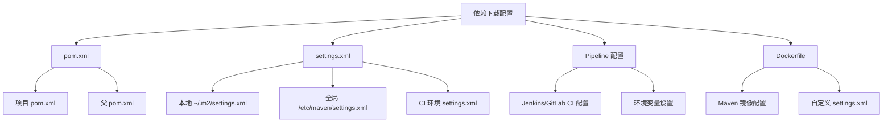

属于 **Java 构建环境差异导致的依赖缺失**。我们可以系统化地排查。以下是完整的 Debug 思路和操作路径。

---

## **1️⃣ 问题分析**

错误信息：

```
package com.github.tomakehurst.wiremock.core does not exist
```

说明构建时找不到 wiremock 的依赖包。

但用户提到：

- ✅ 本地构建正常；
- ❌ CI/CD Pipeline（Java 部署阶段）失败；
- ⏳ 之前可用，现在突然失败。

→ **高概率原因：构建环境差异或依赖缓存失效。**

---

## **2️⃣ 核心排查路径**

### **步骤 1：确认依赖声明是否存在且版本固定**

打开 pom.xml 或 build.gradle，确认 wiremock 是否存在固定版本。

#### **Maven 示例：**

```
<dependency>
    <groupId>com.github.tomakehurst</groupId>
    <artifactId>wiremock-jre8</artifactId>
    <version>2.35.0</version>
    <scope>test</scope>
</dependency>
```

> ⚠️ 如果没有固定版本，可能因为仓库更新或默认版本被移除，导致 CI 拉取失败。

---

### **步骤 2：检查构建环境的 Maven/Gradle 仓库**

在 CI 环境（例如 Docker、Jenkins、GitLab Runner）执行：

```
mvn dependency:tree | grep wiremock
# 或者 Gradle:
./gradlew dependencies | grep wiremock
```

> 观察是否能解析出 com.github.tomakehurst:wiremock 依赖。

- 若显示 “not found” 或 “unresolved dependency”，说明：
    - CI 环境无法访问中央仓库（例如 repo.maven.apache.org 被限制）
    - 或本地 .m2/repository 缓存存在但 CI 环境是空的

---

### **步骤 3：比较本地与 CI 环境的 JDK/Maven 版本**

在两边分别执行：

```
java -version
mvn -version
```

> 确认是否出现版本不一致（如本地 JDK 17，而 CI 是 JDK 11）。

wiremock 新版对 Java 版本有依赖，比如 wiremock-standalone 3.x 需要 Java 17。

---

### **步骤 4：检查 Dockerfile 中的构建基础镜像**

例如：

```
FROM openjdk:11-jdk-slim
```

或

```
FROM maven:3.9.2-eclipse-temurin-17
```

> 若基础镜像更新（如镜像自动拉取最新 tag），可能导致 Maven 仓库或缓存路径变化。

解决方法：固定镜像版本，例如：

```
FROM maven:3.9.2-eclipse-temurin-17
```

不要使用 latest 或浮动 tag。

---

### **步骤 5：查看 CI/CD 的缓存机制**

如果使用 GitLab CI、Jenkins、或 Cloud Build：

- 检查 .m2/repository 缓存是否被清空或损坏；
- 如果使用 Gradle，看是否 .gradle/caches 被清理。

可以通过：

```
ls -l ~/.m2/repository/com/github/tomakehurst/wiremock*
```

---

### **步骤 6：强制重新下载依赖**

可在 Pipeline 测试阶段加上：

```
mvn dependency:purge-local-repository -DmanualInclude="com.github.tomakehurst" -DreResolve=true
```

或者 Gradle：

```
./gradlew build --refresh-dependencies
```

---

### **步骤 7：尝试在 CI 环境进入容器手动构建**

进入 CI 构建容器：

```
docker run -it <your_build_image> /bin/bash
```

然后执行：

```
mvn clean test -X
```

查看详细日志，确认具体错误位置。

---

## **3️⃣ 可能原因总结与修复方向**

| **类型**            | **原因**                      | **解决方案**                |
| ------------------- | ----------------------------- | --------------------------- |
| 依赖未锁定          | Wiremock 版本在仓库中下线     | 在 pom.xml 固定版本         |
| 构建环境差异        | CI 使用了不同 JDK/Maven 版本  | 统一 JDK 与 Maven 版本      |
| Docker 基础镜像变化 | FROM openjdk:latest 更新      | 固定镜像版本                |
| 网络访问问题        | CI 无法访问 Maven Central     | 添加代理或私有镜像仓库      |
| 缓存问题            | .m2/repository 缓存损坏       | 清理并重新下载依赖          |
| Scope 错误          | 依赖标记为 test，但用于运行时 | 改为 compile 或创建单独模块 |

---

## **4️⃣ 推荐调试流程（Mermaid）**

```
graph TD
    A[构建失败: wiremock 不存在] --> B[检查 pom.xml 依赖版本]
    B --> C{依赖声明存在吗?}
    C -- 否 --> D[添加 wiremock 依赖]
    C -- 是 --> E[比较本地与 CI 环境 JDK/Maven 版本]
    E --> F{版本一致?}
    F -- 否 --> G[统一版本并重试]
    F -- 是 --> H[进入 CI 环境手动 mvn dependency:tree]
    H --> I{wiremock 能解析吗?}
    I -- 否 --> J[检查网络访问与仓库配置]
    I -- 是 --> K[重新清理缓存构建]
```

---

## **5️⃣ 注意事项**

- CI/CD 环境建议 **固定构建依赖版本与镜像**；
- 若使用私有 Maven 仓库（Nexus/Artifactory），需确保同步正常；
- 建议启用 mvn dependency:go-offline 缓存依赖，减少网络不确定性。

---

是否可以请你提供以下信息？我可以帮你更精准定位问题：

1. 你的构建工具（Maven 还是 Gradle）；
2. CI 环境或 Dockerfile 的基础镜像；
3. Pipeline 报错的完整日志（包含前后几行）。

提供后我可以帮你直接 pinpoint 哪一步出问题。


# claude 
# Java CI Pipeline 依赖问题排查指南

## 问题分析

`com.github.tomakehurst.wiremock.client` 是 WireMock 库的核心包，**主要用于 HTTP API 的模拟测试（Mock Testing）**。该包提供了创建和配置 Mock HTTP 服务器的客户端 API，常用于：

- 单元测试和集成测试中模拟外部 HTTP 服务
- 测试 REST API 调用而无需真实后端服务
- 创建可控的测试环境和数据

典型使用场景：

```java
import com.github.tomakehurst.wiremock.client.WireMock;

// 配置 Mock 响应
WireMock.stubFor(WireMock.get("/api/user")
    .willReturn(WireMock.aResponse()
        .withStatus(200)
        .withBody("{\"name\":\"test\"}")));
```

## 依赖下载配置位置

### Maven 项目依赖配置层级



### 1. **pom.xml - 项目依赖定义**

```xml
<!-- 依赖声明位置 -->
<dependencies>
    <dependency>
        <groupId>com.github.tomakehurst</groupId>
        <artifactId>wiremock-jre8</artifactId>
        <version>2.35.0</version>
        <scope>test</scope>
    </dependency>
</dependencies>

<!-- 仓库配置（可选）-->
<repositories>
    <repository>
        <id>nexus-releases</id>
        <url>https://your-nexus.com/repository/maven-releases/</url>
    </repository>
</repositories>
```

### 2. **settings.xml - Maven 仓库配置**

```xml
<!-- 位置：~/.m2/settings.xml 或 CI 环境指定路径 -->
<settings>
    <!-- 镜像配置：所有请求重定向到 Nexus -->
    <mirrors>
        <mirror>
            <id>nexus</id>
            <mirrorOf>*</mirrorOf>
            <url>https://your-nexus.com/repository/maven-public/</url>
        </mirror>
    </mirrors>
    
    <!-- 认证配置 -->
    <servers>
        <server>
            <id>nexus</id>
            <username>${env.NEXUS_USER}</username>
            <password>${env.NEXUS_PASSWORD}</password>
        </server>
    </servers>
    
    <!-- 仓库配置 -->
    <profiles>
        <profile>
            <id>nexus-profile</id>
            <repositories>
                <repository>
                    <id>nexus-releases</id>
                    <url>https://your-nexus.com/repository/maven-releases/</url>
                    <releases><enabled>true</enabled></releases>
                    <snapshots><enabled>false</enabled></snapshots>
                </repository>
            </repositories>
        </profile>
    </profiles>
    
    <activeProfiles>
        <activeProfile>nexus-profile</activeProfile>
    </activeProfiles>
</settings>
```

### 3. **Pipeline 配置示例**

```groovy
// Jenkinsfile 示例
pipeline {
    agent any
    
    environment {
        MAVEN_OPTS = '-Dmaven.repo.local=.m2/repository'
        NEXUS_USER = credentials('nexus-user')
        NEXUS_PASSWORD = credentials('nexus-password')
    }
    
    stages {
        stage('Build') {
            steps {
                sh '''
                    mvn clean package \
                        -s /path/to/settings.xml \
                        -DskipTests=false \
                        -X  # Debug 模式
                '''
            }
        }
    }
}
```

```yaml
# GitLab CI 示例
build:
  image: maven:3.8-openjdk-11
  variables:
    MAVEN_OPTS: "-Dmaven.repo.local=$CI_PROJECT_DIR/.m2/repository"
  before_script:
    - cp ci/settings.xml ~/.m2/settings.xml
  script:
    - mvn clean package -X
  cache:
    paths:
      - .m2/repository/
```

## 排查流程

### Step 1: 验证依赖配置

```bash
# 1. 检查 pom.xml 中的依赖声明
grep -A 5 "wiremock" pom.xml

# 2. 查看完整依赖树
mvn dependency:tree | grep wiremock

# 3. 检查依赖有效性
mvn dependency:resolve -Dclassifier=sources
```

### Step 2: 对比环境差异

```bash
# 本地环境信息
mvn -v
java -version
echo $MAVEN_OPTS
cat ~/.m2/settings.xml

# CI 环境信息（在 Pipeline 中执行）
mvn -v
java -version
env | grep -i maven
cat $MAVEN_HOME/conf/settings.xml
```

**对比检查点：**

|配置项|本地|CI 环境|差异影响|
|---|---|---|---|
|Maven 版本|3.8.x|?|依赖解析算法|
|JDK 版本|11|?|类兼容性|
|settings.xml|存在|?|仓库配置|
|网络访问|直连|代理/限制|依赖下载|
|本地仓库|~/.m2|?|缓存位置|

### Step 3: Debug 依赖下载过程

```bash
# 1. 清除本地缓存后重新下载（Debug 模式）
mvn clean package -X -U 2>&1 | tee build.log

# 2. 分析日志关键信息
grep -i "wiremock" build.log
grep -i "downloading" build.log | grep wiremock
grep -i "error\|failed" build.log

# 3. 检查 Nexus 仓库是否包含该依赖
curl -u user:pass \
  "https://your-nexus.com/service/rest/v1/search?name=wiremock&repository=maven-public"
```

### Step 4: Dockerfile 层检查

```dockerfile
# 可能的 Dockerfile 构建问题
FROM maven:3.8-openjdk-11 AS builder

# 检查点 1: Maven settings 配置
COPY settings.xml /root/.m2/settings.xml

# 检查点 2: 依赖缓存层
COPY pom.xml .
RUN mvn dependency:go-offline -B

# 检查点 3: 源码编译
COPY src ./src
RUN mvn clean package -DskipTests

# Debug 方式：保留构建信息
RUN mvn dependency:tree > /tmp/dependencies.txt
```

**验证 Dockerfile：**

```bash
# 1. 构建时查看详细输出
docker build --no-cache --progress=plain -t test-build .

# 2. 进入构建阶段调试
docker build --target builder -t debug-builder .
docker run -it debug-builder sh
# 容器内执行：
mvn dependency:tree | grep wiremock
ls -la /root/.m2/repository/com/github/tomakehurst/
```

## 常见问题原因及解决方案

### 原因 1: Nexus 仓库缺少依赖

```bash
# 诊断
curl -I "https://your-nexus.com/repository/maven-public/com/github/tomakehurst/wiremock-jre8/2.35.0/wiremock-jre8-2.35.0.jar"

# 解决方案 1: 手动上传到 Nexus
mvn deploy:deploy-file \
  -DgroupId=com.github.tomakehurst \
  -DartifactId=wiremock-jre8 \
  -Dversion=2.35.0 \
  -Dpackaging=jar \
  -Dfile=wiremock-jre8-2.35.0.jar \
  -DrepositoryId=nexus \
  -Durl=https://your-nexus.com/repository/maven-releases/

# 解决方案 2: 配置 Nexus 代理 Maven Central
# Nexus UI: Repositories -> Create proxy -> 添加 https://repo1.maven.org/maven2/
```

### 原因 2: settings.xml 未正确加载

```bash
# 诊断：查看 Maven 实际使用的配置
mvn help:effective-settings

# 解决方案：Pipeline 中显式指定
mvn clean package -s /path/to/settings.xml
```

### 原因 3: 依赖 scope 配置错误

```xml
<!-- 错误配置：CI 可能跳过 test scope -->
<dependency>
    <groupId>com.github.tomakehurst</groupId>
    <artifactId>wiremock-jre8</artifactId>
    <scope>test</scope>  <!-- 如果代码在 src/main 中使用则错误 -->
</dependency>

<!-- 正确配置 -->
<dependency>
    <groupId>com.github.tomakehurst</groupId>
    <artifactId>wiremock-jre8</artifactId>
    <scope>compile</scope>  <!-- 或移除 scope -->
</dependency>
```

### 原因 4: 网络/代理问题

```bash
# 诊断
mvn clean package -X 2>&1 | grep -i "connection\|timeout\|refused"

# 解决方案：配置代理
export MAVEN_OPTS="-Dhttps.proxyHost=proxy.company.com -Dhttps.proxyPort=8080"

# 或在 settings.xml 中配置
<proxies>
    <proxy>
        <active>true</active>
        <protocol>https</protocol>
        <host>proxy.company.com</host>
        <port>8080</port>
    </proxy>
</proxies>
```

### 原因 5: Parent POM 依赖管理冲突

```bash
# 诊断：查看实际使用的版本
mvn dependency:tree -Dverbose | grep wiremock

# 可能看到版本冲突：
# [INFO] +- com.github.tomakehurst:wiremock-jre8:jar:2.35.0:compile
# [INFO] |  \- (com.github.tomakehurst:wiremock-jre8:jar:2.27.0:compile - omitted for conflict)

# 解决方案：在 pom.xml 中显式声明版本
<dependencyManagement>
    <dependencies>
        <dependency>
            <groupId>com.github.tomakehurst</groupId>
            <artifactId>wiremock-jre8</artifactId>
            <version>2.35.0</version>
        </dependency>
    </dependencies>
</dependencyManagement>
```

## 完整排查 Checklist

```markdown
### 环境对比
- [ ] Maven 版本一致
- [ ] JDK 版本一致
- [ ] settings.xml 配置存在且正确
- [ ] 网络连接正常

### 依赖配置
- [ ] pom.xml 中声明了 wiremock 依赖
- [ ] 依赖 scope 配置正确
- [ ] 版本号明确且存在
- [ ] 无版本冲突

### 仓库配置
- [ ] Nexus 仓库可访问
- [ ] 认证信息正确
- [ ] Nexus 中存在该依赖
- [ ] 代理配置正确

### CI 环境
- [ ] settings.xml 正确加载
- [ ] 环境变量配置正确
- [ ] 缓存策略合理
- [ ] Dockerfile 配置正确

### 调试验证
- [ ] mvn -X 查看详细日志
- [ ] dependency:tree 查看依赖树
- [ ] effective-settings 查看实际配置
- [ ] 手动下载依赖验证网络
```

## 快速验证脚本

```bash
#!/bin/bash
# ci-debug.sh - CI 环境依赖问题快速诊断

echo "=== Maven 环境信息 ==="
mvn -v

echo -e "\n=== Settings 配置 ==="
mvn help:effective-settings | grep -A 20 "mirrors\|repositories"

echo -e "\n=== WireMock 依赖检查 ==="
mvn dependency:tree | grep -i wiremock || echo "未找到 wiremock 依赖"

echo -e "\n=== 尝试下载 WireMock ==="
mvn dependency:get \
  -Dartifact=com.github.tomakehurst:wiremock-jre8:2.35.0 \
  -Dtransitive=false

echo -e "\n=== Nexus 仓库连通性 ==="
curl -I "https://your-nexus.com/repository/maven-public/" || echo "Nexus 不可达"

echo -e "\n=== 本地仓库检查 ==="
ls -la ~/.m2/repository/com/github/tomakehurst/ 2>/dev/null || echo "本地仓库无缓存"
```

## 注意事项

1. **优先检查 CI 环境与本地的差异**，特别是 Maven/JDK 版本和 settings.xml
2. **使用 `-X` 参数获取详细日志**，关注 "Downloading" 和 "Failed" 关键字
3. **验证 Nexus 仓库完整性**，确保代理了 Maven Central 或手动上传了依赖
4. **检查依赖 scope**，确保与代码使用位置匹配
5. **考虑父 POM 的影响**，使用 `dependency:tree` 查看实际版本
6. **网络问题排查**：代理配置、防火墙规则、DNS 解析
7. **Dockerfile 多阶段构建**：确保 settings.xml 在正确阶段可用