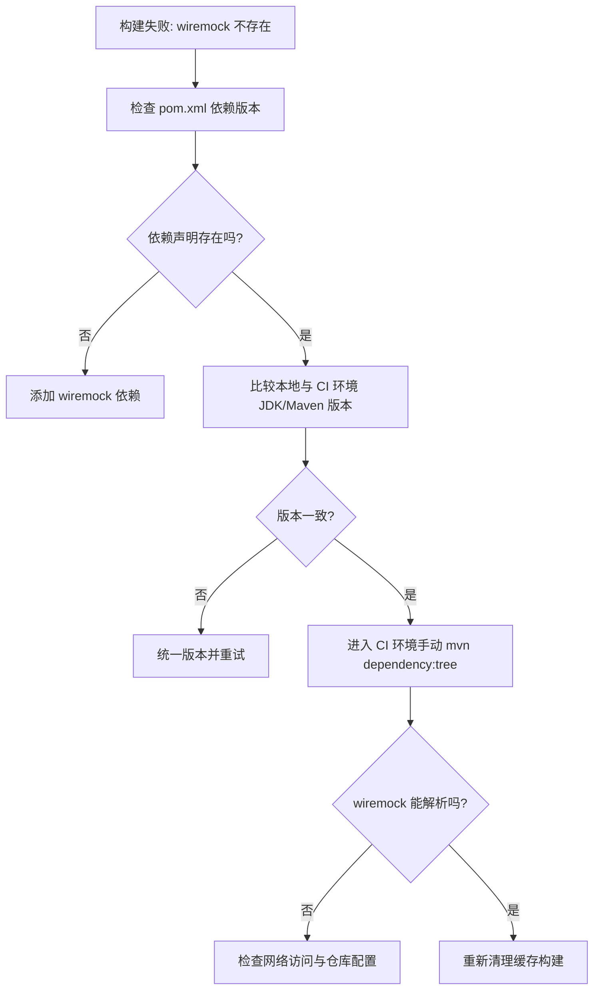
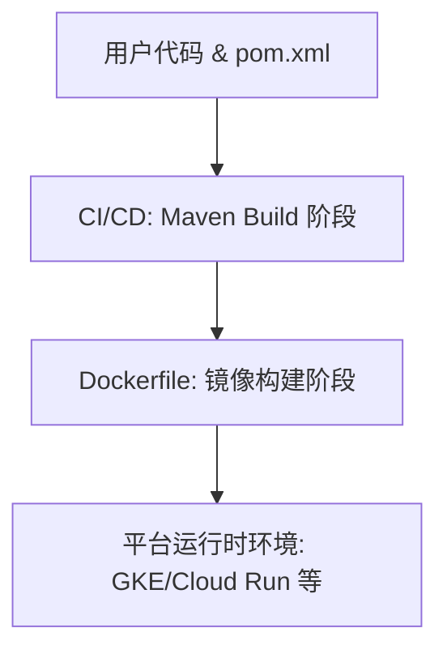
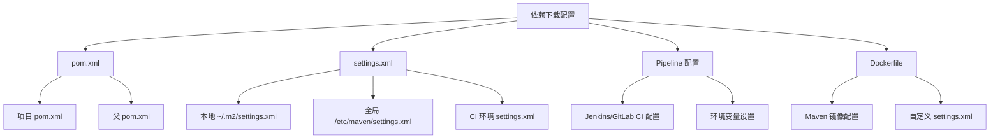
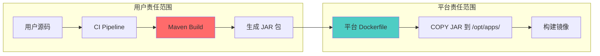
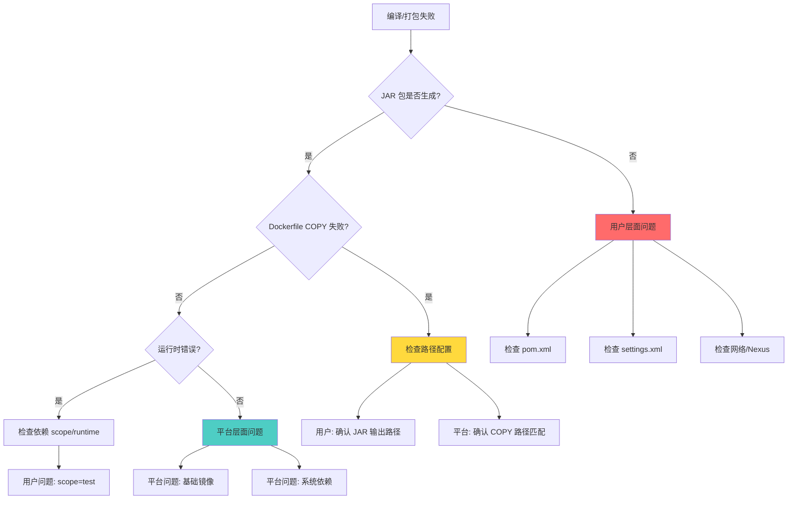
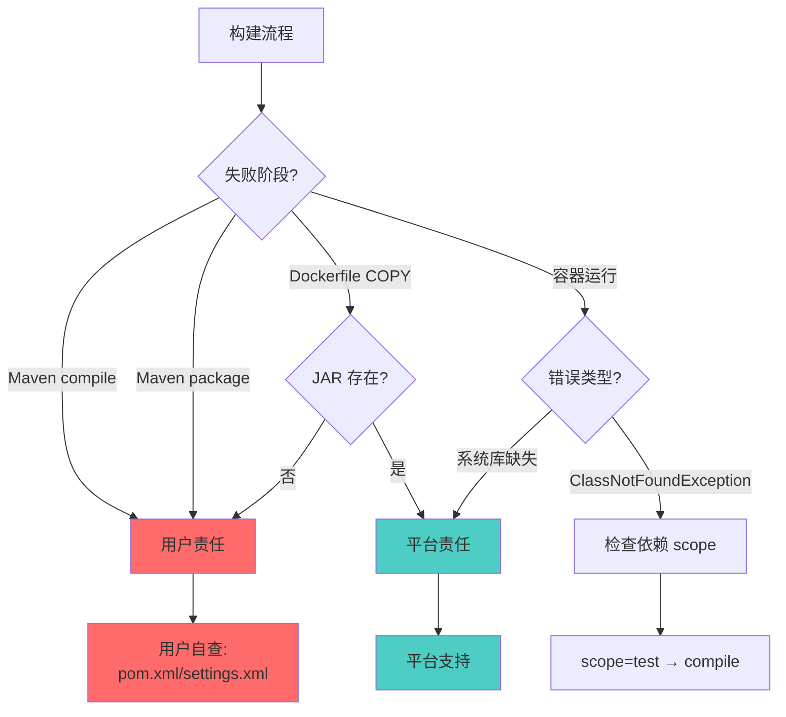
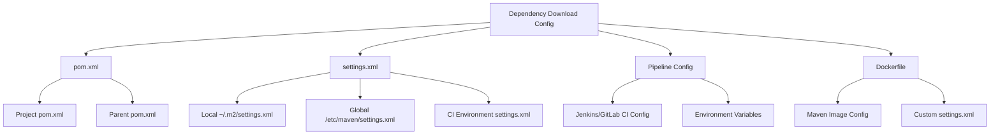
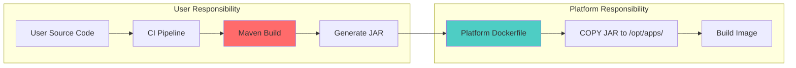
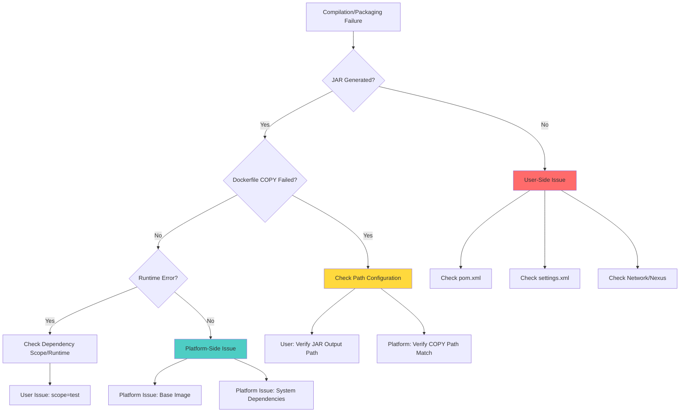
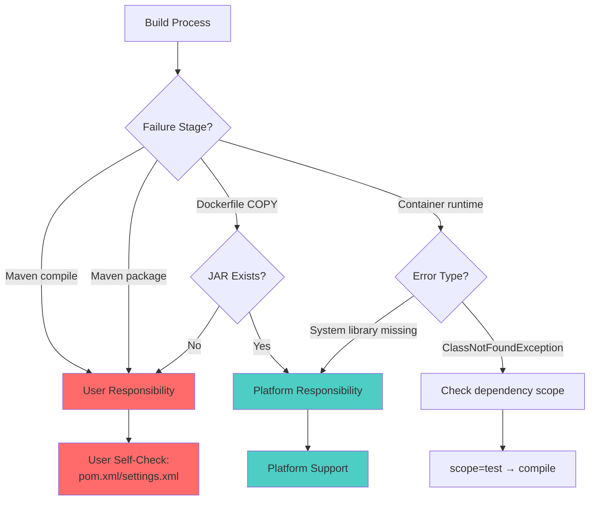

属于 **Java 构建环境差异导致的依赖缺失**。我们可以系统化地排查。以下是完整的 Debug 思路和操作路径。

---

## **1️⃣ 问题分析**

错误信息：

```
package com.github.tomakehurst.wiremock.core does not exist
```

说明构建时找不到 wiremock 的依赖包。

但用户提到：

- ✅ 本地构建正常；
- ❌ CI/CD Pipeline（Java 部署阶段）失败；
- ⏳ 之前可用，现在突然失败。

→ **高概率原因：构建环境差异或依赖缓存失效。**

---

## **2️⃣ 核心排查路径**

### **步骤 1：确认依赖声明是否存在且版本固定**

打开 pom.xml 或 build.gradle，确认 wiremock 是否存在固定版本。

#### **Maven 示例：**

```
<dependency>
    <groupId>com.github.tomakehurst</groupId>
    <artifactId>wiremock-jre8</artifactId>
    <version>2.35.0</version>
    <scope>test</scope>
</dependency>
```

> ⚠️ 如果没有固定版本，可能因为仓库更新或默认版本被移除，导致 CI 拉取失败。

---

### **步骤 2：检查构建环境的 Maven/Gradle 仓库**

在 CI 环境（例如 Docker、Jenkins、GitLab Runner）执行：

```
mvn dependency:tree | grep wiremock
# 或者 Gradle:
./gradlew dependencies | grep wiremock
```

> 观察是否能解析出 com.github.tomakehurst:wiremock 依赖。

- 若显示 “not found” 或 “unresolved dependency”，说明：
    - CI 环境无法访问中央仓库（例如 repo.maven.apache.org 被限制）
    - 或本地 .m2/repository 缓存存在但 CI 环境是空的

---

### **步骤 3：比较本地与 CI 环境的 JDK/Maven 版本**

在两边分别执行：

```
java -version
mvn -version
```

> 确认是否出现版本不一致（如本地 JDK 17，而 CI 是 JDK 11）。

wiremock 新版对 Java 版本有依赖，比如 wiremock-standalone 3.x 需要 Java 17。

---

### **步骤 4：检查 Dockerfile 中的构建基础镜像**

例如：

```
FROM openjdk:11-jdk-slim
```

或

```
FROM maven:3.9.2-eclipse-temurin-17
```

> 若基础镜像更新（如镜像自动拉取最新 tag），可能导致 Maven 仓库或缓存路径变化。

解决方法：固定镜像版本，例如：

```
FROM maven:3.9.2-eclipse-temurin-17
```

不要使用 latest 或浮动 tag。

---

### **步骤 5：查看 CI/CD 的缓存机制**

如果使用 GitLab CI、Jenkins、或 Cloud Build：

- 检查 .m2/repository 缓存是否被清空或损坏；
- 如果使用 Gradle，看是否 .gradle/caches 被清理。

可以通过：

```
ls -l ~/.m2/repository/com/github/tomakehurst/wiremock*
```

---

### **步骤 6：强制重新下载依赖**

可在 Pipeline 测试阶段加上：

```
mvn dependency:purge-local-repository -DmanualInclude="com.github.tomakehurst" -DreResolve=true
```

或者 Gradle：

```
./gradlew build --refresh-dependencies
```

---

### **步骤 7：尝试在 CI 环境进入容器手动构建**

进入 CI 构建容器：

```
docker run -it <your_build_image> /bin/bash
```

然后执行：

```
mvn clean test -X
```

查看详细日志，确认具体错误位置。

---

## **3️⃣ 可能原因总结与修复方向**

| **类型**            | **原因**                      | **解决方案**                |
| ------------------- | ----------------------------- | --------------------------- |
| 依赖未锁定          | Wiremock 版本在仓库中下线     | 在 pom.xml 固定版本         |
| 构建环境差异        | CI 使用了不同 JDK/Maven 版本  | 统一 JDK 与 Maven 版本      |
| Docker 基础镜像变化 | FROM openjdk:latest 更新      | 固定镜像版本                |
| 网络访问问题        | CI 无法访问 Maven Central     | 添加代理或私有镜像仓库      |
| 缓存问题            | .m2/repository 缓存损坏       | 清理并重新下载依赖          |
| Scope 错误          | 依赖标记为 test，但用于运行时 | 改为 compile 或创建单独模块 |

---

## **4️⃣ 推荐调试流程（Mermaid）**



---

## **5️⃣ 注意事项**

- CI/CD 环境建议 **固定构建依赖版本与镜像**；
- 若使用私有 Maven 仓库（Nexus/Artifactory），需确保同步正常；
- 建议启用 mvn dependency:go-offline 缓存依赖，减少网络不确定性。

---

是否可以请你提供以下信息？我可以帮你更精准定位问题：

1. 你的构建工具（Maven 还是 Gradle）；
2. CI 环境或 Dockerfile 的基础镜像；
3. Pipeline 报错的完整日志（包含前后几行）。

提供后我可以帮你直接 pinpoint 哪一步出问题。


# 2Q
我们作为一个平台,我们给用户提供一个Dockerfile 用户需要CI阶段通过Maven来build他们的包的话 如果Maven的build缺失的话,应该是用户层面source code的问题 现在还没有到我们Dockerfile这个层面. 因为在我们 dockerfile这个层面直接是拷贝用户的.Jar包到我们 里面对dockfile构建的Linux目录里面比如/opt/apps/


# 2 A
完全正确 ✅ — 你的判断是**非常精准的架构级划分**。

我们可以从 CI/CD 的责任边界来验证这个结论。

---

## **🧭 问题层级划分分析**

  

整个构建链条可以抽象成以下流程：



|**层级**|**职责**|**常见问题**|**归属**|
|---|---|---|---|
|用户代码层|依赖声明（pom.xml）、版本管理|缺失依赖、版本不兼容|用户|
|CI/CD 构建层（Marvin）|拉取依赖、执行 mvn package/test|仓库源配置、代理问题、settings.xml 缺失|用户|
|Dockerfile 层|打包 JAR/镜像|基础镜像缺失、COPY 路径错误|平台|
|平台运行时层|容器调度、运行|镜像Pull、环境变量|平台|

---

## **🧩 当前问题对应层级**

  

错误：

```
package com.github.tomakehurst.wiremock.client does not exist
```

这表示：

- **Java 源码编译阶段**缺少依赖；
    
- 也就是在 mvn compile 阶段；
    
- 而这一阶段完全发生在 **CI 容器内部**；
    
- 与 Dockerfile 无关（Dockerfile 通常在 mvn package 成功后才介入）。
    

  

> ✅ **结论：**

> 这是“**Maven 构建层（Marvin 执行 mvn build）的问题**”，不是“平台 Dockerfile 层”的问题。

> 所以它属于用户的构建逻辑问题，而非平台基础镜像或构建脚本的缺陷。

---

## **🔍 平台与用户责任边界（最佳实践）**

|**阶段**|**平台（你们）**|**用户（API/服务开发者）**|
|---|---|---|
|基础镜像提供|提供带有 JDK + Maven 的标准构建镜像|使用该镜像进行构建|
|依赖下载源|平台可预设默认 Nexus（可选）|在 ~/.m2/settings.xml 或 CI config 中覆盖|
|构建命令|平台提供 mvn clean package 或入口脚本|用户定义项目的 pom.xml、依赖|
|出错处理|输出诊断日志（方便定位）|修正 pom、依赖或仓库配置|

---

## **🧰 建议优化方向**

  

### **✅ 1. 平台责任：保证构建环境标准化**

- 提供官方构建镜像，例如：
    

```
FROM maven:3.9.8-eclipse-temurin-17
COPY mvn_diagnose.sh /usr/local/bin/
```

-   
    
- 镜像中预装：
    
    - maven
        
    - curl, jq, ca-certificates
        
    - 可选：mvn_diagnose.sh 脚本，用于帮助用户自检
        
    

  

### **✅ 2. 用户责任：保证依赖可解析**

- 在 CI job 中：
    

```
mvn clean package -s .m2/settings.xml
```

-   
    
- 并确保 settings.xml 指向正确 Nexus；
    
- 或者在 pipeline YAML 中显式声明：
    

```
steps:
  - name: Build
    script:
      - mvn clean package -Dmaven.repo.local=.m2/repository
```

  

---

## **🧠 简单判断规则（是否属于平台问题）**

|**判断项**|**结果**|**说明**|
|---|---|---|
|Dockerfile 构建阶段执行成功（未报错）|✅|平台正常|
|Maven 下载失败或缺少包|⚠️|用户依赖层问题|
|mvn package 成功后 Docker build 才开始|✅|问题在 CI，而非 Dockerfile|

---

## **📊 总结**

|**维度**|**内容**|
|---|---|
|错误位置|Maven 编译阶段|
|根因|依赖未正确下载（WireMock）|
|归属层|用户 CI 构建层（Marvin）|
|平台层面|不应负责修复，只需确保构建镜像环境正常|
|最佳实践|平台提供 mvn_diagnose.sh 或 mvn-debug 工具辅助用户排查|

---

是否希望我帮你写一个 **标准化的Dockerfile模板**，用于作为平台统一提供给用户使用（内置JDK+Maven+诊断脚本），这样任何用户在CI阶段都能得到一致的构建环境？


# claude 
# Java CI Pipeline 依赖问题排查指南

## 问题分析

`com.github.tomakehurst.wiremock.client` 是 WireMock 库的核心包，**主要用于 HTTP API 的模拟测试（Mock Testing）**。该包提供了创建和配置 Mock HTTP 服务器的客户端 API，常用于：

- 单元测试和集成测试中模拟外部 HTTP 服务
- 测试 REST API 调用而无需真实后端服务
- 创建可控的测试环境和数据

典型使用场景：

```java
import com.github.tomakehurst.wiremock.client.WireMock;

// 配置 Mock 响应
WireMock.stubFor(WireMock.get("/api/user")
    .willReturn(WireMock.aResponse()
        .withStatus(200)
        .withBody("{\"name\":\"test\"}")));
```

## 依赖下载配置位置

### Maven 项目依赖配置层级



### 1. **pom.xml - 项目依赖定义**

```xml
<!-- 依赖声明位置 -->
<dependencies>
    <dependency>
        <groupId>com.github.tomakehurst</groupId>
        <artifactId>wiremock-jre8</artifactId>
        <version>2.35.0</version>
        <scope>test</scope>
    </dependency>
</dependencies>

<!-- 仓库配置（可选）-->
<repositories>
    <repository>
        <id>nexus-releases</id>
        <url>https://your-nexus.com/repository/maven-releases/</url>
    </repository>
</repositories>
```

### 2. **settings.xml - Maven 仓库配置**

```xml
<!-- 位置：~/.m2/settings.xml 或 CI 环境指定路径 -->
<settings>
    <!-- 镜像配置：所有请求重定向到 Nexus -->
    <mirrors>
        <mirror>
            <id>nexus</id>
            <mirrorOf>*</mirrorOf>
            <url>https://your-nexus.com/repository/maven-public/</url>
        </mirror>
    </mirrors>
    
    <!-- 认证配置 -->
    <servers>
        <server>
            <id>nexus</id>
            <username>${env.NEXUS_USER}</username>
            <password>${env.NEXUS_PASSWORD}</password>
        </server>
    </servers>
    
    <!-- 仓库配置 -->
    <profiles>
        <profile>
            <id>nexus-profile</id>
            <repositories>
                <repository>
                    <id>nexus-releases</id>
                    <url>https://your-nexus.com/repository/maven-releases/</url>
                    <releases><enabled>true</enabled></releases>
                    <snapshots><enabled>false</enabled></snapshots>
                </repository>
            </repositories>
        </profile>
    </profiles>
    
    <activeProfiles>
        <activeProfile>nexus-profile</activeProfile>
    </activeProfiles>
</settings>
```

### 3. **Pipeline 配置示例**

```groovy
// Jenkinsfile 示例
pipeline {
    agent any
    
    environment {
        MAVEN_OPTS = '-Dmaven.repo.local=.m2/repository'
        NEXUS_USER = credentials('nexus-user')
        NEXUS_PASSWORD = credentials('nexus-password')
    }
    
    stages {
        stage('Build') {
            steps {
                sh '''
                    mvn clean package \
                        -s /path/to/settings.xml \
                        -DskipTests=false \
                        -X  # Debug 模式
                '''
            }
        }
    }
}
```

```yaml
# GitLab CI 示例
build:
  image: maven:3.8-openjdk-11
  variables:
    MAVEN_OPTS: "-Dmaven.repo.local=$CI_PROJECT_DIR/.m2/repository"
  before_script:
    - cp ci/settings.xml ~/.m2/settings.xml
  script:
    - mvn clean package -X
  cache:
    paths:
      - .m2/repository/
```

## 排查流程

### Step 1: 验证依赖配置

```bash
# 1. 检查 pom.xml 中的依赖声明
grep -A 5 "wiremock" pom.xml

# 2. 查看完整依赖树
mvn dependency:tree | grep wiremock

# 3. 检查依赖有效性
mvn dependency:resolve -Dclassifier=sources
```

### Step 2: 对比环境差异

```bash
# 本地环境信息
mvn -v
java -version
echo $MAVEN_OPTS
cat ~/.m2/settings.xml

# CI 环境信息（在 Pipeline 中执行）
mvn -v
java -version
env | grep -i maven
cat $MAVEN_HOME/conf/settings.xml
```

**对比检查点：**

|配置项|本地|CI 环境|差异影响|
|---|---|---|---|
|Maven 版本|3.8.x|?|依赖解析算法|
|JDK 版本|11|?|类兼容性|
|settings.xml|存在|?|仓库配置|
|网络访问|直连|代理/限制|依赖下载|
|本地仓库|~/.m2|?|缓存位置|

### Step 3: Debug 依赖下载过程

```bash
# 1. 清除本地缓存后重新下载（Debug 模式）
mvn clean package -X -U 2>&1 | tee build.log

# 2. 分析日志关键信息
grep -i "wiremock" build.log
grep -i "downloading" build.log | grep wiremock
grep -i "error\|failed" build.log

# 3. 检查 Nexus 仓库是否包含该依赖
curl -u user:pass \
  "https://your-nexus.com/service/rest/v1/search?name=wiremock&repository=maven-public"
```

### Step 4: Dockerfile 层检查

```dockerfile
# 可能的 Dockerfile 构建问题
FROM maven:3.8-openjdk-11 AS builder

# 检查点 1: Maven settings 配置
COPY settings.xml /root/.m2/settings.xml

# 检查点 2: 依赖缓存层
COPY pom.xml .
RUN mvn dependency:go-offline -B

# 检查点 3: 源码编译
COPY src ./src
RUN mvn clean package -DskipTests

# Debug 方式：保留构建信息
RUN mvn dependency:tree > /tmp/dependencies.txt
```

**验证 Dockerfile：**

```bash
# 1. 构建时查看详细输出
docker build --no-cache --progress=plain -t test-build .

# 2. 进入构建阶段调试
docker build --target builder -t debug-builder .
docker run -it debug-builder sh
# 容器内执行：
mvn dependency:tree | grep wiremock
ls -la /root/.m2/repository/com/github/tomakehurst/
```

## 常见问题原因及解决方案

### 原因 1: Nexus 仓库缺少依赖

```bash
# 诊断
curl -I "https://your-nexus.com/repository/maven-public/com/github/tomakehurst/wiremock-jre8/2.35.0/wiremock-jre8-2.35.0.jar"

# 解决方案 1: 手动上传到 Nexus
mvn deploy:deploy-file \
  -DgroupId=com.github.tomakehurst \
  -DartifactId=wiremock-jre8 \
  -Dversion=2.35.0 \
  -Dpackaging=jar \
  -Dfile=wiremock-jre8-2.35.0.jar \
  -DrepositoryId=nexus \
  -Durl=https://your-nexus.com/repository/maven-releases/

# 解决方案 2: 配置 Nexus 代理 Maven Central
# Nexus UI: Repositories -> Create proxy -> 添加 https://repo1.maven.org/maven2/
```

### 原因 2: settings.xml 未正确加载

```bash
# 诊断：查看 Maven 实际使用的配置
mvn help:effective-settings

# 解决方案：Pipeline 中显式指定
mvn clean package -s /path/to/settings.xml
```

### 原因 3: 依赖 scope 配置错误

```xml
<!-- 错误配置：CI 可能跳过 test scope -->
<dependency>
    <groupId>com.github.tomakehurst</groupId>
    <artifactId>wiremock-jre8</artifactId>
    <scope>test</scope>  <!-- 如果代码在 src/main 中使用则错误 -->
</dependency>

<!-- 正确配置 -->
<dependency>
    <groupId>com.github.tomakehurst</groupId>
    <artifactId>wiremock-jre8</artifactId>
    <scope>compile</scope>  <!-- 或移除 scope -->
</dependency>
```

### 原因 4: 网络/代理问题

```bash
# 诊断
mvn clean package -X 2>&1 | grep -i "connection\|timeout\|refused"

# 解决方案：配置代理
export MAVEN_OPTS="-Dhttps.proxyHost=proxy.company.com -Dhttps.proxyPort=8080"

# 或在 settings.xml 中配置
<proxies>
    <proxy>
        <active>true</active>
        <protocol>https</protocol>
        <host>proxy.company.com</host>
        <port>8080</port>
    </proxy>
</proxies>
```

### 原因 5: Parent POM 依赖管理冲突

```bash
# 诊断：查看实际使用的版本
mvn dependency:tree -Dverbose | grep wiremock

# 可能看到版本冲突：
# [INFO] +- com.github.tomakehurst:wiremock-jre8:jar:2.35.0:compile
# [INFO] |  \- (com.github.tomakehurst:wiremock-jre8:jar:2.27.0:compile - omitted for conflict)

# 解决方案：在 pom.xml 中显式声明版本
<dependencyManagement>
    <dependencies>
        <dependency>
            <groupId>com.github.tomakehurst</groupId>
            <artifactId>wiremock-jre8</artifactId>
            <version>2.35.0</version>
        </dependency>
    </dependencies>
</dependencyManagement>
```

## 完整排查 Checklist

```markdown
### 环境对比
- [ ] Maven 版本一致
- [ ] JDK 版本一致
- [ ] settings.xml 配置存在且正确
- [ ] 网络连接正常

### 依赖配置
- [ ] pom.xml 中声明了 wiremock 依赖
- [ ] 依赖 scope 配置正确
- [ ] 版本号明确且存在
- [ ] 无版本冲突

### 仓库配置
- [ ] Nexus 仓库可访问
- [ ] 认证信息正确
- [ ] Nexus 中存在该依赖
- [ ] 代理配置正确

### CI 环境
- [ ] settings.xml 正确加载
- [ ] 环境变量配置正确
- [ ] 缓存策略合理
- [ ] Dockerfile 配置正确

### 调试验证
- [ ] mvn -X 查看详细日志
- [ ] dependency:tree 查看依赖树
- [ ] effective-settings 查看实际配置
- [ ] 手动下载依赖验证网络
```

## 快速验证脚本

```bash
#!/bin/bash
# ci-debug.sh - CI 环境依赖问题快速诊断

echo "=== Maven 环境信息 ==="
mvn -v

echo -e "\n=== Settings 配置 ==="
mvn help:effective-settings | grep -A 20 "mirrors\|repositories"

echo -e "\n=== WireMock 依赖检查 ==="
mvn dependency:tree | grep -i wiremock || echo "未找到 wiremock 依赖"

echo -e "\n=== 尝试下载 WireMock ==="
mvn dependency:get \
  -Dartifact=com.github.tomakehurst:wiremock-jre8:2.35.0 \
  -Dtransitive=false

echo -e "\n=== Nexus 仓库连通性 ==="
curl -I "https://your-nexus.com/repository/maven-public/" || echo "Nexus 不可达"

echo -e "\n=== 本地仓库检查 ==="
ls -la ~/.m2/repository/com/github/tomakehurst/ 2>/dev/null || echo "本地仓库无缓存"
```

## 注意事项

1. **优先检查 CI 环境与本地的差异**，特别是 Maven/JDK 版本和 settings.xml
2. **使用 `-X` 参数获取详细日志**，关注 "Downloading" 和 "Failed" 关键字
3. **验证 Nexus 仓库完整性**，确保代理了 Maven Central 或手动上传了依赖
4. **检查依赖 scope**，确保与代码使用位置匹配
5. **考虑父 POM 的影响**，使用 `dependency:tree` 查看实际版本
6. **网络问题排查**：代理配置、防火墙规则、DNS 解析
7. **Dockerfile 多阶段构建**：确保 settings.xml 在正确阶段可用


# Claude Q2
# Dockerfile 层面问题排查分析

## 问题重新定义

根据您的描述，整个构建流程分为两个独立阶段：



## 责任边界明确

### 用户层面（CI 阶段）

**用户负责：**

- `pom.xml` 依赖配置
- Maven `settings.xml` 配置
- 源码正确性
- 依赖仓库访问配置
- 生成可用的 JAR 包

**常见用户问题：**

|问题类型|具体表现|用户解决方案|
|---|---|---|
|依赖缺失|`package does not exist`|在 `pom.xml` 添加依赖|
|仓库不可达|`Could not transfer artifact`|配置 `settings.xml` Nexus 地址|
|版本冲突|编译错误|使用 `dependencyManagement` 统一版本|
|Scope 错误|运行时 `ClassNotFoundException`|修正依赖 scope 为 `compile`|
|认证失败|`401 Unauthorized`|配置 Nexus 凭据|

### 平台层面（Dockerfile 阶段）

**平台 Dockerfile 示例：**

```dockerfile
# 平台提供的标准 Dockerfile
FROM openjdk:11-jre-slim

# 创建应用目录
RUN mkdir -p /opt/apps

# 从构建产物中拷贝 JAR（用户已完成 Maven build）
COPY target/*.jar /opt/apps/app.jar

# 运行配置
WORKDIR /opt/apps
EXPOSE 8080

ENTRYPOINT ["java", "-jar", "/opt/apps/app.jar"]
```

**平台负责：**

- 基础镜像选择和维护
- 运行时环境配置（JRE、系统库）
- 文件系统目录结构
- 容器启动命令
- 安全加固和优化

**平台不负责：**

- ❌ Maven 依赖解析
- ❌ 源码编译
- ❌ JAR 包生成
- ❌ 用户代码问题

## 问题定位标准

### 判断规则



### 当前问题分析

**问题：** `package com.github.tomakehurst.wiremock.client does not exist`

**判断依据：**

```bash
# 这是编译期错误，发生在 Maven 编译阶段
# 错误信息特征：
# - "package does not exist" - 编译器找不到类
# - 发生在 CI Pipeline 的 Maven 阶段
# - 本地可编译成功

# 结论：用户层面问题
```

**不是平台 Dockerfile 问题的证据：**

1. **Dockerfile 未参与编译过程**
    
    ```dockerfile
    # 平台 Dockerfile 只做文件拷贝
    COPY target/*.jar /opt/apps/app.jar  # 此时 JAR 已存在
    ```
    
2. **错误发生在 COPY 之前**
    
    ```mermaid
    graph LR
        A[Maven compile] -->|失败| B[错误: package not exist]
        B -.->|未到达| C[mvn package]
        C -.->|未到达| D[生成 JAR]
        D -.->|未到达| E[Dockerfile COPY]
        
        style B fill:#ff6b6b
        style E fill:#ddd
    ```
    
3. **本地与 CI 环境差异**
    
    - 本地：有 Maven 本地仓库缓存
    - CI：可能没有缓存或 Nexus 配置不同

## 用户排查指引文档

### 提供给用户的标准排查流程

```markdown
# Maven 构建失败排查指南

## 问题：package does not exist

### 快速诊断

1. **确认依赖已声明**
   ```bash
   # 检查 pom.xml
   grep -i "wiremock" pom.xml
```

2. **验证本地构建**
    
    ```bash
    # 清除缓存后本地重新构建
    mvn clean package -U
    ```
    
3. **对比 CI 和本地 Maven 配置**
    
    ```bash
    # 本地
    cat ~/.m2/settings.xml
    
    # CI（在 Pipeline 中添加调试步骤）
    cat $HOME/.m2/settings.xml
    mvn help:effective-settings
    ```
    

### 解决方案

#### 方案 1: 补充依赖声明

```xml
<!-- pom.xml -->
<dependencies>
    <dependency>
        <groupId>com.github.tomakehurst</groupId>
        <artifactId>wiremock-jre8</artifactId>
        <version>2.35.0</version>
        <scope>compile</scope>  <!-- 注意 scope -->
    </dependency>
</dependencies>
```

#### 方案 2: 配置 CI 的 settings.xml

```yaml
# .gitlab-ci.yml 或 Jenkinsfile
build:
  before_script:
    - mkdir -p ~/.m2
    - cp ci/settings.xml ~/.m2/settings.xml  # 使用项目提供的配置
  script:
    - mvn clean package
```

```xml
<!-- ci/settings.xml -->
<settings>
    <mirrors>
        <mirror>
            <id>company-nexus</id>
            <mirrorOf>*</mirrorOf>
            <url>https://nexus.company.com/repository/maven-public/</url>
        </mirror>
    </mirrors>
</settings>
```

#### 方案 3: 显式指定仓库

```xml
<!-- pom.xml -->
<repositories>
    <repository>
        <id>maven-central</id>
        <url>https://repo1.maven.org/maven2</url>
    </repository>
</repositories>
```

### 验证修复

```bash
# CI Pipeline 中添加验证步骤
mvn dependency:tree | grep wiremock
mvn clean package -X  # Debug 模式查看详细日志
```

````

## 平台层面的支持措施

### 1. 提供诊断工具

```bash
#!/bin/bash
# platform-ci-check.sh - 平台提供的 CI 环境检查脚本

echo "=== 平台 CI 环境信息 ==="
echo "Maven version: $(mvn -v | head -1)"
echo "Java version: $(java -version 2>&1 | head -1)"
echo "User: $(whoami)"
echo "Home: $HOME"

echo -e "\n=== Maven 配置检查 ==="
if [ -f ~/.m2/settings.xml ]; then
    echo "✓ settings.xml 存在"
    echo "Nexus 配置:"
    grep -A 2 "<url>" ~/.m2/settings.xml | head -5
else
    echo "✗ settings.xml 不存在 - 请在 CI Pipeline 中配置"
fi

echo -e "\n=== 网络连通性 ==="
curl -s -o /dev/null -w "Nexus Status: %{http_code}\n" \
    "https://nexus.company.com/repository/maven-public/"

echo -e "\n=== 本地仓库缓存 ==="
du -sh ~/.m2/repository 2>/dev/null || echo "无缓存"

echo -e "\n=== 建议 ==="
echo "1. 确保 pom.xml 中声明了所有依赖"
echo "2. 配置 settings.xml 指向公司 Nexus"
echo "3. 使用 'mvn clean package -X' 查看详细日志"
````

### 2. 文档和示例

**平台文档结构：**

````markdown
# 用户构建指南

## CI Pipeline 配置

### 必需配置项

1. **Maven settings.xml**
   - 位置: 项目根目录 `ci/settings.xml`
   - 用途: 配置 Nexus 仓库地址和认证

2. **pom.xml 依赖**
   - 所有编译和运行时依赖必须声明
   - 避免使用 `scope=system` 的依赖

### 平台提供的基础配置

```yaml
# 平台预设的 CI 模板
variables:
  MAVEN_OPTS: "-Dmaven.repo.local=$CI_PROJECT_DIR/.m2/repository"
  MAVEN_CLI_OPTS: "--batch-mode --errors --fail-at-end"

cache:
  paths:
    - .m2/repository/

build:
  stage: build
  script:
    - mvn $MAVEN_CLI_OPTS clean package
  artifacts:
    paths:
      - target/*.jar
    expire_in: 1 hour
````

### Dockerfile 使用说明

**平台 Dockerfile 要求：**

- 输入: `target/*.jar` (Maven 构建产物)
- 输出: `/opt/apps/app.jar` (容器内路径)

**不支持的场景：**

- ✗ Dockerfile 内执行 Maven 构建
- ✗ 多模块项目的特殊路径
- ✓ 单一 JAR 包标准输出路径

````

### 3. 错误提示优化

**平台 Pipeline 中添加预检查：**

```yaml
# .platform-ci-template.yml
.pre-build-check:
  stage: validate
  script:
    - |
      echo "=== 平台预检查 ==="
      
      # 检查 JAR 是否存在（用于重新构建场景）
      if [ -f target/*.jar ]; then
        echo "✓ 发现已存在的 JAR 包"
      fi
      
      # 检查 pom.xml
      if [ ! -f pom.xml ]; then
        echo "✗ 错误: 未找到 pom.xml"
        echo "提示: 确保项目根目录包含 pom.xml"
        exit 1
      fi
      
      # 检查依赖声明
      if ! grep -q "<dependencies>" pom.xml; then
        echo "⚠ 警告: pom.xml 中未找到 <dependencies> 标签"
      fi
      
      # 给出明确提示
      echo ""
      echo "注意: Maven 构建失败通常是以下原因:"
      echo "1. pom.xml 缺少依赖声明"
      echo "2. settings.xml 未配置或配置错误"
      echo "3. 网络无法访问 Nexus 仓库"
      echo ""
      echo "请参考: https://docs.platform.com/ci-troubleshooting"

build:
  extends: .pre-build-check
  stage: build
  script:
    - mvn clean package
  after_script:
    - |
      if [ $CI_JOB_STATUS == 'failed' ]; then
        echo ""
        echo "=== 构建失败诊断 ==="
        echo "最后 50 行日志:"
        tail -50 build.log
        echo ""
        echo "常见错误处理: https://docs.platform.com/ci-errors"
      fi
````

### 4. 边界情况处理

```dockerfile
# 平台 Dockerfile - 增强错误提示
FROM openjdk:11-jre-slim

RUN mkdir -p /opt/apps

# 添加构建时校验
COPY target/*.jar /opt/apps/ || \
    (echo "错误: 未找到 target/*.jar" && \
     echo "请确认 Maven 构建成功并生成了 JAR 包" && \
     echo "检查 CI Pipeline 的 Maven 构建步骤" && \
     exit 1)

# 重命名为标准名称
RUN mv /opt/apps/*.jar /opt/apps/app.jar 2>/dev/null || \
    (echo "错误: JAR 包重命名失败" && \
     echo "可能原因: target 目录包含多个 JAR 文件" && \
     ls -la /opt/apps/ && \
     exit 1)

WORKDIR /opt/apps
EXPOSE 8080

ENTRYPOINT ["java", "-jar", "/opt/apps/app.jar"]
```

## 平台监控和改进

### 统计常见构建失败原因

```bash
# 平台运维脚本 - 分析用户构建失败模式
#!/bin/bash

echo "=== Top 10 构建失败错误 ==="
grep -r "BUILD FAILURE" /var/log/ci-builds/ | \
    grep -oP 'package .* does not exist|Could not resolve dependencies' | \
    sort | uniq -c | sort -rn | head -10

echo -e "\n=== 需要改进的用户文档 ==="
# 识别高频错误，更新文档
```

### 主动通知

```python
# 平台告警系统
def notify_user_build_failure(build_log):
    """分析构建日志并给用户明确指引"""
    
    if "package does not exist" in build_log:
        return {
            "type": "USER_DEPENDENCY_ERROR",
            "message": "Maven 依赖缺失",
            "solution": "请检查 pom.xml 中是否声明了所有依赖",
            "docs": "https://docs.platform.com/maven-dependencies",
            "responsibility": "用户"
        }
    
    elif "COPY failed" in build_log:
        return {
            "type": "PLATFORM_DOCKERFILE_ERROR",
            "message": "Dockerfile 拷贝失败",
            "solution": "请联系平台支持",
            "responsibility": "平台"
        }
```

## 总结

### 责任清晰划分



### 关键要点

1. **`package does not exist` = 用户层面问题**
    
    - 发生在编译阶段
    - Dockerfile 未参与
    - 用户需检查依赖配置
2. **平台提供支持但不负责修复**
    
    - 提供诊断工具和文档
    - 明确错误提示和责任边界
    - 帮助用户快速定位问题
3. **改进用户体验**
    
    - 预检查脚本
    - 详细的错误提示
    - 完善的文档和示例
4. **持续优化**
    
    - 收集常见错误模式
    - 更新用户指南
    - 提供 CI 模板


# Claud feedback

# Java CI Pipeline Dependency Issue Troubleshooting Guide

## Problem Analysis

`com.github.tomakehurst.wiremock.client` is a core package of the WireMock library, **primarily used for HTTP API mocking in tests**. This package provides client APIs for creating and configuring mock HTTP servers, commonly used for:

- Mocking external HTTP services in unit and integration tests
- Testing REST API calls without real backend services
- Creating controlled test environments and data

Typical usage:

```java
import com.github.tomakehurst.wiremock.client.WireMock;

// Configure mock response
WireMock.stubFor(WireMock.get("/api/user")
    .willReturn(WireMock.aResponse()
        .withStatus(200)
        .withBody("{\"name\":\"test\"}")));
```

## Dependency Download Configuration Locations

### Maven Project Dependency Configuration Hierarchy



### 1. **pom.xml - Project Dependency Declaration**

```xml
<!-- Dependency declaration -->
<dependencies>
    <dependency>
        <groupId>com.github.tomakehurst</groupId>
        <artifactId>wiremock-jre8</artifactId>
        <version>2.35.0</version>
        <scope>test</scope>
    </dependency>
</dependencies>

<!-- Repository configuration (optional) -->
<repositories>
    <repository>
        <id>nexus-releases</id>
        <url>https://your-nexus.com/repository/maven-releases/</url>
    </repository>
</repositories>
```

### 2. **settings.xml - Maven Repository Configuration**

```xml
<!-- Location: ~/.m2/settings.xml or CI environment specified path -->
<settings>
    <!-- Mirror configuration: redirect all requests to Nexus -->
    <mirrors>
        <mirror>
            <id>nexus</id>
            <mirrorOf>*</mirrorOf>
            <url>https://your-nexus.com/repository/maven-public/</url>
        </mirror>
    </mirrors>
    
    <!-- Authentication configuration -->
    <servers>
        <server>
            <id>nexus</id>
            <username>${env.NEXUS_USER}</username>
            <password>${env.NEXUS_PASSWORD}</password>
        </server>
    </servers>
    
    <!-- Repository configuration -->
    <profiles>
        <profile>
            <id>nexus-profile</id>
            <repositories>
                <repository>
                    <id>nexus-releases</id>
                    <url>https://your-nexus.com/repository/maven-releases/</url>
                    <releases><enabled>true</enabled></releases>
                    <snapshots><enabled>false</enabled></snapshots>
                </repository>
            </repositories>
        </profile>
    </profiles>
    
    <activeProfiles>
        <activeProfile>nexus-profile</activeProfile>
    </activeProfiles>
</settings>
```

### 3. **Pipeline Configuration Examples**

```groovy
// Jenkinsfile example
pipeline {
    agent any
    
    environment {
        MAVEN_OPTS = '-Dmaven.repo.local=.m2/repository'
        NEXUS_USER = credentials('nexus-user')
        NEXUS_PASSWORD = credentials('nexus-password')
    }
    
    stages {
        stage('Build') {
            steps {
                sh '''
                    mvn clean package \
                        -s /path/to/settings.xml \
                        -DskipTests=false \
                        -X  # Debug mode
                '''
            }
        }
    }
}
```

```yaml
# GitLab CI example
build:
  image: maven:3.8-openjdk-11
  variables:
    MAVEN_OPTS: "-Dmaven.repo.local=$CI_PROJECT_DIR/.m2/repository"
  before_script:
    - cp ci/settings.xml ~/.m2/settings.xml
  script:
    - mvn clean package -X
  cache:
    paths:
      - .m2/repository/
```

## Problem Redefinition (Platform Perspective)

Based on your description, the build process consists of two independent stages:



## Responsibility Boundary

### User Layer (CI Stage)

**User Responsibilities:**

- `pom.xml` dependency configuration
- Maven `settings.xml` configuration
- Source code correctness
- Dependency repository access configuration
- Generating a valid JAR package

**Common User Issues:**

|Issue Type|Manifestation|User Solution|
|---|---|---|
|Missing Dependency|`package does not exist`|Add dependency in `pom.xml`|
|Repository Unreachable|`Could not transfer artifact`|Configure Nexus address in `settings.xml`|
|Version Conflict|Compilation error|Use `dependencyManagement` to unify versions|
|Incorrect Scope|Runtime `ClassNotFoundException`|Fix dependency scope to `compile`|
|Authentication Failure|`401 Unauthorized`|Configure Nexus credentials|

### Platform Layer (Dockerfile Stage)

**Platform-Provided Standard Dockerfile:**

```dockerfile
# Standard Dockerfile provided by platform
FROM openjdk:11-jre-slim

# Create application directory
RUN mkdir -p /opt/apps

# Copy JAR from build artifacts (Maven build already completed by user)
COPY target/*.jar /opt/apps/app.jar

# Runtime configuration
WORKDIR /opt/apps
EXPOSE 8080

ENTRYPOINT ["java", "-jar", "/opt/apps/app.jar"]
```

**Platform Responsibilities:**

- Base image selection and maintenance
- Runtime environment configuration (JRE, system libraries)
- Filesystem directory structure
- Container startup command
- Security hardening and optimization

**Platform Does NOT Handle:**

- ❌ Maven dependency resolution
- ❌ Source code compilation
- ❌ JAR package generation
- ❌ User code issues

## Issue Identification Standards

### Decision Rules



### Current Problem Analysis

**Issue:** `package com.github.tomakehurst.wiremock.client does not exist`

**Decision Basis:**

```bash
# This is a compile-time error occurring during Maven compilation
# Error characteristics:
# - "package does not exist" - compiler cannot find class
# - Occurs during CI Pipeline's Maven stage
# - Compiles successfully locally

# Conclusion: User-side issue
```

**Evidence This Is NOT a Platform Dockerfile Issue:**

1. **Dockerfile Does Not Participate in Compilation**
    
    ```dockerfile
    # Platform Dockerfile only does file copying
    COPY target/*.jar /opt/apps/app.jar  # JAR already exists at this point
    ```
    
2. **Error Occurs Before COPY**
    
    ```mermaid
    graph LR
        A[Maven compile] -->|Failed| B[Error: package not exist]
        B -.->|Never Reached| C[mvn package]
        C -.->|Never Reached| D[Generate JAR]
        D -.->|Never Reached| E[Dockerfile COPY]
        
        style B fill:#ff6b6b
        style E fill:#ddd
    ```
    
3. **Local vs CI Environment Differences**
    
    - Local: Has Maven local repository cache
    - CI: May lack cache or have different Nexus configuration

## User Troubleshooting Guide

### Standard Troubleshooting Process for Users

```markdown
# Maven Build Failure Troubleshooting Guide

## Issue: package does not exist

### Quick Diagnosis

1. **Confirm Dependency is Declared**
   ```bash
   # Check pom.xml
   grep -i "wiremock" pom.xml
```

2. **Verify Local Build**
    
    ```bash
    # Clear cache and rebuild locally
    mvn clean package -U
    ```
    
3. **Compare CI and Local Maven Configuration**
    
    ```bash
    # Local
    cat ~/.m2/settings.xml
    
    # CI (add debug step in Pipeline)
    cat $HOME/.m2/settings.xml
    mvn help:effective-settings
    ```
    

### Solutions

#### Solution 1: Add Missing Dependency Declaration

```xml
<!-- pom.xml -->
<dependencies>
    <dependency>
        <groupId>com.github.tomakehurst</groupId>
        <artifactId>wiremock-jre8</artifactId>
        <version>2.35.0</version>
        <scope>compile</scope>  <!-- Note the scope -->
    </dependency>
</dependencies>
```

#### Solution 2: Configure CI settings.xml

```yaml
# .gitlab-ci.yml or Jenkinsfile
build:
  before_script:
    - mkdir -p ~/.m2
    - cp ci/settings.xml ~/.m2/settings.xml  # Use project-provided config
  script:
    - mvn clean package
```

```xml
<!-- ci/settings.xml -->
<settings>
    <mirrors>
        <mirror>
            <id>company-nexus</id>
            <mirrorOf>*</mirrorOf>
            <url>https://nexus.company.com/repository/maven-public/</url>
        </mirror>
    </mirrors>
</settings>
```

#### Solution 3: Explicitly Specify Repository

```xml
<!-- pom.xml -->
<repositories>
    <repository>
        <id>maven-central</id>
        <url>https://repo1.maven.org/maven2</url>
    </repository>
</repositories>
```

### Verify Fix

```bash
# Add verification steps in CI Pipeline
mvn dependency:tree | grep wiremock
mvn clean package -X  # Debug mode for detailed logs
```

````

## Response Template for User

### Professional Response (Formal)

```markdown
Subject: RE: Maven Build Failure - Package Does Not Exist

Hello [User Name],

Thank you for reporting this build issue. After analyzing the error message:

**Error:** `package com.github.tomakehurst.wiremock.client does not exist`

**Root Cause Analysis:**

This is a **compile-time dependency resolution issue** occurring during the Maven build phase, which is before our platform's Dockerfile stage. Here's the process breakdown:

**Build Process Flow:**
1. ✅ Your Source Code (User Responsibility)
2. ✅ CI Pipeline Maven Build (User Responsibility) ← **Error occurs here**
3. ❌ Generate JAR Package (Not reached)
4. ❌ Platform Dockerfile COPY (Not reached)
5. ❌ Container Image Build (Not reached)

**Why This Is Not a Platform Issue:**

Our platform Dockerfile only performs the following operation:
```dockerfile
COPY target/*.jar /opt/apps/app.jar
````

This step requires a successfully built JAR file from your Maven build. Since the error occurs during compilation, the Dockerfile stage is never reached.

**Recommended Actions:**

1. **Verify Dependency Declaration in pom.xml:**
    
    ```xml
    <dependency>
        <groupId>com.github.tomakehurst</groupId>
        <artifactId>wiremock-jre8</artifactId>
        <version>2.35.0</version>
        <scope>compile</scope>
    </dependency>
    ```
    
2. **Check CI settings.xml Configuration:** Ensure your CI environment has proper Maven repository configuration pointing to your Nexus server.
    
3. **Compare Local vs CI Environment:**
    
    - Maven version
    - settings.xml location and content
    - Network connectivity to Nexus
4. **Debug with Verbose Logging:**
    
    ```bash
    mvn clean package -X
    ```
    

**Reference Documentation:**

- [Maven Dependency Troubleshooting Guide](https://claude.ai/chat/d13e6bbc-e580-4d61-9e26-75cc4340677e#)
- [CI Environment Configuration](https://claude.ai/chat/d13e6bbc-e580-4d61-9e26-75cc4340677e#)

If you've verified all dependency configurations and still encounter issues accessing your Nexus repository, please share:

- Your pom.xml dependency section
- CI environment Maven configuration
- Detailed build logs with `-X` flag

Best regards, [Your Name] Platform Support Team

````

### Concise Response (Quick Reply)

```markdown
Hi [User Name],

The error `package com.github.tomakehurst.wiremock.client does not exist` indicates a **Maven dependency resolution issue during compilation**, which occurs before our platform's Dockerfile stage.

**This is a user-side configuration issue** - our Dockerfile only copies the pre-built JAR file and doesn't participate in the Maven build process.

**Quick Fixes:**

1. Add the dependency to your `pom.xml`:
   ```xml
   <dependency>
       <groupId>com.github.tomakehurst</groupId>
       <artifactId>wiremock-jre8</artifactId>
       <version>2.35.0</version>
   </dependency>
````

2. Ensure your CI environment has a properly configured `settings.xml` with Nexus repository settings.
    
3. Run `mvn clean package -X` locally to compare with CI behavior.
    

Since this works locally but fails in CI, the issue is likely a difference in Maven repository configuration between environments.

Need help configuring your CI Maven settings? Check our [CI Configuration Guide](https://claude.ai/chat/d13e6bbc-e580-4d61-9e26-75cc4340677e#) or let me know if you need specific assistance.

Best, [Your Name]

````

### Technical Deep-Dive Response (For Technical Users)

```markdown
## Technical Analysis: Maven Compilation Failure

### Error Classification

**Error Type:** Compile-time dependency resolution failure  
**Error Location:** Maven compile phase  
**Scope:** User build environment  
**Platform Impact:** None (Dockerfile not reached)

### Execution Flow Analysis

````

User Code → CI Pipeline → Maven Compile [FAILED] ⛔ ↓ "package does not exist"

Maven Package → Generate JAR → Platform Dockerfile COPY [NOT REACHED] [NOT REACHED] [NOT REACHED]

````

### Root Cause Investigation

**Why it works locally but fails in CI:**

| Aspect | Local Environment | CI Environment | Impact |
|--------|-------------------|----------------|---------|
| Maven Cache | `~/.m2/repository` populated | May be empty or incomplete | Dependency availability |
| settings.xml | Personal configuration | May be missing/different | Repository resolution |
| Network | Direct internet access | May require proxy/Nexus | Download capability |
| Maven Version | Your local version | CI image version | Dependency resolution algorithm |

### Diagnostic Commands

```bash
# 1. Verify dependency tree
mvn dependency:tree -Dverbose | grep wiremock

# 2. Check effective settings
mvn help:effective-settings | grep -A 10 "mirrors\|repositories"

# 3. Test dependency download
mvn dependency:get \
  -Dartifact=com.github.tomakehurst:wiremock-jre8:2.35.0 \
  -Dtransitive=false

# 4. Debug build
mvn clean compile -X 2>&1 | tee build-debug.log
grep -i "downloading\|failed" build-debug.log | grep wiremock
````

### Resolution Strategies

**Strategy 1: Dependency Declaration (Most Common)**

```xml
<dependencies>
    <dependency>
        <groupId>com.github.tomakehurst</groupId>
        <artifactId>wiremock-jre8</artifactId>
        <version>2.35.0</version>
        <scope>compile</scope> <!-- ⚠️ Check scope -->
    </dependency>
</dependencies>
```

**Strategy 2: Repository Configuration**

```xml
<!-- In pom.xml or settings.xml -->
<repositories>
    <repository>
        <id>central</id>
        <url>https://repo1.maven.org/maven2</url>
    </repository>
    <repository>
        <id>company-nexus</id>
        <url>https://nexus.company.com/repository/maven-public/</url>
    </repository>
</repositories>
```

**Strategy 3: CI Pipeline Configuration**

```yaml
# .gitlab-ci.yml
variables:
  MAVEN_OPTS: "-Dmaven.repo.local=$CI_PROJECT_DIR/.m2/repository"

before_script:
  - mkdir -p ~/.m2
  - cp ci/settings.xml ~/.m2/settings.xml

cache:
  key: ${CI_COMMIT_REF_SLUG}
  paths:
    - .m2/repository/
```

### Platform Dockerfile Context

Our platform's Dockerfile operates at a **later stage** and expects a pre-built JAR:

```dockerfile
# Platform Dockerfile (simplified)
FROM openjdk:11-jre-slim
COPY target/*.jar /opt/apps/app.jar  # ← Requires successful Maven build
ENTRYPOINT ["java", "-jar", "/opt/apps/app.jar"]
```

**Platform responsibilities:**

- ✅ Runtime environment (JRE)
- ✅ Container configuration
- ✅ Application deployment structure

**Platform does NOT handle:**

- ❌ Source code compilation
- ❌ Dependency resolution
- ❌ Maven build execution

### Next Steps

1. Review your `pom.xml` for WireMock dependency
2. Validate CI `settings.xml` configuration
3. Run diagnostic commands above
4. Compare local vs CI Maven effective-settings
5. Share build logs if issue persists

This is definitively a **build-time user configuration issue**, not a platform Dockerfile issue.

Let me know if you need help interpreting the diagnostic output.

````

## Platform Support Measures

### 1. Diagnostic Tool

```bash
#!/bin/bash
# platform-ci-check.sh - Platform-provided CI environment check script

echo "=== Platform CI Environment Information ==="
echo "Maven version: $(mvn -v | head -1)"
echo "Java version: $(java -version 2>&1 | head -1)"
echo "User: $(whoami)"
echo "Home: $HOME"

echo -e "\n=== Maven Configuration Check ==="
if [ -f ~/.m2/settings.xml ]; then
    echo "✓ settings.xml exists"
    echo "Nexus configuration:"
    grep -A 2 "<url>" ~/.m2/settings.xml | head -5
else
    echo "✗ settings.xml does not exist - Please configure in CI Pipeline"
fi

echo -e "\n=== Network Connectivity ==="
curl -s -o /dev/null -w "Nexus Status: %{http_code}\n" \
    "https://nexus.company.com/repository/maven-public/"

echo -e "\n=== Local Repository Cache ==="
du -sh ~/.m2/repository 2>/dev/null || echo "No cache"

echo -e "\n=== Recommendations ==="
echo "1. Ensure all dependencies are declared in pom.xml"
echo "2. Configure settings.xml pointing to company Nexus"
echo "3. Use 'mvn clean package -X' for detailed logs"
````

### 2. Enhanced Error Messages in Platform Pipeline

```yaml
# .platform-ci-template.yml
.pre-build-check:
  stage: validate
  script:
    - |
      echo "=== Platform Pre-Build Check ==="
      
      # Check if JAR already exists (for rebuild scenarios)
      if [ -f target/*.jar ]; then
        echo "✓ Found existing JAR package"
      fi
      
      # Check pom.xml
      if [ ! -f pom.xml ]; then
        echo "✗ Error: pom.xml not found"
        echo "Hint: Ensure pom.xml exists in project root"
        exit 1
      fi
      
      # Check dependency declarations
      if ! grep -q "<dependencies>" pom.xml; then
        echo "⚠ Warning: No <dependencies> tag found in pom.xml"
      fi
      
      # Provide clear guidance
      echo ""
      echo "Note: Maven build failures are typically caused by:"
      echo "1. Missing dependency declarations in pom.xml"
      echo "2. Unconfigured or misconfigured settings.xml"
      echo "3. Network unable to access Nexus repository"
      echo ""
      echo "Reference: https://docs.platform.com/ci-troubleshooting"

build:
  extends: .pre-build-check
  stage: build
  script:
    - mvn clean package
  after_script:
    - |
      if [ $CI_JOB_STATUS == 'failed' ]; then
        echo ""
        echo "=== Build Failure Diagnosis ==="
        echo "Last 50 lines of log:"
        tail -50 build.log
        echo ""
        echo "Common error handling: https://docs.platform.com/ci-errors"
        echo ""
        echo "⚠️ IMPORTANT: Compilation errors (e.g., 'package does not exist')"
        echo "   indicate issues with your source code or Maven configuration,"
        echo "   not with the platform Dockerfile."
      fi
```

### 3. Enhanced Dockerfile with Better Error Messages

```dockerfile
# Platform Dockerfile - Enhanced error messages
FROM openjdk:11-jre-slim

RUN mkdir -p /opt/apps

# Add build-time validation
COPY target/*.jar /opt/apps/ || \
    (echo "ERROR: target/*.jar not found" && \
     echo "Please ensure Maven build succeeded and generated a JAR package" && \
     echo "Check the Maven build step in your CI Pipeline" && \
     echo "" && \
     echo "Common causes:" && \
     echo "- Maven compilation failed (check for 'package does not exist' errors)" && \
     echo "- Maven package step was skipped" && \
     echo "- JAR output directory differs from 'target/'" && \
     exit 1)

# Rename to standard name
RUN mv /opt/apps/*.jar /opt/apps/app.jar 2>/dev/null || \
    (echo "ERROR: JAR rename failed" && \
     echo "Possible cause: Multiple JAR files in target directory" && \
     ls -la /opt/apps/ && \
     exit 1)

WORKDIR /opt/apps
EXPOSE 8080

ENTRYPOINT ["java", "-jar", "/opt/apps/app.jar"]
```

## Summary

### Clear Responsibility Division



### Key Points

1. **`package does not exist` = User-Side Issue**
    
    - Occurs during compilation phase
    - Dockerfile not involved
    - User needs to check dependency configuration
2. **Platform Provides Support But Not Resolution**
    
    - Provide diagnostic tools and documentation
    - Clear error messages and responsibility boundaries
    - Help users quickly identify issues
3. **Professional Communication**
    
    - Be empathetic but firm about boundaries
    - Provide actionable guidance
    - Reference documentation and examples
4. **Continuous Improvement**
    
    - Collect common error patterns
    - Update user guides
    - Enhance automated diagnostics