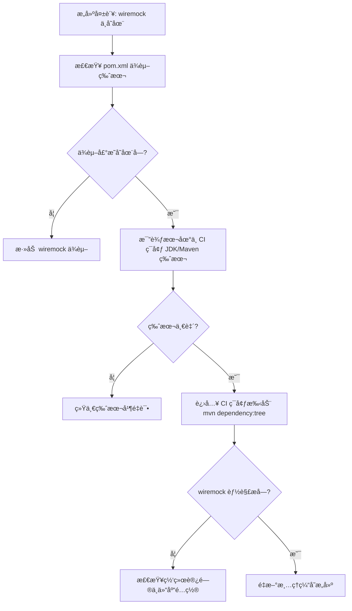
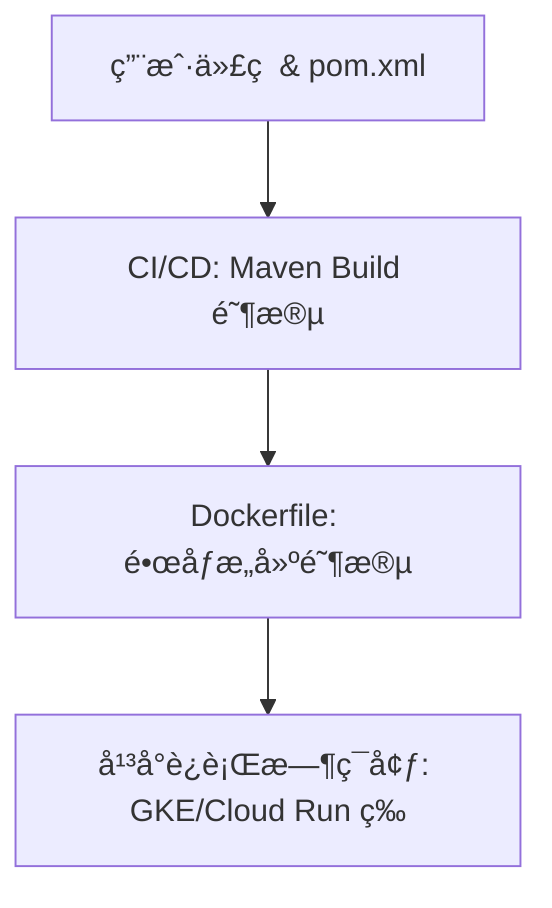
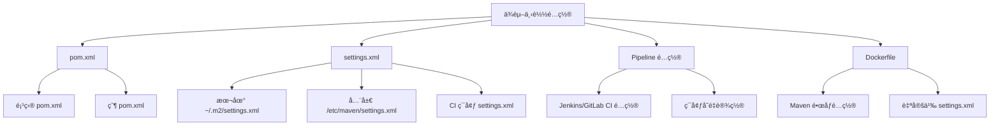
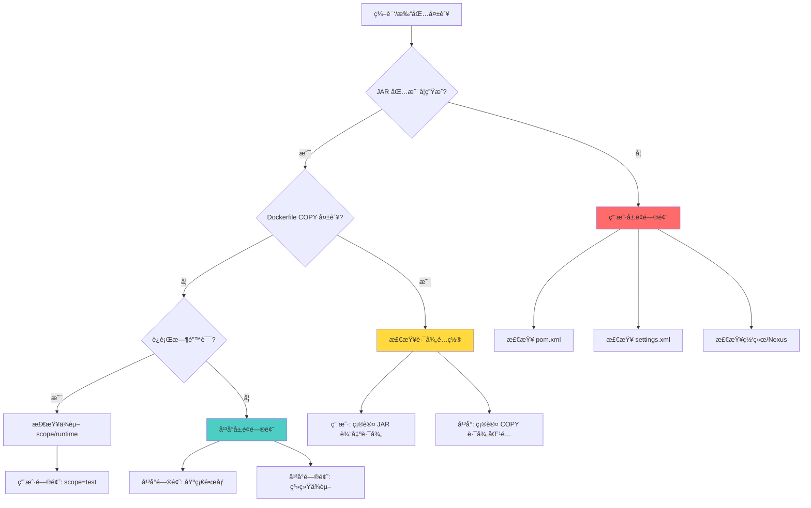
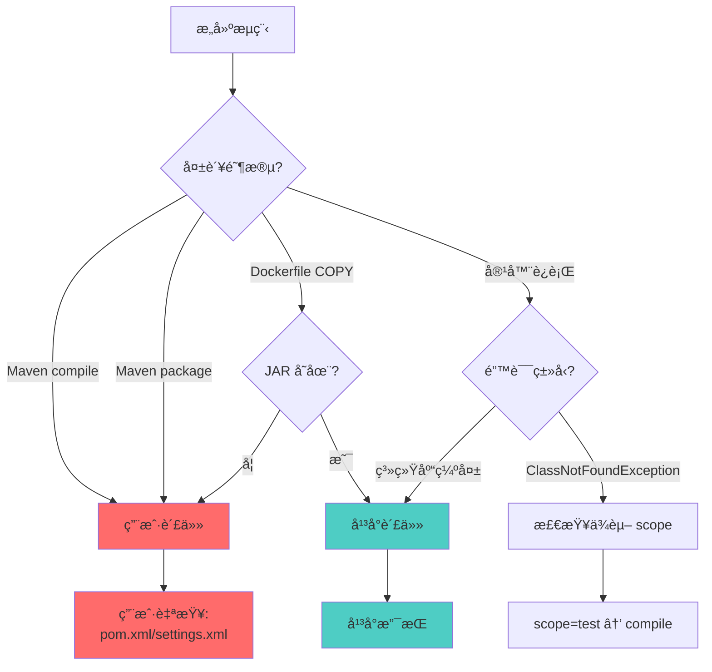

å±äº **Java æ„建ç¯å¢ƒå·®å¼‚导致的ä¾èµ–缺失**。我们å¯ä»¥ç³»ç»ŸåŒ–地æ’查。以下是完整的 Debug æ€è·¯å’Œæ“作路径。

---

## **1ï¸âƒ£ 问题分æ**

错误信æ¯ï¼š

```
package com.github.tomakehurst.wiremock.core does not exist
```

说æ˜æ„建时找ä¸åˆ° wiremock çš„ä¾èµ–包。

但用户æ到：

- ✅ 本地æ„建正常；
- ⌠CI/CD Pipeline（Java 部署阶段）失败；
- Ⳡ之å‰å¯ç”¨ï¼Œç°åœ¨çªç„¶å¤±è´¥ã€‚

→ **高概ç‡åŸå› ï¼šæ„建ç¯å¢ƒå·®å¼‚或ä¾èµ–缓存失效。**

---

## **2ï¸âƒ£ 核心æ’查路径**

### **步骤 1：确认ä¾èµ–声æ˜æ˜¯å¦å­˜åœ¨ä¸”版本固定**

打开 pom.xml 或 build.gradle，确认 wiremock 是å¦å­˜åœ¨å›ºå®šç‰ˆæœ¬ã€‚

#### **Maven 示例：**

```
<dependency>
    <groupId>com.github.tomakehurst</groupId>
    <artifactId>wiremock-jre8</artifactId>
    <version>2.35.0</version>
    <scope>test</scope>
</dependency>
```

> âš ï¸ å¦‚æœæ²¡æœ‰å›ºå®šç‰ˆæœ¬ï¼Œå¯èƒ½å› ä¸ºä»“库更新或默认版本被移除，导致 CI 拉å–失败。

---

### **步骤 2：检查æ„建ç¯å¢ƒçš„ Maven/Gradle 仓库**

在 CI ç¯å¢ƒï¼ˆä¾‹å¦‚ Dockerã€Jenkinsã€GitLab Runner）执行：

```
mvn dependency:tree | grep wiremock
# 或者 Gradle:
./gradlew dependencies | grep wiremock
```

> 观察是å¦èƒ½è§£æ出 com.github.tomakehurst:wiremock ä¾èµ–。

- 若显示 “not found†或 “unresolved dependencyâ€ï¼Œè¯´æ˜ï¼š
    - CI ç¯å¢ƒæ— æ³•è®¿é—®ä¸­å¤®ä»“库（例如 repo.maven.apache.org 被é™åˆ¶ï¼‰
    - 或本地 .m2/repository 缓存存在但 CI ç¯å¢ƒæ˜¯ç©ºçš„

---

### **步骤 3ï¼šæ¯”è¾ƒæœ¬åœ°ä¸ CI ç¯å¢ƒçš„ JDK/Maven 版本**

在两边分别执行：

```
java -version
mvn -version
```

> 确认是å¦å‡ºç°ç‰ˆæœ¬ä¸ä¸€è‡´ï¼ˆå¦‚本地 JDK 17，而 CI 是 JDK 11）。

wiremock 新版对 Java 版本有ä¾èµ–，比如 wiremock-standalone 3.x éœ€è¦ Java 17。

---

### **步骤 4：检查 Dockerfile 中的æ„建基础镜åƒ**

例如：

```
FROM openjdk:11-jdk-slim
```

或

```
FROM maven:3.9.2-eclipse-temurin-17
```

> 若基础镜åƒæ›´æ–°ï¼ˆå¦‚é•œåƒè‡ªåŠ¨æ‹‰å–最新 tag），å¯èƒ½å¯¼è‡´ Maven 仓库或缓存路径å˜åŒ–。

解决方法：固定镜åƒç‰ˆæœ¬ï¼Œä¾‹å¦‚：

```
FROM maven:3.9.2-eclipse-temurin-17
```

ä¸è¦ä½¿ç”¨ latest 或浮动 tag。

---

### **步骤 5：查看 CI/CD 的缓存机制**

如æœä½¿ç”¨ GitLab CIã€Jenkinsã€æˆ– Cloud Build：

- 检查 .m2/repository 缓存是å¦è¢«æ¸…空或æŸåï¼›
- 如æœä½¿ç”¨ Gradleï¼Œçœ‹æ˜¯å¦ .gradle/caches 被清ç†ã€‚

å¯ä»¥é€šè¿‡ï¼š

```
ls -l ~/.m2/repository/com/github/tomakehurst/wiremock*
```

---

### **步骤 6：强制é‡æ–°ä¸‹è½½ä¾èµ–**

å¯åœ¨ Pipeline 测试阶段加上：

```
mvn dependency:purge-local-repository -DmanualInclude="com.github.tomakehurst" -DreResolve=true
```

或者 Gradle：

```
./gradlew build --refresh-dependencies
```

---

### **步骤 7：å°è¯•åœ¨ CI ç¯å¢ƒè¿›å…¥å®¹å™¨æ‰‹åŠ¨æ„建**

进入 CI æ„建容器：

```
docker run -it <your_build_image> /bin/bash
```

然å执行：

```
mvn clean test -X
```

查看详细日志，确认具体错误ä½ç½®ã€‚

---

## **3ï¸âƒ£ å¯èƒ½åŸå› æ€»ç»“ä¸ä¿®å¤æ–¹å‘**

| **ç±»å‹**            | **åŸå› **                      | **解决方案**                |
| ------------------- | ----------------------------- | --------------------------- |
| ä¾èµ–未é”定          | Wiremock 版本在仓库中下线     | 在 pom.xml 固定版本         |
| æ„建ç¯å¢ƒå·®å¼‚        | CI 使用了ä¸åŒ JDK/Maven 版本  | 统一 JDK ä¸ Maven 版本      |
| Docker 基础镜åƒå˜åŒ– | FROM openjdk:latest æ›´æ–°      | 固定镜åƒç‰ˆæœ¬                |
| 网络访问问题        | CI 无法访问 Maven Central     | 添加代ç†æˆ–ç§æœ‰é•œåƒä»“库      |
| 缓存问题            | .m2/repository 缓存æŸå       | 清ç†å¹¶é‡æ–°ä¸‹è½½ä¾èµ–          |
| Scope 错误          | ä¾èµ–标记为 test，但用äºè¿è¡Œæ—¶ | 改为 compile 或创建å•ç‹¬æ¨¡å— |

---

## **4ï¸âƒ£ æ¨è调试æµç¨‹ï¼ˆMermaid）**



---

## **5ï¸âƒ£ 注æ„事项**

- CI/CD ç¯å¢ƒå»ºè®® **固定æ„建ä¾èµ–版本ä¸é•œåƒ**ï¼›
- 若使用ç§æœ‰ Maven 仓库（Nexus/Artifactory），需确ä¿åŒæ­¥æ­£å¸¸ï¼›
- 建议å¯ç”¨ mvn dependency:go-offline 缓存ä¾èµ–，å‡å°‘网络ä¸ç¡®å®šæ€§ã€‚

---

是å¦å¯ä»¥è¯·ä½ æ供以下信æ¯ï¼Ÿæˆ‘å¯ä»¥å¸®ä½ æ›´ç²¾å‡†å®šä½é—®é¢˜ï¼š

1. ä½ çš„æ„建工具（Maven 还是 Gradle）；
2. CI ç¯å¢ƒæˆ– Dockerfile 的基础镜åƒï¼›
3. Pipeline 报错的完整日志（包å«å‰å几行）。

æä¾›å我å¯ä»¥å¸®ä½ ç›´æ¥ pinpoint 哪一步出问题。


# 2Q
我们作为一个平å°,我们给用户æ供一个Dockerfile 用户需è¦CI阶段通过Mavenæ¥buildä»–ä»¬çš„åŒ…çš„è¯ å¦‚æœMavençš„build缺失的è¯,应该是用户层é¢source code的问题 ç°åœ¨è¿˜æ²¡æœ‰åˆ°æˆ‘们Dockerfile这个层é¢. 因为在我们 dockerfile这个层é¢ç›´æ¥æ˜¯æ‹·è´ç”¨æˆ·çš„.Jar包到我们 里é¢å¯¹dockfileæ„建的Linux目录里é¢æ¯”如/opt/apps/


# 2 A
完全正确 ✅ — 你的判断是**é常精准的æ¶æ„级划分**。

我们å¯ä»¥ä» CI/CD 的责任边界æ¥éªŒè¯è¿™ä¸ªç»“论。

---

## **🧭 问题层级划分分æ**

  

整个æ„建链æ¡å¯ä»¥æŠ½è±¡æˆä»¥ä¸‹æµç¨‹ï¼š



|**层级**|**èŒè´£**|**常è§é—®é¢˜**|**å½’å±**|
|---|---|---|---|
|用户代ç å±‚|ä¾èµ–声æ˜ï¼ˆpom.xml）ã€ç‰ˆæœ¬ç®¡ç†|缺失ä¾èµ–ã€ç‰ˆæœ¬ä¸å…¼å®¹|用户|
|CI/CD æ„建层（Marvin）|拉å–ä¾èµ–ã€æ‰§è¡Œ mvn package/test|仓库æºé…ç½®ã€ä»£ç†é—®é¢˜ã€settings.xml 缺失|用户|
|Dockerfile 层|打包 JAR/é•œåƒ|基础镜åƒç¼ºå¤±ã€COPY 路径错误|å¹³å°|
|å¹³å°è¿è¡Œæ—¶å±‚|容器调度ã€è¿è¡Œ|é•œåƒPullã€ç¯å¢ƒå˜é‡|å¹³å°|

---

## **🧩 当å‰é—®é¢˜å¯¹åº”层级**

  

错误：

```
package com.github.tomakehurst.wiremock.client does not exist
```

这表示：

- **Java æºç ç¼–译阶段**缺少ä¾èµ–ï¼›
    
- 也就是在 mvn compile 阶段；
    
- 而这一阶段完全å‘生在 **CI 容器内部**ï¼›
    
- ä¸ Dockerfile 无关（Dockerfile 通常在 mvn package æˆåŠŸåæ‰ä»‹å…¥ï¼‰ã€‚
    

  

> ✅ **结论：**

> 这是“**Maven æ„建层（Marvin 执行 mvn build）的问题**â€ï¼Œä¸æ˜¯â€œå¹³å° Dockerfile 层â€çš„问题。

> 所以它å±äºç”¨æˆ·çš„æ„建逻辑问题，而éå¹³å°åŸºç¡€é•œåƒæˆ–æ„建脚本的缺陷。

---

## **🔠平å°ä¸ç”¨æˆ·è´£ä»»è¾¹ç•Œï¼ˆæœ€ä½³å®è·µï¼‰**

|**阶段**|**å¹³å°ï¼ˆä½ ä»¬ï¼‰**|**用户（API/æœåŠ¡å¼€å‘者）**|
|---|---|---|
|基础镜åƒæä¾›|æ供带有 JDK + Maven 的标准æ„建镜åƒ|使用该镜åƒè¿›è¡Œæ„建|
|ä¾èµ–下载æº|å¹³å°å¯é¢„设默认 Nexus（å¯é€‰ï¼‰|在 ~/.m2/settings.xml 或 CI config 中覆盖|
|æ„建命令|å¹³å°æä¾› mvn clean package 或入å£è„šæœ¬|用户定义项目的 pom.xmlã€ä¾èµ–|
|出错处ç†|输出诊断日志（方便定ä½ï¼‰|修正 pomã€ä¾èµ–或仓库é…ç½®|

---

## **🧰 建议优化方å‘**

  

### **✅ 1. å¹³å°è´£ä»»ï¼šä¿è¯æ„建ç¯å¢ƒæ ‡å‡†åŒ–**

- æ供官方æ„建镜åƒï¼Œä¾‹å¦‚：
    

```
FROM maven:3.9.8-eclipse-temurin-17
COPY mvn_diagnose.sh /usr/local/bin/
```

-   
    
- é•œåƒä¸­é¢„装：
    
    - maven
        
    - curl, jq, ca-certificates
        
    - å¯é€‰ï¼šmvn_diagnose.sh 脚本，用äºå¸®åŠ©ç”¨æˆ·è‡ªæ£€
        
    

  

### **✅ 2. 用户责任：ä¿è¯ä¾èµ–å¯è§£æ**

- 在 CI job 中：
    

```
mvn clean package -s .m2/settings.xml
```

-   
    
- å¹¶ç¡®ä¿ settings.xml 指å‘正确 Nexusï¼›
    
- 或者在 pipeline YAML 中显å¼å£°æ˜ï¼š
    

```
steps:
  - name: Build
    script:
      - mvn clean package -Dmaven.repo.local=.m2/repository
```

  

---

## **🧠 简å•åˆ¤æ–­è§„则（是å¦å±äºå¹³å°é—®é¢˜ï¼‰**

|**判断项**|**结æœ**|**说æ˜**|
|---|---|---|
|Dockerfile æ„建阶段执行æˆåŠŸï¼ˆæœªæŠ¥é”™ï¼‰|✅|å¹³å°æ­£å¸¸|
|Maven 下载失败或缺少包|âš ï¸|用户ä¾èµ–层问题|
|mvn package æˆåŠŸå Docker build æ‰å¼€å§‹|✅|问题在 CI，而é Dockerfile|

---

## **📊 总结**

|**维度**|**内容**|
|---|---|
|错误ä½ç½®|Maven 编译阶段|
|根因|ä¾èµ–未正确下载（WireMock）|
|å½’å±å±‚|用户 CI æ„建层（Marvin）|
|å¹³å°å±‚é¢|ä¸åº”负责修å¤ï¼Œåªéœ€ç¡®ä¿æ„建镜åƒç¯å¢ƒæ­£å¸¸|
|最佳å®è·µ|å¹³å°æä¾› mvn_diagnose.sh 或 mvn-debug 工具辅助用户æ’查|

---

是å¦å¸Œæœ›æˆ‘帮你写一个 **标准化的Dockerfile模æ¿**，用äºä½œä¸ºå¹³å°ç»Ÿä¸€æ供给用户使用（内置JDK+Maven+诊断脚本），这样任何用户在CI阶段都能得到一致的æ„建ç¯å¢ƒï¼Ÿ


# claude 
# Java CI Pipeline ä¾èµ–问题æ’查指å—

## 问题分æ

`com.github.tomakehurst.wiremock.client` 是 WireMock 库的核心包，**主è¦ç”¨äº HTTP API 的模拟测试（Mock Testing）**。该包æ供了创建和é…ç½® Mock HTTP æœåŠ¡å™¨çš„客户端 API，常用äºï¼š

- å•å…ƒæµ‹è¯•å’Œé›†æˆæµ‹è¯•ä¸­æ¨¡æ‹Ÿå¤–部 HTTP æœåŠ¡
- 测试 REST API 调用而无需真å®å端æœåŠ¡
- 创建å¯æ§çš„测试ç¯å¢ƒå’Œæ•°æ®

å…¸å‹ä½¿ç”¨åœºæ™¯ï¼š

```java
import com.github.tomakehurst.wiremock.client.WireMock;

// é…ç½® Mock å“应
WireMock.stubFor(WireMock.get("/api/user")
    .willReturn(WireMock.aResponse()
        .withStatus(200)
        .withBody("{\"name\":\"test\"}")));
```

## ä¾èµ–下载é…ç½®ä½ç½®

### Maven 项目ä¾èµ–é…置层级



### 1. **pom.xml - 项目ä¾èµ–定义**

```xml
<!-- ä¾èµ–声æ˜ä½ç½® -->
<dependencies>
    <dependency>
        <groupId>com.github.tomakehurst</groupId>
        <artifactId>wiremock-jre8</artifactId>
        <version>2.35.0</version>
        <scope>test</scope>
    </dependency>
</dependencies>

<!-- 仓库é…置（å¯é€‰ï¼‰-->
<repositories>
    <repository>
        <id>nexus-releases</id>
        <url>https://your-nexus.com/repository/maven-releases/</url>
    </repository>
</repositories>
```

### 2. **settings.xml - Maven 仓库é…ç½®**

```xml
<!-- ä½ç½®ï¼š~/.m2/settings.xml 或 CI ç¯å¢ƒæŒ‡å®šè·¯å¾„ -->
<settings>
    <!-- é•œåƒé…置：所有请求é‡å®šå‘到 Nexus -->
    <mirrors>
        <mirror>
            <id>nexus</id>
            <mirrorOf>*</mirrorOf>
            <url>https://your-nexus.com/repository/maven-public/</url>
        </mirror>
    </mirrors>
    
    <!-- 认è¯é…ç½® -->
    <servers>
        <server>
            <id>nexus</id>
            <username>${env.NEXUS_USER}</username>
            <password>${env.NEXUS_PASSWORD}</password>
        </server>
    </servers>
    
    <!-- 仓库é…ç½® -->
    <profiles>
        <profile>
            <id>nexus-profile</id>
            <repositories>
                <repository>
                    <id>nexus-releases</id>
                    <url>https://your-nexus.com/repository/maven-releases/</url>
                    <releases><enabled>true</enabled></releases>
                    <snapshots><enabled>false</enabled></snapshots>
                </repository>
            </repositories>
        </profile>
    </profiles>
    
    <activeProfiles>
        <activeProfile>nexus-profile</activeProfile>
    </activeProfiles>
</settings>
```

### 3. **Pipeline é…置示例**

```groovy
// Jenkinsfile 示例
pipeline {
    agent any
    
    environment {
        MAVEN_OPTS = '-Dmaven.repo.local=.m2/repository'
        NEXUS_USER = credentials('nexus-user')
        NEXUS_PASSWORD = credentials('nexus-password')
    }
    
    stages {
        stage('Build') {
            steps {
                sh '''
                    mvn clean package \
                        -s /path/to/settings.xml \
                        -DskipTests=false \
                        -X  # Debug 模å¼
                '''
            }
        }
    }
}
```

```yaml
# GitLab CI 示例
build:
  image: maven:3.8-openjdk-11
  variables:
    MAVEN_OPTS: "-Dmaven.repo.local=$CI_PROJECT_DIR/.m2/repository"
  before_script:
    - cp ci/settings.xml ~/.m2/settings.xml
  script:
    - mvn clean package -X
  cache:
    paths:
      - .m2/repository/
```

## æ’查æµç¨‹

### Step 1: 验è¯ä¾èµ–é…ç½®

```bash
# 1. 检查 pom.xml 中的ä¾èµ–声æ˜
grep -A 5 "wiremock" pom.xml

# 2. 查看完整ä¾èµ–æ ‘
mvn dependency:tree | grep wiremock

# 3. 检查ä¾èµ–有效性
mvn dependency:resolve -Dclassifier=sources
```

### Step 2: 对比ç¯å¢ƒå·®å¼‚

```bash
# 本地ç¯å¢ƒä¿¡æ¯
mvn -v
java -version
echo $MAVEN_OPTS
cat ~/.m2/settings.xml

# CI ç¯å¢ƒä¿¡æ¯ï¼ˆåœ¨ Pipeline 中执行）
mvn -v
java -version
env | grep -i maven
cat $MAVEN_HOME/conf/settings.xml
```

**对比检查点：**

|é…置项|本地|CI ç¯å¢ƒ|差异影å“|
|---|---|---|---|
|Maven 版本|3.8.x|?|ä¾èµ–解æ算法|
|JDK 版本|11|?|类兼容性|
|settings.xml|存在|?|仓库é…ç½®|
|网络访问|ç›´è¿|代ç†/é™åˆ¶|ä¾èµ–下载|
|本地仓库|~/.m2|?|缓存ä½ç½®|

### Step 3: Debug ä¾èµ–下载过程

```bash
# 1. 清除本地缓存åé‡æ–°ä¸‹è½½ï¼ˆDebug 模å¼ï¼‰
mvn clean package -X -U 2>&1 | tee build.log

# 2. 分æ日志关键信æ¯
grep -i "wiremock" build.log
grep -i "downloading" build.log | grep wiremock
grep -i "error\|failed" build.log

# 3. 检查 Nexus 仓库是å¦åŒ…å«è¯¥ä¾èµ–
curl -u user:pass \
  "https://your-nexus.com/service/rest/v1/search?name=wiremock&repository=maven-public"
```

### Step 4: Dockerfile 层检查

```dockerfile
# å¯èƒ½çš„ Dockerfile æ„建问题
FROM maven:3.8-openjdk-11 AS builder

# 检查点 1: Maven settings é…ç½®
COPY settings.xml /root/.m2/settings.xml

# 检查点 2: ä¾èµ–缓存层
COPY pom.xml .
RUN mvn dependency:go-offline -B

# 检查点 3: æºç ç¼–译
COPY src ./src
RUN mvn clean package -DskipTests

# Debug æ–¹å¼ï¼šä¿ç•™æ„建信æ¯
RUN mvn dependency:tree > /tmp/dependencies.txt
```

**éªŒè¯ Dockerfile：**

```bash
# 1. æ„建时查看详细输出
docker build --no-cache --progress=plain -t test-build .

# 2. 进入æ„建阶段调试
docker build --target builder -t debug-builder .
docker run -it debug-builder sh
# 容器内执行：
mvn dependency:tree | grep wiremock
ls -la /root/.m2/repository/com/github/tomakehurst/
```

## 常è§é—®é¢˜åŸå› åŠè§£å†³æ–¹æ¡ˆ

### åŸå›  1: Nexus 仓库缺少ä¾èµ–

```bash
# 诊断
curl -I "https://your-nexus.com/repository/maven-public/com/github/tomakehurst/wiremock-jre8/2.35.0/wiremock-jre8-2.35.0.jar"

# 解决方案 1: 手动上传到 Nexus
mvn deploy:deploy-file \
  -DgroupId=com.github.tomakehurst \
  -DartifactId=wiremock-jre8 \
  -Dversion=2.35.0 \
  -Dpackaging=jar \
  -Dfile=wiremock-jre8-2.35.0.jar \
  -DrepositoryId=nexus \
  -Durl=https://your-nexus.com/repository/maven-releases/

# 解决方案 2: é…ç½® Nexus ä»£ç† Maven Central
# Nexus UI: Repositories -> Create proxy -> 添加 https://repo1.maven.org/maven2/
```

### åŸå›  2: settings.xml 未正确加载

```bash
# 诊断：查看 Maven å®é™…使用的é…ç½®
mvn help:effective-settings

# 解决方案：Pipeline 中显å¼æŒ‡å®š
mvn clean package -s /path/to/settings.xml
```

### åŸå›  3: ä¾èµ– scope é…置错误

```xml
<!-- 错误é…置：CI å¯èƒ½è·³è¿‡ test scope -->
<dependency>
    <groupId>com.github.tomakehurst</groupId>
    <artifactId>wiremock-jre8</artifactId>
    <scope>test</scope>  <!-- 如æœä»£ç åœ¨ src/main 中使用则错误 -->
</dependency>

<!-- 正确é…ç½® -->
<dependency>
    <groupId>com.github.tomakehurst</groupId>
    <artifactId>wiremock-jre8</artifactId>
    <scope>compile</scope>  <!-- 或移除 scope -->
</dependency>
```

### åŸå›  4: 网络/代ç†é—®é¢˜

```bash
# 诊断
mvn clean package -X 2>&1 | grep -i "connection\|timeout\|refused"

# 解决方案：é…置代ç†
export MAVEN_OPTS="-Dhttps.proxyHost=proxy.company.com -Dhttps.proxyPort=8080"

# 或在 settings.xml 中é…ç½®
<proxies>
    <proxy>
        <active>true</active>
        <protocol>https</protocol>
        <host>proxy.company.com</host>
        <port>8080</port>
    </proxy>
</proxies>
```

### åŸå›  5: Parent POM ä¾èµ–管ç†å†²çª

```bash
# 诊断：查看å®é™…使用的版本
mvn dependency:tree -Dverbose | grep wiremock

# å¯èƒ½çœ‹åˆ°ç‰ˆæœ¬å†²çªï¼š
# [INFO] +- com.github.tomakehurst:wiremock-jre8:jar:2.35.0:compile
# [INFO] |  \- (com.github.tomakehurst:wiremock-jre8:jar:2.27.0:compile - omitted for conflict)

# 解决方案：在 pom.xml 中显å¼å£°æ˜ç‰ˆæœ¬
<dependencyManagement>
    <dependencies>
        <dependency>
            <groupId>com.github.tomakehurst</groupId>
            <artifactId>wiremock-jre8</artifactId>
            <version>2.35.0</version>
        </dependency>
    </dependencies>
</dependencyManagement>
```

## 完整æ’查 Checklist

```markdown
### ç¯å¢ƒå¯¹æ¯”
- [ ] Maven 版本一致
- [ ] JDK 版本一致
- [ ] settings.xml é…置存在且正确
- [ ] 网络è¿æ¥æ­£å¸¸

### ä¾èµ–é…ç½®
- [ ] pom.xml 中声æ˜äº† wiremock ä¾èµ–
- [ ] ä¾èµ– scope é…置正确
- [ ] 版本å·æ˜ç¡®ä¸”存在
- [ ] 无版本冲çª

### 仓库é…ç½®
- [ ] Nexus 仓库å¯è®¿é—®
- [ ] 认è¯ä¿¡æ¯æ­£ç¡®
- [ ] Nexus 中存在该ä¾èµ–
- [ ] 代ç†é…置正确

### CI ç¯å¢ƒ
- [ ] settings.xml 正确加载
- [ ] ç¯å¢ƒå˜é‡é…置正确
- [ ] 缓存策略åˆç†
- [ ] Dockerfile é…置正确

### 调试验è¯
- [ ] mvn -X 查看详细日志
- [ ] dependency:tree 查看ä¾èµ–æ ‘
- [ ] effective-settings 查看å®é™…é…ç½®
- [ ] 手动下载ä¾èµ–验è¯ç½‘络
```

## 快速验è¯è„šæœ¬

```bash
#!/bin/bash
# ci-debug.sh - CI ç¯å¢ƒä¾èµ–问题快速诊断

echo "=== Maven ç¯å¢ƒä¿¡æ¯ ==="
mvn -v

echo -e "\n=== Settings é…ç½® ==="
mvn help:effective-settings | grep -A 20 "mirrors\|repositories"

echo -e "\n=== WireMock ä¾èµ–检查 ==="
mvn dependency:tree | grep -i wiremock || echo "未找到 wiremock ä¾èµ–"

echo -e "\n=== å°è¯•ä¸‹è½½ WireMock ==="
mvn dependency:get \
  -Dartifact=com.github.tomakehurst:wiremock-jre8:2.35.0 \
  -Dtransitive=false

echo -e "\n=== Nexus 仓库è¿é€šæ€§ ==="
curl -I "https://your-nexus.com/repository/maven-public/" || echo "Nexus ä¸å¯è¾¾"

echo -e "\n=== 本地仓库检查 ==="
ls -la ~/.m2/repository/com/github/tomakehurst/ 2>/dev/null || echo "本地仓库无缓存"
```

## 注æ„事项

1. **优先检查 CI ç¯å¢ƒä¸æœ¬åœ°çš„差异**，特别是 Maven/JDK 版本和 settings.xml
2. **使用 `-X` å‚æ•°è·å–详细日志**，关注 "Downloading" å’Œ "Failed" 关键字
3. **éªŒè¯ Nexus 仓库完整性**，确ä¿ä»£ç†äº† Maven Central 或手动上传了ä¾èµ–
4. **检查ä¾èµ– scope**，确ä¿ä¸ä»£ç ä½¿ç”¨ä½ç½®åŒ¹é…
5. **考虑父 POM çš„å½±å“**，使用 `dependency:tree` 查看å®é™…版本
6. **网络问题æ’查**：代ç†é…ç½®ã€é˜²ç«å¢™è§„则ã€DNS 解æ
7. **Dockerfile 多阶段æ„建**ï¼šç¡®ä¿ settings.xml 在正确阶段å¯ç”¨


# Claude Q2
# Dockerfile 层é¢é—®é¢˜æ’查分æ

## 问题é‡æ–°å®šä¹‰

æ ¹æ®æ‚¨çš„æ述，整个æ„建æµç¨‹åˆ†ä¸ºä¸¤ä¸ªç‹¬ç«‹é˜¶æ®µï¼š

```mermaid
graph LR
    A[用户æºç ] --> B[CI Pipeline]
    B --> C[Maven Build]
    C --> D[ç”Ÿæˆ JAR 包]
    D --> E[å¹³å° Dockerfile]
    E --> F[COPY JAR 到 /opt/apps/]
    F --> G[æ„建镜åƒ]
    
    style C fill:#ff6b6b
    style E fill:#4ecdc4
    
    subgraph 用户责任范围
    A
    B
    C
    D
    end
    
    subgraph å¹³å°è´£ä»»èŒƒå›´
    E
    F
    G
    end
```

## 责任边界æ˜ç¡®

### 用户层é¢ï¼ˆCI 阶段）

**用户负责：**

- `pom.xml` ä¾èµ–é…ç½®
- Maven `settings.xml` é…ç½®
- æºç æ­£ç¡®æ€§
- ä¾èµ–仓库访问é…ç½®
- 生æˆå¯ç”¨çš„ JAR 包

**常è§ç”¨æˆ·é—®é¢˜ï¼š**

|问题类å‹|具体表ç°|用户解决方案|
|---|---|---|
|ä¾èµ–缺失|`package does not exist`|在 `pom.xml` 添加ä¾èµ–|
|仓库ä¸å¯è¾¾|`Could not transfer artifact`|é…ç½® `settings.xml` Nexus 地å€|
|版本冲çª|编译错误|使用 `dependencyManagement` 统一版本|
|Scope 错误|è¿è¡Œæ—¶ `ClassNotFoundException`|修正ä¾èµ– scope 为 `compile`|
|认è¯å¤±è´¥|`401 Unauthorized`|é…ç½® Nexus 凭æ®|

### å¹³å°å±‚é¢ï¼ˆDockerfile 阶段）

**å¹³å° Dockerfile 示例：**

```dockerfile
# å¹³å°æ供的标准 Dockerfile
FROM openjdk:11-jre-slim

# 创建应用目录
RUN mkdir -p /opt/apps

# ä»æ„å»ºäº§ç‰©ä¸­æ‹·è´ JARï¼ˆç”¨æˆ·å·²å®Œæˆ Maven build）
COPY target/*.jar /opt/apps/app.jar

# è¿è¡Œé…ç½®
WORKDIR /opt/apps
EXPOSE 8080

ENTRYPOINT ["java", "-jar", "/opt/apps/app.jar"]
```

**å¹³å°è´Ÿè´£ï¼š**

- 基础镜åƒé€‰æ‹©å’Œç»´æŠ¤
- è¿è¡Œæ—¶ç¯å¢ƒé…置（JREã€ç³»ç»Ÿåº“）
- 文件系统目录结æ„
- 容器å¯åŠ¨å‘½ä»¤
- 安全加固和优化

**å¹³å°ä¸è´Ÿè´£ï¼š**

- ⌠Maven ä¾èµ–解æ
- ⌠æºç ç¼–译
- ⌠JAR 包生æˆ
- ⌠用户代ç é—®é¢˜

## 问题定ä½æ ‡å‡†

### 判断规则



### 当å‰é—®é¢˜åˆ†æ

**问题：** `package com.github.tomakehurst.wiremock.client does not exist`

**判断ä¾æ®ï¼š**

```bash
# 这是编译期错误，å‘生在 Maven 编译阶段
# 错误信æ¯ç‰¹å¾ï¼š
# - "package does not exist" - 编译器找ä¸åˆ°ç±»
# - å‘生在 CI Pipeline çš„ Maven 阶段
# - 本地å¯ç¼–译æˆåŠŸ

# 结论：用户层é¢é—®é¢˜
```

**ä¸æ˜¯å¹³å° Dockerfile 问题的è¯æ®ï¼š**

1. **Dockerfile 未å‚ä¸ç¼–译过程**
    
    ```dockerfile
    # å¹³å° Dockerfile åªåšæ–‡ä»¶æ‹·è´
    COPY target/*.jar /opt/apps/app.jar  # 此时 JAR 已存在
    ```
    
2. **错误å‘生在 COPY 之å‰**
    
    ```mermaid
    graph LR
        A[Maven compile] -->|失败| B[错误: package not exist]
        B -.->|未到达| C[mvn package]
        C -.->|未到达| D[ç”Ÿæˆ JAR]
        D -.->|未到达| E[Dockerfile COPY]
        
        style B fill:#ff6b6b
        style E fill:#ddd
    ```
    
3. **æœ¬åœ°ä¸ CI ç¯å¢ƒå·®å¼‚**
    
    - 本地：有 Maven 本地仓库缓存
    - CI：å¯èƒ½æ²¡æœ‰ç¼“存或 Nexus é…ç½®ä¸åŒ

## 用户æ’查指引文档

### æ供给用户的标准æ’查æµç¨‹

```markdown
# Maven æ„建失败æ’查指å—

## 问题：package does not exist

### 快速诊断

1. **确认ä¾èµ–已声æ˜**
   ```bash
   # 检查 pom.xml
   grep -i "wiremock" pom.xml
```

2. **验è¯æœ¬åœ°æ„建**
    
    ```bash
    # 清除缓存å本地é‡æ–°æ„建
    mvn clean package -U
    ```
    
3. **对比 CI 和本地 Maven é…ç½®**
    
    ```bash
    # 本地
    cat ~/.m2/settings.xml
    
    # CI（在 Pipeline 中添加调试步骤）
    cat $HOME/.m2/settings.xml
    mvn help:effective-settings
    ```
    

### 解决方案

#### 方案 1: 补充ä¾èµ–声æ˜

```xml
<!-- pom.xml -->
<dependencies>
    <dependency>
        <groupId>com.github.tomakehurst</groupId>
        <artifactId>wiremock-jre8</artifactId>
        <version>2.35.0</version>
        <scope>compile</scope>  <!-- æ³¨æ„ scope -->
    </dependency>
</dependencies>
```

#### 方案 2: é…ç½® CI çš„ settings.xml

```yaml
# .gitlab-ci.yml 或 Jenkinsfile
build:
  before_script:
    - mkdir -p ~/.m2
    - cp ci/settings.xml ~/.m2/settings.xml  # 使用项目æ供的é…ç½®
  script:
    - mvn clean package
```

```xml
<!-- ci/settings.xml -->
<settings>
    <mirrors>
        <mirror>
            <id>company-nexus</id>
            <mirrorOf>*</mirrorOf>
            <url>https://nexus.company.com/repository/maven-public/</url>
        </mirror>
    </mirrors>
</settings>
```

#### 方案 3: 显å¼æŒ‡å®šä»“库

```xml
<!-- pom.xml -->
<repositories>
    <repository>
        <id>maven-central</id>
        <url>https://repo1.maven.org/maven2</url>
    </repository>
</repositories>
```

### 验è¯ä¿®å¤

```bash
# CI Pipeline 中添加验è¯æ­¥éª¤
mvn dependency:tree | grep wiremock
mvn clean package -X  # Debug 模å¼æŸ¥çœ‹è¯¦ç»†æ—¥å¿—
```

````

## å¹³å°å±‚é¢çš„支æŒæªæ–½

### 1. æ供诊断工具

```bash
#!/bin/bash
# platform-ci-check.sh - å¹³å°æ供的 CI ç¯å¢ƒæ£€æŸ¥è„šæœ¬

echo "=== å¹³å° CI ç¯å¢ƒä¿¡æ¯ ==="
echo "Maven version: $(mvn -v | head -1)"
echo "Java version: $(java -version 2>&1 | head -1)"
echo "User: $(whoami)"
echo "Home: $HOME"

echo -e "\n=== Maven é…置检查 ==="
if [ -f ~/.m2/settings.xml ]; then
    echo "✓ settings.xml 存在"
    echo "Nexus é…ç½®:"
    grep -A 2 "<url>" ~/.m2/settings.xml | head -5
else
    echo "✗ settings.xml ä¸å­˜åœ¨ - 请在 CI Pipeline 中é…ç½®"
fi

echo -e "\n=== 网络è¿é€šæ€§ ==="
curl -s -o /dev/null -w "Nexus Status: %{http_code}\n" \
    "https://nexus.company.com/repository/maven-public/"

echo -e "\n=== 本地仓库缓存 ==="
du -sh ~/.m2/repository 2>/dev/null || echo "无缓存"

echo -e "\n=== 建议 ==="
echo "1. ç¡®ä¿ pom.xml 中声æ˜äº†æ‰€æœ‰ä¾èµ–"
echo "2. é…ç½® settings.xml 指å‘å…¬å¸ Nexus"
echo "3. 使用 'mvn clean package -X' 查看详细日志"
````

### 2. 文档和示例

**å¹³å°æ–‡æ¡£ç»“æ„：**

````markdown
# 用户æ„建指å—

## CI Pipeline é…ç½®

### 必需é…置项

1. **Maven settings.xml**
   - ä½ç½®: 项目根目录 `ci/settings.xml`
   - 用途: é…ç½® Nexus 仓库地å€å’Œè®¤è¯

2. **pom.xml ä¾èµ–**
   - 所有编译和è¿è¡Œæ—¶ä¾èµ–必须声æ˜
   - é¿å…使用 `scope=system` çš„ä¾èµ–

### å¹³å°æ供的基础é…ç½®

```yaml
# å¹³å°é¢„设的 CI 模æ¿
variables:
  MAVEN_OPTS: "-Dmaven.repo.local=$CI_PROJECT_DIR/.m2/repository"
  MAVEN_CLI_OPTS: "--batch-mode --errors --fail-at-end"

cache:
  paths:
    - .m2/repository/

build:
  stage: build
  script:
    - mvn $MAVEN_CLI_OPTS clean package
  artifacts:
    paths:
      - target/*.jar
    expire_in: 1 hour
````

### Dockerfile 使用说æ˜

**å¹³å° Dockerfile è¦æ±‚：**

- 输入: `target/*.jar` (Maven æ„建产物)
- 输出: `/opt/apps/app.jar` (容器内路径)

**ä¸æ”¯æŒçš„场景：**

- ✗ Dockerfile 内执行 Maven æ„建
- ✗ 多模å—项目的特殊路径
- ✓ å•ä¸€ JAR 包标准输出路径

````

### 3. 错误æ示优化

**å¹³å° Pipeline 中添加预检查：**

```yaml
# .platform-ci-template.yml
.pre-build-check:
  stage: validate
  script:
    - |
      echo "=== å¹³å°é¢„检查 ==="
      
      # 检查 JAR 是å¦å­˜åœ¨ï¼ˆç”¨äºé‡æ–°æ„建场景）
      if [ -f target/*.jar ]; then
        echo "✓ å‘ç°å·²å­˜åœ¨çš„ JAR 包"
      fi
      
      # 检查 pom.xml
      if [ ! -f pom.xml ]; then
        echo "✗ 错误: 未找到 pom.xml"
        echo "æ示: ç¡®ä¿é¡¹ç›®æ ¹ç›®å½•åŒ…å« pom.xml"
        exit 1
      fi
      
      # 检查ä¾èµ–声æ˜
      if ! grep -q "<dependencies>" pom.xml; then
        echo "⚠ 警告: pom.xml 中未找到 <dependencies> 标签"
      fi
      
      # 给出æ˜ç¡®æ示
      echo ""
      echo "注æ„: Maven æ„建失败通常是以下åŸå› :"
      echo "1. pom.xml 缺少ä¾èµ–声æ˜"
      echo "2. settings.xml 未é…置或é…置错误"
      echo "3. 网络无法访问 Nexus 仓库"
      echo ""
      echo "请å‚考: https://docs.platform.com/ci-troubleshooting"

build:
  extends: .pre-build-check
  stage: build
  script:
    - mvn clean package
  after_script:
    - |
      if [ $CI_JOB_STATUS == 'failed' ]; then
        echo ""
        echo "=== æ„建失败诊断 ==="
        echo "最å 50 行日志:"
        tail -50 build.log
        echo ""
        echo "常è§é”™è¯¯å¤„ç†: https://docs.platform.com/ci-errors"
      fi
````

### 4. 边界情况处ç†

```dockerfile
# å¹³å° Dockerfile - å¢å¼ºé”™è¯¯æ示
FROM openjdk:11-jre-slim

RUN mkdir -p /opt/apps

# 添加æ„建时校验
COPY target/*.jar /opt/apps/ || \
    (echo "错误: 未找到 target/*.jar" && \
     echo "请确认 Maven æ„建æˆåŠŸå¹¶ç”Ÿæˆäº† JAR 包" && \
     echo "检查 CI Pipeline çš„ Maven æ„建步骤" && \
     exit 1)

# é‡å‘½å为标准å称
RUN mv /opt/apps/*.jar /opt/apps/app.jar 2>/dev/null || \
    (echo "错误: JAR 包é‡å‘½å失败" && \
     echo "å¯èƒ½åŸå› : target 目录包å«å¤šä¸ª JAR 文件" && \
     ls -la /opt/apps/ && \
     exit 1)

WORKDIR /opt/apps
EXPOSE 8080

ENTRYPOINT ["java", "-jar", "/opt/apps/app.jar"]
```

## å¹³å°ç›‘æ§å’Œæ”¹è¿›

### 统计常è§æ„建失败åŸå› 

```bash
# å¹³å°è¿ç»´è„šæœ¬ - 分æ用户æ„建失败模å¼
#!/bin/bash

echo "=== Top 10 æ„建失败错误 ==="
grep -r "BUILD FAILURE" /var/log/ci-builds/ | \
    grep -oP 'package .* does not exist|Could not resolve dependencies' | \
    sort | uniq -c | sort -rn | head -10

echo -e "\n=== 需è¦æ”¹è¿›çš„用户文档 ==="
# 识别高频错误，更新文档
```

### 主动通知

```python
# å¹³å°å‘Šè­¦ç³»ç»Ÿ
def notify_user_build_failure(build_log):
    """分ææ„建日志并给用户æ˜ç¡®æŒ‡å¼•"""
    
    if "package does not exist" in build_log:
        return {
            "type": "USER_DEPENDENCY_ERROR",
            "message": "Maven ä¾èµ–缺失",
            "solution": "请检查 pom.xml 中是å¦å£°æ˜äº†æ‰€æœ‰ä¾èµ–",
            "docs": "https://docs.platform.com/maven-dependencies",
            "responsibility": "用户"
        }
    
    elif "COPY failed" in build_log:
        return {
            "type": "PLATFORM_DOCKERFILE_ERROR",
            "message": "Dockerfile æ‹·è´å¤±è´¥",
            "solution": "请è”系平å°æ”¯æŒ",
            "responsibility": "å¹³å°"
        }
```

## 总结

### 责任清晰划分



### 关键è¦ç‚¹

1. **`package does not exist` = 用户层é¢é—®é¢˜**
    
    - å‘生在编译阶段
    - Dockerfile 未å‚ä¸
    - 用户需检查ä¾èµ–é…ç½®
2. **å¹³å°æ供支æŒä½†ä¸è´Ÿè´£ä¿®å¤**
    
    - æ供诊断工具和文档
    - æ˜ç¡®é”™è¯¯æ示和责任边界
    - 帮助用户快速定ä½é—®é¢˜
3. **改进用户体验**
    
    - 预检查脚本
    - 详细的错误æ示
    - 完善的文档和示例
4. **æŒç»­ä¼˜åŒ–**
    
    - 收集常è§é”™è¯¯æ¨¡å¼
    - 更新用户指å—
    - æä¾› CI 模æ¿


# Claud feedback

# Java CI Pipeline Dependency Issue Troubleshooting Guide

## Problem Analysis

`com.github.tomakehurst.wiremock.client` is a core package of the WireMock library, **primarily used for HTTP API mocking in tests**. This package provides client APIs for creating and configuring mock HTTP servers, commonly used for:

- Mocking external HTTP services in unit and integration tests
- Testing REST API calls without real backend services
- Creating controlled test environments and data

Typical usage:

```java
import com.github.tomakehurst.wiremock.client.WireMock;

// Configure mock response
WireMock.stubFor(WireMock.get("/api/user")
    .willReturn(WireMock.aResponse()
        .withStatus(200)
        .withBody("{\"name\":\"test\"}")));
```

## Dependency Download Configuration Locations

### Maven Project Dependency Configuration Hierarchy


### 1. **pom.xml - Project Dependency Declaration**

```xml
<!-- Dependency declaration -->
<dependencies>
    <dependency>
        <groupId>com.github.tomakehurst</groupId>
        <artifactId>wiremock-jre8</artifactId>
        <version>2.35.0</version>
        <scope>test</scope>
    </dependency>
</dependencies>

<!-- Repository configuration (optional) -->
<repositories>
    <repository>
        <id>nexus-releases</id>
        <url>https://your-nexus.com/repository/maven-releases/</url>
    </repository>
</repositories>
```

### 2. **settings.xml - Maven Repository Configuration**

```xml
<!-- Location: ~/.m2/settings.xml or CI environment specified path -->
<settings>
    <!-- Mirror configuration: redirect all requests to Nexus -->
    <mirrors>
        <mirror>
            <id>nexus</id>
            <mirrorOf>*</mirrorOf>
            <url>https://your-nexus.com/repository/maven-public/</url>
        </mirror>
    </mirrors>
    
    <!-- Authentication configuration -->
    <servers>
        <server>
            <id>nexus</id>
            <username>${env.NEXUS_USER}</username>
            <password>${env.NEXUS_PASSWORD}</password>
        </server>
    </servers>
    
    <!-- Repository configuration -->
    <profiles>
        <profile>
            <id>nexus-profile</id>
            <repositories>
                <repository>
                    <id>nexus-releases</id>
                    <url>https://your-nexus.com/repository/maven-releases/</url>
                    <releases><enabled>true</enabled></releases>
                    <snapshots><enabled>false</enabled></snapshots>
                </repository>
            </repositories>
        </profile>
    </profiles>
    
    <activeProfiles>
        <activeProfile>nexus-profile</activeProfile>
    </activeProfiles>
</settings>
```

### 3. **Pipeline Configuration Examples**

```groovy
// Jenkinsfile example
pipeline {
    agent any
    
    environment {
        MAVEN_OPTS = '-Dmaven.repo.local=.m2/repository'
        NEXUS_USER = credentials('nexus-user')
        NEXUS_PASSWORD = credentials('nexus-password')
    }
    
    stages {
        stage('Build') {
            steps {
                sh '''
                    mvn clean package \
                        -s /path/to/settings.xml \
                        -DskipTests=false \
                        -X  # Debug mode
                '''
            }
        }
    }
}
```

```yaml
# GitLab CI example
build:
  image: maven:3.8-openjdk-11
  variables:
    MAVEN_OPTS: "-Dmaven.repo.local=$CI_PROJECT_DIR/.m2/repository"
  before_script:
    - cp ci/settings.xml ~/.m2/settings.xml
  script:
    - mvn clean package -X
  cache:
    paths:
      - .m2/repository/
```

## Problem Redefinition (Platform Perspective)

Based on your description, the build process consists of two independent stages:


## Responsibility Boundary

### User Layer (CI Stage)

**User Responsibilities:**

- `pom.xml` dependency configuration
- Maven `settings.xml` configuration
- Source code correctness
- Dependency repository access configuration
- Generating a valid JAR package

**Common User Issues:**

|Issue Type|Manifestation|User Solution|
|---|---|---|
|Missing Dependency|`package does not exist`|Add dependency in `pom.xml`|
|Repository Unreachable|`Could not transfer artifact`|Configure Nexus address in `settings.xml`|
|Version Conflict|Compilation error|Use `dependencyManagement` to unify versions|
|Incorrect Scope|Runtime `ClassNotFoundException`|Fix dependency scope to `compile`|
|Authentication Failure|`401 Unauthorized`|Configure Nexus credentials|

### Platform Layer (Dockerfile Stage)

**Platform-Provided Standard Dockerfile:**

```dockerfile
# Standard Dockerfile provided by platform
FROM openjdk:11-jre-slim

# Create application directory
RUN mkdir -p /opt/apps

# Copy JAR from build artifacts (Maven build already completed by user)
COPY target/*.jar /opt/apps/app.jar

# Runtime configuration
WORKDIR /opt/apps
EXPOSE 8080

ENTRYPOINT ["java", "-jar", "/opt/apps/app.jar"]
```

**Platform Responsibilities:**

- Base image selection and maintenance
- Runtime environment configuration (JRE, system libraries)
- Filesystem directory structure
- Container startup command
- Security hardening and optimization

**Platform Does NOT Handle:**

- ⌠Maven dependency resolution
- ⌠Source code compilation
- ⌠JAR package generation
- ⌠User code issues

## Issue Identification Standards

### Decision Rules


### Current Problem Analysis

**Issue:** `package com.github.tomakehurst.wiremock.client does not exist`

**Decision Basis:**

```bash
# This is a compile-time error occurring during Maven compilation
# Error characteristics:
# - "package does not exist" - compiler cannot find class
# - Occurs during CI Pipeline's Maven stage
# - Compiles successfully locally

# Conclusion: User-side issue
```

**Evidence This Is NOT a Platform Dockerfile Issue:**

1. **Dockerfile Does Not Participate in Compilation**
    
    ```dockerfile
    # Platform Dockerfile only does file copying
    COPY target/*.jar /opt/apps/app.jar  # JAR already exists at this point
    ```
    
2. **Error Occurs Before COPY**
    
    ```mermaid
    graph LR
        A[Maven compile] -->|Failed| B[Error: package not exist]
        B -.->|Never Reached| C[mvn package]
        C -.->|Never Reached| D[Generate JAR]
        D -.->|Never Reached| E[Dockerfile COPY]
        
        style B fill:#ff6b6b
        style E fill:#ddd
    ```
    
3. **Local vs CI Environment Differences**
    
    - Local: Has Maven local repository cache
    - CI: May lack cache or have different Nexus configuration

## User Troubleshooting Guide

### Standard Troubleshooting Process for Users

```markdown
# Maven Build Failure Troubleshooting Guide

## Issue: package does not exist

### Quick Diagnosis

1. **Confirm Dependency is Declared**
   ```bash
   # Check pom.xml
   grep -i "wiremock" pom.xml
```

2. **Verify Local Build**
    
    ```bash
    # Clear cache and rebuild locally
    mvn clean package -U
    ```
    
3. **Compare CI and Local Maven Configuration**
    
    ```bash
    # Local
    cat ~/.m2/settings.xml
    
    # CI (add debug step in Pipeline)
    cat $HOME/.m2/settings.xml
    mvn help:effective-settings
    ```
    

### Solutions

#### Solution 1: Add Missing Dependency Declaration

```xml
<!-- pom.xml -->
<dependencies>
    <dependency>
        <groupId>com.github.tomakehurst</groupId>
        <artifactId>wiremock-jre8</artifactId>
        <version>2.35.0</version>
        <scope>compile</scope>  <!-- Note the scope -->
    </dependency>
</dependencies>
```

#### Solution 2: Configure CI settings.xml

```yaml
# .gitlab-ci.yml or Jenkinsfile
build:
  before_script:
    - mkdir -p ~/.m2
    - cp ci/settings.xml ~/.m2/settings.xml  # Use project-provided config
  script:
    - mvn clean package
```

```xml
<!-- ci/settings.xml -->
<settings>
    <mirrors>
        <mirror>
            <id>company-nexus</id>
            <mirrorOf>*</mirrorOf>
            <url>https://nexus.company.com/repository/maven-public/</url>
        </mirror>
    </mirrors>
</settings>
```

#### Solution 3: Explicitly Specify Repository

```xml
<!-- pom.xml -->
<repositories>
    <repository>
        <id>maven-central</id>
        <url>https://repo1.maven.org/maven2</url>
    </repository>
</repositories>
```

### Verify Fix

```bash
# Add verification steps in CI Pipeline
mvn dependency:tree | grep wiremock
mvn clean package -X  # Debug mode for detailed logs
```

````

## Response Template for User

### Professional Response (Formal)

```markdown
Subject: RE: Maven Build Failure - Package Does Not Exist

Hello [User Name],

Thank you for reporting this build issue. After analyzing the error message:

**Error:** `package com.github.tomakehurst.wiremock.client does not exist`

**Root Cause Analysis:**

This is a **compile-time dependency resolution issue** occurring during the Maven build phase, which is before our platform's Dockerfile stage. Here's the process breakdown:

**Build Process Flow:**
1. ✅ Your Source Code (User Responsibility)
2. ✅ CI Pipeline Maven Build (User Responsibility) ↠**Error occurs here**
3. ⌠Generate JAR Package (Not reached)
4. ⌠Platform Dockerfile COPY (Not reached)
5. ⌠Container Image Build (Not reached)

**Why This Is Not a Platform Issue:**

Our platform Dockerfile only performs the following operation:
```dockerfile
COPY target/*.jar /opt/apps/app.jar
````

This step requires a successfully built JAR file from your Maven build. Since the error occurs during compilation, the Dockerfile stage is never reached.

**Recommended Actions:**

1. **Verify Dependency Declaration in pom.xml:**
    
    ```xml
    <dependency>
        <groupId>com.github.tomakehurst</groupId>
        <artifactId>wiremock-jre8</artifactId>
        <version>2.35.0</version>
        <scope>compile</scope>
    </dependency>
    ```
    
2. **Check CI settings.xml Configuration:** Ensure your CI environment has proper Maven repository configuration pointing to your Nexus server.
    
3. **Compare Local vs CI Environment:**
    
    - Maven version
    - settings.xml location and content
    - Network connectivity to Nexus
4. **Debug with Verbose Logging:**
    
    ```bash
    mvn clean package -X
    ```
    

**Reference Documentation:**

- [Maven Dependency Troubleshooting Guide](https://claude.ai/chat/d13e6bbc-e580-4d61-9e26-75cc4340677e#)
- [CI Environment Configuration](https://claude.ai/chat/d13e6bbc-e580-4d61-9e26-75cc4340677e#)

If you've verified all dependency configurations and still encounter issues accessing your Nexus repository, please share:

- Your pom.xml dependency section
- CI environment Maven configuration
- Detailed build logs with `-X` flag

Best regards, [Your Name] Platform Support Team

````

### Concise Response (Quick Reply)

```markdown
Hi [User Name],

The error `package com.github.tomakehurst.wiremock.client does not exist` indicates a **Maven dependency resolution issue during compilation**, which occurs before our platform's Dockerfile stage.

**This is a user-side configuration issue** - our Dockerfile only copies the pre-built JAR file and doesn't participate in the Maven build process.

**Quick Fixes:**

1. Add the dependency to your `pom.xml`:
   ```xml
   <dependency>
       <groupId>com.github.tomakehurst</groupId>
       <artifactId>wiremock-jre8</artifactId>
       <version>2.35.0</version>
   </dependency>
````

2. Ensure your CI environment has a properly configured `settings.xml` with Nexus repository settings.
    
3. Run `mvn clean package -X` locally to compare with CI behavior.
    

Since this works locally but fails in CI, the issue is likely a difference in Maven repository configuration between environments.

Need help configuring your CI Maven settings? Check our [CI Configuration Guide](https://claude.ai/chat/d13e6bbc-e580-4d61-9e26-75cc4340677e#) or let me know if you need specific assistance.

Best, [Your Name]

````

### Technical Deep-Dive Response (For Technical Users)

```markdown
## Technical Analysis: Maven Compilation Failure

### Error Classification

**Error Type:** Compile-time dependency resolution failure  
**Error Location:** Maven compile phase  
**Scope:** User build environment  
**Platform Impact:** None (Dockerfile not reached)

### Execution Flow Analysis

````

User Code → CI Pipeline → Maven Compile [FAILED] ⛔ ↓ "package does not exist"

Maven Package → Generate JAR → Platform Dockerfile COPY [NOT REACHED] [NOT REACHED] [NOT REACHED]

````

### Root Cause Investigation

**Why it works locally but fails in CI:**

| Aspect | Local Environment | CI Environment | Impact |
|--------|-------------------|----------------|---------|
| Maven Cache | `~/.m2/repository` populated | May be empty or incomplete | Dependency availability |
| settings.xml | Personal configuration | May be missing/different | Repository resolution |
| Network | Direct internet access | May require proxy/Nexus | Download capability |
| Maven Version | Your local version | CI image version | Dependency resolution algorithm |

### Diagnostic Commands

```bash
# 1. Verify dependency tree
mvn dependency:tree -Dverbose | grep wiremock

# 2. Check effective settings
mvn help:effective-settings | grep -A 10 "mirrors\|repositories"

# 3. Test dependency download
mvn dependency:get \
  -Dartifact=com.github.tomakehurst:wiremock-jre8:2.35.0 \
  -Dtransitive=false

# 4. Debug build
mvn clean compile -X 2>&1 | tee build-debug.log
grep -i "downloading\|failed" build-debug.log | grep wiremock
````

### Resolution Strategies

**Strategy 1: Dependency Declaration (Most Common)**

```xml
<dependencies>
    <dependency>
        <groupId>com.github.tomakehurst</groupId>
        <artifactId>wiremock-jre8</artifactId>
        <version>2.35.0</version>
        <scope>compile</scope> <!-- âš ï¸ Check scope -->
    </dependency>
</dependencies>
```

**Strategy 2: Repository Configuration**

```xml
<!-- In pom.xml or settings.xml -->
<repositories>
    <repository>
        <id>central</id>
        <url>https://repo1.maven.org/maven2</url>
    </repository>
    <repository>
        <id>company-nexus</id>
        <url>https://nexus.company.com/repository/maven-public/</url>
    </repository>
</repositories>
```

**Strategy 3: CI Pipeline Configuration**

```yaml
# .gitlab-ci.yml
variables:
  MAVEN_OPTS: "-Dmaven.repo.local=$CI_PROJECT_DIR/.m2/repository"

before_script:
  - mkdir -p ~/.m2
  - cp ci/settings.xml ~/.m2/settings.xml

cache:
  key: ${CI_COMMIT_REF_SLUG}
  paths:
    - .m2/repository/
```

### Platform Dockerfile Context

Our platform's Dockerfile operates at a **later stage** and expects a pre-built JAR:

```dockerfile
# Platform Dockerfile (simplified)
FROM openjdk:11-jre-slim
COPY target/*.jar /opt/apps/app.jar  # ↠Requires successful Maven build
ENTRYPOINT ["java", "-jar", "/opt/apps/app.jar"]
```

**Platform responsibilities:**

- ✅ Runtime environment (JRE)
- ✅ Container configuration
- ✅ Application deployment structure

**Platform does NOT handle:**

- ⌠Source code compilation
- ⌠Dependency resolution
- ⌠Maven build execution

### Next Steps

1. Review your `pom.xml` for WireMock dependency
2. Validate CI `settings.xml` configuration
3. Run diagnostic commands above
4. Compare local vs CI Maven effective-settings
5. Share build logs if issue persists

This is definitively a **build-time user configuration issue**, not a platform Dockerfile issue.

Let me know if you need help interpreting the diagnostic output.

````

## Platform Support Measures

### 1. Diagnostic Tool

```bash
#!/bin/bash
# platform-ci-check.sh - Platform-provided CI environment check script

echo "=== Platform CI Environment Information ==="
echo "Maven version: $(mvn -v | head -1)"
echo "Java version: $(java -version 2>&1 | head -1)"
echo "User: $(whoami)"
echo "Home: $HOME"

echo -e "\n=== Maven Configuration Check ==="
if [ -f ~/.m2/settings.xml ]; then
    echo "✓ settings.xml exists"
    echo "Nexus configuration:"
    grep -A 2 "<url>" ~/.m2/settings.xml | head -5
else
    echo "✗ settings.xml does not exist - Please configure in CI Pipeline"
fi

echo -e "\n=== Network Connectivity ==="
curl -s -o /dev/null -w "Nexus Status: %{http_code}\n" \
    "https://nexus.company.com/repository/maven-public/"

echo -e "\n=== Local Repository Cache ==="
du -sh ~/.m2/repository 2>/dev/null || echo "No cache"

echo -e "\n=== Recommendations ==="
echo "1. Ensure all dependencies are declared in pom.xml"
echo "2. Configure settings.xml pointing to company Nexus"
echo "3. Use 'mvn clean package -X' for detailed logs"
````

### 2. Enhanced Error Messages in Platform Pipeline

```yaml
# .platform-ci-template.yml
.pre-build-check:
  stage: validate
  script:
    - |
      echo "=== Platform Pre-Build Check ==="
      
      # Check if JAR already exists (for rebuild scenarios)
      if [ -f target/*.jar ]; then
        echo "✓ Found existing JAR package"
      fi
      
      # Check pom.xml
      if [ ! -f pom.xml ]; then
        echo "✗ Error: pom.xml not found"
        echo "Hint: Ensure pom.xml exists in project root"
        exit 1
      fi
      
      # Check dependency declarations
      if ! grep -q "<dependencies>" pom.xml; then
        echo "âš  Warning: No <dependencies> tag found in pom.xml"
      fi
      
      # Provide clear guidance
      echo ""
      echo "Note: Maven build failures are typically caused by:"
      echo "1. Missing dependency declarations in pom.xml"
      echo "2. Unconfigured or misconfigured settings.xml"
      echo "3. Network unable to access Nexus repository"
      echo ""
      echo "Reference: https://docs.platform.com/ci-troubleshooting"

build:
  extends: .pre-build-check
  stage: build
  script:
    - mvn clean package
  after_script:
    - |
      if [ $CI_JOB_STATUS == 'failed' ]; then
        echo ""
        echo "=== Build Failure Diagnosis ==="
        echo "Last 50 lines of log:"
        tail -50 build.log
        echo ""
        echo "Common error handling: https://docs.platform.com/ci-errors"
        echo ""
        echo "âš ï¸ IMPORTANT: Compilation errors (e.g., 'package does not exist')"
        echo "   indicate issues with your source code or Maven configuration,"
        echo "   not with the platform Dockerfile."
      fi
```

### 3. Enhanced Dockerfile with Better Error Messages

```dockerfile
# Platform Dockerfile - Enhanced error messages
FROM openjdk:11-jre-slim

RUN mkdir -p /opt/apps

# Add build-time validation
COPY target/*.jar /opt/apps/ || \
    (echo "ERROR: target/*.jar not found" && \
     echo "Please ensure Maven build succeeded and generated a JAR package" && \
     echo "Check the Maven build step in your CI Pipeline" && \
     echo "" && \
     echo "Common causes:" && \
     echo "- Maven compilation failed (check for 'package does not exist' errors)" && \
     echo "- Maven package step was skipped" && \
     echo "- JAR output directory differs from 'target/'" && \
     exit 1)

# Rename to standard name
RUN mv /opt/apps/*.jar /opt/apps/app.jar 2>/dev/null || \
    (echo "ERROR: JAR rename failed" && \
     echo "Possible cause: Multiple JAR files in target directory" && \
     ls -la /opt/apps/ && \
     exit 1)

WORKDIR /opt/apps
EXPOSE 8080

ENTRYPOINT ["java", "-jar", "/opt/apps/app.jar"]
```

## Summary

### Clear Responsibility Division


### Key Points

1. **`package does not exist` = User-Side Issue**
    
    - Occurs during compilation phase
    - Dockerfile not involved
    - User needs to check dependency configuration
2. **Platform Provides Support But Not Resolution**
    
    - Provide diagnostic tools and documentation
    - Clear error messages and responsibility boundaries
    - Help users quickly identify issues
3. **Professional Communication**
    
    - Be empathetic but firm about boundaries
    - Provide actionable guidance
    - Reference documentation and examples
4. **Continuous Improvement**
    
    - Collect common error patterns
    - Update user guides
    - Enhance automated diagnostics