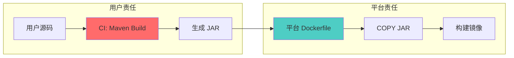

# Java Maven 依赖问题排查文档集

## 文档概览

本目录包含完整的 Java Maven 依赖问题排查指南，特别针对 CI/CD Pipeline 中的 `package does not exist` 错误。

### 📚 文档列表

1. **[java-package-missing.md](./java-package-missing.md)** - 原始问题分析和 Claude 反馈
2. **[wiremock-dependency-troubleshooting.md](./wiremock-dependency-troubleshooting.md)** - WireMock 依赖问题完整排查指南
3. **[dependency-issue-checklist.md](./dependency-issue-checklist.md)** - 快速排查清单
4. **[ci-diagnostic-script.sh](./ci-diagnostic-script.sh)** - 自动化诊断脚本

## 快速开始

### 场景：CI Pipeline 报错 `package does not exist`

#### 第一步：判断责任归属

```bash
# 错误发生在哪个阶段？
Maven compile/package 阶段 → 用户责任（CI 构建配置）
Dockerfile COPY 阶段 → 检查 JAR 是否生成
容器运行时 → 检查依赖 scope 或系统库
```

#### 第二步：运行诊断脚本

```bash
# 在 CI Pipeline 中添加
bash ci-diagnostic-script.sh wiremock
```

#### 第三步：根据诊断结果修复

**最常见问题：依赖未显式声明**

```xml
<!-- pom.xml -->
<dependencies>
    <dependency>
        <groupId>com.github.tomakehurst</groupId>
        <artifactId>wiremock-jre8</artifactId>
        <version>2.35.0</version>
        <scope>compile</scope>
    </dependency>
</dependencies>
```

## 核心概念

### 责任边界



### 问题分类

| 错误类型 | 发生阶段 | 责任方 | 文档参考 |
|---------|---------|--------|---------|
| `package does not exist` | Maven compile | 用户 | [完整指南](./wiremock-dependency-troubleshooting.md#解决方案) |
| `Could not transfer artifact` | Maven download | 用户 | [网络配置](./wiremock-dependency-troubleshooting.md#步骤-5验证-nexus-仓库) |
| `COPY failed` | Dockerfile | 用户/平台 | [Dockerfile 检查](./dependency-issue-checklist.md#-dockerfile-检查) |
| `ClassNotFoundException` | 运行时 | 用户 | [Scope 配置](./wiremock-dependency-troubleshooting.md#步骤-3检查依赖-scope) |

## 使用指南

### 对于用户（开发者）

1. **遇到构建失败时**
   - 查看 [快速排查清单](./dependency-issue-checklist.md)
   - 运行 [诊断脚本](./ci-diagnostic-script.sh)
   - 参考 [完整排查指南](./wiremock-dependency-troubleshooting.md)

2. **预防措施**
   - 显式声明所有依赖
   - 固定依赖版本
   - 配置 CI settings.xml
   - 启用依赖缓存

### 对于平台支持团队

1. **接到用户报障时**
   - 使用 [责任边界判定](./dependency-issue-checklist.md#快速判断是用户问题还是平台问题)
   - 提供 [用户沟通模板](./wiremock-dependency-troubleshooting.md#用户沟通模板)
   - 引导用户使用诊断工具

2. **改进平台**
   - 集成 [诊断脚本](./ci-diagnostic-script.sh) 到 CI 模板
   - 提供 [增强的错误提示](./wiremock-dependency-troubleshooting.md#平台支持工具)
   - 收集常见错误模式

## 常见问题 FAQ

### Q1: 为什么本地可以构建，CI 失败？

**A:** 通常是环境差异导致：
- Maven/JDK 版本不同
- settings.xml 配置不同
- 本地有缓存，CI 没有
- 网络访问权限不同

**解决方案：** 参考 [环境对比检查](./wiremock-dependency-troubleshooting.md#步骤-2对比本地与-ci-环境)

### Q2: 为什么之前可用，现在失败？

**A:** 可能原因：
- 传递依赖版本变化
- Parent POM 更新
- CI 缓存被清理
- Nexus 仓库内容变化

**解决方案：** [显式声明依赖](./wiremock-dependency-troubleshooting.md#方案-1显式声明依赖推荐)

### Q3: 如何判断是用户问题还是平台问题？

**A:** 使用决策树：

```
错误发生在 Maven compile/package 阶段？
├─ 是 → 用户责任（依赖配置问题）
└─ 否 → 检查 Dockerfile 或运行时
```

**详细判断：** [责任边界速查表](./dependency-issue-checklist.md#责任边界速查表)

### Q4: 用户没有在 pom.xml 中声明依赖，为什么之前可用？

**A:** 可能通过传递依赖引入：
- 其他依赖间接引入了该包
- 现在该传递依赖被移除或版本变化

**解决方案：** 
1. 运行 `mvn dependency:tree -Dverbose` 查看依赖关系
2. 显式声明所有直接使用的依赖

### Q5: 如何配置 CI 环境的 Maven settings.xml？

**A:** 在 CI Pipeline 中：

```yaml
before_script:
  - mkdir -p ~/.m2
  - cp ci/settings.xml ~/.m2/settings.xml

build:
  script:
    - mvn clean package
```

**详细配置：** [方案 3: 配置 CI settings.xml](./wiremock-dependency-troubleshooting.md#方案-3配置-ci-settingsxml)

## 工具使用

### 诊断脚本

```bash
# 基本使用
bash ci-diagnostic-script.sh

# 指定依赖名称
bash ci-diagnostic-script.sh wiremock

# 在 GitLab CI 中使用
diagnose:
  stage: test
  script:
    - bash ci-diagnostic-script.sh wiremock
  artifacts:
    paths:
      - dependency-tree.txt
      - /tmp/mvn-compile.log
    when: always
```

### 手动诊断命令

```bash
# 1. 检查依赖声明
grep -i "wiremock" pom.xml

# 2. 查看依赖树
mvn dependency:tree | grep -i wiremock

# 3. 检查有效配置
mvn help:effective-settings

# 4. 详细构建日志
mvn clean compile -X

# 5. 测试依赖下载
mvn dependency:get -Dartifact=com.github.tomakehurst:wiremock-jre8:2.35.0
```

## 最佳实践

### 用户侧

1. **依赖管理**
   ```xml
   <!-- 显式声明 + 固定版本 -->
   <dependency>
       <groupId>com.github.tomakehurst</groupId>
       <artifactId>wiremock-jre8</artifactId>
       <version>2.35.0</version>
   </dependency>
   ```

2. **CI 配置**
   ```yaml
   # 配置 settings.xml + 启用缓存
   before_script:
     - cp ci/settings.xml ~/.m2/settings.xml
   cache:
     paths:
       - .m2/repository/
   ```

3. **版本控制**
   ```xml
   <!-- 使用 dependencyManagement 统一管理 -->
   <dependencyManagement>
       <dependencies>
           <!-- 版本定义 -->
       </dependencies>
   </dependencyManagement>
   ```

### 平台侧

1. **提供标准化工具**
   - CI 诊断脚本
   - Pipeline 模板
   - 错误提示优化

2. **明确责任边界**
   - 文档说明
   - 错误消息中标注
   - 用户沟通模板

3. **持续改进**
   - 收集常见错误
   - 更新文档
   - 优化诊断工具

## 参考资源

### 官方文档

- [Maven 依赖机制](https://maven.apache.org/guides/introduction/introduction-to-dependency-mechanism.html)
- [Maven Settings 参考](https://maven.apache.org/settings.html)
- [Maven 仓库配置](https://maven.apache.org/guides/mini/guide-multiple-repositories.html)

### 工具文档

- [WireMock 官方文档](http://wiremock.org/)
- [Nexus Repository Manager](https://help.sonatype.com/repomanager3)

### 内部文档

- [完整排查指南](./wiremock-dependency-troubleshooting.md)
- [快速排查清单](./dependency-issue-checklist.md)
- [原始问题分析](./java-package-missing.md)

## 贡献

如果发现文档问题或有改进建议，请：

1. 更新相关文档
2. 运行诊断脚本验证
3. 更新本 README

## 版本历史

- **v1.0** (2024-11) - 初始版本
  - 完整排查指南
  - 快速排查清单
  - 自动化诊断脚本
  - 用户沟通模板

## 联系方式

- 平台文档: https://docs.platform.com/
- 技术支持: support@platform.com
- 问题反馈: [Issue Tracker]
