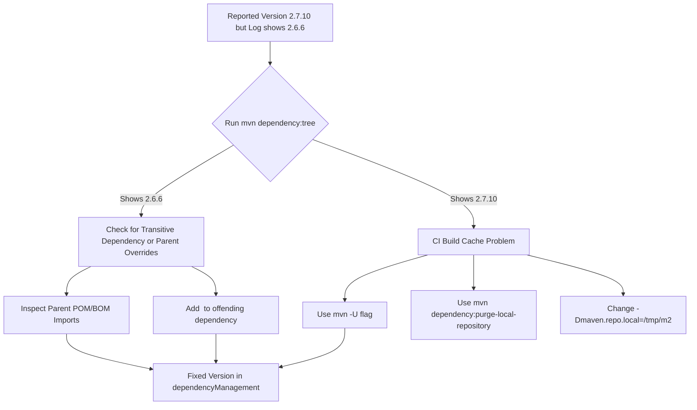

# Debugging Maven Dependency Conflicts & Version Mismatches

## Problem Analysis

The error `java.lang.NoSuchMethodError: org.yaml.snakeyaml.representer.Representer: method <init>()V not found` is a classic symptom of a **dependency conflict**.

### How it happens:
- **Spring Boot 2.7.x** expects **SnakeYAML 1.30+**.
- **Spring Boot 2.6.x** expects **SnakeYAML 1.29**.
- If your runtime classpath contains a mix of Spring Boot 2.6.6 components and a newer/older version of SnakeYAML (or vice-versa), the JVM fails to find the expected constructor or method.

### The Mystery:
Even if you define `<version>2.7.10</version>` in your `pom.xml`, the CI server is pulling `spring-boot-2.6.6.jar`. This suggests that something is **overriding** your choice.

---

## 🛠 Debugging Steps

### Phase 1: Pipeline / Build Stage
Check what Maven *thinks* it should be doing.

#### 1. Analyze the Effective POM
The `pom.xml` you see is only the surface. Maven merges it with Parent POMs and Platform Settings.
Run this in your CI pipeline (or locally with the same `settings.xml`):
```bash
mvn help:effective-pom -Doutput=effective-pom.xml
```
- **Search for**: `spring-boot-starter` or `spring-boot-dependencies`.
- **Check**: Are there any `<dependencyManagement>` sections coming from a parent POM that pin the version to 2.6.6?

#### 2. Inspect the Dependency Tree
Verify the exact resolution chain:
```bash
mvn dependency:tree -Dverbose -Dincludes=org.springframework.boot,org.yaml
```
- `-Dverbose`: Shows conflicts and which versions were omitted.
- Look for `(version managed from ...)` or `(conflicts with ...)`.

#### 3. Verify Settings & Profiles
The platform `settings.xml` might have active profiles that force versions.
```bash
mvn help:active-profiles
```

---

### Phase 2: Artifact / JAR Inspection
Check what was *actually* packaged.

#### 1. Inside the JAR
Download the JAR from GCP or your artifact registry and check the `lib` folder:
```bash
# List all libraries in the fat JAR
jar tf your-app.jar | grep spring-boot
```
If you see `spring-boot-2.6.6.jar` inside a JAR that was supposed to be 2.7.10, the build process is definitely using the wrong cache or parent.

---

### Phase 3: Runtime / GCP Logs
Check the environment where the app fails.

#### 1. Classpath Verification
Check the logs leading up to the crash. Sometimes Spring Boot prints the classpath or the loaded JAR locations.
- Search logs for: `Source: jar:file:/.../spring-boot-2.6.6.jar!/`

---

## 🧬 Troubleshooting Flow



---

## 🚀 Recommended Solutions

### 1. Force Update (The "Quick Fix")
Update your CI pipeline command to force a check for updated dependencies/metadata:
```bash
mvn clean package -U
```

### 2. Identify and Overrule the Parent
If a corporate parent is forcing 2.6.6, you must "over-overrule" it by putting the version in your own `<dependencyManagement>` section **BEFORE** other imports:

```xml
<dependencyManagement>
    <dependencies>
        <!-- Import the BOM for the version you WANT -->
        <dependency>
            <groupId>org.springframework.boot</groupId>
            <artifactId>spring-boot-dependencies</artifactId>
            <version>2.7.10</version>
            <type>pom</type>
            <scope>import</scope>
        </dependency>
    </dependencies>
</dependencyManagement>
```

### 3. Use a Fresh Repository (The "Nuclear Option")
If you suspect the CI host has a "poisoned" cache, force it to use a folder that doesn't exist:
```bash
mvn clean package -Dmaven.repo.local=./.m2/repository
```

### 4. Direct Exclusion
If a specific library is dragging in an old Spring version:
```xml
<dependency>
    <groupId>third.party.library</groupId>
    <artifactId>broken-sdk</artifactId>
    <version>1.0</version>
    <exclusions>
        <exclusion>
            <groupId>org.springframework.boot</groupId>
            <artifactId>spring-boot-starter</artifactId>
        </exclusion>
    </exclusions>
</dependency>
```

---

> [!IMPORTANT]
> **Why did local work?**
> Your local machine likely has a different `settings.xml`, access to different repositories, or your local `~/.m2/repository` happens to have the correct 2.7.10 jars already, whereas the CI host might have pulled 2.6.6 for a different project earlier and is incorrectly reusing it.
