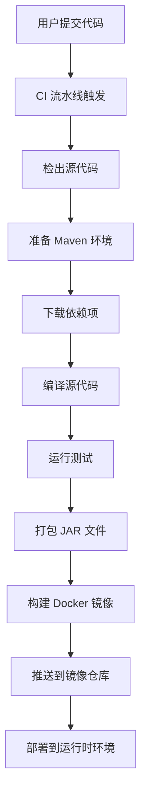

# 如何构建 JAR 文件 - Java 应用完整指南

## 概述

本文档详细解释了构建 JAR（Java ARchive）文件的完整过程，从源代码到可部署的构件。它专为在"用户管理代码 + 平台管理构建"环境中工作的用户设计，用户负责提供 Java 源代码和 `pom.xml`，而平台负责 CI/CD 流水线。

## 什么是 JAR 文件？

JAR（Java ARchive）文件是一种包文件格式，通常用于将许多 Java 类文件和相关元数据及资源聚合到一个文件中进行分发。它基于 ZIP 文件格式，通常用于：

- 可执行应用程序
- 库文件
- Web 应用程序
- Android 应用

## 完整构建过程

### 1. 用户责任

作为开发人员，您需要负责：

- **Java 源代码**: 应用程序中的所有 `.java` 文件
- **项目配置**: `pom.xml`（用于 Maven）或 `build.gradle`（用于 Gradle）
- **依赖项**: 声明所有必需的库及其版本
- **本地测试**: 确保应用程序在本地机器上正确运行

### 2. 平台责任

平台负责：

- **CI/CD 流水线**: 自动化构建和部署流程
- **构建环境**: Maven 设置、JDK 版本等
- **Docker 镜像创建**: 将 JAR 打包到容器中
- **部署**: 在生产环境中运行应用程序

## Maven 构建过程（逐步详解）

### 步骤 1：项目设置

您的项目应包含：

```
my-java-app/
├── src/main/java/          # Java 源文件
├── src/main/resources/     # 配置文件
├── src/test/java/          # 测试文件
├── pom.xml                 # Maven 配置
└── target/                 # 构建输出（生成的）
```

### 步骤 2：Maven 配置 (`pom.xml`)

`pom.xml` 文件定义了项目的依赖项、构建设置和插件：

```xml
<?xml version="1.0" encoding="UTF-8"?>
<project xmlns="http://maven.apache.org/POM/4.0.0"
         xmlns:xsi="http://www.w3.org/2001/XMLSchema-instance"
         xsi:schemaLocation="http://maven.apache.org/POM/4.0.0
         http://maven.apache.org/xsd/maven-4.0.0.xsd">
    <modelVersion>4.0.0</modelVersion>

    <groupId>com.example</groupId>
    <artifactId>my-java-app</artifactId>
    <version>1.0.0</version>
    <packaging>jar</packaging>

    <properties>
        <maven.compiler.source>17</maven.compiler.source>
        <maven.compiler.target>17</maven.compiler.target>
        <project.build.sourceEncoding>UTF-8</project.build.sourceEncoding>
    </properties>

    <dependencies>
        <!-- 您的项目依赖项 -->
        <dependency>
            <groupId>org.springframework.boot</groupId>
            <artifactId>spring-boot-starter</artifactId>
            <version>2.7.10</version>
        </dependency>
    </dependencies>

    <build>
        <plugins>
            <!-- 构建插件 -->
            <plugin>
                <groupId>org.springframework.boot</groupId>
                <artifactId>spring-boot-maven-plugin</artifactId>
                <version>2.7.10</version>
            </plugin>
        </plugins>
    </build>
</project>
```

### 步骤 3：本地构建过程

在本地机器上，您通常运行：

```bash
# 清理之前的构建
mvn clean

# 编译源代码
mvn compile

# 运行测试
mvn test

# 打包为 JAR
mvn package

# 或者一次性完成所有步骤
mvn clean package
```

这会在 `target/` 目录中创建一个 JAR 文件：
```
target/
├── my-java-app-1.0.0.jar
└── my-java-app-1.0.0.jar.original
```

### 步骤 4：CI/CD 构建过程

平台遵循类似的过程，但需要考虑额外因素：



## 理解 Maven 依赖项

### 依赖项解析过程

Maven 按以下顺序解析依赖项：

1. **本地仓库** (`~/.m2/repository/`): 首先，Maven 检查本地缓存
2. **远程仓库**: 如果本地未找到，则从配置的仓库下载
3. **传递依赖项**: 自动解析依赖项的依赖项

### 常见依赖项问题

#### 1. 版本冲突
当多个依赖项需要同一库的不同版本时：

```xml
<!-- 这可能导致冲突 -->
<dependency>
    <groupId>org.yaml</groupId>
    <artifactId>snakeyaml</artifactId>
    <version>1.30</version>
</dependency>
```

#### 2. 依赖项管理
使用 `<dependencyManagement>` 来控制跨模块的版本：

```xml
<dependencyManagement>
    <dependencies>
        <dependency>
            <groupId>org.springframework.boot</groupId>
            <artifactId>spring-boot-dependencies</artifactId>
            <version>2.7.10</version>
            <type>pom</type>
            <scope>import</scope>
        </dependency>
    </dependencies>
</dependencyManagement>
```

## 平台特定构建注意事项

### Maven 设置 (`settings.xml`)

平台提供 `settings.xml` 文件，配置：

- 私有仓库访问
- 镜像配置
- 配置文件设置
- 插件组定义

此文件由平台管理，用户不应修改。

### 构建缓存问题

最常见的问题之一是 Maven 缓存旧依赖项：

```bash
# 强制更新依赖项（在 CI 中使用）
mvn clean package -U

# 使用新的本地仓库
mvn clean package -Dmaven.repo.local=/tmp/m2
```

### 依赖项树分析

要了解正在解析的依赖项：

```bash
# 显示完整依赖项树
mvn dependency:tree

# 显示特定依赖项
mvn dependency:tree -Dincludes=org.springframework.boot

# 显示冲突
mvn dependency:tree -Dverbose
```

## 常见构建问题及解决方案

### 问题：本地正常，CI 失败

**症状**: 应用程序在本地运行，但在 CI/CD 流水线中失败

**根本原因**:
- 不同的 Maven 设置
- CI 中的缓存依赖项
- 不同的 JDK 版本
- 缺少私有仓库访问权限

**解决方案**:
1. 在 CI 中清除 Maven 缓存: `mvn dependency:purge-local-repository`
2. 强制更新依赖项: `mvn clean package -U`
3. 验证 JDK 兼容性

### 问题：依赖项冲突

**症状**: `NoSuchMethodError`、`ClassNotFoundException` 或运行时异常

**示例错误**:
```
java.lang.NoSuchMethodError:
org.yaml.snakeyaml.representer.Representer.<init>()V
```

**根本原因**: 类路径中存在同一库的不同版本

**解决方案**:
1. 分析依赖项树: `mvn dependency:tree -Dverbose`
2. 排除冲突的传递依赖项:
```xml
<dependency>
    <groupId>some.group</groupId>
    <artifactId>artifact-name</artifactId>
    <version>x.y.z</version>
    <exclusions>
        <exclusion>
            <groupId>org.yaml</groupId>
            <artifactId>snakeyaml</artifactId>
        </exclusion>
    </exclusions>
</dependency>
```

### 问题：Fat JAR 与 Thin JAR

**Fat JAR**: 包含所有依赖项（Spring Boot 默认）
**Thin JAR**: 仅包含您的代码，依赖项在运行时解析

对于 Spring Boot 应用程序，使用 Spring Boot Maven 插件：

```xml
<plugin>
    <groupId>org.springframework.boot</groupId>
    <artifactId>spring-boot-maven-plugin</artifactId>
    <executions>
        <execution>
            <goals>
                <goal>repackage</goal>
            </goals>
        </execution>
    </executions>
</plugin>
```

## 最佳实践

### 1. 版本管理
- 明确固定依赖项版本
- 使用依赖项管理部分
- 定期更新依赖项

### 2. 构建可重现性
- 在 CI 中使用 `-U` 标志强制更新
- 不要在 CI 中依赖本地仓库
- 记录 JDK 和 Maven 版本要求

### 3. 构建前测试
- 在提交前在本地运行测试
- 为不同环境使用配置文件
- 验证依赖项版本

### 4. CI/CD 流水线优化
- 适当缓存 Maven 仓库
- 尽可能使用增量构建
- 将依赖项树存储为构建构件

## 验证步骤

构建 JAR 后，验证它包含预期内容：

```bash
# 列出 JAR 内容
jar tf target/my-app.jar

# 检查 MANIFEST.MF
jar xf target/my-app.jar META-INF/MANIFEST.MF
cat META-INF/MANIFEST.MF

# 对于 Spring Boot 应用，检查嵌入的依赖项
jar tf target/my-app.jar | grep -i spring
```

## 故障排除清单

- [ ] 验证 `pom.xml` 依赖项是否正确
- [ ] 检查本地构建是否正常工作: `mvn clean package`
- [ ] 确认 CI 使用 `-U` 标志进行依赖项更新
- [ ] 分析依赖项树: `mvn dependency:tree`
- [ ] 验证 JDK 版本兼容性
- [ ] 检查冲突的传递依赖项
- [ ] 确保平台 `settings.xml` 允许访问所需仓库

## 总结

构建 JAR 文件涉及从源代码编译到最终打包的多个步骤。在平台管理的环境中，理解 `pom.xml`、平台的 Maven 设置和 CI/CD 流水线之间的交互对于避免依赖项冲突和确保跨环境的一致构建至关重要。