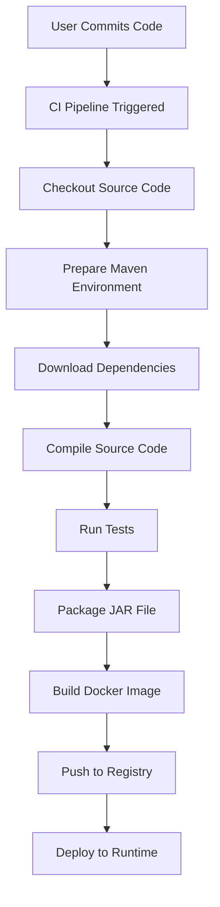

# How to Build a JAR File - A Complete Guide for Java Applications

## Overview

This document explains the complete process of building a JAR (Java ARchive) file, from source code to a deployable artifact. It's designed for users working in a "user-managed code + platform-managed build" environment where users provide Java source code and `pom.xml` while the platform handles the CI/CD pipeline.

## What is a JAR File?

A JAR (Java ARchive) file is a package file format typically used to aggregate many Java class files and associated metadata and resources into one file for distribution. It's based on the ZIP file format and is commonly used for:

- Executable applications
- Libraries
- Web applications
- Android apps

## The Complete Build Process

### 1. User Responsibilities

As a developer, you are responsible for:

- **Java Source Code**: All `.java` files in your application
- **Project Configuration**: `pom.xml` (for Maven) or `build.gradle` (for Gradle)
- **Dependencies**: Declaring all required libraries and their versions
- **Local Testing**: Ensuring the application runs correctly on your local machine

### 2. Platform Responsibilities

The platform handles:

- **CI/CD Pipeline**: Automated build and deployment processes
- **Build Environment**: Maven settings, JDK versions, etc.
- **Docker Image Creation**: Packaging the JAR into a container
- **Deployment**: Running the application in production environments

## Maven Build Process (Step-by-Step)

### Step 1: Project Setup

Your project should contain:

```
my-java-app/
├── src/main/java/          # Java source files
├── src/main/resources/     # Configuration files
├── src/test/java/          # Test files
├── pom.xml                 # Maven configuration
└── target/                 # Build output (generated)
```

### Step 2: Maven Configuration (`pom.xml`)

The `pom.xml` file defines your project's dependencies, build settings, and plugins:

```xml
<?xml version="1.0" encoding="UTF-8"?>
<project xmlns="http://maven.apache.org/POM/4.0.0"
         xmlns:xsi="http://www.w3.org/2001/XMLSchema-instance"
         xsi:schemaLocation="http://maven.apache.org/POM/4.0.0 
         http://maven.apache.org/xsd/maven-4.0.0.xsd">
    <modelVersion>4.0.0</modelVersion>
    
    <groupId>com.example</groupId>
    <artifactId>my-java-app</artifactId>
    <version>1.0.0</version>
    <packaging>jar</packaging>
    
    <properties>
        <maven.compiler.source>17</maven.compiler.source>
        <maven.compiler.target>17</maven.compiler.target>
        <project.build.sourceEncoding>UTF-8</project.build.sourceEncoding>
    </properties>
    
    <dependencies>
        <!-- Your project dependencies here -->
        <dependency>
            <groupId>org.springframework.boot</groupId>
            <artifactId>spring-boot-starter</artifactId>
            <version>2.7.10</version>
        </dependency>
    </dependencies>
    
    <build>
        <plugins>
            <!-- Build plugins -->
            <plugin>
                <groupId>org.springframework.boot</groupId>
                <artifactId>spring-boot-maven-plugin</artifactId>
                <version>2.7.10</version>
            </plugin>
        </plugins>
    </build>
</project>
```

### Step 3: Local Build Process

On your local machine, you typically run:

```bash
# Clean previous builds
mvn clean

# Compile source code
mvn compile

# Run tests
mvn test

# Package into JAR
mvn package

# Or do all at once
mvn clean package
```

This creates a JAR file in the `target/` directory:
```
target/
├── my-java-app-1.0.0.jar
└── my-java-app-1.0.0.jar.original
```

### Step 4: CI/CD Build Process

The platform follows a similar process but with additional considerations:



## Understanding Maven Dependencies

### Dependency Resolution Process

Maven resolves dependencies in this order:

1. **Local Repository** (`~/.m2/repository/`): First, Maven checks your local cache
2. **Remote Repositories**: If not found locally, downloads from configured repositories
3. **Transitive Dependencies**: Automatically resolves dependencies of your dependencies

### Common Dependency Issues

#### 1. Version Conflicts
When multiple dependencies require different versions of the same library:

```xml
<!-- This can cause conflicts -->
<dependency>
    <groupId>org.yaml</groupId>
    <artifactId>snakeyaml</artifactId>
    <version>1.30</version>
</dependency>
```

#### 2. Dependency Management
Use `<dependencyManagement>` to control versions across modules:

```xml
<dependencyManagement>
    <dependencies>
        <dependency>
            <groupId>org.springframework.boot</groupId>
            <artifactId>spring-boot-dependencies</artifactId>
            <version>2.7.10</version>
            <type>pom</type>
            <scope>import</scope>
        </dependency>
    </dependencies>
</dependencyManagement>
```

## Platform-Specific Build Considerations

### Maven Settings (`settings.xml`)

The platform provides a `settings.xml` file that configures:

- Private repository access
- Mirror configurations
- Profile settings
- Plugin group definitions

This file is managed by the platform and should not be modified by users.

### Build Caching Issues

One of the most common issues is Maven caching old dependencies:

```bash
# Force update dependencies (use in CI)
mvn clean package -U

# Use fresh local repository
mvn clean package -Dmaven.repo.local=/tmp/m2
```

### Dependency Tree Analysis

To understand what dependencies are being resolved:

```bash
# Show complete dependency tree
mvn dependency:tree

# Show specific dependency
mvn dependency:tree -Dincludes=org.springframework.boot

# Show conflicts
mvn dependency:tree -Dverbose
```

## Common Build Problems and Solutions

### Problem: Local Works, CI Fails

**Symptoms**: Application runs locally but fails in CI/CD pipeline

**Root Causes**:
- Different Maven settings
- Cached dependencies in CI
- Different JDK versions
- Missing private repository access

**Solutions**:
1. Clear Maven cache in CI: `mvn dependency:purge-local-repository`
2. Force dependency updates: `mvn clean package -U`
3. Verify JDK compatibility

### Problem: Dependency Conflicts

**Symptoms**: `NoSuchMethodError`, `ClassNotFoundException`, or runtime exceptions

**Example Error**:
```
java.lang.NoSuchMethodError: 
org.yaml.snakeyaml.representer.Representer.<init>()V
```

**Root Cause**: Different versions of the same library in the classpath

**Solutions**:
1. Analyze dependency tree: `mvn dependency:tree -Dverbose`
2. Exclude conflicting transitive dependencies:
```xml
<dependency>
    <groupId>some.group</groupId>
    <artifactId>artifact-name</artifactId>
    <version>x.y.z</version>
    <exclusions>
        <exclusion>
            <groupId>org.yaml</groupId>
            <artifactId>snakeyaml</artifactId>
        </exclusion>
    </exclusions>
</dependency>
```

### Problem: Fat JAR vs Thin JAR

**Fat JAR**: Contains all dependencies (Spring Boot default)
**Thin JAR**: Contains only your code, dependencies resolved at runtime

For Spring Boot applications, use the Spring Boot Maven Plugin:

```xml
<plugin>
    <groupId>org.springframework.boot</groupId>
    <artifactId>spring-boot-maven-plugin</artifactId>
    <executions>
        <execution>
            <goals>
                <goal>repackage</goal>
            </goals>
        </execution>
    </executions>
</plugin>
```

## Best Practices

### 1. Version Management
- Pin dependency versions explicitly
- Use dependency management sections
- Regularly update dependencies

### 2. Build Reproducibility
- Use `-U` flag in CI to force updates
- Don't rely on local repository in CI
- Document JDK and Maven version requirements

### 3. Testing Before Build
- Run tests locally before committing
- Use profiles for different environments
- Validate dependency versions

### 4. CI/CD Pipeline Optimization
- Cache Maven repository appropriately
- Use incremental builds when possible
- Store dependency trees as build artifacts

## Verification Steps

After building your JAR, verify it contains the expected content:

```bash
# List JAR contents
jar tf target/my-app.jar

# Check MANIFEST.MF
jar xf target/my-app.jar META-INF/MANIFEST.MF
cat META-INF/MANIFEST.MF

# For Spring Boot apps, check embedded dependencies
jar tf target/my-app.jar | grep -i spring
```

## Troubleshooting Checklist

- [ ] Verify `pom.xml` dependencies are correct
- [ ] Check that local build works: `mvn clean package`
- [ ] Confirm CI uses `-U` flag for dependency updates
- [ ] Analyze dependency tree: `mvn dependency:tree`
- [ ] Verify JDK version compatibility
- [ ] Check for conflicting transitive dependencies
- [ ] Ensure platform `settings.xml` allows access to required repositories

## Summary

Building a JAR file involves multiple steps from source compilation to final packaging. In a platform-managed environment, understanding the interaction between your `pom.xml`, the platform's Maven settings, and the CI/CD pipeline is crucial for avoiding dependency conflicts and ensuring consistent builds across environments.