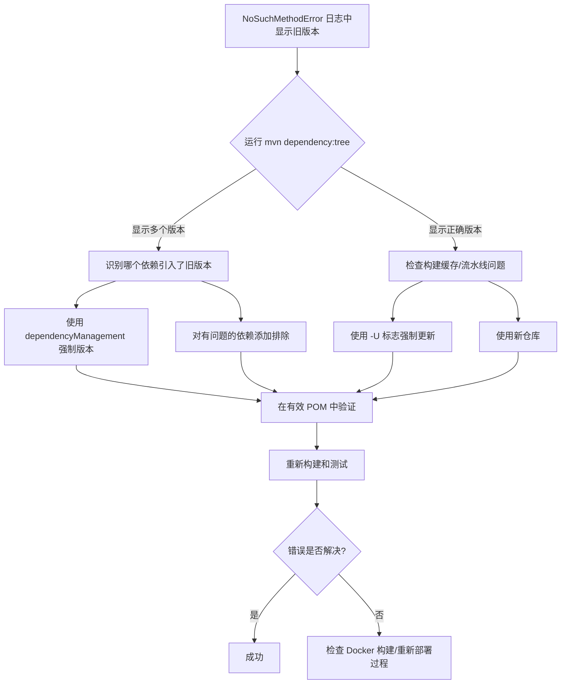

# Maven 依赖分析与多版本冲突解决方案

## 核心问题：依赖版本不匹配

当你看到如下错误时：
```
java.lang.NoSuchMethodError: org.yaml.snakeyaml.representer.Representer: method <init>()V not found
```

且日志显示：
```
[spring-boot-2.6.6.jar!/:2.6.6]
```

但你的 `pom.xml` 指定的是：
```xml
<version>2.7.10</version>
```

这表明**同一依赖存在多个版本**，错误的版本在运行时占用了优先级。

---

## 根本原因分析

### 问题发生的原因
- **Spring Boot 2.7.x** 需要 **SnakeYAML 1.30+**
- **Spring Boot 2.6.x** 需要 **SnakeYAML 1.29**
- 多个父 POM 或依赖可能指定了不同版本
- Maven 的依赖解析会选择"最近"的版本，而不一定是最高版本

### 常见场景
1. 公司父 POM 强制使用较旧的 Spring Boot 版本
2. 第三方依赖引入了较旧的 Spring Boot 版本
3. 导入了多个不同版本的 Spring Boot BOM
4. DependencyManagement 部分相互冲突

---

## 诊断命令（打印依赖）

### 1. 分析有效 POM
显示 Maven 实际看到的内容（合并所有父 POM 后）：
```bash
mvn help:effective-pom -Doutput=effective-pom.xml
```
- 搜索：`spring-boot-starter`, `spring-boot-dependencies`
- 查找：来自父 POM 的 `<dependencyManagement>` 部分

### 2. 依赖树分析（关键命令）
显示完整的依赖解析链：
```bash
mvn dependency:tree -Dverbose -Dincludes=org.springframework.boot,org.yaml
```
- `-Dverbose`: 显示冲突和被省略的版本
- 查找：`(version managed from ...)`, `(conflicts with ...)`, `(omitted for ...)` 

### 3. 反向依赖查找
查找是哪个依赖引入了错误版本：
```bash
mvn dependency:tree -Dverbose | grep -A5 -B5 "2.6.6"
```

### 4. 依赖解析详情
获取版本冲突的详细信息：
```bash
mvn dependency:resolve -Dtransitive=false
mvn dependency:analyze-duplicate
mvn dependency:analyze-dep-mgt
```

---

## 多版本冲突检测

### 1. 检查同一构件的多个版本
```bash
mvn dependency:tree | grep -oE "[a-zA-Z0-9\.\-]*:[a-zA-Z0-9\.\-]*:[0-9\.\-]*" | sort | uniq -c | sort -nr
```

### 2. 特定依赖分析
```bash
# 检查多个 Spring Boot 版本
mvn dependency:tree | grep -i spring-boot | sort | uniq -c

# 检查多个 SnakeYAML 版本  
mvn dependency:tree | grep -i snakeyaml | sort | uniq -c
```

### 3. 依赖管理分析
```bash
mvn help:effective-pom | grep -A 20 -B 5 dependencyManagement
```

---

## 解决策略

### 1. 显式依赖管理（推荐）
在自己的 `dependencyManagement` 中强制使用你想要的版本：
```xml
<dependencyManagement>
    <dependencies>
        <!-- 首先导入你想要的版本的 BOM -->
        <dependency>
            <groupId>org.springframework.boot</groupId>
            <artifactId>spring-boot-dependencies</artifactId>
            <version>2.7.10</version>
            <type>pom</type>
            <scope>import</scope>
        </dependency>
    </dependencies>
</dependencyManagement>
```

### 2. 依赖排除
排除有问题的传递依赖：
```xml
<dependency>
    <groupId>third.party.library</groupId>
    <artifactId>broken-sdk</artifactId>
    <version>1.0</version>
    <exclusions>
        <exclusion>
            <groupId>org.springframework.boot</groupId>
            <artifactId>spring-boot-starter</artifactId>
        </exclusion>
    </exclusions>
</dependency>
```

### 3. 在 CI 中强制更新
```bash
mvn clean package -U
```

### 4. 使用新仓库
```bash
mvn clean package -Dmaven.repo.local=/tmp/m2-$(date +%s)
```

---

## CI/CD 流水线验证

### 1. 验证构建产物
添加到你的流水线：
```bash
# 检查 JAR 中实际包含的内容
jar tf target/*.jar | grep spring-boot
jar tf target/*.jar | grep snakeyaml

# 验证有效 POM 包含预期版本
mvn help:effective-pom | grep -A 2 -B 2 "spring-boot.version"
```

### 2. 部署前验证
```bash
# 部署前运行快速版本检查
java -jar target/*.jar --version 2>&1 | grep "2.7.10"
```

---

## 故障排除流程图



---

## 预防最佳实践

1. **始终使用 dependencyManagement** 管理核心框架版本
2. **显式固定 BOM 版本** 在其他导入之前
3. **定期依赖审计** 使用 `mvn dependency:tree`
4. **CI 中的构建验证步骤** 早期捕获版本不匹配
5. **使用特定镜像标签** 而不是 `latest` 确保部署一致性