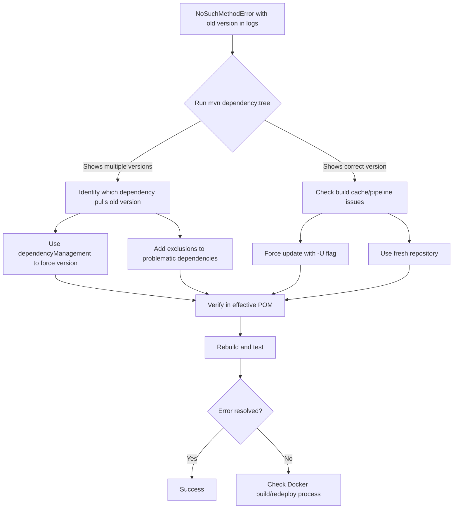

# Maven Dependency Analysis & Multi-Version Conflict Resolution

## Core Problem: Dependency Version Mismatch

When you see errors like:
```
java.lang.NoSuchMethodError: org.yaml.snakeyaml.representer.Representer: method <init>()V not found
```

And logs show:
```
[spring-boot-2.6.6.jar!/:2.6.6]
```

But your `pom.xml` specifies:
```xml
<version>2.7.10</version>
```

This indicates **multiple versions of the same dependency** are being resolved, with the wrong version taking precedence at runtime.

---

## Root Cause Analysis

### Why This Happens
- **Spring Boot 2.7.x** expects **SnakeYAML 1.30+**
- **Spring Boot 2.6.x** expects **SnakeYAML 1.29**
- Multiple parent POMs or dependencies may specify different versions
- Maven's dependency resolution chooses the "nearest" version, not necessarily the highest

### Common Scenarios
1. Corporate parent POM forces older Spring Boot version
2. Third-party dependencies drag in older Spring Boot versions
3. Multiple Spring Boot BOMs imported with different versions
4. DependencyManagement sections conflict with each other

---

## Diagnostic Commands (Print Dependencies)

### 1. Analyze the Effective POM
Shows what Maven actually sees after merging all parent POMs:
```bash
mvn help:effective-pom -Doutput=effective-pom.xml
```
- Search for: `spring-boot-starter`, `spring-boot-dependencies`
- Look for: `<dependencyManagement>` sections from parent POMs

### 2. Dependency Tree Analysis (Key Command)
Shows the complete dependency resolution chain:
```bash
mvn dependency:tree -Dverbose -Dincludes=org.springframework.boot,org.yaml
```
- `-Dverbose`: Shows conflicts and which versions were omitted
- Look for: `(version managed from ...)`, `(conflicts with ...)`, `(omitted for ...)` 

### 3. Reverse Dependency Lookup
Find which dependency is pulling in the wrong version:
```bash
mvn dependency:tree -Dverbose | grep -A5 -B5 "2.6.6"
```

### 4. Dependency Resolution Details
Get detailed information about version conflicts:
```bash
mvn dependency:resolve -Dtransitive=false
mvn dependency:analyze-duplicate
mvn dependency:analyze-dep-mgt
```

---

## Multi-Version Conflict Detection

### 1. Check for Multiple Versions of Same Artifact
```bash
mvn dependency:tree | grep -oE "[a-zA-Z0-9\.\-]*:[a-zA-Z0-9\.\-]*:[0-9\.\-]*" | sort | uniq -c | sort -nr
```

### 2. Specific Dependency Analysis
```bash
# Check for multiple Spring Boot versions
mvn dependency:tree | grep -i spring-boot | sort | uniq -c

# Check for multiple SnakeYAML versions  
mvn dependency:tree | grep -i snakeyaml | sort | uniq -c
```

### 3. Dependency Management Analysis
```bash
mvn help:effective-pom | grep -A 20 -B 5 dependencyManagement
```

---

## Resolution Strategies

### 1. Explicit Dependency Management (Recommended)
Force the version you want in your own `dependencyManagement`:
```xml
<dependencyManagement>
    <dependencies>
        <!-- Import the BOM for the version you WANT first -->
        <dependency>
            <groupId>org.springframework.boot</groupId>
            <artifactId>spring-boot-dependencies</artifactId>
            <version>2.7.10</version>
            <type>pom</type>
            <scope>import</scope>
        </dependency>
    </dependencies>
</dependencyManagement>
```

### 2. Dependency Exclusion
Exclude problematic transitive dependencies:
```xml
<dependency>
    <groupId>third.party.library</groupId>
    <artifactId>broken-sdk</artifactId>
    <version>1.0</version>
    <exclusions>
        <exclusion>
            <groupId>org.springframework.boot</groupId>
            <artifactId>spring-boot-starter</artifactId>
        </exclusion>
    </exclusions>
</dependency>
```

### 3. Force Update in CI
```bash
mvn clean package -U
```

### 4. Fresh Repository
```bash
mvn clean package -Dmaven.repo.local=/tmp/m2-$(date +%s)
```

---

## CI/CD Pipeline Verification

### 1. Verify Build Artifacts
Add to your pipeline:
```bash
# Check what's actually in the JAR
jar tf target/*.jar | grep spring-boot
jar tf target/*.jar | grep snakeyaml

# Verify effective POM contains expected versions
mvn help:effective-pom | grep -A 2 -B 2 "spring-boot.version"
```

### 2. Pre-deployment Validation
```bash
# Run a quick version check before deployment
java -jar target/*.jar --version 2>&1 | grep "2.7.10"
```

---

## Troubleshooting Flowchart



---

## Prevention Best Practices

1. **Always use dependencyManagement** for core framework versions
2. **Pin BOM versions explicitly** before other imports
3. **Regular dependency audits** with `mvn dependency:tree`
4. **Build verification steps** in CI to catch version mismatches early
5. **Use specific image tags** instead of `latest` to ensure deployment consistency