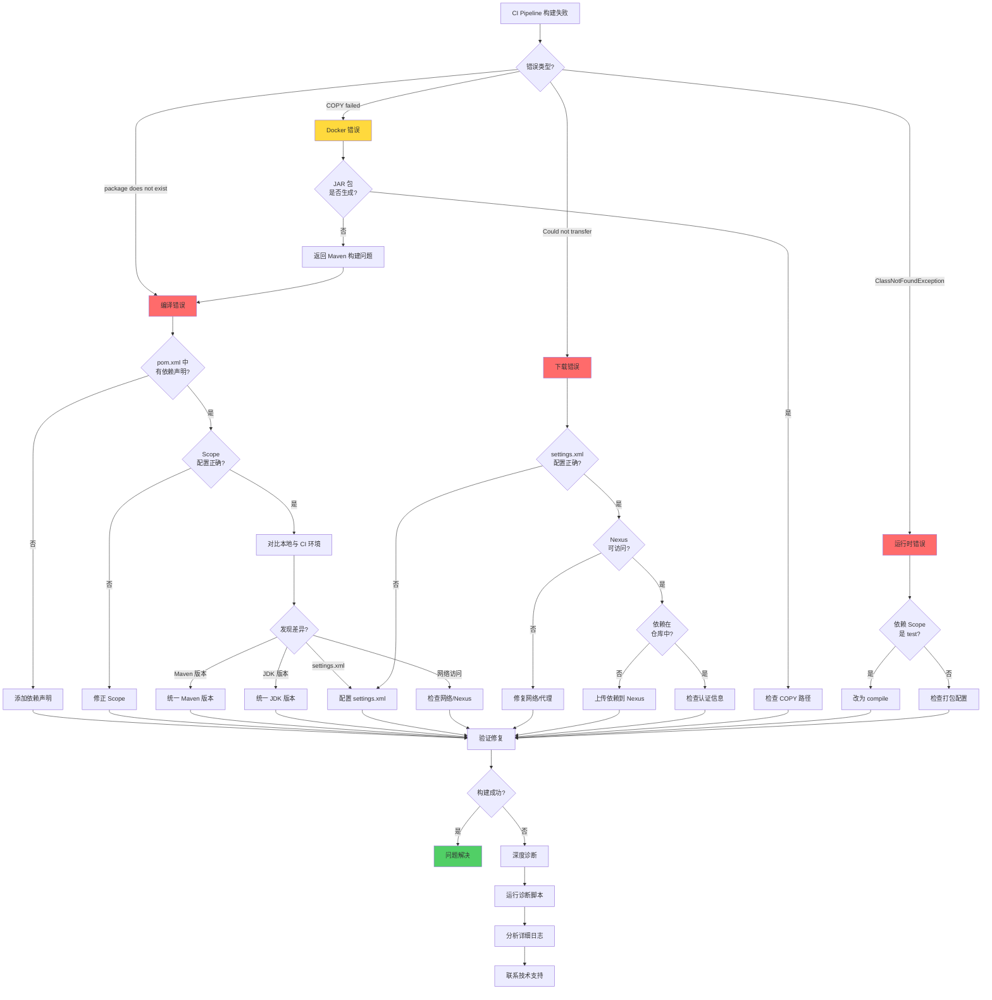
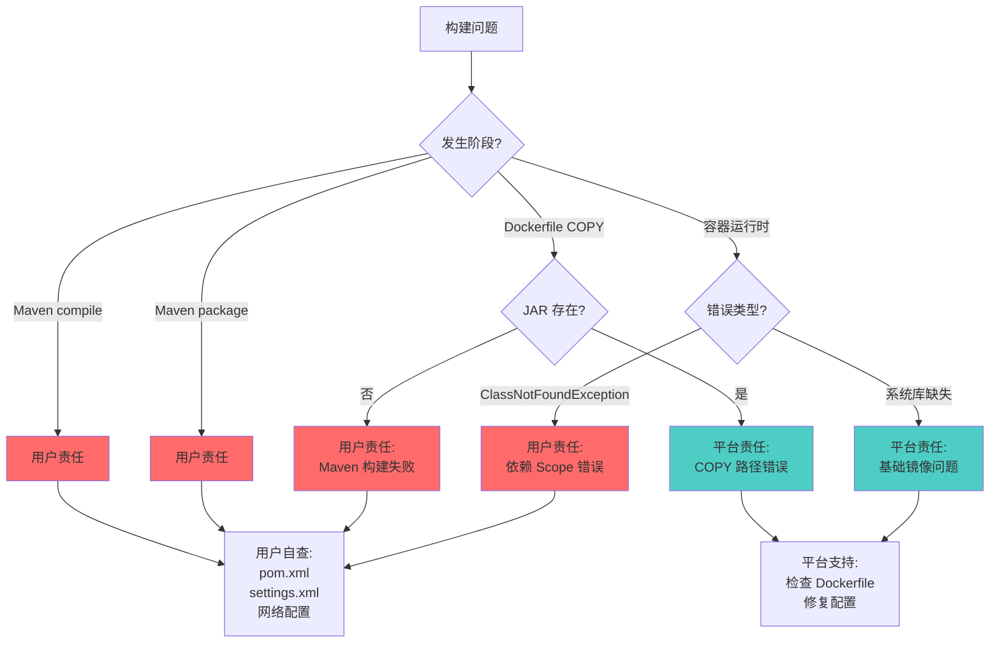
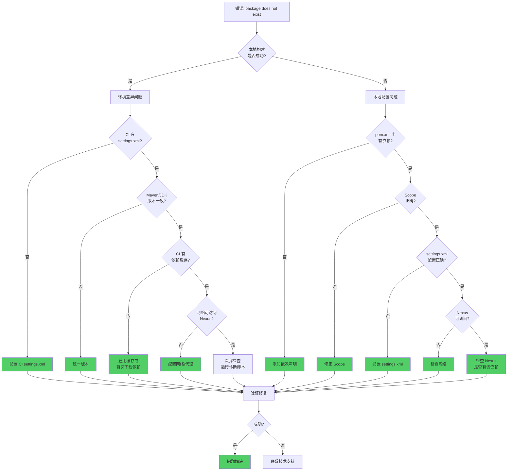
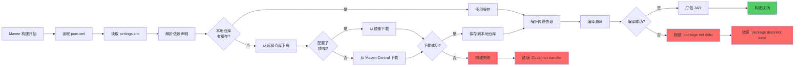
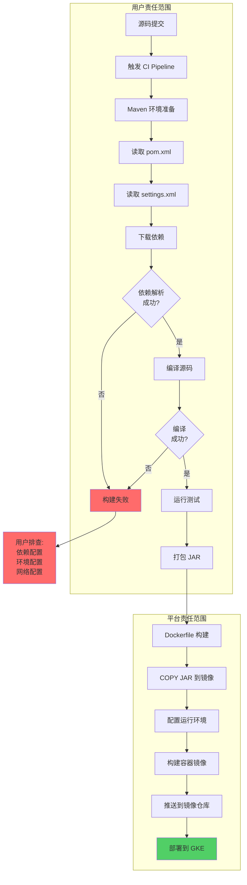

# Java Maven 依赖问题排查流程图

## 完整排查流程

## 责任判定流程

## 快速诊断决策树

## 依赖解析流程

## CI/CD 完整流程

## 问题分类矩阵

```mermaid
graph TD
    subgraph "编译时问题 (用户责任)"
        C1[package does not exist]
        C2[Could not resolve dependencies]
        C3[Version conflict]
        C4[Could not transfer artifact]
    end
    
    subgraph "构建时问题 (用户/平台)"
        B1[COPY failed: no JAR]
        B2[COPY failed: path error]
        B3[Docker build timeout]
    end
    
    subgraph "运行时问题 (用户/平台)"
        R1[ClassNotFoundException]
        R2[NoClassDefFoundError]
        R3[UnsatisfiedLinkError]
        R4[java: command not found]
    end
    
    C1 --> U1[用户: 添加依赖]
    C2 --> U2[用户: 配置仓库]
    C3 --> U3[用户: 版本管理]
    C4 --> U4[用户: 网络配置]
    
    B1 --> U5[用户: 检查 Maven 构建]
    B2 --> P1[平台: 修复 Dockerfile]
    B3 --> P2[平台: 优化构建]
    
    R1 --> U6[用户: 修正 Scope]
    R2 --> U7[用户: 检查打包]
    R3 --> P3[平台: 系统库]
    R4 --> P4[平台: 基础镜像]
    
    style C1 fill:#ff6b6b
    style C2 fill:#ff6b6b
    style C3 fill:#ff6b6b
    style C4 fill:#ff6b6b
    style B1 fill:#ffd93d
    style B2 fill:#4ecdc4
    style B3 fill:#4ecdc4
    style R1 fill:#ff6b6b
    style R2 fill:#ff6b6b
    style R3 fill:#4ecdc4
    style R4 fill:#4ecdc4
```

## 使用说明

### 如何使用这些流程图

1. **遇到问题时**
   - 从"完整排查流程"开始
   - 根据错误类型选择分支
   - 按照流程逐步排查

2. **判断责任时**
   - 使用"责任判定流程"
   - 快速确定是用户还是平台问题
   - 采取相应措施

3. **快速诊断时**
   - 使用"快速诊断决策树"
   - 回答一系列是/否问题
   - 快速定位问题

4. **理解流程时**
   - 查看"依赖解析流程"
   - 了解 Maven 如何解析依赖
   - 理解问题发生的位置

5. **全局视角时**
   - 查看"CI/CD 完整流程"
   - 理解用户和平台的责任边界
   - 把握整体架构

### 颜色说明

- 🔴 红色 (#ff6b6b): 用户责任问题
- 🔵 蓝色 (#4ecdc4): 平台责任问题
- 🟡 黄色 (#ffd93d): 需要进一步判断
- 🟢 绿色 (#51cf66): 成功/解决方案

### 相关文档

- [完整排查指南](./wiremock-dependency-troubleshooting.md)
- [快速排查清单](./dependency-issue-checklist.md)
- [诊断脚本](./ci-diagnostic-script.sh)
- [README](./README.md)
