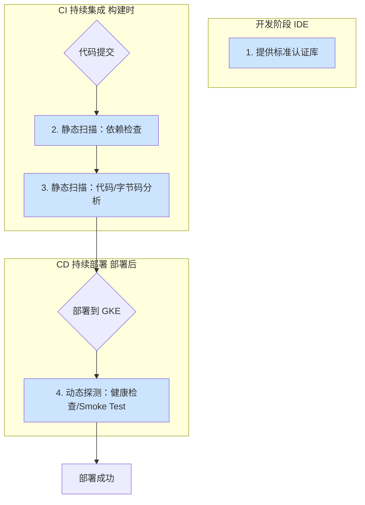

# 设计自动化扫描工具：确保 GKE Pod 内嵌认证逻辑

## 1. 核心挑战与设计理念

### 1.1 挑战

从依赖 Kong Gateway 统一认证，转向各 GKE Pod (Java 应用) 自行负责认证后，平台面临的核心挑战是：

> 如何在自动化流程中，确保每一个部署的 Java 应用都 **正确并全面地** 实现了认证逻辑，避免出现未受保护的“裸奔”API？

正如您所指出的，仅在 CD 阶段对运行中的服务进行黑盒探测，发现问题为时已晚，且难以保证测试覆盖率。

### 1.2 设计理念：多层防御，左移验证

我们的扫描工具设计理念是 **“多层防御，左移验证”**。我们不依赖单一的工具或阶段，而是在 CI/CD 流水线的不同阶段设立“卡点”（Quality Gates），层层递进地进行验证，将问题尽可能在开发早期（左侧）发现和拦截。



## 2. 方案详解：三层扫描与卡点策略

### 第一层 (标准化)：建立统一的认证基础

这是整个方案的基石。与其扫描无数种自定义的认证实现，不如扫描一种标准化的实现。

**任务**：开发一个公司内部的 **Java 认证标准库** (例如 `my-company-auth-spring-boot-starter`)。

**这个库应该提供：**
1.  **核心认证逻辑**：封装与第三方认证服务交互、解析和验证 Token 的所有复杂逻辑。
2.  **简易的集成方式**：
    *   对于 Spring Boot 应用，提供一个自动配置的 `Filter` 或 `Interceptor`。
    *   提供一个注解，如 `@Authenticated`，可以方便地应用在 Controller 的方法或类上。
3.  **“认证探针”端点**：通过 Spring Actuator 暴露一个自定义端点，如 `/actuator/auth-status`，用于在运行时报告该应用的认证功能是否已启用。

**优点**：极大降低了业务开发的复杂度，并为后续的自动化扫描提供了统一、明确的目标。

### 第二层 (静态扫描)：在 CI 构建阶段拦截

这是“扫描工具”的核心，它在代码构建成 Jar 包或镜像的阶段工作，无需部署。

#### 卡点 2.1：依赖检查 (最简单)

**目标**：确保每个微服务都包含了我们的标准认证库。

**实现**：
*   **工具**：使用 `maven-enforcer-plugin` (Maven) 或 `nebula.dependency-recommender` (Gradle)。
*   **规则**：在项目的父 POM 或公司统一的 BOM (Bill of Materials) 文件中，强制所有子项目必须依赖 `my-company-auth-spring-boot-starter`。如果某个项目没有引入该依赖，CI 构建将直接失败。

**示例 (`maven-enforcer-plugin`)**：
```xml
<plugin>
    <groupId>org.apache.maven.plugins</groupId>
    <artifactId>maven-enforcer-plugin</artifactId>
    <version>3.4.1</version>
    <executions>
        <execution>
            <id>enforce-dependencies</id>
            <goals>
                <goal>enforce</goal>
            </goals>
            <configuration>
                <rules>
                    <dependencyConvergence/>
                    <requireDependencies>
                        <dependency>
                            <groupId>com.my-company</groupId>
                            <artifactId>auth-spring-boot-starter</artifactId>
                        </dependency>
                    </requireDependencies>
                </rules>
            </configuration>
        </execution>
    </executions>
</plugin>
```

#### 卡点 2.2：字节码分析 (更可靠)

**目标**：确保认证库不仅被“引入”，还被“激活”了。

**背景**：开发者可能引入了依赖，但忘记了启用它（例如，忘记在主类上加 `@EnableMyCompanyAuth` 注解）。

**实现**：
*   **工具**：
    1.  编写一个自定义的 Checkstyle/PMD 规则。
    2.  或在 CI 脚本中，使用 **ASM**、**Byte Buddy** 等字节码操作库，对编译后的 `.class` 文件进行分析。
*   **扫描逻辑**：
    1.  找到项目的主应用类 (通常带有 `@SpringBootApplication` 注解)。
    2.  检查该类是否包含了我们标准库要求的前置注解，如 `@EnableMyCompanyAuth`。
    3.  如果没有找到，即使依赖存在，CI 构建也应失败。

**这种方法比单纯的依赖检查更可靠，因为它验证了代码的真实意图。**

#### 卡点 2.3：逻辑覆盖率分析 (最全面)

**目标**：防止出现未受保护的“裸奔”API 端点。

**实现**：
*   **工具**：这通常需要一个更复杂的、定制化的静态分析脚本（同样基于 ASM 或类似工具）。
*   **扫描逻辑**：
    1.  扫描所有编译后的类文件。
    2.  找出所有包含 `@RestController` 或 `@Controller` 的类。
    3.  遍历其中所有公开的 `public` 方法（特别是带有 `@GetMapping`, `@PostMapping` 等注解的方法）。
    4.  检查该方法或其所在的类，是否被我们的 `@Authenticated` 注解所保护。
    5.  如果发现一个 API 端点方法没有被保护，CI 构建失败。
    6.  **例外处理**：需要提供一种机制来标记“故意”暴露的公共 API（如 `/health`, `/metrics`），例如使用一个特殊的注解 `@PublicApi` 来让扫描工具跳过检查。

### 第三层 (动态探测)：部署后的最终校验

这是最后一道防线，作为静态分析的补充，验证真实运行环境中的状态。

#### 卡点 3.1：“认证探针”检查

**目标**：验证服务在运行时是否已正确加载并启用了认证功能。

**实现**：
*   在 CD 流程中，当服务在 GKE 中启动并报告健康后，自动化脚本（如 `curl`）会调用标准库提供的 `/actuator/auth-status` 端点。
*   脚本断言返回的 JSON 中包含 `"status": "enabled"`。
*   如果探测失败或状态为 "disabled"，CD 流水线立即失败，并执行回滚操作。

#### 卡点 3.2：API 冒烟测试 (Smoke Test)

**目标**：模拟真实用户场景，对一个已知的受保护端点进行测试。

**实现**：
*   CD 脚本选择一个该服务中已知的、必须受保护的 API 端点。
*   **测试1（失败场景）**：不带任何 Token 调用该端点，断言 HTTP 返回码必须为 `401 Unauthorized`。
*   **测试2（成功场景，可选）**：使用一个有效的测试 Token 调用该端点，断言 HTTP 返回码为 `2xx` 或 `3xx`。
*   任何一个断言失败，都将导致部署失败和回滚。

## 3. 总结与实施建议

将“扫描工具”设计成一个多层质量门禁体系，远比开发单一工具更有效。

| 扫描层次 | 实现方法 | 优点 | 缺点 | 实施优先级 |
| :--- | :--- | :--- | :--- | :--- |
| **标准化** | 内部认证库 | **统一、易于扫描、降低开发成本** | 需要前期投入开发 | **最高** |
| **静态扫描** | 依赖检查 | 简单、快速、无侵入 | 无法保证库被实际使用 | **高** |
| | 字节码分析 | 可靠性高，验证“激活”状态 | 实现稍复杂 | **中** |
| | 逻辑覆盖率分析 | **最全面，防止裸奔 API** | 实现复杂，可能存在误报 | **可选 (长期目标)** |
| **动态探测** | Actuator 探针 | 验证真实运行时状态 | 发现问题晚 | **高** |
| | API 冒烟测试 | 符合真实用户场景 | 测试覆盖率有限 | **高** |

**建议的实施路径**：

1.  **立即开始**：开发**标准认证库**。这是所有后续工作的基础。
2.  **第一阶段**：在 CI 中实施**依赖检查**和在 CD 中实施**API 冒烟测试**。这是一个性价比最高的组合，能快速建立起基本的保障。
3.  **第二阶段**：在 CI 中加入**字节码分析**，确保认证功能被激活。同时，在 CD 中加入 **Actuator 探针检查**，使运行时验证更可靠。
4.  **长期目标**：开发**逻辑覆盖率分析**工具，作为终极的静态代码保障。
