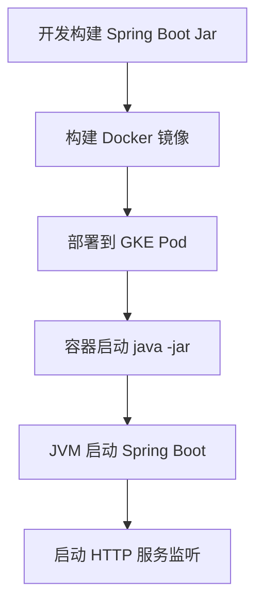

梳理一份适合平台层面理解 Java 应用特别是 Spring Boot 服务的知识点列表，分为几个核心维度，尤其结合你平台运行在 GKE 中的实际情况

---

## **📚 Java Spring 应用基础知识点汇总（面向平台工程师）**

  

### **1️⃣ Java 程序结构与运行机制**

|**关键概念**|**简要说明**|
|---|---|
|**JVM（Java Virtual Machine）**|Java 程序运行的虚拟机环境，每个 Java 应用运行在一个独立的 JVM 实例中。|
|**Java 进程与线程**|每个 Java 程序在系统层是一个进程，JVM 内部会创建多个线程处理业务逻辑、GC、HTTP 请求等。|
|**Jar 包 / Fat Jar**|应用最终打包成 .jar 文件，Spring Boot 应用常为“fat jar”（包含所有依赖的可执行包）。|
|**Main 方法**|Java 应用入口是 public static void main(String[] args) 方法（Spring Boot 中由 SpringApplication 启动）。|

---

### **2️⃣ Spring Boot 服务结构（平台最常见）**

```
your-app.jar/
├── META-INF/
├── BOOT-INF/
│   ├── classes/           # 业务代码（.class 文件）
│   └── lib/               # 所有依赖包（.jar 文件）
└── org.springframework.boot.loader.JarLauncher
```

- Spring Boot 应用通常只需执行：
    

```
java -jar your-app.jar
```

  

---

### **3️⃣ Java 在 GKE 中的部署模型（容器内）**

|**部署流程阶段**|**关键点说明**|
|---|---|
|Dockerfile 构建|基础镜像如 openjdk:17，将 .jar 拷贝到镜像中|
|CMD 启动服务|典型启动命令：java -Xms512m -Xmx1g -jar app.jar|
|配置挂载|通过 ConfigMap 挂载 application.yaml 等配置文件|
|探针配置|readiness / liveness Probe 保证服务健康性|

---

### **4️⃣ Java 应用常用配置项（Spring Boot）**

|**配置项**|**功能说明**|
|---|---|
|server.port|HTTP 服务监听端口|
|server.servlet.context-path|服务上下文路径（如 /api）|
|spring.profiles.active|激活的 profile，例如 dev、prod|
|logging.level.root|日志级别设置|

---

### **5️⃣ 线程与资源控制（你在 GKE 特别关注）**

|**控制项**|**说明**|
|---|---|
|-Xmx / -Xms|Java Heap 内存设置（最大 / 初始）|
|spring.task.execution.pool|控制异步线程池参数|
|HPA 扩容依据|Java CPU 占用通常是线程并发度的映射结果，需结合应用逻辑观察|

---

### **6️⃣ Java 常见问题排查点（平台运维视角）**

|**问题**|**可能原因**|
|---|---|
|OOM（内存溢出）|-Xmx 设置不合理、内存泄漏|
|CPU 飙高|线程死循环、任务过重|
|启动慢|包太大、Class 扫描太多、Spring Boot Autoconfiguration|
|请求响应慢|与外部依赖（DB、API）通信阻塞、线程池耗尽|

---

### **7️⃣ 日志管理**

|**日志框架**|**默认配置**|
|---|---|
|Spring Boot 默认|使用 Logback，日志打印到 stdout|
|平台建议|统一 stdout 到 GKE 的 stdout，供 GCP Logging 收集|

---

### **8️⃣ 推荐工具与命令**

```
# 查看线程情况
jstack <pid>

# 查看 JVM 内存占用
jmap -heap <pid>

# 常用容器内启动命令
java -Xms512m -Xmx1g -jar /app/app.jar

# GKE 容器查看资源
kubectl top pod -n your-namespace
```

---

### **Mermaid 流程图（GKE 中 Java 服务部署流程）**



---

如需进一步加深，可以下一步探索：

- Spring Boot 的依赖注入（DI）和生命周期
    
- 常用组件如 @Scheduled（定时任务）、@RestController、@Service
    
- Micrometer + Prometheus 的监控集成
    
- Java 的 GC 类型（G1, CMS）和调优
    

  

如你有具体服务的启动脚本、配置文件或错误日志，我可以进一步帮你分析其运行机制或优化建议。需要我帮你整理成 PDF 或添加样例代码也可以继续告诉我。