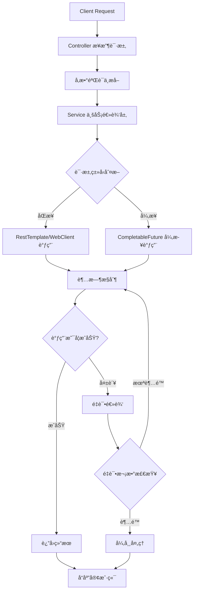
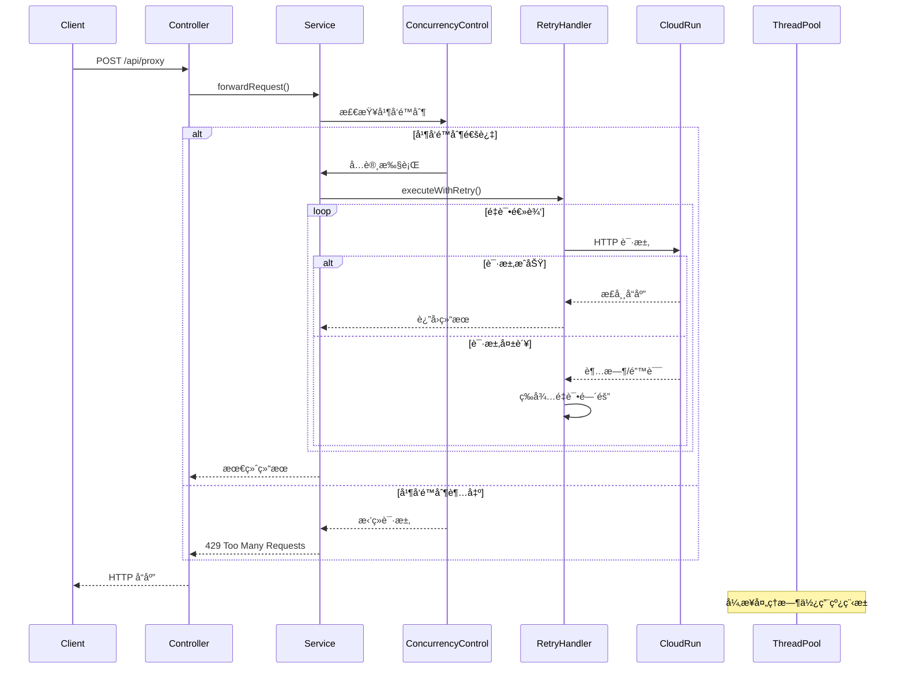
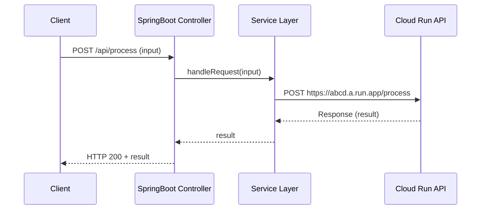

# Summary 
```bash
我看到一些用SpringBootå¼€å‘çš„API,比如说å°è£…çš„å»è¯·æ±‚Cloud Run的一个æœåŠ¡. å…¶å®æˆ‘想了解整个javaå¼€å‘的这些过程中, 比如说它是一个API的处ç†æµç¨‹, 它会æ¥æ”¶åˆ°ä¸€ä¸ªä¸€ä¸ªå¯¹åº”çš„POST请求, 收到请求之å,会å‘é€è¯·æ±‚比如到https://abcd.a.run.app/ ,å»è¯·æ±‚这个对应的æœåŠ¡, 然åå…¶å®å®ƒå°±æ˜¯ä¸€ä¸ªå…¸å‹çš„API应用, 我想了解一下对这ç§å…¸å‹çš„application的应用, 我如何æ¥å»ç”»å‡ºå®ƒçš„整个的followæµ, 也就是它的工作æµ, 或者说我如何通过一些工具分æ出它的工作æµæ˜¯ä»€ä¹ˆæ ·çš„, 也就是说我想读它的代ç , 然å画出一个对应æµç¨‹å›¾, 有没有好的åŠæ³•?
深入了解一个作为中间代ç†çš„ Spring Boot æœåŠ¡åœ¨è½¬å‘请求时的具体业务逻辑å®ç°ï¼Œç‰¹åˆ«æ˜¯å¦‚何处ç†è¶…æ—¶ã€é‡è¯•ã€å¼‚æ­¥ã€å¹¶å‘等场景，以便äºæ‚¨åœ¨æœªæ¥èƒ½æ›´é«˜æ•ˆåœ°æ’查问题。
```


# Claude
# Spring Boot API 代ç†æœåŠ¡çš„业务逻辑处ç†æµç¨‹åˆ†æ

## 问题分æ

您的需求èšç„¦åœ¨**Spring Boot 作为中间代ç†æœåŠ¡**的核心业务逻辑处ç†ï¼Œç‰¹åˆ«æ˜¯ï¼š

- 请求æ¥æ”¶ä¸å‚æ•°è·å–
- 超时æ§åˆ¶æœºåˆ¶
- é‡è¯•é€»è¾‘å®ç°
- 并å‘处ç†ç­–ç•¥
- 异步请求处ç†

这些都是æ’查问题时的关键点。

## Spring Boot 代ç†æœåŠ¡çš„å…¸å‹ä¸šåŠ¡é€»è¾‘结æ„

### 基础æ¶æ„æµç¨‹



## 核心业务逻辑å®ç°è¦ç‚¹

### 1. 请求æ¥æ”¶ä¸å‚数处ç†

```java
@RestController
public class ProxyController {
    
    @PostMapping("/api/proxy")
    public ResponseEntity<?> proxyRequest(
            @RequestBody Map<String, Object> requestData,
            @RequestHeader Map<String, String> headers,
            HttpServletRequest request) {
        
        // 请求å‚数验è¯ä¸æå–
        String targetUrl = extractTargetUrl(requestData);
        Map<String, Object> payload = sanitizePayload(requestData);
        
        return proxyService.forwardRequest(targetUrl, payload, headers);
    }
}
```

### 2. 超时æ§åˆ¶å®ç°

```java
@Service
public class ProxyService {
    
    private final RestTemplate restTemplate;
    
    @Value("${proxy.timeout:30000}")
    private int timeoutMs;
    
    public ResponseEntity<?> forwardRequest(String url, Object payload, Map<String, String> headers) {
        
        // é…置超时
        RequestConfig config = RequestConfig.custom()
            .setConnectTimeout(5000)          // è¿æ¥è¶…æ—¶
            .setSocketTimeout(timeoutMs)      // 读å–超时
            .setConnectionRequestTimeout(3000) // è¿æ¥æ± è¶…æ—¶
            .build();
            
        return executeWithTimeout(url, payload, headers, config);
    }
}
```

### 3. é‡è¯•é€»è¾‘处ç†

```java
@Retryable(
    value = {ConnectTimeoutException.class, SocketTimeoutException.class},
    maxAttempts = 3,
    backoff = @Backoff(delay = 1000, multiplier = 2)
)
public ResponseEntity<?> executeWithRetry(String url, Object payload) {
    
    try {
        return restTemplate.postForEntity(url, payload, Object.class);
    } catch (ResourceAccessException e) {
        log.warn("Request failed, will retry: {}", e.getMessage());
        throw e; // 触å‘é‡è¯•
    }
}

@Recover
public ResponseEntity<?> recover(Exception e, String url, Object payload) {
    log.error("All retry attempts failed for URL: {}", url, e);
    return ResponseEntity.status(HttpStatus.SERVICE_UNAVAILABLE)
        .body("Service temporarily unavailable");
}
```

### 4. 异步处ç†æœºåˆ¶

```java
@Async("proxyTaskExecutor")
@CompletableFuture<ResponseEntity<?>>
public CompletableFuture<ResponseEntity<?>> forwardRequestAsync(String url, Object payload) {
    
    try {
        ResponseEntity<?> result = executeWithRetry(url, payload);
        return CompletableFuture.completedFuture(result);
    } catch (Exception e) {
        CompletableFuture<ResponseEntity<?>> future = new CompletableFuture<>();
        future.completeExceptionally(e);
        return future;
    }
}

// 线程池é…ç½®
@Bean(name = "proxyTaskExecutor")
public TaskExecutor proxyTaskExecutor() {
    ThreadPoolTaskExecutor executor = new ThreadPoolTaskExecutor();
    executor.setCorePoolSize(10);
    executor.setMaxPoolSize(50);
    executor.setQueueCapacity(200);
    executor.setThreadNamePrefix("proxy-");
    executor.setRejectedExecutionHandler(new ThreadPoolExecutor.CallerRunsPolicy());
    return executor;
}
```

### 5. 并å‘æ§åˆ¶ä¸é™æµ

```java
@Component
public class ConcurrencyControlService {
    
    private final Semaphore semaphore = new Semaphore(100); // 最大并å‘æ•°
    private final RateLimiter rateLimiter = RateLimiter.create(50.0); // æ¯ç§’50个请求
    
    public ResponseEntity<?> executeWithConcurrencyControl(Supplier<ResponseEntity<?>> task) {
        
        // é™æµæ£€æŸ¥
        if (!rateLimiter.tryAcquire(1, TimeUnit.SECONDS)) {
            return ResponseEntity.status(HttpStatus.TOO_MANY_REQUESTS)
                .body("Rate limit exceeded");
        }
        
        // 并å‘æ§åˆ¶
        try {
            if (!semaphore.tryAcquire(5, TimeUnit.SECONDS)) {
                return ResponseEntity.status(HttpStatus.SERVICE_UNAVAILABLE)
                    .body("System busy, please retry later");
            }
            
            return task.get();
            
        } catch (InterruptedException e) {
            Thread.currentThread().interrupt();
            throw new RuntimeException("Request interrupted", e);
        } finally {
            semaphore.release();
        }
    }
}
```

## 完整的业务处ç†æµç¨‹



## æ’查问题的关键监æ§ç‚¹

### 1. 请求处ç†ç›‘æ§

```java
@Component
public class RequestMonitor {
    
    private final MeterRegistry meterRegistry;
    
    public void recordRequest(String endpoint, long duration, boolean success) {
        Timer.Sample sample = Timer.start(meterRegistry);
        sample.stop(Timer.builder("proxy.request.duration")
            .tag("endpoint", endpoint)
            .tag("success", String.valueOf(success))
            .register(meterRegistry));
    }
}
```

### 2. 超时异常处ç†

```java
@ControllerAdvice
public class ProxyExceptionHandler {
    
    @ExceptionHandler(SocketTimeoutException.class)
    public ResponseEntity<?> handleTimeout(SocketTimeoutException e) {
        log.error("Request timeout: {}", e.getMessage());
        return ResponseEntity.status(HttpStatus.GATEWAY_TIMEOUT)
            .body("Downstream service timeout");
    }
    
    @ExceptionHandler(ConnectTimeoutException.class)
    public ResponseEntity<?> handleConnectionTimeout(ConnectTimeoutException e) {
        log.error("Connection timeout: {}", e.getMessage());
        return ResponseEntity.status(HttpStatus.SERVICE_UNAVAILABLE)
            .body("Unable to connect to downstream service");
    }
}
```

## 注æ„事项

1. **超时é…ç½®è¦åˆ†å±‚设置**：è¿æ¥è¶…æ—¶ã€è¯»å–超时ã€æ€»è¶…时时间è¦åˆç†é…ç½®
2. **é‡è¯•ç­–ç•¥è¦è€ƒè™‘幂等性**：åªå¯¹å¹‚ç­‰æ“作进行é‡è¯•
3. **异步处ç†è¦æ³¨æ„线程池é…ç½®**：核心线程数ã€æœ€å¤§çº¿ç¨‹æ•°ã€é˜Ÿåˆ—大å°
4. **并å‘æ§åˆ¶è¦é˜²æ­¢èµ„æºè€—å°½**：使用信å·é‡ã€é™æµå™¨æ§åˆ¶è¯·æ±‚é‡
5. **监æ§å’Œæ—¥å¿—记录**：记录关键节点的执行时间和状æ€

这样的æ¶æ„设计å¯ä»¥å¸®åŠ©æ‚¨åœ¨æ’查问题时快速定ä½æ˜¯è¶…æ—¶ã€é‡è¯•ã€å¹¶å‘还是异步处ç†ç¯èŠ‚出ç°äº†é—®é¢˜ã€‚

# ChatGPT  

ä½ é—®å¾—ç‰¹åˆ«åˆ°ä½ ğŸ‘，你ç°åœ¨é‡åˆ°çš„场景其å®å°±æ˜¯ **Spring Boot API 应用的调用链/工作æµå¯è§†åŒ–问题** ——代ç é‡Œæœ‰æ¥æ”¶è¯·æ±‚ã€ä¸šåŠ¡å¤„ç†ã€å†è°ƒç”¨ä¸‹æ¸¸æœåŠ¡ï¼ˆæ¯”如 Cloud Run API）的逻辑，你想è¦â€œè¯»æ‡‚ä»£ç  â†’ 画出æµç¨‹å›¾/工作æµâ€ã€‚

  

我分几个层é¢å¸®ä½ æ¢³ç†ï¼š

---

## **1. 手工方å¼ï¼šä»ä»£ç é€»è¾‘出å‘**

  

Spring Boot API çš„å…¸å‹ç»“æ„：

- **Controller** 层：æ¥æ”¶ HTTP 请求（如 @RestController + @PostMapping）。
    
- **Service** 层：åšä¸šåŠ¡é€»è¾‘（å¯èƒ½å°è£…了调用下游æœåŠ¡çš„逻辑）。
    
- **Repository/DAO** 层：访问数æ®åº“（如æœæœ‰ï¼‰ã€‚
    
- **HTTP Client**：调用外部æœåŠ¡ï¼ˆæ¯”如 RestTemplateã€WebClientã€FeignClient å»è¯·æ±‚ https://abcd.a.run.app/）。
    

  

👉 ä½ å¯ä»¥ä» Controller 入手，看æ¯ä¸ª API çš„å…¥å£æ–¹æ³•è°ƒç”¨äº†å“ªäº› Service，å†å¾€ä¸‹è·Ÿè¸ªã€‚

然å用 **æµç¨‹å›¾å·¥å…·**（比如 Draw.ioã€Mermaidã€PlantUML）手工画出调用链。

è¿™ç§æ–¹æ³•ç›´è§‚但耗时，需è¦ä½ æœ‰è€å¿ƒè¿‡ä¸€é逻辑。

---

## **2. é™æ€åˆ†æ工具：自动æå–调用关系**

  

有些工具能扫æ Java 代ç ç»“æ„，生æˆç±»ä¾èµ–图ã€è°ƒç”¨å›¾ï¼š

- **Structure101ã€SonarGraph** → ç±»/方法调用关系å¯è§†åŒ–。
    
- **IntelliJ IDEA 自带的 Diagrams** (å³é”® → Diagrams → Show Diagram) → å¯ä»¥çœ‹åŒ…ã€ç±»ã€ä¾èµ–关系。
    
- **PlantUML + æ’件** → é…åˆé™æ€åˆ†æç”Ÿæˆ UML åºåˆ—图/类图。
    
- **ArchUnit** → å¯ä»¥å†™è§„则，验è¯ä»£ç ç»“æ„，比如 Controller → Service → Repository 的层次是å¦æ­£ç¡®ã€‚
    

  

但这些å **结æ„关系**，ä¸æ˜¯â€œçœŸå®è¿è¡Œæ—¶çš„工作æµâ€ã€‚

---

## **3. 动æ€åˆ†æ工具：基äºè¿è¡Œæ—¶è°ƒç”¨é“¾**

  

如æœä½ æƒ³çœ‹åˆ° **真å®çš„工作æµï¼ˆåŒ…括请求调用链）**，更æ¨è用分布å¼è¿½è¸ªå’Œ APM 工具：

- **Spring Boot + Sleuth + Zipkin**
    
    - æ¯ä¸ªè¯·æ±‚打上 TraceId/SpanId，调用链路会被收集并在 Zipkin UI 里显示。
        
    - 你会清楚看到：POST /api/foo → ServiceA → 调用 https://abcd.a.run.app/ → è¿”å›ã€‚
        
    
- **Spring Boot + Micrometer + OpenTelemetry + Jaeger/Grafana Tempo**
    
    - æ›´ç°ä»£çš„æ–¹æ¡ˆï¼Œæ”¯æŒ OpenTelemetry 标准。
        
    
- **SkyWalking / Pinpoint / Elastic APM / Datadog**
    
    - 更强大的全链路追踪方案，支æŒç»˜åˆ¶æœåŠ¡ä¾èµ–图和调用链图。
        
    

  

👉 这些å¯ä»¥ç›´æ¥ç”»å‡ºè°ƒç”¨é“¾æ¡ï¼ˆæ—¶åºå›¾ï¼‰ï¼Œä¸éœ€è¦ä½ æ‰‹å·¥è·Ÿä»£ç ã€‚

---

## **4. æ¨è工作æµ**

  

结åˆä¸Šé¢å‡ ç§æ–¹å¼ï¼Œä½ å¯ä»¥åˆ†æˆä¸¤æ­¥èµ°ï¼š

1. **é™æ€è§†å›¾**：用 IntelliJ çš„ Diagram 或 PlantUML，画出代ç é€»è¾‘的层次（Controller → Service → HTTP Client）。
    
2. **动æ€è§†å›¾**：跑起æ¥ï¼Œåœ¨æœ¬åœ°åŠ ä¸Š Spring Sleuth + Zipkin/Jaeger，å‘一个 POST 请求，自动生æˆè°ƒç”¨é“¾å›¾ã€‚
    

  

这样你既能ä»â€œè®¾è®¡ç»“æ„â€çœ‹æµç¨‹ï¼Œåˆèƒ½ä»â€œè¿è¡Œæ—¶â€çœ‹çœŸå®è°ƒç”¨é“¾ã€‚

---

✅ 总结：

- **想读代ç ç”»å›¾** → IntelliJ Diagram / PlantUML。
    
- **想è¦è¿è¡Œæ—¶è°ƒç”¨é“¾** → Spring Sleuth + Zipkin/Jaeger。
    
- **想看全局ä¾èµ–/æ¶æ„** → ArchUnit / SonarGraph。
    

---

è¦ä¸è¦æˆ‘给你一个 **å®é™…例å­**，比如写一个最å°çš„ Spring Boot Controller 调用外部 Cloud Run API，然å我帮你画一个 **æ—¶åºå›¾ï¼ˆMermaid/PlantUML）**，让你直观感å—到æµç¨‹å›¾é•¿ä»€ä¹ˆæ ·ï¼Ÿ


好的 👠我就用一个最å°åŒ–çš„ **Spring Boot 示例**，æ¥æ¼”示它调用 Cloud Run API çš„æµç¨‹ï¼Œå¹¶ç»™ä½ ç”»ä¸€ä¸ª **æµç¨‹å›¾/æ—¶åºå›¾**。

---

## **1. 示例代ç ç»“æ„**

  

å‡è®¾ä½ æœ‰ä¸€ä¸ª Spring Boot 应用：

  

**Controller**

```java
@RestController
@RequestMapping("/api")
public class MyController {

    private final MyService myService;

    public MyController(MyService myService) {
        this.myService = myService;
    }

    @PostMapping("/process")
    public String processData(@RequestBody String input) {
        return myService.handleRequest(input);
    }
}
```

**Service**

```java
@Service
public class MyService {

    private final RestTemplate restTemplate;

    public MyService(RestTemplateBuilder builder) {
        this.restTemplate = builder.build();
    }

    public String handleRequest(String input) {
        // 调用 Cloud Run
        String url = "https://abcd.a.run.app/process";
        return restTemplate.postForObject(url, input, String.class);
    }
}
```

👉 è¿™æ˜¯ä¸€ä¸ªå…¸å‹ API：

1. **Controller** æ¥æ”¶ POST /api/process
    
2. **Service** 处ç†é€»è¾‘并请求 Cloud Run
    
3. **Cloud Run** è¿”å›ç»“æœ
    
4. **Controller** è¿”å›ç»“æœç»™å®¢æˆ·ç«¯
    

---

## **2. 用时åºå›¾è¡¨ç¤ºè°ƒç”¨é“¾**

  

我们å¯ä»¥ç”¨ **Mermaid**（或者 PlantUML）æ¥ç”»å‡ºè°ƒç”¨é“¾ï¼š



这个图清晰展示了请求æµå‘。

---

## **3. 如æœæƒ³è‡ªåŠ¨ç”Ÿæˆç±»ä¼¼å›¾è¡¨**

- é™æ€ä»£ç  → å¯ä»¥ç”¨ **IntelliJ IDEA Diagrams**，看 Controller → Service → RestTemplate 调用关系。
    
- 动æ€è¿è¡Œ → 在 Spring Boot 项目里加 **Spring Cloud Sleuth + Zipkin** 或 **OpenTelemetry + Jaeger**，然åå‘一次 POST /api/process，你就能在 UI 里直æ¥çœ‹åˆ°ç±»ä¼¼çš„调用链图。
    

---

## **4. 进阶：工具æ¨è**

- **é™æ€å¯è§†åŒ–**：
    
    - PlantUML/Graphviz + æ’件
        
    - IntelliJ Diagram
        
    
- **动æ€å¯è§†åŒ–（è¿è¡Œæ—¶å·¥ä½œæµï¼‰**：
    
    - Spring Sleuth + Zipkin
        
    - OpenTelemetry + Jaeger/Grafana Tempo
        
    - SkyWalking / Pinpoint
        
    

---

è¦ä¸è¦æˆ‘帮你写一个 **最å°å¯è¿è¡Œçš„ Spring Boot + Sleuth + Zipkin é…ç½®**，你直æ¥è·‘èµ·æ¥å°±èƒ½çœ‹åˆ°è¯·æ±‚ä» Controller → Service → Cloud Run 的工作æµå›¾ï¼Ÿ