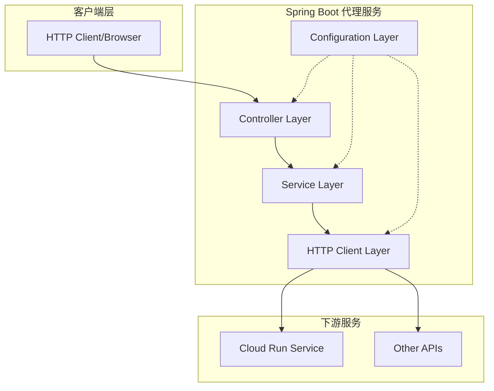
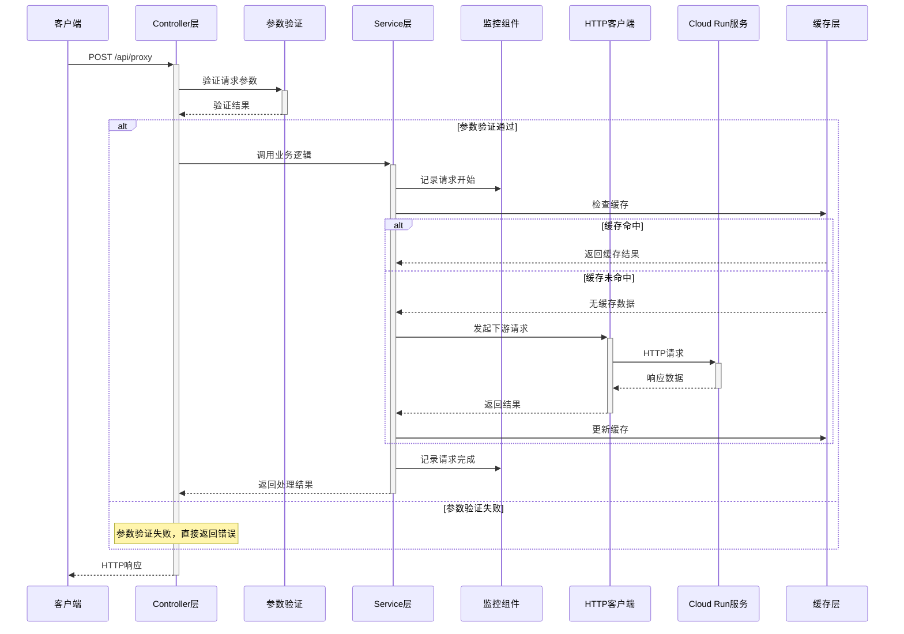
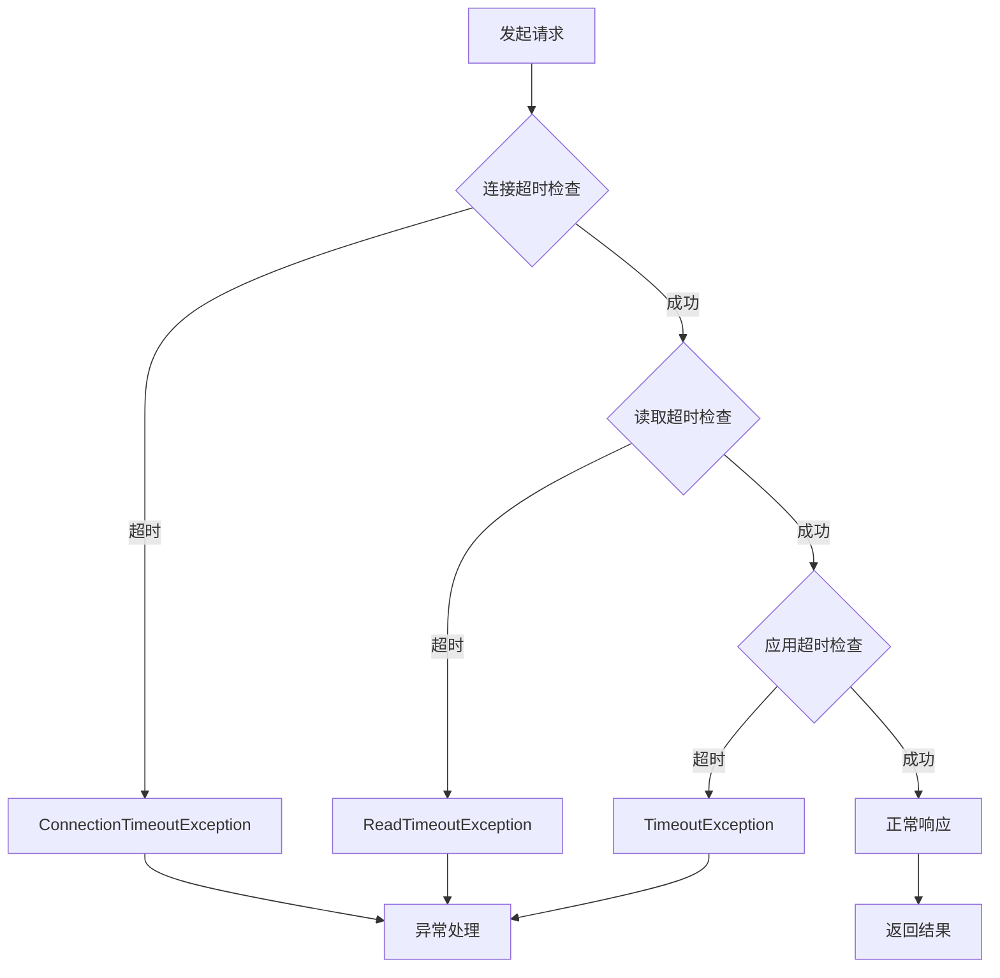
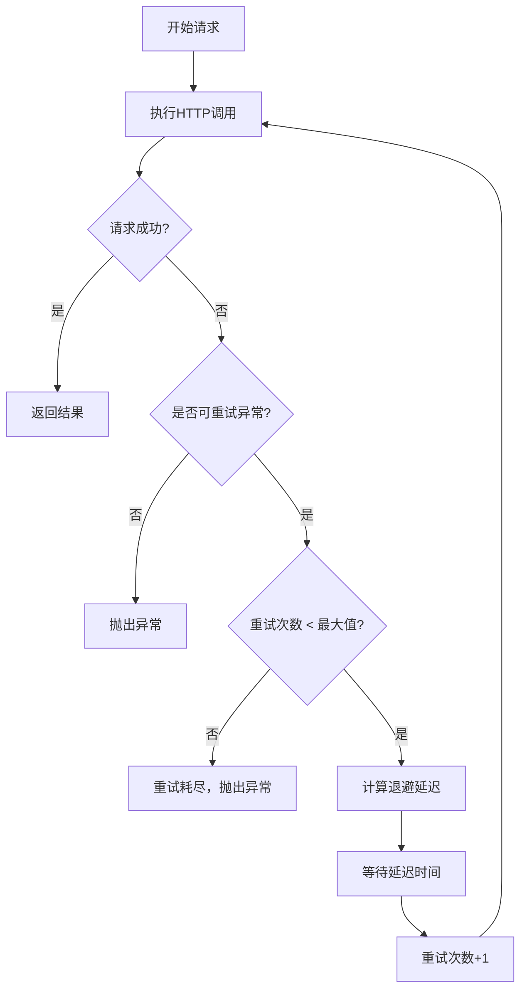

# Spring Boot Cloud Run 代理服务深度探索指南

## 概述

本文档深入探讨 Spring Boot 作为中间代理服务调用 Cloud Run 等下游服务的完整工作流程，重点关注如何通过代码分析和工具辅助来可视化整个请求处理流程，并深入理解超时、重试、异步、并发等核心业务逻辑的实现。

## 1. 典型 Spring Boot API 代理服务架构

### 1.1 基础架构层次



### 1.2 请求处理的完整生命周期



## 2. 核心业务逻辑深度解析

### 2.1 现代化的 WebClient 实现

相比传统的 RestTemplate，WebClient 提供了更强大的异步和响应式编程能力：

```java
@Configuration
public class WebClientConfig {

    @Bean
    public WebClient webClient() {
        return WebClient.builder()
            .baseUrl("https://abcd.a.run.app")
            .defaultHeader(HttpHeaders.CONTENT_TYPE, MediaType.APPLICATION_JSON_VALUE)
            .codecs(configurer -> configurer.defaultCodecs().maxInMemorySize(1024 * 1024))
            .build();
    }
}

@Service
@Slf4j
public class CloudRunProxyService {

    private final WebClient webClient;
    private final MeterRegistry meterRegistry;

    public CloudRunProxyService(WebClient webClient, MeterRegistry meterRegistry) {
        this.webClient = webClient;
        this.meterRegistry = meterRegistry;
    }

    public Mono<ResponseEntity<String>> forwardRequest(String endpoint, Object payload) {
        return Timer.Sample.start(meterRegistry)
            .stop(webClient.post()
                .uri(endpoint)
                .bodyValue(payload)
                .retrieve()
                .toEntity(String.class)
                .doOnSuccess(response -> log.info("Request successful: {}", response.getStatusCode()))
                .doOnError(error -> log.error("Request failed: {}", error.getMessage()))
            );
    }
}
```

### 2.2 超时控制的多层次实现

```java
@Service
public class TimeoutControlService {

    private final WebClient webClient;

    @Value("${app.timeout.connection:5000}")
    private int connectionTimeout;

    @Value("${app.timeout.read:30000}")
    private int readTimeout;

    public TimeoutControlService(WebClient.Builder webClientBuilder) {
        HttpClient httpClient = HttpClient.create()
            .option(ChannelOption.CONNECT_TIMEOUT_MILLIS, connectionTimeout)
            .responseTimeout(Duration.ofMillis(readTimeout))
            .doOnConnected(conn ->
                conn.addHandlerLast(new ReadTimeoutHandler(readTimeout, TimeUnit.MILLISECONDS))
                    .addHandlerLast(new WriteTimeoutHandler(readTimeout, TimeUnit.MILLISECONDS)));

        this.webClient = webClientBuilder
            .clientConnector(new ReactorClientHttpConnector(httpClient))
            .build();
    }

    public Mono<String> executeWithTimeout(String url, Object payload) {
        return webClient.post()
            .uri(url)
            .bodyValue(payload)
            .retrieve()
            .bodyToMono(String.class)
            .timeout(Duration.ofSeconds(25)) // 应用级超时
            .onErrorMap(TimeoutException.class,
                ex -> new ServiceTimeoutException("Service call timed out", ex));
    }
}
```

**超时处理流程图：**



### 2.3 智能重试机制

```java
@Service
public class RetryService {

    private final WebClient webClient;

    public Mono<String> executeWithRetry(String url, Object payload) {
        return webClient.post()
            .uri(url)
            .bodyValue(payload)
            .retrieve()
            .bodyToMono(String.class)
            .retryWhen(Retry.backoff(3, Duration.ofMillis(100))
                .maxBackoff(Duration.ofSeconds(2))
                .jitter(0.1)
                .filter(this::isRetryableException)
                .doBeforeRetry(retrySignal ->
                    log.warn("Retrying request, attempt: {}, error: {}",
                        retrySignal.totalRetries() + 1,
                        retrySignal.failure().getMessage()))
            );
    }

    private boolean isRetryableException(Throwable throwable) {
        return throwable instanceof ConnectTimeoutException ||
               throwable instanceof ReadTimeoutException ||
               (throwable instanceof WebClientResponseException &&
                isRetryableStatusCode(((WebClientResponseException) throwable).getStatusCode()));
    }

    private boolean isRetryableStatusCode(HttpStatus status) {
        return status == HttpStatus.SERVICE_UNAVAILABLE ||
               status == HttpStatus.BAD_GATEWAY ||
               status == HttpStatus.GATEWAY_TIMEOUT;
    }
}
```

**重试逻辑流程图：**



### 2.4 并发处理与资源控制

```java
@Service
public class ConcurrentRequestService {

    private final WebClient webClient;
    private final Semaphore concurrencyLimiter;
    private final RateLimiter rateLimiter;

    public ConcurrentRequestService(WebClient webClient) {
        this.webClient = webClient;
        this.concurrencyLimiter = new Semaphore(50); // 最大并发50
        this.rateLimiter = RateLimiter.create(100.0); // 每秒100请求
    }

    public Mono<String> handleConcurrentRequest(String url, Object payload) {
        return Mono.fromCallable(() -> {
                // 限流检查
                if (!rateLimiter.tryAcquire(Duration.ofMillis(100))) {
                    throw new RateLimitExceededException("Rate limit exceeded");
                }

                // 并发控制
                if (!concurrencyLimiter.tryAcquire()) {
                    throw new ConcurrencyLimitExceededException("Too many concurrent requests");
                }

                return payload;
            })
            .flatMap(p -> webClient.post()
                .uri(url)
                .bodyValue(p)
                .retrieve()
                .bodyToMono(String.class))
            .doFinally(signalType -> concurrencyLimiter.release());
    }

    // 并发调用多个服务
    public Mono<CombinedResponse> callMultipleServices(String input) {
        Mono<String> serviceA = callService("https://service-a.a.run.app/process", input);
        Mono<String> serviceB = callService("https://service-b.a.run.app/process", input);
        Mono<String> serviceC = callService("https://service-c.a.run.app/process", input);

        return Mono.zip(serviceA, serviceB, serviceC)
            .map(tuple -> new CombinedResponse(tuple.getT1(), tuple.getT2(), tuple.getT3()));
    }

    private Mono<String> callService(String url, String input) {
        return webClient.post()
            .uri(url)
            .bodyValue(input)
            .retrieve()
            .bodyToMono(String.class)
            .timeout(Duration.ofSeconds(10));
    }
}
```

## 3. 工作流可视化方法与工具

### 3.1 静态代码分析方法

#### 方法一：IntelliJ IDEA 内置工具

```bash
# 在 IntelliJ IDEA 中
1. 右键点击 Controller 类
2. 选择 "Diagrams" -> "Show Diagram"
3. 选择 "Java Class Diagram" 或 "Spring Bean Dependencies"
4. 可以看到类之间的依赖关系和调用链
```

#### 方法二：PlantUML 自动生成

```java
// 使用注解标记关键流程
@Component
@PlantUMLSequence
public class RequestFlowDocumentation {

    /**
     * @startuml
     * Client -> Controller: POST /api/proxy
     * Controller -> Service: forwardRequest()
     * Service -> WebClient: HTTP call
     * WebClient -> CloudRun: Request
     * CloudRun -> WebClient: Response
     * WebClient -> Service: Result
     * Service -> Controller: Processed result
     * Controller -> Client: HTTP Response
     * @enduml
     */
    public void documentRequestFlow() {
        // 这个方法用于生成 PlantUML 文档
    }
}
```

### 3.2 动态运行时分析

#### Spring Boot + OpenTelemetry 配置

```yaml
# application.yml
management:
  tracing:
    sampling:
      probability: 1.0
  otlp:
    tracing:
      endpoint: http://localhost:4318/v1/traces

spring:
  application:
    name: spring-cloud-run-proxy
```

```java
@Configuration
public class TracingConfiguration {

    @Bean
    public OpenTelemetry openTelemetry() {
        return OpenTelemetrySdk.builder()
            .setTracerProvider(
                SdkTracerProvider.builder()
                    .addSpanProcessor(BatchSpanProcessor.builder(
                        OtlpGrpcSpanExporter.builder()
                            .setEndpoint("http://localhost:4317")
                            .build())
                        .build())
                    .setResource(Resource.getDefault()
                        .merge(Resource.builder()
                            .put(ResourceAttributes.SERVICE_NAME, "spring-cloud-run-proxy")
                            .build()))
                    .build())
            .build();
    }
}

@RestController
@Slf4j
public class TracedProxyController {

    private final CloudRunProxyService proxyService;
    private final Tracer tracer;

    @PostMapping("/api/proxy")
    public Mono<ResponseEntity<String>> proxyRequest(@RequestBody Map<String, Object> request) {
        Span span = tracer.spanBuilder("proxy-request")
            .setAttribute("http.method", "POST")
            .setAttribute("http.url", "/api/proxy")
            .startSpan();

        return Mono.fromCallable(() -> request)
            .flatMap(req -> proxyService.forwardRequest("/process", req))
            .doOnSuccess(response -> {
                span.setStatus(StatusCode.OK);
                span.setAttribute("http.status_code", response.getStatusCodeValue());
            })
            .doOnError(error -> {
                span.setStatus(StatusCode.ERROR, error.getMessage());
                span.recordException(error);
            })
            .doFinally(signalType -> span.end());
    }
}
```

### 3.3 完整的监控和可视化方案

#### Docker Compose 监控栈

```yaml
# docker-compose.monitoring.yml
version: "3.8"
services:
  jaeger:
    image: jaegertracing/all-in-one:latest
    ports:
      - "16686:16686"
      - "14250:14250"
    environment:
      - COLLECTOR_OTLP_ENABLED=true

  prometheus:
    image: prom/prometheus
    ports:
      - "9090:9090"
    volumes:
      - ./prometheus.yml:/etc/prometheus/prometheus.yml

  grafana:
    image: grafana/grafana
    ports:
      - "3000:3000"
    environment:
      - GF_SECURITY_ADMIN_PASSWORD=admin
```

#### 自定义监控指标

```java
@Component
public class ProxyMetrics {

    private final Counter requestCounter;
    private final Timer requestTimer;
    private final Gauge activeConnections;

    public ProxyMetrics(MeterRegistry meterRegistry) {
        this.requestCounter = Counter.builder("proxy.requests.total")
            .description("Total number of proxy requests")
            .tag("service", "cloud-run-proxy")
            .register(meterRegistry);

        this.requestTimer = Timer.builder("proxy.request.duration")
            .description("Request processing time")
            .register(meterRegistry);

        this.activeConnections = Gauge.builder("proxy.connections.active")
            .description("Active connections count")
            .register(meterRegistry, this, ProxyMetrics::getActiveConnectionCount);
    }

    public void recordRequest(String endpoint, Duration duration, boolean success) {
        requestCounter.increment(
            Tags.of(
                Tag.of("endpoint", endpoint),
                Tag.of("success", String.valueOf(success))
            )
        );
        requestTimer.record(duration);
    }

    private double getActiveConnectionCount() {
        // 实现获取活跃连接数的逻辑
        return 0.0;
    }
}
```

## 4. 问题排查最佳实践

### 4.1 分层日志策略

```java
@Slf4j
@Component
public class RequestLogger {

    public void logRequestStart(String traceId, String method, String uri, Object payload) {
        log.info("REQUEST_START [{}] {} {} payload_size={}",
            traceId, method, uri, getPayloadSize(payload));
    }

    public void logDownstreamCall(String traceId, String targetUrl, long startTime) {
        log.info("DOWNSTREAM_CALL [{}] target={} start_time={}",
            traceId, targetUrl, startTime);
    }

    public void logDownstreamResponse(String traceId, String targetUrl,
                                    int statusCode, long duration) {
        log.info("DOWNSTREAM_RESPONSE [{}] target={} status={} duration={}ms",
            traceId, targetUrl, statusCode, duration);
    }

    public void logRequestEnd(String traceId, int statusCode, long totalDuration) {
        log.info("REQUEST_END [{}] status={} total_duration={}ms",
            traceId, statusCode, totalDuration);
    }

    public void logError(String traceId, String operation, Throwable error) {
        log.error("ERROR [{}] operation={} error={}",
            traceId, operation, error.getMessage(), error);
    }
}
```

### 4.2 健康检查和断路器

```java
@Component
public class CircuitBreakerService {

    private final CircuitBreaker circuitBreaker;

    public CircuitBreakerService() {
        this.circuitBreaker = CircuitBreaker.ofDefaults("cloudRunService");
        circuitBreaker.getEventPublisher()
            .onStateTransition(event ->
                log.info("Circuit breaker state transition: {} -> {}",
                    event.getStateTransition().getFromState(),
                    event.getStateTransition().getToState()));
    }

    public Mono<String> callWithCircuitBreaker(String url, Object payload) {
        Supplier<Mono<String>> decoratedSupplier = CircuitBreaker
            .decorateSupplier(circuitBreaker, () ->
                webClient.post()
                    .uri(url)
                    .bodyValue(payload)
                    .retrieve()
                    .bodyToMono(String.class));

        return Mono.fromSupplier(decoratedSupplier)
            .flatMap(mono -> mono)
            .onErrorResume(CallNotPermittedException.class,
                ex -> Mono.error(new ServiceUnavailableException("Circuit breaker is open")));
    }
}
```

## 5. 实际应用示例

### 5.1 完整的代理服务实现

```java
@RestController
@RequestMapping("/api/v1")
@Validated
@Slf4j
public class CloudRunProxyController {

    private final CloudRunProxyService proxyService;
    private final RequestLogger requestLogger;
    private final ProxyMetrics metrics;

    @PostMapping("/proxy/{service}")
    public Mono<ResponseEntity<Object>> proxyToCloudRun(
            @PathVariable String service,
            @Valid @RequestBody ProxyRequest request,
            @RequestHeader Map<String, String> headers,
            ServerHttpRequest httpRequest) {

        String traceId = generateTraceId();
        long startTime = System.currentTimeMillis();

        requestLogger.logRequestStart(traceId, "POST", httpRequest.getURI().toString(), request);

        return proxyService.forwardToCloudRun(service, request, headers)
            .doOnSuccess(response -> {
                long duration = System.currentTimeMillis() - startTime;
                requestLogger.logRequestEnd(traceId, response.getStatusCodeValue(), duration);
                metrics.recordRequest(service, Duration.ofMillis(duration), true);
            })
            .doOnError(error -> {
                long duration = System.currentTimeMillis() - startTime;
                requestLogger.logError(traceId, "proxy_request", error);
                metrics.recordRequest(service, Duration.ofMillis(duration), false);
            });
    }

    private String generateTraceId() {
        return UUID.randomUUID().toString().substring(0, 8);
    }
}
```

### 5.2 配置文件示例

```yaml
# application.yml
server:
  port: 8080

spring:
  application:
    name: cloud-run-proxy
  webflux:
    base-path: /api/v1

app:
  cloud-run:
    base-url: https://abcd.a.run.app
    services:
      service-a: /service-a
      service-b: /service-b
      service-c: /service-c

  timeout:
    connection: 5000
    read: 30000
    total: 35000

  retry:
    max-attempts: 3
    initial-delay: 100
    max-delay: 2000

  concurrency:
    max-connections: 50
    rate-limit: 100

management:
  endpoints:
    web:
      exposure:
        include: health,metrics,prometheus,info
  endpoint:
    health:
      show-details: always
  metrics:
    export:
      prometheus:
        enabled: true
```

## 6. 总结与建议

### 6.1 工作流可视化的最佳实践

1. **分层可视化**：

   - 架构层：使用 C4 模型或 UML 组件图
   - 代码层：使用 IntelliJ Diagrams 或 PlantUML
   - 运行时：使用 OpenTelemetry + Jaeger/Zipkin

2. **工具选择建议**：

   - 开发阶段：IntelliJ IDEA + PlantUML
   - 测试阶段：Spring Boot Actuator + Micrometer
   - 生产环境：OpenTelemetry + Jaeger + Prometheus + Grafana

3. **监控指标重点**：
   - 请求量和响应时间
   - 错误率和超时率
   - 下游服务依赖健康状态
   - 资源使用情况（CPU、内存、连接数）

### 6.2 问题排查策略

1. **日志分析**：使用结构化日志和 TraceId 关联
2. **指标监控**：设置合理的告警阈值
3. **链路追踪**：可视化请求在系统中的完整路径
4. **性能分析**：识别瓶颈和优化点

通过这套完整的方案，你可以深入理解 Spring Boot 代理服务的工作原理，并具备强大的问题排查和性能优化能力。
