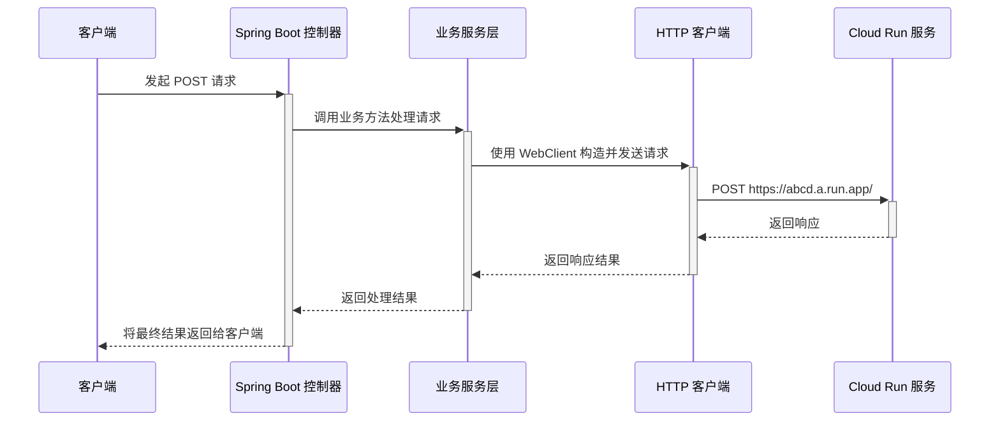
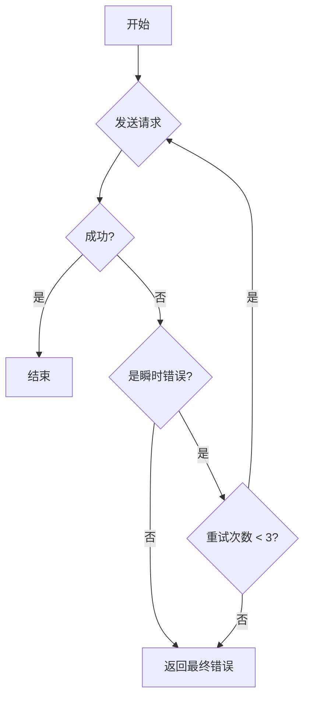
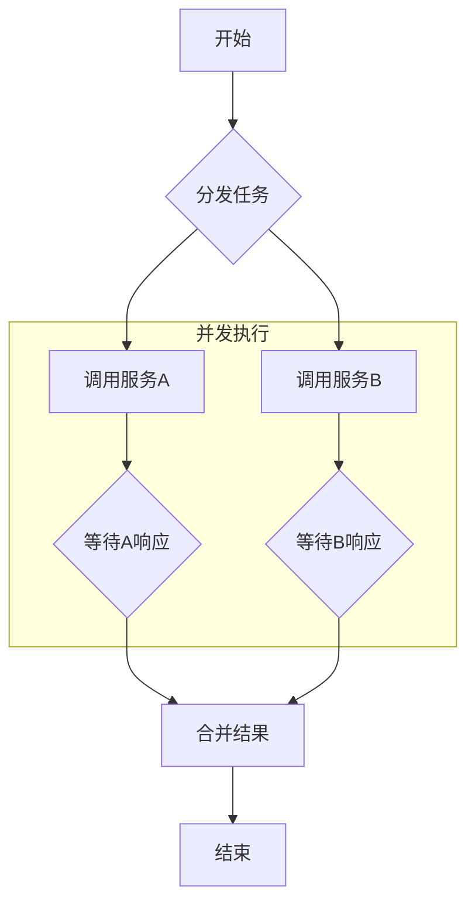

# 深入解析 Spring Boot 代理服务的核心业务逻辑

本文档旨在深入探讨一个作为中间代理的 Spring Boot 服务在转发请求至下游服务（如 Cloud Run）时，其内部核心业务逻辑的实现细节。我们将重点关注**超时、重试、异步和并发**这四个关键场景，并提供具体的代码示例和 Mermaid 流程图，帮助您理解其工作原理，从而在未来更高效地排查问题。

我们将使用 Spring 5+ 推荐的 `WebClient` 来实现，因为它在处理异步和响应式编程方面比传统的 `RestTemplate` 更强大、更灵活。

---

## 1. 基础调用流程

在深入复杂场景之前，我们先回顾一下基础的请求转发流程。



这个流程清晰地展示了请求的 happy path，但实际生产环境中，我们需要处理各种异常情况。

---

## 2. 核心业务逻辑实现

### 2.1. 超时处理 (Timeout Handling)

**目的**：防止因下游服务响应过慢而耗尽代理服务的线程资源，导致整个服务不可用。

**实现**：`WebClient` 提供了非常简便的超时配置。

**代码示例 (`MyService.java`)**：
```java
import org.springframework.stereotype.Service;
import org.springframework.web.reactive.function.client.WebClient;
import reactor.core.publisher.Mono;
import java.time.Duration;

@Service
public class MyService {

    private final WebClient webClient;

    public MyService(WebClient.Builder webClientBuilder) {
        this.webClient = webClientBuilder.baseUrl("https://abcd.a.run.app").build();
    }

    public Mono<String> handleRequestWithTimeout(String input) {
        return this.webClient.post()
                .uri("/process")
                .bodyValue(input)
                .retrieve()
                .bodyToMono(String.class)
                // 设置 5 秒超时
                .timeout(Duration.ofSeconds(5));
    }
}
```

**排查思路**：当客户端遇到请求超时时，如果代理服务的日志中出现 `TimeoutException`，则可以断定是下游 Cloud Run 服务未在规定时间内（本例中为5秒）响应，从而快速定位问题根源。

**流程图**：
```mermaid
sequenceDiagram
    participant Service as 业务服务层
    participant WebClient as HTTP 客户端
    participant CloudRun as Cloud Run 服务

    Service->>+WebClient: 发送请求 (设置 5s 超时)
    WebClient->>+CloudRun: 转发请求

    alt 5秒内响应
        CloudRun-->>-WebClient: 正常返回
        WebClient-->>-Service: 返回成功结果
    else 超过5秒
        CloudRun-->>-WebClient: (响应延迟)
        WebClient-->>-Service: 触发 TimeoutException
    end
```

### 2.2. 重试机制 (Retry Mechanism)

**目的**：应对下游服务可能出现的瞬时网络抖动或临时不可用（如返回 502/503 错误），通过自动重试来提高请求的成功率。

**实现**：可以借助 `reactor-extra` 库中的 `Retry` 策略来实现复杂的重试逻辑，例如指数退避（Exponential Backoff）。

**代码示例 (`MyService.java`)**：
```java
import org.springframework.stereotype.Service;
import org.springframework.web.reactive.function.client.WebClient;
import reactor.core.publisher.Mono;
import reactor.util.retry.Retry;
import java.time.Duration;

@Service
public class MyService {

    private final WebClient webClient;

    public MyService(WebClient.Builder webClientBuilder) {
        this.webClient = webClientBuilder.baseUrl("https://abcd.a.run.app").build();
    }

    public Mono<String> handleRequestWithRetry(String input) {
        return this.webClient.post()
                .uri("/process")
                .bodyValue(input)
                .retrieve()
                .bodyToMono(String.class)
                // 配置重试逻辑：最多重试3次，首次延迟100ms，后续指数增加
                .retryWhen(Retry.backoff(3, Duration.ofMillis(100))
                        .filter(throwable -> throwable instanceof MyTransientException)); // 只针对特定异常重试
    }
}

// 自定义一个用于判断是否应该重试的异常
class MyTransientException extends RuntimeException {
    public MyTransientException(String message) {
        super(message);
    }
}
```

**排查思路**：如果在日志中发现一个外部请求触发了多次对下游服务的调用，这很可能就是重试机制在起作用。通过检查日志中的错误信息和重试次数，可以判断下游服务的稳定性。

**流程图**：


### 2.3. 异步处理 (Asynchronous Processing)

**目的**：将传统的阻塞式IO转变为非阻塞式IO，使用更少的线程处理更高的并发量，提升服务的吞吐能力和弹性。

**实现**：`WebClient` 本身就是异步非阻塞的。它返回 `Mono` (代表0或1个结果) 或 `Flux` (代表0到N个结果)。我们只需将这个响应式类型一路返回到 Controller 层即可。

**代码示例 (`MyController.java` 和 `MyService.java`)**：
```java
// MyController.java
@RestController
public class MyController {
    private final MyService myService;
    // ... 构造函数 ...

    @PostMapping("/process-async")
    public Mono<String> processDataAsync(@RequestBody String input) {
        // 直接返回 Mono，Spring Boot 会自动处理后续的非阻塞响应
        return myService.handleRequestAsync(input);
    }
}

// MyService.java
@Service
public class MyService {
    // ... WebClient 定义 ...

    public Mono<String> handleRequestAsync(String input) {
        // WebClient 调用本身就是异步的
        return this.webClient.post()
                .uri("/process")
                .bodyValue(input)
                .retrieve()
                .bodyToMono(String.class);
    }
}
```

**排查思路**：采用异步处理后，服务线程不会在等待下游响应时被阻塞。如果遇到性能瓶颈，可以优先排查代码中是否存在隐藏的阻塞操作（如调用了 `.block()` 方法），而不是盲目增加线程池大小。

**流程图**：
```mermaid
sequenceDiagram
    participant Client
    participant Controller
    participant Service
    participant CloudRun

    Client->>+Controller: 发起请求
    Controller->>+Service: 调用异步方法 (立即返回 Mono)
    Controller-->>-Client: (连接保持，等待数据)
    Service->>+CloudRun: 发送异步请求
    
    CloudRun-->>-Service: 响应数据到达
    Service-->>-Controller: 数据流向 Mono
    Controller-->>-Client: 数据写入响应，关闭连接
```

### 2.4. 并发请求 (Concurrent Requests)

**目的**：当一次外部请求需要调用多个下游服务并合并结果时，通过并发调用来缩短总响应时间。

**实现**：使用 `Mono.zip` 或 `Flux.merge` 来并发执行多个 `WebClient` 调用。

**代码示例 (`MyService.java`)**：
```java
import org.springframework.stereotype.Service;
import org.springframework.web.reactive.function.client.WebClient;
import reactor.core.publisher.Mono;

@Service
public class MyService {

    private final WebClient webClient;

    public MyService(WebClient.Builder webClientBuilder) {
        this.webClient = webClientBuilder.build();
    }

    public Mono<String> handleConcurrentRequests(String input) {
        // 对两个不同的 Cloud Run 服务发起并发调用
        Mono<String> call1 = webClient.post().uri("https://service-a.a.run.app/process").bodyValue(input).retrieve().bodyToMono(String.class);
        Mono<String> call2 = webClient.post().uri("https://service-b.a.run.app/process").bodyValue(input).retrieve().bodyToMono(String.class);

        // 当两个调用都成功返回后，将它们的结果合并
        return Mono.zip(call1, call2, (response1, response2) -> {
            // 在这里定义如何合并结果
            return "Response from A: " + response1 + " | Response from B: " + response2;
        });
    }
}
```

**排查思路**：如果一个请求的总体响应时间约等于其最慢的那个下游调用的时间，那么说明并发执行是成功的。如果总时间是所有下游调用时间之和，那么很可能是代码逻辑变成了串行执行，需要检查是否正确使用了 `zip` 或 `merge`。

**流程图**：


---

## 3. 总结与建议

通过上述示例，我们可以看到，现代的 Spring Boot 应用借助 `WebClient` 和 Project Reactor 能够以非常优雅和声明式的方式处理复杂的业务场景。

- **排查问题的关键**：
  1. **日志**：在关键步骤（如发起请求、收到响应、进入重试、发生超时）打印清晰的日志是定位问题的基础。
  2. **理解模式**：理解代码中应用的具体是哪种模式（超时、重试、并发），能帮助您推断问题的可能原因。例如，延迟高可能与超时或下游性能有关；多次调用记录可能与重试有关。
  3. **分布式追踪**：在生产环境中，强烈建议集成 **OpenTelemetry**、**Zipkin** 或 **SkyWalking** 等分布式追踪系统。它们能将这些复杂的异步、并发调用链可视化，让问题排查的效率提升一个数量级。

希望这份文档能帮助您更深入地理解 Spring Boot 代理服务的工作过程，并在未来的工作中更加得心应手。
