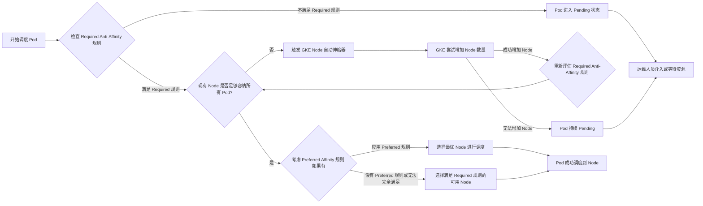

从您提供的K8S Deployment配置中提取出的部分如下：

### 提取的K8S Deployment配置
```yaml
spec:
  affinity:
    podAntiAffinity:
      requiredDuringSchedulingIgnoredDuringExecution:
        - labelSelector:
            matchExpressions:
              - key: app
                operator: In
                values:
                  - nginx
          topologyKey: kubernetes.io/hostname
      preferredDuringSchedulingIgnoredDuringExecution:
        - weight: 1
          podAffinityTerm:
            labelSelector:
              matchExpressions:
                - key: app
                  operator: In
                  values:
                    - nginx
            topologyKey: topology.kubernetes.io/zone
  automountServiceAccountToken: false
```

### 配置总结
1. **affinity**: 此字段用于定义Pod之间的亲和性和反亲和性规则，以优化Pod的调度。
  
2. **podAntiAffinity**: 该部分定义了不希望在同一节点上运行的Pod的规则。
   - **requiredDuringSchedulingIgnoredDuringExecution**: 定义了必须遵循的反亲和性规则。
     - **labelSelector**: 选择具有特定标签的Pod。在这里选择标签为`app: nginx`的Pod。
     - **topologyKey**: 这里为 `kubernetes.io/hostname`，表示Pod不会在同一个节点上运行。
   
   - **preferredDuringSchedulingIgnoredDuringExecution**: 定义了建议遵循的反亲和性规则。
     - **weight**: 权重值为1，表示在没有满足`required`条件的情况下，K8S会尽量遵循该规则。
     - **podAffinityTerm**: 这部分包含Pod选择的条件与调度的拓扑键。
       - 标签选择器和拓扑键设置为 `topology.kubernetes.io/zone`，建议不在同一可用区（zone）调度。

3. **automountServiceAccountToken**: 设置为`false`，表示默认不自动挂载ServiceAccount的令牌，这有助于提高安全性。

### 使用场景
这种配置常用于需要确保具有特定标签的Pod不在同一物理节点或可用区中调度，以增加系统的可用性和故障容忍度。例如，在高可用性架构中，确保不同的Replica可以在不同的节点或区域中运行，以避免单点故障。


这段 Kubernetes Deployment 配置主要关注的是 Pod 的亲和性 (affinity) 和是否自动挂载 Service Account Token。让我们分别总结一下：

**配置总结：**

* **Pod 反亲和性 (Pod Anti-Affinity) - Required:**  强制性规则，要求所有带有标签 `app: nginx` 的 Pod **不能**被调度到同一个 Kubernetes 节点 (由 `kubernetes.io/hostname` 标识) 上。这意味着每个运行 `nginx` 应用的 Pod 必须运行在不同的 Node 上。

* **Pod 亲和性 (Pod Affinity) - Preferred:**  偏好性规则，倾向于将带有标签 `app: nginx` 的 Pod 调度到不同的可用区 (由 `topology.kubernetes.io/zone` 标识) 上。这是一个尽力而为的规则，如果无法满足，也不会阻止 Pod 的调度。`weight: 1` 表示这个偏好性的权重，可以设置不同的权重来调整多个偏好性规则的影响。

* **禁用自动挂载 Service Account Token:**  `automountServiceAccountToken: false`  表示这个 Deployment 创建的 Pod 将不会自动挂载 Service Account Token。这是一种安全措施，可以限制 Pod 对 Kubernetes API 的访问权限，除非明确需要。

**关于优先级：**

**`requiredDuringSchedulingIgnoredDuringExecution` 的优先级更高。**

如果同时配置了 `requiredDuringSchedulingIgnoredDuringExecution` 和 `preferredDuringSchedulingIgnoredExecution`，那么 **`requiredDuringSchedulingIgnoredDuringExecution` 的规则会先被严格执行**。只有在满足了所有 `required` 规则之后，Kubernetes 调度器才会尝试满足 `preferred` 规则。

**生效情况：**

如果 `required` 规则无法满足，那么 Pod 将 **无法被调度**。调度器会持续尝试将 Pod 调度到满足所有 `required` 规则的节点上。

只有当所有 `required` 规则都满足时，调度器才会考虑 `preferred` 规则。

**关于 GKE 环境和 Node 扩容：**

你的理解是正确的。在 GKE 环境中，当你配置了 `requiredDuringSchedulingIgnoredDuringExecution` 并且要求 8 个 Pod 带有 `app: nginx` 标签并且每个 Pod 必须在不同的 hostname 上时，Kubernetes 调度器会发现当前的 5 个 Node 无法满足这个硬性要求。

这时，GKE 的 **自动伸缩器 (Autoscaler)** 会介入。由于存在无法满足的 `required` 约束，并且集群的资源不足以满足这些约束，自动伸缩器会尝试增加 Node 的数量。

具体流程如下：

1. **调度失败：** 调度器尝试调度新的 `nginx` Pod，但由于 `required` 的反亲和性规则，发现当前所有 5 个 Node 上都已经运行了 `nginx` Pod。
2. **资源不足：** 调度器判断没有可用的 Node 可以满足 Pod 的调度需求。
3. **触发 Autoscaler：** GKE 的 Node 自动伸缩器检测到 Pending 状态的 Pod 并且资源不足以调度。
4. **Node 扩容：** 自动伸缩器根据配置和集群的当前负载，决定增加 Node 的数量。
5. **调度成功：** 新的 Node 被添加到集群后，调度器可以成功将剩余的 `nginx` Pod 调度到这些新的 Node 上。

**因此，配置 `required hostname` 且 Pod 数量超过现有 Node 数量时，GKE 会为了满足你的硬性约束而自动拉取新的 Node。** 这也是云托管 Kubernetes 服务的一大优势，能够根据 workload 的需求动态调整集群的规模。

**需要注意的是：**

* Node 的自动伸缩需要一定的时间。
* 自动伸缩器的行为受到其自身配置的限制，例如最大 Node 数量等。
* 如果由于某些原因（例如云平台的资源限制）无法添加新的 Node，Pod 可能会一直处于 Pending 状态。

希望这个解答能够帮助你理解这段 Deployment 配置以及 GKE 的行为。


也就是说比如我的Node数量已经无法满足库容需求的情况下，回去按照第二个规则的preferred去匹配和创建
也就是说如果Node数量无法满足第一个required条件之后，才会去走第二个规则的preferred规则？

你的理解有偏差。 **`preferred` 规则不会在 `required` 规则无法满足的情况下被用来“替代”或“绕过” `required` 规则。**

**核心概念：`required` 是强制性的，`preferred` 是尽力而为的。**

**场景分析：Node 数量无法满足 `required` 条件**

如果你的 `requiredDuringSchedulingIgnoredDuringExecution` 规则要求每个带有 `app: nginx` 标签的 Pod 必须运行在不同的主机名上，并且你想部署 8 个这样的 Pod，而你只有 5 个 Node，那么：

1. **调度器首先尝试满足 `required` 规则：** 调度器会尝试寻找 8 个不同的 Node 来放置这 8 个 Pod。
2. **发现无法满足：** 由于只有 5 个 Node，调度器无法找到 8 个不同的主机名来满足 `required` 的反亲和性要求。
3. **Pod 进入 Pending 状态：** 这时，这些 Pod 将会进入 `Pending` 状态，因为它们无法被调度到一个满足所有 `required` 约束的 Node 上。
4. **`preferred` 规则不适用：**  在这个阶段，`preferredDuringSchedulingIgnoredExecution` 规则 **不会被考虑用来“变通”**。  `preferred` 规则只有在有多个 **合格** 的 Node 可供选择时，才会用来选择一个“更好”的 Node。  在 `required` 规则无法满足的情况下，根本不存在合格的 Node。
5. **触发 GKE Autoscaler (如果已配置)：**  由于有处于 `Pending` 状态的 Pod，并且原因是资源约束（无法找到满足 `required` 规则的节点），GKE 的 Node 自动伸缩器会被触发。
6. **Autoscaler 扩容：**  Autoscaler 会尝试增加 Node 的数量，直到有足够的 Node 来满足 `required` 规则。
7. **调度成功：** 一旦新的 Node 被创建出来，调度器就能找到 8 个不同的主机名，满足 `required` 规则，然后将 Pod 调度上去。此时，`preferred` 规则可能会在选择将 Pod 调度到哪个新创建的 Zone 上起作用（假设新的 Node 分布在不同的 Zone）。

**总结：**

* **`required` 规则是先决条件。** 如果 `required` 规则无法满足，Pod 就无法被调度。
* **`preferred` 规则是在满足所有 `required` 规则的前提下，用于优化调度决策。** 它不会在 `required` 规则无法满足时被用来“妥协”。
* **Node 的扩容是为了满足 `required` 规则而发生的。**  `preferred` 规则可以在扩容后的调度中发挥作用，但它本身不会触发扩容。

**简单来说，你可以把 `required` 看作是“必须满足的硬性条件”，而 `preferred` 是“如果可以的话就尽量满足的优化项”。**

希望这次解释更清晰地解答了你的疑问。




**Markdown 中使用 Mermaid Flow 的方法：**

将上面的 Mermaid 代码块放在 Markdown 文档中，并确保你的 Markdown 编辑器或渲染器支持 Mermaid 语法。通常，你需要将代码块用反引号 ` ```mermaid ` 和 ` ``` ` 包裹起来。

**流程图解释：**

1. **开始调度 Pod (A):**  Kubernetes 开始尝试调度新的 Pod。
2. **检查 Required Anti-Affinity 规则 (B):** 调度器首先严格检查 `requiredDuringSchedulingIgnoredDuringExecution` 规则。
   * **满足 Required 规则：** 如果当前集群状态允许将 Pod 调度到不违反 `required` 规则的 Node 上，则进入下一步。
   * **不满足 Required 规则：** 如果没有可用的 Node 能够满足 `required` 规则（例如，所有 Node 上都已经运行了带有相同 `app: nginx` 标签的 Pod），则 Pod 进入 `Pending` 状态，并且需要人工介入或等待资源。
3. **现有 Node 是否足够容纳所有 Pod? (C):**  在满足 `required` 规则的前提下，检查当前集群的 Node 数量是否足够运行所有需要调度的 Pod。
   * **是：** 如果 Node 数量足够，则开始考虑 `preferred` 规则。
   * **否：** 如果 Node 数量不足以容纳所有 Pod，则触发 GKE 的 Node 自动伸缩器。
4. **触发 GKE Node 自动伸缩器 (F):** GKE 的自动伸缩器检测到有 `Pending` 的 Pod，并且原因是资源不足。
5. **GKE 尝试增加 Node 数量 (G):** 自动伸缩器尝试向集群中添加新的 Node。
   * **成功增加 Node：** 新的 Node 加入集群后，重新评估 `required` 规则，回到步骤 C。
   * **无法增加 Node：** 如果由于配额限制或其他原因无法添加新的 Node，Pod 将持续处于 `Pending` 状态。
6. **考虑 Preferred Affinity 规则 (如果有) (E):** 如果满足 `required` 规则且有足够的 Node，调度器会考虑 `preferredDuringSchedulingIgnoredDuringExecution` 规则。
   * **应用 Preferred 规则：** 调度器会尝试将 Pod 调度到更符合 `preferred` 规则的 Node 上（例如，不同的可用区）。
   * **没有 Preferred 规则或无法完全满足：** 如果没有配置 `preferred` 规则，或者无法完全满足 `preferred` 规则的要求，调度器会选择一个满足 `required` 规则的可用 Node。
7. **选择最优 Node 进行调度 (J) / 选择满足 Required 规则的可用 Node (K):** 调度器选择最终的 Node。
8. **Pod 成功调度到 Node (L):** Pod 被成功调度到选定的 Node 上。
9. **Pod 进入 Pending 状态 (无法满足 Required) (D) / Pod 持续 Pending (资源不足) (I):**  如果由于 `required` 规则无法满足或资源持续不足，Pod 会处于 `Pending` 状态。
10. **运维人员介入或等待资源 (M):**  在这种情况下，可能需要运维人员介入解决问题，例如手动增加 Node 数量或修改 Pod 的调度策略。

**关键点：**

* `required` 规则是流程中的首要检查条件，必须满足才能继续。
* 只有在满足 `required` 规则且资源足够的情况下，才会考虑 `preferred` 规则。
* 当 `required` 规则无法满足时，不会跳过它去执行 `preferred` 规则。
* Node 的自动伸缩是为了满足 `required` 规则而触发的，而不是为了满足 `preferred` 规则。

这个流程图应该能更清晰地帮助你理解 Kubernetes 调度器在处理 `required` 和 `preferred` 亲和性规则时的执行顺序以及 GKE 自动伸缩器的作用。


**核心确认的一点就是： 只有在满足了所有 `required` 规则之后，Kubernetes 调度器才会考虑 `preferred` 规则。**

简单来说：

* **`required` 是前提条件。**  它决定了哪些节点是 *合格的* 调度目标。
* **`preferred` 是优化选择。** 它在合格的节点中，进一步选择 *更优的* 调度目标。

如果没有任何节点满足 `required` 规则，那么根本就不会进入考虑 `preferred` 规则的阶段。 Pod 会一直处于 `Pending` 状态，直到有满足 `required` 规则的节点出现（例如，通过添加新节点）。
配置总结

以下是配置内容的总结和作用解释：
```bash
	1.	requiredDuringSchedulingIgnoredDuringExecution:
		•	定义强制规则：
配置了 Pod 的反亲和性规则，要求 不同主机（hostname）上的 Pod 拥有相同标签 app=nginx。
		•	key: app
		•	operator: In
		•	values: 包含 nginx
		•	topologyKey: kubernetes.io/hostname
	•	行为:
		该规则强制 Pod 调度时满足，不符合条件的 Node 不会被调度到。
	2.	preferredDuringSchedulingIgnoredDuringExecution:
		•	定义偏好规则：
			设置了调度时的偏好规则，倾向于将 Pod 调度到 相同 zone 中的节点（相对于topology.kubernetes.io/zone），但并不是强制。
		•	权重: 1（权重越高优先级越高）
		•	labelSelector: 与 required 相同，匹配 app=nginx
		•	topologyKey: topology.kubernetes.io/zone
		•	行为:
	如果有多个符合条件的节点，调度器会优先选择满足偏好条件的节点。
```
规则优先级比较
```bash
	1.	优先级顺序：
		•	requiredDuringSchedulingIgnoredDuringExecution 有更高的优先级，因为它是强制规则，调度器必须满足它才能分配 Pod。
		•	preferredDuringSchedulingIgnoredDuringExecution 是非强制规则，仅在强制规则满足后才会考虑。
	2.	多规则并存时的处理逻辑：
		•	如果同时配置了 required 和 preferred：
		•	首先满足 required 规则。
		•	其次尽量满足 preferred 规则，但如果无法满足 preferred，调度仍会完成。
```
GKE 中的实际行为分析

场景：5 个节点，配置 required hostname，Pod 数量为 8。
-	•	Kubernetes 会尝试满足 required 规则，如果现有节点不足以满足调度条件，Kubernetes（在 GKE 配置自动扩缩功能时）会拉取新节点。
-	•	逻辑确认：
-	•	required 满足后，调度器再尝试按照 preferred 的权重选择最优节点。
-	•	你的说法 “required 满足之后再谈 preferred” 是正确的。

是否需要添加多个 required 规则？
-	•	如果已有 required 规则：
-	•	Kubernetes 会尝试满足所有 required 规则。
-	•	是否有必要添加第二个 required 规则：
-	•	如果新规则不会引起额外的调度约束（如与现有规则冲突），可以添加。
-	•	如果当前规则已满足需求，添加多余的 required 规则可能导致资源紧张或无法调度。
-	•	建议：大多数场景下，一个 required 规则已足够，更多规则可能会降低调度灵活性。

配置示例与注意事项

推荐在 GKE 自动扩缩场景下使用以下配置：
```yaml
spec:
  affinity:
    podAntiAffinity:
      requiredDuringSchedulingIgnoredDuringExecution:
        - labelSelector:
            matchExpressions:
              - key: app
                operator: In
                values:
                  - nginx
          topologyKey: kubernetes.io/hostname
      preferredDuringSchedulingIgnoredDuringExecution:
        - weight: 1
          podAffinityTerm:
            labelSelector:
              matchExpressions:
                - key: app
                  operator: In
                  values:
                    - nginx
            topologyKey: topology.kubernetes.io/zone
```

	•	要点：
	•	确保 required 不会过于严格（避免影响 Pod 调度）。
	•	preferred 规则可以通过调整 weight 来优化 Pod 分布。


那么，还有一个问题，如果我想要我的Deployment的Pod必须落在不同的Node。
2 最好落在不同的Zone，那么如何写这个配置，是通过亲和性还是反亲和性，或者组合？

要实现你的目标，你需要结合使用 **反亲和性 (Anti-Affinity)** 和 **亲和性 (Affinity)**。

**配置示例：**

```yaml
spec:
  affinity:
    podAntiAffinity:
      requiredDuringSchedulingIgnoredDuringExecution:
        - labelSelector:
            matchExpressions:
              - key: app
                operator: In
                values:
                  - your-app-name  # 替换为你的 Deployment 的 Pod 标签
          topologyKey: kubernetes.io/hostname
    podAffinity:
      preferredDuringSchedulingIgnoredDuringExecution:
        - weight: 50 # 可以调整权重，越大表示越倾向
          podAffinityTerm:
            labelSelector:
              matchExpressions:
                - key: app
                  operator: In
                  values:
                    - your-app-name  # 替换为你的 Deployment 的 Pod 标签
            topologyKey: topology.kubernetes.io/zone
```

**配置详解：**

1. **`podAntiAffinity` - `requiredDuringSchedulingIgnoredDuringExecution`:**
   - 这部分配置保证了 Deployment 中的 Pod **必须**运行在不同的 Kubernetes 节点上。
   - `labelSelector`:  指定了这条规则适用于哪些 Pod。你需要将 `your-app-name` 替换为你 Deployment 的 Pod 所拥有的标签（通常是 `app` 标签）。
   - `topologyKey: kubernetes.io/hostname`:  指定了反亲和性的作用域是节点的主机名。这意味着调度器会避免将具有相同标签的 Pod 调度到同一个主机名的节点上。

2. **`podAffinity` - `preferredDuringSchedulingIgnoredDuringExecution`:**
   - 这部分配置倾向于将 Deployment 中的 Pod 调度到不同的可用区 (Zone)。
   - `weight: 50`:  指定了这条偏好性规则的权重。权重值越大，调度器越倾向于满足这个规则。你可以根据需要调整权重，与其他偏好性规则进行平衡。
   - `podAffinityTerm`:  定义了亲和性的具体条件。
     - `labelSelector`:  同样指定了这条规则适用于哪些 Pod (与反亲和性规则保持一致)。
     - `topologyKey: topology.kubernetes.io/zone`: 指定了亲和性的作用域是可用区。调度器会倾向于将具有相同标签的 Pod 调度到不同 Zone 的节点上。

**解释：**

* **强制不同 Node：**  `podAntiAffinity` 中的 `requiredDuringSchedulingIgnoredDuringExecution` 是强制性规则。这意味着 Kubernetes 调度器在调度 Pod 时，会首先严格确保没有两个具有相同 `app` 标签的 Pod 被调度到同一个 Node 上。

* **倾向不同 Zone：** `podAffinity` 中的 `preferredDuringSchedulingIgnoredDuringExecution` 是偏好性规则。在满足了强制性的 Node 分散要求后，调度器会尽力将 Pod 分散到不同的 Zone。如果因为资源限制等原因无法完全满足 Zone 分散的要求，Pod 仍然会被调度，但会尽可能避免落在同一个 Zone。

**替换标签：**

请务必将示例中的 `your-app-name` 替换为你实际 Deployment 中 Pod 使用的标签值。你可以在你的 Deployment 定义中查看 `spec.template.metadata.labels` 部分来找到这个标签。

**总结：**

通过组合使用 `requiredDuringSchedulingIgnoredDuringExecution` 的反亲和性（针对 `kubernetes.io/hostname`）和 `preferredDuringSchedulingIgnoredDuringExecution` 的亲和性（针对 `topology.kubernetes.io/zone`），你可以实现：

1. **强制性要求：** 确保每个 Pod 运行在不同的 Node 上。
2. **偏好性要求：** 尽量将 Pod 分布在不同的可用区中。

这种配置方式既保证了 Pod 的基本分散性，又在条件允许的情况下优化了 Pod 在不同可用区的分布，提高了应用的可用性和容错能力。


是的，你的理解完全正确！

上面的配置中，**`podAntiAffinity` 对应的是反亲和性，而 `podAffinity` 对应的是亲和性。**

具体来说：

* **`podAntiAffinity` (Pod 反亲和性):**  这个规则明确指定了带有特定标签的 Pod **不应该**被调度到某些特定的地方。在你的例子中，它要求带有 `app: your-app-name` 标签的 Pod 不应该被调度到同一个 `kubernetes.io/hostname` (即同一个节点) 上。这就是一个“反”的概念，希望避免某些 Pod 集中在一起。

* **`podAffinity` (Pod 亲和性):** 这个规则指定了带有特定标签的 Pod **应该尽量**被调度到某些特定的地方。在你的例子中，它倾向于将带有 `app: your-app-name` 标签的 Pod 调度到相同的 `topology.kubernetes.io/zone` (即同一个可用区) 内的其他 Pod 所在的节点上（注意，这里 `topologyKey` 是 `zone`，但 `podAffinity` 的本意是倾向于 *一起*，和反亲和性相反）。  **然而，仔细看你的配置，`podAffinity` 的 `topologyKey` 是 `topology.kubernetes.io/zone`，配合 `preferredDuringSchedulingIgnoredDuringExecution`，实际上表达的是“最好落在不同的 Zone” 的意图，虽然名字叫 `podAffinity`，但实际效果更接近于一种“软性”的反亲和性，只是作用的维度是 Zone 而不是 Node。**

**总结一下：**

* **`podAntiAffinity` (反亲和性):**  用于避免 Pod 被调度到某些地方 (例如同一个 Node)。
* **`podAffinity` (亲和性):**  通常用于倾向于将 Pod 调度到某些地方 (例如和某些 Pod 在一起)。  **但在你提供的配置中，`podAffinity` 结合 `topologyKey: topology.kubernetes.io/zone` 和 `preferredDuringSchedulingIgnoredDuringExecution`，其效果是倾向于将 Pod 调度到不同的 Zone，实际上是一种软性的 Zone 分散策略。**

因此，确认你的理解是正确的：你的配置中同时使用了反亲和性（强制 Node 分散）和亲和性（倾向于 Zone 分散，但这里的亲和性实际上是为了实现跨 Zone 分布的目标）。


# Q 
关于Kubectl path add affinity to deployment 我想了解以下几个方面
1 什么是亲和性和反亲和性 他们主要解决的问题是什么？
2 我如果想要用kubectl命令来实现反亲和性，那么如果给现存的deployment增加一段配置，让其动态更新生效，且不影响我的服务，假设我默认的replicas 为2 也就是现在存在运行的2个Pod
3 对于运行在GKE里面的deployment,我想要给予hostname 强制要求这个Deployment他的Pod只能在一个 GKE Node上运行一个Pod 比如我的Pod都具备类似这样的标签app:apiname_version


下面是关于问题的详细回答：

1. 什么是亲和性和反亲和性？

亲和性（Affinity）

亲和性是一种机制，用于控制 Pod 的调度位置，使 Pod 更倾向于调度到特定的 Node 或与特定的 Pod 一起运行。它解决以下问题：
	•	更高效的资源利用率：将某些工作负载放在特定的节点上以充分利用硬件。
	•	数据局部性：将 Pod 调度到靠近所需数据的节点上。

亲和性类型：
	•	Node Affinity：基于节点的属性（如标签）将 Pod 调度到特定的节点上。
	•	Pod Affinity：使 Pod 倾向于与特定的 Pod 一起调度到同一节点上。

反亲和性（Anti-Affinity）

反亲和性使 Pod 倾向于避免调度到特定的节点或与特定的 Pod 一起运行。它解决以下问题：
	•	高可用性：通过避免将多个 Pod 调度到同一节点，减少单点故障的风险。
	•	避免资源争用：确保关键任务 Pod 不与资源密集型 Pod 运行在同一节点。

2. 用 kubectl 命令给现存 Deployment 增加反亲和性配置

以下是一个示例，展示如何使用 kubectl 动态更新 Deployment 配置以添加 Pod 间反亲和性，并保证不中断服务。

目标
	•	增加 Pod 间反亲和性，使每个节点上最多只运行一个 Pod。
	•	Deployment 的 replicas 默认是 2，在更新时不中断服务。

步骤
	1.	获取当前 Deployment 配置
```bash
kubectl get deployment <deployment_name> -o yaml > deployment.yaml
```

	2.	修改 Deployment 配置文件
在 spec.template.spec.affinity 中添加 podAntiAffinity：
```yaml
spec:
  template:
    spec:
      affinity:
        podAntiAffinity:
          requiredDuringSchedulingIgnoredDuringExecution:
          - labelSelector:
              matchExpressions:
              - key: app
                operator: In
                values:
                - apiname_version
            topologyKey: "kubernetes.io/hostname"
```
	•	requiredDuringSchedulingIgnoredDuringExecution：强制性反亲和规则。
	•	labelSelector：选择具有特定标签（如 app: apiname_version）的 Pod。
	•	topologyKey：指定 Pod 之间不能共享的拓扑域（如主机名）。

	3.	应用更新
使用 kubectl apply 命令更新 Deployment：

kubectl apply -f deployment.yaml


	4.	滚动更新
Kubernetes 默认会使用滚动更新方式部署修改的配置，保证服务不中断。

3. 在 GKE 中强制每个 Node 上只运行一个 Pod（基于 hostname）

为了实现这种需求，可以结合 反亲和性 和 标签选择器。以下是详细配置步骤：

示例配置
```yaml
spec:
  replicas: 2
  template:
    metadata:
      labels:
        app: apiname_version
    spec:
      affinity:
        podAntiAffinity:
          requiredDuringSchedulingIgnoredDuringExecution:
          - labelSelector:
              matchExpressions:
              - key: app
                operator: In
                values:
                - apiname_version
            topologyKey: "kubernetes.io/hostname"
```
关键点
	•	topologyKey: "kubernetes.io/hostname"：表示每个 Node 的 hostname 是唯一的调度约束。
	•	requiredDuringSchedulingIgnoredDuringExecution：确保调度阶段遵守反亲和规则。
	•	标签 app: apiname_version：所有相关 Pod 需具有相同的标签。

动态更新配置

如果已存在 Deployment，可以直接通过以下命令动态修改：
```bash
kubectl patch deployment <deployment_name> --type='json' -p='[{"op": "add", "path": "/spec/template/spec/affinity", "value": {"podAntiAffinity":{"requiredDuringSchedulingIgnoredDuringExecution":[{"labelSelector":{"matchExpressions":[{"key":"app","operator":"In","values":["apiname_version"]}]},"topologyKey":"kubernetes.io/hostname"}]}}}]'
```
效果
	•	Deployment 的 Pod 将分布在不同的 Node 上。
	•	如果节点数量少于 Pod 数量，某些 Pod 将无法被调度。

总结

通过亲和性和反亲和性，Kubernetes 提供了灵活的调度策略，满足高可用性和资源隔离需求。上述方法在不影响现有服务的情况下，动态为 Deployment 添加反亲和性规则，有助于优化工作负载的分布。


在 Kubernetes 中使用 patch 的方式确实更高效且不会影响服务中断，但了解 patch 如何操作以及它与 rollout 机制的关系对评估一致性至关重要。以下是详细说明：

1. Patch 和 Rollout 的原理

Patch 的工作原理

kubectl patch 是一种部分更新资源的方法，只更新指定字段，不影响其他未指定的字段。Kubernetes 支持三种 patch 类型：
	•	JSON Patch (--type=json): 基于 JSON 的操作数组，可精确指定增删改操作。
	•	Merge Patch (--type=merge): 适用于直接更新 JSON 对象的部分字段。
	•	Strategic Merge Patch (--type=strategic): 针对 Kubernetes 资源设计，可智能合并数组和字段。

Patch 的优势：
	•	局部修改：仅更新指定的字段，避免因提交完整资源定义文件而引发其他非必要字段的更改。
	•	快速应用：不会触发不必要的资源创建或删除操作。
	•	减少冲突：适合在多用户协作环境中动态更新资源。

Rollout 的机制

rollout 是 Deployment 的核心更新机制，通常在以下情况触发：
	1.	Pod 模板（spec.template）发生变更：如容器镜像、资源限制、环境变量、亲和性等。
	2.	Replica 数量调整：改变 replicas 值。

Rollout 会按以下步骤执行：
	1.	启动 滚动更新：逐步创建新版本 Pod，终止旧版本 Pod。
	2.	验证健康性：基于 readinessProbe 或 livenessProbe 验证新 Pod 是否可用。
	3.	达到目标状态：只有所有新 Pod 达到预期状态后，旧 Pod 才被完全清除。

Patch 操作本身可能触发 Rollout，特别是当修改内容涉及 spec.template 时。

2. Patch 与 Rollout 的一致性

一致性分析
	1.	Patch 是否触发 Rollout？
	•	如果 Patch 的内容修改了 Pod 模板（如 affinity 或 labels），会自动触发 Rollout。
	•	如果仅修改 replicas 等非模板字段，不会触发 Rollout。
	2.	FireStore 中 replicate 值的变化问题
Firestore 中记录的 replicate 值似乎与平台的状态验证逻辑相关。如果 Rollout 导致 Pod 重建，而新 Pod 尚未成功通过健康检查，可能会：
	•	引发 Firestore 的状态记录不同步。
	•	因为 Pod 验证未通过，导致 Rollout 停滞或失败。
	3.	Patch 是否安全？
Patch 操作本身更改的是部分字段，具有较高的安全性。但：
	•	如果修改的字段是 Pod 模板的一部分（如 affinity），Rollout 的一致性完全依赖健康检查（readinessProbe 或其他机制）。
	•	对 replicas 进行 Patch 不会影响现有 Pod，直接更新 Firestore 的记录，确保同步。

3. 如何避免一致性问题？

建议操作流程
	1.	验证 Firestore 的同步机制
	•	确保 Firestore 的 replicate 值更新逻辑与实际 Pod 状态同步。例如，只有在所有 Pod 都通过 readinessProbe 后更新 Firestore 的记录。
	2.	Patch 操作尽量局限于无影响的字段
	•	修改非 spec.template 的字段（如 replicas）时，使用以下命令：

kubectl patch deployment <deployment_name> --type='json' -p='[{"op": "replace", "path": "/spec/replicas", "value": <new_replicas>}]'


	•	这种修改不会触发 Rollout，且对现有 Pod 无影响。

	3.	通过分阶段更新减少风险
	•	例如，修改 affinity 时，先测试小范围 Pod 的 Rollout，确保 Firestore 的同步机制能正常处理新旧 Pod 的交替。
	4.	使用自定义的 Pre/Post Rollout Hook
	•	在 Rollout 完成后，触发更新 Firestore 的操作。例如，通过 Kubernetes 的 Job 或 Pipeline 执行此过程。

4. 配置对 Patch 和 Rollout 的影响对比

配置项	Patch 是否触发 Rollout	一致性风险	解决方案
spec.replicas	否	无	可安全使用 Patch 更新。
spec.template	是	依赖健康检查和同步机制	配置健康检查，监控 Firestore。
metadata.labels	是	Pod 需重新调度，影响验证逻辑	小范围测试，监控同步状态。

5. 总结
	•	Patch 是更高效的方式，适用于无状态字段（如 replicas）更新。
	•	一致性问题的根源在 Rollout 过程：如 Firestore 的 replicate 更新逻辑未与实际状态对齐，可通过健康检查和同步逻辑优化解决。
	•	建议测试 Rollout 流程中的同步行为，在 Patch 引发 Pod 重建后，确保 Firestore 的状态记录准确无误，避免平台验证失败。


是的，你的理解是正确的！修改 亲和性（Affinity） 是对 Deployment 的 spec.template.spec 部分的更改，这属于 Pod 模板的内容，因此会触发 Rollout 流程。以下是细节和注意事项：

为什么亲和性变更会触发 Rollout？
	1.	Rollout 的触发条件
Rollout 机制会监测 spec.template 中的任何变化，包括：
	•	容器镜像 (image) 的变更。
	•	环境变量的调整。
	•	亲和性 (affinity) 的更新。
	•	标签 (labels) 或注解 (annotations) 的修改。
	•	其他会导致 Pod 重新调度的配置变更。
这些变更会被 Kubernetes 认为是 Pod 模板的更新，进而导致：
	•	新的 Pod 被创建（带有更新后的配置）。
	•	旧的 Pod 被逐步删除，直到 Deployment 达到目标状态。
	2.	与 replicas 的关系
	•	Rollout 会逐步将旧的 Pod 替换为新的 Pod，直到所有 replicas 值对应的 Pod 都运行新的模板配置。
	•	在替换期间，replicas 的值不会直接改变，但 Firestore 等外部系统如果依赖 Pod 的状态更新（如健康检查或调度完成事件），可能会误认为 Rollout 流程中的 Pod 数量变动是 replicas 的变化。

为什么 Rollout 可能影响 Firestore 中的 replicate 值？

你的平台似乎通过 Firestore 来记录 Pod 的状态或数量，当 Rollout 过程中的 Pod 状态出现以下变化时，可能导致 Firestore 的记录不一致：
	1.	旧 Pod 被终止，新 Pod 未准备好
	•	在 Rollout 的过渡期，旧的 Pod 会被逐步终止，而新的 Pod 可能尚未通过健康检查（readinessProbe）。
	•	如果 Firestore 在更新 replicate 时直接依赖于现有的 Pod 数量或健康状态，可能会导致短暂的不一致。
	2.	健康检查失败
	•	如果新 Pod 的调度条件（如亲和性规则）与实际资源或节点配置不符，可能导致新 Pod 长时间处于 Pending 或 CrashLoopBackOff 状态，影响 Firestore 的更新逻辑。
	3.	多阶段调度过程
	•	如果 Deployment 的 Rollout 策略设置了较大的 maxUnavailable 值（允许更多 Pod 暂时不可用），可能导致 Pod 的总数在短时间内少于 replicas 的设定值，从而影响 Firestore 的状态判断。

如何避免 Rollout 和 Firestore 不一致？
	1.	使用 maxUnavailable=0 的 Rollout 策略
配置 Deployment 的滚动更新策略，确保不会中断现有的服务：
```yaml
spec:
  strategy:
    rollingUpdate:
      maxUnavailable: 0
      maxSurge: 1
```
	•	maxUnavailable: 0：确保 Rollout 过程中始终有足够数量的 Pod 处于运行状态。
	•	maxSurge: 1：允许临时多启动一个 Pod，加快新 Pod 的创建速度。

	2.	延迟 Firestore 的更新
优化 Firestore 的同步逻辑，仅在所有 Pod 通过健康检查并达到 Running 状态后更新 replicate 值。例如：
	•	利用 Kubernetes 的 watch 机制监听 Pod 状态变化，确保新 Pod 处于 Running 状态后再更新 Firestore。
	•	基于 Deployment 的 status.availableReplicas 字段而非实际 Pod 数量来判断状态。
示例：
```bash
kubectl get deployment <deployment_name> -o jsonpath='{.status.availableReplicas}'
```
3.	小范围测试变更
如果亲和性规则可能导致 Pod 调度失败或延迟，建议在生产环境中逐步应用：
	•	在测试环境验证亲和性配置的兼容性。
	•	使用分阶段更新（如 Canary Deployment）减少对整体系统的影响。

总结：Patch 引起 Rollout 的影响

改动类型	是否触发 Rollout	Firestore 影响	解决方案
修改 replicas	否	无影响	可直接使用 Patch 动态更新。
修改 affinity	是	Rollout 期间可能导致状态不一致	配置健康检查、优化同步逻辑。
修改 labels	是	Pod 重建引发短暂状态波动	使用小范围测试或分阶段更新。

重点：
	•	修改亲和性规则确实会触发 Rollout，进而间接影响 Firestore 中记录的 replicate 值。
	•	通过优化 Rollout 策略（如 maxUnavailable: 0）和 Firestore 的更新逻辑（延迟同步），可以有效避免状态不一致问题。


对于您描述的情况，有几种相对简单的方法可以帮助将Pod分散到不同的节点，同时最小化对现有部署的改动：

1. 增加副本数
```yaml
# 将副本数暂时增加到3-4个
spec:
  replicas: 4  # 原来可能是2
```
优点：
- 最简单直接的方法
- 不需要修改部署配置
- Kubernetes调度器会自动尝试将Pod分散到不同节点

2. 手动驱逐并重新调度
```bash
# 找出有问题的节点
kubectl get pods -o wide

# 对目标节点进行驱逐
kubectl drain <node-name> --ignore-daemonsets
```
优点：
- 强制重新调度
- 不修改部署配置

3. 临时缩容再扩容
```bash
# 将副本数缩为0
kubectl scale deployment <your-deployment> --replicas=0

# 再扩容回来
kubectl scale deployment <your-deployment> --replicas=2
```
优点：
- 简单快速
- 触发重新调度

4. Node标签调整
```bash
# 给节点添加临时调度限制
kubectl label nodes <node-name> dedicated=temp-restrict
```
优点：
- 灵活控制调度
- 不直接修改Pod配置

5. 使用污点和容忍
```bash
# 在问题节点上添加临时污点
kubectl taint nodes <node-name> special=true:NoSchedule
```
优点：
- 精细控制调度
- 不修改现有部署

建议优先尝试方法1（增加副本数）和方法3（缩容扩容），这两种方法对生产环境影响最小，操作最简单。

如果长期希望避免这个问题，未来可以考虑：
- 配置Pod反亲和性
- 使用节点选择器
- 调整集群节点资源分配

您更倾向于哪种方法？需要我详细解释具体的操作步骤吗？​​​​​​​​​​​​​​​​


# calude 

我想了解一下，比如说我已经运行的pod的是两个，我现在使用强制策略的话， 我想了解的是他的更新会不会是平滑的，也就是说两个pod会逐步替换掉，让其落在不同的node上面​​​​​​​​​​​​​​​​


对于这个问题，我们需要了解Kubernetes的滚动更新机制和反亲和性策略的交互。我将详细解释这个过程：

滚动更新行为：
1. 默认策略
```yaml
strategy:
  type: RollingUpdate
  rollingUpdate:
    maxUnavailable: 25%  # 最大不可用Pod比例
    maxSurge: 25%        # 最大超出期望副本数的比例
```

反亲和性更新流程：
- Kubernetes会逐步替换Pod
- 新Pod会根据反亲和性策略调度到不同节点
- 整个过程相对平滑，不会同时终止所有Pod

详细更新步骤示例：
1. 假设初始状态：2个Pod在同一节点
2. 添加反亲和性策略
3. 触发滚动更新
   - 第一个Pod被终止
   - 调度器创建新Pod，确保在不同节点
   - 等待新Pod就绪
   - 再终止第二个原始Pod
   - 再创建最后一个Pod

验证和监控命令：
```bash
# 查看Pod调度情况
kubectl get pods -o wide

# 观察Deployment更新过程
kubectl rollout status deployment/your-deployment

# 实时监控Pod变化
kubectl get pods -w
```

建议的Deployment配置：
```yaml
apiVersion: apps/v1
kind: Deployment
metadata:
  name: your-deployment
spec:
  replicas: 2
  strategy:
    type: RollingUpdate
    rollingUpdate:
      maxUnavailable: 1  # 同时最多有1个Pod不可用
      maxSurge: 1        # 可以额外创建1个Pod
  template:
    spec:
      affinity:
        podAntiAffinity:
          requiredDuringSchedulingIgnoredDuringExecution:
          - labelSelector:
              matchExpressions:
              - key: app
                operator: In
                values:
                - your-app-label
            topologyKey: kubernetes.io/hostname
```

注意事项：
- 反亲和性不保证立即重新调度
- 取决于集群资源和调度器策略
- 可能需要一些时间完成最终期望的状态

性能和可用性保证：
- 使用`requiredDuringSchedulingIgnoredDuringExecution`
- 设置合理的`maxUnavailable`和`maxSurge`
- 确保有足够的节点资源

推荐操作步骤：
1. 在非生产环境先测试
2. 观察滚动更新行为
3. 根据实际情况调整参数

您是否需要我进一步解释具体的更新机制或提供更详细的示例？​​​​​​​​​​​​​​​​


