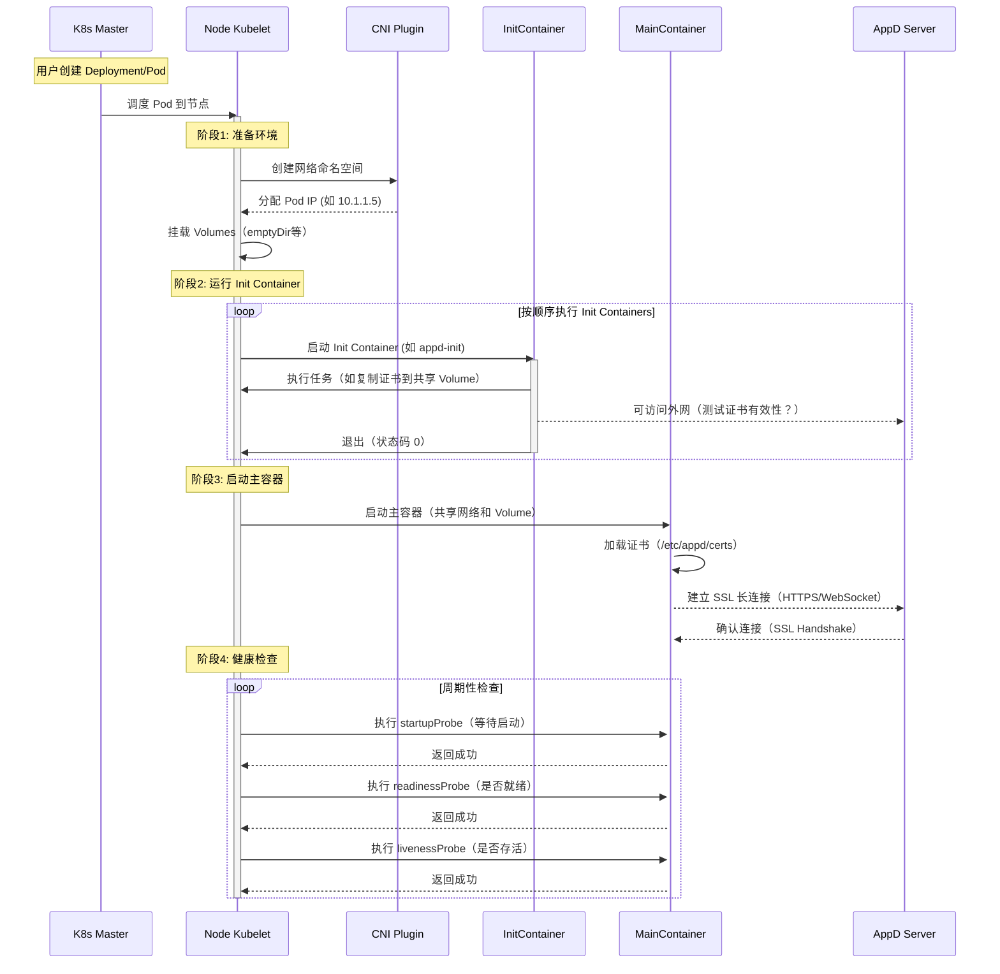
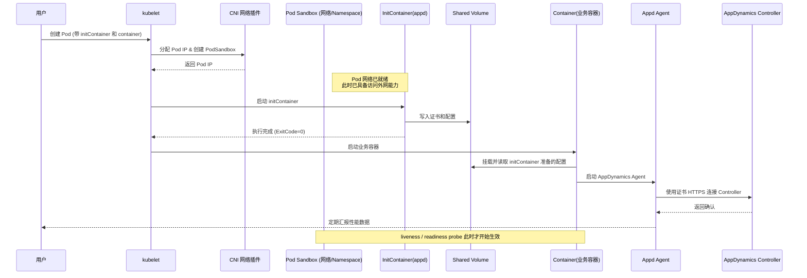
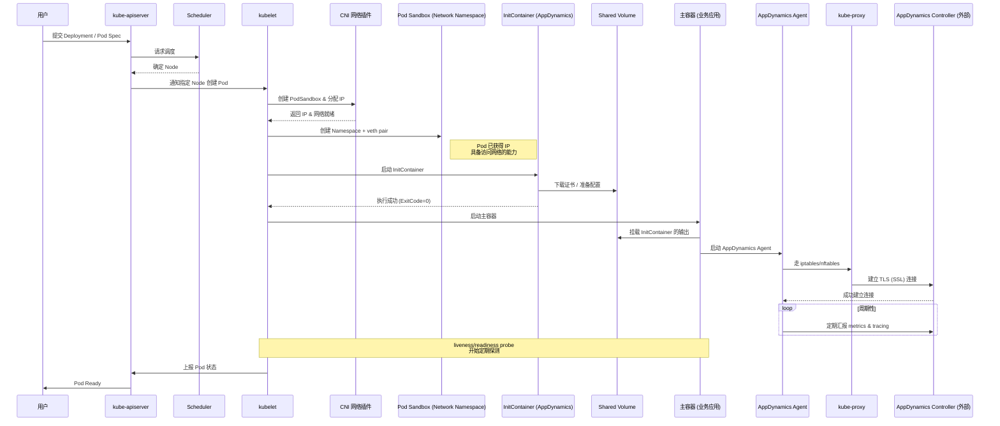
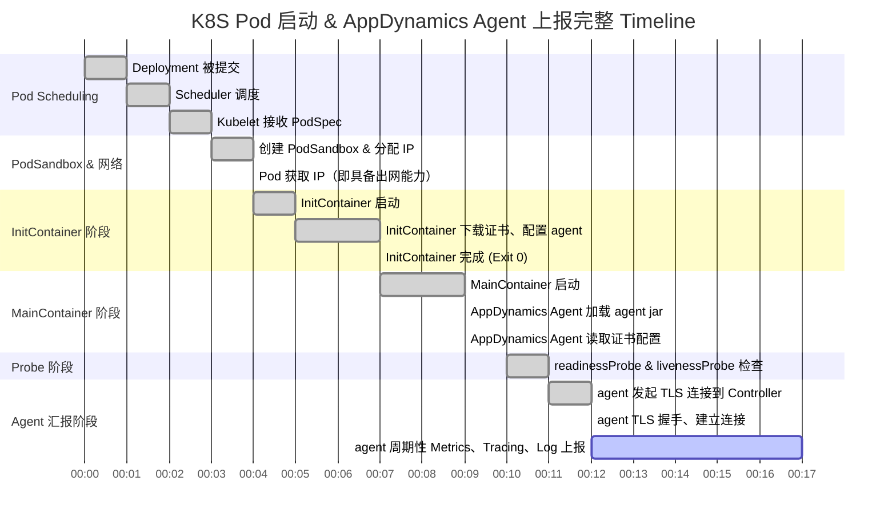

- [About Start Q](#about-start-q)
  - [Deepseek](#deepseek)
    - [关键节点解释](#关键节点解释)
    - [补充说明](#补充说明)
  - [chatgpt](#chatgpt)
- [appd deployment](#appd-deployment)
- [volumes with volumeMounts](#volumes-with-volumemounts)

# About Start Q 
我有这样一个问题 我的一个K8S deployment 比如我有 init container 这是一个appdynamic 然后有普通的Container 我现在比较关心的是这样一个问题 比如appd 会配置证书之类的信息 去连接汇报数据的服务端 然后他应该是仅仅在启动的时候加载 然后就没有或者说看不到了 那么等我正常的容器启动之后 我想了解他怎么汇报数据的？ 比如他汇报要走ssl 访问目的地 另外帮我介绍一下init container工作的一些原理 他是不是仅仅是挂载一些目录或者什么的？ 另外我想了解，比如我这个pod在启动的过程当中什么时候能拿到IP 只是说他在什么时候能够有访问外网的可能 比如说我配置了对应的 start liveness read liveness 等等这些我都配置 更简单一点来说，我就是想知道他在什么时候具备了联网的功能 我需要了解整个的启动过程 而且启动的过程之中是包含了init container

能不能把整个过程帮我可视化成一个mermaid sequeue diagram

## Deepseek
以下是一个用 Mermaid 绘制的 **Pod 启动过程时序图**，涵盖 **Init Container 执行、网络初始化、证书加载、健康检查**等关键步骤：



---

### 关键节点解释
1. **网络初始化**：
   - 在 `CNI Plugin` 分配 IP 后，**Init Container 和主容器共享同一网络栈**，因此所有容器启动时已具备网络能力。
   - 图中 `InitContainer-->>AppD Server` 表示 Init Container 可以主动访问外网（例如预下载证书）。

2. **证书加载**：
   - Init Container 将证书写入共享 Volume（如 `emptyDir`），主容器通过 Volume Mount 读取证书。
   - 主容器启动后，AppD Agent 使用证书与服务器建立 SSL 连接（可能需要双向认证）。

3. **健康检查顺序**：
   - `startupProbe` 优先执行（确保慢启动应用完成初始化）。
   - `readinessProbe` 成功后，Pod 才会被加入 Service 的 Endpoint。
   - `livenessProbe` 失败会触发容器重启。

---

### 补充说明
- **网络访问时机**：所有容器（包括 Init Container）在启动时即可访问外网（假设 CNI 插件已正确配置）。
- **证书持久化**：如果证书需要动态更新，可结合 `ConfigMap` 或外部 Secret 管理系统（如 Vault）。
- **故障排查**：若 SSL 连接失败，优先检查 Init Container 日志（`kubectl logs <pod> -c <init-container>`）和主容器的证书路径。


## chatgpt 
你的问题非常专业，描述的也是典型的 GKE/K8S Pod 启动、init container 工作机制、容器生命周期以及网络可用性的细节，下面我会按照你的要求做两件事：
	1.	解释关键机制（init container、appd汇报、Pod网络）
	2.	直接画出完整的 Mermaid 时序图 展示 Pod 启动和网络可用的完整流程

⸻

1. 关键点解释

(1) initContainer 工作原理
	•	initContainers 是在普通的 containers 之前顺序执行的容器，且必须全部成功退出（ExitCode=0）Pod 才能进入到主容器（containers）阶段。
	•	它们主要用于：
	•	做一些初始化任务，例如：配置、准备 Volume、写入证书、接入外部系统
	•	共享数据给主容器（通过 shared volume）
	•	initContainers 本身不会常驻运行，不会提供 service，不会在 Pod Ready 后再起作用
	•	常见作用：
	•	生成证书
	•	拿配置
	•	等待依赖服务就绪
	•	写入 AppDynamics 这类 APM 的 agent 配置

(2) AppDynamics 的数据汇报流程（你说的 SSL）
	•	AppDynamics 通常是以 agent 的形式存在
	•	它在 initContainer 阶段生成或准备好配置（含 SSL Cert 等）
	•	真正执行 data reporting 的是主容器（container）内的 app process 或 appd agent
	•	汇报流程：
	•	读取 initContainer 留下的配置和证书（Volume）
	•	在正常业务容器内的 agent 或 SDK 定时将 metrics 报告到 Controller（通常走 HTTPS）

(3) Pod 什么时候具备网络能力？
	•	Pod 的网络 是在 kubelet 创建完 Pod Sandbox（Pod 网络 namespace）时就已经分配
	•	简单来说：
	•	Pod 拿到 IP 在 initContainer 运行之前就已经有了
	•	从第一个 initContainer 开始，其实 Pod 已经可以访问外部网络（前提是网络策略、firewall、routing 没有限制）
	•	readiness、liveness 只是用于 kubelet 判断 container 是否 ready，不影响其基础的 network 能力
	•	只要 Pod 启动，initContainer 已开始，Pod 就具备了联网能力

⸻

2. Pod 启动流程 + 网络能力 + initContainer + appd 汇报的时序图



⸻

3. 小结

| 阶段 | 是否具备 IP | 是否能访问外网 | 是否运行 probe | 是否能上报 Appd |
|------|-------------|----------------|----------------|-----------------|
| 创建 PodSandbox | 是 | 是 | 否 | 否 |
| InitContainer 运行时 | 是 | 是 | 否 | 否 |
| 主容器启动 | 是 | 是 | liveness 开始 | Appd Agent 启动后上报 |
| readiness 成功 | 是 | 是 | readiness probe OK | 已正常上报 |


⸻

4. 补充说明
	•	Pod 在 initContainer 阶段就已经能访问外部网络
	•	initContainer 通常不负责直接上报，只是为后续容器准备好 agent 的运行环境
	•	真正上报流程是在主容器（业务容器）内的 agent 完成的
	•	liveness 和 readiness 与网络能力无关，只影响 kubelet 是否将 Pod 标记为 ready
	•	Appd agent 报告一般通过 HTTPS/TLS（SSL）协议

⸻

是否需要我顺便再帮你画成一个 更详细版本？比如把 kube-proxy、kube-apiserver、调度、probe 请求 等都加进去，做成完整的 production 版 Pod 生命周期时序图

好的，下面我帮你整理成 完整版 Production 级别 Pod 启动 & 网络 & AppDynamics 时序图，包含：
	1.	Pod 创建、调度、分配 IP
	2.	InitContainer 过程
	3.	MainContainer 启动
	4.	readiness/liveness probe
	5.	AppDynamics agent 上报流程
	6.	外部依赖（kube-apiserver、kube-proxy、CNI、Controller）

⸻

Production 版完整时序图



⸻

补充要点说明

Pod 生命周期核心事件

| 阶段 | 网络状态 | 是否可出网 | 与 AppDynamics |
|------|----------|------------|----------------|
| kubelet 分配 Pod IP | 网络就绪 | 能 | 与 AppD 无关 |
| InitContainer 运行 | 网络就绪 | 能 | 负责生成 agent 配置 |
| 容器启动 | 网络就绪 | 能 | agent 启动，读取配置 |
| agent 上报 | 网络就绪 | 能 | 完成 TLS 握手，定期上报 |


⸻

技术细节
	•	Pod IP 是在 initContainer 之前就已经具备，Pod 内所有 Container 共用同一个网络 namespace
	•	initContainer 可以访问外网（如果网络策略不阻挡）
	•	readiness 和 liveness 只影响 service 是否转发流量，跟网络能力无关
	•	kube-proxy 在 node 上负责维护 iptables/nftables 规则，Pod 内出网会经过 kube-proxy 或直接走 overlay network
	•	AppDynamics Agent 是在业务容器内运行，读取 initContainer 准备的配置，再通过 HTTPS（TLS）向 Controller 上报

⸻

进阶小提示

如果你想排查或验证 initContainer 阶段是否能出网，可以在 initContainer 中临时执行：

curl -Iv https://your-appd-controller:443

如果成功，说明 initContainer 已具备访问 controller 的能力。

⸻

是否需要我进一步帮你：
	1.	再做一版分解图 —— 分成两个 mermaid 图，分别表示：
	•	Pod 启动完整流程图
	•	AppDynamics Agent 生命周期图
	2.	补充最佳实践 —— 包括 Pod 网络、initContainer 场景、AppD Agent 配置最佳实践

好的，下面是完整的 K8S Pod 生命周期 + AppDynamics Agent 工作流程的 Timeline

⸻

Timeline - Pod 启动到 Agent 上报



⸻

解释

| 阶段 | 说明 | 网络能力 |
|------|------|----------|
| Pod Sandbox 创建完成 | 获取 IP，即具备完整出入网能力 | 已具备 |
| InitContainer 阶段 | 可以联网，如下载 agent 证书、初始化 agent 配置 | 已具备 |
| MainContainer 阶段 | 主业务容器启动，挂载 initContainer 的输出 | 已具备 |
| Agent 生命周期 | agent 加载配置，建立 TLS 连接 controller，开始汇报 | 已具备 |


⸻

重点
	•	网络能力：Pod Sandbox 完成创建（即分配 IP）后，Pod 中的所有 container（包括 initContainer）即可出入网络
	•	initContainer：常用于准备配置文件、证书、agent jar，甚至是动态下载
	•	TLS 上报：Agent 启动后即会建立 TLS 连接进行上报
	•	Probe：不会阻止 agent 汇报，只影响 readiness 状态

⸻

是否需要我再顺带帮你：
	1.	出一个 AppDynamics agent 在容器里探测 Controller 的典型 TCP/TLS 流程 （用 sequence 或者 flowchart）

这样你就能连上报的数据流、握手、重连、探测过程都一起可视化。


# appd deployment 
- Reference
  - https://docs.appdynamics.com/appd/20.x/en/application-monitoring/install-app-server-agents/java-agent/install-the-java-agent/install-the-java-agent-in-containers
- deployment 
```yaml
apiVersion: apps/v1
kind: Deployment
metadata:
  name: appd-deployment
  namespace: lex-ext-kdp
spec:
  replicas: 3
  selector:
    matchLabels:
      app: my-app
  template:
    metadata:
      labels:
        app: my-app
    spec:
      volumes:
        - name: appd-agent-repo
          emptyDir: {}
      initContainers:
        - name: init-container
          image: docker.io/appdynamics/java-agent:20.8.0
          command: ["sh", "-c", "cp -r /opt/appdynamics/. /opt/temp"]
          volumeMounts:
            - mountPath: /opt/temp
              name: appd-agent-repo
      containers:
        - name: demo-container
          image: nginx:latest
          volumeMounts:
            - mountPath: "/opt/appdynamics"
              name: appd-agent-repo
          resources:
            limits:
              cpu: "750m"
              memory: 200Mi
            requests:
              cpu: "500m"
              memory: 150Mi

```
- explain

逐行解释这个 Deployment 的配置，并重点解释 Init Container、Volumes 和 VolumeMounts 部分。

1. `apiVersion: apps/v1`:
   - 这定义了使用的 Kubernetes API 的版本。

2. `kind: Deployment`:
   - 这指定了要创建的 Kubernetes 资源类型，即 Deployment。Deployment 管理着 Pod 的副本数，并确保它们在集群中按照指定的方式运行。

3. `metadata`:
   - 这包含了资源的元数据，包括名称和命名空间。在这个例子中，Deployment 的名称是 "appd-deployment"，它所属的命名空间是 "lex-ext-kdp"。

4. `spec`:
   - 这是 Deployment 的规范部分，定义了 Deployment 的期望状态。

5. `replicas: 3`:
   - 这指定了要创建的 Pod 的副本数目。在这个例子中，Deployment 将确保有三个副本的 Pod 在集群中运行。

6. `selector`:
   - 这指定了用于选择要管理的 Pod 的标签选择器。在这个例子中，Deployment 将管理具有标签 `app: my-app` 的 Pod。

7. `template`:
   - 这定义了要创建的 Pod 的模板。

8. `metadata`:
   - 这里包含了 Pod 模板的元数据，包括标签。在这个例子中，Pod 的标签是 `app: my-app`。

9. `spec`:
   - 这是 Pod 的规范部分，定义了 Pod 的规格。

10. `volumes`:
    - 这定义了 Pod 中的卷。在这个例子中，它定义了一个名为 "appd-agent-repo" 的卷，并且指定它是一个空目录卷（`emptyDir: {}`）。这意味着在 Pod 的生命周期内，所有容器都可以在该卷中读写数据，但在 Pod 删除后，该卷中的数据将被删除。

11. `initContainers`:
    - 这定义了初始化容器。初始化容器是在主容器启动之前运行的一组容器，用于执行特定的任务。在这个例子中，有一个名为 "init-container" 的初始化容器。
    - `name: init-container`：给初始化容器指定了一个名称，以便在日志中识别和跟踪它。
    - `image: docker.io/appdynamics/java-agent:20.8.0`：指定了初始化容器所使用的镜像，该镜像用于运行 AppDynamics Java Agent。
    - `command: ["sh", "-c", "cp -r /opt/appdynamics/. /opt/temp"]`：定义了初始化容器要执行的命令。这个命令的作用是将 `/opt/appdynamics/` 目录下的所有内容复制到 `/opt/temp/` 目录中。
    - `volumeMounts`：指定了初始化容器要挂载的卷。在这个例子中，它将名为 "appd-agent-repo" 的卷挂载到容器的 `/opt/temp` 目录中，以便在初始化容器内部访问该卷中的文件或数据。

12. `containers`:
    - 这定义了主容器。主容器是真正运行应用程序的容器。在这个例子中，有一个名为 "demo-container" 的容器，它使用了 `nginx:latest` 镜像。
    - `volumeMounts`：指定了主容器要挂载的卷。在这个例子中，它将名为 "appd-agent-repo" 的卷挂载到容器的 `/opt/appdynamics` 目录中，以便在主容器内部访问该卷中的文件或数据。
    - `resources`：定义了容器的资源限制和请求。在这个例子中，容器被限制使用最多 750m 的 CPU 和 200Mi 的内存，并且至少请求 500m 的 CPU 和 150Mi 的内存。

综上所述，这个 Deployment 的配置是用于在 Kubernetes 集群中部署一个具有初始化容器和主容器的应用程序，并使用空目录卷来在它们之间共享数据。


这部分定义了 Deployment 中的初始化容器（initContainers）和卷（volumes）。

1. `volumes`:
   - 这里定义了 Pod 中的卷。在这个例子中，定义了一个名为 "appd-agent-repo" 的卷，并且指定它是一个空目录卷（emptyDir）。空目录卷会在 Pod 创建时创建，并且对于同一 Pod 中的所有容器都是可见的。这意味着在该 Pod 中的任何容器都可以读写该卷，并且卷中的数据在 Pod 生命周期内是持久的，但在 Pod 删除后将被删除。

2. `initContainers`:
   - 这里定义了 Pod 中的初始化容器。初始化容器是在主容器启动之前运行的一组容器，用于执行一些初始化任务，例如加载配置文件、下载文件等。在这个例子中，有一个名为 "init-container" 的初始化容器。
   - `name: init-container`：给初始化容器指定了一个名称，以便在日志中识别和跟踪它。
   - `image: docker.io/appdynamics/java-agent:20.8.0`：指定了初始化容器所使用的镜像，该镜像用于运行 AppDynamics Java Agent。
   - `command: ["sh", "-c", "cp -r /opt/appdynamics/. /opt/temp"]`：定义了初始化容器要执行的命令。这个命令的作用是将 `/opt/appdynamics/` 目录下的所有内容复制到 `/opt/temp/` 目录中。这样做的目的可能是为了在主容器启动之前准备一些必要的文件或配置。
   - `volumeMounts`：指定了初始化容器要挂载的卷。在这个例子中，它将名为 "appd-agent-repo" 的卷挂载到容器的 `/opt/temp` 目录中，以便在初始化容器内部访问该卷中的文件或数据。

综上所述，这部分的含义是定义了 Deployment 中的初始化容器和卷。初始化容器在 Pod 启动之前执行特定的任务，而卷提供了用于在容器之间共享数据的机制。


- Login my pod 
```bash
kubectl exec -it appd-deployment-67dc5c659d-b55sf -n lex-ext-kdp -- /bin/bash
Defaulted container "demo-container" out of: demo-container, init-container (init)
root@appd-deployment-67dc5c659d-b55sf:/# cd /opt/temp
bash: cd: /opt/temp: No such file or directory
root@appd-deployment-67dc5c659d-b55sf:/# ls /opt/appdynamics/
LICENSE  conf  javaagent.jar  javaagent.jar.asc  multi-release	readme.txt  readme.txt.asc  ver20.8.0.30686
```


# volumes with volumeMounts
在 Kubernetes 的 Deployment 中，`volumes` 和 `volumeMounts` 是用来处理存储和数据挂载的两个相关但不同的概念。

1. `volumes`:
   - `volumes` 定义了 Pod 中的存储卷。这些存储卷可以是持久存储卷，也可以是临时存储卷。它们提供了一种将数据存储到 Pod 中的机制，可以被 Pod 中的多个容器共享。
   - `volumes` 可以定义在 Deployment 的模板中，也可以在 Pod 模板中定义。通常，它们会在 Pod 模板中定义，以便被 Pod 中的所有容器共享。
   - 一个 Pod 可以有多个卷，每个卷可以被一个或多个容器挂载使用。

2. `volumeMounts`:
   - `volumeMounts` 定义了容器如何将卷挂载到其文件系统中。它指定了卷挂载的路径和卷的名称。
   - 每个容器可以有多个 `volumeMounts` 条目，以便挂载多个卷到容器中。
   - `volumeMounts` 的声明通常在容器的配置部分中，用于告诉 Kubernetes 将哪些卷挂载到容器中。

总的来说，`volumes` 定义了 Pod 中的存储卷，而 `volumeMounts` 定义了容器如何使用这些卷。`volumes` 是 Pod 级别的概念，而 `volumeMounts` 是容器级别的概念。通过这两个概念的结合使用，可以实现在 Kubernetes 中灵活管理存储和数据挂载的需求。
