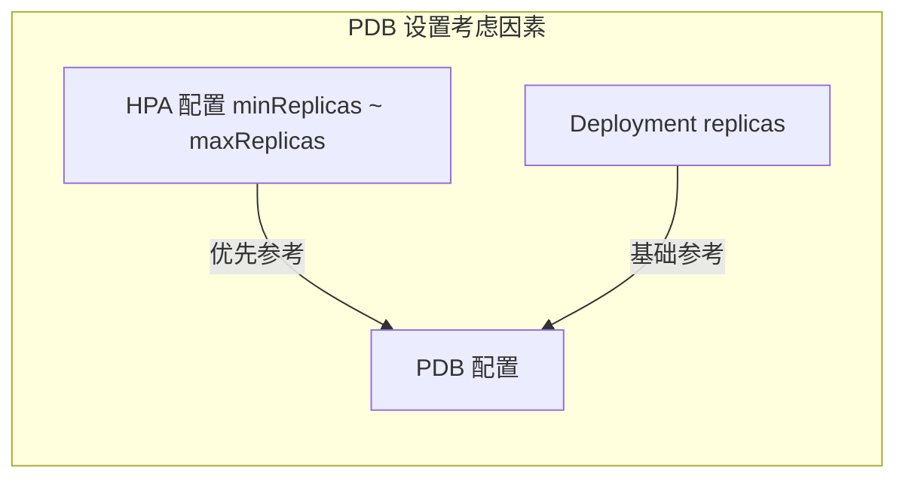

# nas deployment testing
- create ns
```
~/deploy # kubectl create ns lex                                                                                                                                              admin@NASLEX
namespace/lex created
```
----------------------
- deployment busybox
```yaml
apiVersion: apps/v1
kind: Deployment
metadata:
  name: busybox-deployment
  labels:
    app: busybox
spec:
  replicas: 2
  selector:
    matchLabels:
      app: busybox
  template:
    metadata:
      labels:
        app: busybox
    spec:
      containers:
      - name: busybox
        image: busybox:latest
        imagePullPolicy: Never    # 添加这行，强制使用本地镜像
        command:
        - sleep
        - "3600"
        resources:
          requests:
            memory: "64Mi"
            cpu: "100m"
          limits:
            memory: "128Mi"
            cpu: "200m"
```
---
add maxUnavailable for deployment
```yaml
apiVersion: apps/v1
kind: Deployment
metadata:
  name: busybox-deployment
  labels:
    app: busybox
spec:
  replicas: 2
  strategy:
    type: RollingUpdate
    rollingUpdate:
      maxSurge: 1        # 更新过程中最多可以比原先设置多出的 Pod 数量
      maxUnavailable: 1  # 更新过程中最多允许多少个 Pod 处于无法提供服务的状态
  selector:
    matchLabels:
      app: busybox
  template:
    metadata:
      labels:
        app: busybox
    spec:
      containers:
      - name: busybox
        image: busybox:latest
        imagePullPolicy: Never    # 添加这行，强制使用本地镜像
        command:
        - sleep
        - "3600"
        resources:
          requests:
            memory: "64Mi"
            cpu: "100m"
          limits:
            memory: "128Mi"
            cpu: "200m"
```
- re apply new deployment and add maxUnavailable
- `kubectl scale deployment busybox-deployment --replicas=4 -n lex`
```bash
~/deploy # kubectl scale deployment busybox-deployment --replicas=4 -n lexlex                                                                                                                     admin@NASLEX
deployment.apps/busybox-deployment configured
------------------------------------------------------------
~/deploy # kubectl get pod -n lex                                                                                                                                             admin@NASLEX
NAME                                  READY   STATUS    RESTARTS   AGE
busybox-deployment-65d495f89c-vfml9   1/1     Running   14         14h
busybox-deployment-65d495f89c-kkh85   1/1     Running   0          21s
```

如果直接apply -f 修改的那个deployment 也就是我增加了 maxUnavaliable 看来旧的pod 会没有删除

为 busybox deployment 创建一个对应的 PodDisruptionBudget (PDB) 配置：
- pdb.yaml
```yaml
apiVersion: policy/v1
kind: PodDisruptionBudget
metadata:
  name: busybox-pdb
  namespace: lex
spec:
  minAvailable: 1    # 确保至少有1个 Pod 保持可用
  selector:
    matchLabels:
      app: busybox   # 与 Deployment 中的 labels 保持一致
```

使用以下命令应用 PDB：
```bash
kubectl apply -f pdb.yaml -n lex
```

说明：
1. `minAvailable: 1` 表示在节点维护时至少保持 1 个 Pod 可用
2. selector 使用与 Deployment 相同的标签 `app: busybox`
3. 由于你的 Deployment 设置了 `replicas: 2`，所以 PDB 设置 `minAvailable: 1` 是比较合理的
4. 这个配置会在节点维护（如升级、排空等）时生效，确保服务不会完全中断

你可以通过以下命令查看 PDB 状态：
```bash
kubectl get pdb -n lex
kubectl describe pdb busybox-pdb -n lex
```


# about PDB minAvailable setting 
 PDB 的值设置确实需要考虑多个因素，我来详细解释下：

1. **与 HPA 配合的设置策略**：


2. **建议设置方式**：
   - 如果有 HPA：参考 `minReplicas` 来设置
   - `minAvailable` 建议设置为 `HPA.minReplicas * 0.5`（向上取整）
   - 或使用百分比：`minAvailable: 50%`

3. **具体场景建议**：
   ```yaml
   # 场景1：有 HPA
   spec:
     minReplicas: 4    # HPA 最小副本数
     maxReplicas: 10   # HPA 最大副本数
   
   # 对应的 PDB 配置
   spec:
     minAvailable: 2    # 或者使用 minAvailable: 50%
   
   spec:
     minReplicas: 2    # HPA 最小副本数 My case 
     maxReplicas: 4   # HPA 最大副本数
   
   #对应的 PDB 配置
   spec:
     minAvailable: 1    # 或者使用 minAvailable: 50%

   
   # 场景2：固定副本数
   spec:
     replicas: 2       # Deployment 固定副本数
   
   # 对应的 PDB 配置
   spec:
     minAvailable: 1    # 或者使用 minAvailable: 50%
   ```

4. **注意事项**：
   - PDB 的值不要设置太高，否则可能阻碍节点维护
   - 如果使用百分比，确保计算结果至少为 1
   - 考虑服务的关键程度来调整比例

所以在你的场景中，建议：
1. 如果有 HPA，优先参考 HPA 的 `minReplicas` 值
2. 如果只是固定 `replicas: 2`，那么 `minAvailable: 1` 是合适的
3. 也可以使用百分比：`minAvailable: 50%`


```bash
~/deploy # kubectl get pdb -n lex                                                                                                                                             admin@NASLEX
NAME          MIN AVAILABLE   MAX UNAVAILABLE   ALLOWED DISRUPTIONS   AGE
busybox-pdb   2               N/A               0                     6m20s
------------------------------------------------------------
~/deploy # kubectl describe pdb busybox-pdb -n lex                                                                                                                            admin@NASLEX
Name:           busybox-pdb
Namespace:      lex
Min available:  2
Selector:       app=busybox
Status:
    Allowed disruptions:  0
    Current:              2
    Desired:              2
    Total:                2
Events:                   <none>
------------------------------------------------------------

~/deploy # kubectl get deployment -n lex                                                                                                                                      admin@NASLEX
NAME                 READY   UP-TO-DATE   AVAILABLE   AGE
busybox-deployment   2/2     2            2           15h
------------------------------------------------------------
```
- adjust replicas to 4
`kubectl scale deployment busybox-deployment --replicas=4 -n lex`

```bash                                                                                                    admin@NASLEX
deployment.apps/busybox-deployment scaled
------------------------------------------------------------
~/deploy # kubectl get deployment -n lex                                                                                                                                      admin@NASLEX
NAME                 READY   UP-TO-DATE   AVAILABLE   AGE
busybox-deployment   4/4     4            4           15h
------------------------------------------------------------
~/deploy # kubectl scale deployment busybox-deployment --replicas=4 -n lex                                                                                                    admin@NASLEX
deployment.apps/busybox-deployment scaled
------------------------------------------------------------
~/deploy # kubectl get deployment -n lex                                                                                                                                      admin@NASLEX
NAME                 READY   UP-TO-DATE   AVAILABLE   AGE
busybox-deployment   4/4     4            4           15h
------------------------------------------------------------
~/deploy # kubectl get pod -n lex                                                                                                                                             admin@NASLEX
NAME                                  READY   STATUS    RESTARTS   AGE
busybox-deployment-65d495f89c-kkh85   1/1     Running   0          19m
busybox-deployment-65d495f89c-tbbxm   1/1     Running   0          12m
busybox-deployment-65d495f89c-7psnx   1/1     Running   0          32s
busybox-deployment-65d495f89c-9vlx9   1/1     Running   0          32s
------------------------------------------------------------
~/deploy # kubectl delete pod busybox-deployment-65d495f89c-9vlx9 -n lex                                                                                                      admin@NASLEX
pod "busybox-deployment-65d495f89c-9vlx9" deleted
------------------------------------------------------------
~/deploy # kubectl get pod -n lex                                                                                                                                             admin@NASLEX
NAME                                  READY   STATUS    RESTARTS   AGE
busybox-deployment-65d495f89c-kkh85   1/1     Running   0          20m
busybox-deployment-65d495f89c-tbbxm   1/1     Running   0          13m
busybox-deployment-65d495f89c-7psnx   1/1     Running   0          95s
busybox-deployment-65d495f89c-l9z66   1/1     Running   0          43s

```
- describe
```bash
~/deploy # kubectl describe pdb busybox-pdb -n lex                                                                                                                            admin@NASLEX
Name:           busybox-pdb
Namespace:      lex
Min available:  2
Selector:       app=busybox
Status:
    Allowed disruptions:  2
    Current:              4
    Desired:              2
    Total:                4
Events:                   <none>
```
- explain the above result

让我解释一下这个 PDB 状态的各个字段含义：

```plaintext
Min available:  2          # PDB 要求至少保持 2 个 Pod 可用
Status:
    Allowed disruptions:  2    # 当前允许中断（可以安全删除）的 Pod 数量 = 当前运行中 Pod 总数 - PDB 期望保持可用的最小 Pod 数量
    Current:              4    # 当前匹配 selector 的运行中 Pod 总数
    Desired:              2    # PDB 期望保持可用的最小 Pod 数量
    Total:                4    # 当前由 PDB 管理的 Pod 总数
```

具体分析：
1. 由于设置了 `minAvailable: 2`，系统必须确保至少有 2 个 Pod 保持运行
2. 当前有 4 个 Pod 在运行（`Current: 4`）
3. 因此可以允许中断 2 个 Pod（`Allowed disruptions: 2`）
   - 计算方式：4(当前) - 2(最小要求) = 2(可中断)
4. 即使删除这 2 个 Pod，仍然能满足 PDB 的最小可用性要求

这说明：
- 当前的部署状态很健康，有足够的冗余
- 可以安全地进行节点维护，最多可以同时驱逐 2 个 Pod
- 系统会自动确保至少保留 2 个 Pod 运行，以满足 PDB 的要求

现在我修改PDB文件，将minAvailable设置为1，然后重新部署。
```yaml
apiVersion: policy/v1
kind: PodDisruptionBudget
metadata:
  name: busybox-pdb
  namespace: lex
spec:
  minAvailable: 1    # 确保至少有1个 Pod 保持可用
  selector:
    matchLabels:
      app: busybox   # 与 Deployment 中的 labels 保持一致
------------------------------------------------------------
```
然后观察结果
```bash
~/deploy # kubectl describe pdb -n lex                                        admin@NASLEX
Name:           busybox-pdb
Namespace:      lex
Min available:  1
Selector:       app=busybox
Status:
    Allowed disruptions:  3 # 当前允许中断的数量=当前运行中Pod总数-PDB期望保持可用的最小Pod数量
    Current:              4
    Desired:              1
    Total:                4
Events:                   <none>
------------------------------------------------------------
```
- when I delete one pod, the status 
```bash
- ~/deploy # kubectl get pod -n lex                                             admin@NASLEX
NAME                                  READY   STATUS        RESTARTS   AGE
busybox-deployment-65d495f89c-g7xwg   1/1     Running       0          12m
busybox-deployment-65d495f89c-7psnx   1/1     Running       9          9h
busybox-deployment-65d495f89c-l9z66   1/1     Running       9          9h
busybox-deployment-65d495f89c-kkh85   1/1     Terminating   9          9h
busybox-deployment-65d495f89c-jcjkx   1/1     Running       0          7s
------------------------------------------------------------
```


