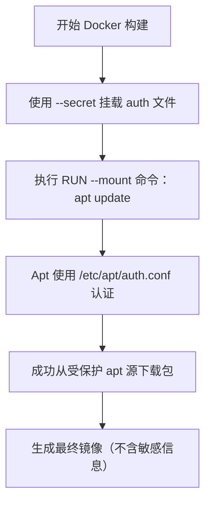
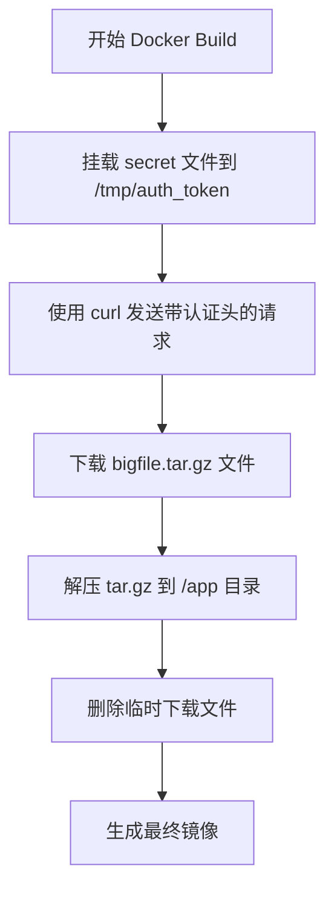

使用 Docker BuildKit 的 secret 机制，主要目的是在构建阶段安全地传递敏感信息（例如认证文件、API 密钥等），而不会把这些敏感数据写入到最终生成的镜像中。下面详细说明这一机制解决的问题以及其作用：

1. Secret 的主要解决问题
	•	安全传递敏感数据
在构建镜像过程中，有些命令（如 apt update）可能需要访问受保护的资源，比如私有仓库或者受密码保护的 apt 源。如果直接在 Dockerfile 中硬编码这些认证信息，会有安全风险，并且最终镜像中也会留下这些敏感数据。使用 secret 挂载，可以在构建时把敏感文件（例如认证配置文件）临时挂载到容器内，使用完毕后不再保留。
	•	避免将敏感数据写入镜像层
使用 secret 挂载的方式，仅在命令执行时可见，不会被写入到镜像层中，从而确保最终生成的镜像中不包含认证信息。
	•	符合构建流程中的临时认证需求
比如在运行 apt update 时，如果需要认证信息来访问私有 apt 仓库，secret 就可以将认证文件挂载到 /etc/apt/auth.conf，使得 apt 能够在更新过程中使用该文件进行身份验证。

2. 关于 apt 更新与 From 定义的源
	•	APT 源的下载问题
在你的 Dockerfile 中，通过如下命令挂载 secret 文件到 /etc/apt/auth.conf 后：

RUN --mount=type=secret,id=auth,target=/etc/apt/auth.conf apt update

此时，如果你的 apt 源（通常配置在 /etc/apt/sources.list 或 /etc/apt/sources.list.d/ 中）需要认证，apt 就会使用 /etc/apt/auth.conf 中的信息进行认证，从而可以下载私有或受保护的包。
注意：这和 FROM 定义的基础镜像无直接关系，FROM 只是指定了构建的起始镜像。APT 下载包时依赖于镜像内的 apt 配置及你提供的 secret 文件。

	•	是否意味着能直接下载包？
如果你正确配置了 secret，并且 apt 源已经配置好（例如在基础镜像或者构建过程中配置了正确的源地址），那么是可以直接通过认证后下载对应的包的。secret 只是提供认证信息，而不改变 apt 的源配置；所以前提是你的 apt 源已经正确设置，且需要认证信息。

3. 示例说明

Dockerfile 示例

# 基础镜像
FROM nexus/your-base-image:latest

# 使用 secret 挂载认证文件，进行 apt update 操作
RUN --mount=type=secret,id=auth,target=/etc/apt/auth.conf \
    apt update && apt install -y some-package

# 后续构建步骤...

Docker Build 命令

构建时需要通过 --secret 参数提供本地的 auth.conf 文件：

docker build --secret id=auth,src=auth.conf -t your-image:latest .

流程图示意

总结
	•	Secret 的作用：确保在构建过程中能安全地传递认证信息，避免敏感数据写入镜像层，从而提升安全性。
	•	APT 更新：通过挂载 secret 到指定位置（如 /etc/apt/auth.conf），可以让 apt 命令使用该认证信息访问受保护的 apt 源下载包。但这依赖于你已经正确配置了 apt 的源地址，与 FROM 定义的基础镜像本身无直接关系。

这样配置后，你的构建过程中可以安全地通过认证获取需要的包，同时最终生成的镜像中不会包含任何敏感认证信息。

你可以通过 BuildKit 的 secret 挂载方式，将认证信息传入到 RUN 命令中，再利用 curl 进行带认证的请求下载 tar.gz 大文件，下载完成后再进行解压。这样可以避免把认证信息写入镜像。下面给出一个示例：

示例 Dockerfile
```Dockerfile
FROM ubuntu:20.04

# 安装 curl 和 tar
RUN apt-get update && apt-get install -y curl tar

# 使用 secret 挂载认证文件到 /tmp/auth_token，
# 假设认证 token 文件中存放的是认证 token 信息
RUN --mount=type=secret,id=auth,target=/tmp/auth_token \
    curl -H "Authorization: Bearer $(cat /tmp/auth_token)" -o /tmp/bigfile.tar.gz https://example.com/bigfile.tar.gz && \
    tar -xzvf /tmp/bigfile.tar.gz -C /app && \
    rm -f /tmp/bigfile.tar.gz
```
构建命令

确保你的 Docker BuildKit 已启用，然后在构建时传入 secret 文件，例如：

`DOCKER_BUILDKIT=1 docker build --secret id=auth,src=auth_token.txt -t your-image:latest .`

其中：
	•	auth_token.txt 是你本地存放认证 token 的文件。
	•	在 Dockerfile 中，secret 挂载到 /tmp/auth_token，并通过 cat /tmp/auth_token 获取 token 用于 curl 的认证头。

流程图说明

注意事项
	•	BuildKit 开启：确保 Docker BuildKit 已启用（例如通过设置 DOCKER_BUILDKIT=1）。
	•	认证文件内容：认证信息需要符合目标服务的要求，上例假设是 Bearer token。
	•	安全性：使用 secret 挂载方式后，认证信息不会写入到镜像层中，提升构建过程的安全性。

这样配置后，你就可以利用 BuildKit 的 secret 机制，通过 curl 下载受保护的大文件，并在构建过程中解压使用，而不将敏感数据暴露在最终镜像中。
