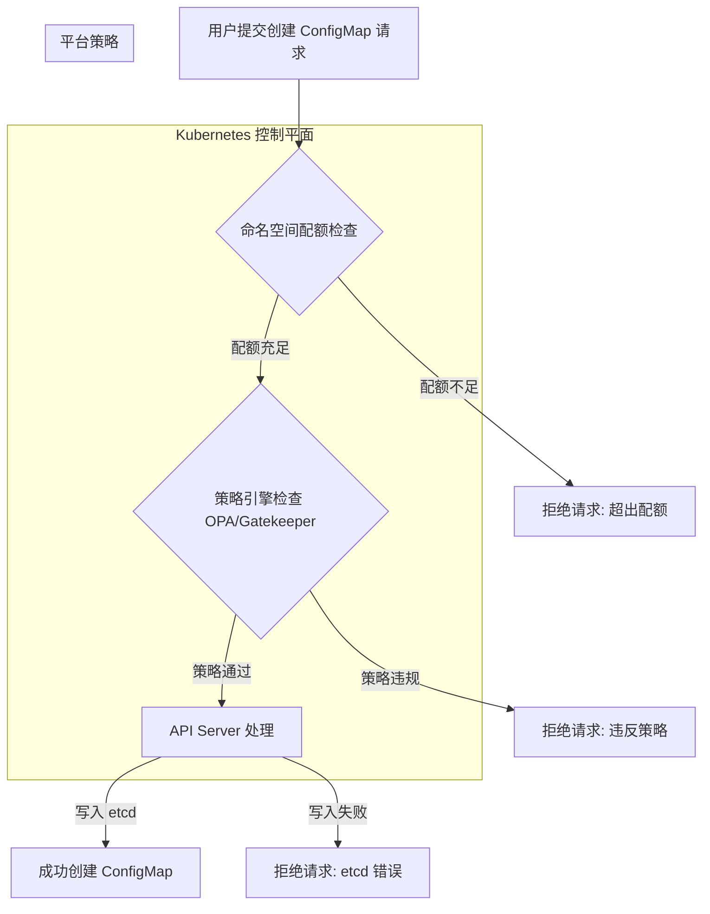

# GKE 平台开放用户自定义 ConfigMap 的风险评估

作为平台服务提供商，向用户开放创建和管理 `ConfigMap` 的权限是一项常见的需求，但这背后也隐藏着多重风险。如果不加以控制，可能会对整个 GKE 集群的稳定性、安全性和可管理性造成严重影响。

本文档旨在详细评估相关风险，并提供平台级的管控策略。

## 1. 核心风险分析

### 1.1. 资源滥用与拒绝服务 (Resource Abuse & DoS)

`ConfigMap` 作为 Kubernetes API 对象，其数据存储在集群的 `etcd` 数据库中。`etcd` 是整个集群的“大脑”，其性能和稳定性至关重要。

- **`etcd` 存储耗尽**：
  - **风险点**：每个 `ConfigMap` 对象本身有 1 MiB 的大小限制，但 Kubernetes 对一个命名空间中 `ConfigMap` 的*数量*默认没有限制。如果用户无节制地创建大量 `ConfigMap`，或者创建大量接近 1 MiB 的大型 `ConfigMap`，会迅速消耗 `etcd` 的存储空间（GKE 默认的 `etcd` 大小通常为几 GB）。
  - **后果**：一旦 `etcd` 存储被写满，整个 Kubernetes 控制平面将变为只读或完全不可用。所有写操作（如创建/更新 Pod、Deployment、Service 等）都会失败，导致整个集群瘫痪，对所有租户造成服务中断。

- **API Server 性能下降**：
  - **风险点**：大量的 `ConfigMap` 对象会加重 `kube-apiserver` 的负担。任何需要列出（LIST）或监视（WATCH）`ConfigMap` 的控制器（包括用户自己的应用）都会消耗更多内存和 CPU。
  - **后果**：API 响应变慢，集群变更延迟，影响所有依赖 API Server 的组件，如 HPA、Scheduler 等。

### 1.2. 安全风险 (Security Risks)

- **敏感信息泄露**：
  - **风险点**：用户可能会错误地将敏感数据（如数据库密码、API 密钥、TLS 证书私钥）存储在 `ConfigMap` 中，而不是专门用于此目的的 `Secret`。`ConfigMap` 中的数据是 Base64 编码，可以轻易解码，并非加密。
  - **后果**：任何有权限读取该命名空间中 `ConfigMap` 的用户、服务账号或被攻破的 Pod 都可以轻易获取这些敏感信息，造成数据泄露或权限提升。

- **配置注入与权限提升**：
  - **风险点**：如果一个 `ConfigMap` 被挂载为关键系统组件（如 CoreDNS、Ingress Controller、监控 Agent）的配置文件，拥有该 `ConfigMap` 写权限的用户可能通过修改配置来执行恶意操作。
  - **后果**：例如，修改 CoreDNS 配置将流量重定向到恶意端点，或者修改监控 Agent 配置使其停止上报数据，甚至执行任意代码。

### 1.3. 运维与管理风险 (Operational & Management Risks)

- **“野蛮生长”与管理混乱**：
  - **风险点**：缺乏统一的命名规范、标签和所有权管理，会导致集群中出现大量无人维护的“孤儿”`ConfigMap`。
  - **后果**：难以追踪 `ConfigMap` 的用途和负责人，给故障排查、资源清理和成本分摊带来巨大困难。

- **影响应用稳定性**：
  - **风险点**：应用通常依赖 `ConfigMap` 来获取配置。用户不慎删除或错误修改一个正在被关键应用使用的 `ConfigMap`，会导致应用启动失败或运行时异常。
  - **后果**：服务中断，且由于问题出在配置上，排查起来可能比代码 Bug 更耗时。

## 2. GKE/Kubernetes 的配额与缓解策略

为了应对上述风险，平台必须建立一套完善的管控机制。Kubernetes 提供了原生的 `ResourceQuota` 对象，这是限制命名空间资源使用的核心工具。

### 2.1. 使用 `ResourceQuota` 限制数量

您可以为每个用户（或每个命名空间）设置 `ResourceQuota`，以限制他们可以创建的 `ConfigMap` 数量。

#### 代码示例：`configmap-quota.yaml`

```yaml
apiVersion: v1
kind: ResourceQuota
metadata:
  name: configmap-and-object-quota
  namespace: <target-namespace> # 应用到指定的用户命名空间
spec:
  hard:
    # 1. 限制 ConfigMap 的数量
    configmaps: "50"

    # 2. 同时建议限制其他相关对象的数量
    secrets: "50"
    persistentvolumeclaims: "10"
    services: "20"
    pods: "100"
```

**部署命令**：
```bash
# 在为用户创建命名空间后，立即应用此配额
kubectl apply -f configmap-quota.yaml -n <target-namespace>
```

**注意事项**：
- **配额值设定**：`configmaps: "50"` 是一个示例值。平台应根据用户等级、应用场景和集群总容量来设定合理的配额。
- **全面限制**：仅限制 `ConfigMap` 是不够的，应结合对 `Pod`、`Secret`、`Service` 等对象的全面数量限制，防止任何单一类型的资源被滥用。

### 2.2. 结合策略引擎 (Policy Engine)

为了实现更精细化的控制，建议使用 OPA/Gatekeeper 或 Kyverno 等策略引擎。

- **强制添加标签**：要求所有 `ConfigMap` 必须包含 `owner` 或 `app` 等标签，便于追踪和管理。
- **禁止存储敏感信息**：创建策略规则，扫描 `ConfigMap` 的 `data` 字段，如果匹配到 `password`、`private_key` 等正则表达式，则拒绝创建。
- **限制 `ConfigMap` 大小**：虽然 K8s 有 1 MiB 的硬限制，但平台可以设置更低的软限制，例如 256 KiB，以进一步保护 `etcd`。

### 2.3. 监控与告警

- **监控 `etcd` 健康状况**：使用 Prometheus 或 Google Cloud Monitoring 监控 `etcd` 的存储使用率、QPS 和延迟。
- **设置告警**：当 `etcd` 存储超过阈值（如 75%）或某个命名空间中的 `ConfigMap` 数量激增时，立即触发告警。

## 3. 平台准入控制流程建议

以下是建议的平台处理用户创建 `ConfigMap` 请求的流程图。



## 4. 总结与建议

| 风险维度 | 风险描述 | 缓解措施 |
| :--- | :--- | :--- |
| **资源滥用** | `etcd` 存储耗尽，API Server 性能下降 | **`ResourceQuota` (核心)**, 监控告警, 策略引擎限制大小 |
| **安全风险** | 敏感信息泄露，配置注入 | **RBAC 最小权限原则**, **强制使用 `Secret`**, 策略引擎扫描内容 |
| **运维管理** | 管理混乱，影响应用稳定性 | **强制添加标签**, **GitOps 流程**, 用户教育和文档 |

**核心建议**：

1.  **默认拒绝，按需授权**：不要默认给所有用户开放 `ConfigMap` 权限。
2.  **强制使用 `ResourceQuota`**：这是最基本也是最有效的平台保护措施。
3.  **实施策略引擎**：通过 OPA/Gatekeeper 等工具实现更精细的自动化治理。
4.  **加强用户教育**：提供清晰的文档，告知用户 `ConfigMap` 和 `Secret` 的区别和最佳实践。
