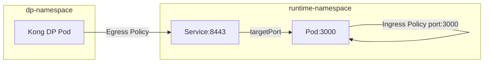
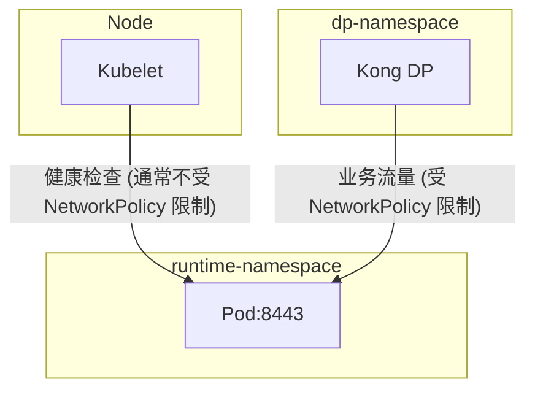
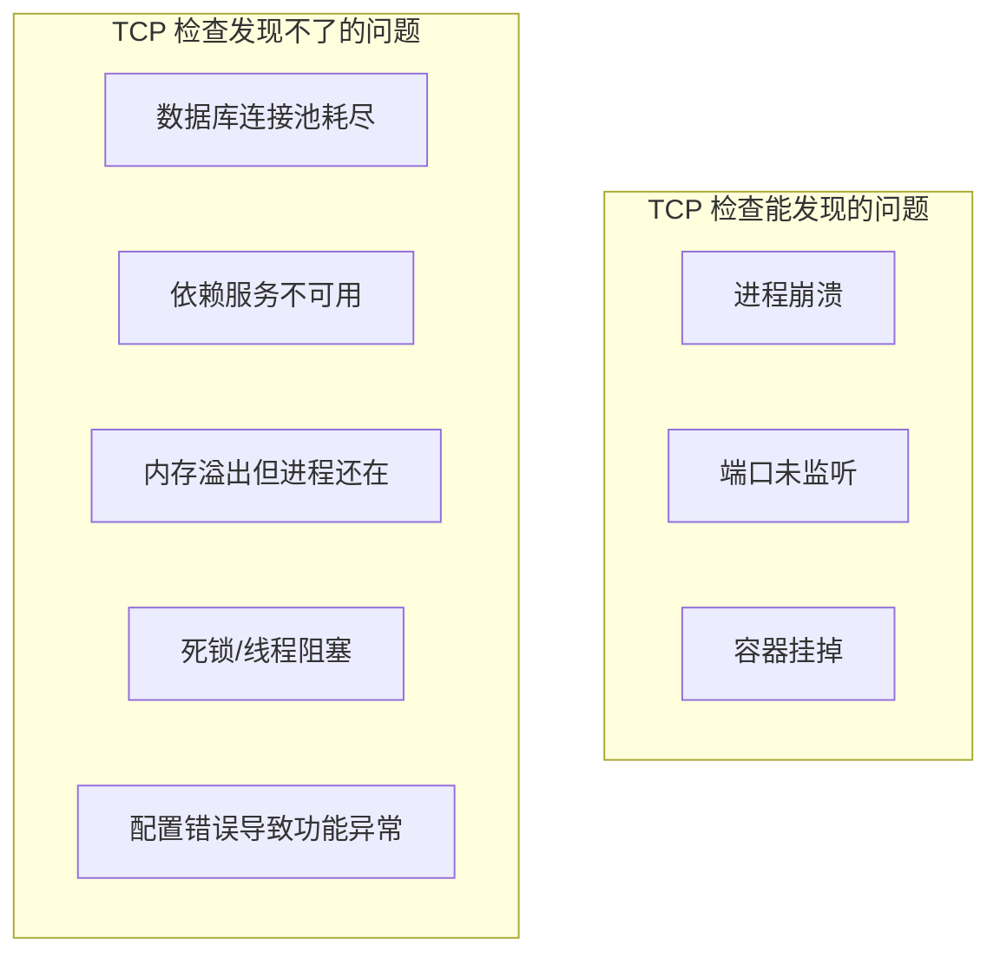
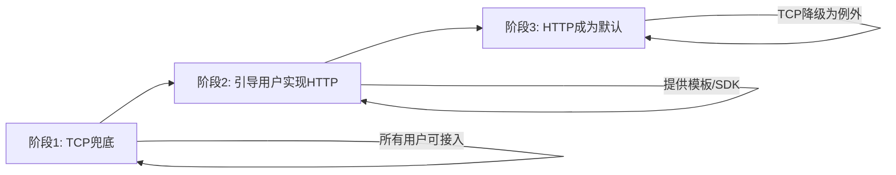

# 跨 Namespace 网络策略配置分析
# TCP 健康检查的局限性分析

## 问题分析

在默认 **deny all** 的网络策略下，Kong DP 跨 namespace 访问 upstream 服务需要显式配置 NetworkPolicy 允许流量通过。

关键路径：

```
Kong DP (dp-namespace) → Service:8443 (runtime-namespace) → Pod:3000
```

## 需要配置的 NetworkPolicy

需要在 **两个 namespace** 分别配置策略：

### 1. Runtime-namespace：允许入站流量

```yaml
apiVersion: networking.k8s.io/v1
kind: NetworkPolicy
metadata:
  name: allow-kong-dp-ingress
  namespace: runtime-namespace
spec:
  podSelector:
    matchLabels:
      app: your-upstream-app  # 替换为实际的 pod label
  policyTypes:
    - Ingress
  ingress:
    - from:
        - namespaceSelector:
            matchLabels:
              kubernetes.io/metadata.name: dp-namespace
          # 可选：更精确地限制来源 pod
          podSelector:
            matchLabels:
              app: kong-dp
      ports:
        - protocol: TCP
          port: 3000  # Pod 实际监听端口（targetPort）
```

### 2. DP-namespace：允许出站流量（如有 Egress 限制）

```yaml
apiVersion: networking.k8s.io/v1
kind: NetworkPolicy
metadata:
  name: allow-kong-dp-egress
  namespace: dp-namespace
spec:
  podSelector:
    matchLabels:
      app: kong-dp  # 替换为 Kong DP pod label
  policyTypes:
    - Egress
  egress:
    - to:
        - namespaceSelector:
            matchLabels:
              kubernetes.io/metadata.name: runtime-namespace
      ports:
        - protocol: TCP
          port: 3000  # 目标 Pod 端口
    # 通常还需要允许 DNS 解析
    - to:
        - namespaceSelector: {}
          podSelector:
            matchLabels:
              k8s-app: kube-dns
      ports:
        - protocol: UDP
          port: 53
```

## 流量路径说明



## 重要说明

|配置项               |端口值     |说明                      |
|------------------|--------|------------------------|
|Service port      |8443    |Kong 配置的 upstream 端口    |
|NetworkPolicy port|**3000**|必须是 Pod 实际监听的 targetPort|

**核心要点**：NetworkPolicy 作用于 **Pod 级别**，所以规则中的端口必须是 `targetPort: 3000`，而不是 Service 暴露的 `8443`。

## 验证步骤

```bash
# 1. 确认 namespace label 存在
kubectl get ns dp-namespace --show-labels
kubectl get ns runtime-namespace --show-labels

# 2. 如果缺少 label，手动添加（新版 K8s 通常自动添加）
kubectl label ns dp-namespace kubernetes.io/metadata.name=dp-namespace

# 3. 测试连通性
kubectl exec -n dp-namespace -it <kong-dp-pod> -- curl -k https://<service-name>.runtime-namespace.svc:8443/health

# 4. 检查 NetworkPolicy 是否生效
kubectl get networkpolicy -n runtime-namespace
kubectl describe networkpolicy allow-kong-dp-ingress -n runtime-namespace
```

## 注意事项

1. **端口匹配**：NetworkPolicy 只认 Pod 端口，与 Service port 无关
2. **Namespace Label**：确保使用的 label selector 与实际 namespace label 一致
3. **DNS 访问**：Egress 策略别忘了放行 DNS（UDP 53），否则服务发现会失败
4. **双向配置**：如果两边都有 deny all，需要同时配置 Ingress 和 Egress​​​​​​​​​​​​​​​​


# 为什么 NetworkPolicy 不需要配置 8443 端口

## 核心原因

**NetworkPolicy 工作在 Pod 层面，而非 Service 层面。**

Service 的端口映射（8443 → 3000）发生在 kube-proxy/iptables 层，流量到达 Pod 时已经被 DNAT 转换为 targetPort。

## 流量实际路径


详细过程：

|阶段                  |目标地址                              |目标端口    |说明                |
|--------------------|----------------------------------|--------|------------------|
|1. Kong 发起请求        |service-name.runtime-namespace.svc|8443    |Service DNS       |
|2. DNS 解析           |ClusterIP                         |8443    |获取 Service IP     |
|3. **iptables DNAT**|Pod IP                            |**3000**|端口转换发生在这里         |
|4. 到达 Pod           |Pod IP                            |3000    |NetworkPolicy 在此生效|

## 验证示例

```bash
# 查看 Service 定义
kubectl get svc -n runtime-namespace your-service -o yaml
```

```yaml
spec:
  ports:
    - port: 8443        # Service 暴露端口（客户端访问）
      targetPort: 3000  # Pod 实际端口（流量最终目的地）
```

```bash
# 查看 iptables 规则（在 Node 上）
iptables -t nat -L KUBE-SERVICES -n | grep your-service
```

你会看到类似：

```
DNAT  tcp  --  0.0.0.0/0  <ClusterIP>  tcp dpt:8443 to:<PodIP>:3000
```

## 简单类比

可以把它想象成端口转发：

```
外部访问 → 路由器:8443 → 内网主机:3000
              ↑                ↑
         Service port     targetPort (NetworkPolicy 管这里)
```

NetworkPolicy 就像是内网主机上的防火墙，它只看到最终到达的端口 3000，不关心外部是通过哪个端口转发进来的。

## 结论

|组件               |关心的端口                    |
|-----------------|-------------------------|
|Kong upstream 配置 |8443（Service port）       |
|Service 定义       |8443 → 3000 映射           |
|**NetworkPolicy**|**只需配置 3000（targetPort）**|

所以你的 NetworkPolicy **只需要放行 3000 端口**，8443 的转换由 Kubernetes 网络层自动处理。


那么从一个API平台的角度来说
因为我们有不同的用户
❌ 不同用户的 /health 路径不统一
→ 有些用户没有 /health
→ 有些用户要 /readyz
→ 有些用户要 /live
→ 有些用户根本没有 HTTP 健康接
所以我制定了下面的健康检查策略

readinessProbe:
  tcpSocket:
    port: {{ port | default 8443 }}
  periodSeconds: 10
  failureThreshold: 3
  timeoutSeconds: 3

livenessProbe:
  tcpSocket:
    port: {{ port | default 8443 }}
  periodSeconds: 20
  failureThreshold: 3
  timeoutSeconds: 3

startupProbe:
  tcpSocket:
    port: {{ port | default 8443 }}
  periodSeconds: 10
  failureThreshold: 30

通过你上面的一个阐述，看起来我的用户的侦听的这个端口最好是要统一 比如我上面给的例子就是8443 如果是这样的话，我仅需要开通dp-namespace 到runtime-namespace 的 8443 这样我只添加一次网络规则就可以了 允许用户随意端口，那么可能就会需要增加一些负担，比如说要去创建对应的网络规则


# API 平台健康检查与网络策略设计分析

## 问题分析

你提出了一个关键的平台治理问题：**端口标准化 vs 灵活性** 的权衡。

这里有两个不同场景需要区分：

|场景              |执行者            |网络路径                            |
|----------------|---------------|--------------------------------|
|**Kubelet 健康检查**|Node 上的 kubelet|Node → Pod（同 Node 或跨 Node）      |
|**Kong 流量转发**   |Kong DP Pod    |dp-namespace → runtime-namespace|

## 重要澄清：健康检查的网络策略



**Kubelet 健康检查通常不受 NetworkPolicy 影响**，因为：

1. Kubelet 从 Node 网络发起请求，不经过 CNI 的 NetworkPolicy 实现
2. 大多数 CNI（Calico、Cilium 等）默认放行来自 Node 的流量

所以你的 **Probe 配置本身不需要额外的 NetworkPolicy**。

## 端口标准化建议

但从 **平台治理** 角度，统一端口仍然是最佳实践：

### 推荐方案：强制标准化端口

```yaml
# 平台规范：所有用户服务必须监听 8443
spec:
  containers:
    - name: app
      ports:
        - containerPort: 8443  # 强制标准
          name: https
```

**优势**：

|方面           |收益                                                  |
|-------------|----------------------------------------------------|
|NetworkPolicy|只需一条规则：`allow dp-namespace → runtime-namespace:8443`|
|运维复杂度        |统一的监控、告警、日志采集配置                                     |
|安全审计         |明确的端口暴露范围，易于审计                                      |
|用户引导         |减少配置错误，降低支持成本                                       |

### 平台级 NetworkPolicy（一次性配置）

```yaml
apiVersion: networking.k8s.io/v1
kind: NetworkPolicy
metadata:
  name: allow-kong-to-workloads
  namespace: runtime-namespace
spec:
  podSelector: {}  # 所有 Pod
  policyTypes:
    - Ingress
  ingress:
    - from:
        - namespaceSelector:
            matchLabels:
              kubernetes.io/metadata.name: dp-namespace
      ports:
        - protocol: TCP
          port: 8443  # 平台标准端口
```

## 如果必须支持多端口

若业务确实无法统一，可以用 **端口范围** 或 **多端口白名单**：

```yaml
# 方案 A：白名单常用端口
ingress:
  - from:
      - namespaceSelector:
          matchLabels:
            kubernetes.io/metadata.name: dp-namespace
    ports:
      - protocol: TCP
        port: 8443
      - protocol: TCP
        port: 8080
      - protocol: TCP
        port: 3000
```

```yaml
# 方案 B：使用 Cilium 支持端口范围（如果你用 Cilium CNI）
apiVersion: cilium.io/v2
kind: CiliumNetworkPolicy
metadata:
  name: allow-kong-port-range
  namespace: runtime-namespace
spec:
  endpointSelector: {}
  ingress:
    - fromEndpoints:
        - matchLabels:
            io.kubernetes.pod.namespace: dp-namespace
      toPorts:
        - ports:
            - port: "8000-9000"  # 端口范围
              protocol: TCP
```

## 建议的平台规范

```markdown
## API 平台接入规范

### 端口要求
- 所有服务**必须**在 `8443` 端口提供 HTTPS 服务
- 如有特殊需求，需提交申请并说明原因

### 健康检查
- 平台默认使用 TCP 探测 8443 端口
- 如需 HTTP 探测，服务方需实现 `/healthz` 端点（可选）
```

## 总结

|决策点          |建议                 |
|-------------|-------------------|
|健康检查端口       |统一 8443，简化 Probe 模板|
|NetworkPolicy|一条规则覆盖所有用户         |
|用户灵活性        |通过申请流程处理例外，而非默认开放  |

**核心原则**：平台层面的约束换来运维的简单性，是值得的 trade-off。​​​​​​​​​​​​​​​​


# TCP 健康检查的局限性分析

## 直接回答

**不是一个理想的实践**，TCP 检查只能证明”端口在监听”，无法反映应用真实健康状态。

## TCP vs HTTP 健康检查对比



|检查类型    |验证层级   |能发现的问题         |
|--------|-------|---------------|
|**TCP** |网络层（L4）|进程存活、端口监听      |
|**HTTP**|应用层（L7）|业务逻辑、依赖状态、资源可用性|

## 实际场景举例

```bash
# 场景：应用 OOM 但进程未退出，或陷入死循环
# TCP 检查结果：✅ 通过（端口仍在监听）
# HTTP /health 结果：❌ 超时或 500

# 场景：数据库连接断开
# TCP 检查结果：✅ 通过
# HTTP /health（含 DB ping）：❌ 失败
```

## 你面临的困境

```
平台统一性  ←——————→  健康检查准确性
    ↑                      ↑
  TCP 探测              HTTP 探测
（所有用户适用）      （需要用户配合实现）
```

## 推荐方案：分层健康检查策略

### 方案设计

```yaml
# 平台默认模板（兜底）
startupProbe:
  tcpSocket:
    port: 8443
  periodSeconds: 10
  failureThreshold: 30

readinessProbe:
  tcpSocket:
    port: 8443
  periodSeconds: 10
  failureThreshold: 3

livenessProbe:
  tcpSocket:
    port: 8443
  periodSeconds: 20
  failureThreshold: 3
  
# 用户可选覆盖（如果实现了 HTTP 端点）
# readinessProbe:
#   httpGet:
#     path: /healthz
#     port: 8443
#     scheme: HTTPS
```

### 平台规范建议

```markdown
## 健康检查规范

### 默认行为（TCP）
- 平台默认使用 TCP 探测，确保基础可用性
- 适用于：快速接入、无法修改代码的遗留服务

### 推荐行为（HTTP）
强烈建议实现以下标准端点：

| 端点 | 用途 | 检查内容 |
|------|------|----------|
| `GET /healthz` | readinessProbe | 应用就绪状态、依赖服务连通性 |
| `GET /livez` | livenessProbe | 进程存活、无死锁 |

实现后在部署配置中声明：
```yaml
healthCheck:
  type: http
  path: /healthz
```

```
### 渐进式推动



## 落地建议

|阶段|行动                   |目标         |
|--|---------------------|-----------|
|短期|TCP 作为默认，记录在平台文档     |快速统一，降低接入门槛|
|中期|提供 HTTP 健康检查 SDK/示例代码|引导用户升级     |
|长期|HTTP 成为默认，TCP 需申请例外  |提升整体可靠性    |

## 结论

你当前的 TCP 方案是一个 **务实的起点**，但需要明确：

- ✅ **可以接受**：作为平台统一的最低标准
- ⚠️ **需要认知**：这是 trade-off，牺牲了检查深度换取统一性
- 📈 **需要演进**：逐步推动用户实现 HTTP 端点

**本质上是在”平台可控性”和”检查准确性”之间选择了前者，短期合理，长期需要改进。**