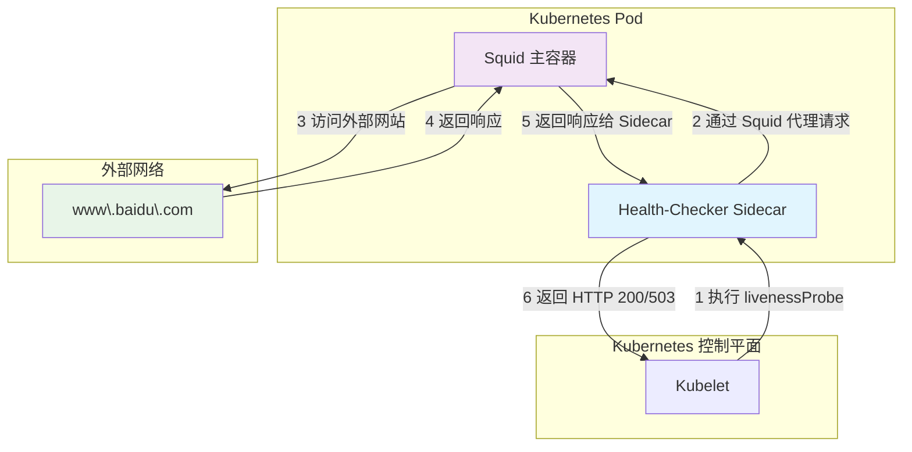
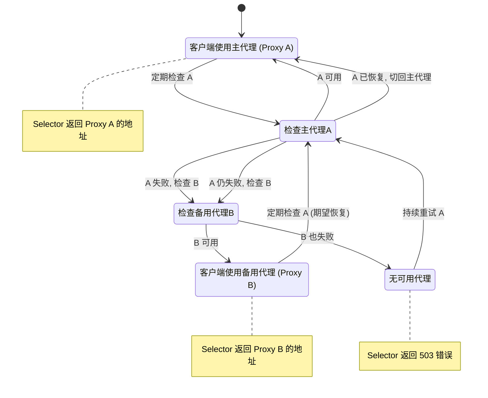

# 深度自定义 Kubernetes Liveness Probe 与智能故障切换方案

## 1. 核心需求分析

根据你的要求，我们需要解决两个核心问题：

1.  **深度健康检查**: 标准的 `livenessProbe` 只能检测 Pod 内的进程是否存在（如 TCP 端口是否监听），但无法验证该 Pod 是否具备真正的业务能力，例如，能否成功访问外部网站 `www.baidu.com`。
2.  **智能故障切换**: 当一个作为代理的 Pod (例如 Squid) 无法通过路径 A 访问外部资源时，系统应能自动切换到备用路径 B，保证服务的高可用性。

`README.md` 中提到的 Sidecar 模式是解决第一个问题的完美方案。对于第二个问题，简单的存活探针（Liveness Probe）重启机制是不够的，我们需要一个更智能的路由选择机制。

下面，我将为你提供一个整合的、分步实施的解决方案。

## 2. 方案一：实现深度健康检查 (Egress Connectivity)

这个方案的核心是为你的主应用容器（Squid）添加一个“伙伴”容器（Sidecar）。这个 Sidecar 专门负责执行深度健康检查。

### 架构与流程



### 实现步骤

#### 步骤 1: 编写健康检查脚本 (`health-check.py`)

创建一个 Python 脚本，它启动一个轻量级 Web 服务（如 Flask），并提供一个 `/health` 接口。当此接口被调用时，它会尝试通过 Squid 代理访问 `www.baidu.com`。

```python
# health-check.py
from flask import Flask, jsonify
import requests
import os

app = Flask(__name__)

# Squid 代理地址，从环境变量或固定地址获取
# 这里假设 Squid 运行在同一 Pod 的 3128 端口
SQUID_PROXY = 'http://localhost:3128'
TEST_URL = 'http://www.baidu.com'

@app.route('/health')
def health_check():
    proxies = {
        'http': SQUID_PROXY,
        'https': SQUID_PROXY,
    }
    try:
        # 设置一个合理的超时时间，例如 5 秒
        response = requests.get(TEST_URL, proxies=proxies, timeout=5)
        # 检查百度返回的状态码是否为 200
        if response.status_code == 200:
            return jsonify({"status": "ok", "message": f"Successfully connected to {TEST_URL}"}), 200
        else:
            return jsonify({"status": "error", "message": f"Baidu returned status code {response.status_code}"}), 503
    except requests.exceptions.RequestException as e:
        # 任何连接错误（超时、DNS错误、代理错误）都将导致健康检查失败
        return jsonify({"status": "error", "message": str(e)}), 503

if __name__ == '__main__':
    app.run(host='0.0.0.0', port=8080)
```

#### 步骤 2: 将脚本存入 ConfigMap

为了灵活管理，我们将脚本注入到 Pod 中，而不是打包进镜像。

```bash
kubectl create configmap health-check-script --from-file=health-check.py
```

#### 步骤 3: 创建 Deployment YAML

在 Deployment 配置中，定义两个容器：`squid-proxy` 和 `health-checker`。同时，配置 `livenessProbe` 指向 Sidecar 的 `/health` 端口。

```yaml
# squid-deployment-with-custom-probe.yaml
apiVersion: apps/v1
kind: Deployment
metadata:
  name: squid-proxy-deployment
spec:
  replicas: 1
  selector:
    matchLabels:
      app: squid-proxy
  template:
    metadata:
      labels:
        app: squid-proxy
    spec:
      containers:
        - name: squid-proxy
          image: ubuntu/squid # 使用官方的 Squid 镜像
          ports:
            - containerPort: 3128
              name: squid-port
        - name: health-checker
          image: python:3.9-slim # 使用一个轻量级的 Python 镜像
          command: ["/bin/sh", "-c"]
          args:
            - |
              pip install Flask requests
              python /app/health-check.py
          ports:
            - containerPort: 8080
              name: health-port
          volumeMounts:
            - name: script-volume
              mountPath: /app
          livenessProbe:
            httpGet:
              path: /health
              port: health-port
            initialDelaySeconds: 15 # 启动后延迟15秒开始探测
            periodSeconds: 20 # 每20秒探测一次
            failureThreshold: 3 # 连续3次失败后，重启 Pod
      volumes:
        - name: script-volume
          configMap:
            name: health-check-script
```

通过以上方案，你就实现了一个能检测真实网络连通性的“智能”存活探针。

---

## 3. 方案二：实现代理服务智能故障切换

要实现从代理 A 切换到代理 B，我们需要一个更高级的架构，因为 `livenessProbe` 的唯一作用是重启 Pod，它本身不具备切换逻辑。

这里的核心思想是：**引入一个“选择器”服务**。客户端不直接连接任何一个 Squid 实例，而是向这个选择器服务请求一个当前可用的代理地址。

### 架构与流程



### 实现步骤

#### 步骤 1: 部署多个 Squid 实例

创建两个独立的 Deployment 和 Service，一个作为主代理（primary），一个作为备用代理（secondary）。每个 Deployment 都应使用方案一中的深度健康检查机制。

- `squid-primary-deployment.yaml` -> `squid-primary-service` (ClusterIP)
- `squid-secondary-deployment.yaml` -> `squid-secondary-service` (ClusterIP)

#### 步骤 2: 创建代理选择器服务 (Proxy Selector)

这是一个独立的微服务，它的作用是：

1.  持续、独立地测试主、备代理的健康状况（同样是通过代理访问 `www.baidu.com`）。
2.  提供一个 API 端点（如 `/get-proxy`），返回当前最优的代理地址。

**示例 `proxy-selector.py`:**

```python
from flask import Flask, jsonify
import requests
import threading
import time

app = Flask(__name__)

# 代理服务的内部 DNS 名称
PROXIES = {
    "primary": "http://squid-primary-service:3128",
    "secondary": "http://squid-secondary-service:3128"
}
TEST_URL = 'http://www.baidu.com'

# 全局变量，存储当前可用的代理
current_proxy = None
lock = threading.Lock()

def check_proxies():
    global current_proxy
    while True:
        # 优先检查主代理
        try:
            requests.get(TEST_URL, proxies={'http': PROXIES['primary']}, timeout=3)
            with lock:
                current_proxy = PROXIES['primary']
            print("Primary proxy is healthy.")
            time.sleep(10) # 每10秒检查一次
            continue
        except requests.exceptions.RequestException:
            print("Primary proxy failed.")
            # 主代理失败，检查备用代理
            try:
                requests.get(TEST_URL, proxies={'http': PROXIES['secondary']}, timeout=3)
                with lock:
                    current_proxy = PROXIES['secondary']
                print("Switched to secondary proxy.")
            except requests.exceptions.RequestException:
                print("Secondary proxy also failed.")
                with lock:
                    current_proxy = None
        time.sleep(10)

@app.route('/get-proxy')
def get_proxy():
    with lock:
        if current_proxy:
            return jsonify({"status": "ok", "proxy": current_proxy}), 200
        else:
            return jsonify({"status": "error", "message": "No available proxy"}), 503

if __name__ == '__main__':
    # 在后台线程中运行健康检查
    checker_thread = threading.Thread(target=check_proxies, daemon=True)
    checker_thread.start()
    # 启动 Flask 服务
    app.run(host='0.0.0.0', port=80)
```

#### 步骤 3: 部署选择器服务

将 `proxy-selector.py` 部署为一个独立的 Deployment 和 Service。

- `proxy-selector-deployment.yaml`
- `proxy-selector-service` (可以是 ClusterIP 或 NodePort/LoadBalancer，取决于客户端如何访问它)

#### 步骤 4: 客户端集成

现在，你的客户端应用不再硬编码代理地址。在需要访问外部网络时，它会：

1.  向 `http://proxy-selector-service/get-proxy` 发送请求。
2.  获取到可用的代理地址（如 `http://squid-primary-service:3128`）。
3.  使用该地址作为代理进行后续的网络请求。

## 4. 总结

| 需求                 | 解决方案                       | 核心技术                                         | 优点                                         |
| -------------------- | ------------------------------ | ------------------------------------------------ | -------------------------------------------- |
| **深度健康检查**     | Sidecar 容器执行外部连通性测试 | `livenessProbe`, `ConfigMap` 脚本注入, Flask API | 不侵入主应用，关注点分离，检测更精准         |
| **代理故障自动切换** | 引入一个独立的“代理选择器”服务 | 多 Deployment, Service, 后台健康检查线程         | 高可用，对客户端透明，可扩展支持更多备用代理 |

通过组合这两个方案，你不仅能确保单个 Squid Pod 的真实可用性，还能构建一个具备自动故障转移能力的高可用代理集群。这完全满足了你提出的高级需求。
