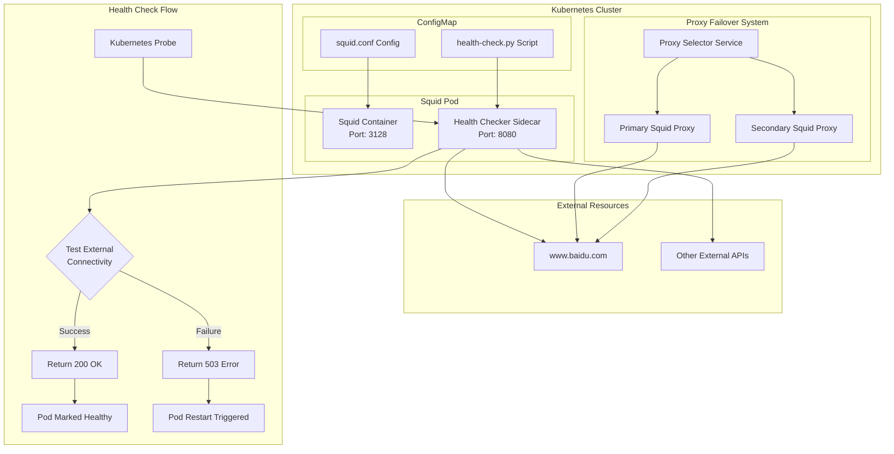
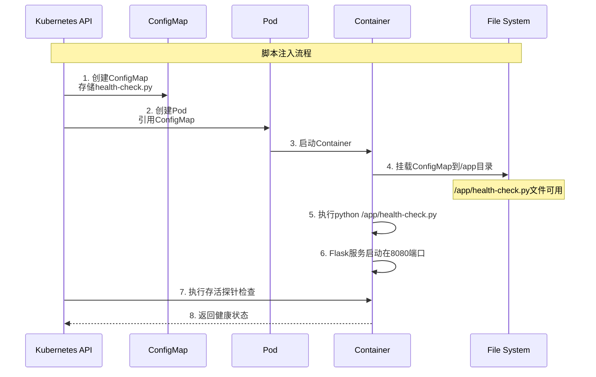
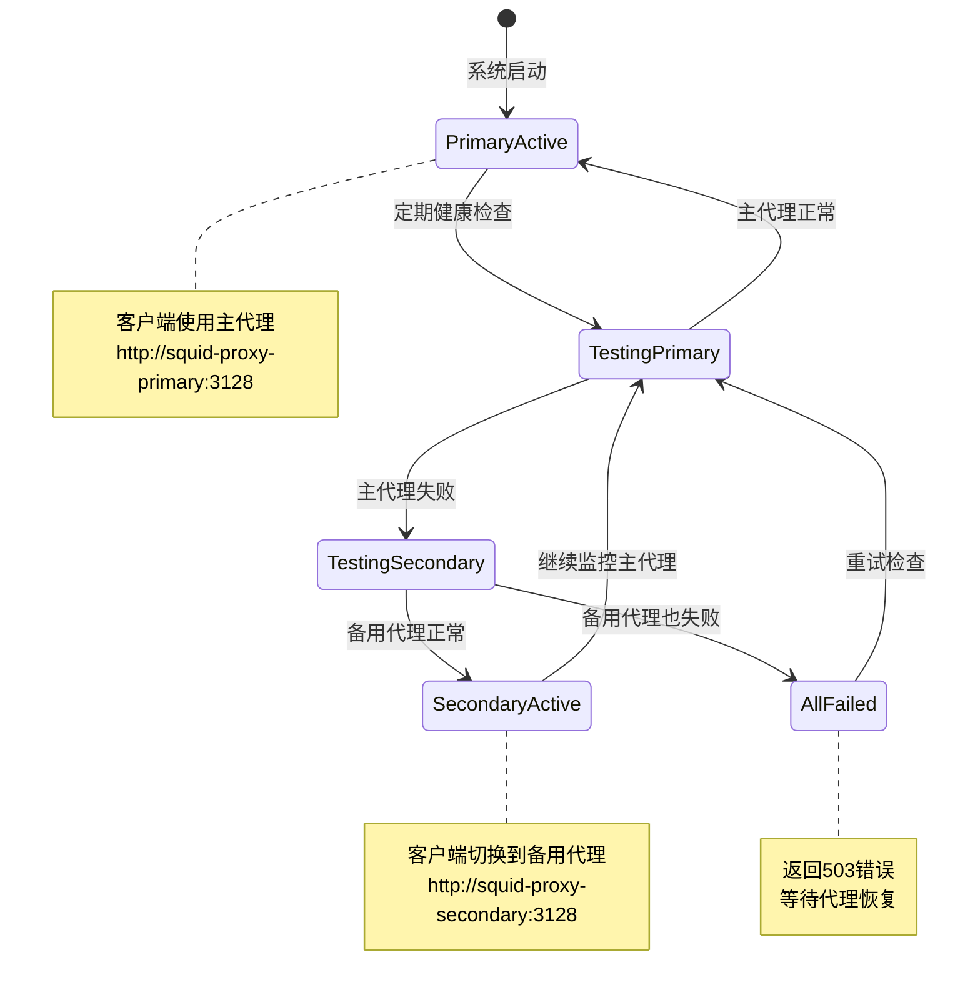

# Kubernetes 自定义存活探针与代理故障转移方案

## 项目概述

本项目实现了基于 Kubernetes 的高级健康检查和代理故障转移机制，解决了传统存活探针只能检测 Pod 内部状态的局限性，提供了检测外部网络连接能力的深度健康检查功能。

## 核心功能

### 1. 自定义存活探针

- **深度健康检查**：不仅检查 Pod 本身状态，还检测外部网络连接能力。
- **外部资源访问验证**：通过 API 接口检测 Pod 是否能访问外部资源（如 `www.baidu.com`）。
- **Sidecar 模式**：使用独立的健康检查容器，不影响主业务逻辑。
- **自动故障恢复**：当外部连接失败时，Pod 会被标记为不健康并自动重启。

### 2. 代理故障转移

- **多代理部署**：部署主代理（primary）和备用代理（secondary）。
- **智能代理选择**：自动检测可用代理并提供 API 接口。
- **无缝切换**：当主代理失败时，自动切换到备用代理。
- **客户端透明**：客户端通过统一 API 获取当前可用的代理地址。

## 实现总结

### 技术架构



### 脚本注入机制



### 故障转移流程



## 文件结构

```text
k8s/custom-liveness/
├── README.md                           # 项目文档
├── squid-deployment-with-custom-probe.yaml  # 主要部署配置
├── squid-failover-deployment.yaml     # 故障转移配置
├── deploy-and-verify.sh               # 部署验证脚本
├── alternative-methods.yaml           # 替代实现方案
├── Dockerfile.health-checker          # 自定义镜像构建
└── build-custom-image.sh             # 镜像构建脚本
```

## 核心实现要点

### 1. ConfigMap 脚本注入

- **机制**：通过 ConfigMap 将 Python 脚本注入到容器中。
- **优势**：无需自定义 Docker 镜像，配置灵活。
- **路径**：脚本挂载到容器的`/app/health-check.py`。

### 2. Sidecar 健康检查

- **独立容器**：健康检查逻辑与主业务分离。
- **Flask API**：提供`/health`和`/ready`端点。
- **外部连接测试**：通过代理访问外部资源验证连通性。

### 3. 多层探针配置

- **startupProbe**：容器启动时的初始化检查。
- **livenessProbe**：运行时的存活状态检查。
- **readinessProbe**：服务就绪状态检查。

### 4. 智能代理选择

- **健康检查**：定期测试各代理的可用性。
- **API 接口**：提供统一的代理获取接口。
- **自动切换**：主代理失败时自动使用备用代理。

## 部署和使用

### 快速部署

```bash
# 部署主要配置
kubectl apply -f squid-deployment-with-custom-probe.yaml

# 验证部署
./deploy-and-verify.sh

# 部署故障转移系统
kubectl apply -f squid-failover-deployment.yaml
```

### 测试验证

```bash
# 查看Pod状态
kubectl get pods -l app=squid-proxy

# 测试健康检查端点
kubectl port-forward <pod-name> 8080:8080
curl http://localhost:8080/health

# 查看探针执行日志
kubectl logs <pod-name> -c health-checker
```

## 优势与特点

1.  **深度健康检查**：超越传统 TCP/HTTP 探针，验证实际业务能力。
2.  **配置灵活**：通过 ConfigMap 管理脚本，无需重新构建镜像。
3.  **故障自愈**：自动检测并恢复故障状态。
4.  **高可用性**：多代理故障转移确保服务连续性。
5.  **监控友好**：提供详细的健康状态和日志信息。
6.  **扩展性强**：可轻松添加更多外部资源检查。

## 适用场景

- **代理服务**：Squid、Nginx 等代理服务的健康检查。
- **网关服务**：API 网关的外部依赖检查。
- **微服务**：需要验证外部服务连通性的应用。
- **数据同步**：需要访问外部数据源的服务。
- **监控系统**：需要检查外部监控目标的可达性。

这个方案完美解决了传统 Kubernetes 探针只能检查内部状态的局限性，提供了真正的端到端健康检查能力。

---

## 实现总结表

| 组件               | 功能                | 实现方式                   | 关键技术            |
| ------------------ | ------------------- | -------------------------- | ------------------- |
| **自定义存活探针** | 检测外部网络连通性  | Sidecar 容器 + Flask API   | ConfigMap 脚本注入  |
| **健康检查脚本**   | 测试 baidu.com 访问 | Python requests 库         | 通过 Squid 代理请求 |
| **故障转移系统**   | 主备代理自动切换    | 多 Deployment + 选择器服务 | 智能代理检测 API    |
| **脚本注入机制**   | 无需自定义镜像      | ConfigMap Volume 挂载      | Kubernetes 原生能力 |
| **监控和日志**     | 实时状态跟踪        | 结构化日志 + HTTP 状态码   | Flask jsonify 响应  |

## 解决的核心问题

1.  **传统探针局限性**：只能检查 Pod 内部状态，无法验证外部依赖。
2.  **代理服务可靠性**：单点故障导致服务不可用。
3.  **配置管理复杂性**：需要自定义镜像才能添加健康检查逻辑。
4.  **故障恢复自动化**：手动切换代理效率低且容易出错。

## 技术创新点

- **深度健康检查**：从 Pod 状态检查升级到业务能力验证。
- **ConfigMap 脚本注入**：动态配置健康检查逻辑，无需重构镜像。
- **智能代理选择**：API 驱动的故障转移机制。
- **Sidecar 模式**：健康检查与业务逻辑完全解耦。

通过这个方案，你的 Squid 代理不仅能检测自身运行状态，还能验证是否真正具备访问外部资源的能力，并在出现问题时自动进行故障转移，大大提升了系统的可靠性和自愈能力。

---

# Local Model

To implement a custom **livenessProbe** that checks external connectivity (e.g., www.baidu.com) for your Squid proxy in Kubernetes, and enable **failover between two proxies** (A → B) when connectivity fails, follow this structured approach:

### Step 1: Configure a Custom LivenessProbe for External Connectivity Check

In your Kubernetes Deployment YAML, define a livenessProbe that runs a command to test Squid's ability to egress to www.baidu.com. This probe will **restart the pod** if the check fails.

```yaml
apiVersion: apps/v1
kind: Deployment
metadata:
  name: squid-proxy
spec:
  replicas: 2  # Two pods for failover
  template:
    spec:
      containers:
      - name: squid
        image: your-squid-image:latest
        ports:
        - containerPort: 3128  # Squid's HTTP proxy port
        livenessProbe:
          exec:
            command:
            - /bin/sh
            - -c
            - "curl -s -o /dev/null http://www.baidu.com || exit 1"
          # Note: Requires `curl` to be installed in the Squid container
```

**Key Notes**:
- The `curl` command checks if Squid can resolve and connect to www.baidu.com.
- If the command fails (e.g., timeout, DNS error), the pod is **restarted** (via livenessProbe), ensuring only healthy pods receive traffic.
- This is a **custom probe** (not HTTP/TCPIP-based), as Squid's egress behavior is tested via a command.

### Step 2: Enable Failover Between Two Proxies (A → B)

To switch from Proxy A to Proxy B when A fails:

1.  **Deploy Two Squid Instances** (A and B) with identical configurations:

    **Deployment-A (Proxy A)**
    ```yaml
    apiVersion: apps/v1
    kind: Deployment
    metadata:
      name: squid-proxy-a
    spec:
      replicas: 1
      template:
        spec:
          containers:
          - name: squid
            image: your-squid-image:latest
            livenessProbe:  # Same as above
              exec:
                command:
                - /bin/sh
                - -c
                - "curl -s -o /dev/null http://www.baidu.com || exit 1"
    ```

    **Deployment-B (Proxy B)**
    ```yaml
    apiVersion: apps/v1
    kind: Deployment
    metadata:
      name: squid-proxy-b
    spec:
      replicas: 1
      template:
        spec:
          containers:
          - name: squid
            image: your-squid-image:latest
            livenessProbe:  # Same as above
              exec:
                command:
                - /bin/sh
                - -c
                - "curl -s -o /dev/null http://www.baidu.com || exit 1"
    ```

2.  **Create a Load Balancer Service** to route traffic to healthy proxies:

    ```yaml
    apiVersion: v1
    kind: Service
    metadata:
      name: squid-proxy-service
    spec:
      type: LoadBalancer  # Or `ClusterIP` for internal use
      ports:
      - port: 80
        targetPort: 3128
      selector:
        app: squid-proxy  # Matches both Deployments A and B
    ```

3.  **How Failover Works**:
    - If **Proxy A** fails the livenessProbe (e.g., can't reach baidu.com), Kubernetes **removes it from the service**.
    - Traffic automatically routes to **Proxy B** (the healthy instance).
    - If both fail, traffic stops (handled by your network policies).

### Why This Works for Squid

- Squid is a **reverse proxy** that handles client requests. Your livenessProbe tests if Squid can **forward traffic to external resources** (e.g., baidu.com).
- The `curl` command simulates a real request (no need for complex network policies).
- Failover is **automated** via Kubernetes' built-in health checks and service routing.

### Critical Notes

1.  **Squid Container Requirements**:
    - Ensure `curl` is installed in your Squid container (e.g., `RUN apt-get install curl` in Dockerfile).
    - If your Squid uses HTTPS, add `https://www.baidu.com` (or use a custom CA cert).

2.  **Failover Scope**:
    - This only handles **proxy health** (not upstream failures). If baidu.com itself fails, your probe will trigger a restart (but this is outside your control).
    - For deeper failover (e.g., switching to a different upstream), configure Squid's `acl` and proxy rules dynamically.

3.  **Alternative for Advanced Cases**:
    - Use **Istio** or **Linkerd** for service mesh-based failover (e.g., automatic routing to healthy proxies).
    - For more granular control, implement a **custom controller** that monitors Squid's health and switches upstreams.

### Summary

| Component                 | Purpose                                                     |
| ------------------------- | ----------------------------------------------------------- |
| livenessProbe (curl)      | Tests if Squid can reach baidu.com → restarts unhealthy pods |
| 2 Squid Deployments (A/B) | Provides failover: traffic switches to healthy proxy when A fails |
| Service (LoadBalancer)    | Routes traffic to healthy proxies automatically             |

This setup ensures your Squid proxy stays healthy and automatically fails over to a backup proxy if the primary fails. No additional tools are needed beyond standard Kubernetes.

Let me know if you need help with the Dockerfile, service configuration, or Squid-specific tuning!