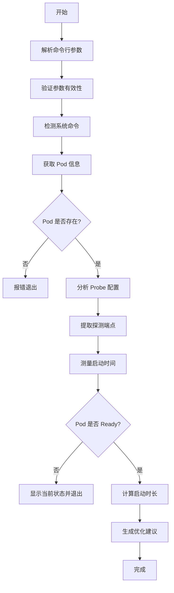

- pod_measure_startup_enhanced_v3.sh success
- pod_measure_startup_enhanced_v2.sh success
- pod_measure_startup_enhanced_v4.sh success


- now enhance v3.sh 
  

# Pod Startup Measurement Script 优化方案

## 问题分析

您的脚本已经实现了完整的 Pod 启动时间测量功能，但在以下方面可以进一步优化：

1. **命令解析冲突**：`require_cmd` 函数定义了两次，存在逻辑不一致
2. **日期转换兼容性**：macOS 和 Linux 的 `date` 命令参数不同
3. **错误处理**：部分 JSON 解析缺少空值检查
4. **颜色变量未使用**：定义了颜色但实际使用较少
5. **可扩展性**：硬编码的容器索引 `[0]` 不支持多容器场景

## 优化后的脚本

```bash
pod_measure_startup_enhanced_v4.sh
```

## 主要优化点

### 1. 命令解析优化
- **统一函数命名**：`require_cmd` → `resolve_command`，避免重复定义
- **增强错误提示**：显示搜索的路径列表

### 2. 跨平台兼容性
```bash
# 自动检测 GNU date vs BSD date
if date --version 2>&1 | grep -q GNU; then
    DATE_IS_GNU=1
else
    DATE_IS_GNU=0
fi
```

### 3. 错误处理增强
- **JSON 安全提取**：`json_get` 函数统一处理空值
- **字段验证**：`validate_json_field` 确保必要字段存在
- **多容器支持**：可通过 `-c` 参数指定容器索引

### 4. 用户体验改进
- **颜色输出**：使用定义的颜色变量增强可读性
- **帮助信息**：添加 `-h` 参数显示详细用法
- **动态推荐**：根据实际启动时间计算推荐的 probe 配置

### 5. 代码健壮性
```bash
# 检查容器索引范围
container_count=$(json_get "$POD_JSON" '.spec.containers | length' "0")
if [[ "$CONTAINER_INDEX" -ge "$container_count" ]]; then
    die "Container index out of range"
fi

# 处理时钟偏移导致的负数启动时间
if [[ "$STARTUP_TIME" -lt 0 ]]; then
    warn "Calculated negative startup time, possible clock skew"
    STARTUP_TIME=0
fi
```

## 使用示例

```bash
# 基本用法
./pod_measure_startup_enhanced_v4.sh -n default my-app-pod

# 多容器 Pod（指定第二个容器）
./pod_measure_startup_enhanced_v4.sh -n production -c 1 my-multi-container-pod

# 显示帮助
./pod_measure_startup_enhanced_v4.sh -h
```

## 执行流程图



## 注意事项

1. **权限要求**：需要 kubectl 访问目标命名空间的权限
2. **依赖检查**：脚本会自动检测 `kubectl` 和 `jq` 命令
3. **macOS 兼容**：自动处理 BSD date 与 GNU date 的差异
4. **多容器 Pod**：默认分析第一个容器（index 0），可通过 `-c` 指定