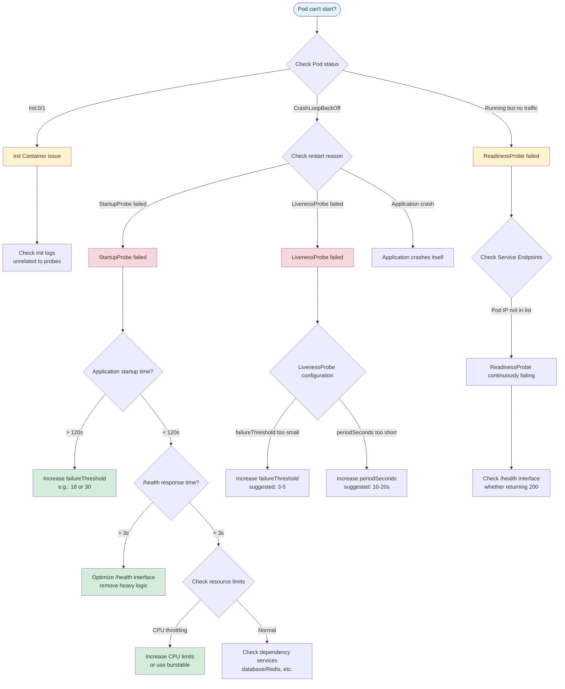

# GKE Explorer: Best Practices Guide for Probe Configuration

This document provides a practical set of configurations for Pod startup and liveness probes (Probe) based on your Deployment template (`{{apiName}}-{{apiVersion}}-deployment`).

## 📋 Table of Contents

1. [Core Concepts: Startup Process and Probes](#1-core-concepts-startup-process-and-probes)
2. [Step 1: Measuring Real Startup Time](#2-step-1-measuring-real-startup-time-the-metric)
3. [Step 2: Parameter Calculation Formulas](#3-step-2-parameter-calculation-formulas-the-math)
4. [Best Practice Configuration Templates](#4-best-practice-configuration-templates)
5. [Deep Dive](#5-deep-dive)
6. [Frequently Asked Questions](#6-frequently-asked-questions-faq)
7. [Summary: Platform Recommendations](#7-summary-platform-recommendations)
8. [Visualization: Complete Probe Workflow](#8-visualization-complete-probe-workflow) ⭐ Recommended
9. [Appendix: Detailed StartupProbe Timeline Analysis](#9-appendix-detailed-startupprobe-timeline-analysis)

---

## 1. Core Concepts: Startup Process and Probes

To configure probes accurately, you must first understand the Pod startup timeline, particularly the relationship between `InitContainer` and `StartupProbe`.

### 1.1 Startup Timeline Analysis

In your Deployment, the startup process is divided into two stages:

```mermaid
timeline
    title Complete Pod Startup Lifecycle
    section Init Phase
        InitContainer (appd-init-service) : Copy Agent Files
        Init Duration : Belongs to Pod startup time<br>but not included in Probe timing
    section App Container Startup
        Main Container Created : Container Creation
        Process Start : Business process starts (Java/Go/Node...)
        App Logic Load : Load configuration/database connections/cache warm-up
        StartupProbe Active : ⚠️ Probes start working here
        App Ready : Business completely ready
```



> [!IMPORTANT]
> **Key Understanding**:
> `startupProbe`, `livenessProbe`, and `readinessProbe` **only start timing after the main container (Containers) starts**.
>
> *   **Init Container (appd-init-service)** duration **will not** consume `startupProbe` time quota.
> *   If Init Container gets stuck (e.g., `cp -r` extremely slow or fails), Pod status stays at `Init:0/1`. At this point, the main container hasn't been created yet, so probes haven't started working.
> *   Therefore, **probe configuration does not need to account for Init Container duration**.

### 1.2 Probe Responsibility Matrix

| Probe Type | Key Parameter | Responsibility | Failure Consequence | Configuration Principle |
| :--- | :--- | :--- | :--- | :--- |
| **Startup** | `failureThreshold` | **Protect slow startup**. Give application sufficient time to complete initialization (class loading, connection pools, etc.). | **Restart container** (Kill & Restart) | **Better too large than too small**. Cover 99% of startup scenarios. |
| **Readiness** | `periodSeconds` | **Traffic control**. Determine whether to add Pod IP to Service Endpoints. | **Cut traffic** (Service removal) | **Agile**. Quickly detect failures and cut traffic. |
| **Liveness** | `failureThreshold` | **Deadlock detection**. Detect application hang (process running but unable to handle requests). | **Restart container** (Kill & Restart) | **Conservative**. Avoid false kills due to temporary fluctuations. |

---

## 2. Step 1: Measuring Real Startup Time (The Metric)

Before setting parameters, we need to know the application's "real startup duration". This is not just the process startup time, but the **time when business logic is completely loaded and ready to respond to health checks**.

### 2.1 Measurement Method: Bare Metal Start Test

We recommend using the **"Remove Probes Method"** for a baseline test. This avoids interference from the probes themselves (such as repeated restarts caused by tight configurations).

**Operational Steps:**

1.  **Create Test Deployment**: Copy your existing Deployment YAML.
2.  **Remove Probes**: Comment out `startupProbe`, `readinessProbe`, `livenessProbe` sections.
3.  **Deploy and Observe**: Use the provided script to measure from `ContainerStarted` to `Health Check 200 OK` time.

> [!TIP]
> In other words, we're not measuring `Init` time, but the main container's duration from **Process Started** -> **Ready**.

### 2.2 Measurement Script (pod_measure_startup_fixed.sh)

We provide an automated script to measure Pod's real startup time. The script will:
- Automatically read Pod's probe configuration
- Calculate time from container startup to Ready state
- Analyze whether current configuration is reasonable
- Provide optimization suggestions

**Script location**: `k8s/scripts/pod_measure_startup_fixed.sh`

#### Usage

```bash
# Basic usage
./pod_measure_startup_fixed.sh -n <namespace> <pod-name>

# Example: Measure nginx Pod startup time
./pod_measure_startup_fixed.sh -n lex nginx-deployment-854b5bc678-m428j
```

#### Output Example

```
━━━━━━━━━━━━━━━━━━━━━━━━━━━━━━━━━━━━━━━━
Measuring Pod Startup Time: nginx-deployment-854b5bc678-m428j (Namespace: lex)
━━━━━━━━━━━━━━━━━━━━━━━━━━━━━━━━━━━━━━━━

📋 Step 1: Get Pod Basic Information
   Pod Creation Time: 2025-10-29T10:58:34Z
   Container Start Time: 2025-11-30T05:07:28Z

📋 Step 2: Analyze Readiness Probe Configuration
   Readiness Probe Configuration:
   {
     "failureThreshold": 3,
     "httpGet": {
       "path": "/",
       "port": 80,
       "scheme": "HTTP"
     },
     "periodSeconds": 20,
     "successThreshold": 1,
     "timeoutSeconds": 3
   }

   Extracted Probe Parameters:
   - Scheme: HTTP
   - Port: 80
   - Path: /
   - Initial Delay: 0s
   - Period: 20s
   - Failure Threshold: 3

⏱️  Step 3: Check Pod Ready Status
   Pod is in Ready state
   Ready Time: 2025-11-30T05:07:38Z

━━━━━━━━━━━━━━━━━━━━━━━━━━━━━━━━━━━━━━━━
📊 Final Result (Result)
━━━━━━━━━━━━━━━━━━━━━━━━━━━━━━━━━━━━━━━━
✅ Application startup duration: 10 seconds
   (Based on Kubernetes Ready status)

📋 Current Probe Configuration Analysis:
   - Current configuration allows maximum startup time: 60 seconds
   - Actual startup time: 10 seconds
   ✓ Current configuration is sufficient

💡 Recommended Optimization Configuration:
   readinessProbe:
     httpGet:
       path: /
       port: 80
       scheme: HTTP
     initialDelaySeconds: 0
     periodSeconds: 20
     failureThreshold: 1

📋 Or use startupProbe (recommended):
   startupProbe:
     httpGet:
       path: /
       port: 80
       scheme: HTTP
     initialDelaySeconds: 0
     periodSeconds: 10
     failureThreshold: 1
   readinessProbe:
     httpGet:
       path: /
       port: 80
       scheme: HTTP
     initialDelaySeconds: 0
     periodSeconds: 5
     failureThreshold: 3
━━━━━━━━━━━━━━━━━━━━━━━━━━━━━━━━━━━━━━━━
```

#### Script Features

1. **Automatic probe configuration detection**: No need to manually specify port and path
2. **Support for HTTP and HTTPS**: Automatically detect protocol type
3. **Real-time detection**: If Pod is not Ready, will detect in real-time until successful
4. **Smart suggestions**: Calculate recommended configuration based on actual startup time
5. **Cross-platform support**: Compatible with macOS and Linux

#### Multiple Measurement Suggestions

To obtain accurate P99 startup time, suggest:

```bash
# 1. Delete existing Pod, let it rebuild
kubectl delete pod <pod-name> -n <namespace>

# 2. Wait for new Pod creation
kubectl get pods -n <namespace> -w

# 3. Measure new Pod startup time
./pod_measure_startup_fixed.sh -n <namespace> <new-pod-name>

# 4. Repeat 3-5 times, record results
```

Suppose measurement results are as follows (example):
*   1st time: 15s
*   2nd time: 25s
*   3rd time: 22s
*   4th time: 18s
*   5th time: 40s (P99)

**Use P99 value (40s) as configuration basis**, ensuring 99% of startup scenarios can succeed.

---

## 3. Step 2: Parameter Calculation Formulas (The Math)

Based on the measured **P99 (slowest startup time)**, we can scientifically calculate recommended parameters.

### 3.1 StartupProbe: Protect Startup

Goal: Ensure application has sufficient time to start even in the slowest case, while maintaining safety buffer (Buffer).

*   **Period (detection interval)**: Suggest fixed at **10s**. If set too short (like 1s), will increase CPU consumption unnecessarily.
*   **Target Duration (target protection duration)** = `P99 startup time` × `1.5` (safety factor).
*   **FailureThreshold (failure threshold)** = `Target Duration` / `Period`.

> **Example Calculation**:
> *   P99 startup time = 40s
> *   Safety protection duration = 40s × 1.5 = 60s
> *   Period = 10s
> *   **FailureThreshold** = 60 / 10 = **6**

### 3.2 ReadinessProbe: Agile Go-Live

Goal: As soon as application is Ready, quickly bring in traffic; as soon as abnormal during operation, quickly cut traffic.

*   **InitialDelay**: Suggest set to **0** or minimal value (like 5s). Because StartupProbe success means application is already Ready, no need to wait again.
*   **Period**: **5s - 10s**.
*   **FailureThreshold**: **3 times**.
*   **Timeout**: **1s - 3s**. Don't make it too long, if health check doesn't respond in 3 seconds, indicates service load is extremely high, should not receive more traffic.

### 3.3 LivenessProbe: Last Resort Defense

Goal: Only restart when application is completely deadlocked (Deadlock).

*   **InitialDelay**: **0**. StartupProbe success takes over, naturally doesn't need delay.
*   **Period**: **10s - 20s**.
*   **FailureThreshold**: **3 - 5 times**.
*   **Timeout**: **5s**. Give it more tolerance to avoid restarts due to GC or transient high load.

---

## 4. Best Practice Configuration Templates

Apply the above logic to your `deployment.yaml`:

### 4.1 Scenario A: Normal Java/Go Application (startup time < 60s)

```yaml
      # Startup probe: core is to "buy time" for application
      startupProbe:
        httpGet:
          scheme: HTTPS
          path: /{{apiName}}/{{minorVersion}}/.well-known/health
          port: {{port}}
        periodSeconds: 10
        timeoutSeconds: 3
        failureThreshold: 12  # Provides 10 * 12 = 120s startup window, sufficient for most slow startups
        successThreshold: 1

      # Readiness probe: core is "agile"
      readinessProbe:
        httpGet:
          scheme: HTTPS
          path: /{{apiName}}/{{minorVersion}}/.well-known/health # 💡 Suggestion:尽量使用轻量接口
          port: {{port}}
        initialDelaySeconds: 0 # Starts immediately after Startup success
        periodSeconds: 5       # Check every 5 seconds
        timeoutSeconds: 2      # Timeout in 2 seconds counts as one failure
        failureThreshold: 3    # Remove traffic after 3 consecutive failures

      # Liveness probe: core is "steady"
      livenessProbe:
        httpGet:
          scheme: HTTPS
          path: /{{apiName}}/{{minorVersion}}/.well-known/health
          port: {{port}}
        initialDelaySeconds: 0

Conclusion: This setting is reasonable and can meet your needs.

Here is a core concept that needs clarification: timeoutSeconds does not need to cover the entire application startup time.

Why is this reasonable?
Kubernetes's StartupProbe covers startup time through "multiple retries" rather than "single long wait".

Let's break down your scenario:

Total Window Period (Total Window):
You have 12 chances (failureThreshold: 12).
Try once every 10 seconds (periodSeconds: 10).
This means: As long as your application completes startup within 120 seconds (12 * 10s), there's no problem.
Single Detection (Single Probe):
timeoutSeconds: 3 means: Kubelet initiates an HTTP request, if no reply is received within 3 seconds, it's marked as "1 failure".
Key point: Failure is okay! We have 11 more chances.
Simulate application startup process
Suppose your application needs 40 seconds to complete startup. During these 40 seconds, the application may completely not respond to network requests (or respond extremely slowly). Here's the process:

T=0s: 1st probe. Application is busy loading various Beans, not processing requests.
Result: Timeout after 3 seconds.
Count: 1 failure (11 remaining).
T=10s: 2nd probe. Application is still busy, not even listening on port.
Result: Connection Refused (instant failure).
Count: 2 failures (10 remaining).
T=20s: ...... 3 failures.
T=30s: ...... 4 failures.
T=40s: Application finally starts! Port is opened, logic is loaded.
T=50s: 6th probe.
Result: Application returns HTTP 200 OK within 200ms.
Final result: StartupProbe successful! Pod is marked Ready, enters normal operation.
When will timeoutSeconds: 3 have problems?
Only one situation will cause problems: Your application "has started", but even processing the simplest /health request requires more than 3 seconds to hang.

If the /health interface just returns "OK" simply, it usually only takes a few milliseconds.
If complex database queries are written in the /health interface, leading to database queries every time for 5 seconds before returning a package, it will always timeout, causing the Pod to fail to start.
This is why we suggest: Health check interface must be lightweight.
Summary Suggestion
FailureThreshold (12 times): This gives you "loading business logic" time (120 seconds).
TimeoutSeconds (3 seconds): This requires your health check interface to "respond quickly", no hesitation.
Therefore, as long as your application can complete startup within 120 seconds, and the /health interface response speed after startup is normal (<3s), this configuration is safe.
```
### 4.2 Scenario B: Slow Start/Resource-Heavy Applications (startup time > 2 minutes)

For example, AI services that need to load large amounts of cache or models.

```yaml
      # Startup probe: provide longer window for slow-start applications
      startupProbe:
        httpGet:
          scheme: HTTPS
          path: /{{apiName}}/{{minorVersion}}/.well-known/health
          port: {{port}}
        periodSeconds: 10
        timeoutSeconds: 3
        failureThreshold: 30  # Provide 10 * 30 = 300s (5 minutes) startup window
        successThreshold: 1

      # ReadinessProbe and LivenessProbe configuration same as Scenario A
      readinessProbe:
        httpGet:
          scheme: HTTPS
          path: /{{apiName}}/{{minorVersion}}/.well-known/health
          port: {{port}}
        initialDelaySeconds: 0
        periodSeconds: 5
        timeoutSeconds: 2
        failureThreshold: 3

      livenessProbe:
        httpGet:
          scheme: HTTPS
          path: /{{apiName}}/{{minorVersion}}/.well-known/health
          port: {{port}}
        initialDelaySeconds: 0
        periodSeconds: 20
        timeoutSeconds: 5
        failureThreshold: 3
```

**Key Points**:
- **Increase `failureThreshold`** (not `timeoutSeconds`) to extend startup window
- Application slowness is because processing business logic, not single HTTP request slowness
- HTTP requests should return quickly (return 503 even during startup)

---

## 5. Deep Dive (Deep Dive)

### 5.1 Core Clarification: Single Timeout vs Startup Window

Many users worry: *"My application startup takes 1 minute, but `timeoutSeconds` is only 3 seconds, will there be problems?"*

**Answer: No problem at all.**

Kubernetes's StartupProbe covers startup time through **"multiple retries"**.

*   **FailureThreshold (12 times) × Period (10s) = 120 seconds**: This is the **startup budget** for the application. As long as startup is complete at any time within these 120 seconds, it's successful.
*   **TimeoutSeconds (3 seconds)**: This is the requirement for **health check interface response speed**.
    *   During startup (first 119 seconds), Probe request timeout or rejection doesn't matter, this only consumes "retry count".
    *   Once application starts, Probe request should return within 3 seconds quickly. If your `/health` interface logic is too heavy (such as executing long-running SQL) causing it to always exceed 3 seconds, the probe will always fail.

### 5.2 Java Application Time Bill: Spring and APPD

You may see in logs:
`Root WebApplicationContext: initialization completed in 8000 ms`

**Q: Where does this 8000ms count?**

**A: This completely belongs to main container startup time, must be included in `startupProbe` budget.**

Let's look at a typical Java + AppDynamics (APPD) application startup timeline:

```mermaid
gantt
    dateFormat  s
    axisFormat  %s
    title Real Java Application Startup Duration Breakdown

    section Phase
    JVM Initialization (class loading)      :active, jvm, 0, 5s
    APPD Agent Injection/Connection     :crit, appd, 5, 15s
    Spring Context Init     :active, spring, 15, 23s
    Tomcat/Undertow Start     :server, 23, 26s
    Application Fully Ready           :milestone, ready, 26, 0s
```



1.  **JVM Start**: Java Virtual Machine startup cost itself.
2.  **APPD Agent Overhead**: **This is the easy-to-overlook major head**. Agent needs to connect Controller, download configuration, modify bytecode (Instrumentation). This typically adds 10% - 30% startup time.
3.  **Spring Init (8000ms)**: This is the time printed in logs, **it's only part of total duration**.
4.  **Web Server Start**: Port is finally listened, at this point Probe can connect.

**Conclusion**:
If logs show Spring startup took 8 seconds, your **real end-to-end startup time** (from Pod Created to Ready) may be as high as **20-30 seconds**.
Therefore, when configuring `startupProbe`, **don't just refer to Spring startup logs**, be sure to use `measure_startup.sh` script to measure **real total duration**.

---

## 6. Frequently Asked Questions (FAQ)

### Q1: Will slow Init Container execution cause Probe failure restart?
**No.**
If `appd-init-service` copying files takes 5 minutes, Pod status will always be `Init:0/1`. At this point main container hasn't started, Kubelet won't execute any Probe, so won't trigger Probe failure restart.
*Note: If Init Container crashes and exits, that's controlled by Pod's RestartPolicy, unrelated to Probe.*

### Q2: Since there's StartupProbe, do we still need InitialDelaySeconds?
**Basically not needed.**
After Kubernetes v1.18+ introduced `startupProbe`, it's meant to replace the "wait for startup by estimating `initialDelaySeconds`" old method.
Recommended approach:
*   `startupProbe`: Configure sufficient FailureThreshold.
*   `liveness/readiness`: `initialDelaySeconds: 0`.

### Q3: Why is my Probe always timing out (Timeout)?
Check the following:
1.  **Resource limits (CPU throttling)**: Large CPU demand during startup, if `resources.limits.cpu` is set too small, application responds extremely slowly.
2.  **Dependency cascade**: Does health check interface connect to database? If database is slow, probe is slow. Recommend health check **only check application status itself**, or use separate `/ready` interface to check dependencies, `/live` interface only check process.

### Q4: How to handle impact of "configuration loading" on startup?
If application needs to pull remote configuration (like Spring Cloud Config), this belongs to "business startup logic".
**Strategy**: This will be counted into StartupProbe time. So need to measure this duration, and include it in StartupProbe's `failureThreshold` buffer.

---

## 7. Summary: Platform Recommendations

If you want to provide self-service configuration for users, suggest following this process:

1.  **Default**: 
    *   Startup: 120s (10s * 12) —— Covers most applications.
    *   Liveness: 3 times * 20s —— Sufficient tolerance.
2.  **Override**:
    *   Allow users to override `failureThreshold` (for slow-start applications).
    *   Allow users to override `path` (for custom health check paths).
3.  **Validate**:
    *   Prohibit users from setting `timeoutSeconds` too large (like >10s), this will mask system performance issues.

---

## 8. Visualization: Complete Probe Workflow

### 8.1 Pod Startup Full Process Diagram (with probe status)

```mermaid
stateDiagram-v2
    [*] --> PodCreated: kubectl apply

    PodCreated --> InitRunning: Scheduled to node
    note right of InitRunning
        Init Container execution
        (appd-init-service)
        Probes not started yet ⏸️
    end note

    InitRunning --> MainContainerStarting: Init completed

    MainContainerStarting --> StartupProbeActive: Main container created
    note right of StartupProbeActive
        StartupProbe starts working 🔍
        periodSeconds: 10s
        timeoutSeconds: 3s
        failureThreshold: 12
    end note

    state StartupProbeActive {
        [*] --> ProbeAttempt
        ProbeAttempt --> ProbeFailed: Connection refused/timeout/non-200
        ProbeFailed --> CheckFailureCount
        CheckFailureCount --> ProbeAttempt: Failure count < 12<br/>Wait 10 seconds
        CheckFailureCount --> ContainerKilled: Failure count = 12
        ProbeAttempt --> ProbeSuccess: HTTP 200 OK
    }

    StartupProbeActive --> ReadinessProbeActive: StartupProbe success ✅
    note right of ReadinessProbeActive
        ReadinessProbe takes over 🚦
        Quickly detect traffic readiness status
        periodSeconds: 5s
    end note

    StartupProbeActive --> ContainerKilled: StartupProbe fails 12 times
    ContainerKilled --> [*]: Pod restart

    state ReadinessProbeActive {
        state fork_state <<fork>>
        [*] --> fork_state
        fork_state --> ReadinessCheck
        fork_state --> LivenessCheck

        ReadinessCheck --> Ready: HTTP 200
        ReadinessCheck --> NotReady: Failure
        Ready --> InService: Join Service Endpoints
        NotReady --> OutOfService: Remove from Service Endpoints

        LivenessCheck --> Alive: HTTP 200
        LivenessCheck --> DeadlockDetected: Consecutive failures
        DeadlockDetected --> RestartContainer: Restart container
    }

    ReadinessProbeActive --> [*]: Pod deletion
```



### 8.2 Probe Timeline Interaction Diagram (80-second startup scenario)

```mermaid
sequenceDiagram
    autonumber
    participant K as Kubelet
    participant C as Container
    participant A as Application
    participant H as /health Endpoint

    rect rgb(240, 240, 240)
        Note over K,H: Phase 1: Init Container (not counted in probe time)
        K->>C: Start Init Container
        C->>C: Copy APPD Agent files
        C-->>K: Init completed
    end

    rect rgb(255, 240, 240)
        Note over K,H: Phase 2: Main container startup + StartupProbe detection
        K->>C: Start main container
        C->>A: Start Java process

        Note over K: T=0s: Detection #1
        K->>H: GET /health (HTTPS)
        H--xK: Connection Refused ❌
        Note over K: Failure count: 1/12

        Note over A: Loading JVM + Spring Context

        Note over K: T=10s: Detection #2
        K->>H: GET /health
        H--xK: Connection Refused ❌
        Note over K: Failure count: 2/12

        Note over A: Initializing database connection pool

        Note over K: T=20s: Detection #3
        K->>H: GET /health
        H--xK: Connection Refused ❌
        Note over K: Failure count: 3/12

        Note over A: Loading APPD Agent

        Note over K: T=30s: Detection #4
        K->>H: GET /health
        H--xK: Connection Refused ❌
        Note over K: Failure count: 4/12

        Note over A: Port starts listening

        Note over K: T=40s: Detection #5
        K->>H: GET /health
        H-->>K: HTTP 503 (50ms) ⚠️
        Note over K: Failure count: 5/12

        Note over A: Cache preheating

        Note over K: T=50s: Detection #6
        K->>H: GET /health
        H-->>K: HTTP 503 (80ms) ⚠️
        Note over K: Failure count: 6/12

        Note over K: T=60s: Detection #7
        K->>H: GET /health
        H-->>K: HTTP 503 (120ms) ⚠️
        Note over K: Failure count: 7/12

        Note over K: T=70s: Detection #8
        K->>H: GET /health
        H-->>K: HTTP 503 (200ms) ⚠️
        Note over K: Failure count: 8/12

        Note over A: Application fully ready!

        Note over K: T=80s: Detection #9
        K->>H: GET /health
        H-->>K: HTTP 200 OK (150ms) ✅
        Note over K: StartupProbe successful!
    end

    rect rgb(240, 255, 240)
        Note over K,H: Phase 3: ReadinessProbe + LivenessProbe takes over
        K->>K: Pod marked as Ready
        K->>H: ReadinessProbe (every 5s)
        H-->>K: HTTP 200 ✅
        Note over K: Join Service Endpoints

        K->>H: LivenessProbe (every 20s)
        H-->>K: HTTP 200 ✅
        Note over K: Container running healthily
    end
```



### 8.3 Probe Decision Tree (Troubleshooting Guide)



### 8.4 Three Probes Comparison Visualization

```mermaid
gantt
    title Probe Lifecycle and Responsibility Division
    dateFormat s
    axisFormat %Ss

    section Init Phase
    Init Container Execution :crit, init, 0, 15s
    Probes Not Started :milestone, 15, 0s

    section StartupProbe
    Protect Startup Window (0-120s) :active, startup, 15, 135s
    Detection #1 (Failed) :milestone, 15, 0s
    Detection #2 (Failed) :milestone, 25, 0s
    Detection #3 (Failed) :milestone, 35, 0s
    Detection #4 (Failed) :milestone, 45, 0s
    Detection #5 (Failed) :milestone, 55, 0s
    Detection #6 (Failed) :milestone, 65, 0s
    Detection #7 (Failed) :milestone, 75, 0s
    Detection #8 (Failed) :milestone, 85, 0s
    Detection #9 (Success) :milestone, 95, 0s

    section ReadinessProbe
    Traffic Control (Quick Response) :done, readiness, 95, 200s
    Check Every 5s :milestone, 95, 0s

    section LivenessProbe
    Deadlock Detection (Conservative Strategy) :done, liveness, 95, 200s
    Check Every 20s :milestone, 95, 0s
```



---

## 9. Appendix: Detailed StartupProbe Timeline Analysis

### 9.1 Probe Failure Scenario Detailed Breakdown (Based on Your Configuration)

Let's use your actual configuration to break down StartupProbe's mechanism:

**Configuration Parameters**:
```yaml
startupProbe:
  httpGet:
    scheme: HTTPS
    path: /{{apiName}}/{{minorVersion}}/.well-known/health
    port: {{port}}
  periodSeconds: 10        # Detect every 10 seconds (from last detection start)
  timeoutSeconds: 3        # Single detection timeout 3 seconds
  failureThreshold: 12     # Allow 12 failures
  successThreshold: 1      # Pass with 1 success
```

**Total startup window = 10s × 12 = 120 seconds**

**Important Concepts**:
- `periodSeconds: 10` means from **this detection start** to **next detection start** interval is 10 seconds
- If detection completes within 3 seconds (success or timeout), actual wait time is about 7 seconds
- If detection fails instantly (like connection refused), actual wait time is about 10 seconds

---

### 9.2 Scenario A: Normal Startup (application duration 80 seconds)

Suppose your application needs 80 seconds to completely start and respond to health checks.

**Key Understanding**: `periodSeconds: 10` means from **last detection start** to **next detection start** interval, not from last detection end.

#### Detailed Timeline (precise to millisecond level)

```
━━━━━━━━━━━━━━━━━━━━━━━━━━━━━━━━━━━━━━━━━━━━━━━━━━━━━━━━━━━━━━━━━━━━━━━━━━━━━━
Detection #1
━━━━━━━━━━━━━━━━━━━━━━━━━━━━━━━━━━━━━━━━━━━━━━━━━━━━━━━━━━━━━━━━━━━━━━━━━━━━━━
T = 0.000s:  Detection starts
             ├─ Kubelet initiates HTTPS request to /health
             ├─ Application not started, port not listened
T = 0.001s:  ├─ Connection refused (Connection Refused, almost instant failure)
             └─ Failure count: 1/12

【Cumulative duration】From container startup to now: 0.001 seconds
【Next detection】T = 0s (this start) + 10s (periodSeconds) = 10s

━━━━━━━━━━━━━━━━━━━━━━━━━━━━━━━━━━━━━━━━━━━━━━━━━━━━━━━━━━━━━━━━━━━━━━━━━━━━━━
Detection #2
━━━━━━━━━━━━━━━━━━━━━━━━━━━━━━━━━━━━━━━━━━━━━━━━━━━━━━━━━━━━━━━━━━━━━━━━━━━━━━
T = 10.000s: Detection starts (exactly 10 seconds from 1st detection start)
             ├─ Application still loading Spring Context
             ├─ Port not listened
T = 10.001s: ├─ Connection refused
             └─ Failure count: 2/12

【Cumulative duration】From container startup to now: 10.001 seconds
【Next detection】T = 10s + 10s = 20s

━━━━━━━━━━━━━━━━━━━━━━━━━━━━━━━━━━━━━━━━━━━━━━━━━━━━━━━━━━━━━━━━━━━━━━━━━━━━━━
Detection #3
━━━━━━━━━━━━━━━━━━━━━━━━━━━━━━━━━━━━━━━━━━━━━━━━━━━━━━━━━━━━━━━━━━━━━━━━━━━━━━
T = 20.000s: Detection starts
             ├─ Application initializing database connection pool
T = 20.001s: ├─ Connection refused
             └─ Failure count: 3/12

【Cumulative duration】From container startup to now: 20.001 seconds
【Next detection】T = 20s + 10s = 30s

━━━━━━━━━━━━━━━━━━━━━━━━━━━━━━━━━━━━━━━━━━━━━━━━━━━━━━━━━━━━━━━━━━━━━━━━━━━━━━
Detection #4
━━━━━━━━━━━━━━━━━━━━━━━━━━━━━━━━━━━━━━━━━━━━━━━━━━━━━━━━━━━━━━━━━━━━━━━━━━━━━━
T = 30.000s: Detection starts
             ├─ Application loading APPD Agent
T = 30.001s: ├─ Connection refused
             └─ Failure count: 4/12

【Cumulative duration】From container startup to now: 30.001 seconds
【Next detection】T = 30s + 10s = 40s

━━━━━━━━━━━━━━━━━━━━━━━━━━━━━━━━━━━━━━━━━━━━━━━━━━━━━━━━━━━━━━━━━━━━━━━━━━━━━━
Detection #5
━━━━━━━━━━━━━━━━━━━━━━━━━━━━━━━━━━━━━━━━━━━━━━━━━━━━━━━━━━━━━━━━━━━━━━━━━━━━━━
T = 40.000s: Detection starts
             ├─ Application port just opened, but business logic not ready
             ├─ Connection successful! Kubelet sends HTTP GET request
T = 40.050s: ├─ Application returns 503 Service Unavailable (response time 50ms)
             └─ Failure count: 5/12  ⚠️ Note: Even if response is fast, returning non-200 counts as failure

【Cumulative duration】From container startup to now: 40.050 seconds
【Next detection】T = 40s + 10s = 50s

━━━━━━━━━━━━━━━━━━━━━━━━━━━━━━━━━━━━━━━━━━━━━━━━━━━━━━━━━━━━━━━━━━━━━━━━━━━━━━
Detection #6
━━━━━━━━━━━━━━━━━━━━━━━━━━━━━━━━━━━━━━━━━━━━━━━━━━━━━━━━━━━━━━━━━━━━━━━━━━━━━━
T = 50.000s: Detection starts
             ├─ Application still preheating cache
T = 50.080s: ├─ Application returns 503 (response time 80ms)
             └─ Failure count: 6/12

【Cumulative duration】From container startup to now: 50.080 seconds
【Next detection】T = 50s + 10s = 60s

━━━━━━━━━━━━━━━━━━━━━━━━━━━━━━━━━━━━━━━━━━━━━━━━━━━━━━━━━━━━━━━━━━━━━━━━━━━━━━
Detection #7
━━━━━━━━━━━━━━━━━━━━━━━━━━━━━━━━━━━━━━━━━━━━━━━━━━━━━━━━━━━━━━━━━━━━━━━━━━━━━━
T = 60.000s: Detection starts
             ├─ Application still loading configuration
T = 60.120s: ├─ Application returns 503 (response time 120ms)
             └─ Failure count: 7/12

【Cumulative duration】From container startup to now: 60.120 seconds
【Next detection】T = 60s + 10s = 70s

━━━━━━━━━━━━━━━━━━━━━━━━━━━━━━━━━━━━━━━━━━━━━━━━━━━━━━━━━━━━━━━━━━━━━━━━━━━━━━
Detection #8
━━━━━━━━━━━━━━━━━━━━━━━━━━━━━━━━━━━━━━━━━━━━━━━━━━━━━━━━━━━━━━━━━━━━━━━━━━━━━━
T = 70.000s: Detection starts
             ├─ Application almost ready
T = 70.200s: ├─ Application returns 503 (response time 200ms)
             └─ Failure count: 8/12

【Cumulative duration】From container startup to now: 70.200 seconds
【Next detection】T = 70s + 10s = 80s

━━━━━━━━━━━━━━━━━━━━━━━━━━━━━━━━━━━━━━━━━━━━━━━━━━━━━━━━━━━━━━━━━━━━━━━━━━━━━━
Detection #9 ✅ Success!
━━━━━━━━━━━━━━━━━━━━━━━━━━━━━━━━━━━━━━━━━━━━━━━━━━━━━━━━━━━━━━━━━━━━━━━━━━━━━━
T = 80.000s: Detection starts
             ├─ Application just fully started! (port listening + business logic ready)
             ├─ Kubelet initiates HTTPS request
T = 80.150s: ├─ Application returns HTTP 200 OK (response time 150ms)
             └─ ✅ Probe successful! successThreshold = 1, pass immediately

【Cumulative duration】From container startup to now: 80.150 seconds
【Pod status】Enters Ready status, starts receiving traffic
```

#### Key Timeline Summary

| Detection Count | Start Time | End Time | Detection Time | Cumulative Total Time | Result | Failure Count |
|---------|---------|---------|---------|-----------|------|---------|
| #1 | 0.000s | 0.001s | 0.001s | 0.001s | Connection refused | 1/12 |
| #2 | 10.000s | 10.001s | 0.001s | 10.001s | Connection refused | 2/12 |
| #3 | 20.000s | 20.001s | 0.001s | 20.001s | Connection refused | 3/12 |
| #4 | 30.000s | 30.001s | 0.001s | 30.001s | Connection refused | 4/12 |
| #5 | 40.000s | 40.050s | 0.050s | 40.050s | HTTP 503 | 5/12 |
| #6 | 50.000s | 50.080s | 0.080s | 50.080s | HTTP 503 | 6/12 |
| #7 | 60.000s | 60.120s | 0.120s | 60.120s | HTTP 503 | 7/12 |
| #8 | 70.000s | 70.200s | 0.200s | 70.200s | HTTP 503 | 8/12 |
| #9 | 80.000s | 80.150s | 0.150s | **80.150s** | ✅ HTTP 200 | Success |

#### Core Understanding

1. **periodSeconds = 10** meaning:
   - 1st detection starts at T=0s
   - 2nd detection starts at T=10s (regardless when 1st ends)
   - 3rd detection starts at T=20s
   - And so on...

2. **Detection time doesn't affect next detection time**:
   - Even if 5th detection takes 50ms, 6th still starts at T=50s
   - Even if 1st detection fails instantly (1ms), 2nd still starts at T=10s

3. **Cumulative total time = Last detection end time**:
   - Application completes entire startup process at 80.150 seconds
   - Failed 8 times, still has 4 chances left (12 - 8 = 4)

**Conclusion**: Application starts in 80 seconds, probe passes 9th time (T=80s starts, T=80.150s succeeds), far from 12 failure threshold. Configuration is safe.

---

### 9.3 Scenario B: Health Check Interface Response Slow (Timeout Trap)

Suppose application starts in 30 seconds, but `/health` interface logic is too heavy (e.g., querying database, calling downstream services), causing each response to need 5 seconds.

```
T = 0s:  1st probe starts
         ├─ Application not started, connection refused (instant failure)
         └─ Failure count: 1/12

T = 10s: 2nd probe starts
         ├─ Application not started, connection refused
         └─ Failure count: 2/12

T = 20s: 3rd probe starts
         ├─ Application not started, connection refused
         └─ Failure count: 3/12

T = 30s: 4th probe starts
         ├─ Application just started! (but /health interface logic too heavy)
         ├─ Kubelet initiates request
         ├─ Application starts processing /health request (querying database...)
         ├─ T = 33s: Kubelet times out after 3 seconds and disconnects
         ├─ Application returns 200 at T = 35s (but Kubelet has already given up)
         └─ Failure count: 4/12  ⚠️ Timeout counts as failure

T = 40s: 5th probe starts
         ├─ Same issue: Application needs 5 seconds to process
         ├─ T = 43s: Kubelet times out after 3 seconds
         └─ Failure count: 5/12

T = 50s: 6th probe starts -> T = 53s timeout -> Failure count: 6/12
T = 60s: 7th probe starts -> T = 63s timeout -> Failure count: 7/12
T = 70s: 8th probe starts -> T = 73s timeout -> Failure count: 8/12
T = 80s: 9th probe starts -> T = 83s timeout -> Failure count: 9/12
T = 90s: 10th probe starts -> T = 93s timeout -> Failure count: 10/12
T = 100s: 11th probe starts -> T = 103s timeout -> Failure count: 11/12
T = 110s: 12th probe starts -> T = 113s timeout -> Failure count: 12/12

T = 113s: ❌ failureThreshold reaches 12, container killed and restarted
```

**Conclusion**: Application starts in 30 seconds, but health check interface response is too slow (>3 seconds), causing probe to always timeout, ultimately triggering restart at T=113s. This is why `/health` interface must be lightweight.

---

### 9.4 Scenario C: Insufficient Configuration (failureThreshold too small)

Suppose you incorrectly configured `failureThreshold: 5` (instead of 12), application startup needs 80 seconds.

```
T = 0s:  1st probe starts -> Connection refused -> Failure count: 1/5
T = 10s: 2nd probe starts -> Connection refused -> Failure count: 2/5
T = 20s: 3rd probe starts -> Connection refused -> Failure count: 3/5
T = 30s: 4th probe starts -> Connection refused -> Failure count: 4/5
T = 40s: 5th probe starts -> Connection refused -> Failure count: 5/5

T = 40s: ❌ failureThreshold reaches 5, container killed and restarted
         (application originally could start at T=80s, but no chance)
```

**Conclusion**: Startup window (10s × 5 = 50 seconds) less than real application startup time (80 seconds), causing application to never start, stuck in restart loop.

---

### 9.5 Key Timeline Summary

Under your configuration (`periodSeconds: 10`, `timeoutSeconds: 3`, `failureThreshold: 12`):

| Dimension | Role |---------|------|-----------|------|
| **Startup Window** | Buy "time" for application | 10s × 12 = **120 seconds** | Application must complete startup within 120 seconds |
| **Detection Interval** | Retry frequency | **10 seconds** | Try once every 10 seconds |
| **Single Timeout** | Interface response requirement | **3 seconds** | Each /health request must return 200 within 3 seconds |
| **Failure Tolerance** | Retry count | **12 times** | Allow 12 failures, restart on 13th failure |

**Three key cognitions**:
1. **Startup window (120 seconds)** is time for application to "load business logic" (Spring initialization, database connection, cache preheating, etc.).
2. **Single timeout (3 seconds)** requires `/health` interface to "respond quickly", no heavy logic in interface.
3. **Failure count (12 times)** is buffer mechanism, allows application to fail multiple times during startup, as long as ultimately succeeds.

**Configuration reasonable?**
- If your application startup duration < 120 seconds, and `/health` interface response < 3 seconds → ✅ Configuration safe
- If application startup duration > 120 seconds → ⚠️ Need to increase `failureThreshold` (e.g., change to 18, provide 180 second window)
- If `/health` interface response > 3 seconds → ❌ Need to optimize interface logic, not increase `timeoutSeconds`

---

## 10. Final Summary and Quick Reference

### 10.1 Golden Rules (Must Remember 3 Rules)

```
┌─────────────────────────────────────────────────────────────────────┐
│ 1️⃣  Startup window = periodSeconds × failureThreshold                     │
│    E.g.: 10s × 12 = 120 second startup protection                                    │
│                                                                       │
│ 2️⃣  periodSeconds from this detection【start】to next detection【start】               │
│    Not from this detection end start timing                                         │
│                                                                       │
│ 3️⃣  timeoutSeconds is requirement for /health interface response speed                   │
│    Not time for application startup (that's failureThreshold's responsibility)              │
└─────────────────────────────────────────────────────────────────────┘
```

### 10.2 Quick Configuration Decision Table

| Application Startup Time | failureThreshold | periodSeconds | timeoutSeconds | Total Window |
|------------|-----------------|--------------|---------------|--------|
| < 60 seconds | 12 | 10s | 3s | 120 seconds ✅ |
| 60-120 seconds | 12 | 10s | 3s | 120 seconds ⚠️ |
| 120-180 seconds | 18 | 10s | 3s | 180 seconds ✅ |
| 180-300 seconds | 30 | 10s | 3s | 300 seconds ✅ |
| > 300 seconds | Custom | 10s | 3s | Custom |

**Calculation Formula**: `failureThreshold = (P99 startup time × 1.5) / 10`

### 10.3 Troubleshooting Quick Reference Table

| Symptom | Possible Cause | Solution |
|-----|---------|---------|
| Pod always `Init:0/1` | Init Container stuck | Check Init logs, unrelated to probes |
| `CrashLoopBackOff` + StartupProbe failed | Startup time > window | Increase `failureThreshold` |
| `CrashLoopBackOff` + probe timeout | `/health` interface too slow | Optimize interface logic, remove heavy queries |
| Pod Running but no traffic | ReadinessProbe failed | Check if `/health` returns 200 |
| Pod frequently restarts | LivenessProbe too sensitive | Increase `failureThreshold` or `periodSeconds` |
| CPU throttling | Resource limits too small | Increase `resources.limits.cpu` |

### 10.4 Recommended Configuration Template (Copy and Use)

```yaml
# ✅ Recommended Configuration: Suitable for most Java/Go/Node applications
startupProbe:
  httpGet:
    scheme: HTTPS
    path: /{{apiName}}/{{minorVersion}}/.well-known/health
    port: {{port}}
  periodSeconds: 10        # Fixed 10 seconds
  timeoutSeconds: 3        # /health must respond within 3 seconds
  failureThreshold: 12     # Provides 120 second startup window
  successThreshold: 1      # Pass with 1 success

readinessProbe:
  httpGet:
    scheme: HTTPS
    path: /{{apiName}}/{{minorVersion}}/.well-known/health
    port: {{port}}
  initialDelaySeconds: 0   # Take over immediately after StartupProbe success
  periodSeconds: 5         # Quick detection (5 seconds)
  timeoutSeconds: 2        # Agile traffic cutoff
  failureThreshold: 3      # Remove after 3 consecutive failures

livenessProbe:
  httpGet:
    scheme: HTTPS
    path: /{{apiName}}/{{minorVersion}}/.well-known/health
    port: {{port}}
  initialDelaySeconds: 0   # Take over immediately after StartupProbe success
  periodSeconds: 20        # Conservative detection (20 seconds)
  timeoutSeconds: 5        # More tolerance
  failureThreshold: 3      # Avoid false kills
```

### 10.5 Key Timeline Memory Rhyme

```
Probes start looking at main container, Init slow doesn't matter
Ten seconds from start, detection end doesn't matter
Three seconds for interface timeout, startup time from failure count
Twelve times chance for one twenty, slow app startup no worry
```

**Explanation**:
- **Probes start looking at main container**: Probes only work after main container starts
- **Init slow doesn't matter**: Init Container duration not counted in probe time
- **Ten seconds from start**: periodSeconds counts from this detection start
- **Detection end doesn't matter**: Detection duration doesn't affect next detection time
- **Three seconds for interface timeout**: timeoutSeconds is requirement for /health interface
- **Startup time from failure count**: failureThreshold determines startup window
- **Twelve times chance for one twenty**: 12 × 10s = 120 second startup protection
- **Slow app startup no worry**: Increase failureThreshold to solve

### 10.6 Next Steps

1. **Measure startup time**: Use `pod_measure_startup_fixed.sh` script to get real data
   ```bash
   ./pod_measure_startup_fixed.sh -n <namespace> <pod-name>
   ```
2. **Calculate parameters**: Calculate `failureThreshold` based on P99 startup time
   - Formula: `failureThreshold = (P99 startup time × 1.5) / periodSeconds`
   - Script will automatically provide suggested values
3. **Apply configuration**: Update Deployment YAML
   ```bash
   kubectl apply -f deployment.yaml
   ```
4. **Verify effect**: Observe Pod startup process, ensure no more CrashLoopBackOff
   ```bash
   kubectl get pods -n <namespace> -w
   kubectl describe pod <pod-name> -n <namespace>
   ```
5. **Optimize interface**: Ensure `/health` interface is lightweight and fast (< 3 seconds)
   - Remove database queries
   - Remove external service calls
   - Only check application status itself

---

## 📚 References

- [Kubernetes Official Documentation: Configure Liveness, Readiness and Startup Probes](https://kubernetes.io/docs/tasks/configure-pod-container/configure-liveness-readiness-startup-probes/)
- [GKE Best Practices: Health Checks](https://cloud.google.com/kubernetes-engine/docs/concepts/ingress#health_checks)
- [Spring Boot Actuator Health Endpoint](https://docs.spring.io/spring-boot/docs/current/reference/html/actuator.html#actuator.endpoints.health)

---

**Document Version**: v2.0
**Last Updated**: 2024-12
**Maintainer**: GKE Platform Team
**Feedback**: If you have questions or suggestions, please submit Issue or PR