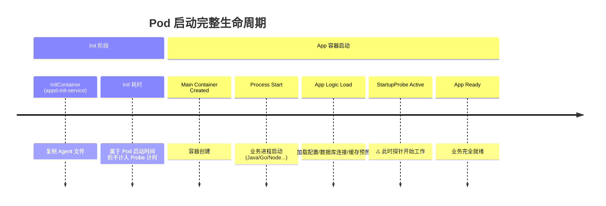

# GKE Explorer: 探针配置最佳实践指南

本文档基于您的 Deployment 模板 (`{{apiName}}-{{apiVersion}}-deployment`)，为您提供一套可落地的 Pod 启动与存活探针（Probe）配置方案。

## 1. 核心概念：启动流程与探针

要准确配置探针，首先必须理解 Pod 的启动时间线，特别是 `InitContainer` 与 `StartupProbe` 的关系。

### 1.1 启动时间线分析

在您的 Deployment 中，启动过程分为两个阶段：



> [!IMPORTANT]
> **关键认知**：
> `startupProbe`、`livenessProbe` 和 `readinessProbe` **只在主容器（Containers）启动后才开始计时**。
>
> *   **Init Container (appd-init-service)** 的耗时**不会**消耗 `startupProbe` 的时间配额。
> *   如果 Init Container 卡住（例如 `cp -r` 极慢或失败），Pod 状态会停留在 `Init:0/1`，此时主容器还没创建，探针根本还没开始工作。
> *   因此，**探针配置无需考虑 Init Container 的耗时**。

### 1.2 探针职责矩阵

| 探针类型 | 关键参数 | 职责 | 失败后果 | 建议配置原则 |
| :--- | :--- | :--- | :--- | :--- |
| **Startup** | `failureThreshold` | **保护慢启动**。给应用足够的时间完成初始化（加载类、连接池等）。 | **重启容器** (Kill & Restart) | **宁大勿小**。覆盖 99% 的启动场景。 |
| **Readiness** | `periodSeconds` | **流量控制**。决定是否将 Pod IP 加入 Service 的 Endpoints。 | **切断流量** (Service 摘除) | **敏捷**。快速发现故障并切断流量。 |
| **Liveness** | `failureThreshold` | **死锁检测**。发现应用假死（进程在但无法处理请求）。 | **重启容器** (Kill & Restart) | **保守**。避免因短暂波动导致的误杀。 |

---

## 2. 第一步：测量真实启动时间 (The Metric)

在设置参数之前，我们需要知道应用的“真实启动耗时”。这不仅仅是进程启动的时间，而是**业务逻辑完全加载完成，能够响应健康检查**的时间。

### 2.1 测量方法：裸启动测试 (Bare Metal Start)

我们推荐使用**“移除探针法”**进行一次基准测试。这能避免探针本身的干扰（如配置过紧导致的反复重启）。

**操作步骤：**

1.  **创建测试 Deployment**：复制现有的 Deployment YAML。
2.  **移除探针**：注释掉 `startupProbe`, `readinessProbe`, `livenessProbe` 部分。
3.  **部署并观察**：使用提供的脚本测量从 `ContainerStarted` 到 `Health Check 200 OK` 的时间。

> [!TIP]
> 也就是说，我们测量的不是 `Init` 的时间，而是主容器从 **Process Started** -> **Ready** 的时长。

### 2.2 测量脚本 (measure_startup.sh)

请在目录中找到并运行 `measure_startup.sh`（见配套文件）。

```bash
# 用法示例
./measure_startup.sh <pod-name> <health-check-port> <health-check-path>
```

假设测量结果如下（示例）：
*   最快启动: 15s
*   平均启动: 25s
*   最慢启动 (P99): 40s

---

## 3. 第二步：参数计算公式 (The Math)

基于测量出的 **P99（最慢启动时间）**，我们可以科学地计算出推荐参数。

### 3.1 StartupProbe：保护启动

目标：确保即使在最慢的情况下，应用也有足够的时间启动，同时留有安全冗余（Buffer）。

*   **Period (探测间隔)**: 建议固定为 **10s**。如果设置太短（如 1s），会增加 CPU 消耗且无必要。
*   **Target Duration (目标保护时长)** = `P99启动时间` × `1.5` (安全系数)。
*   **FailureThreshold (失败阈值)** = `Target Duration` / `Period`。

> **示例计算**：
> *   P99 启动时间 = 40s
> *   安全保护时长 = 40s × 1.5 = 60s
> *   Period = 10s
> *   **FailureThreshold** = 60 / 10 = **6**

### 3.2 ReadinessProbe：敏捷上线

目标：应用一旦 Ready，尽快切入流量；运行中一旦异常，尽快切断流量。

*   **InitialDelay**: 建议设为 **0** 或极小值（如 5s）。因为 StartupProbe 成功后意味着应用已经 Ready，无需再次强制等待。
*   **Period**: **5s - 10s**。
*   **FailureThreshold**: **3** 次。
*   **Timeout**: **1s - 3s**。不要太长，如果健康检查 3 秒都不回，说明服务负载极高，不应再接流量。

### 3.3 LivenessProbe：兜底防线

目标：只有在应用彻底死锁（Deadlock）时才重启。

*   **InitialDelay**: **0**。StartupProbe 成功后接管，天然不需要 Delay。
*   **Period**: **10s - 20s**。
*   **FailureThreshold**: **3 - 5** 次。
*   **Timeout**: **5s**。给它多一点宽容度，避免因 GC 或瞬时高负载导致的重启。

---

## 4. 最佳实践配置模板

将上述逻辑应用到您的 `deployment.yaml` 中：

### 4.1 场景 A：普通 Java/Go 应用 (启动耗时 < 60s)

```yaml
      # 启动探针：核心是为了给应用 "买时间"
      startupProbe:
        httpGet:
          scheme: HTTPS
          path: /{{apiName}}/{{minorVersion}}/.well-known/health
          port: {{port}}
        periodSeconds: 10
        timeoutSeconds: 3
        failureThreshold: 12  # 提供 10 * 12 = 120s 的启动窗口，足够应对大多数慢启动
        successThreshold: 1

      # 就绪探针：核心是 "敏捷"
      readinessProbe:
        httpGet:
          scheme: HTTPS
          path: /{{apiName}}/{{minorVersion}}/.well-known/health # 💡 建议：尽量使用轻量接口
          port: {{port}}
        initialDelaySeconds: 0 # Startup 成功后立即开始
        periodSeconds: 5       # 每 5 秒检查一次
        timeoutSeconds: 2      # 超时 2 秒即视为一次失败
        failureThreshold: 3    # 连续 3 次失败则摘除流量

      # 存活探针：核心是 "稳重"
      livenessProbe:
        httpGet:
          scheme: HTTPS
          path: /{{apiName}}/{{minorVersion}}/.well-known/health
          port: {{port}}
        initialDelaySeconds: 0

结论：这个设置是合理的，能够满足您的需求。

这里有一个核心概念需要澄清：timeoutSeconds 并不需要覆盖整个应用的启动时间。

为什么是合理的？
Kubernetes 的 StartupProbe 是通过 “多次重试” 来覆盖启动时间的，而不是通过“单次超长等待”。

让我们拆解一下您的场景：

总窗口期 (Total Window)：
您有 12次机会 (failureThreshold: 12)。
每 10秒 试一次 (periodSeconds: 10)。
这意味着：只要您的应用在 120秒 (12 * 10s) 内启动完成，就没有问题。
单次探测 (Single Probe)：
timeoutSeconds: 3 意味着：Kubelet 发起一个 HTTP 请求，如果 3秒内 没收到回复，就记为 “1次失败”。
关键点：失败了没事！我们还有 11 次机会。
模拟应用启动过程
假设您的应用需要 40秒 才能启动完成。在这 40秒内，应用可能完全不响应网络请求（或者响应极慢）。这里的流程是这样的：

T=0s: 探针第 1 次探测。应用在忙着加载各类 Bean，没处理请求。
结果：3秒后超时。
计数：失败 1 次 (还剩 11 次)。
T=10s: 探针第 2 次探测。应用还在忙，甚至连端口都没监听。
结果：Connection Refused (瞬间失败)。
计数：失败 2 次 (还剩 10 次)。
T=20s: ...... 失败 3 次。
T=30s: ...... 失败 4 次。
T=40s: 应用终于启动好了！端口打开了，逻辑加载完了。
T=50s: 探针第 6 次探测。
结果：应用在 200ms 内返回了 HTTP 200 OK。
最终结果：StartupProbe 成功！Pod 被标记为 Ready，进入正常运行。
什么时候 timeoutSeconds: 3 会有问题？
只有一种情况会导致问题：您的应用“已经启动好了”，但是哪怕处理一个最简单的 /health 请求，也需要死死卡住超过 3秒。

如果 /health 接口只是简单返回 "OK"，通常只需要几毫秒。
如果 /health 接口里写了复杂的数据库查询，导致每次都要查 5秒钟数据库才能回包，那就会永远超时，导致 Pod 起不来。
这就是为什么我们建议：健康检查接口一定要轻量。
总结建议
FailureThreshold (12次)：这是给您“加载业务逻辑”的时间（120秒）。
TimeoutSeconds (3秒)：这是要求您的健康检查接口“反应要快”，不要卡顿。
所以，只要您的应用最终能在 120秒内启动完成，并且启动后的 /health 接口响应速度正常（<3s），这个配置就是安全的
```
### 4.2 场景 B：慢启动/重资源应用 (启动耗时 > 2分钟)

例如需要加载大量缓存或模型的 AI 服务。

*   **StartupProbe**: 增加 `failureThreshold`。
    *   例如需要 5 分钟：`period=10s`, `failureThreshold=30` (300s)。
    *   **不要**增加 `timeoutSeconds`。应用慢是因为在处理逻辑，而不是单次 HTTP 请求慢。

---

## 5. 深度解析 (Deep Dive)

### 5.1 核心释疑：单次超时(Timeout) vs 启动窗口(Window)

很多用户担心：*"我的应用启动要 1分钟，但 `timeoutSeconds` 只有 3秒，会不会有问题？"*

**答案：完全没问题。**

Kubernetes 的 StartupProbe 是通过 **“多次重试”** 来覆盖启动时间的。

*   **FailureThreshold (12次) × Period (10s) = 120秒**：这是给应用的**启动预算**。只要在这 120秒内任何时候启动完成，都是成功的。
*   **TimeoutSeconds (3秒)**：这是对**健康检查接口响应速度**的要求。
    *   在启动期间（前 119秒），Probe 请求超时或被拒绝都没关系，这只消耗“重试次数”。
    *   一旦应用启动完成，Probe 请求应该在 3秒内迅速返回。如果您的 `/health` 接口逻辑太重（如执行长耗时 SQL）导致永远超过 3秒，探针才会永远失败。

### 5.2 Java 应用的时间账单：Spring 与 APPD

您可能会在日志中看到：
`Root WebApplicationContext: initialization completed in 8000 ms`

**问：这 8000ms 算在哪里？**

**答：这完全属于主容器启动时间，必须包含在 `startupProbe` 的预算内。**

让我们看一个典型的 Java + AppDynamics (APPD) 应用启动时间线：

```mermaid
gantt
    dateFormat  s
    axisFormat  %s
    title Java 应用真实启动耗时分解

    section 阶段
    JVM 初始化 (类加载)      :active, jvm, 0, 5s
    APPD Agent 注入/连接     :crit, appd, 5, 15s
    Spring Context Init     :active, spring, 15, 23s
    Tomcat/Undertow 启动     :server, 23, 26s
    应用完全 Ready           :milestone, ready, 26, 0s
```



1.  **JVM Start**: Java 虚拟机本身的启动成本。
2.  **APPD Agent Overhead**: **这是容易被忽视的大头**。Agent 需要连接 Controller、下载配置、修改字节码（Instrumentation）。这通常会增加 10% - 30% 的启动耗时。
3.  **Spring Init (8000ms)**: 这是日志里打印的时间，**它只是总耗时的一部分**。
4.  **Web Server Start**: 端口终于被监听，此时 Probe 才能连上。

**结论**：
如果日志显示 Spring 启动用了 8秒，您的**真实端到端启动时间**（从 Pod Created 到 Ready）可能高达 **20-30秒**。
因此，配置 `startupProbe` 时，**不要只参考 Spring 的启动日志**，务必使用 `measure_startup.sh` 脚本测量的**真实总时长**。

例如需要加载大量缓存或模型的 AI 服务。

*   **StartupProbe**: 增加 `failureThreshold`。
    *   例如需要 5 分钟：`period=10s`, `failureThreshold=30` (300s)。
    *   **不要**增加 `timeoutSeconds`。应用慢是因为在处理逻辑，而不是单次 HTTP 请求慢。HTTP 请求本身应该快速返回（即使返回 503）。

---

## 5. 常见问题解答 (FAQ)

### Q1: Init Container 执行慢会导致 Probe 失败重启吗？
**不会。**
如果是 `appd-init-service` 复制文件花了 5 分钟，Pod 状态会一直是 `Init:0/1`。此时主容器还没启动，Kubelet 不会执行任何 Probe，因此也不会触发 Probe 失败重启。
*注：如果 Init Container 崩溃退出，那是 Pod 的 RestartPolicy 控制的，与 Probe 无关。*

### Q2: 既然有了 StartupProbe，还需要 InitialDelaySeconds 吗？
**基本不需要。**
在 Kubernetes v1.18+ 引入 `startupProbe` 后，它就是用来替代“通过预估 `initialDelaySeconds` 来等待启动”这种笨办法的。
推荐做法：
*   `startupProbe`: 配置足够的 FailureThreshold。
*   `liveness/readiness`: `initialDelaySeconds: 0`。

### Q3: 为什么我的 Probe 总是超时 (Timeout)？
检查以下几点：
1.  **资源限制 (CPU throttling)**: 启动阶段 CPU 需求大，如果 `resources.limits.cpu` 设置过小，应用响应极慢。
2.  **依赖级联**: 健康检查接口是否去连了数据库？如果数据库慢，探针就慢。推荐健康检查**仅检查应用本身状态**，或者用独立的 `/ready` 接口检查依赖，`/live` 接口仅检查进程。

### Q4: 如何处理 "配置加载" 对启动的影响？
如果应用需要拉取远程配置（如 Spring Cloud Config），这属于“业务启动逻辑”。
**策略**：这会计入 StartupProbe 的时间。因此需要测量这一段耗时，并包含在 StartupProbe 的 `failureThreshold` 缓冲中。

---

## 6. 总结：平台化建议

如果您要为用户提供自助配置，建议遵循以下流程：

1.  **Default (默认值)**:
    *   Startup: 120s (10s * 12) —— 覆盖绝大多数应用。
    *   Liveness: 3次 * 20s —— 足够宽容。
2.  **Override (自定义)**:
    *   允许用户覆盖 `failureThreshold`（针对慢启动应用）。
    *   允许用户覆盖 `path`（针对自定义健康检查路径）。
3.  **Validate (校验)**:
    *   禁止用户将 `timeoutSeconds` 设得过大（如 >10s），这会掩盖系统性能问题。

---

## 7. 附录：StartupProbe 详细时序分析

### 7.1 探针失败场景详细拆解（基于您的配置）

让我们用您的实际配置来拆解 StartupProbe 的工作机制：

**配置参数**：
```yaml
startupProbe:
  httpGet:
    scheme: HTTPS
    path: /{{apiName}}/{{minorVersion}}/.well-known/health
    port: {{port}}
  periodSeconds: 10        # 每 10 秒探测一次
  timeoutSeconds: 3        # 单次探测超时时间 3 秒
  failureThreshold: 12     # 允许失败 12 次
  successThreshold: 1      # 成功 1 次即通过
```

**总启动窗口 = 10s × 12 = 120秒**

---

### 7.2 场景 A：正常启动（应用耗时 80 秒）

假设您的应用需要 80 秒才能完全启动并响应健康检查。

```
T = 0s:  探针第 1 次探测
         ├─ Kubelet 发起 HTTPS 请求到 /health
         ├─ 应用未启动，端口未监听
         ├─ 连接被拒绝（Connection Refused）
         └─ 失败计数: 1/12

T = 10s: 探针第 2 次探测
         ├─ 应用仍在加载 Spring Context
         ├─ 端口未监听，连接被拒绝
         └─ 失败计数: 2/12

T = 20s: 探针第 3 次探测
         ├─ 应用正在初始化数据库连接池
         ├─ 端口未监听，连接被拒绝
         └─ 失败计数: 3/12

T = 30s: 探针第 4 次探测
         ├─ 应用正在加载 APPD Agent
         ├─ 端口未监听，连接被拒绝
         └─ 失败计数: 4/12

T = 40s: 探针第 5 次探测
         ├─ 应用端口刚刚打开，但业务逻辑未就绪
         ├─ 连接成功，但 /health 返回 503 Service Unavailable
         ├─ 响应时间: 50ms（在 3 秒超时内）
         └─ 失败计数: 5/12  ⚠️ 注意：即使响应快，返回非 200 也算失败

T = 50s: 探针第 6 次探测
         ├─ 应用仍在预热缓存
         ├─ /health 返回 503
         ├─ 响应时间: 80ms
         └─ 失败计数: 6/12

T = 60s: 探针第 7 次探测
         ├─ 应用仍在加载配置
         ├─ /health 返回 503
         ├─ 响应时间: 120ms
         └─ 失败计数: 7/12

T = 70s: 探针第 8 次探测
         ├─ 应用几乎就绪
         ├─ /health 返回 503
         ├─ 响应时间: 200ms
         └─ 失败计数: 8/12

T = 80s: 应用完全启动！（端口监听 + 业务逻辑就绪）

T = 90s: 探针第 9 次探测
         ├─ Kubelet 发起 HTTPS 请求
         ├─ 应用返回 HTTP 200 OK
         ├─ 响应时间: 150ms（远小于 3 秒超时）
         └─ ✅ 探针成功！Pod 进入 Ready 状态
```

**结论**：应用在 80 秒启动完成，探针在第 9 次（T=90s）成功，远未达到 12 次失败阈值。配置安全。

---

### 7.3 场景 B：健康检查接口响应慢（超时陷阱）

假设应用在 30 秒就启动完成了，但 `/health` 接口逻辑太重（例如查询数据库、调用下游服务），导致每次响应都需要 5 秒。

```
T = 0s:  探针第 1 次探测
         ├─ 应用未启动，连接被拒绝
         └─ 失败计数: 1/12

T = 10s: 探针第 2 次探测
         ├─ 应用未启动，连接被拒绝
         └─ 失败计数: 2/12

T = 20s: 探针第 3 次探测
         ├─ 应用未启动，连接被拒绝
         └─ 失败计数: 3/12

T = 30s: 应用启动完成！（但 /health 接口逻辑太重）

T = 40s: 探针第 4 次探测
         ├─ Kubelet 发起请求
         ├─ 应用开始处理 /health 请求（查询数据库...）
         ├─ 3 秒后，Kubelet 超时断开连接
         ├─ 应用在第 5 秒才返回 200（但 Kubelet 已经放弃了）
         └─ 失败计数: 4/12  ⚠️ 超时视为失败

T = 50s: 探针第 5 次探测
         ├─ 同样的问题：应用需要 5 秒处理
         ├─ Kubelet 在 3 秒后超时
         └─ 失败计数: 5/12

T = 60s: 探针第 6 次探测 -> 超时 -> 失败计数: 6/12
T = 70s: 探针第 7 次探测 -> 超时 -> 失败计数: 7/12
T = 80s: 探针第 8 次探测 -> 超时 -> 失败计数: 8/12
T = 90s: 探针第 9 次探测 -> 超时 -> 失败计数: 9/12
T = 100s: 探针第 10 次探测 -> 超时 -> 失败计数: 10/12
T = 110s: 探针第 11 次探测 -> 超时 -> 失败计数: 11/12
T = 120s: 探针第 12 次探测 -> 超时 -> 失败计数: 12/12

T = 120s+: ❌ failureThreshold 达到 12，容器被 Kill 并重启
```

**结论**：应用明明已经启动好了，但因为健康检查接口响应太慢（>3秒），导致探针永远超时，最终触发重启。这就是为什么 `/health` 接口必须轻量。

---

### 7.4 场景 C：配置不足（failureThreshold 太小）

假设您错误地配置了 `failureThreshold: 5`（而不是 12），应用启动需要 80 秒。

```
T = 0s:  探针第 1 次探测 -> 连接被拒绝 -> 失败计数: 1/5
T = 10s: 探针第 2 次探测 -> 连接被拒绝 -> 失败计数: 2/5
T = 20s: 探针第 3 次探测 -> 连接被拒绝 -> 失败计数: 3/5
T = 30s: 探针第 4 次探测 -> 连接被拒绝 -> 失败计数: 4/5
T = 40s: 探针第 5 次探测 -> 连接被拒绝 -> 失败计数: 5/5

T = 40s+: ❌ failureThreshold 达到 5，容器被 Kill 并重启
         （应用本来在 T=80s 就能启动好，但没机会了）
```

**结论**：启动窗口（10s × 5 = 50秒）小于应用真实启动时间（80秒），导致应用永远无法启动，陷入重启循环。

---

### 7.5 关键时间节点总结

在您的配置下（`periodSeconds: 10`, `timeoutSeconds: 3`, `failureThreshold: 12`）：

| 时间维度 | 作用 | 您的配置值 | 说明 |
|---------|------|-----------|------|
| **启动窗口** | 给应用"买时间" | 10s × 12 = **120秒** | 应用必须在 120 秒内启动完成 |
| **探测间隔** | 重试频率 | **10秒** | 每 10 秒尝试一次 |
| **单次超时** | 接口响应要求 | **3秒** | 每次 /health 请求必须在 3 秒内返回 200 |
| **失败容忍** | 重试次数 | **12次** | 允许失败 12 次，第 13 次失败才重启 |

**三个关键认知**：
1. **启动窗口（120秒）** 是给应用"加载业务逻辑"的时间（Spring 初始化、数据库连接、缓存预热等）。
2. **单次超时（3秒）** 是要求 `/health` 接口"反应要快"，不要在接口里做重逻辑。
3. **失败次数（12次）** 是缓冲机制，允许应用在启动期间多次失败，只要最终成功即可。

**配置是否合理？**
- 如果您的应用启动耗时 < 120秒，且 `/health` 接口响应 < 3秒 → ✅ 配置安全
- 如果应用启动耗时 > 120秒 → ⚠️ 需要增加 `failureThreshold`（例如改为 18，提供 180秒窗口）
- 如果 `/health` 接口响应 > 3秒 → ❌ 需要优化接口逻辑，而不是增加 `timeoutSeconds`
