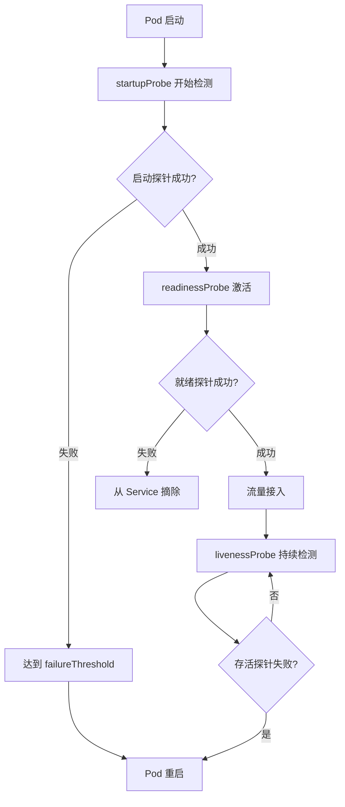
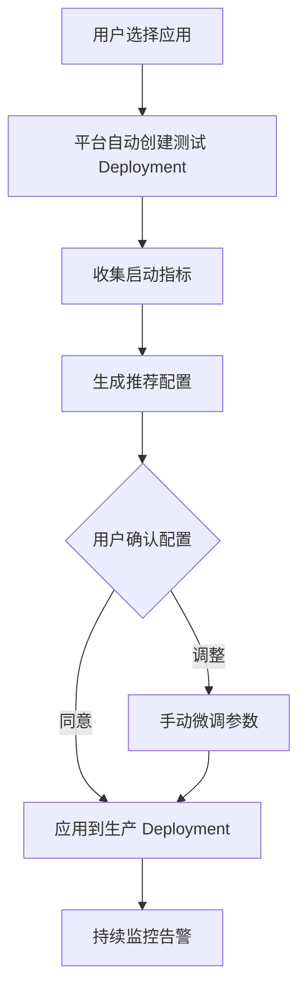

# GKE Pod 探针配置最佳实践指南

## 问题分析

在 GKE 中配置 `startupProbe`、`readinessProbe` 和 `livenessProbe` 时，需要基于实际应用启动时间和响应特性来设定参数。核心挑战在于：

1. 不同应用启动时间差异大
1. 探针配置不当导致 Pod 频繁重启或流量过早接入
1. 需要为平台用户提供标准化的测量和配置方法

-----

## 探针配置策略

### 探针职责划分

|探针类型              |主要职责   |典型场景         |
|------------------|-------|-------------|
|**startupProbe**  |处理慢启动应用|应用初始化时间超过 30s|
|**readinessProbe**|控制流量接入 |判断应用是否准备好接收请求|
|**livenessProbe** |检测死锁/假死|应用卡死但进程未退出   |

### 探针执行时序



-----

## 测量方案设计

### 方案 1：裸启动测量法（推荐）

#### 步骤说明


#### 实施步骤

**1. 准备测试 Deployment 配置**

```yaml
apiVersion: apps/v1
kind: Deployment
metadata:
  name: app-startup-test
  namespace: default
spec:
  replicas: 5  # 多副本获取统计样本
  selector:
    matchLabels:
      app: startup-test
  template:
    metadata:
      labels:
        app: startup-test
    spec:
      containers:
      - name: app
        image: your-app-image:latest
        ports:
        - containerPort: 8080
        # 完全移除探针配置
        # startupProbe: {}
        # readinessProbe: {}
        # livenessProbe: {}
        env:
        - name: ENABLE_METRICS
          value: "true"
```

**2. 部署并监控启动过程**

```bash
# 部署测试 Deployment
kubectl apply -f test-deployment.yaml

# 实时监控 Pod 状态
kubectl get pods -l app=startup-test -w

# 查看详细事件
kubectl describe pods -l app=startup-test
```

**3. 收集启动时间数据**

```bash
#!/bin/bash
# collect-startup-metrics.sh

NAMESPACE="default"
LABEL="app=startup-test"

echo "Pod Name,Creation Time,Ready Time,Startup Duration (seconds)"

kubectl get pods -n $NAMESPACE -l $LABEL -o json | jq -r '
  .items[] | 
  select(.status.phase == "Running") |
  {
    name: .metadata.name,
    created: .metadata.creationTimestamp,
    ready: (.status.conditions[] | select(.type == "Ready" and .status == "True") | .lastTransitionTime),
    containers: .status.containerStatuses[0]
  } |
  select(.ready != null) |
  "\(.name),\(.created),\(.ready),\(
    ((.ready | fromdateiso8601) - (.created | fromdateiso8601))
  )"
'
```

**4. 分析启动指标**

```bash
# 执行收集脚本
./collect-startup-metrics.sh > startup-data.csv

# 计算统计值
awk -F',' 'NR>1 {sum+=$4; if($4>max) max=$4; if(min=="" || $4<min) min=$4} 
           END {print "Min:", min "s"; print "Max:", max "s"; 
                print "Avg:", sum/(NR-1) "s"}' startup-data.csv
```

-----

### 方案 2：健康检查端点测量法

为应用添加专门的启动阶段监控端点：

```go
// 示例：Go 应用中的启动状态追踪
package main

import (
    "net/http"
    "sync/atomic"
    "time"
)

var (
    startTime      = time.Now()
    isFullyStarted int32
)

func startupHandler(w http.ResponseWriter, r *http.Request) {
    elapsed := time.Since(startTime).Seconds()
    
    if atomic.LoadInt32(&isFullyStarted) == 1 {
        w.Header().Set("X-Startup-Duration", fmt.Sprintf("%.2f", elapsed))
        w.WriteHeader(http.StatusOK)
        fmt.Fprintf(w, "Fully started in %.2f seconds", elapsed)
    } else {
        w.WriteHeader(http.StatusServiceUnavailable)
        fmt.Fprintf(w, "Starting... (%.2f seconds)", elapsed)
    }
}

func main() {
    http.HandleFunc("/startup", startupHandler)
    http.HandleFunc("/health", healthHandler)
    
    // 模拟启动逻辑
    go func() {
        time.Sleep(15 * time.Second) // 实际初始化时间
        atomic.StoreInt32(&isFullyStarted, 1)
    }()
    
    http.ListenAndServe(":8080", nil)
}
```

**测量脚本**

```bash
#!/bin/bash
# measure-startup-endpoint.sh

POD_NAME=$1
NAMESPACE=${2:-default}
PORT=${3:-8080}

echo "Measuring startup time for pod: $POD_NAME"

START_TIME=$(date +%s)

while true; do
    RESPONSE=$(kubectl exec -n $NAMESPACE $POD_NAME -- \
               curl -s -o /dev/null -w "%{http_code}" \
               http://localhost:$PORT/startup)
    
    CURRENT_TIME=$(date +%s)
    ELAPSED=$((CURRENT_TIME - START_TIME))
    
    if [ "$RESPONSE" == "200" ]; then
        echo "Pod fully started in ${ELAPSED} seconds"
        
        # 获取应用报告的启动时间
        STARTUP_DURATION=$(kubectl exec -n $NAMESPACE $POD_NAME -- \
                          curl -s http://localhost:$PORT/startup | \
                          grep -oP '\d+\.\d+')
        echo "Application reported startup: ${STARTUP_DURATION}s"
        break
    fi
    
    echo "Still starting... (${ELAPSED}s elapsed, HTTP: $RESPONSE)"
    sleep 2
done
```

-----

## 探针参数计算公式

基于测量数据计算探针参数：

### startupProbe 配置

```yaml
startupProbe:
  httpGet:
    path: /health
    port: 8080
  initialDelaySeconds: 0  # startupProbe 建议从 0 开始
  periodSeconds: 5        # 检测间隔
  timeoutSeconds: 3       # 单次检测超时
  failureThreshold: 30    # 计算公式见下方
  successThreshold: 1     # 默认 1，不可修改
```

**failureThreshold 计算公式：**

```
failureThreshold = CEIL((最大启动时间 × 1.5) / periodSeconds) + 5
```

**示例计算：**

```bash
# 假设测量结果：
# 平均启动时间：25s
# 最大启动时间：40s
# P95 启动时间：35s

# 计算 failureThreshold
Max_Startup_Time=40
Safety_Factor=1.5
Period_Seconds=5
Buffer=5

FailureThreshold=$(echo "scale=0; (($Max_Startup_Time * $Safety_Factor) / $Period_Seconds) + $Buffer" | bc)
echo "推荐 failureThreshold: $FailureThreshold"  # 输出：17
```

### readinessProbe 配置

```yaml
readinessProbe:
  httpGet:
    path: /ready  # 就绪检查端点
    port: 8080
  initialDelaySeconds: 5  # startup 成功后的缓冲
  periodSeconds: 10       # 检测频率
  timeoutSeconds: 5       # 超时时间
  failureThreshold: 3     # 连续失败 3 次摘除流量
  successThreshold: 1     # 恢复流量需要 1 次成功
```

### livenessProbe 配置

```yaml
livenessProbe:
  httpGet:
    path: /health
    port: 8080
  initialDelaySeconds: 60      # 避免启动期间误杀
  periodSeconds: 10
  timeoutSeconds: 5
  failureThreshold: 3          # 保守设置
  successThreshold: 1
```

-----

## 平台化配置推荐方案

### 为用户提供的测量工具

#### 1. 自助测量脚本模板

```bash
#!/bin/bash
# platform-probe-advisor.sh

set -e

APP_NAME=$1
NAMESPACE=$2
REPLICAS=${3:-5}

if [ -z "$APP_NAME" ] || [ -z "$NAMESPACE" ]; then
    echo "Usage: $0 <app-name> <namespace> [replicas]"
    exit 1
fi

echo "===================================="
echo "GKE Probe Configuration Advisor"
echo "===================================="
echo "App: $APP_NAME"
echo "Namespace: $NAMESPACE"
echo "Test Replicas: $REPLICAS"
echo ""

# 1. 备份现有配置
echo "Step 1: Backing up current deployment..."
kubectl get deployment $APP_NAME -n $NAMESPACE -o yaml > ${APP_NAME}-backup.yaml

# 2. 创建无探针的测试配置
echo "Step 2: Creating test deployment without probes..."
kubectl get deployment $APP_NAME -n $NAMESPACE -o yaml | \
  sed '/startupProbe:/,/successThreshold:/d' | \
  sed '/readinessProbe:/,/successThreshold:/d' | \
  sed '/livenessProbe:/,/successThreshold:/d' | \
  sed "s/replicas: .*/replicas: $REPLICAS/" > ${APP_NAME}-test.yaml

kubectl apply -f ${APP_NAME}-test.yaml

# 3. 等待所有 Pod 启动
echo "Step 3: Waiting for pods to start..."
kubectl wait --for=condition=Ready pod -l app=$APP_NAME -n $NAMESPACE --timeout=600s

# 4. 收集启动数据
echo "Step 4: Collecting startup metrics..."
cat > collect-metrics.jq << 'EOF'
.items[] | 
select(.status.phase == "Running") |
{
  name: .metadata.name,
  created: .metadata.creationTimestamp,
  ready: (.status.conditions[] | select(.type == "Ready" and .status == "True") | .lastTransitionTime)
} |
select(.ready != null) |
((.ready | fromdateiso8601) - (.created | fromdateiso8601))
EOF

STARTUP_TIMES=$(kubectl get pods -n $NAMESPACE -l app=$APP_NAME -o json | jq -f collect-metrics.jq)

# 5. 计算统计值
MIN=$(echo "$STARTUP_TIMES" | sort -n | head -1)
MAX=$(echo "$STARTUP_TIMES" | sort -n | tail -1)
AVG=$(echo "$STARTUP_TIMES" | awk '{sum+=$1} END {print sum/NR}')

echo ""
echo "===================================="
echo "Startup Time Analysis:"
echo "===================================="
echo "Minimum: ${MIN}s"
echo "Maximum: ${MAX}s"
echo "Average: ${AVG}s"

# 6. 生成推荐配置
PERIOD=5
STARTUP_FAILURE=$(echo "scale=0; (($MAX * 1.5) / $PERIOD) + 5" | bc)

cat > ${APP_NAME}-recommended-probes.yaml << EOF
# Recommended Probe Configuration for $APP_NAME
# Based on measured startup times (min: ${MIN}s, max: ${MAX}s, avg: ${AVG}s)

startupProbe:
  httpGet:
    path: /health  # 请根据实际端点修改
    port: 8080     # 请根据实际端口修改
  initialDelaySeconds: 0
  periodSeconds: $PERIOD
  timeoutSeconds: 3
  failureThreshold: $STARTUP_FAILURE
  successThreshold: 1

readinessProbe:
  httpGet:
    path: /ready   # 请根据实际端点修改
    port: 8080
  initialDelaySeconds: 5
  periodSeconds: 10
  timeoutSeconds: 5
  failureThreshold: 3
  successThreshold: 1

livenessProbe:
  httpGet:
    path: /health
    port: 8080
  initialDelaySeconds: $(echo "scale=0; $AVG + 30" | bc)
  periodSeconds: 10
  timeoutSeconds: 5
  failureThreshold: 3
  successThreshold: 1
EOF

echo ""
echo "===================================="
echo "Recommended Configuration:"
echo "===================================="
cat ${APP_NAME}-recommended-probes.yaml

echo ""
echo "===================================="
echo "Next Steps:"
echo "===================================="
echo "1. Review generated configuration: ${APP_NAME}-recommended-probes.yaml"
echo "2. Adjust health check paths and ports if needed"
echo "3. Apply configuration to deployment"
echo "4. Monitor pod stability after applying"
echo ""
echo "To restore original deployment:"
echo "kubectl apply -f ${APP_NAME}-backup.yaml"
```

#### 2. 平台集成方案

**用户界面配置向导：**



**平台 API 示例：**

```yaml
# platform-config-api.yaml
apiVersion: v1
kind: ConfigMap
metadata:
  name: probe-advisor-config
data:
  default-period: "5"
  safety-factor: "1.5"
  buffer-threshold: "5"
  test-replicas: "5"
  measurement-timeout: "600"
```

-----

## 验证与监控

### 验证探针配置

```bash
# 1. 应用新配置后监控 Pod 稳定性
kubectl rollout status deployment/$APP_NAME -n $NAMESPACE

# 2. 检查重启次数
kubectl get pods -n $NAMESPACE -l app=$APP_NAME \
  -o jsonpath='{range .items[*]}{.metadata.name}{"\t"}{.status.containerStatuses[0].restartCount}{"\n"}{end}'

# 3. 查看探针失败事件
kubectl get events -n $NAMESPACE --field-selector involvedObject.name=$POD_NAME \
  | grep -E 'Liveness|Readiness|Startup'
```

### Prometheus 监控指标

```yaml
# ServiceMonitor for probe metrics
apiVersion: monitoring.coreos.com/v1
kind: ServiceMonitor
metadata:
  name: probe-metrics
spec:
  selector:
    matchLabels:
      app: your-app
  endpoints:
  - port: metrics
    interval: 30s
    path: /metrics
```

**关键指标查询：**

```promql
# Pod 重启率
rate(kube_pod_container_status_restarts_total[5m])

# 探针失败次数
sum(rate(prober_probe_total{result="failed"}[5m])) by (pod)

# 平均启动时间
histogram_quantile(0.95, 
  rate(container_start_duration_seconds_bucket[5m])
)
```

-----

## 注意事项

### 关键配置原则

1. **startupProbe 优先级最高**

- 启动探针成功前，其他探针不会执行
- 失败后直接重启容器，需要设置足够大的 `failureThreshold`

1. **避免过度敏感配置**
   
   ```yaml
   # ❌ 错误示例：过于激进
   startupProbe:
     periodSeconds: 1
     failureThreshold: 10  # 只给 10 秒启动时间
   
   # ✅ 正确示例：合理冗余
   startupProbe:
     periodSeconds: 5
     failureThreshold: 30  # 给 150 秒启动时间
   ```
1. **不同环境差异化配置**
   
   ```yaml
   # 开发环境：宽松配置便于调试
   dev:
     startupProbe:
       failureThreshold: 60
   
   # 生产环境：基于实测数据配置
   prod:
     startupProbe:
       failureThreshold: 30
   ```
1. **健康检查端点设计**

- `/health`：基本存活检查（进程、端口）
- `/ready`：业务就绪检查（数据库连接、依赖服务）
- `/startup`：启动阶段检查（初始化完成度）

### 常见问题排查

```bash
# Pod 频繁重启
kubectl describe pod $POD_NAME | grep -A 10 "Liveness probe failed"

# 流量未接入
kubectl describe pod $POD_NAME | grep -A 10 "Readiness probe failed"

# 启动超时
kubectl logs $POD_NAME --previous  # 查看上次失败日志
```

-----

## 总结

**最佳实践流程：**

1. **测量阶段**：移除探针，多副本部署，收集真实启动时间
1. **计算阶段**：基于 P95 或最大值计算探针参数，增加 50% 安全系数
1. **验证阶段**：小规模应用配置，监控 Pod 稳定性和重启率
1. **优化阶段**：根据生产环境反馈微调参数

**平台化建议：**

- 提供自动化测量脚本和配置生成工具
- 在用户部署前强制要求完成探针配置测试
- 建立不同应用类型的配置模板库（如：快速启动型、慢启动型、资源密集型）
- 集成监控告警，自动检测探针配置不当的情况​​​​​​​​​​​​​​​​

# gemini
这是一个非常棒的工程化思考。作为一个平台方，仅仅告诉用户“配置合理的值”是不够的，提供一套**“测量 + 计算”的标准流程（SOP）**才是解决问题的关键。
你的思路（去掉探针 -> 启动 -> 测量时间 -> 反推参数）完全正确，这正是**基准测试（Benchmarking）**的核心逻辑。
为了帮助你建立这个平台化的最佳实践，我将这个过程拆解为三个阶段：测量阶段、计算阶段、配置阶段。你可以将此整理成文档或工具提供给你的用户。
第一阶段：测量（如何获取真实的启动数据）
用户的痛点在于“凭感觉”设置。我们需要提供一种方法，让他们看到“我的应用到底多久才 ready”。
方案 A：日志分析法（被动测量，最简单）
如果你的平台有集中的日志系统（如 Cloud Logging, ELK），这是成本最低的方式。
 * 动作：用户部署应用，暂时不配置 livenessProbe 和 readinessProbe（或者配置得非常宽容）。
 * 观察：查看应用日志。
   * 找到容器启动的时间戳（T1）。
   * 找到应用输出类似 Server started on port 8080 或 Application ready 的日志时间戳（T2）。
 * 计算：启动耗时 = T2 - T1。
方案 B：黑盒探测法（主动测量，推荐作为工具提供）
这是你提到的思路的标准化版本。你可以提供一个简单的 Shell 脚本，让用户在开发/测试环境运行。
原理：启动一个没有探针的 Pod，然后在侧边容器（Sidecar）或本机通过 kubectl exec 循环请求接口，直到成功，记录耗时。
给用户的操作指南（脚本逻辑）：
# 1. 启动一个单次测试的 Pod (假设用户镜像为 my-app:v1)
kubectl run startup-benchmark --image=my-app:v1 --restart=Never --env="PORT=8080"

# 2. 等待容器创建并运行
echo "Waiting for pod to run..."
kubectl wait --for=condition=Ready pod/startup-benchmark --timeout=60s

# 3. 开始计时并循环探测
start_time=$(date +%s)
echo "Start probing internal application..."

# 使用 kubectl exec 进入容器内部探测 (避免 Service/Ingress 干扰)
# 每秒 curl 一次 localhost，直到返回 200
kubectl exec startup-benchmark -- /bin/sh -c '
    count=0
    while true; do
        if curl -s -o /dev/null -w "%{http_code}" http://localhost:8080/healthz | grep -q "200"; then
            break
        fi
        sleep 1
        count=$((count+1))
        echo "Waiting... ($count sec)"
    done
'

end_time=$(date +%s)
duration=$((end_time - start_time))

echo "------------------------------------------------"
echo "✅ 应用实际启动耗时 (Actual Startup Time): ${duration} 秒"
echo "------------------------------------------------"

# 4. 清理
kubectl delete pod startup-benchmark

> 注意：这个脚本测出的是**“应用逻辑初始化完成”**的时间。这是设置 startupProbe 的黄金标准。
> 
第二阶段：计算（如何将时间转化为参数）
得到“实际启动耗时”后，不能直接填入配置，需要加上安全缓冲（Buffer）。
1. StartupProbe（启动探针）- 最关键
这是用来保护慢启动应用的。如果这个设置错了，Pod 会陷入 CrashLoopBackOff。
 * 目标：覆盖“最坏情况下的启动时间”。
 * 公式建议：
   * failureThreshold * periodSeconds ≥ 实际启动耗时 × 1.5 (或 2.0)
 * 推荐配置策略：
   * periodSeconds: 固定为 10s（不用太频繁，减少 kubelet 压力）。
   * failureThreshold: Math.ceil((实际启动耗时 × 1.5) / 10)。
> 示例：如果测出来启动要 60秒。
> 安全时间 = 60 * 1.5 = 90秒。
> 设置：periodSeconds=10, failureThreshold=9。
> 
2. ReadinessProbe（就绪探针）
 * 目标：检测应用是否还能响应流量。启动后，它应该快速响应。
 * 配置建议：
   * initialDelaySeconds: 设置为 实际启动耗时（也就是让 StartupProbe 先跑，Readiness 稍微等一下）。
   * periodSeconds: 5s - 10s。
   * timeoutSeconds: 1s - 3s。
     * 重点：这里不要设置太长。如果你的 API 超过 3秒才回健康检查，说明系统负载太高了，应该把流量切走，而不是让用户请求卡住。
3. LivenessProbe（存活探针）
 * 目标：检测死锁。千万不要在启动阶段触发它（这是 StartupProbe 的工作）。
 * 配置建议：
   * initialDelaySeconds: 0 (如果有 StartupProbe，这里设为0即可，因为 StartupProbe 成功后才会开始 LivenessProbe)。
   * timeoutSeconds: 1s - 5s。
   * failureThreshold: 3。
     * 这意味着：连续 3 次，每次超时 5 秒，Pod 才会重启。
第三阶段：平台化最佳实践（如何落地）
针对你们平台用户，你可以给出以下三条建议或检查清单：
1. 区分“启动慢”和“响应慢”
> "如果你的应用启动需要加载 5GB 的模型数据，请增加 startupProbe 的 failureThreshold，而不是增加 timeoutSeconds。"
> 
2. Timeout 陷阱
> "对于所有探针，timeoutSeconds 建议保持较小（如 1s-5s）。如果健康检查接口本身需要处理数据库连接且经常超时，请修复代码逻辑（例如由独立线程更新健康状态变量），而不是无限制增加超时时间。"
> 
3. 渐进式调整法（Safe Rollout）
如果不确定，建议用户采用**“宽进严出”**策略：
 * Day 1: 设置极其宽松的 startupProbe (如 5分钟)，观察监控中的 startup_probe_duration 指标（如果使用了 Prometheus）。
 * Day 2: 根据 P99 启动时间，收缩参数到合理范围。
总结用户的操作路径
作为平台方，你可以将上述逻辑浓缩为用户指引：
 * 自测：在本地或 Dev 环境使用“无探针模式”或“测试脚本”运行一次，记录App Ready时间。
 * 套用公式：
   * Startup Total Time = App Ready * 1.5
   * Startup Threshold = Startup Total Time / 10
 * 填表：
   * startupProbe: period=10, failureThreshold=[计算值]
   * readinessProbe: initialDelaySeconds=[App Ready], period=5, timeout=2
   * livenessProbe: period=10, timeout=2, failureThreshold=3
下一步建议
您是否需要我为您编写一个 Go 程序或 Python 脚本？您可以将其作为 CLI 工具分发给您的用户，自动执行“部署 -> 轮询 -> 计算建议值 -> 生成 YAML 片段”的整个流程。


