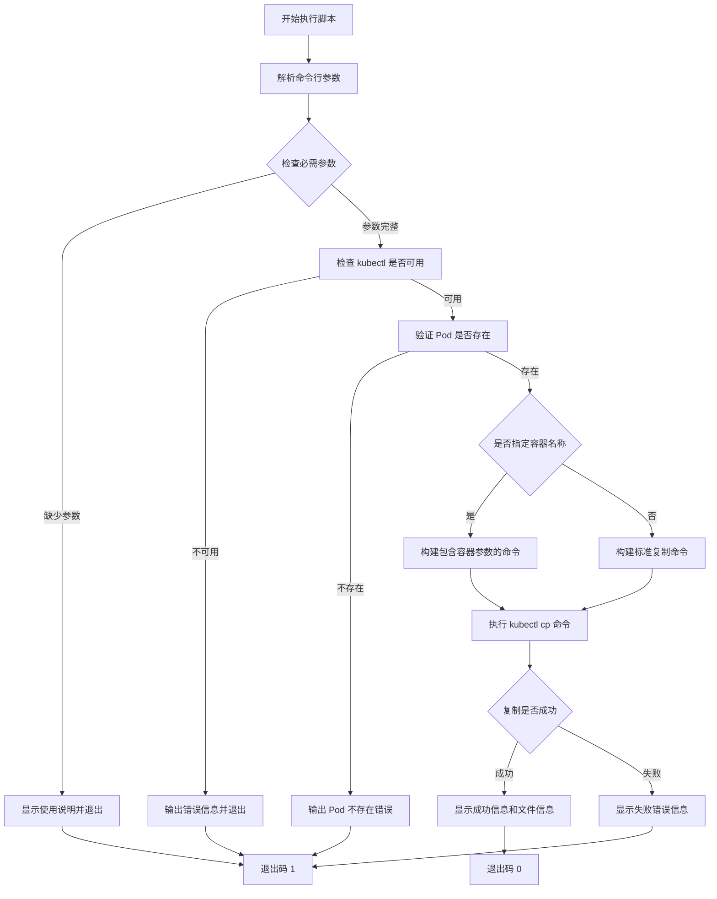

# 问题分析

需要创建一个 shell 脚本,用于从 Kubernetes Pod 容器中复制文件到本地。脚本需要支持通过命令行参数指定命名空间、Pod 名称和文件路径。

# 解决方案

## 脚本实现

```bash
#!/bin/bash

# 脚本名称: copy-pod-file.sh
# 功能: 从 Kubernetes Pod 复制文件到本地

# 显示使用说明
usage() {
    echo "Usage: $0 -n <namespace> -p <pod-name> -f <file-path> [-c <container-name>] [-o <output-path>]"
    echo ""
    echo "Options:"
    echo "  -n    Namespace (required)"
    echo "  -p    Pod name (required)"
    echo "  -f    File path in container (required)"
    echo "  -c    Container name (optional, if pod has multiple containers)"
    echo "  -o    Output path (optional, default: current directory)"
    echo ""
    echo "Example:"
    echo "  $0 -n default -p my-pod -f /opt/a.txt"
    echo "  $0 -n default -p my-pod -f /opt/a.txt -c my-container -o /tmp/a.txt"
    exit 1
}

# 初始化变量
NAMESPACE=""
POD_NAME=""
FILE_PATH=""
CONTAINER_NAME=""
OUTPUT_PATH=""

# 解析命令行参数
while getopts "n:p:f:c:o:h" opt; do
    case $opt in
        n)
            NAMESPACE="$OPTARG"
            ;;
        p)
            POD_NAME="$OPTARG"
            ;;
        f)
            FILE_PATH="$OPTARG"
            ;;
        c)
            CONTAINER_NAME="$OPTARG"
            ;;
        o)
            OUTPUT_PATH="$OPTARG"
            ;;
        h)
            usage
            ;;
        \?)
            echo "Invalid option: -$OPTARG" >&2
            usage
            ;;
    esac
done

# 检查必需参数
if [[ -z "$NAMESPACE" ]] || [[ -z "$POD_NAME" ]] || [[ -z "$FILE_PATH" ]]; then
    echo "Error: Missing required parameters"
    usage
fi

# 设置默认输出路径
if [[ -z "$OUTPUT_PATH" ]]; then
    OUTPUT_PATH="./$(basename "$FILE_PATH")"
fi

# 检查 kubectl 是否可用
if ! command -v kubectl &> /dev/null; then
    echo "Error: kubectl command not found"
    exit 1
fi

# 检查 Pod 是否存在
echo "Checking if pod exists..."
if ! kubectl get pod "$POD_NAME" -n "$NAMESPACE" &> /dev/null; then
    echo "Error: Pod '$POD_NAME' not found in namespace '$NAMESPACE'"
    exit 1
fi

# 构建 kubectl cp 命令
KUBECTL_CMD="kubectl cp"

if [[ -n "$CONTAINER_NAME" ]]; then
    KUBECTL_CMD="$KUBECTL_CMD -c $CONTAINER_NAME"
fi

KUBECTL_CMD="$KUBECTL_CMD $NAMESPACE/$POD_NAME:$FILE_PATH $OUTPUT_PATH"

# 执行复制操作
echo "Copying file from pod..."
echo "Command: $KUBECTL_CMD"

if eval "$KUBECTL_CMD"; then
    echo "Success: File copied to $OUTPUT_PATH"
    ls -lh "$OUTPUT_PATH"
    exit 0
else
    echo "Error: Failed to copy file"
    exit 1
fi
```

## 使用方法

### 1. 保存并授予执行权限

```bash
# 保存脚本
vim copy-pod-file.sh

# 添加执行权限
chmod +x copy-pod-file.sh
```

### 2. 基本使用示例

```bash
# 基本用法
./copy-pod-file.sh -n default -p my-pod -f /opt/a.txt

# 指定容器名称(多容器 Pod)
./copy-pod-file.sh -n default -p my-pod -f /opt/a.txt -c app-container

# 指定输出路径
./copy-pod-file.sh -n default -p my-pod -f /opt/a.txt -o /tmp/backup.txt

# 查看帮助信息
./copy-pod-file.sh -h
```

## 流程图



## 增强版脚本(可选)

如果需要更多功能,可以使用以下增强版:

```bash
#!/bin/bash

# 增强版: 支持批量复制和目录复制

usage() {
    echo "Usage: $0 -n <namespace> -p <pod-name> -f <file-path> [-c <container-name>] [-o <output-path>] [-d]"
    echo ""
    echo "Options:"
    echo "  -n    Namespace (required)"
    echo "  -p    Pod name (required)"
    echo "  -f    File or directory path in container (required)"
    echo "  -c    Container name (optional)"
    echo "  -o    Output path (optional)"
    echo "  -d    Copy directory recursively"
    echo "  -v    Verbose mode"
    exit 1
}

NAMESPACE=""
POD_NAME=""
FILE_PATH=""
CONTAINER_NAME=""
OUTPUT_PATH=""
IS_DIRECTORY=false
VERBOSE=false

while getopts "n:p:f:c:o:dvh" opt; do
    case $opt in
        n) NAMESPACE="$OPTARG" ;;
        p) POD_NAME="$OPTARG" ;;
        f) FILE_PATH="$OPTARG" ;;
        c) CONTAINER_NAME="$OPTARG" ;;
        o) OUTPUT_PATH="$OPTARG" ;;
        d) IS_DIRECTORY=true ;;
        v) VERBOSE=true ;;
        h) usage ;;
        \?) usage ;;
    esac
done

# 验证必需参数
if [[ -z "$NAMESPACE" ]] || [[ -z "$POD_NAME" ]] || [[ -z "$FILE_PATH" ]]; then
    echo "Error: Missing required parameters"
    usage
fi

# 设置输出路径
if [[ -z "$OUTPUT_PATH" ]]; then
    if [[ "$IS_DIRECTORY" == true ]]; then
        OUTPUT_PATH="./$(basename "$FILE_PATH")"
    else
        OUTPUT_PATH="./$(basename "$FILE_PATH")"
    fi
fi

# 检查 kubectl
if ! command -v kubectl &> /dev/null; then
    echo "Error: kubectl not found"
    exit 1
fi

# 验证 Pod 存在
[[ "$VERBOSE" == true ]] && echo "Verifying pod exists..."
if ! kubectl get pod "$POD_NAME" -n "$NAMESPACE" &> /dev/null; then
    echo "Error: Pod '$POD_NAME' not found in namespace '$NAMESPACE'"
    exit 1
fi

# 构建命令
CMD="kubectl cp"
[[ -n "$CONTAINER_NAME" ]] && CMD="$CMD -c $CONTAINER_NAME"
CMD="$CMD $NAMESPACE/$POD_NAME:$FILE_PATH $OUTPUT_PATH"

# 执行复制
[[ "$VERBOSE" == true ]] && echo "Executing: $CMD"
if eval "$CMD"; then
    echo "✓ Successfully copied to: $OUTPUT_PATH"
    ls -lh "$OUTPUT_PATH" 2>/dev/null || ls -lhd "$OUTPUT_PATH"
    exit 0
else
    echo "✗ Failed to copy file"
    exit 1
fi
```

# 注意事项

## 权限要求

- 确保当前用户有 kubectl 访问权限
- 需要对目标命名空间有 `get` 和 `exec` 权限
- 本地输出目录需要有写入权限

## 常见问题排查

### 1. Pod 有多个容器

```bash
# 列出 Pod 中的所有容器
kubectl get pod <pod-name> -n <namespace> -o jsonpath='{.spec.containers[*].name}'

# 使用 -c 参数指定容器
./copy-pod-file.sh -n default -p my-pod -f /opt/a.txt -c container-name
```

### 2. 文件不存在

```bash
# 先验证文件是否存在
kubectl exec -n <namespace> <pod-name> -- ls -la /opt/a.txt

# 或进入容器检查
kubectl exec -it -n <namespace> <pod-name> -- /bin/sh
```

### 3. 权限问题

```bash
# 检查当前用户权限
kubectl auth can-i get pods -n <namespace>
kubectl auth can-i create pods/exec -n <namespace>
```

## 最佳实践

1. **备份重要文件**: 复制前建议先备份本地同名文件
1. **验证完整性**: 复制后可使用 `md5sum` 或 `sha256sum` 验证文件完整性
1. **日志记录**: 生产环境建议添加日志记录功能
1. **错误处理**: 脚本已包含基本错误处理,可根据需要扩展​​​​​​​​​​​​​​​​