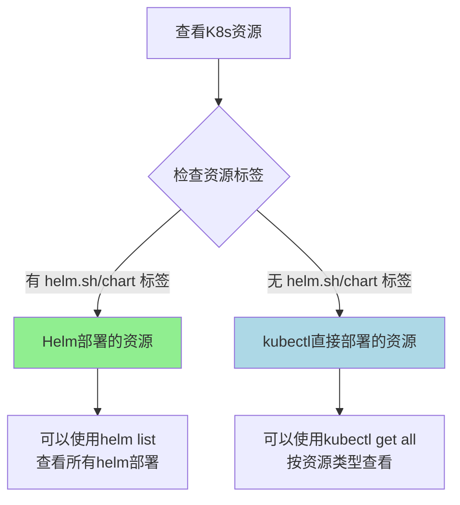

我的环境里面有使用kubectl apply -f deploy.yaml hpa.yaml service.yaml install 
也有使用heml 安装的资源?

那么我如何区分这些资源呢?
# Kubernetes 资源部署方式区分

我来帮你说明如何区分 kubectl 直接部署和 Helm 部署的资源。我会用 Mermaid 图表来可视化这个区分过程。

# Kubernetes 资源部署方式区分

## 查看方式



### 具体区分方法：

1. **通过标签查看**
```bash
# 查看某个资源的详细信息
kubectl describe pod <pod-name>
```
- Helm 部署的资源会包含以下标签：
  - `helm.sh/chart`
  - `app.kubernetes.io/managed-by: Helm`

2. **通过 Helm 命令查看**
```bash
# 列出所有 Helm 部署的 release
helm list -A
```

3. **查看特定命名空间的资源**
```bash
# 查看所有资源
kubectl get all -n <namespace>

# 查看资源的标签
kubectl get pods -n <namespace> --show-labels
```

### 最佳实践建议：
1. 为不同部署方式的资源使用不同的命名空间
2. 使用统一的标签系统
3. 记录部署方式的文档

这样的区分方法可以帮助你更好地管理和维护不同方式部署的资源。需要更详细的说明吗？

我来帮你写一个命令来过滤出所有使用 Helm 部署的 Deployment。

```bash
# 查看所有命名空间中使用 Helm 部署的 Deployment
kubectl get deployment -A -l "app.kubernetes.io/managed-by=Helm" --show-labels
```

或者更详细的信息：

```bash
# 使用自定义输出格式查看更多信息
kubectl get deployment -A -l "app.kubernetes.io/managed-by=Helm" -o custom-columns=NAMESPACE:.metadata.namespace,NAME:.metadata.name,CHART:.metadata.labels.\"helm\.sh/chart\",REVISION:.metadata.labels.\"helm\.sh/revision\"
```

这些命令的说明：
1. `-A`: 查看所有命名空间
2. `-l "app.kubernetes.io/managed-by=Helm"`: 过滤出 Helm 管理的资源
3. `--show-labels`: 显示所有标签（如果使用第一个命令）
4. `-o custom-columns`: 自定义输出格式（如果使用第二个命令）
   - 显示命名空间
   - 显示 Deployment 名称
   - 显示 Helm chart 名称
   - 显示 Helm revision 版本

如果你只想查看特定命名空间，可以用 `-n <namespace>` 替换 `-A`。

# lock 

我如果deployment里面有个configMap name = lockabc

我来帮你写命令来查找所有使用了特定 ConfigMap (lockabc) 的 Deployment。

```bash
# 查找所有命名空间中引用了 lockabc ConfigMap 的 Deployment

# 查找所有命名空间中在容器的 volumeMounts 中引用了 lockabc ConfigMap 的 Deployment
kubectl get deployments -A -o json | jq '.items[] | select(.spec.template.spec.containers[].volumeMounts[]?.name == "lockabc") | {namespace: .metadata.namespace, name: .metadata.name, containers: [.spec.template.spec.containers[] | select(.volumeMounts[]?.name == "lockabc") | .name]}'

```

这个命令会：
1. 获取所有 Deployment 的详细信息
2. 使用 jq 过滤出引用了 `lockabc` ConfigMap 的 Deployment
3. 同时检查两种常见的 ConfigMap 使用方式：
   - 作为 Volume 挂载
   - 作为环境变量来源

如果你想要更易读的输出格式，可以使用这个版本：

```bash
# 使用表格形式显示结果
# 显示更详细的信息，包括挂载点路径
kubectl get deployments -A -o json | jq '.items[] | select(.spec.template.spec.containers[].volumeMounts[]?.name == "lockabc") | {
  namespace: .metadata.namespace,
  deployment: .metadata.name,
  mounts: [.spec.template.spec.containers[] | select(.volumeMounts[]?.name == "lockabc") | {
    container: .name,
    mountPath: [.volumeMounts[] | select(.name == "lockabc") | .mountPath]
  }]
}'

```

注意：第二个命令可能无法捕获所有使用场景，因为 field-selector 的功能相对有限。如果需要完整的搜索，建议使用第一个带 jq 的命令。


```bash
kubectl get deployments --all-namespaces -o jsonpath='{range .items[*]}{.metadata.namespace}{"/"}{.metadata.name}{"\n"}{"  CPU Requests: "}{.spec.template.spec.containers[*].resources.requests.cpu}{"  CPU Limits: "}{.spec.template.spec.containers[*].resources.limits.cpu}{"\n"}{"  Memory Requests: "}{.spec.template.spec.containers[*].resources.requests.memory}{"  Memory Limits: "}{.spec.template.spec.containers[*].resources.limits.memory}{"\n"}{end}'
```
