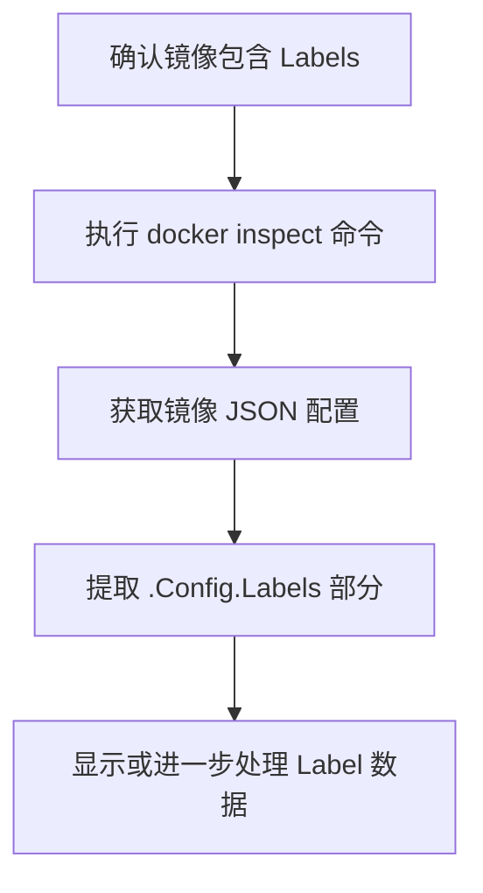
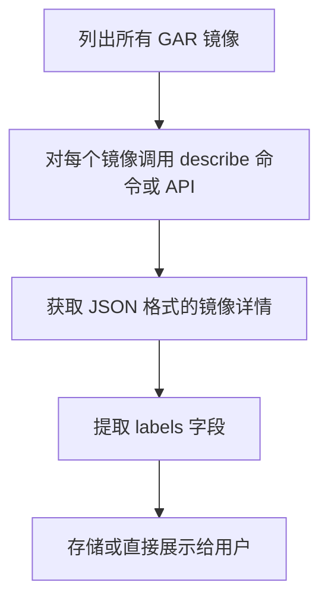

下面是关于使用 Labels 记录镜像元数据（如作者、源代码、JDK、基础镜像等）与依赖 Tags 进行版本控制之间的对比说明：

⸻

Tags 与 Labels 的作用对比

| 特性	Tags | 	Labels |
|---|---|---|
主要用途	标识镜像版本，决定镜像拉取与部署	存储扩展的元数据（作者、源码、构建信息等）
在部署中的作用	直接影响容器运行时拉取的镜像版本	不直接参与部署，仅用于记录和查询信息
管理方式	通过镜像名+标签形式直接指定	内嵌于镜像中，需要额外工具（如 docker inspect）提取
示例	myapp:1.0、myapp:latest	maintainer="John Doe"，jdk.version="11"


⸻

为什么建议使用 Labels 记录扩展元数据
	•	灵活性高
Labels 允许你以键值对的方式记录多种信息，如构建者、源码地址、JDK 版本、基础镜像等，不影响镜像的拉取与部署。
	•	信息扩展
Tags 主要用于版本管理，而 Labels 可为镜像提供额外的描述信息，便于后期审计、调试以及追溯构建过程。
	•	独立性
在发布与部署过程中，系统仅根据 Tags 拉取镜像，而 Labels 则可作为辅助信息存在。如果需要查询或统计这些信息，可以通过额外命令或 API 获取。

⸻

部署与 Registry 使用时的注意事项
	1.	部署调用
	•	Kubernetes Deployment 中通常只需指定镜像名称和 Tag，Labels 信息不会自动加入到 Pod 或 Deployment 配置中。
	•	如需利用 Labels 信息（比如在日志、监控中展示），需要额外的步骤（例如在构建流水线中解析并记录）。
	2.	推送到 GAR（Google Artifact Registry）
	•	GAR 会保留 Docker 镜像的 Labels，但在拉取镜像时仍主要依赖镜像的 Tag。
	•	如果需要获取 Labels 信息（如自动化审计），可通过 docker inspect 或调用 Registry 的 API 来检索。
	3.	如何获取 Labels
	•	使用命令：

docker inspect <image_name>:<tag>

你可以在返回的 JSON 数据中查找 Config.Labels 部分。

	•	在自动化流程中，可编写脚本或使用相关 API 来提取并处理这些信息。

⸻

示例：在 Dockerfile 中设置 Labels
```Dockerfile
FROM openjdk:11-jre-slim
LABEL maintainer="John Doe" \
      source="https://github.com/your-repo" \
      jdk.version="11" \
      base.image="openjdk:11-jre-slim"
```


⸻

Mermaid 流程图：镜像构建、推送与部署流程
```mermaid
graph TD;
    A[编写 Dockerfile (包含 LABEL)] --> B[构建 Docker 镜像];
    B --> C[镜像内嵌 Labels 和 Tag];
    C --> D[推送到 Registry (如 GAR)];
    D --> E[Kubernetes Deployment 使用镜像 Tag 部署];
    E --> F[需要时通过 docker inspect 提取 Labels];
```


⸻

结论
	•	建议合理性
使用 Labels 来记录镜像的扩展信息是合理的，能有效补充 Tags 在版本控制方面的不足。
	•	两者配合使用
保持 Tags 用于镜像版本管理的功能，同时利用 Labels 记录诸如作者、源码、JDK 及基础镜像等信息，可以获得更好的信息追溯与管理效果。
	•	注意事项
	•	在部署（如 Kubernetes）时，仅通过镜像名和 Tag进行调度，Labels 信息需要额外提取。
	•	确保推送至 GAR 时 Labels 能被正确保留，且后续查询方式已确定。

这种方案既不影响部署拉取，又能提供足够的镜像描述信息，适合在实际生产环境中使用。


获取 Docker 镜像中定义的 labels 有几种便捷的方法，下面列出几种常用的方法以及相应示例：

⸻

1. 使用 docker inspect 命令

直接使用 docker inspect 命令可以查看镜像的所有元数据，其中就包含了 labels 信息。例如：

`docker inspect --format='{{json .Config.Labels}}' <image>:<tag>`

这条命令会直接输出镜像中 Config.Labels 部分的 JSON 数据，便于快速查看。

如果希望输出格式更美观，可以结合 jq 工具：
```bash
docker inspect <image>:<tag> | jq '.[0].Config.Labels'

```

⸻

2. 批量查询多个镜像的 labels

如果你需要同时获取多个镜像的 labels，可以编写一个简单的 Bash 脚本来遍历本地镜像列表：
```bash
for image in $(docker images --format "{{.Repository}}:{{.Tag}}"); do
    echo "Labels for $image:"
    docker inspect --format='{{json .Config.Labels}}' $image | jq .
    echo "-------------------------"
done
```
此脚本会依次显示每个镜像对应的 labels 信息，方便整体管理和查看。

⸻

3. 利用 Registry API

对于推送到 Google Artifact Registry（GAR）或者其他 Docker Registry 的镜像，虽然部署时主要依赖镜像的 tag，但镜像的 labels 信息通常也会被保存。
	•	GAR 的方式：你可以使用 GAR 提供的 API 或控制台来查看镜像详细信息，其中包括 labels 部分。
	•	自动化流程：在 CI/CD 流水线中，可通过调用 Registry API 获取镜像的 JSON 元数据，然后解析出 Config.Labels。

⸻

Mermaid 流程图

下面的 Mermaid 流程图展示了从镜像构建到获取 labels 的基本流程：



⸻

总结
	•	快速获取方式：使用 docker inspect 命令（配合 --format 或 jq）是最直接、快速的方法。
	•	批量处理：可通过脚本遍历镜像列表，方便自动化管理。
	•	Registry 场景：通过 Registry API 或控制台也能查询到 labels，但在部署调用时主要还是依赖 tag，labels 则用于扩展信息查询和审计。

这种方法既满足日常快速查询需求，也便于集成到自动化流程中。


下面介绍几种在使用 Google Artifact Registry（GAR）时批量获取镜像 labels 的方法，不需要手动对每个镜像执行 docker inspect：

⸻

1. 利用 gcloud 命令行工具

方法说明
Google Cloud CLI 提供了对 GAR 镜像的操作命令。你可以通过以下步骤实现批量查询：
	•	列出所有镜像
使用 gcloud artifacts docker images list 命令列出指定仓库内的所有镜像。例如：
```bash
gcloud artifacts docker images list <region>-docker.pkg.dev/<project>/<repository> --format="value(name)"
```

	•	批量描述镜像
对于每个镜像，再使用 gcloud artifacts docker images describe 命令获取详细信息。详细信息中通常会包含镜像构建时嵌入的 labels 信息（如果镜像构建时设置了）。
示例脚本：
```bash
#!/bin/bash
# 列出所有镜像名称
images=$(gcloud artifacts docker images list <region>-docker.pkg.dev/<project>/<repository> --format="value(name)")
for image in $images; do
    echo "Inspecting $image ..."
    # 获取镜像详细信息（JSON格式）
    details=$(gcloud artifacts docker images describe "$image" --format=json)
    # 提取 labels 信息（需要安装 jq 工具）
    labels=$(echo "$details" | jq '.labels')
    echo "Labels for $image:"
    echo "$labels"
    echo "--------------------------------------"
done
```


	注意：
		•	这种方式适用于自动化脚本，在批量查询时可以结合并发处理。
	•	输出的 JSON 数据格式可能因 GAR API 的版本或配置而有所不同，需要根据实际情况调整提取逻辑。

⸻

2. 利用 GAR REST API

方法说明
Artifact Registry 提供 REST API，可以编程方式查询镜像元数据。你可以编写脚本或构建一个后台服务，批量请求这些 API 来获取镜像的 labels 信息。
	•	优点：可以直接获取 JSON 格式的数据，适合整合到自动化流程中；也能实现定时同步，将镜像信息存储到数据库中，方便前端展示。
	•	使用方式：参考Google Artifact Registry API 文档获取接口说明，并使用 HTTP 客户端（如 curl、Python requests 等）调用接口获取镜像详情。

⸻

3. 建立自动化的元数据管理系统

方法说明
对于上千个镜像，建议在 CI/CD 流水线中记录构建时的元数据：
	•	流程：
	1.	在构建镜像时，通过 Dockerfile 设置 Labels。
	2.	构建完成后，将这些 labels 信息（连同镜像名称和 Tag）存储到一个数据库或配置管理系统中。
	3.	用户查询时，直接从数据库中读取，不需要每次都访问 GAR。
	•	优势：
	•	提高查询效率，避免频繁调用 GAR API。
	•	可以做更丰富的数据统计与展示。

⸻

Mermaid 流程图

下面的流程图展示了利用 gcloud 命令或 REST API 批量获取 GAR 镜像 labels 的过程：



⸻

小结
	•	批量查询方式：建议使用 gcloud CLI 脚本或调用 GAR REST API，以自动化批量获取镜像元数据，避免手工逐个使用 docker inspect。
	•	自动化元数据管理：在 CI/CD 流程中记录并存储镜像 labels 信息，能够大幅提升查询效率，并方便后续的统计与展示。
	•	实际部署时注意：
	•	确认 GAR API 或 gcloud 命令的输出格式，确保正确解析 labels 信息；
	•	考虑并发调用时的速率限制，适当做缓存或限流处理。

这种方式可以更高效地满足上千个镜像批量查询 labels 的需求，同时适用于平台对用户提供丰富元数据展示的场景。


下面是一个假设的 JSON 输出示例，展示了如果镜像在构建时设置了 labels，可能得到的输出结构（注意实际输出可能因镜像构建方式和 GAR 版本而异）：

{
  "name": "projects/my-project/locations/us/repositories/my-repo/dockerImages/my-image@sha256:123abc...",
  "uri": "us-docker.pkg.dev/my-project/my-repo/my-image@sha256:123abc...",
  "image_summary": {
    "digest": "sha256:123abc...",
    "fully_qualified_digest": "us-docker.pkg.dev/my-project/my-repo/my-image@sha256:123abc...",
    "registry": "us-docker.pkg.dev",
    "repository": "my-repo",
    "slsa_build_level": "BUILD"
  },
  "labels": {
    "maintainer": "John Doe",
    "jdk.version": "11",
    "source": "https://github.com/myorg/my-repo"
  }
}

	说明
		•	如果你的镜像在构建时没有设置 labels，或者 GAR 版本没有展示这些信息，则输出可能只包含 image_summary 相关的信息，如你所看到的 digest、registry、repository 以及 slsa_build_level。
	•	为确保 labels 被正确记录，需要在构建镜像时通过 Dockerfile 的 LABEL 指令设置好对应信息。
	•	此外，建议检查构建日志和镜像构建配置，确保 labels 已被嵌入镜像中。如果输出中没有 labels 字段，可能需要验证构建流水线或使用 docker inspect 检查本地镜像是否包含这些信息。
	•	若需要批量提取 labels 信息，可以考虑结合 GAR API 或在 CI/CD 流水线中记录构建元数据，再将其存储到数据库中供查询使用。

这种输出示例供参考，实际环境中可能会略有不同。


# grok

### 关键要点
- 使用 Dockerfile 中的标签（labels）来记录元数据（如作者、来源、Java 版本和基础镜像）是合理且推荐的做法，标签专为存储此类信息设计。
- 标签在部署或推送镜像到 Google Artifact Registry (GAR) 时不会带来特殊问题，但检索标签需要通过 Docker 注册表 API 获取镜像配置。
- 对于管理数千个镜像的平台，建议通过脚本定期获取标签并存储到数据库，以提高效率。
- 研究表明，GAR 目前不支持直接根据标签查询镜像，需手动或自动化提取。

### 标签 vs 标签的对比
**标签（Labels）与标签（Tags）的区别：**
- **标签（Labels）：** 用于存储元数据，如作者、来源等，适合描述镜像的详细信息。
- **标签（Tags）：** 用于标识镜像的版本或变体，如 `myimage:v1`，不适合存储复杂元数据。

**优势对比：**
| 特性               | 标签（Labels）                     | 标签（Tags）                     |
|-------------------|-----------------------------------|-----------------------------------|
| 用途               | 存储元数据（如作者、版本信息）      | 标识镜像版本或变体                |
| 可扩展性           | 支持多个键值对，灵活性高            | 单一字符串，扩展性有限            |
| 检索方式           | 需要通过 API 获取镜像配置          | 直接通过镜像名称和标签访问        |
| 部署影响           | 无特殊影响，可通过部署工具访问      | 影响镜像版本选择，无元数据功能    |

**结论：** 对于记录作者、来源等信息，标签（Labels）是更合适的选择。

### 部署和 GAR 时的注意事项
- 在部署时，部署工具（如 Kubernetes）可以通过拉取镜像并使用 `docker inspect` 访问标签。
- 推送至 GAR 时，标签会作为镜像元数据存储，无需额外配置。
- 研究表明，GAR 不提供直接根据标签查询的功能，需通过 Docker 注册表 API 获取。

### 如何高效获取标签
- 对于单个镜像，可使用以下命令获取标签：
  ```bash
  docker inspect --format '{{ .Config.Labels }}' image_name
  ```
- 对于 GAR 中的镜像，需通过 Docker 注册表 API 获取：
  1. 获取镜像清单（manifest）。
  2. 提取配置 blob。
  3. 解析配置以获取标签。
- 对于数千个镜像，建议编写脚本定期提取标签并存储到数据库，方便后续查询。

### 平台管理的解决方案
- 鉴于手动检查每个镜像不切实际，建议：
  - 开发自动化脚本，使用 GAR API 列出所有镜像。
  - 对每个镜像获取标签并存储到数据库。
  - 通过数据库查询快速访问标签信息。
- 示例流程：
  - 使用 `curl` 获取清单和配置，解析标签。
  - 定期更新数据库，确保数据最新。

---

### 调查报告：Docker 镜像标签的使用与管理

#### 引言
本文探讨在 Docker 镜像中记录元数据（如作者、来源、Java 版本和基础镜像）时，使用标签（labels）而非标签（tags）的合理性，并分析在部署和使用 Google Artifact Registry (GAR) 时的影响。特别关注如何高效获取标签信息，尤其是在平台管理数千个镜像的场景下。

#### 标签 vs 标签：功能与对比
Dockerfile 中的 `LABEL` 指令用于添加键值对元数据，例如：
```dockerfile
LABEL author="John Doe" source="github.com/johndoe/project" jdk="11" base_image="openjdk:11-jre-slim"
```
相比之下，标签（tags）用于标识镜像版本，如 `myimage:v1`，主要用于版本管理和选择。

**优势对比：**
| 特性               | 标签（Labels）                     | 标签（Tags）                     |
|-------------------|-----------------------------------|-----------------------------------|
| 用途               | 存储元数据（如作者、版本信息）      | 标识镜像版本或变体                |
| 可扩展性           | 支持多个键值对，灵活性高            | 单一字符串，扩展性有限            |
| 检索方式           | 需要通过 API 获取镜像配置          | 直接通过镜像名称和标签访问        |
| 部署影响           | 无特殊影响，可通过部署工具访问      | 影响镜像版本选择，无元数据功能    |

从上述对比可知，标签（Labels）更适合记录复杂元数据，而标签（Tags）专注于版本标识。因此，使用标签记录作者、来源等信息是合理且推荐的做法。

#### 部署和 GAR 时的影响
在部署镜像时，工具（如 Kubernetes）可以通过拉取镜像并使用 `docker inspect` 访问标签。例如：
```bash
docker inspect --format '{{ .Config.Labels }}' image_name
```
这对单个镜像的部署无特殊影响。

当推送镜像至 GAR 时，标签作为镜像元数据存储，无需额外配置。GAR 支持标准 Docker 注册表 API，允许通过 API 获取镜像清单和配置，从而提取标签。

然而，研究表明，GAR 目前不支持直接根据标签查询镜像。这意味着无法通过 GAR 的内置功能过滤或检索特定标签的镜像，需手动或自动化提取。

#### 如何获取标签：技术细节
对于本地 Docker 镜像，可直接使用 `docker inspect` 获取标签。但对于 GAR 中的镜像，需通过 Docker 注册表 API 操作：
1. **获取镜像清单：** 使用 `curl` 获取 manifest，例如：
   ```bash
   curl -s -H "Authorization: Bearer $(gcloud auth print-access-token)" \
     "https://us-docker.pkg.dev/v2/your-project/your-repository/your-image/manifests/your-tag"
   ```
2. **提取配置 blob：** 从 manifest 中获取 config digest。
3. **下载并解析配置：** 下载 config blob 并解析 labels，例如：
   ```bash
   CONFIG_BLOB=$(curl -s -H "Authorization: Bearer $(gcloud auth print-access-token)" \
     "https://us-docker.pkg.dev/v2/your-project/your-repository/blobs/$CONFIG_DIGEST")
   LABELS=$(echo $CONFIG_BLOB | jq -r '.container_config.Labels')
   ```

此过程适用于单个镜像，但对于数千个镜像，手动操作效率低下。

#### 平台管理数千镜像的解决方案
对于提供数千个镜像的平台，逐个检查镜像标签不切实际。建议以下解决方案：
- **自动化脚本：** 开发脚本定期从 GAR 获取所有镜像清单，使用上述 API 获取每个镜像的标签。
- **数据库存储：** 将提取的标签存储到数据库（如 MySQL 或 PostgreSQL），便于后续查询。
- **定期更新：** 设置定时任务（如每日或每周）更新数据库，确保标签信息最新。

例如，脚本可使用 `gcloud` 列出所有镜像，然后批量获取标签并更新数据库。这种方法显著提高效率，适合大规模管理。

#### 结论与建议
使用标签记录元数据是合理且推荐的做法，特别是在需要描述镜像详细信息时。GAR 不提供直接查询标签的功能，但通过 Docker 注册表 API 可实现自动化提取。对于平台管理数千镜像，建议开发自动化脚本并结合数据库存储，以提升效率。

#### 关键引用
- [Store Docker container images in Artifact Registry](https://cloud.google.com/artifact-registry/docs/docker/store-docker-container-images)
- [Support for the Docker Registry API](https://cloud.google.com/artifact-registry/docs/reference/docker-api)
- [Manage images in Artifact Registry](https://cloud.google.com/artifact-registry/docs/docker/manage-images)
- [Docker Registry API list images and tags](https://www.baeldung.com/ops/docker-registry-api-list-images-tags)
√