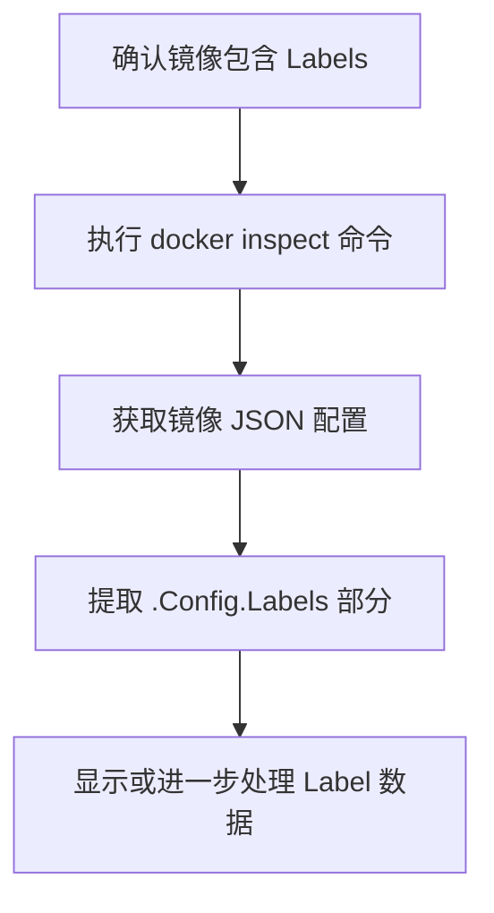

下面是关于使用 Labels 记录镜像元数据（如作者、源代码、JDK、基础镜像等）与依赖 Tags 进行版本控制之间的对比说明：

⸻

Tags 与 Labels 的作用对比

| 特性	Tags | 	Labels |
|---|---|---|
主要用途	标识镜像版本，决定镜像拉取与部署	存储扩展的元数据（作者、源码、构建信息等）
在部署中的作用	直接影响容器运行时拉取的镜像版本	不直接参与部署，仅用于记录和查询信息
管理方式	通过镜像名+标签形式直接指定	内嵌于镜像中，需要额外工具（如 docker inspect）提取
示例	myapp:1.0、myapp:latest	maintainer="John Doe"，jdk.version="11"


⸻

为什么建议使用 Labels 记录扩展元数据
	•	灵活性高
Labels 允许你以键值对的方式记录多种信息，如构建者、源码地址、JDK 版本、基础镜像等，不影响镜像的拉取与部署。
	•	信息扩展
Tags 主要用于版本管理，而 Labels 可为镜像提供额外的描述信息，便于后期审计、调试以及追溯构建过程。
	•	独立性
在发布与部署过程中，系统仅根据 Tags 拉取镜像，而 Labels 则可作为辅助信息存在。如果需要查询或统计这些信息，可以通过额外命令或 API 获取。

⸻

部署与 Registry 使用时的注意事项
	1.	部署调用
	•	Kubernetes Deployment 中通常只需指定镜像名称和 Tag，Labels 信息不会自动加入到 Pod 或 Deployment 配置中。
	•	如需利用 Labels 信息（比如在日志、监控中展示），需要额外的步骤（例如在构建流水线中解析并记录）。
	2.	推送到 GAR（Google Artifact Registry）
	•	GAR 会保留 Docker 镜像的 Labels，但在拉取镜像时仍主要依赖镜像的 Tag。
	•	如果需要获取 Labels 信息（如自动化审计），可通过 docker inspect 或调用 Registry 的 API 来检索。
	3.	如何获取 Labels
	•	使用命令：

docker inspect <image_name>:<tag>

你可以在返回的 JSON 数据中查找 Config.Labels 部分。

	•	在自动化流程中，可编写脚本或使用相关 API 来提取并处理这些信息。

⸻

示例：在 Dockerfile 中设置 Labels
```Dockerfile
FROM openjdk:11-jre-slim
LABEL maintainer="John Doe" \
      source="https://github.com/your-repo" \
      jdk.version="11" \
      base.image="openjdk:11-jre-slim"
```


⸻

Mermaid 流程图：镜像构建、推送与部署流程
```mermaid
graph TD;
    A[编写 Dockerfile (包含 LABEL)] --> B[构建 Docker 镜像];
    B --> C[镜像内嵌 Labels 和 Tag];
    C --> D[推送到 Registry (如 GAR)];
    D --> E[Kubernetes Deployment 使用镜像 Tag 部署];
    E --> F[需要时通过 docker inspect 提取 Labels];
```


⸻

结论
	•	建议合理性
使用 Labels 来记录镜像的扩展信息是合理的，能有效补充 Tags 在版本控制方面的不足。
	•	两者配合使用
保持 Tags 用于镜像版本管理的功能，同时利用 Labels 记录诸如作者、源码、JDK 及基础镜像等信息，可以获得更好的信息追溯与管理效果。
	•	注意事项
	•	在部署（如 Kubernetes）时，仅通过镜像名和 Tag进行调度，Labels 信息需要额外提取。
	•	确保推送至 GAR 时 Labels 能被正确保留，且后续查询方式已确定。

这种方案既不影响部署拉取，又能提供足够的镜像描述信息，适合在实际生产环境中使用。


获取 Docker 镜像中定义的 labels 有几种便捷的方法，下面列出几种常用的方法以及相应示例：

⸻

1. 使用 docker inspect 命令

直接使用 docker inspect 命令可以查看镜像的所有元数据，其中就包含了 labels 信息。例如：

docker inspect --format='{{json .Config.Labels}}' <image>:<tag>

这条命令会直接输出镜像中 Config.Labels 部分的 JSON 数据，便于快速查看。

如果希望输出格式更美观，可以结合 jq 工具：

docker inspect <image>:<tag> | jq '.[0].Config.Labels'


⸻

2. 批量查询多个镜像的 labels

如果你需要同时获取多个镜像的 labels，可以编写一个简单的 Bash 脚本来遍历本地镜像列表：
```bash
for image in $(docker images --format "{{.Repository}}:{{.Tag}}"); do
    echo "Labels for $image:"
    docker inspect --format='{{json .Config.Labels}}' $image | jq .
    echo "-------------------------"
done
```
此脚本会依次显示每个镜像对应的 labels 信息，方便整体管理和查看。

⸻

3. 利用 Registry API

对于推送到 Google Artifact Registry（GAR）或者其他 Docker Registry 的镜像，虽然部署时主要依赖镜像的 tag，但镜像的 labels 信息通常也会被保存。
	•	GAR 的方式：你可以使用 GAR 提供的 API 或控制台来查看镜像详细信息，其中包括 labels 部分。
	•	自动化流程：在 CI/CD 流水线中，可通过调用 Registry API 获取镜像的 JSON 元数据，然后解析出 Config.Labels。

⸻

Mermaid 流程图

下面的 Mermaid 流程图展示了从镜像构建到获取 labels 的基本流程：



⸻

总结
	•	快速获取方式：使用 docker inspect 命令（配合 --format 或 jq）是最直接、快速的方法。
	•	批量处理：可通过脚本遍历镜像列表，方便自动化管理。
	•	Registry 场景：通过 Registry API 或控制台也能查询到 labels，但在部署调用时主要还是依赖 tag，labels 则用于扩展信息查询和审计。

这种方法既满足日常快速查询需求，也便于集成到自动化流程中。