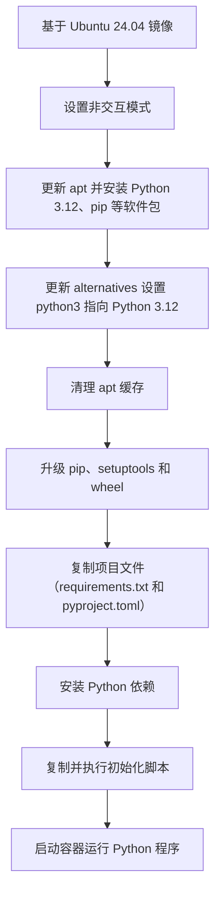
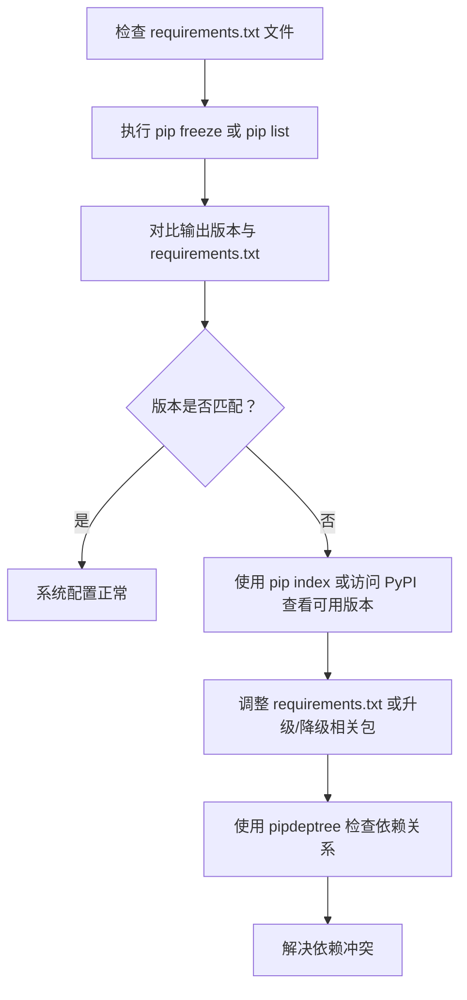

下面给出一个改进后的 Dockerfile 示例，并附上整个构建过程的流程图，帮助你理解如何基于 Ubuntu 24.04 构建 Python 3.12 环境并安装依赖包，同时解决 pip 安装 wheel 构建依赖的问题。注意以下几点：
	1.	更新 setuptools 和 wheel
在构建过程中首先升级这两个包，确保不会因依赖老版本而报错。
	2.	pyproject.toml 配置
如果你的项目中有 pyproject.toml 文件，请根据 官方文档 调整配置，避免使用过时的 License classifiers。可以先用升级后的 setuptools 来构建 wheel，如果仍有问题，再检查该文件配置。
	3.	命令拆分及格式优化
将复杂的 RUN 命令拆分为多个步骤，既提高可读性，也便于调试。

下面是一个示例 Dockerfile：
```Dockerfile
# 使用 Ubuntu 24.04 作为基础镜像
FROM ubuntu:24.04

# 设置非交互模式，避免一些提示
ENV DEBIAN_FRONTEND=noninteractive

# 更新 apt 缓存并安装必要软件包，包括 Python 3.12 和 pip
RUN apt update --fix-missing -y && \
    apt-get install -y --no-install-recommends \
        python3.12 \
        python3.12-venv \
        python3.12-dev \
        python3-pip \
        curl \
    && update-alternatives --install /usr/bin/python3 python3 /usr/bin/python3.12 1 \
    && apt-get clean && rm -rf /var/lib/apt/lists/*

# 升级 pip、setuptools 和 wheel，确保构建 wheel 时不会出现依赖问题
RUN python3 -m pip install --upgrade pip setuptools wheel

# 复制项目文件到镜像中（假设当前目录有 requirements.txt 和 pyproject.toml）
WORKDIR /app
COPY requirements.txt ./
COPY pyproject.toml ./  # 如果项目中有此文件

# 安装 Python 依赖
RUN python3 -m pip install -r requirements.txt

# 如有额外初始化脚本，可以复制并执行
COPY init.sh ./
RUN chmod +x ./init.sh && ./init.sh || echo "No extra setup provided."

# 指定容器启动命令（根据实际需求修改）
CMD ["python3"]
```
流程图说明

下面的 Mermaid 流程图展示了整个构建和安装依赖的步骤：

重点说明
	•	升级 setuptools 与 wheel
提前升级可以确保 pip 在构建 wheel 时能获取到最新的依赖，避免出现 subprocess-exited-with-error 错误。
	•	pyproject.toml 的配置
如果出现 License classifiers 警告，需要检查文件配置是否符合最新的打包规范；参照官方指南调整配置。
	•	错误处理
通过将初始化脚本的执行用 || echo "No extra setup provided." 做容错处理，确保脚本执行失败时不会中断整个构建流程。

这样一个示例 Dockerfile 就能帮助你在 Ubuntu 24.04 上顺利构建 Python 3.12 环境，同时解决 pip 安装依赖时可能出现的问题。


可以采用多种方法来验证和调试系统中 pip 安装的包的版本信息，以及了解可用的版本。以下是几种常见的方法和命令示例：

⸻

1. 使用 pip 命令查看已安装的包版本
	•	列出所有已安装的包及其版本：

pip freeze

或者

pip list


	•	对比 requirements.txt 文件：
你可以将 pip freeze 的输出与 requirements.txt 文件进行对比，确保版本一致。如果存在版本冲突，可能需要手动调整或更新。

⸻

2. 查看 pip 可用的包版本
	•	使用 pip index（pip 23.0 及以上版本支持）：

pip index versions <package_name>

这个命令会显示指定包在 PyPI 上可用的所有版本，便于你调试版本依赖问题。

	•	手动查询：
如果 pip 版本较低，可以直接访问 PyPI 网站 搜索对应包，查看所有可用版本信息。

⸻

3. 检查系统中的 deb 包版本

如果你的系统中还安装了通过 apt 管理的 deb 包，可以使用以下命令获取可用版本信息：
	•	查看 deb 包的版本信息：

apt-cache policy <package_name>

该命令会显示当前安装的版本以及仓库中可用的其他版本。

⸻

4. 使用依赖树工具调试依赖冲突

有时依赖冲突并不明显，可以使用工具生成依赖树：
	•	安装 pipdeptree：

pip install pipdeptree


	•	生成依赖树：

pipdeptree

这样可以清楚地看到各个包之间的依赖关系，便于定位问题。

⸻

调试思路流程图

下面是一个简单的 Mermaid 流程图，描述了验证和调试 pip 包版本的基本流程：


⸻

总结
	•	验证安装的版本： 使用 pip freeze 和 pip list 命令；
	•	检查可用版本： 使用 pip index versions <package_name> 或直接访问 PyPI；
	•	调试依赖冲突： 安装 pipdeptree 查看依赖树，确保依赖链正确；
	•	针对 deb 包： 使用 apt-cache policy <package_name> 来查看系统中的 deb 包版本。

通过以上方法，你可以系统地检查和调试 Ubuntu 环境中 pip 安装包的版本情况。


当 apt 源需要认证时，你需要提供认证信息给 apt 更新命令，常见的方式是通过配置文件来实现。下面介绍两种方案：

⸻

1. 使用 Secret 文件在构建阶段挂载认证信息

在 Dockerfile 中，可以利用 --mount=type=secret 挂载认证文件（例如 /etc/apt/auth.conf），内容格式类似于：

machine your.repo.domain
login your_username
password your_password

示例 Dockerfile 片段：

FROM ubuntu:24.04
ENV DEBIAN_FRONTEND=noninteractive

# 使用 secret 挂载认证信息，然后执行 apt update
RUN --mount=type=secret,id=apt_auth,target=/etc/apt/auth.conf \
    apt update --fix-missing -y

构建时传入 secret 文件：

docker build --secret id=apt_auth,src=/path/to/your/auth.conf -t myimage:debug .

这种方式在构建时挂载认证文件，apt update 就能正确使用认证信息。

⸻

2. 手动在容器内创建认证文件

如果你已经登录到容器中进行调试，可以手动创建认证文件。例如：

cat <<EOF > /etc/apt/auth.conf
machine your.repo.domain
login your_username
password your_password
EOF

然后执行：

apt update --fix-missing -y

这样 apt 就能使用 /etc/apt/auth.conf 里的认证信息来更新源。

⸻

调试流程图

以下是一个简单的 Mermaid 流程图，描述如何在容器中操作：

graph TD;
    A[进入容器] --> B[创建 /etc/apt/auth.conf 文件];
    B --> C[填写认证信息: machine, login, password];
    C --> D[执行 apt update --fix-missing -y];
    D --> E[认证通过，更新源成功];


⸻

总结
	•	构建时：利用 --mount=type=secret 挂载认证文件，确保 apt update 时可用认证信息。
	•	调试时：手动在容器内创建 /etc/apt/auth.conf 文件并填写认证信息，然后运行 apt update。

这两种方式都能帮助你在 apt 源需要登录认证的场景下正常执行更新操作。
