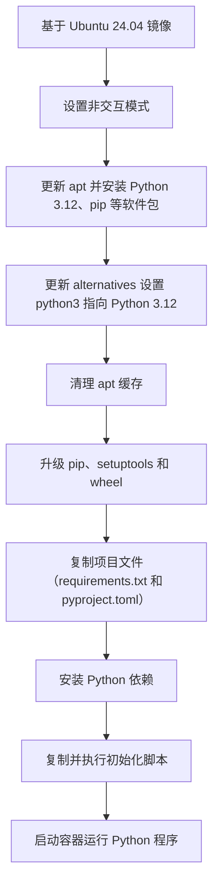

下面给出一个改进后的 Dockerfile 示例，并附上整个构建过程的流程图，帮助你理解如何基于 Ubuntu 24.04 构建 Python 3.12 环境并安装依赖包，同时解决 pip 安装 wheel 构建依赖的问题。注意以下几点：
	1.	更新 setuptools 和 wheel
在构建过程中首先升级这两个包，确保不会因依赖老版本而报错。
	2.	pyproject.toml 配置
如果你的项目中有 pyproject.toml 文件，请根据 官方文档 调整配置，避免使用过时的 License classifiers。可以先用升级后的 setuptools 来构建 wheel，如果仍有问题，再检查该文件配置。
	3.	命令拆分及格式优化
将复杂的 RUN 命令拆分为多个步骤，既提高可读性，也便于调试。

下面是一个示例 Dockerfile：
```Dockerfile
# 使用 Ubuntu 24.04 作为基础镜像
FROM ubuntu:24.04

# 设置非交互模式，避免一些提示
ENV DEBIAN_FRONTEND=noninteractive

# 更新 apt 缓存并安装必要软件包，包括 Python 3.12 和 pip
RUN apt update --fix-missing -y && \
    apt-get install -y --no-install-recommends \
        python3.12 \
        python3.12-venv \
        python3.12-dev \
        python3-pip \
        curl \
    && update-alternatives --install /usr/bin/python3 python3 /usr/bin/python3.12 1 \
    && apt-get clean && rm -rf /var/lib/apt/lists/*

# 升级 pip、setuptools 和 wheel，确保构建 wheel 时不会出现依赖问题
RUN python3 -m pip install --upgrade pip setuptools wheel

# 复制项目文件到镜像中（假设当前目录有 requirements.txt 和 pyproject.toml）
WORKDIR /app
COPY requirements.txt ./
COPY pyproject.toml ./  # 如果项目中有此文件

# 安装 Python 依赖
RUN python3 -m pip install -r requirements.txt

# 如有额外初始化脚本，可以复制并执行
COPY init.sh ./
RUN chmod +x ./init.sh && ./init.sh || echo "No extra setup provided."

# 指定容器启动命令（根据实际需求修改）
CMD ["python3"]
```
流程图说明

下面的 Mermaid 流程图展示了整个构建和安装依赖的步骤：

重点说明
	•	升级 setuptools 与 wheel
提前升级可以确保 pip 在构建 wheel 时能获取到最新的依赖，避免出现 subprocess-exited-with-error 错误。
	•	pyproject.toml 的配置
如果出现 License classifiers 警告，需要检查文件配置是否符合最新的打包规范；参照官方指南调整配置。
	•	错误处理
通过将初始化脚本的执行用 || echo "No extra setup provided." 做容错处理，确保脚本执行失败时不会中断整个构建流程。

这样一个示例 Dockerfile 就能帮助你在 Ubuntu 24.04 上顺利构建 Python 3.12 环境，同时解决 pip 安装依赖时可能出现的问题。
